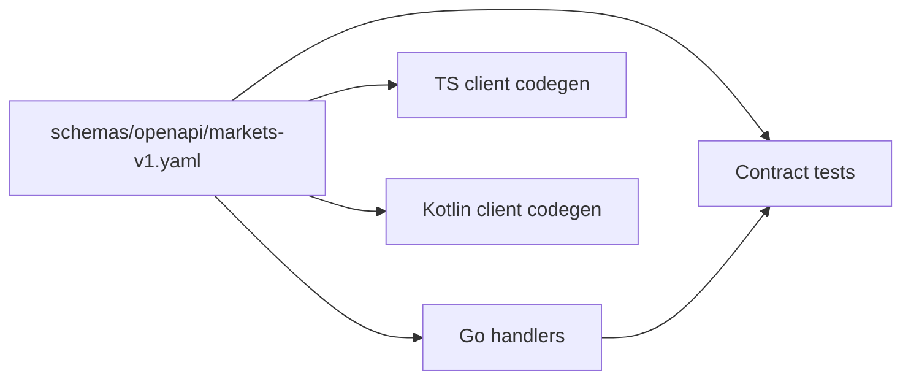

# ADR-004: Shared Web and Android API

**Status:** accepted
**Date:** 2026-07-24
**Last reviewed:** 2026-07-25
**Deciders:** platform-orchestrator, web-markets, android-markets, backend-markets
**Wave:** 1

## Description

This ADR records the accepted decision that `schemas/openapi/markets-v1.yaml` is the canonical Markets V1 client contract. All V1 client network calls use `/api/v1/markets/*` as specified; TypeScript and Kotlin clients are generated; the BFF conforms; CI contract-tests; breaking changes require major version / `markets-v2.yaml`.


Read this before any new Markets route or wire field, when web and Android disagree on names, or after ACL normalizer changes affecting response shape. It does not authorize ad-hoc JSON fields only in Next, a separate “Android API,” or skipping contract tests for “just a rename.”

## 0. Developer intent (5W+1H)

Short orientation for implementers and agents. Read this before **Context / Decision / Consequences** below.

**5W+1H → ADR mapping:** Context = dual-client drift; Decision = single OpenAPI hub; Consequences = codegen discipline and parity-by-construction.

**Do not invent decisions.** If a product request conflicts with Decision, refuse or open an ADR change process—do not “interpret around” accepted text.

| Lens | Answer |
|------|--------|
| **Who** | Deciders: platform-orchestrator, web-markets, android-markets, backend-markets. Audience: anyone adding Markets HTTP fields, client DTOs, or contract tests. |
| **What** | **Decision:** `schemas/openapi/markets-v1.yaml` is the canonical contract. All V1 client network calls use `/api/v1/markets/*` as specified; TS and Kotlin clients are generated; BFF conforms; CI contract-tests; breaking changes require major version / `markets-v2.yaml`. |
| **When** | Before any new Markets route or wire field; when web and Android disagree on names; after ACL normalizer changes affecting response shape; when adding realtime supplements ([ADR-005](ADR-005-REALTIME-AND-RECONCILIATION.md)). |
| **Where** | Spec → Go handlers; web codegen; Android OpenAPI Generator/Ktor models; contract tests; optional `schemas/events/markets/` for WS. Downstream of ACL normalization ([ADR-002](ADR-002-POLYMARKET-ANTI-CORRUPTION-LAYER.md)). |
| **How** | Change the spec first (or same PR as handlers); run `pnpm markets:codegen` and Android `openApiGenerate`; never hand-maintain a parallel Android DTO layer that drifts from web. |

### Worked example

**What a developer must do differently because of this ADR**

Web needs `primaryFeedId` for chart subscribe.

1. Add the field to OpenAPI.
2. Implement BFF normalizer/handler.
3. Regenerate TypeScript **and** Kotlin clients.
4. Update both UIs from generated types—parity by default.

**Failure / Never-V1 (still bound by Decision)**

- Ad-hoc JSON fields only in the Next data layer.
- Separate “Android API” forks of Markets.
- Skipping contract tests for “just a rename.”

**Agent checklist**

- [ ] Spec changed in the same change set as handlers?
- [ ] Both clients regenerated?
- [ ] Contract tests updated/green?
- [ ] Breaking change → version policy followed?
- [ ] WS extras documented if needed?

**ADR section map**

| Lens | Read in this ADR |
|------|------------------|
| Who / Why | Context, Forces, Deciders metadata |
| What / How | Decision (+ Implementation Notes if present) |
| When / Where | Status/Date, Links, repo/API constraints |
| Day-2 behavior | Consequences, Review Checklist |


## Context

RetroPick Markets V1 ships on **two primary clients**:

| Client | Stack | Release cadence |
|--------|-------|-----------------|
| Web | Next.js / TypeScript | Continuous deploy |
| Android | Kotlin / Jetpack Compose | Play Store staged rollout |

Without a shared contract, teams inevitably diverge:
- Different field names for the same concept (`marketId` vs `condition_id`)
- Feature shipped on web but not Android (or vice versa)
- Inconsistent error handling and eligibility behavior
- Duplicate integration tests against BFF

The monorepo integration rule from [docs/ARCHITECTURE.md](../../../../docs/ARCHITECTURE.md) states:


### Forces

- **Client parity** is a product requirement for V1 launch.
- **Codegen** reduces manual client drift.
- **Contract tests** provide a single conformance target.
- **BFF anti-corruption layer** ([ADR-002](ADR-002-POLYMARKET-ANTI-CORRUPTION-LAYER.md)) produces one normalized API shape.

## Decision

**A single OpenAPI 3.1 specification** at `schemas/openapi/markets-v1.yaml` is the **canonical contract** between the Markets BFF and all V1 clients.

1. **All** Markets client network calls target `/api/v1/markets/*` as defined in the spec.
2. **Web** generates TypeScript types/client from the spec (`openapi-typescript` or equivalent).
3. **Android** generates Kotlin client from the same spec (`openapi-generator` or Ktor manual with generated models).
4. **BFF handlers** are implemented to conform to the spec; spec changes precede or accompany handler changes.
5. **Contract tests** in CI validate BFF responses against the spec and fixtures.
6. **Versioning:** spec `info.version` semver; breaking changes require major version bump (`markets-v2.yaml`).

### Contract hub diagram



## Consequences

### Positive

- **Parity by construction** — same operations, schemas, error codes.
- **Single review surface** — API changes visible in one PR diff.
- **Documentation** — OpenAPI is living docs for QA and partners.
- **Faster Android development** — no hand-written Retrofit interfaces.
- **Conformance CI** — drift caught before release.

### Negative

- **Codegen workflow** — developers must run codegen after spec changes.
- **Lowest common denominator** — exotic web-only optimizations harder.
- **OpenAPI expressiveness limits** — some realtime patterns need supplementary docs.
- **Coordination overhead** — three teams touch one file.

### Mitigations

- `pnpm markets:codegen` script in root package.json
- Android Gradle task `openApiGenerate`
- Supplemental WebSocket schema in `schemas/events/markets/` for realtime ([ADR-005](ADR-005-REALTIME-AND-RECONCILIATION.md))

## Alternatives Considered

### Alternative A: Separate web and Android API specs

Two YAML files maintained in parallel.

| Issue | Verdict |
|-------|---------|
| Drift | Inevitable |
| **Outcome** | **Rejected** |

### Alternative B: GraphQL schema as contract

| Issue | Verdict |
|-------|---------|
| Android tooling | Weaker than OpenAPI |
| Caching | Complexity |
| **Outcome** | **Rejected** |

### Alternative C: Protobuf/gRPC

| Issue | Verdict |
|-------|---------|
| Web browser | Poor fit |
| Existing BFF | REST already started |
| **Outcome** | **Rejected** for V1 |

### Alternative D: Single OpenAPI (chosen)

| Issue | Verdict |
|-------|---------|
| WS supplement needed | Acceptable |
| **Outcome** | **Accepted** |

## Implementation Notes

### Current spec scope (Phase R3)

Initial paths:
- `GET /markets/eligibility`
- `GET /markets/capabilities`
- `GET /markets/events`

Trading paths added in Phase 3+:
- `POST /markets/orders/preview`
- `POST /markets/orders`
- `GET /markets/orders`
- Portfolio, funding, intelligence endpoints per phase specs

### Codegen targets

| Client | Output path | Tool |
|--------|-------------|------|
| Web | `apps/web/src/products/markets/lib/api/generated/` | openapi-typescript |
| Android | `apps/android-markets/core/network/src/main/kotlin/.../generated/` | openapi-generator |

### Breaking change policy

1. Additive changes (new optional fields) — minor version bump
2. New endpoints — minor version bump
3. Removed/renamed fields — major version; coordinate client min versions
4. Deprecation window: 90 days minimum in production

### Error schema (shared)

```yaml
ErrorResponse:
  type: object
  required: [code, message]
  properties:
    code:
      type: string
      enum: [unauthorized, ineligible, upstream_unavailable, ...]
    message:
      type: string
    retryAfter:
      type: integer
```

Both clients map `code` to localized UX strings.

## Links

- [ADR-002: Anti-Corruption Layer](ADR-002-POLYMARKET-ANTI-CORRUPTION-LAYER.md)
- [backend/API_AND_REALTIME_CONTRACTS.md](../../backend/API_AND_REALTIME_CONTRACTS.md)
- [testing/CONTRACT_AND_CONFORMANCE_TESTS.md](../../testing/CONTRACT_AND_CONFORMANCE_TESTS.md)
- [TARGET_MONOREPO_ARCHITECTURE.md](../TARGET_MONOREPO_ARCHITECTURE.md)
- [android/COMPOSE_APP_ARCHITECTURE.md](../../android/COMPOSE_APP_ARCHITECTURE.md)

## Review Checklist

- [x] Single `markets-v1.yaml` in repo
- [x] No hand-written duplicate DTOs withoutcodegen
- [x] CI contract test job defined
- [x] Web and Android use same error codes
