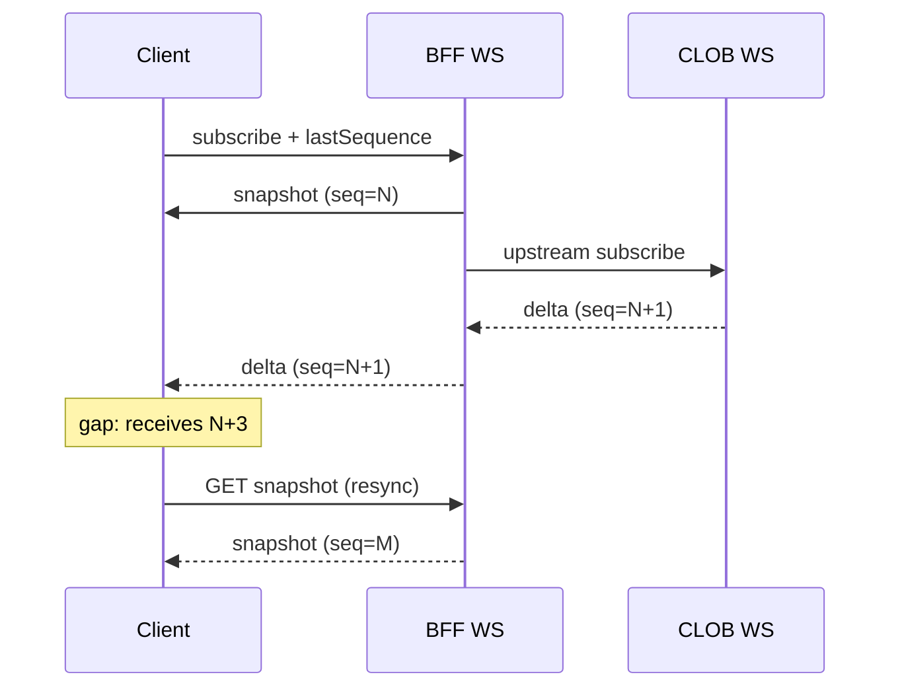

# ADR-005: Realtime and Reconciliation

**Status:** accepted
**Date:** 2026-07-24
**Last reviewed:** 2026-07-25
**Deciders:** platform-orchestrator, backend-markets
**Wave:** 1

## Description

This ADR records the accepted realtime model: snapshot + sequenced deltas + gap recovery. REST snapshots carry `sequence`/`version`; WebSocket deltas are monotonic; on gap, stop applying and refetch snapshot; the BFF aggregates upstream WS; heartbeats and bounded backoff apply; stale badges appear when snapshot age exceeds policy; portfolio is reconciled by indexer jobs.

It sits with ADR-002 (upstream WS via ACL) and ADR-004 (shared client protocol), and informs failure-domain degraded REST poll when WS is down. Correctness beats blind infinite streaming—especially after mobile backgrounding, LB idle timeouts, upstream sequence resets, and chain reorgs.

Read this when building live books/orders/portfolio/signal channels, reconnect after backgrounding, or scaling fan-out. It does not allow inventing mid/prices when snapshots are known stale, one upstream CLOB socket per end-user without BFF aggregation, or skipping REST resync to save mobile data.

## 0. Developer intent (5W+1H)

Short orientation for implementers and agents. Read this before **Context / Decision / Consequences** below.

**5W+1H → ADR mapping:** Context = WS best-effort + mobile gaps; Decision = snapshot + sequenced deltas + gap resync; Consequences = correctness over blind streaming.

**Do not invent decisions.** If a product request conflicts with Decision, refuse or open an ADR change process—do not “interpret around” accepted text.

| Lens | Answer |
|------|--------|
| **Who** | Deciders: platform-orchestrator, backend-markets. Audience: realtime/wshub owners; web/Android book/order/portfolio UIs; indexer/reorg owners; agents implementing WS channels. |
| **What** | **Decision:** Snapshot + delta + gap recovery. REST snapshot with `sequence`/`version`; WS deltas monotonic; on gap, stop applying and refetch snapshot; BFF aggregates upstream WS; 30s heartbeat with bounded backoff; stale badge if snapshot age > 10s; portfolio reconciled by indexer jobs. |
| **When** | Building live books/orders/portfolio/signal channels; reconnect after backgrounding; scaling fan-out; degraded REST poll when WS is down (see failure-domains doc). |
| **Where** | BFF WebSocket path + CLOB upstream via ACL ([ADR-002](ADR-002-POLYMARKET-ANTI-CORRUPTION-LAYER.md)); shared client protocol ([ADR-004](ADR-004-SHARED-WEB-ANDROID-API.md)); indexer docs for chain reorgs. |
| **Why** | Context: mobile background drops, LB idle timeouts, upstream sequence resets, reorgs → wrong prices/orders if clients only append forever. Must be unit-testable without live WS. |
| **How** | Subscribe with `lastSequence` → apply only contiguous deltas → gap ⇒ GET snapshot → resume. Pool upstream subscriptions; show delayed UX rather than fabricating levels. |

### Worked example

**What a developer must do differently because of this ADR**

Android resumes; last applied seq was N; next message is N+3.

1. Do **not** apply N+3 and hope.
2. Discard partial state; refetch snapshot (seq M).
3. Show delayed badge if snapshot age warrants.
4. Resume deltas from M; keep web on the same protocol.

**Failure / Never-V1 (still bound by Decision)**

- Trusting infinite WS without sequence checks.
- One upstream CLOB socket per end-user without BFF aggregation.
- Inventing mid/prices when the snapshot is known stale.
- Skipping REST resync because “mobile data is expensive.”

**Agent checklist**

- [ ] Snapshot fields include sequence/version?
- [ ] Gap detection stops delta application?
- [ ] Heartbeat/backoff within policy?
- [ ] Stale UX wired?
- [ ] Upstream fan-in pooled at BFF?

**ADR section map**

| Lens | Read in this ADR |
|------|------------------|
| Who / Why | Context, Forces, Deciders metadata |
| What / How | Decision (+ Implementation Notes if present) |
| When / Where | Status/Date, Links, repo/API constraints |
| Day-2 behavior | Consequences, Review Checklist |


## Context

Markets trading UX requires low-latency updates:

- Order book depth and best bid/ask
- User order status changes (open → filled → cancelled)
- Portfolio position and PnL changes
- Intelligence signals (lower frequency)

Polymarket CLOB provides WebSocket streams; clients could subscribe directly, but [ADR-002](ADR-002-POLYMARKET-ANTI-CORRUPTION-LAYER.md) routes realtime through the BFF.

WebSocket delivery is **best-effort**:
- Connections drop on mobile backgrounding
- Load balancers timeout idle connections
- Upstream may gap or reset sequence numbers
- Chain reorgs affect indexed portfolio state

Without a reconciliation strategy, clients show **incorrect prices or order states** after reconnect.

### Forces

- Mobile clients cannot maintain perpetual WS ([android/STATE_DATA_OFFLINE_AND_REALTIME.md](../../android/STATE_DATA_OFFLINE_AND_REALTIME.md))
- **Optimistic UI** must reconcile to authoritative REST snapshot
- **Sequence gaps** must be detectable and recoverable
- BFF must not fan out unbounded upstream connections per user

## Decision

Adopt a **snapshot + delta + gap recovery** model for Markets V1 realtime:

1. **Initial state:** client fetches REST snapshot (order book, open orders) with `sequence` or `version` field.
2. **Deltas:** WebSocket channel delivers incremental updates tagged with monotonic `sequence`.
3. **Gap detection:** if `sequence != lastSequence + 1`, client **stops applying deltas** and refetches snapshot.
4. **BFF aggregation:** single upstream WS connection per market (or pool) fanned out to subscribed clients via `internal/realtime` / `wshub`.
5. **Reconciliation jobs:** background indexer reconciles on-chain and CLOB state for portfolio ([backend/INDEXING_RECONCILIATION_AND_REORGS.md](../../backend/INDEXING_RECONCILIATION_AND_REORGS.md)).
6. **Heartbeat:** 30s ping/pong; client reconnects with exponential backoff (max 30s).
7. **Stale indicator:** if snapshot age > 10s, UI shows "delayed" badge.



## Consequences

### Positive

- **Correctness after reconnect** — snapshot heals gaps
- **Single upstream connection** — efficient BFF resource use
- **Testable** — sequence logic unit tested without live WS
- **Consistent web/Android** — same protocol ([ADR-004](ADR-004-SHARED-WEB-ANDROID-API.md))

### Negative

- **Resync latency** — full snapshot on gap (acceptable for retail UX)
- **BFF WS scaling** — sticky sessions or pub/sub required at scale
- **Complexity** — sequence management in normalizer

### Failure interaction

See [FAILURE_DOMAINS_AND_DEGRADED_MODES.md](../FAILURE_DOMAINS_AND_DEGRADED_MODES.md): WS down → poll REST every 5s for critical screens.

## Alternatives Considered

### Alternative A: WS only, no sequence

| Issue | Verdict |
|-------|---------|
| Silent corruption | Unacceptable |
| **Outcome** | **Rejected** |

### Alternative B: Client direct CLOB WS

| Issue | Verdict |
|-------|---------|
| ADR-002 violation | Rejected |
| **Outcome** | **Rejected** |

### Alternative C: Server-sent events (SSE)

| Issue | Verdict |
|-------|---------|
| Android support | Poor vs WS |
| Bidirectional | No |
| **Outcome** | **Rejected** |

### Alternative D: Snapshot + sequence (chosen)

| Issue | Verdict |
|-------|---------|
| Resync cost | Acceptable |
| **Outcome** | **Accepted** |

## Implementation Notes

### Channel naming

`markets:book:{marketId}`, `markets:orders:{userId}`, `markets:signals:{tier}`

### WS auth

Subscribe to user channels requires valid session; book channels may be public with rate limits.

### Event schema

`schemas/events/markets/realtime-envelope.json`:
```json
{
  "type": "book_delta",
  "sequence": 12345,
  "marketId": "...",
  "payload": { }
}
```

### Reorg handling

Indexer marks positions `syncing` on reorg depth > 1; client refetches portfolio snapshot.

## Links

- [ADR-002](ADR-002-POLYMARKET-ANTI-CORRUPTION-LAYER.md)
- [ADR-004](ADR-004-SHARED-WEB-ANDROID-API.md)
- [polymarket/MARKET_DATA_AND_REALTIME.md](../../polymarket/MARKET_DATA_AND_REALTIME.md)
- [backend/API_AND_REALTIME_CONTRACTS.md](../../backend/API_AND_REALTIME_CONTRACTS.md)
- [FAILURE_DOMAINS_AND_DEGRADED_MODES.md](../FAILURE_DOMAINS_AND_DEGRADED_MODES.md)

## Review Checklist

- [x] Sequence in snapshot and delta messages
- [x] Gap recovery tested
- [x] WS auth on private channels
- [x] Polling fallback documented
