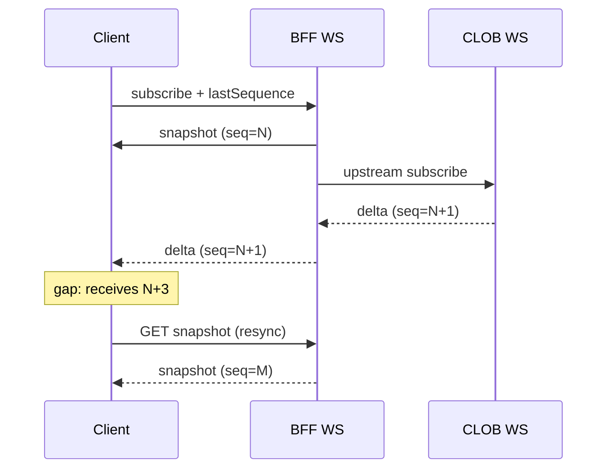

# ADR-005: Realtime and Reconciliation

**Status:** accepted
**Date:** 2026-07-24
**Last reviewed:** 2026-07-25
**Deciders:** platform-orchestrator, backend-markets
**Wave:** 1

## Context

Markets trading UX requires low-latency updates:

- Order book depth and best bid/ask
- User order status changes (open → filled → cancelled)
- Portfolio position and PnL changes
- Intelligence signals (lower frequency)

Polymarket CLOB provides WebSocket streams; clients could subscribe directly, but [ADR-002](ADR-002-POLYMARKET-ANTI-CORRUPTION-LAYER.md) routes realtime through the BFF.

WebSocket delivery is **best-effort**:
- Connections drop on mobile backgrounding
- Load balancers timeout idle connections
- Upstream may gap or reset sequence numbers
- Chain reorgs affect indexed portfolio state

Without a reconciliation strategy, clients show **incorrect prices or order states** after reconnect.

### Forces

- Mobile clients cannot maintain perpetual WS ([android/STATE_DATA_OFFLINE_AND_REALTIME.md](../../android/STATE_DATA_OFFLINE_AND_REALTIME.md))
- **Optimistic UI** must reconcile to authoritative REST snapshot
- **Sequence gaps** must be detectable and recoverable
- BFF must not fan out unbounded upstream connections per user

## Decision

Adopt a **snapshot + delta + gap recovery** model for Markets V1 realtime:

1. **Initial state:** client fetches REST snapshot (order book, open orders) with `sequence` or `version` field.
2. **Deltas:** WebSocket channel delivers incremental updates tagged with monotonic `sequence`.
3. **Gap detection:** if `sequence != lastSequence + 1`, client **stops applying deltas** and refetches snapshot.
4. **BFF aggregation:** single upstream WS connection per market (or pool) fanned out to subscribed clients via `internal/realtime` / `wshub`.
5. **Reconciliation jobs:** background indexer reconciles on-chain and CLOB state for portfolio ([backend/INDEXING_RECONCILIATION_AND_REORGS.md](../../backend/INDEXING_RECONCILIATION_AND_REORGS.md)).
6. **Heartbeat:** 30s ping/pong; client reconnects with exponential backoff (max 30s).
7. **Stale indicator:** if snapshot age > 10s, UI shows "delayed" badge.



## Consequences

### Positive

- **Correctness after reconnect** — snapshot heals gaps
- **Single upstream connection** — efficient BFF resource use
- **Testable** — sequence logic unit tested without live WS
- **Consistent web/Android** — same protocol ([ADR-004](ADR-004-SHARED-WEB-ANDROID-API.md))

### Negative

- **Resync latency** — full snapshot on gap (acceptable for retail UX)
- **BFF WS scaling** — sticky sessions or pub/sub required at scale
- **Complexity** — sequence management in normalizer

### Failure interaction

See [FAILURE_DOMAINS_AND_DEGRADED_MODES.md](../FAILURE_DOMAINS_AND_DEGRADED_MODES.md): WS down → poll REST every 5s for critical screens.

## Alternatives Considered

### Alternative A: WS only, no sequence

| Issue | Verdict |
|-------|---------|
| Silent corruption | Unacceptable |
| **Outcome** | **Rejected** |

### Alternative B: Client direct CLOB WS

| Issue | Verdict |
|-------|---------|
| ADR-002 violation | Rejected |
| **Outcome** | **Rejected** |

### Alternative C: Server-sent events (SSE)

| Issue | Verdict |
|-------|---------|
| Android support | Poor vs WS |
| Bidirectional | No |
| **Outcome** | **Rejected** |

### Alternative D: Snapshot + sequence (chosen)

| Issue | Verdict |
|-------|---------|
| Resync cost | Acceptable |
| **Outcome** | **Accepted** |

## Implementation Notes

### Channel naming

`markets:book:{marketId}`, `markets:orders:{userId}`, `markets:signals:{tier}`

### WS auth

Subscribe to user channels requires valid session; book channels may be public with rate limits.

### Event schema

`schemas/events/markets/realtime-envelope.json`:
```json
{
  "type": "book_delta",
  "sequence": 12345,
  "marketId": "...",
  "payload": { }
}
```

### Reorg handling

Indexer marks positions `syncing` on reorg depth > 1; client refetches portfolio snapshot.

## Links

- [ADR-002](ADR-002-POLYMARKET-ANTI-CORRUPTION-LAYER.md)
- [ADR-004](ADR-004-SHARED-WEB-ANDROID-API.md)
- [polymarket/MARKET_DATA_AND_REALTIME.md](../../polymarket/MARKET_DATA_AND_REALTIME.md)
- [backend/API_AND_REALTIME_CONTRACTS.md](../../backend/API_AND_REALTIME_CONTRACTS.md)
- [FAILURE_DOMAINS_AND_DEGRADED_MODES.md](../FAILURE_DOMAINS_AND_DEGRADED_MODES.md)

## Review Checklist

- [x] Sequence in snapshot and delta messages
- [x] Gap recovery tested
- [x] WS auth on private channels
- [x] Polling fallback documented
