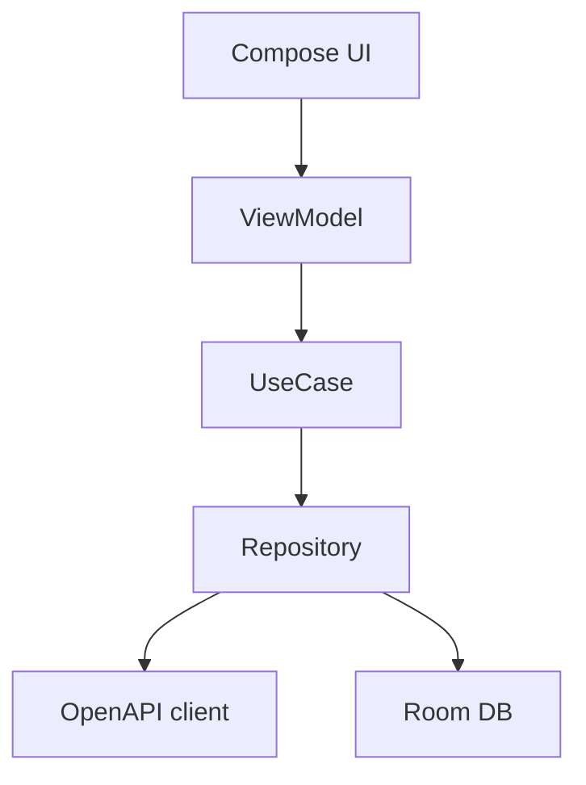

# ADR-006: Android Jetpack Compose

**Status:** accepted
**Date:** 2026-07-24
**Last reviewed:** 2026-07-25
**Deciders:** platform-orchestrator, android-markets, design
**Wave:** 1

## Context

RetroPick Markets V1 requires a **native Android application** for Play Store distribution. Android UI technology options:

| Option | Maturity | Team skill | Markets fit |
|--------|----------|------------|-------------|
| XML Views + Fragments | Legacy | Mixed | High maintenance |
| Jetpack Compose | Modern (2026) | Target skill | Declarative, testable |
| React Native / Flutter | Cross-platform | New stack | Violates native + OpenAPI codegen path |
| WebView shell | Fast | Low | Poor trading UX, wallet friction |

Product requirements ([android/ANDROID_PRODUCT_SCOPE.md](../../android/ANDROID_PRODUCT_SCOPE.md)):
- 60fps order book scrolling
- WalletConnect integration
- Offline catalog cache
- Material Design 3 alignment with web design tokens
- Play Store financial app compliance

### Forces

- Web is Next.js — **not** shared UI code with mobile
- [ADR-004](ADR-004-SHARED-WEB-ANDROID-API.md) shares **API** not UI
- Google recommends Compose for new apps (2026)
- Existing `apps/android/` is a Compose scaffold

## Decision

Build Markets Android V1 with **Kotlin + Jetpack Compose** exclusively:

1. Target app: `apps/android-markets/` (migrate from `apps/android/` scaffold).
2. **No XML layouts** for new features; Compose only.
3. Architecture: **unidirectional data flow** with ViewModel + StateFlow.
4. Navigation: **Navigation Compose** with typed routes ([android/NAVIGATION_AND_DEEP_LINKS.md](../../android/NAVIGATION_AND_DEEP_LINKS.md)).
5. DI: **Hilt** for dependency injection.
6. Network: **OpenAPI-generated** client ([ADR-004](ADR-004-SHARED-WEB-ANDROID-API.md)).
7. Min SDK: API 26 (Android 8.0); target SDK: latest stable Policy requirement.

## Consequences

### Positive

- **Modern toolkit** — less boilerplate than Views
- **Preview-driven development** — `@Preview` for components
- **Testability** — ViewModel unit tests without device
- **Alignment with Google** — long-term support path
- **Performance** — efficient list rendering for order books (LazyColumn)

### Negative

- **Learning curve** — team must be proficient in Compose
- **Library ecosystem** — some third-party SDKs still View-based (wrap in AndroidView)
- **No code sharing with web** — parallel UI implementation
- **Compose version churn** — requires periodic upgrades

### Module structure

Per [android/GRADLE_MODULE_GRAPH.md](../../android/GRADLE_MODULE_GRAPH.md):
- `:app` — entry, DI graph
- `:core:network`, `:core:auth`, `:core:design`
- `:feature:catalog`, `:feature:trading`, `:feature:portfolio`, `:feature:intelligence`, `:feature:wallet`

## Alternatives Considered

### Alternative A: XML Views

| Issue | Verdict |
|-------|---------|
| Velocity | Slower new development |
| **Outcome** | **Rejected** |

### Alternative B: Flutter

| Issue | Verdict |
|-------|---------|
| OpenAPI Kotlin codegen | Awkward |
| Wallet SDK | Native bridge complexity |
| **Outcome** | **Rejected** |

### Alternative C: React Native

| Issue | Verdict |
|-------|---------|
| Performance | Order book concern |
| Consistency | Third stack in monorepo |
| **Outcome** | **Rejected** |

### Alternative D: Jetpack Compose (chosen)

| Issue | Verdict |
|-------|---------|
| Greenfield skill | Training investment |
| **Outcome** | **Accepted** |

## Implementation Notes

### Design system

Shared tokens with web via [web/DESIGN_SYSTEM_AND_ACCESSIBILITY.md](../../web/DESIGN_SYSTEM_AND_ACCESSIBILITY.md) — color, typography, spacing JSON or Figma source of truth.

### Testing

- Unit: ViewModel + UseCase (JUnit5)
- UI: Compose UI tests for critical flows
- E2E: Firebase Test Lab / Maestro ([android/ANDROID_TEST_STRATEGY.md](../../android/ANDROID_TEST_STRATEGY.md))

### Play release

[android/PLAY_STORE_COMPLIANCE_AND_RELEASE.md](../../android/PLAY_STORE_COMPLIANCE_AND_RELEASE.md) — tracks in [DEPLOYMENT_ARCHITECTURE.md](../DEPLOYMENT_ARCHITECTURE.md).

## Links

- [ADR-004: Shared API](ADR-004-SHARED-WEB-ANDROID-API.md)
- [android/COMPOSE_APP_ARCHITECTURE.md](../../android/COMPOSE_APP_ARCHITECTURE.md)
- [TARGET_MONOREPO_ARCHITECTURE.md](../TARGET_MONOREPO_ARCHITECTURE.md)
- [phases/PHASE-5-ANDROID-COMPOSE-MARKETS.md](../../phases/PHASE-5-ANDROID-COMPOSE-MARKETS.md)

### Compose interop for legacy SDKs

Some wallet and charting SDKs still ship View-based APIs. Wrap them with `AndroidView` in isolated composables at the `:feature:*` boundary — never spread `AndroidView` into core design components. Prefer SDKs with Compose-first APIs when available (WalletConnect modal, Accompanist where appropriate).

### Version pinning

Use Compose BOM in `gradle/libs.versions.toml`:
- Compose BOM aligned with Kotlin version
- Monthly review of stable channel releases
- Upgrade in dedicated PR with screenshot regression on catalog and order ticket screens

### Accessibility

Markets V1 targets WCAG 2.1 AA alignment per [android/ACCESSIBILITY_PERFORMANCE_AND_DEVICES.md](../../android/ACCESSIBILITY_PERFORMANCE_AND_DEVICES.md):
- Semantic headings on market detail
- TalkBack labels on order book rows
- Minimum 48dp touch targets on trade buttons
- Respect system font scaling (no hard-coded `sp` caps)

## Review Checklist

- [x] No new XML layout files in feature modules
- [x] OpenAPI codegen wired
- [x] Min/target SDK documented
- [x] Compose BOM version pinned in catalog
