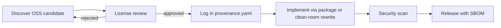

# ADR-007: OSS Adoption and Clean Room

**Status:** accepted
**Date:** 2026-07-24
**Last reviewed:** 2026-07-25
**Deciders:** platform-orchestrator, legal, markets-engineering
**Wave:** 1

## Description

This ADR records the accepted clean-room OSS policy for Markets V1: no copy-paste without license review and a `research/open-source-provenance.yaml` entry; prefer MIT/Apache-2.0/BSD; copyleft default deny; Polymarket-adjacent repos are reference-only unless reviewed; prefer package-manager deps; vendor with NOTICE; reimplement intelligence heuristics with documented provenance; CI audit/govulncheck/Dependabot; SBOM on release.

It sits in Wave 1 beside intelligence OSS adoption maps and research audits. Velocity must not outrun legal and security: GPL contamination, unknown IP, unvetted vulns, fork drift, and provenance gaps are the failure modes this decision blocks. Markets-specific venue adapters are not contributed upstream into Polymarket private repos as a shortcut.

Read this before pasting/vendoring third-party source, adopting wallet/chart/CLOB samples, implementing whale/arb heuristics inspired by public repos, or cutting a release SBOM. It does not invent new license exceptions; “works locally” is not license approval.

## 0. Developer intent (5W+1H)

Short orientation for implementers and agents. Read this before **Context / Decision / Consequences** below.

**5W+1H → ADR mapping:** Context = license/IP/security risk of blind copy; Decision = clean-room + provenance; Consequences = slower reuse, defensible SBOM.

**Do not invent decisions.** If a product request conflicts with Decision, refuse or open an ADR change process—do not “interpret around” accepted text.

| Lens | Answer |
|------|--------|
| **Who** | Deciders: platform-orchestrator, legal, markets-engineering. Audience: engineers adopting libs; intelligence authors; agents pulling GitHub reference code; security/supply-chain. |
| **What** | **Decision:** Clean-room OSS policy. No copy-paste without license review + `research/open-source-provenance.yaml` entry. Prefer MIT/Apache-2.0/BSD; copyleft default **deny**. Polymarket-adjacent repos are reference-only unless reviewed. Prefer package-manager deps; vendor with NOTICE. Reimplement intelligence heuristics with documented provenance. CI audit/govulncheck/Dependabot; SBOM on release. |
| **When** | Before pasting/vendoring third-party source; adopting wallet/chart/CLOB samples; implementing whale/arb heuristics inspired by public repos; cutting a release SBOM. |
| **Where** | Provenance YAML; intelligence OSS adoption map; dependency manifests; release SBOM. Do not silently fork Polymarket private SDKs into the monorepo. |
| **Why** | Context: GPL contamination, unknown IP/patents, unvetted vulns, fork drift, provenance gaps. Velocity must not outrun legal and security. |
| **How** | Discover → license review → log provenance → package or clean-room rewrite → scan → ship with SBOM. On reject, pick another candidate. Do not contribute Markets-specific venue adapters upstream to Polymarket private repos. |

### Worked example

**What a developer must do differently because of this ADR**

GPL order-book widget + MIT chart lib + Polymarket sample CLOB client.

1. Deny GPL paste.
2. Adopt MIT via package manager (or rewrite); log provenance.
3. Read the sample for understanding; reimplement behind the BFF ACL in RetroPick style.
4. Run audit/govulncheck before merge; include SBOM on release builds.

**Failure / Never-V1 (still bound by Decision)**

- Dropping unscanned GitHub trees into `apps/`.
- Copying intelligence heuristics verbatim without provenance.
- Treating “works locally” as license approval.
- Vendoring without NOTICE / attribution.

**Agent checklist**

- [ ] License reviewed and compatible?
- [ ] Provenance YAML entry added?
- [ ] Package manager preferred over paste?
- [ ] Security scan clean?
- [ ] SBOM path known for release?

**ADR section map**

| Lens | Read in this ADR |
|------|------------------|
| Who / Why | Context, Forces, Deciders metadata |
| What / How | Decision (+ Implementation Notes if present) |
| When / Where | Status/Date, Links, repo/API constraints |
| Day-2 behavior | Consequences, Review Checklist |

## Context

Building Markets V1 involves integrating with Polymarket APIs and potentially adopting open-source libraries for:

- Order book rendering
- Wallet connectivity (wagmi, WalletConnect, viem)
- Charting and analytics
- Reference implementations of CLOB clients
- Intelligence heuristics (whale detection, arbitrage scanners)

Blind copy-paste from GitHub repositories creates:

- **License contamination** — GPL/AGPL in proprietary product
- **Patent exposure** — unknown IP encumbrance
- **Security vulnerabilities** — unvetted code in production
- **Maintenance debt** — fork drift from upstream
- **Provenance gaps** — inability to answer "where did this code come from?"

The intelligence spec ([intelligence/OPEN_SOURCE_ADOPTION_MAP.md](../../intelligence/OPEN_SOURCE_ADOPTION_MAP.md)) and research audit ([research/OPEN_SOURCE_REFERENCE_AUDIT.md](../../research/OPEN_SOURCE_REFERENCE_AUDIT.md)) catalog candidate projects.

### Forces

- Engineering velocity favors reuse over rewrite
- Legal requires **license compatibility** with commercial distribution (web + Play Store)
- Security requires **SBOM** and dependency scanning ([security/SUPPLY_CHAIN_AND_SBOM.md](../../security/SUPPLY_CHAIN_AND_SBOM.md))
- Clean-room rules prevent accidental Polymarket proprietary SDK misuse

## Decision

Adopt a **clean-room OSS policy** for Markets V1:

1. **No copy-paste** of source code without explicit license review and provenance entry in `research/open-source-provenance.yaml`.
2. **Permissive licenses preferred:** MIT, Apache-2.0, BSD. Copyleft (GPL, AGPL) requires legal approval — default **deny**.
3. **Reference-only** for Polymarket-adjacent repos: read for understanding; reimplement in RetroPick code style; do not fork into monorepo without review.
4. **Dependency via package manager** preferred over vendoring; vendored code requires `NOTICE` file attribution.
5. **Intelligence algorithms:** document source papers/repos in signal provenance ([intelligence/SIGNAL_PROVENANCE_CALIBRATION_AND_RETRACTIONS.md](../../intelligence/SIGNAL_PROVENANCE_CALIBRATION_AND_RETRACTIONS.md)); reimplement — do not copy heuristic code verbatim.
6. **CI gates:** `npm audit`, `govulncheck`, Dependabot; SBOM on release builds.
7. **Contribution boundary:** RetroPick does not contribute Markets-specific venue adapters upstream to Polymarket private repos.

### Adoption workflow

## Consequences

### Positive

- **Legal defensibility** — documented provenance trail
- **Security posture** — scanned dependencies
- **Maintainability** — package manager updates vs fork merges
- **Clear IP ownership** — RetroPick owns clean-room implementations

### Negative

- **Slower than copy-paste** — rewrite takes time
- **Review bottleneck** — legal review for edge licenses
- **May reimplement solved problems** — acceptable tradeoff

### Required artifacts

| Artifact | Location |
|----------|----------|
| Provenance log | `research/open-source-provenance.yaml` |
| Evidence register | `research/EVIDENCE_REGISTER.md` |
| Adoption map | `intelligence/OPEN_SOURCE_ADOPTION_MAP.md` |
| SBOM | CI artifact per release |

## Alternatives Considered

### Alternative A: Permissive copy-paste without review

| Issue | Verdict |
|-------|---------|
| License risk | Unacceptable |
| **Outcome** | **Rejected** |

### Alternative B: No OSS at all

| Issue | Verdict |
|-------|---------|
| Velocity | Too slow |
| Wallet libs | Must use OSS |
| **Outcome** | **Rejected** |

### Alternative C: Fork Polymarket reference client into monorepo

| Issue | Verdict |
|-------|---------|
| License unknown | Risk |
| ADR-002 | BFF owns integration |
| **Outcome** | **Rejected** |

### Alternative D: Clean-room with provenance (chosen)

| Issue | Verdict |
|-------|---------|
| Process overhead | Acceptable |
| **Outcome** | **Accepted** |

## Implementation Notes

### Approved dependency examples (illustrative)

| Package | License | Use |
|---------|---------|-----|
| wagmi / viem | MIT | Web wallet |
| WalletConnect | Apache-2.0 | Mobile wallet |
| OpenAPI Generator | Apache-2.0 | Android client codegen |

### Prohibited without review

- AGPL charting libraries
- GPL order matching reference code
- Unlicensed GitHub gists

### Intelligence clean-room

Whale detection ([intelligence/WHALE_AND_LARGE_TRADE_DETECTION.md](../../intelligence/WHALE_AND_LARGE_TRADE_DETECTION.md)):
- Read public research and OSS for **algorithm ideas**
- Implement `internal/markets/intelligence/whale/` from spec
- Log provenance ID per heuristic version

### PR review checklist

- [ ] New dependency has license file
- [ ] `open-source-provenance.yaml` updated if reference used
- [ ] No vendored code without NOTICE
- [ ] `npm audit` / `govulncheck` clean or waivers documented

## Links

- [ADR-008: Shared Signal Engine](ADR-008-SHARED-SIGNAL-ENGINE.md)
- [security/SUPPLY_CHAIN_AND_SBOM.md](../../security/SUPPLY_CHAIN_AND_SBOM.md)
- [research/open-source-provenance.yaml](../../research/open-source-provenance.yaml)
- [intelligence/OPEN_SOURCE_ADOPTION_MAP.md](../../intelligence/OPEN_SOURCE_ADOPTION_MAP.md)

## Review Checklist

- [x] Provenance YAML exists
- [x] CI dependency scanning configured (Phase 6)
- [x] No GPL in production dependency tree without waiver
- [x] Intelligence docs reference provenance
