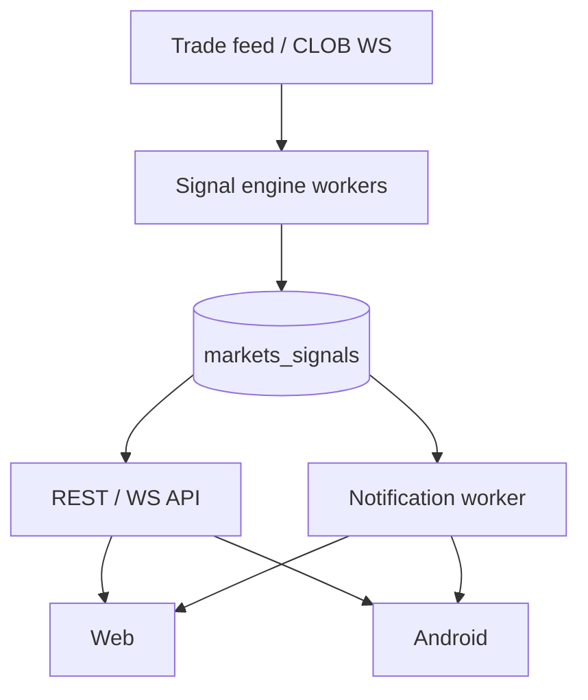

# ADR-008: Shared Signal Engine

**Status:** accepted
**Date:** 2026-07-24
**Last reviewed:** 2026-07-25
**Deciders:** platform-orchestrator, intelligence-product, backend-markets
**Wave:** 1

## Description

This ADR records the accepted decision that trader intelligence is computed once in a shared signal engine at `apps/backend/internal/markets/intelligence/`, persisted with `computedAt`, `provenanceId`, and `version`, and delivered via REST, WebSocket (`markets:signals:*`), and push. There is **no** client-side signal generation in production; clients render only. Signals are informational—not an order path (ADR-009).

It sits with ADR-004 (parity), ADR-005 (realtime delivery), and the normative specs under `.dev/markets-v1/intelligence/`. Intelligence is an independent failure domain: kill or stale-mark signals without disabling order preview/submit. Retractions use `retractedAt`; tier-gating applies at serve time.

Read this when shipping whale/unusual-activity/health/relationship signals, calibrating weights, ensuring web/Android parity, or implementing retractions. It does not authorize reimplementing production scoring in Kotlin/TS for snappier UI, auto-trading on thresholds, or notification workers calling order submit.

## 0. Developer intent (5W+1H)

Short orientation for implementers and agents. Read this before **Context / Decision / Consequences** below.

**5W+1H → ADR mapping:** Context = TI surfaces needing parity; Decision = compute-once in BFF; Consequences = clients render only; independent failure domain; no auto-exec ([ADR-009](ADR-009-NO-AUTO-COPY-TRADING-V1.md)).

**Do not invent decisions.** If a product request conflicts with Decision, refuse or open an ADR change process—do not “interpret around” accepted text.

| Lens | Answer |
|------|--------|
| **Who** | Deciders: platform-orchestrator, intelligence-product, backend-markets. Audience: signal workers; web/Android signal UIs; notification workers; agents implementing scanners/alerts. |
| **What** | **Decision:** Shared signal engine at `apps/backend/internal/markets/intelligence/`. Compute once server-side; store with `computedAt`, `provenanceId`, `version`; deliver REST + WS (`markets:signals:*`) + push; retract via `retractedAt`; tier-gate; **no client-side signal generation in production**. |
| **When** | Shipping whale/unusual-activity/health/relationship signals; calibrating weights; ensuring web/Android parity; implementing retractions; degrading intelligence without blocking trading. |
| **Where** | Feed → workers → `markets_signals` Postgres → API/WS/push → clients. Normative specs under `.dev/markets-v1/intelligence/`. Realtime delivery aligns with [ADR-005](ADR-005-REALTIME-AND-RECONCILIATION.md). |
| **Why** | Context: CPU/data-heavy heuristics; client parity ([ADR-004](ADR-004-SHARED-WEB-ANDROID-API.md)); failure-domain independence; centralized provenance/retraction. Signals are informational, not an order path. |
| **How** | Ingest trade/book feeds → score → persist evidence envelope → serve/filter → clients render. Kill or stale-mark intelligence without disabling order preview/submit. Never wire signal → CLOB submit. |

### Worked example

**What a developer must do differently because of this ADR**

WhaleScore weights change.

1. Update server params + golden vectors in the BFF engine.
2. Both clients display new reason codes from API/WS—no local rescoring in production.
3. Notifications deep-link to a manual ticket only ([ADR-009](ADR-009-NO-AUTO-COPY-TRADING-V1.md)).
4. Retractions clear or strike-through on both clients.

**Failure / Never-V1 (still bound by Decision)**

- Reimplementing production scoring in Kotlin/TS for “snappier” UI.
- Auto-trading when score crosses a threshold.
- Omitting retraction handling.
- Notification workers calling order submit.

**Agent checklist**

- [ ] Compute only in `internal/markets/intelligence/`?
- [ ] Provenance/version persisted?
- [ ] REST/WS/push consumers render-only?
- [ ] Retraction handled?
- [ ] No path to order submit?

**ADR section map**

| Lens | Read in this ADR |
|------|------------------|
| Who / Why | Context, Forces, Deciders metadata |
| What / How | Decision (+ Implementation Notes if present) |
| When / Where | Status/Date, Links, repo/API constraints |
| Day-2 behavior | Consequences, Review Checklist |


## Context

Markets V1 includes a **trader intelligence** product surface ([intelligence/INTELLIGENCE_LAUNCH_V1.md](../../intelligence/INTELLIGENCE_LAUNCH_V1.md); historical registry pointer [TRADER_INTELLIGENCE_PRODUCT_SPEC.md](../../intelligence/TRADER_INTELLIGENCE_PRODUCT_SPEC.md)):

- Unusual activity detection
- Whale and large trade alerts
- Wallet profiling / smart money labels
- Market health and liquidity analytics
- Relationship and arbitrage scanners
- Alert rules and delivery

Intelligence signals must reach **both web and Android** with consistent content, timestamps, and retraction semantics.

Implementation options:

1. **Client-side computation** — each client runs heuristics locally
2. **Duplicate server pipelines** — separate web and mobile backends
3. **Shared signal engine** — compute once in BFF; deliver via API + push

### Forces

- Heuristics are **CPU and data intensive** — trade feeds, order book history
- [ADR-004](ADR-004-SHARED-WEB-ANDROID-API.md) requires API parity
- [FAILURE_DOMAINS_AND_DEGRADED_MODES.md](../FAILURE_DOMAINS_AND_DEGRADED_MODES.md) requires intelligence independent of trading
- [ADR-009](ADR-009-NO-AUTO-COPY-TRADING-V1.md) prohibits auto-execution of signals
- Signal **provenance and retraction** must be centralized ([intelligence/SIGNAL_PROVENANCE_CALIBRATION_AND_RETRACTIONS.md](../../intelligence/SIGNAL_PROVENANCE_CALIBRATION_AND_RETRACTIONS.md))

## Decision

Implement a **shared signal engine** in the BFF at `apps/backend/internal/markets/intelligence/`:

1. **Compute once** — all heuristics run server-side against trade feeds and indexed data.
2. **Store** signals in `markets_signals` Postgres table with `computedAt`, `provenanceId`, `version`.
3. **Deliver** via:
   - REST: `GET /markets/intelligence/signals`
   - WebSocket: `markets:signals:*` channels ([ADR-005](ADR-005-REALTIME-AND-RECONCILIATION.md))
   - Push: notification worker for subscribed alert rules
4. **Retract** signals via `retractedAt` — clients must remove or strike-through retracted items.
5. **Tier gating** — free vs premium signals via capabilities + auth scopes.
6. **No client-side signal generation** in production — clients render only.



## Consequences

### Positive

- **Consistent signals** — same whale alert on web and Android
- **Centralized provenance** — audit and retraction in one place
- **Independent failure domain** — intelligence degrades without blocking trading
- **Efficient compute** — one pipeline vs N clients
- **Easier calibration** — backtest against historical data server-side

### Negative

- **BFF resource usage** — workers need scaling plan
- **Latency** — server compute adds seconds vs local (acceptable for alerts)
- **Single codepath bugs** — affect all clients (mitigated by tests)

### Operational

- `MARKETS_INTELLIGENCE_ENABLED` kill switch
- Stale mode when `computedAt` age > threshold
- Worker lag alerts in [platform/OBSERVABILITY_SLOS_AND_ALERTS.md](../../platform/OBSERVABILITY_SLOS_AND_ALERTS.md)

## Alternatives Considered

### Alternative A: Client-side heuristics

| Issue | Verdict |
|-------|---------|
| Battery (Android) | Poor |
| Consistency | Divergent |
| IP exposure | Algorithms in APK |
| **Outcome** | **Rejected** |

### Alternative B: Separate intelligence microservice

| Issue | Verdict |
|-------|---------|
| V1 complexity | Overkill |
| **Outcome** | **Deferred** post-V1 if scale requires |

### Alternative C: Third-party intelligence API

| Issue | Verdict |
|-------|---------|
| Cost | Ongoing |
| Differentiation | Reduced |
| **Outcome** | **Rejected** for core signals; optional enrichment later |

### Alternative D: Shared engine in BFF (chosen)

| Issue | Verdict |
|-------|---------|
| Monolith growth | Acceptable V1 |
| **Outcome** | **Accepted** |

## Implementation Notes

### Worker types

| Worker | Input | Output signal type |
|--------|-------|-------------------|
| Whale scanner | Large trades stream | `whale_trade` |
| Unusual activity | Volume z-score | `unusual_volume` |
| Wallet profiler | Address graph | `smart_money_label` |
| Arb scanner | Cross-market prices | `arb_opportunity` |
| Health | Book depth metrics | `liquidity_warning` |

### Alert rules

User-defined rules in `markets_alert_rules` evaluated against new signals ([intelligence/ALERT_RULES_AND_DELIVERY.md](../../intelligence/ALERT_RULES_AND_DELIVERY.md)).

### API schema (illustrative)

```json
{
  "id": "sig_abc",
  "type": "whale_trade",
  "marketId": "...",
  "computedAt": "2026-07-25T08:00:00Z",
  "provenanceId": "whale-v1.2",
  "retractedAt": null,
  "payload": { "sizeUsd": 50000 }
}
```

### OSS alignment

Heuristics implemented clean-room per [ADR-007](ADR-007-OSS-ADOPTION-AND-CLEAN-ROOM.md).

## Links

- [ADR-004](ADR-004-SHARED-WEB-ANDROID-API.md)
- [ADR-007](ADR-007-OSS-ADOPTION-AND-CLEAN-ROOM.md)
- [ADR-009](ADR-009-NO-AUTO-COPY-TRADING-V1.md)
- [intelligence/INTELLIGENCE_LAUNCH_V1.md](../../intelligence/INTELLIGENCE_LAUNCH_V1.md)
- [intelligence/INTELLIGENCE_C4_MODEL.md](../../intelligence/INTELLIGENCE_C4_MODEL.md)
- [intelligence/TRADER_INTELLIGENCE_PRODUCT_SPEC.md](../../intelligence/TRADER_INTELLIGENCE_PRODUCT_SPEC.md) (superseded pointer)
- [FAILURE_DOMAINS_AND_DEGRADED_MODES.md](../FAILURE_DOMAINS_AND_DEGRADED_MODES.md)

## Review Checklist

- [x] No client-side production heuristics
- [x] Retraction field in schema
- [x] Intelligence kill switch independent of trading
- [x] Provenance ID on every signal
