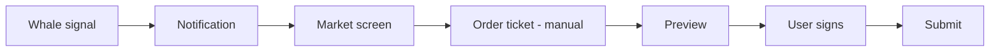

# ADR-009: No Auto Copy Trading in V1

**Status:** accepted
**Date:** 2026-07-24
**Last reviewed:** 2026-07-25
**Deciders:** platform-orchestrator, legal, product, security
**Wave:** 1

## Description

This ADR records the accepted decision that Markets V1 has **no automated copy trading**. Prohibited: server submit from others’ trades/signals without fresh preview+sign; auto-follow while backgrounded/closed; batch copy from one signature; background order workers; notification one-tap execute. Allowed: informational whale alerts; deep link with editable pre-fill; preview shortcut that still requires preview+sign; watchlist without order linkage.

It sits with ADR-003 (user signing) and ADR-008 (informational signals) as a hard Never-V1 boundary. OpenAPI must not expose `POST /markets/copy/*` or `capabilities.autoCopy: true`; notification actions are `VIEW_MARKET` only; no pre-signed orders in alert payloads. Phase 8 evaluation criteria are not approval to build auto copy now.

Read this for any signal→trade UX, notification action, background job, or marketing claim about follow/mirror trading. It does not invent a delegated-signing exception; product insistence on automation requires a later ADR + legal clearance—not silent Decision edits in this file.

## 0. Developer intent (5W+1H)

Short orientation for implementers and agents. Read this before **Context / Decision / Consequences** below.

**5W+1H → ADR mapping:** Context = copy-trading demand vs custody/legal/harm; Decision = **no automated copy in V1**; Consequences = manual ticket only + API/client guards. Post-V1 evaluation criteria are **not** approval to build auto copy now.

**Do not invent decisions.** If a product request conflicts with Decision, refuse or open an ADR change process—do not “interpret around” accepted text.

| Lens | Answer |
|------|--------|
| **Who** | Deciders: platform-orchestrator, legal, product, security. Audience: intelligence + notifications engineers; web/Android order-ticket owners; agents implementing follow-wallet or one-tap trade-from-alert. |
| **What** | **Decision:** No automated copy trading in V1. Prohibited: server submit from others’ trades/signals without fresh preview+sign; auto-follow while backgrounded/closed; batch copy from one signature; background order workers; notification one-tap execute. **Allowed:** informational whale alerts; deep link with editable pre-fill; preview shortcut that still requires preview+sign; watchlist without order linkage. |
| **When** | Any signal→trade UX, notification action, WorkManager/job, OpenAPI `copy`/`follow`/`mirror` proposal, or marketing claim. Binding for V1 until an explicit later ADR + legal clearance (Phase 8 evaluates only). |
| **Where** | No `POST /markets/copy/*` in V1 OpenAPI; no pre-signed orders in alert payloads; `capabilities` must not expose `autoCopy: true`; notification actions `VIEW_MARKET` only. Reinforces [ADR-003](ADR-003-WALLET-AND-SIGNING-MODEL.md) and [ADR-008](ADR-008-SHARED-SIGNAL-ENGINE.md). |
| **Why** | Context: auto-exec needs delegated signing (violates ADR-003); regulatory/advice risk; latency harm; pump-group abuse; SEV1 mass orders; Play Store scrutiny. V1 intelligence is informational, not executional. Alternatives A–C rejected. |
| **How** | Signal → notify → market screen → **manual** ticket → preview → user signs → submit. CI greps `autoCopy`/`followWallet`/`mirrorTrade`; E2E asserts manual-only journey. |

### Worked example

**What a developer must do differently because of this ADR**

Push: “Large buy on Market X.”

1. Tap opens market detail with editable side suggestion—not an order submit.
2. Preview stays gated until the user confirms/edits.
3. User signs; BFF submits the user-signed order only.
4. Watchlist may track the wallet with **zero** order linkage.

**Failure / Never-V1 (still bound by Decision)**

- 24h session-key auto-trade.
- One-tap `PLACE_ORDER` from the notification shade.
- Pre-signed order blobs inside alert payloads.
- Marketing that claims “auto copy” for Markets V1.
- Background workers submitting orders without confirmation UI.

**Agent checklist**

- [ ] OpenAPI free of copy endpoints?
- [ ] Notification action is `VIEW_MARKET` only?
- [ ] No `autoCopy` capability?
- [ ] CI grep / E2E manual-only journey green?
- [ ] Copy avoids auto-copy claims?

**ADR section map**

| Lens | Read in this ADR |
|------|------------------|
| Who / Why | Context, Forces, Deciders metadata |
| What / How | Decision (+ Implementation Notes if present) |
| When / Where | Status/Date, Links, repo/API constraints |
| Day-2 behavior | Consequences, Review Checklist |

## Context

Trader intelligence features ([ADR-008](ADR-008-SHARED-SIGNAL-ENGINE.md)) surface **whale trades**, **smart money wallets**, and **arbitrage opportunities**. A natural product extension is **copy trading**: automatically replicate another wallet's trades in the user's account.

Copy trading introduces severe risks:

| Risk category | Description |
|---------------|-------------|
| **Custody / signing** | Auto-execution requires delegated signing or server-side keys — violates [ADR-003](ADR-003-WALLET-AND-SIGNING-MODEL.md) |
| **Regulatory** | May constitute investment advice, broker-dealer activity, or portfolio management |
| **User harm** | Latency causes worse fills; users blame RetroPick for losses |
| **Liability** | Following "smart money" that was front-run or manipulated |
| **Abuse** | Pump groups trigger follower orders |
| **Technical** | Race conditions between signal, preview, and market movement |

V1 product scope ([02_SCOPE_AND_CAPABILITY_MATRIX.md](../../02_SCOPE_AND_CAPABILITY_MATRIX.md)) positions intelligence as **informational**, not **executional**.

### Forces

- Users may request "follow whale" feature — strong demand signal
- Legal has not cleared automated replication
- [ADR-003](ADR-003-WALLET-AND-SIGNING-MODEL.md) mandates user-signed preview for every trade
- Play Store financial app policies scrutinize automated trading
- Incident response: auto-trading bug could cause mass unintended orders (SEV1)

## Decision

**RetroPick Markets V1 will not implement automated copy trading.**

Specifically prohibited in V1:

1. **No server-side order submission** triggered by another user's trade or a signal rule without fresh user preview + signature per order.
2. **No "auto-follow wallet" mode** that places orders on behalf of the user while app is backgrounded or closed.
3. **No batch execution** of copied trade sets from a single signature.
4. **No background workers** on Android or web that submit orders without active user session and confirmation UI.
5. **Notifications** from whale alerts link to **market detail + manual order ticket** — not one-tap execute.

### Allowed in V1 (manual copy intent)

| Feature | Description |
|---------|-------------|
| Whale alert | Push/in-app: "Large buy on Market X" |
| Deep link | Opens market with pre-filled **side** suggestion (user edits) |
| Preview shortcut | Pre-populate order ticket fields; user must still preview + sign |
| Watchlist | Track wallets; no order linkage |

**Post-V1:** Manual "copy intent" flows with explicit legal review and optional per-order confirmation redesign — not V1 scope.

## Consequences

### Positive

- **ADR-003 compliance** — no delegated signing workaround
- **Reduced legal exposure** — informational product classification
- **No SEV1 auto-trading incidents** in V1
- **Simpler Android background policy** — no order WorkManager
- **Clear user agency** — every trade is deliberate

### Negative

- **Competitive gap** — some rivals offer copy trading
- **User disappointment** — must set expectations in marketing
- **Intelligence value** — signals require user action to monetize trading fees

### Product messaging

- Intelligence is **decision support**, not **portfolio management**
- Disclaimers on signal surfaces ([intelligence/SIGNAL_PROVENANCE_CALIBRATION_AND_RETRACTIONS.md](../../intelligence/SIGNAL_PROVENANCE_CALIBRATION_AND_RETRACTIONS.md))

## Alternatives Considered

### Alternative A: Full auto copy trading

Server or client watches wallet; submits matching orders automatically.

| Issue | Verdict |
|-------|---------|
| ADR-003 | Violation |
| Legal | Not cleared |
| **Outcome** | **Rejected** |

### Alternative B: Semi-auto with session key

User signs once; session key places orders for 24h.

| Issue | Verdict |
|-------|---------|
| Custody model | Gray area |
| Revocation | Complex |
| **Outcome** | **Rejected** for V1 |

### Alternative C: One-tap copy from notification

Notification action button submits order.

| Issue | Verdict |
|-------|---------|
| Preview skip | Violates signing integrity |
| Background | Android policy |
| **Outcome** | **Rejected** |

### Alternative D: Informational only + manual ticket (chosen)

| Issue | Verdict |
|-------|---------|
| UX friction | Intentional |
| **Outcome** | **Accepted** for V1 |

## Implementation Notes

### API guards

- No `POST /markets/copy/*` endpoints in V1 OpenAPI
- Alert payloads must not include pre-signed order blobs
- `capabilities` must not expose `autoCopy: true`

### Client guards

- No `WorkManager` tasks for order submission
- Notification actions: `VIEW_MARKET` only — not `PLACE_ORDER`
- Order ticket pre-fill requires user edit before preview enabled

### CI / security tests

- Grep for `autoCopy`, `followWallet`, `mirrorTrade` in production paths
- E2E: whale notification → manual flow only ([testing/END_TO_END_CRITICAL_JOURNEYS.md](../../testing/END_TO_END_CRITICAL_JOURNEYS.md))

### Future evaluation criteria (post-V1)

1. Legal opinion on copy trading in target jurisdictions
2. Non-custodial delegated signing mechanism approved by security
3. Per-order preview UX user testing
4. Abuse prevention (rate limits, wallet allowlists)

## Links

- [ADR-003: Wallet and Signing](ADR-003-WALLET-AND-SIGNING-MODEL.md)
- [ADR-008: Shared Signal Engine](ADR-008-SHARED-SIGNAL-ENGINE.md)
- [02_SCOPE_AND_CAPABILITY_MATRIX.md](../../02_SCOPE_AND_CAPABILITY_MATRIX.md)
- [security/THREAT_MODEL.md](../../security/THREAT_MODEL.md)
- [FAILURE_DOMAINS_AND_DEGRADED_MODES.md](../FAILURE_DOMAINS_AND_DEGRADED_MODES.md)
- [phases/PHASE-8-POST-V1-ADVANCED-CAPABILITIES.md](../../phases/PHASE-8-POST-V1-ADVANCED-CAPABILITIES.md)

## Review Checklist

- [x] No auto-submit code paths in V1 scope
- [x] Notification deep links reviewed
- [x] OpenAPI has no copy-trading endpoints
- [x] Marketing copy avoids "auto copy" claims
- [x] Phase 8 explicitly owns post-V1 evaluation
