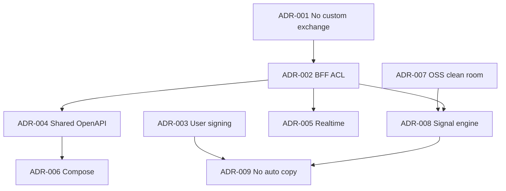

# Architecture Decision Records — RetroPick Markets V1

**Status:** reviewed
**Last updated:** 2026-07-25
**Owner:** platform-orchestrator

## Description

This README is the operating manual for Markets V1 Wave 1 Architecture Decision Records (ADR-001 through ADR-009): index table, dependency graph, cross-ADR invariants, when to write a new ADR, supersession policy, and relationship to repo-wide R0/R1/R4 ADRs. It is index and governance—not a tenth decision.

It sits at `architecture/adr/` as the discovery layer over accepted Decisions. Summary rows here must not weaken ADR-001 (no custom exchange) or ADR-009 (no auto copy). Material decisions also belong in the harness decision log with traceability updates; each ADR’s Context / Decision / Consequences remain authoritative.

Read this before proposing architecture changes, starting cross-team Wave work, or checking whether an invariant already has an accepted ADR. Do not silently rewrite accepted Decision text to fit a sprint; use supersession status when replacing. Prefer individual ADR files for the binding Decision text itself.

## 0. Developer intent (5W+1H)

Short orientation for implementers and agents. Read this before the index, dependency graph, and process sections below.

This README is **index + governance**, not a tenth decision. Each ADR’s Context / Decision / Consequences remain authoritative. Summary rows here must not weaken [ADR-001](ADR-001-MARKETS-HAS-NO-CUSTOM-EXCHANGE.md) (no custom exchange) or [ADR-009](ADR-009-NO-AUTO-COPY-TRADING-V1.md) (no auto copy).

| Lens | Answer |
|------|--------|
| **Who** | platform-orchestrator; Markets web/Android/backend leads; legal/security on custody and copy-trading; agents that must not silently edit accepted Decision sections. |
| **What** | Operating manual for Markets V1 Wave 1 ADRs (001–009): index table, dependency graph, cross-ADR invariants, when to write a new ADR, supersession policy, and relationship to repo-wide R0/R1/R4 ADRs. |
| **When** | Before proposing architecture changes, starting cross-team Wave work, or checking whether an invariant already has an accepted ADR. Re-review at phase freezes and on legal/upstream triggers in Review Cadence. |
| **Where** | Files in `architecture/adr/ADR-00*.md`. Also log material decisions in `../../../../.harness/products/markets-v1/governance/DECISION_AND_ASSUMPTION_LOG.md` and update traceability. Companion architecture docs are linked below in this README. |
| **Why** | Durable decisions—no custom exchange, BFF ACL, user signing, shared OpenAPI, no auto copy—must stay discoverable and hard to reverse casually. The index stops contradictory “local” decisions in feature PRs. |
| **How** | Locate ADR → read Context/Decision/Consequences → implement the Decision (not a rejected Alternative). Draft new ADRs only for significant multi-team or custody/legal changes; never silently rewrite accepted Decision text; use supersession status when replacing. |

### Worked example

**Happy path — “auto follow whale” request**

1. Index → [ADR-009](ADR-009-NO-AUTO-COPY-TRADING-V1.md) + [ADR-003](ADR-003-WALLET-AND-SIGNING-MODEL.md).
2. Implement notification → `VIEW_MARKET` → manual ticket → preview+sign.
3. Do not add `POST /markets/copy/*` or `capabilities.autoCopy`.
4. If product insists on automation, route to Phase 8 evaluation + new ADR process—not a silent Decision edit.

**Failure / Never-V1**

- Treating the summary table as license to create `contracts/markets/` or auto-submit from signals.
- Editing Decision sections in place to “fit the sprint.”
- Adding ADRs without decision log + orchestrator/affected-team review.

**Agent checklist**

- [ ] Matching ADR opened and Decision quoted?
- [ ] Dependency graph neighbors considered (e.g. ADR-008 → ADR-009)?
- [ ] Cross-ADR invariant table still holds?
- [ ] Decision log / traceability updated if changing an ADR?

**5W+1H ↔ ADR body sections**

| Lens | Typical ADR section |
|------|---------------------|
| Who / Why | Context, Forces, Deciders |
| What / How | Decision, Implementation Notes |
| When / Where | Status/Date, Links, repo constraints |
| Day-2 change | Consequences, Review Checklist |

Architecture Decision Records (ADRs) capture **significant, durable decisions** for Markets V1 Wave 1. Each ADR follows the format: Context, Decision, Consequences, Alternatives, Status, Links.

## Index

| ADR | Title | Status | Summary |
|-----|-------|--------|---------|
| [ADR-001](ADR-001-MARKETS-HAS-NO-CUSTOM-EXCHANGE.md) | Markets Has No Custom Exchange | accepted | Polymarket is the sole venue; no RetroPick matching engine or outcome-token issuance for Markets. |
| [ADR-002](ADR-002-POLYMARKET-ANTI-CORRUPTION-LAYER.md) | Polymarket Anti-Corruption Layer | accepted | Go BFF at `internal/markets/` normalizes all upstream Polymarket APIs; clients never call Gamma/CLOB directly in prod. |
| [ADR-003](ADR-003-WALLET-AND-SIGNING-MODEL.md) | Wallet and Signing Model | accepted | Non-custodial user-signed model; preview-before-sign; RetroPick never holds raw private keys. |
| [ADR-004](ADR-004-SHARED-WEB-ANDROID-API.md) | Shared Web and Android API | accepted | Single OpenAPI spec `schemas/openapi/markets-v1.yaml` for web TypeScript and Android Kotlin clients. |
| [ADR-005](ADR-005-REALTIME-AND-RECONCILIATION.md) | Realtime and Reconciliation | accepted | Snapshot + sequence gap recovery for WebSocket; REST resync on gap; indexer handles chain reorgs. |
| [ADR-006](ADR-006-ANDROID-JETPACK-COMPOSE.md) | Android Jetpack Compose | accepted | Kotlin + Compose only for `apps/android-markets`; no XML layouts for new features. |
| [ADR-007](ADR-007-OSS-ADOPTION-AND-CLEAN-ROOM.md) | OSS Adoption and Clean Room | accepted | No copy-paste without license review; provenance in `open-source-provenance.yaml`; SBOM on release. |
| [ADR-008](ADR-008-SHARED-SIGNAL-ENGINE.md) | Shared Signal Engine | accepted | Intelligence computed once in BFF; delivered via REST, WS, and push to web and Android. |
| [ADR-009](ADR-009-NO-AUTO-COPY-TRADING-V1.md) | No Auto Copy Trading V1 | accepted | No automated order replication; whale alerts are informational; manual preview+sign only. |

## Decision Dependency Graph

## Core Invariants (Cross-ADR)

These invariants appear across multiple ADRs and architecture docs:

| Invariant | Primary ADR | Enforced by |
|-----------|-------------|-------------|
| No custom exchange | ADR-001 | No `contracts/markets/`; CLOB-only trading |
| BFF anti-corruption | ADR-002 | `internal/markets/` upstream isolation |
| No raw key custody | ADR-003 | Preview-before-sign; no server signing |
| Shared web+Android API | ADR-004 | `schemas/openapi/markets-v1.yaml` |
| No auto copy trading | ADR-009 | No auto-submit; notification deep links only |

## Relationship to Repo-Wide ADRs

Markets V1 ADRs are **product-specific**. They complement monorepo restructure ADRs in `docs/engineering/adr/`:

| Repo ADR | Relationship |
|----------|--------------|
| ADR-R0 Monorepo product restructure | Defines Markets / PRISM / Legacy split |
Current Markets V1 authority: `.harness/products/markets-v1/governance/AGENT_OPERATING_CONTRACT.md`.
| ADR-R4 Legacy archived | Markets is primary active product line |

## When to Write a New ADR

Create a new Markets ADR when a decision:

- Is **architecturally significant** (hard to reverse)
- Affects **more than one team** (web, Android, backend)
- Changes a **§23 invariant** or requires legal/security review
- Introduces a **new external dependency** or custody model

Process:
1. Draft ADR in this directory
2. Log in [../../../../.harness/products/markets-v1/governance/DECISION_AND_ASSUMPTION_LOG.md](../../../../.harness/products/markets-v1/governance/DECISION_AND_ASSUMPTION_LOG.md)
3. Update [04_REQUIREMENTS_AND_TRACEABILITY.md](../../04_REQUIREMENTS_AND_TRACEABILITY.md)
4. Review with platform-orchestrator + affected teams

## Supersession Policy

- Status `accepted` → active
- Status `deprecated` → still documented but do not extend
- Status `superseded by ADR-XXX` → follow new ADR

Changes to **accepted** ADRs require explicit re-review; do not silently edit Decision sections.

## Related Architecture Documents

| Document | Description |
|----------|-------------|
| [SYSTEM_CONTEXT_AND_TRUST_BOUNDARIES.md](../SYSTEM_CONTEXT_AND_TRUST_BOUNDARIES.md) | C4 context, trust boundaries, custody |
| [TARGET_MONOREPO_ARCHITECTURE.md](../TARGET_MONOREPO_ARCHITECTURE.md) | Directory tree, R0–R4, isolation |
| [DEPLOYMENT_ARCHITECTURE.md](../DEPLOYMENT_ARCHITECTURE.md) | dev/staging/prod, deploy units |
| [FAILURE_DOMAINS_AND_DEGRADED_MODES.md](../FAILURE_DOMAINS_AND_DEGRADED_MODES.md) | Failure matrix, kill switches |

## Review Cadence

- **Wave gates:** ADRs reviewed at Phase 0 freeze and Phase 6 hardening
- **Upstream changes:** ADR-002 and ADR-005 reviewed when Polymarket migrates APIs
- **Legal triggers:** ADR-003 and ADR-009 reviewed on jurisdiction expansion

## Document History

| Date | Change |
|------|--------|
| 2026-07-24 | Initial ADR stubs (ADR-001–009) |
| 2026-07-25 | Wave 1 comprehensive expansion; index table; status reviewed |
