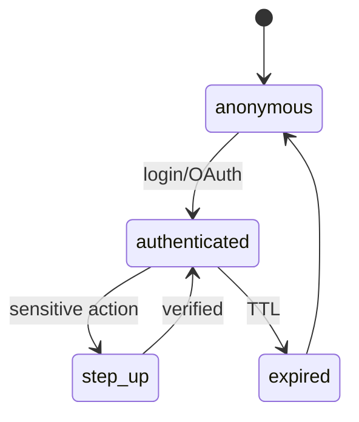

# AUTH, SESSION, AND ELIGIBILITY

**Status:** reviewed
**Owner:** platform-orchestrator
**Last updated:** 2026-08-09
**Product:** RetroPick Markets V1
**Wave:** 3 — Backend architecture and API contracts

## Description

This document is the authority for **authentication, session lifecycle, and jurisdiction eligibility** on the Markets V1 API. It defines RetroPick session JWT as primary auth (wallet EIP-712 signing is separate—not a session substitute), session states and TTLs, server-authoritative fail-closed `GET /markets/eligibility`, ordered policy checks, wallet binding via `wallet_accounts`, and security controls (rate limits, refresh rotation, revoke, hashed IP)—so clients never invent allow/deny from on-device geo alone.

It sits in Wave 3 beside API/realtime contracts and cache/rate-limit specs. Decisions persist in `markets.eligibility_decisions`; cache keys follow `mkt:eligibility:{ip_hash}`. Rule packs version as `eligibility-rules-v{n}`. Trading/funding/withdrawal routes require `eligible: true` plus capability and optional step-up. Service-to-service uses mTLS only. Unknown policy or GeoIP failure fails closed—never trust client GPS. Private keys stay off the server.

Read this when wiring middleware gates, wallet-binding flows, or eligibility UX reason codes. Prefer sibling docs for OpenAPI operation inventory and Redis TTLs—not for session/eligibility semantics.

## 0. Developer intent (5W+1H)

Short orientation for implementers and agents. Read this before the normative sections below.

| Lens | Answer |
|------|--------|
| **Who** | API middleware / security owners wiring session JWT and eligibility gates; web (HttpOnly cookie) and Android (secure storage) auth clients; wallet-binding flows that link proxy/Safe addresses; ops updating `eligibility-rules-v{n}` config bundles; auditors reading `markets.eligibility_decisions`. |
| **What** | Auth model (RetroPick session JWT primary; EIP-712 wallet signing separate—not a session substitute; mTLS for service-to-service only), session lifecycle (anonymous → authenticated → step_up → expired), TTLs (access 15m, refresh 30d, step-up 5m, max 10 devices), server-authoritative fail-closed `GET /markets/eligibility`, ordered checks (maintenance, GeoIP + Polymarket geoblock, sanctions if enabled, account standing, age/terms version), wallet binding via `wallet_accounts`, and security controls (auth rate limits, refresh rotation, session revoke, hashed IP). |
| **When** | On every Markets request through middleware; explicitly before trading/funding/withdrawal routes that require `eligible: true` + capability + optional step-up. On login/OAuth, password change (revoke all), and eligibility policy bundle updates. Clients must not invent eligibility from on-device geo alone. |
| **Where** | Spec: this file. Endpoint: `GET /markets/eligibility` (OpenAPI). Persistence: `markets.eligibility_decisions` (hashed IP, region code, reason). Cache key pattern: `mkt:eligibility:{ip_hash}` (see cache doc). Middleware order: extract session → load user → eligibility cache → handler gate. Wallet linkage proof on `wallet_accounts`; orders must use a linked maker address. Rule packs versioned `eligibility-rules-v{n}`. |
| **Why** | Jurisdiction and account standing are product/legal gates—fail-closed protects users and the operator when policy or geoblock is unknown. Separating session auth from wallet signatures prevents “signed once = logged in forever” confusion and keeps private keys off the server. Audit rows enable dispute review without storing raw PII in logs. |
| **How** | Issue/refresh JWTs with stated TTLs; rotate refresh on use; step-up for sensitive actions (5m). Eligibility: evaluate checks in order; on any miss/unknown → `eligible: false` + reason code from API; persist decision for audit; cache by IP hash. Trading middleware requires eligible + capability (+ step-up if configured). Bind wallets with signature challenge; reject orders from unbound makers. Rate-limit auth 10/min/IP; redact IP to /24 hash in logs. |

### Worked example

**Happy path.** User completes OAuth → authenticated session (HttpOnly cookie on web; secure storage on Android). Client calls `GET /markets/eligibility`; server passes maintenance → GeoIP + Polymarket geoblock → sanctions (if enabled) → account standing → age/terms version → `eligible: true`. Decision persisted in `markets.eligibility_decisions` (hashed IP, region); cache key `mkt:eligibility:{ip_hash}` filled. User links proxy/Safe via signature challenge into `wallet_accounts`. Later `POST /markets/orders/preview` passes auth + eligibility + capability; EIP-712 signing remains a separate client step (not a session substitute).

**Happy path — step-up.** Sensitive action (e.g. withdrawal submit) enters `step_up` for 5m after verification, then returns to authenticated. Refresh token rotates on use (30d TTL); access token 15m.

**Failure / degraded.** Geoblock or unknown policy → `eligible: false`; trading routes return `ELIGIBILITY_DENIED` (catalog may still read per product rules). GeoIP timeout: **fail closed**—never trust client GPS alone. Missing step-up → challenge before sensitive POST. Password change revokes all sessions (max 10 devices). Auth endpoints rate-limited 10/min/IP. Clients display API reason strings only—never infer allow/deny from device locale. Logs redact IP to /24 hash; no PII in eligibility logs.

### Session states

```text
anonymous → authenticated (login/OAuth)
authenticated → step_up → authenticated
authenticated → expired (TTL) → anonymous
```

| Setting | Value |
|---------|-------|
| Access token TTL | 15m |
| Refresh token TTL | 30d |
| Step-up TTL | 5m |
| Max devices | 10 / user |

### Eligibility check order (fail closed)

1. Maintenance mode flag
2. GeoIP + Polymarket geoblock cross-check
3. Sanctions list (if enabled)
4. Account standing (suspended/banned)
5. Age / terms acceptance version

### Middleware sketch

```text
Request → extract session → load user → eligibility cache → handler gate
```

Trading requires `eligible: true` AND capability flag AND step-up when configured. Orders must use a linked maker address from `wallet_accounts`.

### Implementer checklist

- Wallet signature ≠ session login.
- Service-to-service: mTLS only.
- Rule packs versioned `eligibility-rules-v{n}`; clients never hardcode region maps.
- Cache invalidation on policy bundle change.

## 1. Purpose

Authentication, session management, and jurisdiction eligibility for Markets API.

## 2. Auth model

- Primary: RetroPick session JWT (HttpOnly cookie web; secure storage Android).
- Wallet signing: separate EIP-712 flows; not a session substitute.
- Service-to-service: mTLS internal only.

## 3. Session lifecycle



| Setting | Value |
|---------|-------|
| Access token TTL | 15m |
| Refresh token TTL | 30d (deferred — access-only re-SIWE for P2-005) |
| Step-up TTL | 5m (deferred) |
| Max devices | 10 per user (deferred) |

### 3.1 Implementation status (MKT-P2-005)

| Component | Status | Location |
|-----------|--------|----------|
| SIWE verify (EIP-4361) | **shipped** | `internal/markets/auth/siwe.go` |
| Server nonce store | **shipped** | `internal/markets/auth/nonce.go` |
| Session JWT (HttpOnly cookie `mkt_session`) | **shipped** | `internal/markets/auth/session.go` |
| Auth HTTP endpoints | **shipped** | `GET/POST /api/v1/markets/auth/*` |
| In-memory user store | **shipped** | `internal/markets/auth/store.go` (Postgres deferred) |
| `OptionalSession` middleware | **shipped** | `internal/markets/auth/middleware.go` |
| `AccountContext` → eligibility | **shipped** | `handler.go` Eligibility + middleware |
| Refresh rotation / step-up | deferred | Future task |
| Postgres sessions / users | deferred | Future migration |

**Env:** `MARKETS_AUTH_SESSION_SECRET` (fallback `AUTH_SESSION_SECRET`), `MARKETS_AUTH_ACCESS_TTL` (default 15m), `MARKETS_AUTH_NONCE_TTL` (default 10m), `MARKETS_CORS_ALLOWED_ORIGINS` (default `http://localhost:3001`).

**Client hookup (web follow-up):** `useMarketsWalletSession` must call `GET /api/v1/markets/auth/nonce` before signing; replace client-side `crypto.randomUUID()` nonce. Session restore via `GET /api/v1/markets/auth/session` on connect.

## 4. Eligibility

`GET /markets/eligibility` — server-authoritative, fail-closed.

Checks (in order):
1. Maintenance mode flag
2. GeoIP + Polymarket geoblock API cross-check
3. Sanctions list (if enabled)
4. Account standing (suspended/banned)
5. Age/terms acceptance version

Persist decisions in `markets.eligibility_decisions` for audit (hashed IP, region code).

### 4.1 Implementation status (MKT-P2-002)

| Component | Status | Location |
|-----------|--------|----------|
| Fail-closed evaluator pipeline | **shipped** | `apps/backend/internal/markets/eligibility/` |
| `GET /markets/eligibility` HTTP wiring | **shipped** | `handler.go` → `service.go` → `eligibility.Evaluator` |
| GeoIP resolver | **shipped (env-gated)** | `eligibility/geo` — `ResolverFromEnv()` → `HTTPResolver` when `MARKETS_GEOIP_BASE_URL` set; else `UnwiredResolver` → `geo_unknown` |
| Polymarket geoblock ACL | **adapter shipped (env-gated)** | `eligibility/geoblock` — `GeoblockFromEnv()` → `HTTPChecker` when `MARKETS_GEOBLOCK_BASE_URL` set; else `UnwiredChecker` → `geoblock_upstream_unavailable` |
| `eligibility_fail_closed` metric | **shipped** | `retropick_markets_eligibility_fail_closed_total` |
| Redis cache `mkt:eligibility:{ip_hash}` | deferred | See cache doc |
| Postgres `eligibility_decisions` audit | deferred | Future migration |

**BLK-001 honesty:** GeoIP and geoblock adapters are shipped and env-gated. `ProductionEligibilityEvaluator` in `service.go` wires `geo.ResolverFromEnv()` and `eligibility.GeoblockFromEnv()` (both `cmd/api` and `cmd/markets-api` pass the same evaluator to the auth module). **BLK-001 remains open** until ops injects both geo + geoblock env in target deploy and integration proves `eligible: true` for an allowed region — default deploy (no env) still returns `geo_unknown` / `geoblock_upstream_unavailable`. `DefaultEvaluator()` keeps deny-all for tests without injection. Full tracker: [MKT-P2-002-BLK001-evidence.md](../agent-harness/verification/PHASE-2/MKT-P2-002-BLK001-evidence.md).

**GeoIP environment variables (Chat Geo):**

| Variable | Required to wire | Purpose |
|----------|------------------|---------|
| `MARKETS_GEOIP_BASE_URL` | Yes | Enables HTTP GeoIP resolver (example: `https://ipinfo.io`) |
| `MARKETS_GEOIP_PATH` | No | Path template with `{ip}` placeholder; default `/{ip}/json` |
| `MARKETS_GEOIP_API_KEY` | No | Provider token; appended as `token` query param when set |
| `MARKETS_GEOIP_TIMEOUT` | No | HTTP timeout; default `5s` |

Also accepts `GEO_PROVIDER_API_KEY` when `MARKETS_GEOIP_API_KEY` is unset (platform doc alias).

**Example (non-normative):** `MARKETS_GEOIP_BASE_URL=https://ipinfo.io`, `MARKETS_GEOIP_PATH=/{ip}/json`, `MARKETS_GEOIP_API_KEY=<secret>` plus `MARKETS_GEOBLOCK_BASE_URL=https://polymarket.com` for full eligibility pipeline.

**Remaining BLK-001 clearance (orchestrator / ops):**

- Ops checklist: [MKT-P2-BLK001-ops-staging-checklist.md](../agent-harness/verification/PHASE-2/MKT-P2-BLK001-ops-staging-checklist.md)
- Ops inject `MARKETS_GEOIP_*` (or `GEO_PROVIDER_API_KEY`) in target deploy
- Ops inject `MARKETS_GEOBLOCK_BASE_URL` (+ optional `MARKETS_GEOBLOCK_PATH`)
- Integration proof `eligible: true` for allowed fixture IP

**Client geo headers:** Server ignores `X-Geo-*`, `Accept-Language`, and device locale for eligibility. Only trusted server-side IP resolution (CIDR-gated `X-Forwarded-For` when configured) is used.

### 4.2 Chat M / Chat N ownership boundaries

| Topic | Owner | Location |
|-------|-------|----------|
| Evaluator, geoblock ACL, reason codes, fail-closed metric | Chat M (MKT-P2-002) | `internal/markets/eligibility/` |
| Session JWT, refresh, step-up, middleware gate | Chat N (MKT-P2-005) | `internal/markets/auth/` + §3/§5 |
| `AccountContext` injection into evaluator | **shipped** (MKT-P2-005) | `handler.go` Eligibility call site |
| `eligibility_decisions` audit persistence | Future migration task | Postgres |

Chat N must call the same `eligibility.Evaluator` (or cached decision keyed by IP hash) — do not duplicate geoblock logic in auth middleware.

### 4.3 API reason codes

| Reason | Meaning |
|--------|---------|
| `maintenance_mode` | Ops maintenance flag active |
| `geo_unknown` | GeoIP unknown, timeout, or error |
| `region_blocked` | Region in `eligibility-rules-v1` block list |
| `geoblock_denied` | Polymarket geoblock cross-check denied |
| `geoblock_upstream_unavailable` | Geoblock upstream not wired (BLK-001) |
| `geoblock_timeout` | Geoblock upstream timeout or 5xx |
| `sanctions_blocked` | Sanctions screening hit (when enabled) |
| `account_suspended` | Account standing suspended/banned |
| `terms_not_accepted` | Required terms version not accepted |

Clients display API `reason` strings only; never infer allow/deny from on-device geo.

## 5. Middleware

Chi wiring (MKT-P2-005 + MKT-P2-GLUE nested `/me` groups):

```text
Request → RequestID → OptionalSession → handler
/api/v1/markets/*     → OptionalSession (parent)
/me/*                 → RequireAuthenticated
  GET /me/wallets     → handler (auth-only — no RequireEligible)
  eligible subgroup   → RequireEligible (same Evaluator as GET /markets/eligibility)
    GET /me/balances  → handler
    future trading/funding/withdrawal → handler
```

| Middleware | Behavior |
|------------|----------|
| `OptionalSession` | Parse `mkt_session` cookie; load `AccountContext` into request context when valid |
| `RequireAuthenticated` | `401 UNAUTHENTICATED` when no session |
| `RequireEligible` | Calls shared `eligibility.Evaluator`; `403 ELIGIBILITY_DENIED` with `{ details.reason }` when `eligible: false` |

### 5.1 Route gate table

| Route | Middleware stack | Rationale |
|-------|------------------|-----------|
| `GET /api/v1/markets/eligibility` | `OptionalSession` | Public; injects `AccountContext` when session present |
| `GET /api/v1/markets/me/wallets` | `OptionalSession` → `RequireAuthenticated` | Account setup after SIWE; must return **200** (empty `wallets[]` OK) while BLK-001 active — see [MKT-P2-GLUE-session-wallet-evidence.md](../agent-harness/verification/PHASE-2/MKT-P2-GLUE-session-wallet-evidence.md) |
| `GET /api/v1/markets/me/balances` | `OptionalSession` → `RequireAuthenticated` → `RequireEligible` | Transactional read; fail-closed per BLK-001 |
| Future trading / funding / withdrawal | Same as balances | Must mount inside eligible subgroup; do not copy wallets auth-only gate |

### 5.2 Request flows

**Wallets (auth-only):**

```text
GET /api/v1/markets/me/wallets
  → OptionalSession (parse mkt_session JWT → context)
  → RequireAuthenticated (401 if missing)
  → wallet.ListMyWallets → 200 WalletsListResponse
```

**Balances (eligible-gated):**

```text
GET /api/v1/markets/me/balances
  → OptionalSession
  → RequireAuthenticated (401 if missing)
  → RequireEligible (403 ELIGIBILITY_DENIED if eligible: false)
  → balances.ListMyBalances → 200
```

`GET /markets/eligibility` is public but injects `AccountContext` when a session cookie is present (account standing / terms checks apply after geo/geoblock).

Trading routes require `eligible: true` AND capability flag AND step-up if configured.

## 6. Wallet binding

SIWE session (MKT-P2-005) binds the **signer EOA** to a RetroPick session only — no private keys stored server-side (ADR-003).

User may link multiple proxy/Safe addresses. `wallet_accounts` stores linkage proof
(signature challenge). Orders must use linked maker address.

**MKT-P2-003** mounts `GET /api/v1/markets/me/wallets` under the authenticated `/me` subgroup (**auth-only**, not eligible-gated) so SIWE users can discover/link account wallets while BLK-001 keeps transactional routes fail-closed. Balance and trading routes mount in the nested `RequireEligible` subgroup (§5.1).

## 7. Security controls

- Rate limit auth endpoints separately (10/min/IP).
- Rotate refresh tokens on use.
- Revoke all sessions on password change.
- No PII in eligibility logs; redact IP to /24 hash.

## Eligibility rule pack: eligibility-rules-v1

Ops-owned config bundle (in-memory default until config service wiring). Version string: `eligibility-rules-v1`.

| Flag / map | Default | Notes |
|------------|---------|-------|
| `maintenance_mode` | `false` | When true → `maintenance_mode` |
| `sanctions_enabled` | `false` | Requires session `AccountContext` when enabled |
| `blocked_regions` | `{}` | ISO region codes → `region_blocked` |
| `required_terms_version` | `""` | Compared to session acceptance when set |

Region allow/deny beyond Polymarket geoblock is ops-controlled via `blocked_regions`; clients never hardcode region maps.

## Appendix 1

| Key | Specification |
|-----|---------------|
| Wave | 3 reviewed 2026-07-25 |
| Venue | Polymarket Gamma/CLOB/on-chain |
| BFF | apps/backend/internal/markets |
| Schema | markets.* PostgreSQL |
| Contract | schemas/openapi/markets-v1.yaml |
| Idempotency | Idempotency-Key header on POST |
| Money | Fixed-point Money schema |
| Phase gating | x-phase OpenAPI extension |
| Fail closed | eligible:false on unknown policy |
| Intelligence | Isolated from trading path ADR-008 |

## Appendix 2

| Key | Specification |
|-----|---------------|
| Wave | 3 reviewed 2026-07-25 |
| Venue | Polymarket Gamma/CLOB/on-chain |
| BFF | apps/backend/internal/markets |
| Schema | markets.* PostgreSQL |
| Contract | schemas/openapi/markets-v1.yaml |
| Idempotency | Idempotency-Key header on POST |
| Money | Fixed-point Money schema |
| Phase gating | x-phase OpenAPI extension |
| Fail closed | eligible:false on unknown policy |
| Intelligence | Isolated from trading path ADR-008 |

## Appendix 3

| Key | Specification |
|-----|---------------|
| Wave | 3 reviewed 2026-07-25 |
| Venue | Polymarket Gamma/CLOB/on-chain |
| BFF | apps/backend/internal/markets |
| Schema | markets.* PostgreSQL |
| Contract | schemas/openapi/markets-v1.yaml |
| Idempotency | Idempotency-Key header on POST |
| Money | Fixed-point Money schema |
| Phase gating | x-phase OpenAPI extension |
| Fail closed | eligible:false on unknown policy |
| Intelligence | Isolated from trading path ADR-008 |

## Appendix 4

| Key | Specification |
|-----|---------------|
| Wave | 3 reviewed 2026-07-25 |
| Venue | Polymarket Gamma/CLOB/on-chain |
| BFF | apps/backend/internal/markets |
| Schema | markets.* PostgreSQL |
| Contract | schemas/openapi/markets-v1.yaml |
| Idempotency | Idempotency-Key header on POST |
| Money | Fixed-point Money schema |
| Phase gating | x-phase OpenAPI extension |
| Fail closed | eligible:false on unknown policy |
| Intelligence | Isolated from trading path ADR-008 |

## Appendix 5

| Key | Specification |
|-----|---------------|
| Wave | 3 reviewed 2026-07-25 |
| Venue | Polymarket Gamma/CLOB/on-chain |
| BFF | apps/backend/internal/markets |
| Schema | markets.* PostgreSQL |
| Contract | schemas/openapi/markets-v1.yaml |
| Idempotency | Idempotency-Key header on POST |
| Money | Fixed-point Money schema |
| Phase gating | x-phase OpenAPI extension |
| Fail closed | eligible:false on unknown policy |
| Intelligence | Isolated from trading path ADR-008 |

## Appendix 6

| Key | Specification |
|-----|---------------|
| Wave | 3 reviewed 2026-07-25 |
| Venue | Polymarket Gamma/CLOB/on-chain |
| BFF | apps/backend/internal/markets |
| Schema | markets.* PostgreSQL |
| Contract | schemas/openapi/markets-v1.yaml |
| Idempotency | Idempotency-Key header on POST |
| Money | Fixed-point Money schema |
| Phase gating | x-phase OpenAPI extension |
| Fail closed | eligible:false on unknown policy |
| Intelligence | Isolated from trading path ADR-008 |

## Appendix 7

| Key | Specification |
|-----|---------------|
| Wave | 3 reviewed 2026-07-25 |
| Venue | Polymarket Gamma/CLOB/on-chain |
| BFF | apps/backend/internal/markets |
| Schema | markets.* PostgreSQL |
| Contract | schemas/openapi/markets-v1.yaml |
| Idempotency | Idempotency-Key header on POST |
| Money | Fixed-point Money schema |
| Phase gating | x-phase OpenAPI extension |
| Fail closed | eligible:false on unknown policy |
| Intelligence | Isolated from trading path ADR-008 |

## Appendix 8

| Key | Specification |
|-----|---------------|
| Wave | 3 reviewed 2026-07-25 |
| Venue | Polymarket Gamma/CLOB/on-chain |
| BFF | apps/backend/internal/markets |
| Schema | markets.* PostgreSQL |
| Contract | schemas/openapi/markets-v1.yaml |
| Idempotency | Idempotency-Key header on POST |
| Money | Fixed-point Money schema |
| Phase gating | x-phase OpenAPI extension |
| Fail closed | eligible:false on unknown policy |
| Intelligence | Isolated from trading path ADR-008 |

## Appendix 9

| Key | Specification |
|-----|---------------|
| Wave | 3 reviewed 2026-07-25 |
| Venue | Polymarket Gamma/CLOB/on-chain |
| BFF | apps/backend/internal/markets |
| Schema | markets.* PostgreSQL |
| Contract | schemas/openapi/markets-v1.yaml |
| Idempotency | Idempotency-Key header on POST |
| Money | Fixed-point Money schema |
| Phase gating | x-phase OpenAPI extension |
| Fail closed | eligible:false on unknown policy |
| Intelligence | Isolated from trading path ADR-008 |

## Appendix 10

| Key | Specification |
|-----|---------------|
| Wave | 3 reviewed 2026-07-25 |
| Venue | Polymarket Gamma/CLOB/on-chain |
| BFF | apps/backend/internal/markets |
| Schema | markets.* PostgreSQL |
| Contract | schemas/openapi/markets-v1.yaml |
| Idempotency | Idempotency-Key header on POST |
| Money | Fixed-point Money schema |
| Phase gating | x-phase OpenAPI extension |
| Fail closed | eligible:false on unknown policy |
| Intelligence | Isolated from trading path ADR-008 |

## Appendix 11

| Key | Specification |
|-----|---------------|
| Wave | 3 reviewed 2026-07-25 |
| Venue | Polymarket Gamma/CLOB/on-chain |
| BFF | apps/backend/internal/markets |
| Schema | markets.* PostgreSQL |
| Contract | schemas/openapi/markets-v1.yaml |
| Idempotency | Idempotency-Key header on POST |
| Money | Fixed-point Money schema |
| Phase gating | x-phase OpenAPI extension |
| Fail closed | eligible:false on unknown policy |
| Intelligence | Isolated from trading path ADR-008 |


## Appendix 1

| Key | Specification |
|-----|---------------|
| Wave | 3 reviewed 2026-07-25 |
| Venue | Polymarket Gamma/CLOB/on-chain |
| BFF | apps/backend/internal/markets |
| Schema | markets.* PostgreSQL |
| Contract | schemas/openapi/markets-v1.yaml |
| Idempotency | Idempotency-Key header on POST |
| Money | Fixed-point Money schema |
| Phase gating | x-phase OpenAPI extension |
| Fail closed | eligible:false on unknown policy |
| Intelligence | Isolated from trading path ADR-008 |


## Appendix 2

| Key | Specification |
|-----|---------------|
| Wave | 3 reviewed 2026-07-25 |
| Venue | Polymarket Gamma/CLOB/on-chain |
| BFF | apps/backend/internal/markets |
| Schema | markets.* PostgreSQL |
| Contract | schemas/openapi/markets-v1.yaml |
| Idempotency | Idempotency-Key header on POST |
| Money | Fixed-point Money schema |
| Phase gating | x-phase OpenAPI extension |
| Fail closed | eligible:false on unknown policy |
| Intelligence | Isolated from trading path ADR-008 |
