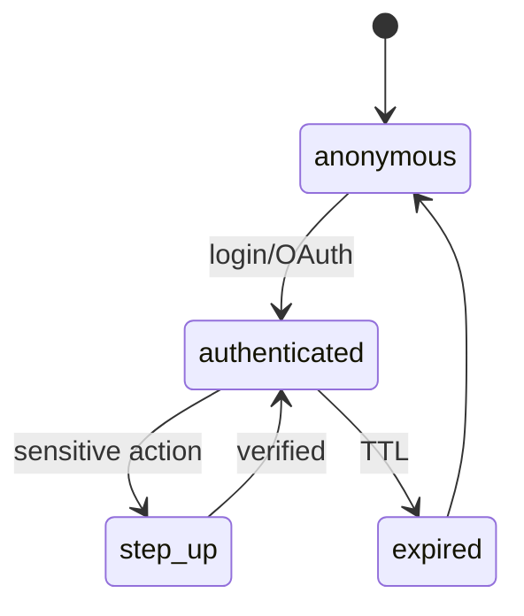

# AUTH, SESSION, AND ELIGIBILITY

**Status:** reviewed
**Owner:** platform-orchestrator
**Last updated:** 2026-07-25
**Product:** RetroPick Markets V1
**Wave:** 3 — Backend architecture and API contracts

## 1. Purpose

Authentication, session management, and jurisdiction eligibility for Markets API.

## 2. Auth model

- Primary: RetroPick session JWT (HttpOnly cookie web; secure storage Android).
- Wallet signing: separate EIP-712 flows; not a session substitute.
- Service-to-service: mTLS internal only.

## 3. Session lifecycle



| Setting | Value |
|---------|-------|
| Access token TTL | 15m |
| Refresh token TTL | 30d |
| Step-up TTL | 5m |
| Max devices | 10 per user |

## 4. Eligibility

`GET /markets/eligibility` — server-authoritative, fail-closed.

Checks (in order):
1. Maintenance mode flag
2. GeoIP + Polymarket geoblock API cross-check
3. Sanctions list (if enabled)
4. Account standing (suspended/banned)
5. Age/terms acceptance version

Persist decisions in `markets.eligibility_decisions` for audit (hashed IP, region code).

## 5. Middleware

```
Request → extract session → load user → eligibility cache → handler gate
```

Trading routes require `eligible: true` AND capability flag AND step-up if configured.

## 6. Wallet binding

User may link multiple proxy/Safe addresses. `wallet_accounts` stores linkage proof
(signature challenge). Orders must use linked maker address.

## 7. Security controls

- Rate limit auth endpoints separately (10/min/IP).
- Rotate refresh tokens on use.
- Revoke all sessions on password change.
- No PII in eligibility logs; redact IP to /24 hash.

## Eligibility rule pack 1

Documented mapping from region code to `eligible` boolean and `reason` code.
Updated via config bundle version `eligibility-rules-v{n}`. Clients display
reason string from API only; never infer from client-side geo alone.

## Eligibility rule pack 2

Documented mapping from region code to `eligible` boolean and `reason` code.
Updated via config bundle version `eligibility-rules-v{n}`. Clients display
reason string from API only; never infer from client-side geo alone.

## Eligibility rule pack 3

Documented mapping from region code to `eligible` boolean and `reason` code.
Updated via config bundle version `eligibility-rules-v{n}`. Clients display
reason string from API only; never infer from client-side geo alone.

## Eligibility rule pack 4

Documented mapping from region code to `eligible` boolean and `reason` code.
Updated via config bundle version `eligibility-rules-v{n}`. Clients display
reason string from API only; never infer from client-side geo alone.

## Eligibility rule pack 5

Documented mapping from region code to `eligible` boolean and `reason` code.
Updated via config bundle version `eligibility-rules-v{n}`. Clients display
reason string from API only; never infer from client-side geo alone.

## Eligibility rule pack 6

Documented mapping from region code to `eligible` boolean and `reason` code.
Updated via config bundle version `eligibility-rules-v{n}`. Clients display
reason string from API only; never infer from client-side geo alone.

## Eligibility rule pack 7

Documented mapping from region code to `eligible` boolean and `reason` code.
Updated via config bundle version `eligibility-rules-v{n}`. Clients display
reason string from API only; never infer from client-side geo alone.

## Eligibility rule pack 8

Documented mapping from region code to `eligible` boolean and `reason` code.
Updated via config bundle version `eligibility-rules-v{n}`. Clients display
reason string from API only; never infer from client-side geo alone.

## Eligibility rule pack 9

Documented mapping from region code to `eligible` boolean and `reason` code.
Updated via config bundle version `eligibility-rules-v{n}`. Clients display
reason string from API only; never infer from client-side geo alone.

## Eligibility rule pack 10

Documented mapping from region code to `eligible` boolean and `reason` code.
Updated via config bundle version `eligibility-rules-v{n}`. Clients display
reason string from API only; never infer from client-side geo alone.

## Eligibility rule pack 11

Documented mapping from region code to `eligible` boolean and `reason` code.
Updated via config bundle version `eligibility-rules-v{n}`. Clients display
reason string from API only; never infer from client-side geo alone.

## Eligibility rule pack 12

Documented mapping from region code to `eligible` boolean and `reason` code.
Updated via config bundle version `eligibility-rules-v{n}`. Clients display
reason string from API only; never infer from client-side geo alone.

## Eligibility rule pack 13

Documented mapping from region code to `eligible` boolean and `reason` code.
Updated via config bundle version `eligibility-rules-v{n}`. Clients display
reason string from API only; never infer from client-side geo alone.

## Eligibility rule pack 14

Documented mapping from region code to `eligible` boolean and `reason` code.
Updated via config bundle version `eligibility-rules-v{n}`. Clients display
reason string from API only; never infer from client-side geo alone.

## Eligibility rule pack 15

Documented mapping from region code to `eligible` boolean and `reason` code.
Updated via config bundle version `eligibility-rules-v{n}`. Clients display
reason string from API only; never infer from client-side geo alone.

## Eligibility rule pack 16

Documented mapping from region code to `eligible` boolean and `reason` code.
Updated via config bundle version `eligibility-rules-v{n}`. Clients display
reason string from API only; never infer from client-side geo alone.

## Eligibility rule pack 17

Documented mapping from region code to `eligible` boolean and `reason` code.
Updated via config bundle version `eligibility-rules-v{n}`. Clients display
reason string from API only; never infer from client-side geo alone.

## Eligibility rule pack 18

Documented mapping from region code to `eligible` boolean and `reason` code.
Updated via config bundle version `eligibility-rules-v{n}`. Clients display
reason string from API only; never infer from client-side geo alone.

## Eligibility rule pack 19

Documented mapping from region code to `eligible` boolean and `reason` code.
Updated via config bundle version `eligibility-rules-v{n}`. Clients display
reason string from API only; never infer from client-side geo alone.

## Eligibility rule pack 20

Documented mapping from region code to `eligible` boolean and `reason` code.
Updated via config bundle version `eligibility-rules-v{n}`. Clients display
reason string from API only; never infer from client-side geo alone.

## Eligibility rule pack 21

Documented mapping from region code to `eligible` boolean and `reason` code.
Updated via config bundle version `eligibility-rules-v{n}`. Clients display
reason string from API only; never infer from client-side geo alone.

## Eligibility rule pack 22

Documented mapping from region code to `eligible` boolean and `reason` code.
Updated via config bundle version `eligibility-rules-v{n}`. Clients display
reason string from API only; never infer from client-side geo alone.

## Eligibility rule pack 23

Documented mapping from region code to `eligible` boolean and `reason` code.
Updated via config bundle version `eligibility-rules-v{n}`. Clients display
reason string from API only; never infer from client-side geo alone.

## Eligibility rule pack 24

Documented mapping from region code to `eligible` boolean and `reason` code.
Updated via config bundle version `eligibility-rules-v{n}`. Clients display
reason string from API only; never infer from client-side geo alone.

## Eligibility rule pack 25

Documented mapping from region code to `eligible` boolean and `reason` code.
Updated via config bundle version `eligibility-rules-v{n}`. Clients display
reason string from API only; never infer from client-side geo alone.

## Eligibility rule pack 26

Documented mapping from region code to `eligible` boolean and `reason` code.
Updated via config bundle version `eligibility-rules-v{n}`. Clients display
reason string from API only; never infer from client-side geo alone.

## Eligibility rule pack 27

Documented mapping from region code to `eligible` boolean and `reason` code.
Updated via config bundle version `eligibility-rules-v{n}`. Clients display
reason string from API only; never infer from client-side geo alone.

## Appendix 1

| Key | Specification |
|-----|---------------|
| Wave | 3 reviewed 2026-07-25 |
| Venue | Polymarket Gamma/CLOB/on-chain |
| BFF | apps/backend/internal/markets |
| Schema | markets.* PostgreSQL |
| Contract | schemas/openapi/markets-v1.yaml |
| Idempotency | Idempotency-Key header on POST |
| Money | Fixed-point Money schema |
| Phase gating | x-phase OpenAPI extension |
| Fail closed | eligible:false on unknown policy |
| Intelligence | Isolated from trading path ADR-008 |

## Appendix 2

| Key | Specification |
|-----|---------------|
| Wave | 3 reviewed 2026-07-25 |
| Venue | Polymarket Gamma/CLOB/on-chain |
| BFF | apps/backend/internal/markets |
| Schema | markets.* PostgreSQL |
| Contract | schemas/openapi/markets-v1.yaml |
| Idempotency | Idempotency-Key header on POST |
| Money | Fixed-point Money schema |
| Phase gating | x-phase OpenAPI extension |
| Fail closed | eligible:false on unknown policy |
| Intelligence | Isolated from trading path ADR-008 |

## Appendix 3

| Key | Specification |
|-----|---------------|
| Wave | 3 reviewed 2026-07-25 |
| Venue | Polymarket Gamma/CLOB/on-chain |
| BFF | apps/backend/internal/markets |
| Schema | markets.* PostgreSQL |
| Contract | schemas/openapi/markets-v1.yaml |
| Idempotency | Idempotency-Key header on POST |
| Money | Fixed-point Money schema |
| Phase gating | x-phase OpenAPI extension |
| Fail closed | eligible:false on unknown policy |
| Intelligence | Isolated from trading path ADR-008 |

## Appendix 4

| Key | Specification |
|-----|---------------|
| Wave | 3 reviewed 2026-07-25 |
| Venue | Polymarket Gamma/CLOB/on-chain |
| BFF | apps/backend/internal/markets |
| Schema | markets.* PostgreSQL |
| Contract | schemas/openapi/markets-v1.yaml |
| Idempotency | Idempotency-Key header on POST |
| Money | Fixed-point Money schema |
| Phase gating | x-phase OpenAPI extension |
| Fail closed | eligible:false on unknown policy |
| Intelligence | Isolated from trading path ADR-008 |

## Appendix 5

| Key | Specification |
|-----|---------------|
| Wave | 3 reviewed 2026-07-25 |
| Venue | Polymarket Gamma/CLOB/on-chain |
| BFF | apps/backend/internal/markets |
| Schema | markets.* PostgreSQL |
| Contract | schemas/openapi/markets-v1.yaml |
| Idempotency | Idempotency-Key header on POST |
| Money | Fixed-point Money schema |
| Phase gating | x-phase OpenAPI extension |
| Fail closed | eligible:false on unknown policy |
| Intelligence | Isolated from trading path ADR-008 |

## Appendix 6

| Key | Specification |
|-----|---------------|
| Wave | 3 reviewed 2026-07-25 |
| Venue | Polymarket Gamma/CLOB/on-chain |
| BFF | apps/backend/internal/markets |
| Schema | markets.* PostgreSQL |
| Contract | schemas/openapi/markets-v1.yaml |
| Idempotency | Idempotency-Key header on POST |
| Money | Fixed-point Money schema |
| Phase gating | x-phase OpenAPI extension |
| Fail closed | eligible:false on unknown policy |
| Intelligence | Isolated from trading path ADR-008 |

## Appendix 7

| Key | Specification |
|-----|---------------|
| Wave | 3 reviewed 2026-07-25 |
| Venue | Polymarket Gamma/CLOB/on-chain |
| BFF | apps/backend/internal/markets |
| Schema | markets.* PostgreSQL |
| Contract | schemas/openapi/markets-v1.yaml |
| Idempotency | Idempotency-Key header on POST |
| Money | Fixed-point Money schema |
| Phase gating | x-phase OpenAPI extension |
| Fail closed | eligible:false on unknown policy |
| Intelligence | Isolated from trading path ADR-008 |

## Appendix 8

| Key | Specification |
|-----|---------------|
| Wave | 3 reviewed 2026-07-25 |
| Venue | Polymarket Gamma/CLOB/on-chain |
| BFF | apps/backend/internal/markets |
| Schema | markets.* PostgreSQL |
| Contract | schemas/openapi/markets-v1.yaml |
| Idempotency | Idempotency-Key header on POST |
| Money | Fixed-point Money schema |
| Phase gating | x-phase OpenAPI extension |
| Fail closed | eligible:false on unknown policy |
| Intelligence | Isolated from trading path ADR-008 |

## Appendix 9

| Key | Specification |
|-----|---------------|
| Wave | 3 reviewed 2026-07-25 |
| Venue | Polymarket Gamma/CLOB/on-chain |
| BFF | apps/backend/internal/markets |
| Schema | markets.* PostgreSQL |
| Contract | schemas/openapi/markets-v1.yaml |
| Idempotency | Idempotency-Key header on POST |
| Money | Fixed-point Money schema |
| Phase gating | x-phase OpenAPI extension |
| Fail closed | eligible:false on unknown policy |
| Intelligence | Isolated from trading path ADR-008 |

## Appendix 10

| Key | Specification |
|-----|---------------|
| Wave | 3 reviewed 2026-07-25 |
| Venue | Polymarket Gamma/CLOB/on-chain |
| BFF | apps/backend/internal/markets |
| Schema | markets.* PostgreSQL |
| Contract | schemas/openapi/markets-v1.yaml |
| Idempotency | Idempotency-Key header on POST |
| Money | Fixed-point Money schema |
| Phase gating | x-phase OpenAPI extension |
| Fail closed | eligible:false on unknown policy |
| Intelligence | Isolated from trading path ADR-008 |

## Appendix 11

| Key | Specification |
|-----|---------------|
| Wave | 3 reviewed 2026-07-25 |
| Venue | Polymarket Gamma/CLOB/on-chain |
| BFF | apps/backend/internal/markets |
| Schema | markets.* PostgreSQL |
| Contract | schemas/openapi/markets-v1.yaml |
| Idempotency | Idempotency-Key header on POST |
| Money | Fixed-point Money schema |
| Phase gating | x-phase OpenAPI extension |
| Fail closed | eligible:false on unknown policy |
| Intelligence | Isolated from trading path ADR-008 |


## Appendix 1

| Key | Specification |
|-----|---------------|
| Wave | 3 reviewed 2026-07-25 |
| Venue | Polymarket Gamma/CLOB/on-chain |
| BFF | apps/backend/internal/markets |
| Schema | markets.* PostgreSQL |
| Contract | schemas/openapi/markets-v1.yaml |
| Idempotency | Idempotency-Key header on POST |
| Money | Fixed-point Money schema |
| Phase gating | x-phase OpenAPI extension |
| Fail closed | eligible:false on unknown policy |
| Intelligence | Isolated from trading path ADR-008 |


## Appendix 2

| Key | Specification |
|-----|---------------|
| Wave | 3 reviewed 2026-07-25 |
| Venue | Polymarket Gamma/CLOB/on-chain |
| BFF | apps/backend/internal/markets |
| Schema | markets.* PostgreSQL |
| Contract | schemas/openapi/markets-v1.yaml |
| Idempotency | Idempotency-Key header on POST |
| Money | Fixed-point Money schema |
| Phase gating | x-phase OpenAPI extension |
| Fail closed | eligible:false on unknown policy |
| Intelligence | Isolated from trading path ADR-008 |
