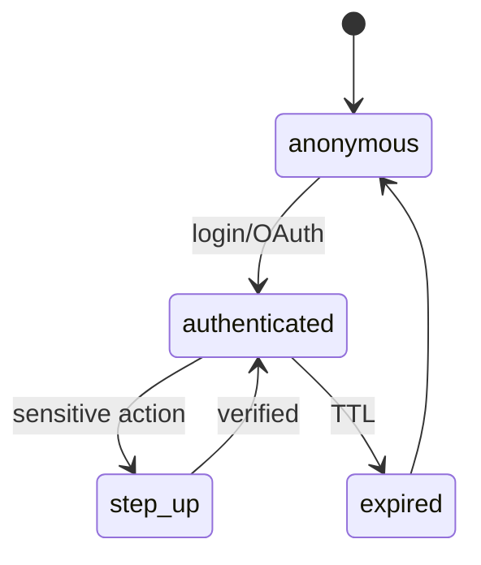

# AUTH, SESSION, AND ELIGIBILITY

**Status:** reviewed
**Owner:** platform-orchestrator
**Last updated:** 2026-07-25
**Product:** RetroPick Markets V1
**Wave:** 3 — Backend architecture and API contracts

## Description

This document is the authority for **authentication, session lifecycle, and jurisdiction eligibility** on the Markets V1 API. It defines RetroPick session JWT as primary auth (wallet EIP-712 signing is separate—not a session substitute), session states and TTLs, server-authoritative fail-closed `GET /markets/eligibility`, ordered policy checks, wallet binding via `wallet_accounts`, and security controls (rate limits, refresh rotation, revoke, hashed IP)—so clients never invent allow/deny from on-device geo alone.

It sits in Wave 3 beside API/realtime contracts and cache/rate-limit specs. Decisions persist in `markets.eligibility_decisions`; cache keys follow `mkt:eligibility:{ip_hash}`. Rule packs version as `eligibility-rules-v{n}`. Trading/funding/withdrawal routes require `eligible: true` plus capability and optional step-up. Service-to-service uses mTLS only. Unknown policy or GeoIP failure fails closed—never trust client GPS. Private keys stay off the server.

Read this when wiring middleware gates, wallet-binding flows, or eligibility UX reason codes. Prefer sibling docs for OpenAPI operation inventory and Redis TTLs—not for session/eligibility semantics.

## 0. Developer intent (5W+1H)

Short orientation for implementers and agents. Read this before the normative sections below.

| Lens | Answer |
|------|--------|
| **Who** | API middleware / security owners wiring session JWT and eligibility gates; web (HttpOnly cookie) and Android (secure storage) auth clients; wallet-binding flows that link proxy/Safe addresses; ops updating `eligibility-rules-v{n}` config bundles; auditors reading `markets.eligibility_decisions`. |
| **What** | Auth model (RetroPick session JWT primary; EIP-712 wallet signing separate—not a session substitute; mTLS for service-to-service only), session lifecycle (anonymous → authenticated → step_up → expired), TTLs (access 15m, refresh 30d, step-up 5m, max 10 devices), server-authoritative fail-closed `GET /markets/eligibility`, ordered checks (maintenance, GeoIP + Polymarket geoblock, sanctions if enabled, account standing, age/terms version), wallet binding via `wallet_accounts`, and security controls (auth rate limits, refresh rotation, session revoke, hashed IP). |
| **When** | On every Markets request through middleware; explicitly before trading/funding/withdrawal routes that require `eligible: true` + capability + optional step-up. On login/OAuth, password change (revoke all), and eligibility policy bundle updates. Clients must not invent eligibility from on-device geo alone. |
| **Where** | Spec: this file. Endpoint: `GET /markets/eligibility` (OpenAPI). Persistence: `markets.eligibility_decisions` (hashed IP, region code, reason). Cache key pattern: `mkt:eligibility:{ip_hash}` (see cache doc). Middleware order: extract session → load user → eligibility cache → handler gate. Wallet linkage proof on `wallet_accounts`; orders must use a linked maker address. Rule packs versioned `eligibility-rules-v{n}`. |
| **Why** | Jurisdiction and account standing are product/legal gates—fail-closed protects users and the operator when policy or geoblock is unknown. Separating session auth from wallet signatures prevents “signed once = logged in forever” confusion and keeps private keys off the server. Audit rows enable dispute review without storing raw PII in logs. |
| **How** | Issue/refresh JWTs with stated TTLs; rotate refresh on use; step-up for sensitive actions (5m). Eligibility: evaluate checks in order; on any miss/unknown → `eligible: false` + reason code from API; persist decision for audit; cache by IP hash. Trading middleware requires eligible + capability (+ step-up if configured). Bind wallets with signature challenge; reject orders from unbound makers. Rate-limit auth 10/min/IP; redact IP to /24 hash in logs. |

### Worked example

**Happy path.** User completes OAuth → authenticated session (HttpOnly cookie on web; secure storage on Android). Client calls `GET /markets/eligibility`; server passes maintenance → GeoIP + Polymarket geoblock → sanctions (if enabled) → account standing → age/terms version → `eligible: true`. Decision persisted in `markets.eligibility_decisions` (hashed IP, region); cache key `mkt:eligibility:{ip_hash}` filled. User links proxy/Safe via signature challenge into `wallet_accounts`. Later `POST /markets/orders/preview` passes auth + eligibility + capability; EIP-712 signing remains a separate client step (not a session substitute).

**Happy path — step-up.** Sensitive action (e.g. withdrawal submit) enters `step_up` for 5m after verification, then returns to authenticated. Refresh token rotates on use (30d TTL); access token 15m.

**Failure / degraded.** Geoblock or unknown policy → `eligible: false`; trading routes return `ELIGIBILITY_DENIED` (catalog may still read per product rules). GeoIP timeout: **fail closed**—never trust client GPS alone. Missing step-up → challenge before sensitive POST. Password change revokes all sessions (max 10 devices). Auth endpoints rate-limited 10/min/IP. Clients display API reason strings only—never infer allow/deny from device locale. Logs redact IP to /24 hash; no PII in eligibility logs.

### Session states

```text
anonymous → authenticated (login/OAuth)
authenticated → step_up → authenticated
authenticated → expired (TTL) → anonymous
```

| Setting | Value |
|---------|-------|
| Access token TTL | 15m |
| Refresh token TTL | 30d |
| Step-up TTL | 5m |
| Max devices | 10 / user |

### Eligibility check order (fail closed)

1. Maintenance mode flag
2. GeoIP + Polymarket geoblock cross-check
3. Sanctions list (if enabled)
4. Account standing (suspended/banned)
5. Age / terms acceptance version

### Middleware sketch

```text
Request → extract session → load user → eligibility cache → handler gate
```

Trading requires `eligible: true` AND capability flag AND step-up when configured. Orders must use a linked maker address from `wallet_accounts`.

### Implementer checklist

- Wallet signature ≠ session login.
- Service-to-service: mTLS only.
- Rule packs versioned `eligibility-rules-v{n}`; clients never hardcode region maps.
- Cache invalidation on policy bundle change.

## 1. Purpose

Authentication, session management, and jurisdiction eligibility for Markets API.

## 2. Auth model

- Primary: RetroPick session JWT (HttpOnly cookie web; secure storage Android).
- Wallet signing: separate EIP-712 flows; not a session substitute.
- Service-to-service: mTLS internal only.

## 3. Session lifecycle



| Setting | Value |
|---------|-------|
| Access token TTL | 15m |
| Refresh token TTL | 30d |
| Step-up TTL | 5m |
| Max devices | 10 per user |

## 4. Eligibility

`GET /markets/eligibility` — server-authoritative, fail-closed.

Checks (in order):
1. Maintenance mode flag
2. GeoIP + Polymarket geoblock API cross-check
3. Sanctions list (if enabled)
4. Account standing (suspended/banned)
5. Age/terms acceptance version

Persist decisions in `markets.eligibility_decisions` for audit (hashed IP, region code).

## 5. Middleware

```
Request → extract session → load user → eligibility cache → handler gate
```

Trading routes require `eligible: true` AND capability flag AND step-up if configured.

## 6. Wallet binding

User may link multiple proxy/Safe addresses. `wallet_accounts` stores linkage proof
(signature challenge). Orders must use linked maker address.

## 7. Security controls

- Rate limit auth endpoints separately (10/min/IP).
- Rotate refresh tokens on use.
- Revoke all sessions on password change.
- No PII in eligibility logs; redact IP to /24 hash.

## Eligibility rule pack 1

Documented mapping from region code to `eligible` boolean and `reason` code.
Updated via config bundle version `eligibility-rules-v{n}`. Clients display
reason string from API only; never infer from client-side geo alone.

## Eligibility rule pack 2

Documented mapping from region code to `eligible` boolean and `reason` code.
Updated via config bundle version `eligibility-rules-v{n}`. Clients display
reason string from API only; never infer from client-side geo alone.

## Eligibility rule pack 3

Documented mapping from region code to `eligible` boolean and `reason` code.
Updated via config bundle version `eligibility-rules-v{n}`. Clients display
reason string from API only; never infer from client-side geo alone.

## Eligibility rule pack 4

Documented mapping from region code to `eligible` boolean and `reason` code.
Updated via config bundle version `eligibility-rules-v{n}`. Clients display
reason string from API only; never infer from client-side geo alone.

## Eligibility rule pack 5

Documented mapping from region code to `eligible` boolean and `reason` code.
Updated via config bundle version `eligibility-rules-v{n}`. Clients display
reason string from API only; never infer from client-side geo alone.

## Eligibility rule pack 6

Documented mapping from region code to `eligible` boolean and `reason` code.
Updated via config bundle version `eligibility-rules-v{n}`. Clients display
reason string from API only; never infer from client-side geo alone.

## Eligibility rule pack 7

Documented mapping from region code to `eligible` boolean and `reason` code.
Updated via config bundle version `eligibility-rules-v{n}`. Clients display
reason string from API only; never infer from client-side geo alone.

## Eligibility rule pack 8

Documented mapping from region code to `eligible` boolean and `reason` code.
Updated via config bundle version `eligibility-rules-v{n}`. Clients display
reason string from API only; never infer from client-side geo alone.

## Eligibility rule pack 9

Documented mapping from region code to `eligible` boolean and `reason` code.
Updated via config bundle version `eligibility-rules-v{n}`. Clients display
reason string from API only; never infer from client-side geo alone.

## Eligibility rule pack 10

Documented mapping from region code to `eligible` boolean and `reason` code.
Updated via config bundle version `eligibility-rules-v{n}`. Clients display
reason string from API only; never infer from client-side geo alone.

## Eligibility rule pack 11

Documented mapping from region code to `eligible` boolean and `reason` code.
Updated via config bundle version `eligibility-rules-v{n}`. Clients display
reason string from API only; never infer from client-side geo alone.

## Eligibility rule pack 12

Documented mapping from region code to `eligible` boolean and `reason` code.
Updated via config bundle version `eligibility-rules-v{n}`. Clients display
reason string from API only; never infer from client-side geo alone.

## Eligibility rule pack 13

Documented mapping from region code to `eligible` boolean and `reason` code.
Updated via config bundle version `eligibility-rules-v{n}`. Clients display
reason string from API only; never infer from client-side geo alone.

## Eligibility rule pack 14

Documented mapping from region code to `eligible` boolean and `reason` code.
Updated via config bundle version `eligibility-rules-v{n}`. Clients display
reason string from API only; never infer from client-side geo alone.

## Eligibility rule pack 15

Documented mapping from region code to `eligible` boolean and `reason` code.
Updated via config bundle version `eligibility-rules-v{n}`. Clients display
reason string from API only; never infer from client-side geo alone.

## Eligibility rule pack 16

Documented mapping from region code to `eligible` boolean and `reason` code.
Updated via config bundle version `eligibility-rules-v{n}`. Clients display
reason string from API only; never infer from client-side geo alone.

## Eligibility rule pack 17

Documented mapping from region code to `eligible` boolean and `reason` code.
Updated via config bundle version `eligibility-rules-v{n}`. Clients display
reason string from API only; never infer from client-side geo alone.

## Eligibility rule pack 18

Documented mapping from region code to `eligible` boolean and `reason` code.
Updated via config bundle version `eligibility-rules-v{n}`. Clients display
reason string from API only; never infer from client-side geo alone.

## Eligibility rule pack 19

Documented mapping from region code to `eligible` boolean and `reason` code.
Updated via config bundle version `eligibility-rules-v{n}`. Clients display
reason string from API only; never infer from client-side geo alone.

## Eligibility rule pack 20

Documented mapping from region code to `eligible` boolean and `reason` code.
Updated via config bundle version `eligibility-rules-v{n}`. Clients display
reason string from API only; never infer from client-side geo alone.

## Eligibility rule pack 21

Documented mapping from region code to `eligible` boolean and `reason` code.
Updated via config bundle version `eligibility-rules-v{n}`. Clients display
reason string from API only; never infer from client-side geo alone.

## Eligibility rule pack 22

Documented mapping from region code to `eligible` boolean and `reason` code.
Updated via config bundle version `eligibility-rules-v{n}`. Clients display
reason string from API only; never infer from client-side geo alone.

## Eligibility rule pack 23

Documented mapping from region code to `eligible` boolean and `reason` code.
Updated via config bundle version `eligibility-rules-v{n}`. Clients display
reason string from API only; never infer from client-side geo alone.

## Eligibility rule pack 24

Documented mapping from region code to `eligible` boolean and `reason` code.
Updated via config bundle version `eligibility-rules-v{n}`. Clients display
reason string from API only; never infer from client-side geo alone.

## Eligibility rule pack 25

Documented mapping from region code to `eligible` boolean and `reason` code.
Updated via config bundle version `eligibility-rules-v{n}`. Clients display
reason string from API only; never infer from client-side geo alone.

## Eligibility rule pack 26

Documented mapping from region code to `eligible` boolean and `reason` code.
Updated via config bundle version `eligibility-rules-v{n}`. Clients display
reason string from API only; never infer from client-side geo alone.

## Eligibility rule pack 27

Documented mapping from region code to `eligible` boolean and `reason` code.
Updated via config bundle version `eligibility-rules-v{n}`. Clients display
reason string from API only; never infer from client-side geo alone.

## Appendix 1

| Key | Specification |
|-----|---------------|
| Wave | 3 reviewed 2026-07-25 |
| Venue | Polymarket Gamma/CLOB/on-chain |
| BFF | apps/backend/internal/markets |
| Schema | markets.* PostgreSQL |
| Contract | schemas/openapi/markets-v1.yaml |
| Idempotency | Idempotency-Key header on POST |
| Money | Fixed-point Money schema |
| Phase gating | x-phase OpenAPI extension |
| Fail closed | eligible:false on unknown policy |
| Intelligence | Isolated from trading path ADR-008 |

## Appendix 2

| Key | Specification |
|-----|---------------|
| Wave | 3 reviewed 2026-07-25 |
| Venue | Polymarket Gamma/CLOB/on-chain |
| BFF | apps/backend/internal/markets |
| Schema | markets.* PostgreSQL |
| Contract | schemas/openapi/markets-v1.yaml |
| Idempotency | Idempotency-Key header on POST |
| Money | Fixed-point Money schema |
| Phase gating | x-phase OpenAPI extension |
| Fail closed | eligible:false on unknown policy |
| Intelligence | Isolated from trading path ADR-008 |

## Appendix 3

| Key | Specification |
|-----|---------------|
| Wave | 3 reviewed 2026-07-25 |
| Venue | Polymarket Gamma/CLOB/on-chain |
| BFF | apps/backend/internal/markets |
| Schema | markets.* PostgreSQL |
| Contract | schemas/openapi/markets-v1.yaml |
| Idempotency | Idempotency-Key header on POST |
| Money | Fixed-point Money schema |
| Phase gating | x-phase OpenAPI extension |
| Fail closed | eligible:false on unknown policy |
| Intelligence | Isolated from trading path ADR-008 |

## Appendix 4

| Key | Specification |
|-----|---------------|
| Wave | 3 reviewed 2026-07-25 |
| Venue | Polymarket Gamma/CLOB/on-chain |
| BFF | apps/backend/internal/markets |
| Schema | markets.* PostgreSQL |
| Contract | schemas/openapi/markets-v1.yaml |
| Idempotency | Idempotency-Key header on POST |
| Money | Fixed-point Money schema |
| Phase gating | x-phase OpenAPI extension |
| Fail closed | eligible:false on unknown policy |
| Intelligence | Isolated from trading path ADR-008 |

## Appendix 5

| Key | Specification |
|-----|---------------|
| Wave | 3 reviewed 2026-07-25 |
| Venue | Polymarket Gamma/CLOB/on-chain |
| BFF | apps/backend/internal/markets |
| Schema | markets.* PostgreSQL |
| Contract | schemas/openapi/markets-v1.yaml |
| Idempotency | Idempotency-Key header on POST |
| Money | Fixed-point Money schema |
| Phase gating | x-phase OpenAPI extension |
| Fail closed | eligible:false on unknown policy |
| Intelligence | Isolated from trading path ADR-008 |

## Appendix 6

| Key | Specification |
|-----|---------------|
| Wave | 3 reviewed 2026-07-25 |
| Venue | Polymarket Gamma/CLOB/on-chain |
| BFF | apps/backend/internal/markets |
| Schema | markets.* PostgreSQL |
| Contract | schemas/openapi/markets-v1.yaml |
| Idempotency | Idempotency-Key header on POST |
| Money | Fixed-point Money schema |
| Phase gating | x-phase OpenAPI extension |
| Fail closed | eligible:false on unknown policy |
| Intelligence | Isolated from trading path ADR-008 |

## Appendix 7

| Key | Specification |
|-----|---------------|
| Wave | 3 reviewed 2026-07-25 |
| Venue | Polymarket Gamma/CLOB/on-chain |
| BFF | apps/backend/internal/markets |
| Schema | markets.* PostgreSQL |
| Contract | schemas/openapi/markets-v1.yaml |
| Idempotency | Idempotency-Key header on POST |
| Money | Fixed-point Money schema |
| Phase gating | x-phase OpenAPI extension |
| Fail closed | eligible:false on unknown policy |
| Intelligence | Isolated from trading path ADR-008 |

## Appendix 8

| Key | Specification |
|-----|---------------|
| Wave | 3 reviewed 2026-07-25 |
| Venue | Polymarket Gamma/CLOB/on-chain |
| BFF | apps/backend/internal/markets |
| Schema | markets.* PostgreSQL |
| Contract | schemas/openapi/markets-v1.yaml |
| Idempotency | Idempotency-Key header on POST |
| Money | Fixed-point Money schema |
| Phase gating | x-phase OpenAPI extension |
| Fail closed | eligible:false on unknown policy |
| Intelligence | Isolated from trading path ADR-008 |

## Appendix 9

| Key | Specification |
|-----|---------------|
| Wave | 3 reviewed 2026-07-25 |
| Venue | Polymarket Gamma/CLOB/on-chain |
| BFF | apps/backend/internal/markets |
| Schema | markets.* PostgreSQL |
| Contract | schemas/openapi/markets-v1.yaml |
| Idempotency | Idempotency-Key header on POST |
| Money | Fixed-point Money schema |
| Phase gating | x-phase OpenAPI extension |
| Fail closed | eligible:false on unknown policy |
| Intelligence | Isolated from trading path ADR-008 |

## Appendix 10

| Key | Specification |
|-----|---------------|
| Wave | 3 reviewed 2026-07-25 |
| Venue | Polymarket Gamma/CLOB/on-chain |
| BFF | apps/backend/internal/markets |
| Schema | markets.* PostgreSQL |
| Contract | schemas/openapi/markets-v1.yaml |
| Idempotency | Idempotency-Key header on POST |
| Money | Fixed-point Money schema |
| Phase gating | x-phase OpenAPI extension |
| Fail closed | eligible:false on unknown policy |
| Intelligence | Isolated from trading path ADR-008 |

## Appendix 11

| Key | Specification |
|-----|---------------|
| Wave | 3 reviewed 2026-07-25 |
| Venue | Polymarket Gamma/CLOB/on-chain |
| BFF | apps/backend/internal/markets |
| Schema | markets.* PostgreSQL |
| Contract | schemas/openapi/markets-v1.yaml |
| Idempotency | Idempotency-Key header on POST |
| Money | Fixed-point Money schema |
| Phase gating | x-phase OpenAPI extension |
| Fail closed | eligible:false on unknown policy |
| Intelligence | Isolated from trading path ADR-008 |


## Appendix 1

| Key | Specification |
|-----|---------------|
| Wave | 3 reviewed 2026-07-25 |
| Venue | Polymarket Gamma/CLOB/on-chain |
| BFF | apps/backend/internal/markets |
| Schema | markets.* PostgreSQL |
| Contract | schemas/openapi/markets-v1.yaml |
| Idempotency | Idempotency-Key header on POST |
| Money | Fixed-point Money schema |
| Phase gating | x-phase OpenAPI extension |
| Fail closed | eligible:false on unknown policy |
| Intelligence | Isolated from trading path ADR-008 |


## Appendix 2

| Key | Specification |
|-----|---------------|
| Wave | 3 reviewed 2026-07-25 |
| Venue | Polymarket Gamma/CLOB/on-chain |
| BFF | apps/backend/internal/markets |
| Schema | markets.* PostgreSQL |
| Contract | schemas/openapi/markets-v1.yaml |
| Idempotency | Idempotency-Key header on POST |
| Money | Fixed-point Money schema |
| Phase gating | x-phase OpenAPI extension |
| Fail closed | eligible:false on unknown policy |
| Intelligence | Isolated from trading path ADR-008 |
