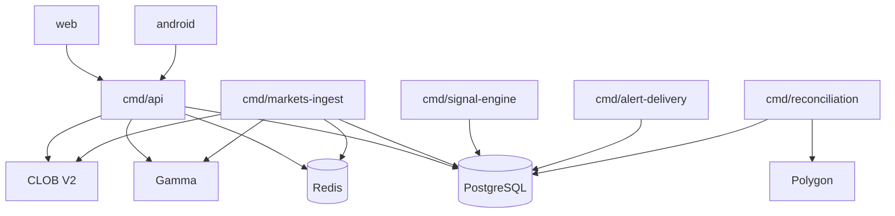
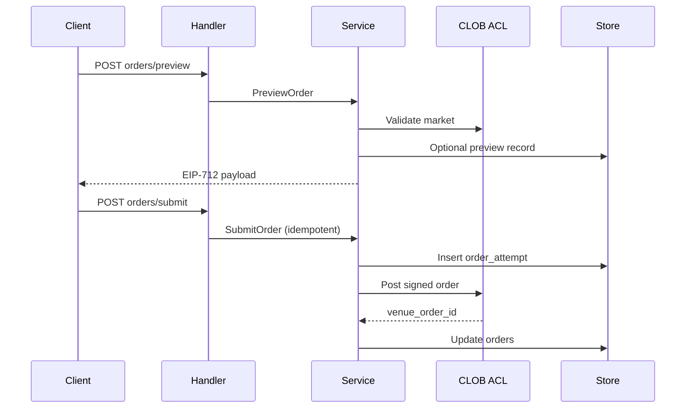

# BACKEND ARCHITECTURE

**Status:** reviewed
**Owner:** platform-orchestrator
**Last updated:** 2026-07-25
**Product:** RetroPick Markets V1
**Wave:** 3 — Backend architecture and API contracts

## Description

This document is the topology and process map for the RetroPick Markets V1 **greenfield Go BFF**. It defines one horizontally scaled `cmd/api` plus workers (`markets-ingest`, `signal-engine`, `alert-delivery`, `reconciliation`) sharing `apps/backend/internal/markets/`, PostgreSQL `markets.*` projections, Redis cache/queues, and OpenAPI as the contract—so implementers place features in the right process without inventing binaries or coupling trading to intelligence.

It sits in Wave 3 beside service boundaries, database, and API/realtime specs. Polymarket/CLOB/chain remain venue authority (ADR-001); RetroPick projects catalog, books, orders, and positions. Middleware order is request-ID → auth → eligibility → rate limit → handler. Money is fixed-point (`Money` / `BIGINT` base units)—never float. Intelligence must fail open relative to trading (ADR-008). Out of scope: PRISM, legacy epoch routes, custom exchange, and private-key custody.

Read this when adding a process, package, env var, or failure mode, or when sequencing Phase 1–4 rollout. Prefer sibling docs for per-context ownership, DDL, and OpenAPI operation semantics—not for inventing new topology.

## 0. Developer intent (5W+1H)

Short orientation for implementers and agents. Read this before the normative sections below.

| Lens | Answer |
|------|--------|
| **Who** | Go BFF owners (`be-api`, `be-indexer`, `be-realtime`, `be-keeper`-adjacent markets workers), platform-backend and intelligence-team owning `cmd/api`, `markets-ingest`, `signal-engine`, `alert-delivery`, and `reconciliation`; web/Android clients consuming `/api/v1/markets/*`; agents implementing Markets V1 phases without touching legacy epoch or PRISM. |
| **What** | Topology and process map for the Markets greenfield backend: one horizontally scaled API plus four workers sharing `apps/backend/internal/markets/`, PostgreSQL `markets.*` **projections**, Redis cache/queues, and OpenAPI as the contract. Bounded contexts (catalog, market-data, public-query, order-preview, wallet metadata, portfolio projection, chain-indexer, reconciliation, funding/withdrawal tracking, eligibility, notifications, signal-engine, etc.). **Not** a custom exchange, not ownership of venue balances/positions (Polymarket/CLOB/chain remain authority per ADR-001), and not legacy epoch routes. |
| **When** | Wave 3 architecture is the map for all Markets backend work. Phase 1 ships catalog + eligibility + capabilities; Phase 2 wallets/funding; Phase 3 trading + intelligence + alerts; Phase 4 portfolio/withdrawals/CTF ops. Use this doc when adding a process, package, env var, or failure mode—before inventing a new binary or coupling trading to intelligence. |
| **Where** | Spec: this file + [SERVICE_AND_MODULE_BOUNDARIES.md](./SERVICE_AND_MODULE_BOUNDARIES.md), [DATABASE_AND_MIGRATIONS.md](./DATABASE_AND_MIGRATIONS.md), [API_AND_REALTIME_CONTRACTS.md](./API_AND_REALTIME_CONTRACTS.md). Code: `apps/backend/cmd/{api,markets-ingest,signal-engine,alert-delivery,reconciliation}` and `internal/markets/{handler,service,store,domain,acl,workers,realtime}`. Contract: [schemas/openapi/markets-v1.yaml](../../../schemas/openapi/markets-v1.yaml). Current R3 handlers live in `internal/markets/handler.go` (Eligibility, Capabilities, ListEvents); target split is per-handler packages listed in §6. |
| **Why** | Clients need a single BFF that projects venue state safely, degrades independently per worker, and never confuses Redis/PG cache with settlement truth. Intelligence must fail open relative to trading (ADR-008). Clear topology prevents accidental private-key custody, silent order resubmit, or importing legacy domain into `internal/markets`. |
| **How** | Mount routes at `/api/v1/markets/*` with middleware chain request-ID → auth → eligibility → rate limit → handler. Ingest: lease `sync_checkpoints` → fetch → validate schema → immutable `raw_upstream_events` → UPSERT projections → Redis publish → enqueue `feature.extract`. Trading: preview → EIP-712 client sign → idempotent submit via CLOB ACL → persist `order_attempts`/`orders`. On upstream outage: serve stale catalog with labels; trading 503 when CLOB down; shed intelligence before order ack. Money always fixed-point (`Money` / `BIGINT` base units); never float. |

### Worked example

**Happy path — catalog + book tick.** `markets-ingest` acquires the Gamma stream lease on `sync_checkpoints`, fetches since cursor, validates schema version, inserts immutable `raw_upstream_events`, UPSERTs `catalog_*` and a book snapshot in one transaction, publishes `catalog.updated` / `book.snapshot`, and enqueues `feature.extract`. `cmd/api` `ListEvents` / orderbook handlers read Redis (`mkt:event:*`, `mkt:book:*`) or PG projections and return OpenAPI-shaped JSON with `DecimalString` prices and fixed-point `Money` where applicable. Signal-engine may later emit `signal.created`; the trading path is untouched.

**Happy path — order preview/submit.** Middleware runs request-ID → auth → eligibility → rate limit. Handler calls service → CLOB ACL validation → optional preview record → EIP-712 payload to client. Submit is idempotent: insert `order_attempts`, post signed order via ACL, persist `venue_order_id` on `orders`. Client watches WS `user.orders` / REST `me/orders` for projection updates; venue remains authority.

**Failure / degraded.** Gamma unavailable: API returns last good catalog with `"stale": true` and a banner; ingest freezes the checkpoint and retries with backoff (DLQ after 10 failures). CLOB unavailable: book ingest pauses and trading endpoints return 503—never invent fills. Redis down: API falls back to PG; queues spill to PG fallback / `dead_letter_jobs`. Signal-engine outage: intelligence routes 503; order preview/submit continue (ADR-008). Reconciliation stalled: user-visible `reconciling`; never silent resubmit of timed-out orders (`unknown` until reconcile). Kill switch `MARKETS_KILL_TRADING` stops submit without stopping catalog reads.

### Projection vs authority (read before coding)

| Concern | Authority | RetroPick role |
|---------|-----------|----------------|
| Event/market catalog | Gamma | Normalize + project `catalog_*` |
| Books/trades | CLOB WS/REST | Project `market_data_*` |
| Open orders / fills | CLOB | Project `orders` / `fills`; reconcile drift |
| Positions / CTF balances | CLOB + chain | Project `position_projections`; never user-edit as truth |
| Eligibility | Server policy + geoblock | Decide + audit; fail closed |
| Signals / alerts | Derived intelligence | Isolated; retractable; not an order path |

### Implementer checklist

- New process? Document binary, owned tables, events, SLO, DLQ, idempotency (match worker tables in §7–10).
- New package? Stay under `internal/markets/{handler,service,store,domain,acl,workers,realtime}`; no legacy epoch imports.
- Config via env vars in §13 (`MARKETS_*`); secrets in secret manager, not repo.
- Acceptance: four workers specified; OpenAPI ops with `x-phase`; degraded modes tested.
- Observability: `markets_*` metrics namespace; propagate trace context API → ACL → upstream.
- Rollout: respect phase table (1 catalog → 2 wallets/funding → 3 trading/intelligence → 4 portfolio).

## 1. Purpose

Go BFF and worker architecture for RetroPick Markets V1: HTTP API, ingest, signal-engine,
alert-delivery, and reconciliation processes. Polymarket remains venue authority (ADR-001).

## 2. Scope

### In scope
- `apps/backend/cmd/api` and worker commands sharing `internal/markets/`.
- PostgreSQL `markets.*` projections, Redis cache/queues, OpenAPI contract.
- Bounded contexts per master prompt §9.

### Out of scope
- PRISM, legacy epoch APIs, custom exchange (ADR-001).

## 3. Prerequisites

- [SERVICE_AND_MODULE_BOUNDARIES.md](./SERVICE_AND_MODULE_BOUNDARIES.md)
- [DATABASE_AND_MIGRATIONS.md](./DATABASE_AND_MIGRATIONS.md)
- [API_AND_REALTIME_CONTRACTS.md](./API_AND_REALTIME_CONTRACTS.md)
- [schemas/openapi/markets-v1.yaml](../../../schemas/openapi/markets-v1.yaml)

## 4. Topology



## 5. Bounded context map

| Context | Responsibility | Owned tables | Processes | Phase |
|---------|----------------|--------------|-----------|-------|
| market-catalog | Normalize Gamma events/markets/outcomes | `catalog_*` | markets-ingest, public-query | PHASE-1 |
| market-data-ingest | Books, trades, candles from CLOB/WS | `market_data_*, raw_upstream_events` | markets-ingest | PHASE-1 |
| public-query | Read APIs for catalog and market data | `read replicas of catalog_*` | API handlers | PHASE-1 |
| order-preview-orchestration | Preview/submit/cancel with ACL | `user_orders, order_attempts` | API + CLOB ACL | PHASE-3 |
| account-wallet-metadata | Proxy/Safe linkage, approvals | `wallet_accounts` | API + relayer ACL | PHASE-2 |
| portfolio-activity-projection | Positions, fills, activity feed | `fills, position_projections` | reconciliation | PHASE-4 |
| chain-indexer | Log ingestion and chain_events | `chain_events, sync_checkpoints` | markets-ingest | PHASE-1 |
| reconciliation | Drift detection and repair | `reconciliation_runs` | reconciliation worker | PHASE-3 |
| funding-withdrawal-tracking | On-ramp quotes and payout state | `funding_operations, withdrawal_operations` | API + partners | PHASE-2/4 |
| eligibility-policy | Geoblock and policy decisions | `eligibility_decisions` | API middleware | PHASE-1 |
| notifications | Inbox and delivery receipts | `notifications, alert_deliveries` | alert-delivery | PHASE-3 |
| intelligence-ingest | Feature extraction inputs | `raw_upstream_events (read)` | markets-ingest | PHASE-3 |
| signal-engine | Deterministic signals + evidence | `market_signals, signal_evidence` | signal-engine | PHASE-3 |
| wallet-profiler | Wallet labels and performance | `wallet_profiles, wallet_performance_snapshots` | signal-engine | PHASE-3 |
| alert-rules-delivery | Rule CRUD and fan-out | `alert_rules, alert_deliveries` | alert-delivery | PHASE-3 |
| market-health-analytics | Liquidity/spread snapshots | `market_health_snapshots` | signal-engine | PHASE-3 |
| relationship-scanner | Cross-market discrepancies | `market_relationships` | signal-engine | PHASE-8 |
| administration-operations | Kill switches, fee versions | `builder_fee_versions` | ops CLI | PHASE-6 |

## 6. API layer (`cmd/api`)

Stateless horizontally scaled process. Routes mounted at `/api/v1/markets/*`.
Middleware chain: request ID → auth → eligibility → rate limit → handler.

**Current implementation (R3):** `Eligibility`, `Capabilities`, `ListEvents` in
`apps/backend/internal/markets/handler.go`.

**Target handlers by package:**
- `handler/catalog.go` — events, markets, orderbook, history
- `handler/me.go` — wallets, balances, orders, activity, positions
- `handler/trading.go` — preview/submit/cancel
- `handler/funding.go` — quote, track, withdrawals
- `handler/wallet.go` — account-wallet, approvals relay
- `handler/intelligence.go` — signals, whales, wallet profiles, health, flow
- `handler/alerts.go` — rules, inbox
- `handler/journal.go` — trade journal CRUD

## 7. Worker: markets-ingest

| Attribute | Specification |
|-----------|---------------|
| Binary | `apps/backend/cmd/markets-ingest` |
| Responsibility | Catalog + market data + chain log ingestion |
| Owned tables | `catalog_*`, `market_data_*`, `raw_upstream_events`, `sync_checkpoints`, `chain_events` |
| Consumed events | — (poll/WS upstream) |
| Emitted events | `catalog.updated`, `trade.ingested`, `book.snapshot`, `chain.log` |
| Upstream deps | Gamma REST, CLOB REST/WS, Polygon RPC |
| Credentials | Read-only API keys, RPC URL |
| Scaling unit | 1 leader per stream (checkpoint lease in PG) |
| Failure isolation | Trading API continues with stale cache labels |
| SLO | Catalog lag p95 < 60s; book snapshot age p95 < 5s |
| Retry/DLQ | Exponential backoff; DLQ table after 10 failures |
| Idempotency | UNIQUE(upstream_source, upstream_id, sequence) on raw events |
| Deployment | Separate k8s deployment / systemd unit |
| Owner | platform-backend |

**Ingest tick algorithm:**
1. Acquire lease on `sync_checkpoints` row for stream key.
2. Fetch upstream since checkpoint cursor.
3. Validate JSON schema version; unknown → metric + skip + alert.
4. INSERT `raw_upstream_events` (immutable).
5. UPSERT normalized tables in one transaction.
6. COMMIT; publish Redis channel for cache bust / WS bridge.
7. Enqueue `feature.extract` job for signal-engine.

## 8. Worker: signal-engine

| Attribute | Specification |
|-----------|---------------|
| Binary | `apps/backend/cmd/signal-engine` |
| Responsibility | Deterministic feature extraction and signal generation |
| Owned tables | `market_signals`, `large_trade_signals`, `signal_evidence`, `signal_retractions`, `market_health_snapshots`, `wallet_profiles`, `wallet_performance_snapshots`, `wallet_labels`, `market_relationships` |
| Consumed events | `trade.ingested`, `book.snapshot`, `chain.log` |
| Emitted events | `signal.created`, `signal.retracted`, `health.snapshot` |
| Upstream deps | None synchronous |
| Credentials | DB only |
| Scaling unit | N consumers on Redis stream / PG queue |
| Failure isolation | MUST NOT block order path (ADR-008) |
| SLO | p95 signal latency < 30s from ingest |
| Retry/DLQ | At-least-once; dedupe by signal fingerprint |
| Idempotency | UNIQUE(rule_version, input_event_id, signal_type) |
| Deployment | Separate deployment, 2+ replicas |
| Owner | intelligence-team |

## 9. Worker: alert-delivery

| Attribute | Specification |
|-----------|---------------|
| Binary | `apps/backend/cmd/alert-delivery` |
| Responsibility | Rule matching, inbox writes, push/email/webhook dispatch |
| Owned tables | `alert_rules`, `alert_deliveries`, `notifications` |
| Consumed events | `signal.created`, `rule.updated` |
| Emitted events | `notification.sent`, `notification.failed` |
| Upstream deps | FCM, email provider, webhook endpoints |
| Credentials | Provider API keys (secret manager) |
| Scaling unit | Per-channel worker pools |
| Failure isolation | Alert failure does not affect trading |
| SLO | p95 delivery attempt < 60s after match |
| Retry/DLQ | 5 attempts per channel; dead letter with reason code |
| Idempotency | UNIQUE(rule_id, signal_id, channel) |
| Deployment | Separate deployment |
| Owner | platform-backend |

## 10. Worker: reconciliation

| Attribute | Specification |
|-----------|---------------|
| Binary | `apps/backend/cmd/reconciliation` |
| Responsibility | Venue/CLOB/chain vs projection drift detection and repair |
| Owned tables | `reconciliation_runs`, writes to `orders`, `fills`, `position_projections` |
| Consumed events | Scheduled ticks, manual ops trigger |
| Emitted events | `reconciliation.completed`, `reconciliation.drift` |
| Upstream deps | CLOB user endpoints, Polygon RPC |
| Credentials | Service account + user-scoped tokens via vault |
| Scaling unit | 1 scheduler + parallel shard workers |
| Failure isolation | Marks orders `reconciling`; never silent submit |
| SLO | User projection drift p95 < 60s |
| Retry/DLQ | Re-run with backoff; alert on sustained drift |
| Idempotency | Run id + entity key |
| Deployment | CronJob + on-demand API trigger (ops) |
| Owner | platform-sre |

See [INDEXING_RECONCILIATION_AND_REORGS.md](./INDEXING_RECONCILIATION_AND_REORGS.md).

## 11. Data flow: intelligence path

```text
official Polymarket sources
→ normalized immutable event (raw_upstream_events)
→ feature extraction (signal-engine)
→ deterministic signal + evidence
→ indexed rule matching (alert-delivery)
→ inbox / push / webhook fan-out
→ delivery receipt, expiry, or retraction
```

Properties: replayable from checkpoints; tolerant of duplicates and out-of-order delivery;
handles reorgs; degrades independently from trading.

## 12. Trading request path



## 13. Configuration

| Env var | Purpose |
|---------|---------|
| `MARKETS_GAMMA_BASE_URL` | Gamma API |
| `MARKETS_CLOB_BASE_URL` | CLOB V2 |
| `MARKETS_POLYGON_RPC` | Chain reads |
| `MARKETS_REDIS_URL` | Cache + queues |
| `MARKETS_BUILDER_KEY` | Attribution (secret) |
| `MARKETS_RELAYER_URL` | Gasless relay |
| `MARKETS_KILL_TRADING` | Emergency stop |

## 14. Package structure (target)

```text
internal/markets/
  handler/
  service/
  store/
  domain/
  acl/gamma clob relayer geoblock
  workers/ingest signal alerts reconcile
  realtime/
```

## 15. Failure and degraded modes

| Failure | API behavior | Worker behavior |
|---------|--------------|-----------------|
| Gamma unavailable | Stale catalog + banner | Ingest retries; checkpoint frozen |
| CLOB unavailable | Trading endpoints 503 | Book ingest pauses |
| Redis unavailable | Direct PG reads | Queue backlog in PG fallback table |
| Signal engine down | Intelligence 503 | Trading unaffected |
| Reconciliation stalled | `reconciling` status | Alert SRE |

## 16. Security

- Preview-before-sign for all asset transformations.
- No private key custody; relayer allowlists.
- Audit: eligibility, preview hash, submit, relay, withdrawal.
- [AUTH_SESSION_AND_ELIGIBILITY.md](./AUTH_SESSION_AND_ELIGIBILITY.md)

## 17. Observability

Metrics: `markets_*` namespace per [platform/OBSERVABILITY_SLOS_AND_ALERTS.md](../platform/OBSERVABILITY_SLOS_AND_ALERTS.md).
Trace context propagated API → ACL → upstream.

## 18. Testing

[BACKEND_TEST_STRATEGY.md](./BACKEND_TEST_STRATEGY.md) — unit, integration, contract, chaos.

## 19. Rollout phases

| Phase | Deliverable |
|-------|-------------|
| 1 | Catalog + eligibility + capabilities |
| 2 | Wallets + funding |
| 3 | Trading + intelligence + alerts |
| 4 | Portfolio + withdrawals + CTF ops |
| 6 | SRE hardening |
| 7 | Production |

## 20. Open questions

See [research/OPEN_QUESTIONS_AND_EXPIRING_ASSUMPTIONS.md](../research/OPEN_QUESTIONS_AND_EXPIRING_ASSUMPTIONS.md).

## 21. Acceptance criteria

- All four workers specified with SLO, idempotency, DLQ.
- OpenAPI ≥30 operations with `x-phase`.
- No legacy domain imports in `internal/markets`.

## 22. Endpoint inventory (OpenAPI)

| Method | Path | Phase | Auth |
|--------|------|-------|------|
| `GET` | `/markets/eligibility` | Phase 1 | public |
| `GET` | `/markets/capabilities` | Phase 1 | public |
| `GET` | `/markets/events` | Phase 1 | public |
| `GET` | `/markets/events/{eventId}` | Phase 1 | public |
| `GET` | `/markets/markets/{marketId}` | Phase 1 | public |
| `GET` | `/markets/markets/{marketId}/orderbook` | Phase 1 | public |
| `GET` | `/markets/markets/{marketId}/history` | Phase 1 | public |
| `GET` | `/markets/me/wallets` | Phase 2 | auth |
| `GET` | `/markets/me/balances` | Phase 2 | auth |
| `GET` | `/markets/me/orders` | Phase 3 | auth |
| `GET` | `/markets/me/activity` | Phase 3 | auth |
| `GET` | `/markets/me/positions` | Phase 4 | auth |
| `POST` | `/markets/account-wallet/preview` | Phase 2 | auth |
| `POST` | `/markets/account-wallet/relay` | Phase 2 | auth |
| `POST` | `/markets/approvals/preview` | Phase 2 | auth |
| `POST` | `/markets/approvals/relay` | Phase 2 | auth |
| `POST` | `/markets/funding/quote` | Phase 2 | auth |
| `POST` | `/markets/funding/track` | Phase 2 | auth |
| `POST` | `/markets/withdrawals/preview` | Phase 4 | auth |
| `POST` | `/markets/withdrawals/submit` | Phase 4 | auth |
| `POST` | `/markets/orders/preview` | Phase 3 | auth |
| `POST` | `/markets/orders/submit` | Phase 3 | auth |
| `POST` | `/markets/orders/{orderId}/cancel-preview` | Phase 3 | auth |
| `POST` | `/markets/orders/{orderId}/cancel` | Phase 3 | auth |
| `POST` | `/markets/positions/operation-preview` | Phase 4 | auth |
| `POST` | `/markets/positions/operation-relay` | Phase 4 | auth |
| `GET` | `/markets/watchlists` | Phase 1 | auth |
| `POST` | `/markets/watchlists` | Phase 1 | auth |
| `GET` | `/markets/intelligence/signals` | Phase 3 | auth |
| `GET` | `/markets/intelligence/whales` | Phase 3 | auth |
| `GET` | `/markets/intelligence/wallets/{address}` | Phase 3 | auth |
| `GET` | `/markets/markets/{marketId}/health` | Phase 3 | public |
| `GET` | `/markets/markets/{marketId}/flow` | Phase 3 | public |
| `GET` | `/markets/alerts/rules` | Phase 3 | auth |
| `POST` | `/markets/alerts/rules` | Phase 3 | auth |
| `GET` | `/markets/alerts/inbox` | Phase 3 | auth |
| `GET` | `/markets/me/execution-quality` | Phase 3 | auth |
| `GET` | `/markets/me/journal` | Phase 3 | auth |
| `POST` | `/markets/me/journal` | Phase 3 | auth |

## 23.1 Deep dive: market-catalog

**Phase:** PHASE-1
**Processes:** markets-ingest, public-query
**Tables:** `catalog_*`

**Responsibility:** Normalize Gamma events/markets/outcomes

**Health checks:** process heartbeat, checkpoint age, queue lag.
**Runbook:** see [platform/PRODUCTION_OPERATIONS_RUNBOOK.md](../platform/PRODUCTION_OPERATIONS_RUNBOOK.md).

## 23.2 Deep dive: market-data-ingest

**Phase:** PHASE-1
**Processes:** markets-ingest
**Tables:** `market_data_*, raw_upstream_events`

**Responsibility:** Books, trades, candles from CLOB/WS

**Health checks:** process heartbeat, checkpoint age, queue lag.
**Runbook:** see [platform/PRODUCTION_OPERATIONS_RUNBOOK.md](../platform/PRODUCTION_OPERATIONS_RUNBOOK.md).

## 23.3 Deep dive: public-query

**Phase:** PHASE-1
**Processes:** API handlers
**Tables:** `read replicas of catalog_*`

**Responsibility:** Read APIs for catalog and market data

**Health checks:** process heartbeat, checkpoint age, queue lag.
**Runbook:** see [platform/PRODUCTION_OPERATIONS_RUNBOOK.md](../platform/PRODUCTION_OPERATIONS_RUNBOOK.md).

## 23.4 Deep dive: order-preview-orchestration

**Phase:** PHASE-3
**Processes:** API + CLOB ACL
**Tables:** `user_orders, order_attempts`

**Responsibility:** Preview/submit/cancel with ACL

**Health checks:** process heartbeat, checkpoint age, queue lag.
**Runbook:** see [platform/PRODUCTION_OPERATIONS_RUNBOOK.md](../platform/PRODUCTION_OPERATIONS_RUNBOOK.md).

## 23.5 Deep dive: account-wallet-metadata

**Phase:** PHASE-2
**Processes:** API + relayer ACL
**Tables:** `wallet_accounts`

**Responsibility:** Proxy/Safe linkage, approvals

**Health checks:** process heartbeat, checkpoint age, queue lag.
**Runbook:** see [platform/PRODUCTION_OPERATIONS_RUNBOOK.md](../platform/PRODUCTION_OPERATIONS_RUNBOOK.md).

## 23.6 Deep dive: portfolio-activity-projection

**Phase:** PHASE-4
**Processes:** reconciliation
**Tables:** `fills, position_projections`

**Responsibility:** Positions, fills, activity feed

**Health checks:** process heartbeat, checkpoint age, queue lag.
**Runbook:** see [platform/PRODUCTION_OPERATIONS_RUNBOOK.md](../platform/PRODUCTION_OPERATIONS_RUNBOOK.md).

## 23.7 Deep dive: chain-indexer

**Phase:** PHASE-1
**Processes:** markets-ingest
**Tables:** `chain_events, sync_checkpoints`

**Responsibility:** Log ingestion and chain_events

**Health checks:** process heartbeat, checkpoint age, queue lag.
**Runbook:** see [platform/PRODUCTION_OPERATIONS_RUNBOOK.md](../platform/PRODUCTION_OPERATIONS_RUNBOOK.md).

## 23.8 Deep dive: reconciliation

**Phase:** PHASE-3
**Processes:** reconciliation worker
**Tables:** `reconciliation_runs`

**Responsibility:** Drift detection and repair

**Health checks:** process heartbeat, checkpoint age, queue lag.
**Runbook:** see [platform/PRODUCTION_OPERATIONS_RUNBOOK.md](../platform/PRODUCTION_OPERATIONS_RUNBOOK.md).

## 23.9 Deep dive: funding-withdrawal-tracking

**Phase:** PHASE-2/4
**Processes:** API + partners
**Tables:** `funding_operations, withdrawal_operations`

**Responsibility:** On-ramp quotes and payout state

**Health checks:** process heartbeat, checkpoint age, queue lag.
**Runbook:** see [platform/PRODUCTION_OPERATIONS_RUNBOOK.md](../platform/PRODUCTION_OPERATIONS_RUNBOOK.md).

## 23.10 Deep dive: eligibility-policy

**Phase:** PHASE-1
**Processes:** API middleware
**Tables:** `eligibility_decisions`

**Responsibility:** Geoblock and policy decisions

**Health checks:** process heartbeat, checkpoint age, queue lag.
**Runbook:** see [platform/PRODUCTION_OPERATIONS_RUNBOOK.md](../platform/PRODUCTION_OPERATIONS_RUNBOOK.md).

## 23.11 Deep dive: notifications

**Phase:** PHASE-3
**Processes:** alert-delivery
**Tables:** `notifications, alert_deliveries`

**Responsibility:** Inbox and delivery receipts

**Health checks:** process heartbeat, checkpoint age, queue lag.
**Runbook:** see [platform/PRODUCTION_OPERATIONS_RUNBOOK.md](../platform/PRODUCTION_OPERATIONS_RUNBOOK.md).

## 23.12 Deep dive: intelligence-ingest

**Phase:** PHASE-3
**Processes:** markets-ingest
**Tables:** `raw_upstream_events (read)`

**Responsibility:** Feature extraction inputs

**Health checks:** process heartbeat, checkpoint age, queue lag.
**Runbook:** see [platform/PRODUCTION_OPERATIONS_RUNBOOK.md](../platform/PRODUCTION_OPERATIONS_RUNBOOK.md).

## 23.13 Deep dive: signal-engine

**Phase:** PHASE-3
**Processes:** signal-engine
**Tables:** `market_signals, signal_evidence`

**Responsibility:** Deterministic signals + evidence

**Health checks:** process heartbeat, checkpoint age, queue lag.
**Runbook:** see [platform/PRODUCTION_OPERATIONS_RUNBOOK.md](../platform/PRODUCTION_OPERATIONS_RUNBOOK.md).

## 23.14 Deep dive: wallet-profiler

**Phase:** PHASE-3
**Processes:** signal-engine
**Tables:** `wallet_profiles, wallet_performance_snapshots`

**Responsibility:** Wallet labels and performance

**Health checks:** process heartbeat, checkpoint age, queue lag.
**Runbook:** see [platform/PRODUCTION_OPERATIONS_RUNBOOK.md](../platform/PRODUCTION_OPERATIONS_RUNBOOK.md).

## 23.15 Deep dive: alert-rules-delivery

**Phase:** PHASE-3
**Processes:** alert-delivery
**Tables:** `alert_rules, alert_deliveries`

**Responsibility:** Rule CRUD and fan-out

**Health checks:** process heartbeat, checkpoint age, queue lag.
**Runbook:** see [platform/PRODUCTION_OPERATIONS_RUNBOOK.md](../platform/PRODUCTION_OPERATIONS_RUNBOOK.md).

## 23.16 Deep dive: market-health-analytics

**Phase:** PHASE-3
**Processes:** signal-engine
**Tables:** `market_health_snapshots`

**Responsibility:** Liquidity/spread snapshots

**Health checks:** process heartbeat, checkpoint age, queue lag.
**Runbook:** see [platform/PRODUCTION_OPERATIONS_RUNBOOK.md](../platform/PRODUCTION_OPERATIONS_RUNBOOK.md).

## 23.17 Deep dive: relationship-scanner

**Phase:** PHASE-8
**Processes:** signal-engine
**Tables:** `market_relationships`

**Responsibility:** Cross-market discrepancies

**Health checks:** process heartbeat, checkpoint age, queue lag.
**Runbook:** see [platform/PRODUCTION_OPERATIONS_RUNBOOK.md](../platform/PRODUCTION_OPERATIONS_RUNBOOK.md).

## 23.18 Deep dive: administration-operations

**Phase:** PHASE-6
**Processes:** ops CLI
**Tables:** `builder_fee_versions`

**Responsibility:** Kill switches, fee versions

**Health checks:** process heartbeat, checkpoint age, queue lag.
**Runbook:** see [platform/PRODUCTION_OPERATIONS_RUNBOOK.md](../platform/PRODUCTION_OPERATIONS_RUNBOOK.md).
