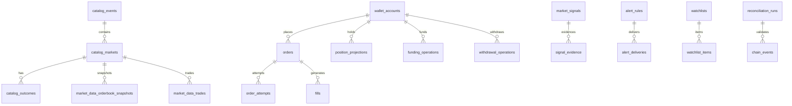

# DATABASE AND MIGRATIONS

**Status:** reviewed
**Owner:** platform-orchestrator
**Last updated:** 2026-07-25
**Product:** RetroPick Markets V1
**Wave:** 3 — Backend architecture and API contracts

    ## 1. Purpose

    PostgreSQL `markets.*` schema: ER diagram, table specifications, indices, migrations.
    Per master prompt §9.1.

    ## 2. Schema conventions

    - Schema: `markets`
    - PK: UUID v7 (`id`)
    - Money: `BIGINT` base units + `currency` / `decimals` metadata
    - Prices: `NUMERIC(38,18)` or string transport via `DecimalString`
    - Timestamps: `TIMESTAMPTZ` UTC
    - Upstream tuple: UNIQUE(`upstream_source`, `upstream_id`)
    - No floating point for money

    ## 3. ER diagram

    ## 4. Migration strategy

    - Tool: `golang-migrate` or `goose` under `apps/backend/migrations/markets/`
    - Naming: `YYYYMMDDHHMMSS_description.up.sql`
    - Expand-contract for zero-downtime deploys
    - Backfill jobs as separate worker tasks
    - Rollback: down migrations tested in CI

### `markets.catalog_venues`
| Field | Type | Constraints | Notes |
|-------|------|-------------|-------|
| id | UUID | PK | Internal surrogate key |
| created_at | TIMESTAMPTZ | NOT NULL DEFAULT now() | Insert time |
| updated_at | TIMESTAMPTZ | NOT NULL | Last mutation |
| upstream_source | TEXT | NOT NULL | gamma|clob|chain|relayer |
| upstream_id | TEXT | NOT NULL | Immutable venue identifier |
| version | INT | NOT NULL DEFAULT 1 | Optimistic locking |
| chain_id | INT | NOT NULL | Polygon mainnet = 137 |
| observed_at | TIMESTAMPTZ | NOT NULL | Upstream observation time |
| status | TEXT | NOT NULL | Domain-specific enum |
| payload_json | JSONB | NULL | Normalized upstream slice |
**Indices:** upstream tuple + status/time. **Retention:** domain policy in platform docs.

### `markets.catalog_events`
| Field | Type | Constraints | Notes |
|-------|------|-------------|-------|
| id | UUID | PK | Internal surrogate key |
| created_at | TIMESTAMPTZ | NOT NULL DEFAULT now() | Insert time |
| updated_at | TIMESTAMPTZ | NOT NULL | Last mutation |
| upstream_source | TEXT | NOT NULL | gamma|clob|chain|relayer |
| upstream_id | TEXT | NOT NULL | Immutable venue identifier |
| version | INT | NOT NULL DEFAULT 1 | Optimistic locking |
| chain_id | INT | NOT NULL | Polygon mainnet = 137 |
| observed_at | TIMESTAMPTZ | NOT NULL | Upstream observation time |
| status | TEXT | NOT NULL | Domain-specific enum |
| payload_json | JSONB | NULL | Normalized upstream slice |
**Indices:** upstream tuple + status/time. **Retention:** domain policy in platform docs.

### `markets.catalog_markets`
| Field | Type | Constraints | Notes |
|-------|------|-------------|-------|
| id | UUID | PK | Internal surrogate key |
| created_at | TIMESTAMPTZ | NOT NULL DEFAULT now() | Insert time |
| updated_at | TIMESTAMPTZ | NOT NULL | Last mutation |
| upstream_source | TEXT | NOT NULL | gamma|clob|chain|relayer |
| upstream_id | TEXT | NOT NULL | Immutable venue identifier |
| version | INT | NOT NULL DEFAULT 1 | Optimistic locking |
| chain_id | INT | NOT NULL | Polygon mainnet = 137 |
| observed_at | TIMESTAMPTZ | NOT NULL | Upstream observation time |
| status | TEXT | NOT NULL | Domain-specific enum |
| payload_json | JSONB | NULL | Normalized upstream slice |
**Indices:** upstream tuple + status/time. **Retention:** domain policy in platform docs.

### `markets.catalog_outcomes`
| Field | Type | Constraints | Notes |
|-------|------|-------------|-------|
| id | UUID | PK | Internal surrogate key |
| created_at | TIMESTAMPTZ | NOT NULL DEFAULT now() | Insert time |
| updated_at | TIMESTAMPTZ | NOT NULL | Last mutation |
| upstream_source | TEXT | NOT NULL | gamma|clob|chain|relayer |
| upstream_id | TEXT | NOT NULL | Immutable venue identifier |
| version | INT | NOT NULL DEFAULT 1 | Optimistic locking |
| chain_id | INT | NOT NULL | Polygon mainnet = 137 |
| observed_at | TIMESTAMPTZ | NOT NULL | Upstream observation time |
| status | TEXT | NOT NULL | Domain-specific enum |
| payload_json | JSONB | NULL | Normalized upstream slice |
**Indices:** upstream tuple + status/time. **Retention:** domain policy in platform docs.

### `markets.catalog_market_rules`
| Field | Type | Constraints | Notes |
|-------|------|-------------|-------|
| id | UUID | PK | Internal surrogate key |
| created_at | TIMESTAMPTZ | NOT NULL DEFAULT now() | Insert time |
| updated_at | TIMESTAMPTZ | NOT NULL | Last mutation |
| upstream_source | TEXT | NOT NULL | gamma|clob|chain|relayer |
| upstream_id | TEXT | NOT NULL | Immutable venue identifier |
| version | INT | NOT NULL DEFAULT 1 | Optimistic locking |
| chain_id | INT | NOT NULL | Polygon mainnet = 137 |
| observed_at | TIMESTAMPTZ | NOT NULL | Upstream observation time |
| status | TEXT | NOT NULL | Domain-specific enum |
| payload_json | JSONB | NULL | Normalized upstream slice |
**Indices:** upstream tuple + status/time. **Retention:** domain policy in platform docs.

### `markets.market_data_orderbook_snapshots`
| Field | Type | Constraints | Notes |
|-------|------|-------------|-------|
| id | UUID | PK | Internal surrogate key |
| created_at | TIMESTAMPTZ | NOT NULL DEFAULT now() | Insert time |
| updated_at | TIMESTAMPTZ | NOT NULL | Last mutation |
| upstream_source | TEXT | NOT NULL | gamma|clob|chain|relayer |
| upstream_id | TEXT | NOT NULL | Immutable venue identifier |
| version | INT | NOT NULL DEFAULT 1 | Optimistic locking |
| chain_id | INT | NOT NULL | Polygon mainnet = 137 |
| observed_at | TIMESTAMPTZ | NOT NULL | Upstream observation time |
| status | TEXT | NOT NULL | Domain-specific enum |
| payload_json | JSONB | NULL | Normalized upstream slice |
**Indices:** upstream tuple + status/time. **Retention:** domain policy in platform docs.

### `markets.market_data_trades`
| Field | Type | Constraints | Notes |
|-------|------|-------------|-------|
| id | UUID | PK | Internal surrogate key |
| created_at | TIMESTAMPTZ | NOT NULL DEFAULT now() | Insert time |
| updated_at | TIMESTAMPTZ | NOT NULL | Last mutation |
| upstream_source | TEXT | NOT NULL | gamma|clob|chain|relayer |
| upstream_id | TEXT | NOT NULL | Immutable venue identifier |
| version | INT | NOT NULL DEFAULT 1 | Optimistic locking |
| chain_id | INT | NOT NULL | Polygon mainnet = 137 |
| observed_at | TIMESTAMPTZ | NOT NULL | Upstream observation time |
| status | TEXT | NOT NULL | Domain-specific enum |
| payload_json | JSONB | NULL | Normalized upstream slice |
**Indices:** upstream tuple + status/time. **Retention:** domain policy in platform docs.

### `markets.market_data_price_candles`
| Field | Type | Constraints | Notes |
|-------|------|-------------|-------|
| id | UUID | PK | Internal surrogate key |
| created_at | TIMESTAMPTZ | NOT NULL DEFAULT now() | Insert time |
| updated_at | TIMESTAMPTZ | NOT NULL | Last mutation |
| upstream_source | TEXT | NOT NULL | gamma|clob|chain|relayer |
| upstream_id | TEXT | NOT NULL | Immutable venue identifier |
| version | INT | NOT NULL DEFAULT 1 | Optimistic locking |
| chain_id | INT | NOT NULL | Polygon mainnet = 137 |
| observed_at | TIMESTAMPTZ | NOT NULL | Upstream observation time |
| status | TEXT | NOT NULL | Domain-specific enum |
| payload_json | JSONB | NULL | Normalized upstream slice |
**Indices:** upstream tuple + status/time. **Retention:** domain policy in platform docs.

### `markets.orders`
| Field | Type | Constraints | Notes |
|-------|------|-------------|-------|
| id | UUID | PK | Internal surrogate key |
| created_at | TIMESTAMPTZ | NOT NULL DEFAULT now() | Insert time |
| updated_at | TIMESTAMPTZ | NOT NULL | Last mutation |
| upstream_source | TEXT | NOT NULL | gamma|clob|chain|relayer |
| upstream_id | TEXT | NOT NULL | Immutable venue identifier |
| version | INT | NOT NULL DEFAULT 1 | Optimistic locking |
| chain_id | INT | NOT NULL | Polygon mainnet = 137 |
| observed_at | TIMESTAMPTZ | NOT NULL | Upstream observation time |
| status | TEXT | NOT NULL | Domain-specific enum |
| payload_json | JSONB | NULL | Normalized upstream slice |
**Indices:** upstream tuple + status/time. **Retention:** domain policy in platform docs.

### `markets.order_attempts`
| Field | Type | Constraints | Notes |
|-------|------|-------------|-------|
| id | UUID | PK | Internal surrogate key |
| created_at | TIMESTAMPTZ | NOT NULL DEFAULT now() | Insert time |
| updated_at | TIMESTAMPTZ | NOT NULL | Last mutation |
| upstream_source | TEXT | NOT NULL | gamma|clob|chain|relayer |
| upstream_id | TEXT | NOT NULL | Immutable venue identifier |
| version | INT | NOT NULL DEFAULT 1 | Optimistic locking |
| chain_id | INT | NOT NULL | Polygon mainnet = 137 |
| observed_at | TIMESTAMPTZ | NOT NULL | Upstream observation time |
| status | TEXT | NOT NULL | Domain-specific enum |
| payload_json | JSONB | NULL | Normalized upstream slice |
**Indices:** upstream tuple + status/time. **Retention:** domain policy in platform docs.

### `markets.fills`
| Field | Type | Constraints | Notes |
|-------|------|-------------|-------|
| id | UUID | PK | Internal surrogate key |
| created_at | TIMESTAMPTZ | NOT NULL DEFAULT now() | Insert time |
| updated_at | TIMESTAMPTZ | NOT NULL | Last mutation |
| upstream_source | TEXT | NOT NULL | gamma|clob|chain|relayer |
| upstream_id | TEXT | NOT NULL | Immutable venue identifier |
| version | INT | NOT NULL DEFAULT 1 | Optimistic locking |
| chain_id | INT | NOT NULL | Polygon mainnet = 137 |
| observed_at | TIMESTAMPTZ | NOT NULL | Upstream observation time |
| status | TEXT | NOT NULL | Domain-specific enum |
| payload_json | JSONB | NULL | Normalized upstream slice |
**Indices:** upstream tuple + status/time. **Retention:** domain policy in platform docs.

### `markets.wallet_accounts`
| Field | Type | Constraints | Notes |
|-------|------|-------------|-------|
| id | UUID | PK | Internal surrogate key |
| created_at | TIMESTAMPTZ | NOT NULL DEFAULT now() | Insert time |
| updated_at | TIMESTAMPTZ | NOT NULL | Last mutation |
| upstream_source | TEXT | NOT NULL | gamma|clob|chain|relayer |
| upstream_id | TEXT | NOT NULL | Immutable venue identifier |
| version | INT | NOT NULL DEFAULT 1 | Optimistic locking |
| chain_id | INT | NOT NULL | Polygon mainnet = 137 |
| observed_at | TIMESTAMPTZ | NOT NULL | Upstream observation time |
| status | TEXT | NOT NULL | Domain-specific enum |
| payload_json | JSONB | NULL | Normalized upstream slice |
**Indices:** upstream tuple + status/time. **Retention:** domain policy in platform docs.

### `markets.funding_operations`
| Field | Type | Constraints | Notes |
|-------|------|-------------|-------|
| id | UUID | PK | Internal surrogate key |
| created_at | TIMESTAMPTZ | NOT NULL DEFAULT now() | Insert time |
| updated_at | TIMESTAMPTZ | NOT NULL | Last mutation |
| upstream_source | TEXT | NOT NULL | gamma|clob|chain|relayer |
| upstream_id | TEXT | NOT NULL | Immutable venue identifier |
| version | INT | NOT NULL DEFAULT 1 | Optimistic locking |
| chain_id | INT | NOT NULL | Polygon mainnet = 137 |
| observed_at | TIMESTAMPTZ | NOT NULL | Upstream observation time |
| status | TEXT | NOT NULL | Domain-specific enum |
| payload_json | JSONB | NULL | Normalized upstream slice |
**Indices:** upstream tuple + status/time. **Retention:** domain policy in platform docs.

### `markets.withdrawal_operations`
| Field | Type | Constraints | Notes |
|-------|------|-------------|-------|
| id | UUID | PK | Internal surrogate key |
| created_at | TIMESTAMPTZ | NOT NULL DEFAULT now() | Insert time |
| updated_at | TIMESTAMPTZ | NOT NULL | Last mutation |
| upstream_source | TEXT | NOT NULL | gamma|clob|chain|relayer |
| upstream_id | TEXT | NOT NULL | Immutable venue identifier |
| version | INT | NOT NULL DEFAULT 1 | Optimistic locking |
| chain_id | INT | NOT NULL | Polygon mainnet = 137 |
| observed_at | TIMESTAMPTZ | NOT NULL | Upstream observation time |
| status | TEXT | NOT NULL | Domain-specific enum |
| payload_json | JSONB | NULL | Normalized upstream slice |
**Indices:** upstream tuple + status/time. **Retention:** domain policy in platform docs.

### `markets.position_projections`
| Field | Type | Constraints | Notes |
|-------|------|-------------|-------|
| id | UUID | PK | Internal surrogate key |
| created_at | TIMESTAMPTZ | NOT NULL DEFAULT now() | Insert time |
| updated_at | TIMESTAMPTZ | NOT NULL | Last mutation |
| upstream_source | TEXT | NOT NULL | gamma|clob|chain|relayer |
| upstream_id | TEXT | NOT NULL | Immutable venue identifier |
| version | INT | NOT NULL DEFAULT 1 | Optimistic locking |
| chain_id | INT | NOT NULL | Polygon mainnet = 137 |
| observed_at | TIMESTAMPTZ | NOT NULL | Upstream observation time |
| status | TEXT | NOT NULL | Domain-specific enum |
| payload_json | JSONB | NULL | Normalized upstream slice |
**Indices:** upstream tuple + status/time. **Retention:** domain policy in platform docs.

### `markets.redemption_projections`
| Field | Type | Constraints | Notes |
|-------|------|-------------|-------|
| id | UUID | PK | Internal surrogate key |
| created_at | TIMESTAMPTZ | NOT NULL DEFAULT now() | Insert time |
| updated_at | TIMESTAMPTZ | NOT NULL | Last mutation |
| upstream_source | TEXT | NOT NULL | gamma|clob|chain|relayer |
| upstream_id | TEXT | NOT NULL | Immutable venue identifier |
| version | INT | NOT NULL DEFAULT 1 | Optimistic locking |
| chain_id | INT | NOT NULL | Polygon mainnet = 137 |
| observed_at | TIMESTAMPTZ | NOT NULL | Upstream observation time |
| status | TEXT | NOT NULL | Domain-specific enum |
| payload_json | JSONB | NULL | Normalized upstream slice |
**Indices:** upstream tuple + status/time. **Retention:** domain policy in platform docs.

### `markets.chain_events`
| Field | Type | Constraints | Notes |
|-------|------|-------------|-------|
| id | UUID | PK | Internal surrogate key |
| created_at | TIMESTAMPTZ | NOT NULL DEFAULT now() | Insert time |
| updated_at | TIMESTAMPTZ | NOT NULL | Last mutation |
| upstream_source | TEXT | NOT NULL | gamma|clob|chain|relayer |
| upstream_id | TEXT | NOT NULL | Immutable venue identifier |
| version | INT | NOT NULL DEFAULT 1 | Optimistic locking |
| chain_id | INT | NOT NULL | Polygon mainnet = 137 |
| observed_at | TIMESTAMPTZ | NOT NULL | Upstream observation time |
| status | TEXT | NOT NULL | Domain-specific enum |
| payload_json | JSONB | NULL | Normalized upstream slice |
**Indices:** upstream tuple + status/time. **Retention:** domain policy in platform docs.

### `markets.reconciliation_runs`
| Field | Type | Constraints | Notes |
|-------|------|-------------|-------|
| id | UUID | PK | Internal surrogate key |
| created_at | TIMESTAMPTZ | NOT NULL DEFAULT now() | Insert time |
| updated_at | TIMESTAMPTZ | NOT NULL | Last mutation |
| upstream_source | TEXT | NOT NULL | gamma|clob|chain|relayer |
| upstream_id | TEXT | NOT NULL | Immutable venue identifier |
| version | INT | NOT NULL DEFAULT 1 | Optimistic locking |
| chain_id | INT | NOT NULL | Polygon mainnet = 137 |
| observed_at | TIMESTAMPTZ | NOT NULL | Upstream observation time |
| status | TEXT | NOT NULL | Domain-specific enum |
| payload_json | JSONB | NULL | Normalized upstream slice |
**Indices:** upstream tuple + status/time. **Retention:** domain policy in platform docs.

### `markets.builder_fee_versions`
| Field | Type | Constraints | Notes |
|-------|------|-------------|-------|
| id | UUID | PK | Internal surrogate key |
| created_at | TIMESTAMPTZ | NOT NULL DEFAULT now() | Insert time |
| updated_at | TIMESTAMPTZ | NOT NULL | Last mutation |
| upstream_source | TEXT | NOT NULL | gamma|clob|chain|relayer |
| upstream_id | TEXT | NOT NULL | Immutable venue identifier |
| version | INT | NOT NULL DEFAULT 1 | Optimistic locking |
| chain_id | INT | NOT NULL | Polygon mainnet = 137 |
| observed_at | TIMESTAMPTZ | NOT NULL | Upstream observation time |
| status | TEXT | NOT NULL | Domain-specific enum |
| payload_json | JSONB | NULL | Normalized upstream slice |
**Indices:** upstream tuple + status/time. **Retention:** domain policy in platform docs.

### `markets.eligibility_decisions`
| Field | Type | Constraints | Notes |
|-------|------|-------------|-------|
| id | UUID | PK | Internal surrogate key |
| created_at | TIMESTAMPTZ | NOT NULL DEFAULT now() | Insert time |
| updated_at | TIMESTAMPTZ | NOT NULL | Last mutation |
| upstream_source | TEXT | NOT NULL | gamma|clob|chain|relayer |
| upstream_id | TEXT | NOT NULL | Immutable venue identifier |
| version | INT | NOT NULL DEFAULT 1 | Optimistic locking |
| chain_id | INT | NOT NULL | Polygon mainnet = 137 |
| observed_at | TIMESTAMPTZ | NOT NULL | Upstream observation time |
| status | TEXT | NOT NULL | Domain-specific enum |
| payload_json | JSONB | NULL | Normalized upstream slice |
**Indices:** upstream tuple + status/time. **Retention:** domain policy in platform docs.

### `markets.notifications`
| Field | Type | Constraints | Notes |
|-------|------|-------------|-------|
| id | UUID | PK | Internal surrogate key |
| created_at | TIMESTAMPTZ | NOT NULL DEFAULT now() | Insert time |
| updated_at | TIMESTAMPTZ | NOT NULL | Last mutation |
| upstream_source | TEXT | NOT NULL | gamma|clob|chain|relayer |
| upstream_id | TEXT | NOT NULL | Immutable venue identifier |
| version | INT | NOT NULL DEFAULT 1 | Optimistic locking |
| chain_id | INT | NOT NULL | Polygon mainnet = 137 |
| observed_at | TIMESTAMPTZ | NOT NULL | Upstream observation time |
| status | TEXT | NOT NULL | Domain-specific enum |
| payload_json | JSONB | NULL | Normalized upstream slice |
**Indices:** upstream tuple + status/time. **Retention:** domain policy in platform docs.

### `markets.watchlists`
| Field | Type | Constraints | Notes |
|-------|------|-------------|-------|
| id | UUID | PK | Internal surrogate key |
| created_at | TIMESTAMPTZ | NOT NULL DEFAULT now() | Insert time |
| updated_at | TIMESTAMPTZ | NOT NULL | Last mutation |
| upstream_source | TEXT | NOT NULL | gamma|clob|chain|relayer |
| upstream_id | TEXT | NOT NULL | Immutable venue identifier |
| version | INT | NOT NULL DEFAULT 1 | Optimistic locking |
| chain_id | INT | NOT NULL | Polygon mainnet = 137 |
| observed_at | TIMESTAMPTZ | NOT NULL | Upstream observation time |
| status | TEXT | NOT NULL | Domain-specific enum |
| payload_json | JSONB | NULL | Normalized upstream slice |
**Indices:** upstream tuple + status/time. **Retention:** domain policy in platform docs.

### `markets.watchlist_items`
| Field | Type | Constraints | Notes |
|-------|------|-------------|-------|
| id | UUID | PK | Internal surrogate key |
| created_at | TIMESTAMPTZ | NOT NULL DEFAULT now() | Insert time |
| updated_at | TIMESTAMPTZ | NOT NULL | Last mutation |
| upstream_source | TEXT | NOT NULL | gamma|clob|chain|relayer |
| upstream_id | TEXT | NOT NULL | Immutable venue identifier |
| version | INT | NOT NULL DEFAULT 1 | Optimistic locking |
| chain_id | INT | NOT NULL | Polygon mainnet = 137 |
| observed_at | TIMESTAMPTZ | NOT NULL | Upstream observation time |
| status | TEXT | NOT NULL | Domain-specific enum |
| payload_json | JSONB | NULL | Normalized upstream slice |
**Indices:** upstream tuple + status/time. **Retention:** domain policy in platform docs.

### `markets.wallet_profiles`
| Field | Type | Constraints | Notes |
|-------|------|-------------|-------|
| id | UUID | PK | Internal surrogate key |
| created_at | TIMESTAMPTZ | NOT NULL DEFAULT now() | Insert time |
| updated_at | TIMESTAMPTZ | NOT NULL | Last mutation |
| upstream_source | TEXT | NOT NULL | gamma|clob|chain|relayer |
| upstream_id | TEXT | NOT NULL | Immutable venue identifier |
| version | INT | NOT NULL DEFAULT 1 | Optimistic locking |
| chain_id | INT | NOT NULL | Polygon mainnet = 137 |
| observed_at | TIMESTAMPTZ | NOT NULL | Upstream observation time |
| status | TEXT | NOT NULL | Domain-specific enum |
| payload_json | JSONB | NULL | Normalized upstream slice |
**Indices:** upstream tuple + status/time. **Retention:** domain policy in platform docs.

### `markets.wallet_performance_snapshots`
| Field | Type | Constraints | Notes |
|-------|------|-------------|-------|
| id | UUID | PK | Internal surrogate key |
| created_at | TIMESTAMPTZ | NOT NULL DEFAULT now() | Insert time |
| updated_at | TIMESTAMPTZ | NOT NULL | Last mutation |
| upstream_source | TEXT | NOT NULL | gamma|clob|chain|relayer |
| upstream_id | TEXT | NOT NULL | Immutable venue identifier |
| version | INT | NOT NULL DEFAULT 1 | Optimistic locking |
| chain_id | INT | NOT NULL | Polygon mainnet = 137 |
| observed_at | TIMESTAMPTZ | NOT NULL | Upstream observation time |
| status | TEXT | NOT NULL | Domain-specific enum |
| payload_json | JSONB | NULL | Normalized upstream slice |
**Indices:** upstream tuple + status/time. **Retention:** domain policy in platform docs.

### `markets.wallet_labels`
| Field | Type | Constraints | Notes |
|-------|------|-------------|-------|
| id | UUID | PK | Internal surrogate key |
| created_at | TIMESTAMPTZ | NOT NULL DEFAULT now() | Insert time |
| updated_at | TIMESTAMPTZ | NOT NULL | Last mutation |
| upstream_source | TEXT | NOT NULL | gamma|clob|chain|relayer |
| upstream_id | TEXT | NOT NULL | Immutable venue identifier |
| version | INT | NOT NULL DEFAULT 1 | Optimistic locking |
| chain_id | INT | NOT NULL | Polygon mainnet = 137 |
| observed_at | TIMESTAMPTZ | NOT NULL | Upstream observation time |
| status | TEXT | NOT NULL | Domain-specific enum |
| payload_json | JSONB | NULL | Normalized upstream slice |
**Indices:** upstream tuple + status/time. **Retention:** domain policy in platform docs.

### `markets.large_trade_signals`
| Field | Type | Constraints | Notes |
|-------|------|-------------|-------|
| id | UUID | PK | Internal surrogate key |
| created_at | TIMESTAMPTZ | NOT NULL DEFAULT now() | Insert time |
| updated_at | TIMESTAMPTZ | NOT NULL | Last mutation |
| upstream_source | TEXT | NOT NULL | gamma|clob|chain|relayer |
| upstream_id | TEXT | NOT NULL | Immutable venue identifier |
| version | INT | NOT NULL DEFAULT 1 | Optimistic locking |
| chain_id | INT | NOT NULL | Polygon mainnet = 137 |
| observed_at | TIMESTAMPTZ | NOT NULL | Upstream observation time |
| status | TEXT | NOT NULL | Domain-specific enum |
| payload_json | JSONB | NULL | Normalized upstream slice |
**Indices:** upstream tuple + status/time. **Retention:** domain policy in platform docs.

### `markets.market_signals`
| Field | Type | Constraints | Notes |
|-------|------|-------------|-------|
| id | UUID | PK | Internal surrogate key |
| created_at | TIMESTAMPTZ | NOT NULL DEFAULT now() | Insert time |
| updated_at | TIMESTAMPTZ | NOT NULL | Last mutation |
| upstream_source | TEXT | NOT NULL | gamma|clob|chain|relayer |
| upstream_id | TEXT | NOT NULL | Immutable venue identifier |
| version | INT | NOT NULL DEFAULT 1 | Optimistic locking |
| chain_id | INT | NOT NULL | Polygon mainnet = 137 |
| observed_at | TIMESTAMPTZ | NOT NULL | Upstream observation time |
| status | TEXT | NOT NULL | Domain-specific enum |
| payload_json | JSONB | NULL | Normalized upstream slice |
**Indices:** upstream tuple + status/time. **Retention:** domain policy in platform docs.

### `markets.market_health_snapshots`
| Field | Type | Constraints | Notes |
|-------|------|-------------|-------|
| id | UUID | PK | Internal surrogate key |
| created_at | TIMESTAMPTZ | NOT NULL DEFAULT now() | Insert time |
| updated_at | TIMESTAMPTZ | NOT NULL | Last mutation |
| upstream_source | TEXT | NOT NULL | gamma|clob|chain|relayer |
| upstream_id | TEXT | NOT NULL | Immutable venue identifier |
| version | INT | NOT NULL DEFAULT 1 | Optimistic locking |
| chain_id | INT | NOT NULL | Polygon mainnet = 137 |
| observed_at | TIMESTAMPTZ | NOT NULL | Upstream observation time |
| status | TEXT | NOT NULL | Domain-specific enum |
| payload_json | JSONB | NULL | Normalized upstream slice |
**Indices:** upstream tuple + status/time. **Retention:** domain policy in platform docs.

### `markets.alert_rules`
| Field | Type | Constraints | Notes |
|-------|------|-------------|-------|
| id | UUID | PK | Internal surrogate key |
| created_at | TIMESTAMPTZ | NOT NULL DEFAULT now() | Insert time |
| updated_at | TIMESTAMPTZ | NOT NULL | Last mutation |
| upstream_source | TEXT | NOT NULL | gamma|clob|chain|relayer |
| upstream_id | TEXT | NOT NULL | Immutable venue identifier |
| version | INT | NOT NULL DEFAULT 1 | Optimistic locking |
| chain_id | INT | NOT NULL | Polygon mainnet = 137 |
| observed_at | TIMESTAMPTZ | NOT NULL | Upstream observation time |
| status | TEXT | NOT NULL | Domain-specific enum |
| payload_json | JSONB | NULL | Normalized upstream slice |
**Indices:** upstream tuple + status/time. **Retention:** domain policy in platform docs.

### `markets.alert_deliveries`
| Field | Type | Constraints | Notes |
|-------|------|-------------|-------|
| id | UUID | PK | Internal surrogate key |
| created_at | TIMESTAMPTZ | NOT NULL DEFAULT now() | Insert time |
| updated_at | TIMESTAMPTZ | NOT NULL | Last mutation |
| upstream_source | TEXT | NOT NULL | gamma|clob|chain|relayer |
| upstream_id | TEXT | NOT NULL | Immutable venue identifier |
| version | INT | NOT NULL DEFAULT 1 | Optimistic locking |
| chain_id | INT | NOT NULL | Polygon mainnet = 137 |
| observed_at | TIMESTAMPTZ | NOT NULL | Upstream observation time |
| status | TEXT | NOT NULL | Domain-specific enum |
| payload_json | JSONB | NULL | Normalized upstream slice |
**Indices:** upstream tuple + status/time. **Retention:** domain policy in platform docs.

### `markets.signal_evidence`
| Field | Type | Constraints | Notes |
|-------|------|-------------|-------|
| id | UUID | PK | Internal surrogate key |
| created_at | TIMESTAMPTZ | NOT NULL DEFAULT now() | Insert time |
| updated_at | TIMESTAMPTZ | NOT NULL | Last mutation |
| upstream_source | TEXT | NOT NULL | gamma|clob|chain|relayer |
| upstream_id | TEXT | NOT NULL | Immutable venue identifier |
| version | INT | NOT NULL DEFAULT 1 | Optimistic locking |
| chain_id | INT | NOT NULL | Polygon mainnet = 137 |
| observed_at | TIMESTAMPTZ | NOT NULL | Upstream observation time |
| status | TEXT | NOT NULL | Domain-specific enum |
| payload_json | JSONB | NULL | Normalized upstream slice |
**Indices:** upstream tuple + status/time. **Retention:** domain policy in platform docs.

### `markets.signal_retractions`
| Field | Type | Constraints | Notes |
|-------|------|-------------|-------|
| id | UUID | PK | Internal surrogate key |
| created_at | TIMESTAMPTZ | NOT NULL DEFAULT now() | Insert time |
| updated_at | TIMESTAMPTZ | NOT NULL | Last mutation |
| upstream_source | TEXT | NOT NULL | gamma|clob|chain|relayer |
| upstream_id | TEXT | NOT NULL | Immutable venue identifier |
| version | INT | NOT NULL DEFAULT 1 | Optimistic locking |
| chain_id | INT | NOT NULL | Polygon mainnet = 137 |
| observed_at | TIMESTAMPTZ | NOT NULL | Upstream observation time |
| status | TEXT | NOT NULL | Domain-specific enum |
| payload_json | JSONB | NULL | Normalized upstream slice |
**Indices:** upstream tuple + status/time. **Retention:** domain policy in platform docs.

### `markets.market_relationships`
| Field | Type | Constraints | Notes |
|-------|------|-------------|-------|
| id | UUID | PK | Internal surrogate key |
| created_at | TIMESTAMPTZ | NOT NULL DEFAULT now() | Insert time |
| updated_at | TIMESTAMPTZ | NOT NULL | Last mutation |
| upstream_source | TEXT | NOT NULL | gamma|clob|chain|relayer |
| upstream_id | TEXT | NOT NULL | Immutable venue identifier |
| version | INT | NOT NULL DEFAULT 1 | Optimistic locking |
| chain_id | INT | NOT NULL | Polygon mainnet = 137 |
| observed_at | TIMESTAMPTZ | NOT NULL | Upstream observation time |
| status | TEXT | NOT NULL | Domain-specific enum |
| payload_json | JSONB | NULL | Normalized upstream slice |
**Indices:** upstream tuple + status/time. **Retention:** domain policy in platform docs.

### `markets.execution_quality`
| Field | Type | Constraints | Notes |
|-------|------|-------------|-------|
| id | UUID | PK | Internal surrogate key |
| created_at | TIMESTAMPTZ | NOT NULL DEFAULT now() | Insert time |
| updated_at | TIMESTAMPTZ | NOT NULL | Last mutation |
| upstream_source | TEXT | NOT NULL | gamma|clob|chain|relayer |
| upstream_id | TEXT | NOT NULL | Immutable venue identifier |
| version | INT | NOT NULL DEFAULT 1 | Optimistic locking |
| chain_id | INT | NOT NULL | Polygon mainnet = 137 |
| observed_at | TIMESTAMPTZ | NOT NULL | Upstream observation time |
| status | TEXT | NOT NULL | Domain-specific enum |
| payload_json | JSONB | NULL | Normalized upstream slice |
**Indices:** upstream tuple + status/time. **Retention:** domain policy in platform docs.

### `markets.trade_journal_entries`
| Field | Type | Constraints | Notes |
|-------|------|-------------|-------|
| id | UUID | PK | Internal surrogate key |
| created_at | TIMESTAMPTZ | NOT NULL DEFAULT now() | Insert time |
| updated_at | TIMESTAMPTZ | NOT NULL | Last mutation |
| upstream_source | TEXT | NOT NULL | gamma|clob|chain|relayer |
| upstream_id | TEXT | NOT NULL | Immutable venue identifier |
| version | INT | NOT NULL DEFAULT 1 | Optimistic locking |
| chain_id | INT | NOT NULL | Polygon mainnet = 137 |
| observed_at | TIMESTAMPTZ | NOT NULL | Upstream observation time |
| status | TEXT | NOT NULL | Domain-specific enum |
| payload_json | JSONB | NULL | Normalized upstream slice |
**Indices:** upstream tuple + status/time. **Retention:** domain policy in platform docs.

### `markets.sync_checkpoints`
| Field | Type | Constraints | Notes |
|-------|------|-------------|-------|
| id | UUID | PK | Internal surrogate key |
| created_at | TIMESTAMPTZ | NOT NULL DEFAULT now() | Insert time |
| updated_at | TIMESTAMPTZ | NOT NULL | Last mutation |
| upstream_source | TEXT | NOT NULL | gamma|clob|chain|relayer |
| upstream_id | TEXT | NOT NULL | Immutable venue identifier |
| version | INT | NOT NULL DEFAULT 1 | Optimistic locking |
| chain_id | INT | NOT NULL | Polygon mainnet = 137 |
| observed_at | TIMESTAMPTZ | NOT NULL | Upstream observation time |
| status | TEXT | NOT NULL | Domain-specific enum |
| payload_json | JSONB | NULL | Normalized upstream slice |
**Indices:** upstream tuple + status/time. **Retention:** domain policy in platform docs.

### `markets.raw_upstream_events`
| Field | Type | Constraints | Notes |
|-------|------|-------------|-------|
| id | UUID | PK | Internal surrogate key |
| created_at | TIMESTAMPTZ | NOT NULL DEFAULT now() | Insert time |
| updated_at | TIMESTAMPTZ | NOT NULL | Last mutation |
| upstream_source | TEXT | NOT NULL | gamma|clob|chain|relayer |
| upstream_id | TEXT | NOT NULL | Immutable venue identifier |
| version | INT | NOT NULL DEFAULT 1 | Optimistic locking |
| chain_id | INT | NOT NULL | Polygon mainnet = 137 |
| observed_at | TIMESTAMPTZ | NOT NULL | Upstream observation time |
| status | TEXT | NOT NULL | Domain-specific enum |
| payload_json | JSONB | NULL | Normalized upstream slice |
**Indices:** upstream tuple + status/time. **Retention:** domain policy in platform docs.
