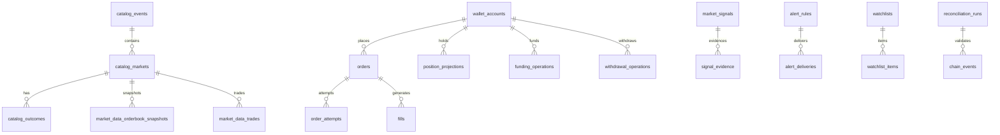

# DATABASE AND MIGRATIONS

**Status:** reviewed
**Owner:** platform-orchestrator
**Last updated:** 2026-08-09
**Product:** RetroPick Markets V1
**Wave:** 3 — Backend architecture and API contracts

## Description

This document is the authority for the PostgreSQL **`markets.*` schema and migrations** in RetroPick Markets V1. It defines conventions (UUID v7 PKs, `BIGINT` money base units, `NUMERIC`/`DecimalString` prices, `TIMESTAMPTZ` UTC, UNIQUE(`upstream_source`,`upstream_id`)), ER relationships, per-table field specs, indices, and expand-contract migration strategy—so projections stay replayable and idempotent against venue/chain truth without inventing ad-hoc tables outside `markets`.

It sits in Wave 3 beside service boundaries, domain state machines, and indexing/reorg specs. Migrations live under `apps/backend/migrations/markets/` with sqlc-generated store code. Immutable `raw_upstream_events` enable re-projection after bugs or reorgs; `position_projections` / fills are derived and repaired via reconciliation—not user-edited truth. No floating point for money. CI must exercise up/down on ephemeral DB.

Read this before any DDL, sqlc query, or store method that persists Markets state. Prefer sibling docs for who owns each table and status transition meaning—not for column/index conventions.

## 0. Developer intent (5W+1H)

Short orientation for implementers and agents. Read this before the normative sections below.

| Lens | Answer |
|------|--------|
| **Who** | `be-data` / platform-backend owning migrations and sqlc under `apps/backend/migrations/markets/` and `internal/markets/store`; ingest/reconcile/signal workers writing projections; API handlers reading catalog, orders, positions, intelligence tables; reviewers of expand-contract DDL. |
| **What** | PostgreSQL schema `markets.*`: conventions (UUID v7 PKs, `BIGINT` money base units + currency/decimals, `NUMERIC(38,18)` or `DecimalString` prices, `TIMESTAMPTZ` UTC, UNIQUE(`upstream_source`,`upstream_id`)), ER relationships, per-table field specs, indices, retention pointers, and migration strategy (`golang-migrate`/`goose`, expand-contract, CI up/down). Tables cover catalog, market data, orders/attempts/fills, wallets, funding/withdrawals, position/redemption **projections**, chain_events, sync_checkpoints, raw_upstream_events, signals/evidence/retractions, alerts, watchlists, wallet profiles, reconciliation_runs, eligibility_decisions, notifications, builder_fee_versions, execution_quality, trade_journal. |
| **When** | Before any DDL, sqlc query, or store method that persists Markets state. When adding a phase feature that needs a new relation, add migration here first—do not invent ad-hoc tables outside `markets`. Backfills are separate worker tasks, not sneaky app writes. |
| **Where** | Spec: this file. Code: `apps/backend/migrations/markets/YYYYMMDDHHMMSS_*.{up,down}.sql` + sqlc-generated store. Consumers by ownership: [SERVICE_AND_MODULE_BOUNDARIES.md](./SERVICE_AND_MODULE_BOUNDARIES.md). Domain meaning of statuses: [DOMAIN_MODEL_AND_STATE_MACHINES.md](./DOMAIN_MODEL_AND_STATE_MACHINES.md). Chain cursor tables used by [INDEXING_RECONCILIATION_AND_REORGS.md](./INDEXING_RECONCILIATION_AND_REORGS.md). |
| **Why** | Projections must be replayable and idempotent against venue/chain truth. Upstream natural keys prevent double catalog/trade rows. Fixed-point money avoids float corruption in balances and notionals. Zero-downtime expand-contract keeps API deployable while columns land. Separating `raw_upstream_events` (immutable) from normalized tables enables re-projection after bugs or reorgs. |
| **How** | New table/column: write up+down migration, update sqlc, keep UNIQUE upstream tuples, CHECK/app enums for status, never `float`/`double` for money. Use `payload_json` only for normalized upstream slices that are not yet first-class columns—promote carefully. Indices: upstream tuple + status/time as baseline. Roll migrations in CI on ephemeral DB; backfill via worker with checkpoint. Treat `position_projections` / `redemption_projections` / fills as derived—repair via reconciliation, not user-edited truth. |

### Worked example

**Happy path — catalog market row.** Ingest validates Gamma payload, INSERT into `raw_upstream_events`, UPSERT `catalog_markets` keyed by (`upstream_source`,`upstream_id`) with `observed_at`, `status`, and normalized `payload_json` / promoted columns. Related `catalog_outcomes` share the same provenance pattern. API list/detail read these projections; money fields on funding/order tables use `BIGINT` amount + currency/decimals metadata (never float).

**Happy path — order + fill projection.** Submit path inserts `orders` / `order_attempts` with venue ids when known. Fill reconcile UPSERTs `fills` by upstream trade identity and updates order status. `position_projections` refresh from CLOB+chain—still marked as projections in naming and in API semantics.

**Failure / migration edge.** Dropping a column still read by old replicas violates expand-contract—add → dual-write/read → remove later. Duplicate upstream id hits UNIQUE → idempotent upsert, not a second market. Float column for notional is rejected in review. Reorg deletes `chain_events` above `safe_block` and re-indexes; dependent projections rebuild via reconciliation, not invented SQL balances. Failed migration down path must be CI-tested.

### Schema conventions (enforce in every migration)

- Schema name: `markets`
- PK: UUID v7 (`id`)
- Money: `BIGINT` base units + `currency` / `decimals`
- Prices: `NUMERIC(38,18)` and/or transport as `DecimalString`
- Timestamps: `TIMESTAMPTZ` UTC
- Upstream identity: UNIQUE(`upstream_source`, `upstream_id`)
- Tooling: `golang-migrate` or `goose` under `apps/backend/migrations/markets/`
- Naming: `YYYYMMDDHHMMSS_description.up.sql` (+ matching `.down.sql`)

### Table families (ownership hint)

| Family | Examples | Typical writer |
|--------|----------|----------------|
| Catalog | `catalog_events`, `catalog_markets`, `catalog_outcomes`, … | markets-ingest |
| Market data | `market_data_*`, `raw_upstream_events` | markets-ingest |
| Trading | `orders`, `order_attempts`, `fills` | API + reconciliation |
| Wallet/funding | `wallet_accounts`, `funding_operations`, `withdrawal_operations` | API + partners |
| Portfolio | `position_projections`, `redemption_projections` | reconciliation |
| Chain | `chain_events`, `sync_checkpoints`, `reconciliation_runs` | ingest + reconcile |
| Intelligence | `market_signals`, `signal_evidence`, `signal_retractions`, wallet profiles | signal-engine |
| Alerts/UX | `alert_rules`, `alert_deliveries`, `notifications`, `watchlists` | alert-delivery / API |

### Implementer checklist

- sqlc regenerated after DDL; no hand-written SQL outside store package norms.
- Indices: upstream tuple + status/time baseline; add query-specific indexes with explain evidence.
- Backfills = worker tasks with checkpoints, not blocking migrate transactions.
- Retention policies live in platform docs—do not silently truncate audit/eligibility rows.

    ## 1. Purpose

    PostgreSQL `markets.*` schema: ER diagram, table specifications, indices, migrations.
    Per master prompt §9.1.

    ## 2. Schema conventions

    - Schema: `markets`
    - PK: UUID v7 (`id`)
    - Money: `BIGINT` base units + `currency` / `decimals` metadata
    - Prices: `NUMERIC(38,18)` or string transport via `DecimalString`
    - Timestamps: `TIMESTAMPTZ` UTC
    - Upstream tuple: UNIQUE(`upstream_source`, `upstream_id`)
    - No floating point for money

    ## 3. ER diagram

    ## 4. Migration strategy

    - Tool: `golang-migrate` embedded under [`apps/backend/migrations/`](../../../apps/backend/migrations/) (numbered `000NNN_description.up.sql`)
    - Naming: `000NNN_description.up.sql` (+ matching `.down.sql`)
    - Expand-contract for zero-downtime deploys
    - Backfill jobs as separate worker tasks
    - Rollback: down migrations tested in CI

    ## 4A. Phase-1 physical schema (MKT-P1-003)

    Phase-1 DDL lives in `public` with a `markets_` table prefix. Logical names in this doc (`markets.catalog_events`) map to physical tables as follows:

    | Logical | Physical table | Introduced |
    |---------|----------------|------------|
    | `markets.catalog_events` | `public.markets_catalog_events` | `000016` + expand `000019` |
    | `markets.catalog_markets` | `public.markets_catalog_markets` | `000016` + expand `000019` |
    | `markets.catalog_outcomes` | `public.markets_catalog_outcomes` | `000016` + expand `000019` |
    | `markets.catalog_market_rules` | `public.markets_catalog_rules` | `000016` + expand `000019` |
    | `markets.raw_upstream_events` | `public.markets_raw_upstream_events` | `000016` + expand `000019` |
    | `markets.sync_checkpoints` | `public.markets_sync_checkpoints` | `000016` + expand `000019` |
    | `markets.watchlists` | `public.markets_watchlists` | `000019` |
    | `markets.watchlist_items` | `public.markets_watchlist_items` | `000019` |

    A future contract migration may `CREATE SCHEMA markets` and rename/move tables; until then, consumers must use the physical names above.

    ### Three identity layers (catalog projections)

    | Layer | Column(s) | Role |
    |-------|-----------|------|
    | Surrogate row id | `id UUID NOT NULL` | Internal PK candidate; **application inserts MUST use UUID v7**. Migration `000019` backfills existing rows with `gen_random_uuid()` (dev-only convenience). |
    | Canonical API id | `event_id`, `market_id`, `outcome_id` | Stable RetroPick ids (`polymarket:event:{upstreamId}`, etc.); remain PRIMARY KEY in Phase-1 expand. |
    | Upstream tuple | `upstream_source`, `upstream_id` | Idempotent upsert key; `UNIQUE (upstream_source, upstream_id)` per catalog table. `upstream_source` mirrors legacy `source` / OpenAPI `UpstreamProvenance.source`. |

    **Backfill rules (`000019`):** events/markets strip `polymarket:{kind}:` prefix or read `payload->>'upstreamId'`; outcomes use `upstream_token_id`; rules inherit parent market tuple. Legacy `source` column retained until contract phase.

    ### Expand vs contract (000019)

    - **Expand (`000019`):** add `id`, `upstream_source`, `upstream_id`; create watchlist tables; keep TEXT PKs and FKs from `000016`.
    - **Contract (later):** promote `id` to PRIMARY KEY; drop redundant `source`; optional `markets` schema namespace; sqlc/store must lead.

    ### MKT-DATA-002 retention (Phase-1)

    - `markets_raw_upstream_events.expires_at` — rolling retention; partition/drop by policy.
    - `payload` / `snapshot` JSONB size CHECKs (`<= 1048576` bytes) on catalog and raw tables.
    - Parallel tuple on raw: `UNIQUE (upstream_source, upstream_id)` alongside legacy `UNIQUE (source, upstream_event_id)`.

    ### Exclusions (MKT-P1-003)

    - No `intel_*` tables (Intelligence I0 is a later phase).
    - Legacy epoch `user_watchlist` / `user_watchlist_nonce` unchanged (template_id BYTEA).
    - No binary-float money columns; Phase-1 catalog prices remain `TEXT` (`DecimalString`).

    ### Phase-1 watchlist DDL (`000019`)

    User-owned lists; private by default; no upstream tuple.

    **`public.markets_watchlists`**

    | Field | Type | Constraints | Notes |
    |-------|------|-------------|-------|
    | id | UUID | PK | App-supplied UUID v7 |
    | owner_wallet_address | TEXT | NOT NULL, lowercase CHECK | Auth subject; normalized `0x…` |
    | name | TEXT | NOT NULL DEFAULT `'default'` | Display name |
    | is_default | BOOLEAN | NOT NULL DEFAULT false | At most one `true` per owner (partial unique index) |
    | created_at | TIMESTAMPTZ | NOT NULL DEFAULT now() | |
    | updated_at | TIMESTAMPTZ | NOT NULL DEFAULT now() | |

    **Indices:** `UNIQUE (owner_wallet_address, name)`; partial unique on `(owner_wallet_address) WHERE is_default`; index on `owner_wallet_address`.

    **`public.markets_watchlist_items`**

    | Field | Type | Constraints | Notes |
    |-------|------|-------------|-------|
    | id | UUID | PK | App-supplied UUID v7 |
    | watchlist_id | UUID | NOT NULL FK → watchlists | CASCADE delete |
    | item_kind | TEXT | NOT NULL CHECK | `event`, `market`, `wallet`, `tag`, `category` |
    | target_id | TEXT | NOT NULL | Canonical catalog id or wallet address |
    | sort_order | INT | NOT NULL DEFAULT 0 | Stable UI ordering |
    | created_at | TIMESTAMPTZ | NOT NULL DEFAULT now() | |

    **Indices:** `UNIQUE (watchlist_id, item_kind, target_id)`; `(watchlist_id, sort_order)`.

### `markets.catalog_venues`
| Field | Type | Constraints | Notes |
|-------|------|-------------|-------|
| id | UUID | PK | Internal surrogate key |
| created_at | TIMESTAMPTZ | NOT NULL DEFAULT now() | Insert time |
| updated_at | TIMESTAMPTZ | NOT NULL | Last mutation |
| upstream_source | TEXT | NOT NULL | gamma|clob|chain|relayer |
| upstream_id | TEXT | NOT NULL | Immutable venue identifier |
| version | INT | NOT NULL DEFAULT 1 | Optimistic locking |
| chain_id | INT | NOT NULL | Polygon mainnet = 137 |
| observed_at | TIMESTAMPTZ | NOT NULL | Upstream observation time |
| status | TEXT | NOT NULL | Domain-specific enum |
| payload_json | JSONB | NULL | Normalized upstream slice |
**Indices:** upstream tuple + status/time. **Retention:** domain policy in platform docs.

### `markets.catalog_events`
| Field | Type | Constraints | Notes |
|-------|------|-------------|-------|
| id | UUID | PK | Internal surrogate key |
| created_at | TIMESTAMPTZ | NOT NULL DEFAULT now() | Insert time |
| updated_at | TIMESTAMPTZ | NOT NULL | Last mutation |
| upstream_source | TEXT | NOT NULL | gamma|clob|chain|relayer |
| upstream_id | TEXT | NOT NULL | Immutable venue identifier |
| version | INT | NOT NULL DEFAULT 1 | Optimistic locking |
| chain_id | INT | NOT NULL | Polygon mainnet = 137 |
| observed_at | TIMESTAMPTZ | NOT NULL | Upstream observation time |
| status | TEXT | NOT NULL | Domain-specific enum |
| payload_json | JSONB | NULL | Normalized upstream slice |
**Indices:** upstream tuple + status/time. **Retention:** domain policy in platform docs.

### `markets.catalog_markets`
| Field | Type | Constraints | Notes |
|-------|------|-------------|-------|
| id | UUID | PK | Internal surrogate key |
| created_at | TIMESTAMPTZ | NOT NULL DEFAULT now() | Insert time |
| updated_at | TIMESTAMPTZ | NOT NULL | Last mutation |
| upstream_source | TEXT | NOT NULL | gamma|clob|chain|relayer |
| upstream_id | TEXT | NOT NULL | Immutable venue identifier |
| version | INT | NOT NULL DEFAULT 1 | Optimistic locking |
| chain_id | INT | NOT NULL | Polygon mainnet = 137 |
| observed_at | TIMESTAMPTZ | NOT NULL | Upstream observation time |
| status | TEXT | NOT NULL | Domain-specific enum |
| payload_json | JSONB | NULL | Normalized upstream slice |
**Indices:** upstream tuple + status/time. **Retention:** domain policy in platform docs.

### `markets.catalog_outcomes`
| Field | Type | Constraints | Notes |
|-------|------|-------------|-------|
| id | UUID | PK | Internal surrogate key |
| created_at | TIMESTAMPTZ | NOT NULL DEFAULT now() | Insert time |
| updated_at | TIMESTAMPTZ | NOT NULL | Last mutation |
| upstream_source | TEXT | NOT NULL | gamma|clob|chain|relayer |
| upstream_id | TEXT | NOT NULL | Immutable venue identifier |
| version | INT | NOT NULL DEFAULT 1 | Optimistic locking |
| chain_id | INT | NOT NULL | Polygon mainnet = 137 |
| observed_at | TIMESTAMPTZ | NOT NULL | Upstream observation time |
| status | TEXT | NOT NULL | Domain-specific enum |
| payload_json | JSONB | NULL | Normalized upstream slice |
**Indices:** upstream tuple + status/time. **Retention:** domain policy in platform docs.

### `markets.catalog_market_rules`
| Field | Type | Constraints | Notes |
|-------|------|-------------|-------|
| id | UUID | PK | Internal surrogate key |
| created_at | TIMESTAMPTZ | NOT NULL DEFAULT now() | Insert time |
| updated_at | TIMESTAMPTZ | NOT NULL | Last mutation |
| upstream_source | TEXT | NOT NULL | gamma|clob|chain|relayer |
| upstream_id | TEXT | NOT NULL | Immutable venue identifier |
| version | INT | NOT NULL DEFAULT 1 | Optimistic locking |
| chain_id | INT | NOT NULL | Polygon mainnet = 137 |
| observed_at | TIMESTAMPTZ | NOT NULL | Upstream observation time |
| status | TEXT | NOT NULL | Domain-specific enum |
| payload_json | JSONB | NULL | Normalized upstream slice |
**Indices:** upstream tuple + status/time. **Retention:** domain policy in platform docs.

### `markets.market_data_orderbook_snapshots`
| Field | Type | Constraints | Notes |
|-------|------|-------------|-------|
| id | UUID | PK | Internal surrogate key |
| created_at | TIMESTAMPTZ | NOT NULL DEFAULT now() | Insert time |
| updated_at | TIMESTAMPTZ | NOT NULL | Last mutation |
| upstream_source | TEXT | NOT NULL | gamma|clob|chain|relayer |
| upstream_id | TEXT | NOT NULL | Immutable venue identifier |
| version | INT | NOT NULL DEFAULT 1 | Optimistic locking |
| chain_id | INT | NOT NULL | Polygon mainnet = 137 |
| observed_at | TIMESTAMPTZ | NOT NULL | Upstream observation time |
| status | TEXT | NOT NULL | Domain-specific enum |
| payload_json | JSONB | NULL | Normalized upstream slice |
**Indices:** upstream tuple + status/time. **Retention:** domain policy in platform docs.

### `markets.market_data_trades`
| Field | Type | Constraints | Notes |
|-------|------|-------------|-------|
| id | UUID | PK | Internal surrogate key |
| created_at | TIMESTAMPTZ | NOT NULL DEFAULT now() | Insert time |
| updated_at | TIMESTAMPTZ | NOT NULL | Last mutation |
| upstream_source | TEXT | NOT NULL | gamma|clob|chain|relayer |
| upstream_id | TEXT | NOT NULL | Immutable venue identifier |
| version | INT | NOT NULL DEFAULT 1 | Optimistic locking |
| chain_id | INT | NOT NULL | Polygon mainnet = 137 |
| observed_at | TIMESTAMPTZ | NOT NULL | Upstream observation time |
| status | TEXT | NOT NULL | Domain-specific enum |
| payload_json | JSONB | NULL | Normalized upstream slice |
**Indices:** upstream tuple + status/time. **Retention:** domain policy in platform docs.

### `markets.market_data_price_candles`
| Field | Type | Constraints | Notes |
|-------|------|-------------|-------|
| id | UUID | PK | Internal surrogate key |
| created_at | TIMESTAMPTZ | NOT NULL DEFAULT now() | Insert time |
| updated_at | TIMESTAMPTZ | NOT NULL | Last mutation |
| upstream_source | TEXT | NOT NULL | gamma|clob|chain|relayer |
| upstream_id | TEXT | NOT NULL | Immutable venue identifier |
| version | INT | NOT NULL DEFAULT 1 | Optimistic locking |
| chain_id | INT | NOT NULL | Polygon mainnet = 137 |
| observed_at | TIMESTAMPTZ | NOT NULL | Upstream observation time |
| status | TEXT | NOT NULL | Domain-specific enum |
| payload_json | JSONB | NULL | Normalized upstream slice |
**Indices:** upstream tuple + status/time. **Retention:** domain policy in platform docs.

### `markets.orders`
| Field | Type | Constraints | Notes |
|-------|------|-------------|-------|
| id | UUID | PK | Internal surrogate key |
| created_at | TIMESTAMPTZ | NOT NULL DEFAULT now() | Insert time |
| updated_at | TIMESTAMPTZ | NOT NULL | Last mutation |
| upstream_source | TEXT | NOT NULL | gamma|clob|chain|relayer |
| upstream_id | TEXT | NOT NULL | Immutable venue identifier |
| version | INT | NOT NULL DEFAULT 1 | Optimistic locking |
| chain_id | INT | NOT NULL | Polygon mainnet = 137 |
| observed_at | TIMESTAMPTZ | NOT NULL | Upstream observation time |
| status | TEXT | NOT NULL | Domain-specific enum |
| payload_json | JSONB | NULL | Normalized upstream slice |
**Indices:** upstream tuple + status/time. **Retention:** domain policy in platform docs.

### `markets.order_attempts`
| Field | Type | Constraints | Notes |
|-------|------|-------------|-------|
| id | UUID | PK | Internal surrogate key |
| created_at | TIMESTAMPTZ | NOT NULL DEFAULT now() | Insert time |
| updated_at | TIMESTAMPTZ | NOT NULL | Last mutation |
| upstream_source | TEXT | NOT NULL | gamma|clob|chain|relayer |
| upstream_id | TEXT | NOT NULL | Immutable venue identifier |
| version | INT | NOT NULL DEFAULT 1 | Optimistic locking |
| chain_id | INT | NOT NULL | Polygon mainnet = 137 |
| observed_at | TIMESTAMPTZ | NOT NULL | Upstream observation time |
| status | TEXT | NOT NULL | Domain-specific enum |
| payload_json | JSONB | NULL | Normalized upstream slice |
**Indices:** upstream tuple + status/time. **Retention:** domain policy in platform docs.

### `markets.fills`
| Field | Type | Constraints | Notes |
|-------|------|-------------|-------|
| id | UUID | PK | Internal surrogate key |
| created_at | TIMESTAMPTZ | NOT NULL DEFAULT now() | Insert time |
| updated_at | TIMESTAMPTZ | NOT NULL | Last mutation |
| upstream_source | TEXT | NOT NULL | gamma|clob|chain|relayer |
| upstream_id | TEXT | NOT NULL | Immutable venue identifier |
| version | INT | NOT NULL DEFAULT 1 | Optimistic locking |
| chain_id | INT | NOT NULL | Polygon mainnet = 137 |
| observed_at | TIMESTAMPTZ | NOT NULL | Upstream observation time |
| status | TEXT | NOT NULL | Domain-specific enum |
| payload_json | JSONB | NULL | Normalized upstream slice |
**Indices:** upstream tuple + status/time. **Retention:** domain policy in platform docs.

### `markets.wallet_accounts`
| Field | Type | Constraints | Notes |
|-------|------|-------------|-------|
| id | UUID | PK | Internal surrogate key |
| created_at | TIMESTAMPTZ | NOT NULL DEFAULT now() | Insert time |
| updated_at | TIMESTAMPTZ | NOT NULL | Last mutation |
| upstream_source | TEXT | NOT NULL | gamma|clob|chain|relayer |
| upstream_id | TEXT | NOT NULL | Immutable venue identifier |
| version | INT | NOT NULL DEFAULT 1 | Optimistic locking |
| chain_id | INT | NOT NULL | Polygon mainnet = 137 |
| observed_at | TIMESTAMPTZ | NOT NULL | Upstream observation time |
| status | TEXT | NOT NULL | Domain-specific enum |
| payload_json | JSONB | NULL | Normalized upstream slice |
**Indices:** upstream tuple + status/time. **Retention:** domain policy in platform docs.

### `markets.funding_operations`
| Field | Type | Constraints | Notes |
|-------|------|-------------|-------|
| id | UUID | PK | Internal surrogate key |
| created_at | TIMESTAMPTZ | NOT NULL DEFAULT now() | Insert time |
| updated_at | TIMESTAMPTZ | NOT NULL | Last mutation |
| upstream_source | TEXT | NOT NULL | gamma|clob|chain|relayer |
| upstream_id | TEXT | NOT NULL | Immutable venue identifier |
| version | INT | NOT NULL DEFAULT 1 | Optimistic locking |
| chain_id | INT | NOT NULL | Polygon mainnet = 137 |
| observed_at | TIMESTAMPTZ | NOT NULL | Upstream observation time |
| status | TEXT | NOT NULL | Domain-specific enum |
| payload_json | JSONB | NULL | Normalized upstream slice |
**Indices:** upstream tuple + status/time. **Retention:** domain policy in platform docs.

### `markets.withdrawal_operations`
| Field | Type | Constraints | Notes |
|-------|------|-------------|-------|
| id | UUID | PK | Internal surrogate key |
| created_at | TIMESTAMPTZ | NOT NULL DEFAULT now() | Insert time |
| updated_at | TIMESTAMPTZ | NOT NULL | Last mutation |
| upstream_source | TEXT | NOT NULL | gamma|clob|chain|relayer |
| upstream_id | TEXT | NOT NULL | Immutable venue identifier |
| version | INT | NOT NULL DEFAULT 1 | Optimistic locking |
| chain_id | INT | NOT NULL | Polygon mainnet = 137 |
| observed_at | TIMESTAMPTZ | NOT NULL | Upstream observation time |
| status | TEXT | NOT NULL | Domain-specific enum |
| payload_json | JSONB | NULL | Normalized upstream slice |
**Indices:** upstream tuple + status/time. **Retention:** domain policy in platform docs.

### `markets.position_projections`
| Field | Type | Constraints | Notes |
|-------|------|-------------|-------|
| id | UUID | PK | Internal surrogate key |
| created_at | TIMESTAMPTZ | NOT NULL DEFAULT now() | Insert time |
| updated_at | TIMESTAMPTZ | NOT NULL | Last mutation |
| upstream_source | TEXT | NOT NULL | gamma|clob|chain|relayer |
| upstream_id | TEXT | NOT NULL | Immutable venue identifier |
| version | INT | NOT NULL DEFAULT 1 | Optimistic locking |
| chain_id | INT | NOT NULL | Polygon mainnet = 137 |
| observed_at | TIMESTAMPTZ | NOT NULL | Upstream observation time |
| status | TEXT | NOT NULL | Domain-specific enum |
| payload_json | JSONB | NULL | Normalized upstream slice |
**Indices:** upstream tuple + status/time. **Retention:** domain policy in platform docs.

### `markets.redemption_projections`
| Field | Type | Constraints | Notes |
|-------|------|-------------|-------|
| id | UUID | PK | Internal surrogate key |
| created_at | TIMESTAMPTZ | NOT NULL DEFAULT now() | Insert time |
| updated_at | TIMESTAMPTZ | NOT NULL | Last mutation |
| upstream_source | TEXT | NOT NULL | gamma|clob|chain|relayer |
| upstream_id | TEXT | NOT NULL | Immutable venue identifier |
| version | INT | NOT NULL DEFAULT 1 | Optimistic locking |
| chain_id | INT | NOT NULL | Polygon mainnet = 137 |
| observed_at | TIMESTAMPTZ | NOT NULL | Upstream observation time |
| status | TEXT | NOT NULL | Domain-specific enum |
| payload_json | JSONB | NULL | Normalized upstream slice |
**Indices:** upstream tuple + status/time. **Retention:** domain policy in platform docs.

### `markets.chain_events`
| Field | Type | Constraints | Notes |
|-------|------|-------------|-------|
| id | UUID | PK | Internal surrogate key |
| created_at | TIMESTAMPTZ | NOT NULL DEFAULT now() | Insert time |
| updated_at | TIMESTAMPTZ | NOT NULL | Last mutation |
| upstream_source | TEXT | NOT NULL | gamma|clob|chain|relayer |
| upstream_id | TEXT | NOT NULL | Immutable venue identifier |
| version | INT | NOT NULL DEFAULT 1 | Optimistic locking |
| chain_id | INT | NOT NULL | Polygon mainnet = 137 |
| observed_at | TIMESTAMPTZ | NOT NULL | Upstream observation time |
| status | TEXT | NOT NULL | Domain-specific enum |
| payload_json | JSONB | NULL | Normalized upstream slice |
**Indices:** upstream tuple + status/time. **Retention:** domain policy in platform docs.

### `markets.reconciliation_runs`
| Field | Type | Constraints | Notes |
|-------|------|-------------|-------|
| id | UUID | PK | Internal surrogate key |
| created_at | TIMESTAMPTZ | NOT NULL DEFAULT now() | Insert time |
| updated_at | TIMESTAMPTZ | NOT NULL | Last mutation |
| upstream_source | TEXT | NOT NULL | gamma|clob|chain|relayer |
| upstream_id | TEXT | NOT NULL | Immutable venue identifier |
| version | INT | NOT NULL DEFAULT 1 | Optimistic locking |
| chain_id | INT | NOT NULL | Polygon mainnet = 137 |
| observed_at | TIMESTAMPTZ | NOT NULL | Upstream observation time |
| status | TEXT | NOT NULL | Domain-specific enum |
| payload_json | JSONB | NULL | Normalized upstream slice |
**Indices:** upstream tuple + status/time. **Retention:** domain policy in platform docs.

### `markets.builder_fee_versions`
| Field | Type | Constraints | Notes |
|-------|------|-------------|-------|
| id | UUID | PK | Internal surrogate key |
| created_at | TIMESTAMPTZ | NOT NULL DEFAULT now() | Insert time |
| updated_at | TIMESTAMPTZ | NOT NULL | Last mutation |
| upstream_source | TEXT | NOT NULL | gamma|clob|chain|relayer |
| upstream_id | TEXT | NOT NULL | Immutable venue identifier |
| version | INT | NOT NULL DEFAULT 1 | Optimistic locking |
| chain_id | INT | NOT NULL | Polygon mainnet = 137 |
| observed_at | TIMESTAMPTZ | NOT NULL | Upstream observation time |
| status | TEXT | NOT NULL | Domain-specific enum |
| payload_json | JSONB | NULL | Normalized upstream slice |
**Indices:** upstream tuple + status/time. **Retention:** domain policy in platform docs.

### `markets.eligibility_decisions`
| Field | Type | Constraints | Notes |
|-------|------|-------------|-------|
| id | UUID | PK | Internal surrogate key |
| created_at | TIMESTAMPTZ | NOT NULL DEFAULT now() | Insert time |
| updated_at | TIMESTAMPTZ | NOT NULL | Last mutation |
| upstream_source | TEXT | NOT NULL | gamma|clob|chain|relayer |
| upstream_id | TEXT | NOT NULL | Immutable venue identifier |
| version | INT | NOT NULL DEFAULT 1 | Optimistic locking |
| chain_id | INT | NOT NULL | Polygon mainnet = 137 |
| observed_at | TIMESTAMPTZ | NOT NULL | Upstream observation time |
| status | TEXT | NOT NULL | Domain-specific enum |
| payload_json | JSONB | NULL | Normalized upstream slice |
**Indices:** upstream tuple + status/time. **Retention:** domain policy in platform docs.

### `markets.notifications`
| Field | Type | Constraints | Notes |
|-------|------|-------------|-------|
| id | UUID | PK | Internal surrogate key |
| created_at | TIMESTAMPTZ | NOT NULL DEFAULT now() | Insert time |
| updated_at | TIMESTAMPTZ | NOT NULL | Last mutation |
| upstream_source | TEXT | NOT NULL | gamma|clob|chain|relayer |
| upstream_id | TEXT | NOT NULL | Immutable venue identifier |
| version | INT | NOT NULL DEFAULT 1 | Optimistic locking |
| chain_id | INT | NOT NULL | Polygon mainnet = 137 |
| observed_at | TIMESTAMPTZ | NOT NULL | Upstream observation time |
| status | TEXT | NOT NULL | Domain-specific enum |
| payload_json | JSONB | NULL | Normalized upstream slice |
**Indices:** upstream tuple + status/time. **Retention:** domain policy in platform docs.

### `markets.watchlists` (Phase-1 physical: `public.markets_watchlists`)

See **§4A Phase-1 watchlist DDL** for authoritative field specs. Long-term target state below; generic upstream tuple columns apply to projection tables only, not user-owned watchlists.

| Field | Type | Constraints | Notes |
|-------|------|-------------|-------|
| id | UUID | PK | Internal surrogate key |
| created_at | TIMESTAMPTZ | NOT NULL DEFAULT now() | Insert time |
| updated_at | TIMESTAMPTZ | NOT NULL | Last mutation |
| upstream_source | TEXT | NOT NULL | gamma|clob|chain|relayer |
| upstream_id | TEXT | NOT NULL | Immutable venue identifier |
| version | INT | NOT NULL DEFAULT 1 | Optimistic locking |
| chain_id | INT | NOT NULL | Polygon mainnet = 137 |
| observed_at | TIMESTAMPTZ | NOT NULL | Upstream observation time |
| status | TEXT | NOT NULL | Domain-specific enum |
| payload_json | JSONB | NULL | Normalized upstream slice |
**Indices:** upstream tuple + status/time. **Retention:** domain policy in platform docs.

### `markets.watchlist_items` (Phase-1 physical: `public.markets_watchlist_items`)

See **§4A Phase-1 watchlist DDL** for authoritative field specs.

| Field | Type | Constraints | Notes |
|-------|------|-------------|-------|
| id | UUID | PK | Internal surrogate key |
| created_at | TIMESTAMPTZ | NOT NULL DEFAULT now() | Insert time |
| updated_at | TIMESTAMPTZ | NOT NULL | Last mutation |
| upstream_source | TEXT | NOT NULL | gamma|clob|chain|relayer |
| upstream_id | TEXT | NOT NULL | Immutable venue identifier |
| version | INT | NOT NULL DEFAULT 1 | Optimistic locking |
| chain_id | INT | NOT NULL | Polygon mainnet = 137 |
| observed_at | TIMESTAMPTZ | NOT NULL | Upstream observation time |
| status | TEXT | NOT NULL | Domain-specific enum |
| payload_json | JSONB | NULL | Normalized upstream slice |
**Indices:** upstream tuple + status/time. **Retention:** domain policy in platform docs.

### `markets.wallet_profiles`
| Field | Type | Constraints | Notes |
|-------|------|-------------|-------|
| id | UUID | PK | Internal surrogate key |
| created_at | TIMESTAMPTZ | NOT NULL DEFAULT now() | Insert time |
| updated_at | TIMESTAMPTZ | NOT NULL | Last mutation |
| upstream_source | TEXT | NOT NULL | gamma|clob|chain|relayer |
| upstream_id | TEXT | NOT NULL | Immutable venue identifier |
| version | INT | NOT NULL DEFAULT 1 | Optimistic locking |
| chain_id | INT | NOT NULL | Polygon mainnet = 137 |
| observed_at | TIMESTAMPTZ | NOT NULL | Upstream observation time |
| status | TEXT | NOT NULL | Domain-specific enum |
| payload_json | JSONB | NULL | Normalized upstream slice |
**Indices:** upstream tuple + status/time. **Retention:** domain policy in platform docs.

### `markets.wallet_performance_snapshots`
| Field | Type | Constraints | Notes |
|-------|------|-------------|-------|
| id | UUID | PK | Internal surrogate key |
| created_at | TIMESTAMPTZ | NOT NULL DEFAULT now() | Insert time |
| updated_at | TIMESTAMPTZ | NOT NULL | Last mutation |
| upstream_source | TEXT | NOT NULL | gamma|clob|chain|relayer |
| upstream_id | TEXT | NOT NULL | Immutable venue identifier |
| version | INT | NOT NULL DEFAULT 1 | Optimistic locking |
| chain_id | INT | NOT NULL | Polygon mainnet = 137 |
| observed_at | TIMESTAMPTZ | NOT NULL | Upstream observation time |
| status | TEXT | NOT NULL | Domain-specific enum |
| payload_json | JSONB | NULL | Normalized upstream slice |
**Indices:** upstream tuple + status/time. **Retention:** domain policy in platform docs.

### `markets.wallet_labels`
| Field | Type | Constraints | Notes |
|-------|------|-------------|-------|
| id | UUID | PK | Internal surrogate key |
| created_at | TIMESTAMPTZ | NOT NULL DEFAULT now() | Insert time |
| updated_at | TIMESTAMPTZ | NOT NULL | Last mutation |
| upstream_source | TEXT | NOT NULL | gamma|clob|chain|relayer |
| upstream_id | TEXT | NOT NULL | Immutable venue identifier |
| version | INT | NOT NULL DEFAULT 1 | Optimistic locking |
| chain_id | INT | NOT NULL | Polygon mainnet = 137 |
| observed_at | TIMESTAMPTZ | NOT NULL | Upstream observation time |
| status | TEXT | NOT NULL | Domain-specific enum |
| payload_json | JSONB | NULL | Normalized upstream slice |
**Indices:** upstream tuple + status/time. **Retention:** domain policy in platform docs.

### `markets.large_trade_signals`
| Field | Type | Constraints | Notes |
|-------|------|-------------|-------|
| id | UUID | PK | Internal surrogate key |
| created_at | TIMESTAMPTZ | NOT NULL DEFAULT now() | Insert time |
| updated_at | TIMESTAMPTZ | NOT NULL | Last mutation |
| upstream_source | TEXT | NOT NULL | gamma|clob|chain|relayer |
| upstream_id | TEXT | NOT NULL | Immutable venue identifier |
| version | INT | NOT NULL DEFAULT 1 | Optimistic locking |
| chain_id | INT | NOT NULL | Polygon mainnet = 137 |
| observed_at | TIMESTAMPTZ | NOT NULL | Upstream observation time |
| status | TEXT | NOT NULL | Domain-specific enum |
| payload_json | JSONB | NULL | Normalized upstream slice |
**Indices:** upstream tuple + status/time. **Retention:** domain policy in platform docs.

### `markets.market_signals`
| Field | Type | Constraints | Notes |
|-------|------|-------------|-------|
| id | UUID | PK | Internal surrogate key |
| created_at | TIMESTAMPTZ | NOT NULL DEFAULT now() | Insert time |
| updated_at | TIMESTAMPTZ | NOT NULL | Last mutation |
| upstream_source | TEXT | NOT NULL | gamma|clob|chain|relayer |
| upstream_id | TEXT | NOT NULL | Immutable venue identifier |
| version | INT | NOT NULL DEFAULT 1 | Optimistic locking |
| chain_id | INT | NOT NULL | Polygon mainnet = 137 |
| observed_at | TIMESTAMPTZ | NOT NULL | Upstream observation time |
| status | TEXT | NOT NULL | Domain-specific enum |
| payload_json | JSONB | NULL | Normalized upstream slice |
**Indices:** upstream tuple + status/time. **Retention:** domain policy in platform docs.

### `markets.market_health_snapshots`
| Field | Type | Constraints | Notes |
|-------|------|-------------|-------|
| id | UUID | PK | Internal surrogate key |
| created_at | TIMESTAMPTZ | NOT NULL DEFAULT now() | Insert time |
| updated_at | TIMESTAMPTZ | NOT NULL | Last mutation |
| upstream_source | TEXT | NOT NULL | gamma|clob|chain|relayer |
| upstream_id | TEXT | NOT NULL | Immutable venue identifier |
| version | INT | NOT NULL DEFAULT 1 | Optimistic locking |
| chain_id | INT | NOT NULL | Polygon mainnet = 137 |
| observed_at | TIMESTAMPTZ | NOT NULL | Upstream observation time |
| status | TEXT | NOT NULL | Domain-specific enum |
| payload_json | JSONB | NULL | Normalized upstream slice |
**Indices:** upstream tuple + status/time. **Retention:** domain policy in platform docs.

### `markets.alert_rules`
| Field | Type | Constraints | Notes |
|-------|------|-------------|-------|
| id | UUID | PK | Internal surrogate key |
| created_at | TIMESTAMPTZ | NOT NULL DEFAULT now() | Insert time |
| updated_at | TIMESTAMPTZ | NOT NULL | Last mutation |
| upstream_source | TEXT | NOT NULL | gamma|clob|chain|relayer |
| upstream_id | TEXT | NOT NULL | Immutable venue identifier |
| version | INT | NOT NULL DEFAULT 1 | Optimistic locking |
| chain_id | INT | NOT NULL | Polygon mainnet = 137 |
| observed_at | TIMESTAMPTZ | NOT NULL | Upstream observation time |
| status | TEXT | NOT NULL | Domain-specific enum |
| payload_json | JSONB | NULL | Normalized upstream slice |
**Indices:** upstream tuple + status/time. **Retention:** domain policy in platform docs.

### `markets.alert_deliveries`
| Field | Type | Constraints | Notes |
|-------|------|-------------|-------|
| id | UUID | PK | Internal surrogate key |
| created_at | TIMESTAMPTZ | NOT NULL DEFAULT now() | Insert time |
| updated_at | TIMESTAMPTZ | NOT NULL | Last mutation |
| upstream_source | TEXT | NOT NULL | gamma|clob|chain|relayer |
| upstream_id | TEXT | NOT NULL | Immutable venue identifier |
| version | INT | NOT NULL DEFAULT 1 | Optimistic locking |
| chain_id | INT | NOT NULL | Polygon mainnet = 137 |
| observed_at | TIMESTAMPTZ | NOT NULL | Upstream observation time |
| status | TEXT | NOT NULL | Domain-specific enum |
| payload_json | JSONB | NULL | Normalized upstream slice |
**Indices:** upstream tuple + status/time. **Retention:** domain policy in platform docs.

### `markets.signal_evidence`
| Field | Type | Constraints | Notes |
|-------|------|-------------|-------|
| id | UUID | PK | Internal surrogate key |
| created_at | TIMESTAMPTZ | NOT NULL DEFAULT now() | Insert time |
| updated_at | TIMESTAMPTZ | NOT NULL | Last mutation |
| upstream_source | TEXT | NOT NULL | gamma|clob|chain|relayer |
| upstream_id | TEXT | NOT NULL | Immutable venue identifier |
| version | INT | NOT NULL DEFAULT 1 | Optimistic locking |
| chain_id | INT | NOT NULL | Polygon mainnet = 137 |
| observed_at | TIMESTAMPTZ | NOT NULL | Upstream observation time |
| status | TEXT | NOT NULL | Domain-specific enum |
| payload_json | JSONB | NULL | Normalized upstream slice |
**Indices:** upstream tuple + status/time. **Retention:** domain policy in platform docs.

### `markets.signal_retractions`
| Field | Type | Constraints | Notes |
|-------|------|-------------|-------|
| id | UUID | PK | Internal surrogate key |
| created_at | TIMESTAMPTZ | NOT NULL DEFAULT now() | Insert time |
| updated_at | TIMESTAMPTZ | NOT NULL | Last mutation |
| upstream_source | TEXT | NOT NULL | gamma|clob|chain|relayer |
| upstream_id | TEXT | NOT NULL | Immutable venue identifier |
| version | INT | NOT NULL DEFAULT 1 | Optimistic locking |
| chain_id | INT | NOT NULL | Polygon mainnet = 137 |
| observed_at | TIMESTAMPTZ | NOT NULL | Upstream observation time |
| status | TEXT | NOT NULL | Domain-specific enum |
| payload_json | JSONB | NULL | Normalized upstream slice |
**Indices:** upstream tuple + status/time. **Retention:** domain policy in platform docs.

### `markets.market_relationships`
| Field | Type | Constraints | Notes |
|-------|------|-------------|-------|
| id | UUID | PK | Internal surrogate key |
| created_at | TIMESTAMPTZ | NOT NULL DEFAULT now() | Insert time |
| updated_at | TIMESTAMPTZ | NOT NULL | Last mutation |
| upstream_source | TEXT | NOT NULL | gamma|clob|chain|relayer |
| upstream_id | TEXT | NOT NULL | Immutable venue identifier |
| version | INT | NOT NULL DEFAULT 1 | Optimistic locking |
| chain_id | INT | NOT NULL | Polygon mainnet = 137 |
| observed_at | TIMESTAMPTZ | NOT NULL | Upstream observation time |
| status | TEXT | NOT NULL | Domain-specific enum |
| payload_json | JSONB | NULL | Normalized upstream slice |
**Indices:** upstream tuple + status/time. **Retention:** domain policy in platform docs.

### `markets.execution_quality`
| Field | Type | Constraints | Notes |
|-------|------|-------------|-------|
| id | UUID | PK | Internal surrogate key |
| created_at | TIMESTAMPTZ | NOT NULL DEFAULT now() | Insert time |
| updated_at | TIMESTAMPTZ | NOT NULL | Last mutation |
| upstream_source | TEXT | NOT NULL | gamma|clob|chain|relayer |
| upstream_id | TEXT | NOT NULL | Immutable venue identifier |
| version | INT | NOT NULL DEFAULT 1 | Optimistic locking |
| chain_id | INT | NOT NULL | Polygon mainnet = 137 |
| observed_at | TIMESTAMPTZ | NOT NULL | Upstream observation time |
| status | TEXT | NOT NULL | Domain-specific enum |
| payload_json | JSONB | NULL | Normalized upstream slice |
**Indices:** upstream tuple + status/time. **Retention:** domain policy in platform docs.

### `markets.trade_journal_entries`
| Field | Type | Constraints | Notes |
|-------|------|-------------|-------|
| id | UUID | PK | Internal surrogate key |
| created_at | TIMESTAMPTZ | NOT NULL DEFAULT now() | Insert time |
| updated_at | TIMESTAMPTZ | NOT NULL | Last mutation |
| upstream_source | TEXT | NOT NULL | gamma|clob|chain|relayer |
| upstream_id | TEXT | NOT NULL | Immutable venue identifier |
| version | INT | NOT NULL DEFAULT 1 | Optimistic locking |
| chain_id | INT | NOT NULL | Polygon mainnet = 137 |
| observed_at | TIMESTAMPTZ | NOT NULL | Upstream observation time |
| status | TEXT | NOT NULL | Domain-specific enum |
| payload_json | JSONB | NULL | Normalized upstream slice |
**Indices:** upstream tuple + status/time. **Retention:** domain policy in platform docs.

### `markets.sync_checkpoints`
| Field | Type | Constraints | Notes |
|-------|------|-------------|-------|
| id | UUID | PK | Internal surrogate key |
| created_at | TIMESTAMPTZ | NOT NULL DEFAULT now() | Insert time |
| updated_at | TIMESTAMPTZ | NOT NULL | Last mutation |
| upstream_source | TEXT | NOT NULL | gamma|clob|chain|relayer |
| upstream_id | TEXT | NOT NULL | Immutable venue identifier |
| version | INT | NOT NULL DEFAULT 1 | Optimistic locking |
| chain_id | INT | NOT NULL | Polygon mainnet = 137 |
| observed_at | TIMESTAMPTZ | NOT NULL | Upstream observation time |
| status | TEXT | NOT NULL | Domain-specific enum |
| payload_json | JSONB | NULL | Normalized upstream slice |
**Indices:** upstream tuple + status/time. **Retention:** domain policy in platform docs.

### `markets.raw_upstream_events`
| Field | Type | Constraints | Notes |
|-------|------|-------------|-------|
| id | UUID | PK | Internal surrogate key |
| created_at | TIMESTAMPTZ | NOT NULL DEFAULT now() | Insert time |
| updated_at | TIMESTAMPTZ | NOT NULL | Last mutation |
| upstream_source | TEXT | NOT NULL | gamma|clob|chain|relayer |
| upstream_id | TEXT | NOT NULL | Immutable venue identifier |
| version | INT | NOT NULL DEFAULT 1 | Optimistic locking |
| chain_id | INT | NOT NULL | Polygon mainnet = 137 |
| observed_at | TIMESTAMPTZ | NOT NULL | Upstream observation time |
| status | TEXT | NOT NULL | Domain-specific enum |
| payload_json | JSONB | NULL | Normalized upstream slice |
**Indices:** upstream tuple + status/time. **Retention:** domain policy in platform docs.
