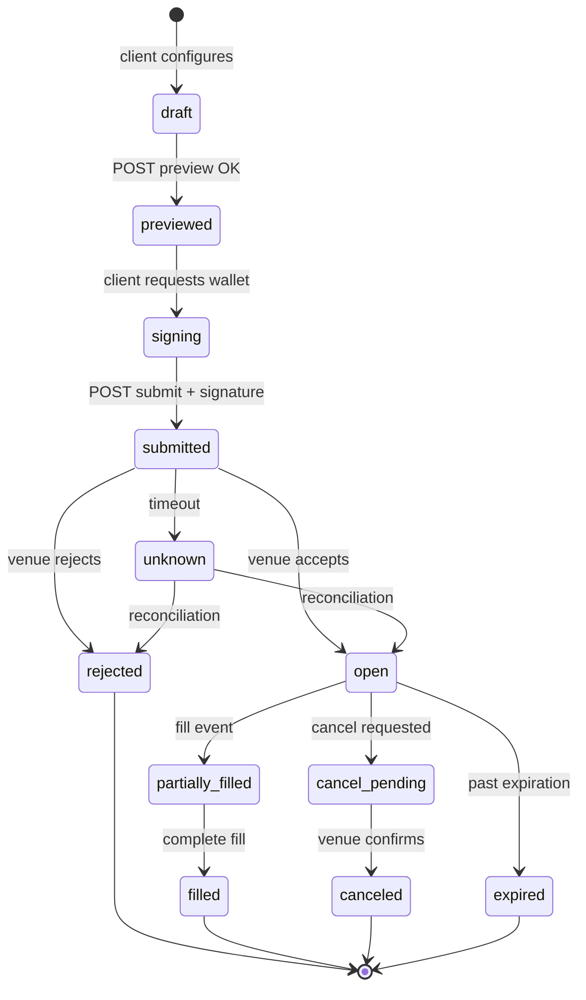
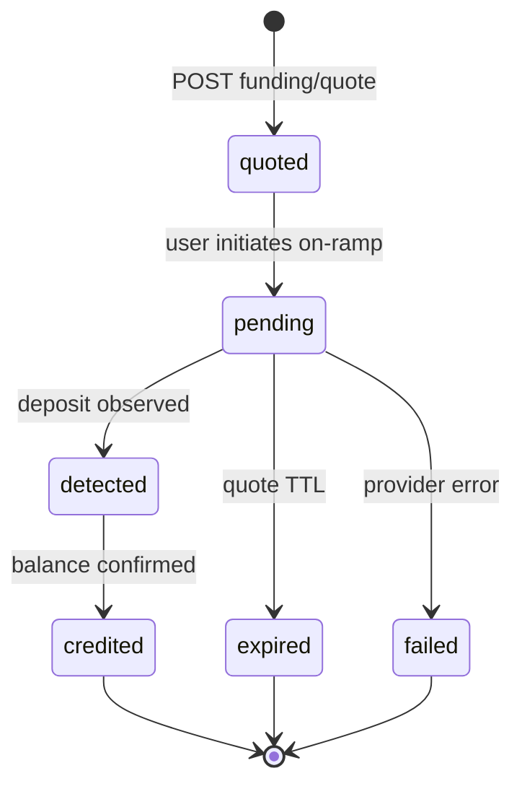
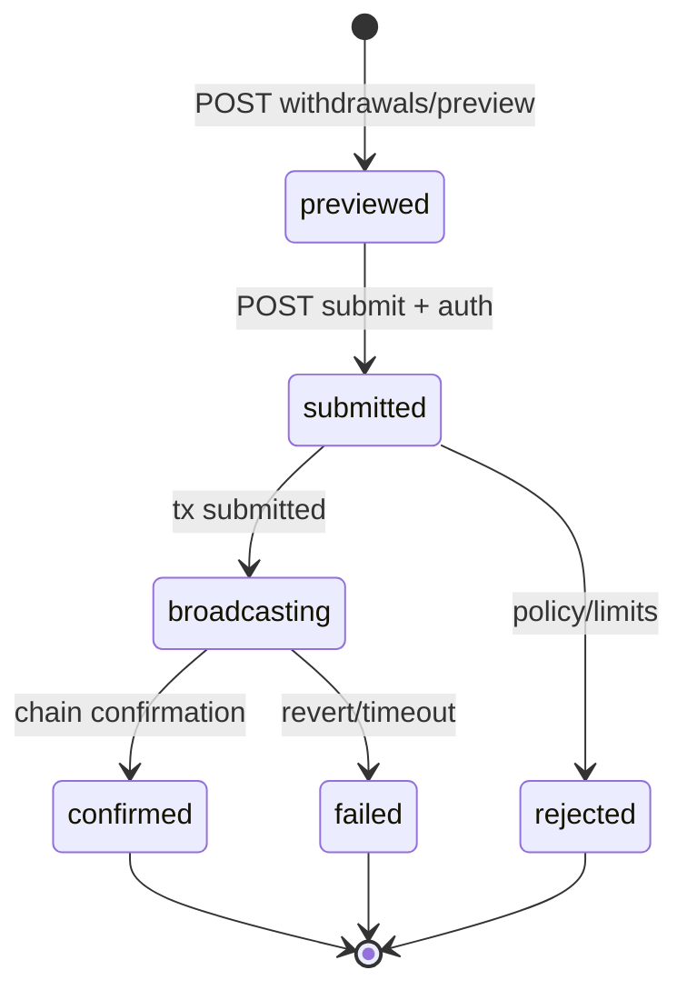
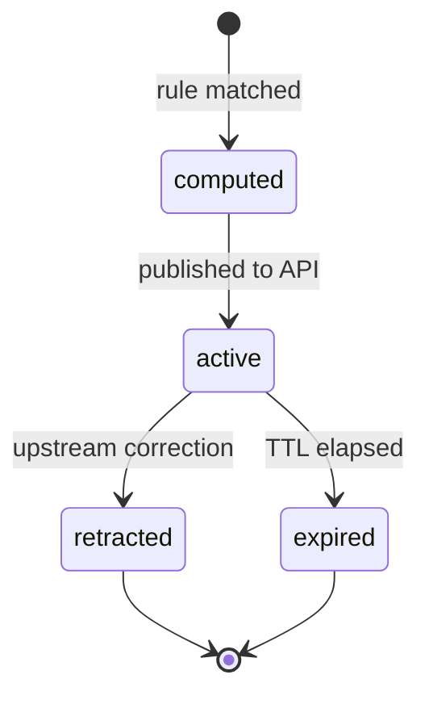
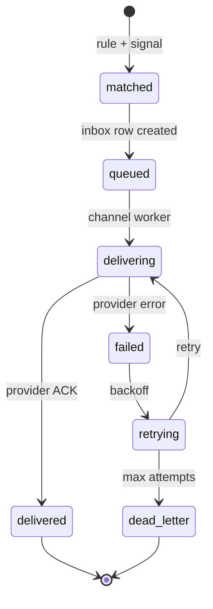

# DOMAIN MODEL AND STATE MACHINES

**Status:** reviewed
**Owner:** platform-orchestrator
**Last updated:** 2026-07-25
**Product:** RetroPick Markets V1
**Wave:** 3 — Backend architecture and API contracts

## 1. Purpose

Domain aggregates, invariants, and state machines for orders, funding, withdrawals,
signals, and alerts. Complements [DATABASE_AND_MIGRATIONS.md](./DATABASE_AND_MIGRATIONS.md).

## 2. Domain principles

- Venue and chain are authority for ownership; DB is projection.
- Money as fixed-point integers (`Money` schema); prices as `DecimalString`.
- Every transition emits audit event and metric.
- Idempotency keys on all mutating POST operations.

## 3. Core aggregates

| Aggregate | Root entity | Consistency boundary |
|-----------|-------------|---------------------|
| Order | `markets.orders` | order + attempts + fills |
| WalletAccount | `markets.wallet_accounts` | user + proxy addresses |
| FundingOperation | `markets.funding_operations` | quote + track status |
| WithdrawalOperation | `markets.withdrawal_operations` | preview + submit |
| PositionProjection | `markets.position_projections` | per market outcome |
| MarketSignal | `markets.market_signals` | signal + evidence |
| AlertRule | `markets.alert_rules` | rule + deliveries |
| Watchlist | `markets.watchlists` | list + items |

## State machine: orders

| State | Description | Persisted | User visible |
|-------|-------------|-----------|--------------|
| draft | Client-side only | No | Yes |
| previewed | Preview hash stored | Optional | Yes |
| signing | Awaiting wallet | No | Yes |
| submitted | Sent to venue | order_attempts | Yes |
| open | Resting on book | orders | Yes |
| partially_filled | Some size matched | orders + fills | Yes |
| filled | Complete | orders + fills | Yes |
| cancel_pending | Cancel in flight | orders | Yes |
| canceled | Removed from book | orders | Yes |
| rejected | Venue rejected | orders | Yes |
| expired | TTL elapsed | orders | Yes |
| unknown | Awaiting reconciliation | orders | Yes (warning) |

## State machine: funding

## State machine: withdrawals

## State machine: signals

## State machine: alerts

## Order transition table

| From | To | Trigger | Actor |
|------|-----|---------|-------|
| draft | previewed | POST /orders/preview | user |
| previewed | submitted | POST /orders/submit | user+wallet |
| submitted | open | venue ACK | CLOB |
| open | filled | fill events | CLOB+reconcile |
| open | cancel_pending | POST cancel | user |
| cancel_pending | canceled | venue ACK | CLOB |
| * | unknown | timeout | system |
| unknown | open | reconciliation match | reconcile worker |

## Entity notes: `markets.catalog_venues`

Immutable upstream identifiers stored separately from internal UUID.
Status enums enforced in application layer and CHECK constraints.
Provenance: `upstream_source`, `upstream_id`, `observed_at`.
PII classification: wallet addresses = sensitive; no private keys ever stored.

## Entity notes: `markets.catalog_events`

Immutable upstream identifiers stored separately from internal UUID.
Status enums enforced in application layer and CHECK constraints.
Provenance: `upstream_source`, `upstream_id`, `observed_at`.
PII classification: wallet addresses = sensitive; no private keys ever stored.

## Entity notes: `markets.catalog_markets`

Immutable upstream identifiers stored separately from internal UUID.
Status enums enforced in application layer and CHECK constraints.
Provenance: `upstream_source`, `upstream_id`, `observed_at`.
PII classification: wallet addresses = sensitive; no private keys ever stored.

## Entity notes: `markets.catalog_outcomes`

Immutable upstream identifiers stored separately from internal UUID.
Status enums enforced in application layer and CHECK constraints.
Provenance: `upstream_source`, `upstream_id`, `observed_at`.
PII classification: wallet addresses = sensitive; no private keys ever stored.

## Entity notes: `markets.catalog_market_rules`

Immutable upstream identifiers stored separately from internal UUID.
Status enums enforced in application layer and CHECK constraints.
Provenance: `upstream_source`, `upstream_id`, `observed_at`.
PII classification: wallet addresses = sensitive; no private keys ever stored.

## Entity notes: `markets.market_data_orderbook_snapshots`

Immutable upstream identifiers stored separately from internal UUID.
Status enums enforced in application layer and CHECK constraints.
Provenance: `upstream_source`, `upstream_id`, `observed_at`.
PII classification: wallet addresses = sensitive; no private keys ever stored.

## Entity notes: `markets.market_data_trades`

Immutable upstream identifiers stored separately from internal UUID.
Status enums enforced in application layer and CHECK constraints.
Provenance: `upstream_source`, `upstream_id`, `observed_at`.
PII classification: wallet addresses = sensitive; no private keys ever stored.

## Entity notes: `markets.market_data_price_candles`

Immutable upstream identifiers stored separately from internal UUID.
Status enums enforced in application layer and CHECK constraints.
Provenance: `upstream_source`, `upstream_id`, `observed_at`.
PII classification: wallet addresses = sensitive; no private keys ever stored.

## Entity notes: `markets.orders`

Immutable upstream identifiers stored separately from internal UUID.
Status enums enforced in application layer and CHECK constraints.
Provenance: `upstream_source`, `upstream_id`, `observed_at`.
PII classification: wallet addresses = sensitive; no private keys ever stored.

## Entity notes: `markets.order_attempts`

Immutable upstream identifiers stored separately from internal UUID.
Status enums enforced in application layer and CHECK constraints.
Provenance: `upstream_source`, `upstream_id`, `observed_at`.
PII classification: wallet addresses = sensitive; no private keys ever stored.

## Entity notes: `markets.fills`

Immutable upstream identifiers stored separately from internal UUID.
Status enums enforced in application layer and CHECK constraints.
Provenance: `upstream_source`, `upstream_id`, `observed_at`.
PII classification: wallet addresses = sensitive; no private keys ever stored.

## Entity notes: `markets.wallet_accounts`

Immutable upstream identifiers stored separately from internal UUID.
Status enums enforced in application layer and CHECK constraints.
Provenance: `upstream_source`, `upstream_id`, `observed_at`.
PII classification: wallet addresses = sensitive; no private keys ever stored.

## Entity notes: `markets.funding_operations`

Immutable upstream identifiers stored separately from internal UUID.
Status enums enforced in application layer and CHECK constraints.
Provenance: `upstream_source`, `upstream_id`, `observed_at`.
PII classification: wallet addresses = sensitive; no private keys ever stored.

## Entity notes: `markets.withdrawal_operations`

Immutable upstream identifiers stored separately from internal UUID.
Status enums enforced in application layer and CHECK constraints.
Provenance: `upstream_source`, `upstream_id`, `observed_at`.
PII classification: wallet addresses = sensitive; no private keys ever stored.

## Entity notes: `markets.position_projections`

Immutable upstream identifiers stored separately from internal UUID.
Status enums enforced in application layer and CHECK constraints.
Provenance: `upstream_source`, `upstream_id`, `observed_at`.
PII classification: wallet addresses = sensitive; no private keys ever stored.

## Entity notes: `markets.redemption_projections`

Immutable upstream identifiers stored separately from internal UUID.
Status enums enforced in application layer and CHECK constraints.
Provenance: `upstream_source`, `upstream_id`, `observed_at`.
PII classification: wallet addresses = sensitive; no private keys ever stored.

## Entity notes: `markets.chain_events`

Immutable upstream identifiers stored separately from internal UUID.
Status enums enforced in application layer and CHECK constraints.
Provenance: `upstream_source`, `upstream_id`, `observed_at`.
PII classification: wallet addresses = sensitive; no private keys ever stored.

## Entity notes: `markets.reconciliation_runs`

Immutable upstream identifiers stored separately from internal UUID.
Status enums enforced in application layer and CHECK constraints.
Provenance: `upstream_source`, `upstream_id`, `observed_at`.
PII classification: wallet addresses = sensitive; no private keys ever stored.

## Entity notes: `markets.builder_fee_versions`

Immutable upstream identifiers stored separately from internal UUID.
Status enums enforced in application layer and CHECK constraints.
Provenance: `upstream_source`, `upstream_id`, `observed_at`.
PII classification: wallet addresses = sensitive; no private keys ever stored.

## Entity notes: `markets.eligibility_decisions`

Immutable upstream identifiers stored separately from internal UUID.
Status enums enforced in application layer and CHECK constraints.
Provenance: `upstream_source`, `upstream_id`, `observed_at`.
PII classification: wallet addresses = sensitive; no private keys ever stored.

## Appendix 1

| Key | Specification |
|-----|---------------|
| Wave | 3 reviewed 2026-07-25 |
| Venue | Polymarket Gamma/CLOB/on-chain |
| BFF | apps/backend/internal/markets |
| Schema | markets.* PostgreSQL |
| Contract | schemas/openapi/markets-v1.yaml |
| Idempotency | Idempotency-Key header on POST |
| Money | Fixed-point Money schema |
| Phase gating | x-phase OpenAPI extension |
| Fail closed | eligible:false on unknown policy |
| Intelligence | Isolated from trading path ADR-008 |

## Appendix 2

| Key | Specification |
|-----|---------------|
| Wave | 3 reviewed 2026-07-25 |
| Venue | Polymarket Gamma/CLOB/on-chain |
| BFF | apps/backend/internal/markets |
| Schema | markets.* PostgreSQL |
| Contract | schemas/openapi/markets-v1.yaml |
| Idempotency | Idempotency-Key header on POST |
| Money | Fixed-point Money schema |
| Phase gating | x-phase OpenAPI extension |
| Fail closed | eligible:false on unknown policy |
| Intelligence | Isolated from trading path ADR-008 |

## Appendix 3

| Key | Specification |
|-----|---------------|
| Wave | 3 reviewed 2026-07-25 |
| Venue | Polymarket Gamma/CLOB/on-chain |
| BFF | apps/backend/internal/markets |
| Schema | markets.* PostgreSQL |
| Contract | schemas/openapi/markets-v1.yaml |
| Idempotency | Idempotency-Key header on POST |
| Money | Fixed-point Money schema |
| Phase gating | x-phase OpenAPI extension |
| Fail closed | eligible:false on unknown policy |
| Intelligence | Isolated from trading path ADR-008 |

## Appendix 4

| Key | Specification |
|-----|---------------|
| Wave | 3 reviewed 2026-07-25 |
| Venue | Polymarket Gamma/CLOB/on-chain |
| BFF | apps/backend/internal/markets |
| Schema | markets.* PostgreSQL |
| Contract | schemas/openapi/markets-v1.yaml |
| Idempotency | Idempotency-Key header on POST |
| Money | Fixed-point Money schema |
| Phase gating | x-phase OpenAPI extension |
| Fail closed | eligible:false on unknown policy |
| Intelligence | Isolated from trading path ADR-008 |

## Appendix 5

| Key | Specification |
|-----|---------------|
| Wave | 3 reviewed 2026-07-25 |
| Venue | Polymarket Gamma/CLOB/on-chain |
| BFF | apps/backend/internal/markets |
| Schema | markets.* PostgreSQL |
| Contract | schemas/openapi/markets-v1.yaml |
| Idempotency | Idempotency-Key header on POST |
| Money | Fixed-point Money schema |
| Phase gating | x-phase OpenAPI extension |
| Fail closed | eligible:false on unknown policy |
| Intelligence | Isolated from trading path ADR-008 |

## Appendix 6

| Key | Specification |
|-----|---------------|
| Wave | 3 reviewed 2026-07-25 |
| Venue | Polymarket Gamma/CLOB/on-chain |
| BFF | apps/backend/internal/markets |
| Schema | markets.* PostgreSQL |
| Contract | schemas/openapi/markets-v1.yaml |
| Idempotency | Idempotency-Key header on POST |
| Money | Fixed-point Money schema |
| Phase gating | x-phase OpenAPI extension |
| Fail closed | eligible:false on unknown policy |
| Intelligence | Isolated from trading path ADR-008 |

## Appendix 7

| Key | Specification |
|-----|---------------|
| Wave | 3 reviewed 2026-07-25 |
| Venue | Polymarket Gamma/CLOB/on-chain |
| BFF | apps/backend/internal/markets |
| Schema | markets.* PostgreSQL |
| Contract | schemas/openapi/markets-v1.yaml |
| Idempotency | Idempotency-Key header on POST |
| Money | Fixed-point Money schema |
| Phase gating | x-phase OpenAPI extension |
| Fail closed | eligible:false on unknown policy |
| Intelligence | Isolated from trading path ADR-008 |

## Appendix 8

| Key | Specification |
|-----|---------------|
| Wave | 3 reviewed 2026-07-25 |
| Venue | Polymarket Gamma/CLOB/on-chain |
| BFF | apps/backend/internal/markets |
| Schema | markets.* PostgreSQL |
| Contract | schemas/openapi/markets-v1.yaml |
| Idempotency | Idempotency-Key header on POST |
| Money | Fixed-point Money schema |
| Phase gating | x-phase OpenAPI extension |
| Fail closed | eligible:false on unknown policy |
| Intelligence | Isolated from trading path ADR-008 |

## Appendix 9

| Key | Specification |
|-----|---------------|
| Wave | 3 reviewed 2026-07-25 |
| Venue | Polymarket Gamma/CLOB/on-chain |
| BFF | apps/backend/internal/markets |
| Schema | markets.* PostgreSQL |
| Contract | schemas/openapi/markets-v1.yaml |
| Idempotency | Idempotency-Key header on POST |
| Money | Fixed-point Money schema |
| Phase gating | x-phase OpenAPI extension |
| Fail closed | eligible:false on unknown policy |
| Intelligence | Isolated from trading path ADR-008 |
