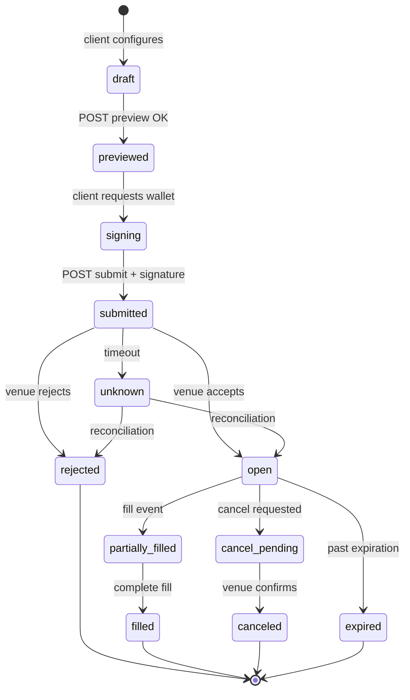
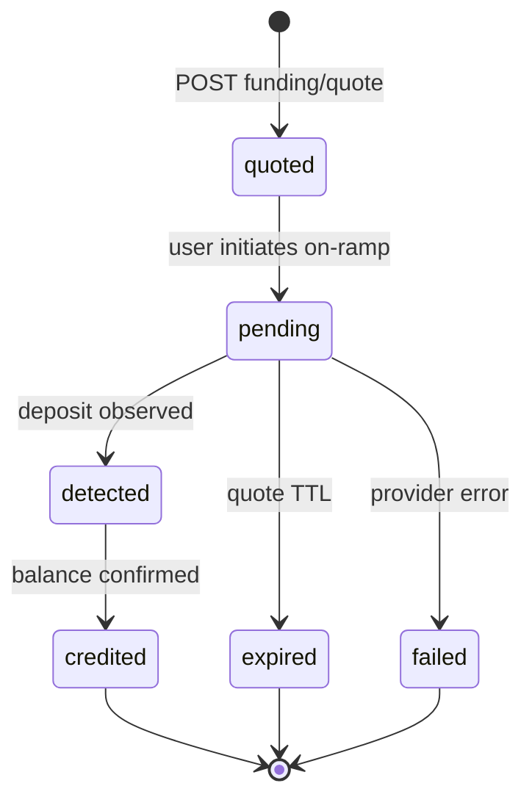
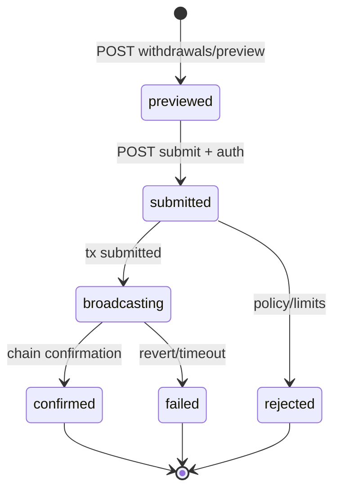
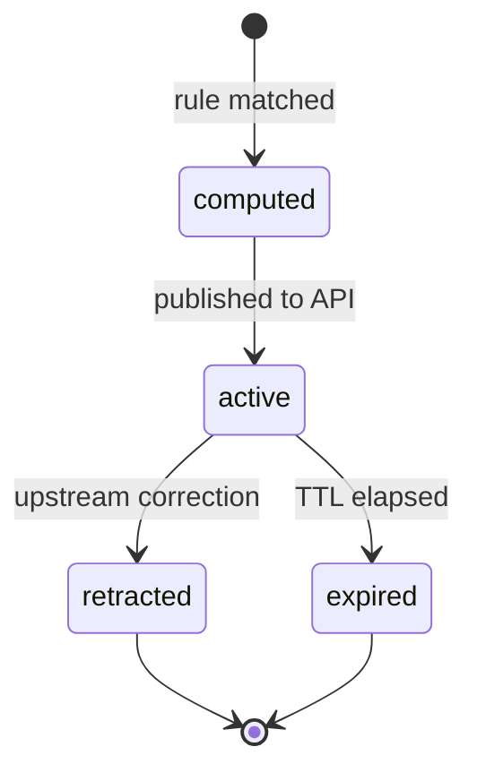
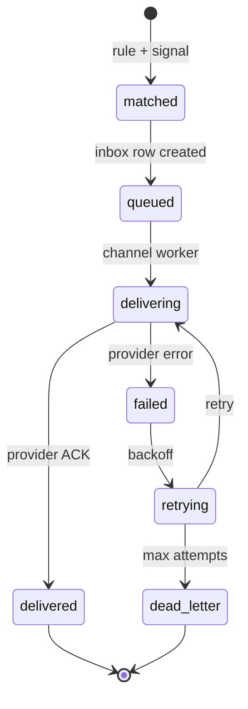

# DOMAIN MODEL AND STATE MACHINES

**Status:** reviewed
**Owner:** platform-orchestrator
**Last updated:** 2026-07-25
**Product:** RetroPick Markets V1
**Wave:** 3 — Backend architecture and API contracts

## Description

This document is the authority for Markets V1 **domain aggregates and state machines**. It defines consistency boundaries (`Order`, `WalletAccount`, `FundingOperation`, `WithdrawalOperation`, `PositionProjection`, `MarketSignal`, `AlertRule`, `Watchlist`) and From→To tables for orders, funding, withdrawals, signals, and alerts—so handlers and workers share one vocabulary for status and never invent states outside the machines.

It sits in Wave 3 beside database, API/realtime, and indexing/reorg specs. Venue/chain own ownership; DB is projection. Money is fixed-point `Money`; prices are `DecimalString`. Mutating POSTs require idempotency keys; every transition emits audit + metric. Submit timeout → `unknown` (never auto-resubmit); signal `active` → `retracted` on correction/reorg; alert channel failures end in `dead_letter` without rolling back inbox truth. Private keys are never stored.

Read this when changing `status` on orders, funding, withdrawals, signals, or alert deliveries, or when writing transition unit tests. Prefer sibling docs for DDL shapes and OpenAPI paths—not for allowed state edges.

## 0. Developer intent (5W+1H)

Short orientation for implementers and agents. Read this before the normative sections below.

| Lens | Answer |
|------|--------|
| **Who** | Domain/service authors in `internal/markets/domain` and `service`; handlers implementing OpenAPI POSTs (`orders/preview|submit|cancel`, `funding/quote|track`, `withdrawals/preview|submit`); reconciliation and alert-delivery workers advancing projection states; QA asserting transition tables. |
| **What** | Aggregate roots and consistency boundaries (`Order`, `WalletAccount`, `FundingOperation`, `WithdrawalOperation`, `PositionProjection`, `MarketSignal`, `AlertRule`, `Watchlist`) plus state machines for orders, funding, withdrawals, signals, and alerts. Principles: venue/chain own ownership; DB is projection; money is fixed-point `Money`; prices are `DecimalString`; every transition audits + metrics; mutating POSTs require idempotency keys. |
| **When** | Any time a handler or worker would change `status` on orders, funding, withdrawals, signals, or alert deliveries. Especially on submit timeout (`unknown`), cancel in flight, quote TTL, chain confirmation, and `signal.retracted`. Do not invent states outside the machines below. |
| **Where** | Spec: this file. Persistence shapes: [DATABASE_AND_MIGRATIONS.md](./DATABASE_AND_MIGRATIONS.md) (`markets.orders`, `order_attempts`, `fills`, `funding_operations`, `withdrawal_operations`, `position_projections`, `market_signals`, `alert_*`). HTTP triggers: paths in [API_AND_REALTIME_CONTRACTS.md](./API_AND_REALTIME_CONTRACTS.md) / OpenAPI. Repair of `unknown` / drift: [INDEXING_RECONCILIATION_AND_REORGS.md](./INDEXING_RECONCILIATION_AND_REORGS.md). |
| **Why** | Clients and ops need one vocabulary for “where is my order / funding / signal?” Projection states that diverge from venue truth must surface as `unknown` / `reconciling`, never as silent success. Fixed-point money and idempotent transitions prevent double-submit and float rounding bugs. Signal retraction protects users from stale intelligence after reorg/correction. |
| **How** | Encode transitions in domain methods with explicit From→To tables; persist only allowed edges; emit audit + metric per edge. Orders: draft → previewed → signing → submitted → open → (partially_)filled / cancel_pending / expired / rejected / unknown. Funding: quoted → pending → detected → credited (or expired/failed). Withdrawals: previewed → submitted → broadcasting → confirmed (or failed/rejected). Signals: computed → active → retracted|expired. Alerts: matched → queued → delivering → delivered|retrying → dead_letter. Entity notes: keep `upstream_source`/`upstream_id`/`observed_at`; never store private keys. |

### Worked example

**Happy path — order lifecycle.** Client configures size/price as fixed-point `Money` / `DecimalString`. `POST /markets/orders/preview` → `previewed` (optional preview hash stored). Wallet signs EIP-712 (signing is client-side; not a DB-required state). `POST /markets/orders/submit` with `Idempotency-Key` inserts `order_attempts`, ACL posts to CLOB → `submitted` then `open` on venue ACK. Fill events (ingest + reconcile) move to `partially_filled` / `filled`. Cancel: `cancel_pending` → `canceled` on venue ACK. User-visible states match the orders state table below.

**Happy path — funding then withdrawal.** `POST /markets/funding/quote` → `quoted` → user on-ramp → `pending` → deposit observed `detected` → `credited`. Later `POST /markets/withdrawals/preview` → `previewed` → submit → `broadcasting` → `confirmed` after chain confirmations. Amounts stay base-unit integers end-to-end.

**Failure / degraded.** Submit times out: persist `unknown`, show warning; reconciliation polls CLOB by `client_order_id` / payload hash → `open` or `rejected`—**never auto-resubmit**. Duplicate idempotency key returns the original response. Funding quote TTL → `expired`; provider error → `failed`. Upstream correction / reorg: signal `active` → `retracted`; alerts must not keep delivering as fresh. Positions are **projections**—on CLOB/chain disagreement, reconciliation rebuilds; UI shows reconciling until terminal. Alert channel failures retry then `dead_letter` without rolling back inbox truth.

### Aggregate → root table

| Aggregate | Root | Boundary |
|-----------|------|----------|
| Order | `markets.orders` | + attempts + fills |
| WalletAccount | `markets.wallet_accounts` | user + proxy addresses |
| FundingOperation | `markets.funding_operations` | quote + track |
| WithdrawalOperation | `markets.withdrawal_operations` | preview + submit |
| PositionProjection | `markets.position_projections` | per market outcome |
| MarketSignal | `markets.market_signals` | + evidence |
| AlertRule | `markets.alert_rules` | + deliveries |
| Watchlist | `markets.watchlists` | + items |

### Transition rules of thumb

- Every edge: audit event + metric.
- Mutating POST: `Idempotency-Key` required.
- Provenance on entities: `upstream_source`, `upstream_id`, `observed_at`.
- Wallet addresses = sensitive; private keys never stored.
- Status enums enforced in app layer + CHECK constraints where present.

### Implementer checklist

- Do not invent states outside the mermaid machines in this doc.
- `draft` / some `signing` UX may be client-only; persist from `previewed`/`submitted` onward as specified.
- Treat `unknown` and reconciling as first-class user-visible warnings, not bugs to hide.

## 1. Purpose

Domain aggregates, invariants, and state machines for orders, funding, withdrawals,
signals, and alerts. Complements [DATABASE_AND_MIGRATIONS.md](./DATABASE_AND_MIGRATIONS.md).

## 2. Domain principles

- Venue and chain are authority for ownership; DB is projection.
- Money as fixed-point integers (`Money` schema); prices as `DecimalString`.
- Every transition emits audit event and metric.
- Idempotency keys on all mutating POST operations.

## 3. Core aggregates

| Aggregate | Root entity | Consistency boundary |
|-----------|-------------|---------------------|
| Order | `markets.orders` | order + attempts + fills |
| WalletAccount | `markets.wallet_accounts` | user + proxy addresses |
| FundingOperation | `markets.funding_operations` | quote + track status |
| WithdrawalOperation | `markets.withdrawal_operations` | preview + submit |
| PositionProjection | `markets.position_projections` | per market outcome |
| MarketSignal | `markets.market_signals` | signal + evidence |
| AlertRule | `markets.alert_rules` | rule + deliveries |
| Watchlist | `markets.watchlists` | list + items |

## State machine: orders

| State | Description | Persisted | User visible |
|-------|-------------|-----------|--------------|
| draft | Client-side only | No | Yes |
| previewed | Preview hash stored | Optional | Yes |
| signing | Awaiting wallet | No | Yes |
| submitted | Sent to venue | order_attempts | Yes |
| open | Resting on book | orders | Yes |
| partially_filled | Some size matched | orders + fills | Yes |
| filled | Complete | orders + fills | Yes |
| cancel_pending | Cancel in flight | orders | Yes |
| canceled | Removed from book | orders | Yes |
| rejected | Venue rejected | orders | Yes |
| expired | TTL elapsed | orders | Yes |
| unknown | Awaiting reconciliation | orders | Yes (warning) |

## State machine: funding

## State machine: withdrawals

## State machine: signals

## State machine: alerts

## Order transition table

| From | To | Trigger | Actor |
|------|-----|---------|-------|
| draft | previewed | POST /orders/preview | user |
| previewed | submitted | POST /orders/submit | user+wallet |
| submitted | open | venue ACK | CLOB |
| open | filled | fill events | CLOB+reconcile |
| open | cancel_pending | POST cancel | user |
| cancel_pending | canceled | venue ACK | CLOB |
| * | unknown | timeout | system |
| unknown | open | reconciliation match | reconcile worker |

## Entity notes: `markets.catalog_venues`

Immutable upstream identifiers stored separately from internal UUID.
Status enums enforced in application layer and CHECK constraints.
Provenance: `upstream_source`, `upstream_id`, `observed_at`.
PII classification: wallet addresses = sensitive; no private keys ever stored.

## Entity notes: `markets.catalog_events`

Immutable upstream identifiers stored separately from internal UUID.
Status enums enforced in application layer and CHECK constraints.
Provenance: `upstream_source`, `upstream_id`, `observed_at`.
PII classification: wallet addresses = sensitive; no private keys ever stored.

## Entity notes: `markets.catalog_markets`

Immutable upstream identifiers stored separately from internal UUID.
Status enums enforced in application layer and CHECK constraints.
Provenance: `upstream_source`, `upstream_id`, `observed_at`.
PII classification: wallet addresses = sensitive; no private keys ever stored.

## Entity notes: `markets.catalog_outcomes`

Immutable upstream identifiers stored separately from internal UUID.
Status enums enforced in application layer and CHECK constraints.
Provenance: `upstream_source`, `upstream_id`, `observed_at`.
PII classification: wallet addresses = sensitive; no private keys ever stored.

## Entity notes: `markets.catalog_market_rules`

Immutable upstream identifiers stored separately from internal UUID.
Status enums enforced in application layer and CHECK constraints.
Provenance: `upstream_source`, `upstream_id`, `observed_at`.
PII classification: wallet addresses = sensitive; no private keys ever stored.

## Entity notes: `markets.market_data_orderbook_snapshots`

Immutable upstream identifiers stored separately from internal UUID.
Status enums enforced in application layer and CHECK constraints.
Provenance: `upstream_source`, `upstream_id`, `observed_at`.
PII classification: wallet addresses = sensitive; no private keys ever stored.

## Entity notes: `markets.market_data_trades`

Immutable upstream identifiers stored separately from internal UUID.
Status enums enforced in application layer and CHECK constraints.
Provenance: `upstream_source`, `upstream_id`, `observed_at`.
PII classification: wallet addresses = sensitive; no private keys ever stored.

## Entity notes: `markets.market_data_price_candles`

Immutable upstream identifiers stored separately from internal UUID.
Status enums enforced in application layer and CHECK constraints.
Provenance: `upstream_source`, `upstream_id`, `observed_at`.
PII classification: wallet addresses = sensitive; no private keys ever stored.

## Entity notes: `markets.orders`

Immutable upstream identifiers stored separately from internal UUID.
Status enums enforced in application layer and CHECK constraints.
Provenance: `upstream_source`, `upstream_id`, `observed_at`.
PII classification: wallet addresses = sensitive; no private keys ever stored.

## Entity notes: `markets.order_attempts`

Immutable upstream identifiers stored separately from internal UUID.
Status enums enforced in application layer and CHECK constraints.
Provenance: `upstream_source`, `upstream_id`, `observed_at`.
PII classification: wallet addresses = sensitive; no private keys ever stored.

## Entity notes: `markets.fills`

Immutable upstream identifiers stored separately from internal UUID.
Status enums enforced in application layer and CHECK constraints.
Provenance: `upstream_source`, `upstream_id`, `observed_at`.
PII classification: wallet addresses = sensitive; no private keys ever stored.

## Entity notes: `markets.wallet_accounts`

Immutable upstream identifiers stored separately from internal UUID.
Status enums enforced in application layer and CHECK constraints.
Provenance: `upstream_source`, `upstream_id`, `observed_at`.
PII classification: wallet addresses = sensitive; no private keys ever stored.

## Entity notes: `markets.funding_operations`

Immutable upstream identifiers stored separately from internal UUID.
Status enums enforced in application layer and CHECK constraints.
Provenance: `upstream_source`, `upstream_id`, `observed_at`.
PII classification: wallet addresses = sensitive; no private keys ever stored.

## Entity notes: `markets.withdrawal_operations`

Immutable upstream identifiers stored separately from internal UUID.
Status enums enforced in application layer and CHECK constraints.
Provenance: `upstream_source`, `upstream_id`, `observed_at`.
PII classification: wallet addresses = sensitive; no private keys ever stored.

## Entity notes: `markets.position_projections`

Immutable upstream identifiers stored separately from internal UUID.
Status enums enforced in application layer and CHECK constraints.
Provenance: `upstream_source`, `upstream_id`, `observed_at`.
PII classification: wallet addresses = sensitive; no private keys ever stored.

## Entity notes: `markets.redemption_projections`

Immutable upstream identifiers stored separately from internal UUID.
Status enums enforced in application layer and CHECK constraints.
Provenance: `upstream_source`, `upstream_id`, `observed_at`.
PII classification: wallet addresses = sensitive; no private keys ever stored.

## Entity notes: `markets.chain_events`

Immutable upstream identifiers stored separately from internal UUID.
Status enums enforced in application layer and CHECK constraints.
Provenance: `upstream_source`, `upstream_id`, `observed_at`.
PII classification: wallet addresses = sensitive; no private keys ever stored.

## Entity notes: `markets.reconciliation_runs`

Immutable upstream identifiers stored separately from internal UUID.
Status enums enforced in application layer and CHECK constraints.
Provenance: `upstream_source`, `upstream_id`, `observed_at`.
PII classification: wallet addresses = sensitive; no private keys ever stored.

## Entity notes: `markets.builder_fee_versions`

Immutable upstream identifiers stored separately from internal UUID.
Status enums enforced in application layer and CHECK constraints.
Provenance: `upstream_source`, `upstream_id`, `observed_at`.
PII classification: wallet addresses = sensitive; no private keys ever stored.

## Entity notes: `markets.eligibility_decisions`

Immutable upstream identifiers stored separately from internal UUID.
Status enums enforced in application layer and CHECK constraints.
Provenance: `upstream_source`, `upstream_id`, `observed_at`.
PII classification: wallet addresses = sensitive; no private keys ever stored.

## Appendix 1

| Key | Specification |
|-----|---------------|
| Wave | 3 reviewed 2026-07-25 |
| Venue | Polymarket Gamma/CLOB/on-chain |
| BFF | apps/backend/internal/markets |
| Schema | markets.* PostgreSQL |
| Contract | schemas/openapi/markets-v1.yaml |
| Idempotency | Idempotency-Key header on POST |
| Money | Fixed-point Money schema |
| Phase gating | x-phase OpenAPI extension |
| Fail closed | eligible:false on unknown policy |
| Intelligence | Isolated from trading path ADR-008 |

## Appendix 2

| Key | Specification |
|-----|---------------|
| Wave | 3 reviewed 2026-07-25 |
| Venue | Polymarket Gamma/CLOB/on-chain |
| BFF | apps/backend/internal/markets |
| Schema | markets.* PostgreSQL |
| Contract | schemas/openapi/markets-v1.yaml |
| Idempotency | Idempotency-Key header on POST |
| Money | Fixed-point Money schema |
| Phase gating | x-phase OpenAPI extension |
| Fail closed | eligible:false on unknown policy |
| Intelligence | Isolated from trading path ADR-008 |

## Appendix 3

| Key | Specification |
|-----|---------------|
| Wave | 3 reviewed 2026-07-25 |
| Venue | Polymarket Gamma/CLOB/on-chain |
| BFF | apps/backend/internal/markets |
| Schema | markets.* PostgreSQL |
| Contract | schemas/openapi/markets-v1.yaml |
| Idempotency | Idempotency-Key header on POST |
| Money | Fixed-point Money schema |
| Phase gating | x-phase OpenAPI extension |
| Fail closed | eligible:false on unknown policy |
| Intelligence | Isolated from trading path ADR-008 |

## Appendix 4

| Key | Specification |
|-----|---------------|
| Wave | 3 reviewed 2026-07-25 |
| Venue | Polymarket Gamma/CLOB/on-chain |
| BFF | apps/backend/internal/markets |
| Schema | markets.* PostgreSQL |
| Contract | schemas/openapi/markets-v1.yaml |
| Idempotency | Idempotency-Key header on POST |
| Money | Fixed-point Money schema |
| Phase gating | x-phase OpenAPI extension |
| Fail closed | eligible:false on unknown policy |
| Intelligence | Isolated from trading path ADR-008 |

## Appendix 5

| Key | Specification |
|-----|---------------|
| Wave | 3 reviewed 2026-07-25 |
| Venue | Polymarket Gamma/CLOB/on-chain |
| BFF | apps/backend/internal/markets |
| Schema | markets.* PostgreSQL |
| Contract | schemas/openapi/markets-v1.yaml |
| Idempotency | Idempotency-Key header on POST |
| Money | Fixed-point Money schema |
| Phase gating | x-phase OpenAPI extension |
| Fail closed | eligible:false on unknown policy |
| Intelligence | Isolated from trading path ADR-008 |

## Appendix 6

| Key | Specification |
|-----|---------------|
| Wave | 3 reviewed 2026-07-25 |
| Venue | Polymarket Gamma/CLOB/on-chain |
| BFF | apps/backend/internal/markets |
| Schema | markets.* PostgreSQL |
| Contract | schemas/openapi/markets-v1.yaml |
| Idempotency | Idempotency-Key header on POST |
| Money | Fixed-point Money schema |
| Phase gating | x-phase OpenAPI extension |
| Fail closed | eligible:false on unknown policy |
| Intelligence | Isolated from trading path ADR-008 |

## Appendix 7

| Key | Specification |
|-----|---------------|
| Wave | 3 reviewed 2026-07-25 |
| Venue | Polymarket Gamma/CLOB/on-chain |
| BFF | apps/backend/internal/markets |
| Schema | markets.* PostgreSQL |
| Contract | schemas/openapi/markets-v1.yaml |
| Idempotency | Idempotency-Key header on POST |
| Money | Fixed-point Money schema |
| Phase gating | x-phase OpenAPI extension |
| Fail closed | eligible:false on unknown policy |
| Intelligence | Isolated from trading path ADR-008 |

## Appendix 8

| Key | Specification |
|-----|---------------|
| Wave | 3 reviewed 2026-07-25 |
| Venue | Polymarket Gamma/CLOB/on-chain |
| BFF | apps/backend/internal/markets |
| Schema | markets.* PostgreSQL |
| Contract | schemas/openapi/markets-v1.yaml |
| Idempotency | Idempotency-Key header on POST |
| Money | Fixed-point Money schema |
| Phase gating | x-phase OpenAPI extension |
| Fail closed | eligible:false on unknown policy |
| Intelligence | Isolated from trading path ADR-008 |

## Appendix 9

| Key | Specification |
|-----|---------------|
| Wave | 3 reviewed 2026-07-25 |
| Venue | Polymarket Gamma/CLOB/on-chain |
| BFF | apps/backend/internal/markets |
| Schema | markets.* PostgreSQL |
| Contract | schemas/openapi/markets-v1.yaml |
| Idempotency | Idempotency-Key header on POST |
| Money | Fixed-point Money schema |
| Phase gating | x-phase OpenAPI extension |
| Fail closed | eligible:false on unknown policy |
| Intelligence | Isolated from trading path ADR-008 |
