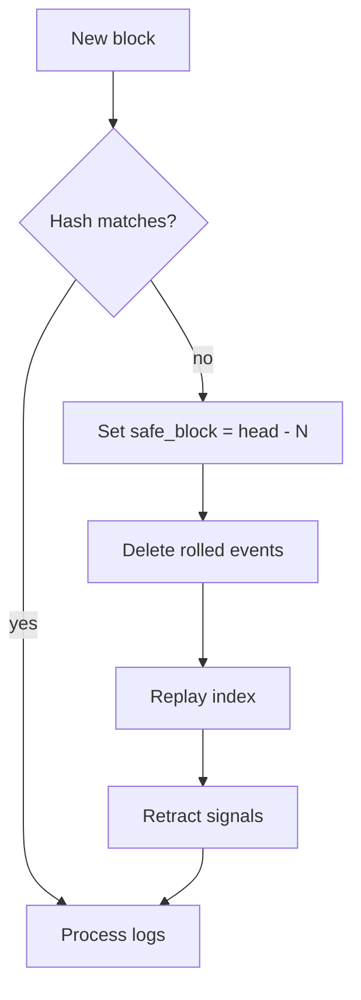

# INDEXING, RECONCILIATION, AND REORGS

**Status:** reviewed
**Owner:** platform-orchestrator
**Last updated:** 2026-07-25
**Product:** RetroPick Markets V1
**Wave:** 3 — Backend architecture and API contracts

## Description

This document is the authority for **chain indexing, CLOB reconciliation, and reorg handling** in Markets V1 (ADR-005). It defines Polygon log indexing into `markets.chain_events` with per-contract `sync_checkpoints`, reconcile loop cadence (orders/fills/positions/deep portfolio), reorg detect→pause→rollback→replay→retract→resume, and unknown-order handling without auto-resubmit—so projections stay honest when CLOB/chain diverge or blocks reorganize.

It sits in Wave 3 beside architecture, domain state machines, and signal provenance. RetroPick DB is not the ledger; repairs are idempotent upserts via natural keys. Submit timeouts persist `unknown` and poll by `client_order_id` / payload hash—never silent resubmit. Dependent intelligence emits `signal.retracted`. Metrics include reconciliation lag, reorg events, and drift repairs. User-visible `reconciling` / `unknown` beats fake certainty.

Read this when implementing indexer/reconcile workers, submit timeout paths, or portfolio/position correctness gates. Prefer sibling docs for domain transition tables and DDL—not for reorg/reconcile policy.

## 0. Developer intent (5W+1H)

Short orientation for implementers and agents. Read this before the normative sections below.

| Lens | Answer |
|------|--------|
| **Who** | Chain-indexer path inside `markets-ingest`, `cmd/reconciliation` / platform-sre, signal-engine consumers of reorg retractions, order-submit path authors who must leave timeouts in `unknown`, and ops reading `reconciliation_runs` (`drift_count`, `repair_actions`). |
| **What** | ADR-005 model: Polygon log indexing into `markets.chain_events` with per-contract `sync_checkpoints`; CLOB/chain vs projection reconciliation loops (light 30s orders, fill 60s, position 5m, deep 15m portfolio); reorg detect→pause→rollback→replay→retract→resume (default 12 confirmations); unknown-order handling without auto-resubmit; metrics `markets_reconciliation_lag_seconds`, `markets_reorg_events_total`, `markets_drift_repairs_total`. |
| **When** | Continuously in production for indexer + scheduled reconcile shards; on every submit timeout; whenever `block_hash` mismatches or `removed` logs appear. Deep loop and ops triggers when light loops cannot clear drift. Before claiming portfolio/position APIs are correct, confirm reconcile SLOs. |
| **Where** | Spec: this file + ADR-005. Tables: `chain_events`, `sync_checkpoints`, `reconciliation_runs`, and projection writes to `orders` / `fills` / `position_projections`. Process: [BACKEND_ARCHITECTURE.md](./BACKEND_ARCHITECTURE.md) §reconciliation / chain-indexer. Domain states: [DOMAIN_MODEL_AND_STATE_MACHINES.md](./DOMAIN_MODEL_AND_STATE_MACHINES.md) (`unknown`, `reconciling`). Intelligence side effect: `signal.retracted`. |
| **Why** | RetroPick DB is not the ledger—CLOB and chain are. Without reconcile/reorg policy, users see ghost fills, double positions, or stale signals after a reorg. Auto-resubmit on timeout risks duplicate venue orders. Explicit `reconciling` / `unknown` UX is safer than fake certainty. |
| **How** | Index: filter known CTF/exchange/adapter addresses → append `chain_events` (block_number, log_index, tx_hash) → advance checkpoint under lease. Reorg: set `safe_block = head - N`, delete events with `block_number > safe_block`, replay, emit `signal.retracted` for dependents, resume after confirmations. Reconcile: compare open orders/fills/positions to CLOB (+ chain for positions); insert missing fills; rebuild projections; alert on sustained drift. Submit timeout → `unknown` + poll by `client_order_id` / payload hash. All repairs idempotent via natural keys. |

### Worked example

**Happy path — light reconcile.** Every 30s a shard loads open local orders, queries CLOB user open orders, updates status/size for matches, records a `reconciliation_runs` row with zero drift. User `GET /markets/me/orders` shows venue-aligned projection. Fill loop (60s) inserts a missing fill keyed by venue trade id; position loop (5m) refreshes `position_projections` from CLOB+chain; deep loop (15m) scans full portfolio and alerts if repair jobs are needed.

**Happy path — index tick.** New Polygon block hashes match parent; logs for CTF/exchange/adapter addresses append to `chain_events` with `(block_number, log_index, tx_hash)`; per-contract checkpoint advances under lease. Signal-engine may consume `chain.log` asynchronously.

**Failure / reorg / unknown.** Parent hash mismatch or `removed` log: freeze checkpoint → `safe_block = head - N` → delete events with `block_number > safe_block` → replay → emit `signal.retracted` for dependents → resume after confirmations (default 12). Positions may show `reconciling`. Submit RPC timeout → `unknown`; reconcile by `client_order_id` / payload hash → `open` or `rejected`; **never auto-resubmit**. Duplicate fills / delayed confirms / partial cancels / neg-risk conversions: idempotent natural keys. Sustained drift → SRE alert via metrics and `reconciliation_runs.drift_count`.

### Loop schedule

| Loop | Frequency | Compares | On drift |
|------|-----------|----------|----------|
| Light | 30s | Open orders vs CLOB | Update status |
| Fill | 60s | Fills vs CLOB trades | Insert missing fills |
| Position | 5m | Positions vs CLOB+chain | Rebuild projection |
| Deep | 15m | Full user portfolio | Alert + repair job |

### Reorg steps (ordered)

1. Detect (`block_hash` mismatch or `removed`)
2. Pause checkpoint stream
3. Roll back events above `safe_block`
4. Replay index
5. Retract dependent intelligence (`signal.retracted`)
6. Resume after N confirmations

### Metrics to wire

- `markets_reconciliation_lag_seconds`
- `markets_reorg_events_total`
- `markets_drift_repairs_total`

### Implementer checklist

- Projection writes must be idempotent; repairs are upserts, not blind inserts.
- User badge `reconciling` until terminal—do not fake certainty.
- Ops: inspect `reconciliation_runs` for `drift_count` and `repair_actions`.
- Money fields in repaired rows remain fixed-point base units.

## 1. Purpose

Chain indexing, CLOB reconciliation, and reorg handling. ADR-005.

## 2. Indexing model

- Polygon logs filtered by known contract addresses (CTF, exchange, adapters).
- Each log → `markets.chain_events` with block_number, log_index, tx_hash.
- Checkpoint per contract in `sync_checkpoints`.

## 3. Reconciliation loops

| Loop | Frequency | Compares | Action on drift |
|------|-----------|----------|-----------------|
| Light | 30s | Open orders vs CLOB | Update status |
| Fill | 60s | Fills vs CLOB trades | Insert missing fills |
| Position | 5m | Positions vs CLOB+chain | Rebuild projection |
| Deep | 15m | Full user portfolio | Alert + repair job |

## 4. Reorg policy

1. Detect: `block_hash` mismatch on parent fetch or `removed` log flag.
2. Pause: freeze affected checkpoint stream.
3. Roll back: delete events with `block_number > safe_block`.
4. Replay: re-index from safe_block.
5. Retract: emit `signal.retracted` for dependent intelligence.
6. Resume: advance checkpoint after N confirmations (default 12).

## 5. Unknown order handling

On submit timeout: persist `unknown` status; reconciliation polls CLOB by
client_order_id / payload hash. Never auto-resubmit.

### 5.1 Unknown-order worker (MKT-P3-005)

**Implementation:** [`apps/backend/internal/markets/reconcile/`](../../../../apps/backend/internal/markets/reconcile/)

| Setting | Default | Notes |
|---------|---------|-------|
| Poll interval | 10s | Env `MARKETS_RECONCILE_ENABLED` (default on) gates worker in `markets-api` |
| Unknown grace | 90s | Before grace, stay `unknown`; after grace with no venue match → `rejected` (`reconcile_not_found`) |
| Venue lookup | `GET /data/orders` (L2) | Also ingests fills via `GET /data/trades` |
| Fill ingest | idempotent by `venue_trade_id` | Natural key dedup in projection store |

**Match order (fail closed on ambiguity):**

1. `client_order_id` — stored salt/COID ↔ CLOB `client_order_id` or `salt`
2. Fingerprint — `maker|tokenId|salt|makerAmount|takerAmount` (lowercase)
3. Legacy fallback — token + side + price + size (when amount fields absent)

**State transitions:**

| From | To | Condition |
|------|-----|-----------|
| `unknown` | `open` | Venue match on CLOB open orders |
| `unknown` | `rejected` | No match after grace window |
| `unknown` | `unknown` | Upstream error or ambiguous match (retry next tick) |
| `cancel_pending` | `canceled` | Venue order no longer in open set |

**Safety:** Worker holds read-only CLOB clients. **Never** calls `POST /order` or auto-resubmits.

**Metrics (Prometheus):**

- `retropick_markets_order_reconcile_lag_seconds_{sum,count}`
- `retropick_markets_order_reconcile_repairs_total{outcome="open|rejected|canceled|fill"}`
- `retropick_markets_order_reconcile_scanned_total`
- `retropick_markets_order_reconcile_errors_total{kind="upstream|credentials_unwired"}`
- Alias: `retropick_markets_reconciliation_lag_seconds_*` (same lag histogram)

**Ops audit:** `reconciliation_runs` Postgres table is **future**; v1 records metrics only.

## 6. Metrics

- `markets_order_reconcile_lag_seconds` (implemented as `retropick_markets_order_reconcile_lag_seconds`)
- `markets_reconciliation_lag_seconds` (alias in metrics export)
- `markets_reorg_events_total` (chain indexer — future)
- `markets_drift_repairs_total` (fill/position/deep loops — future)

## Scenario reference: reconciliation edge cases

Documented behavior for duplicate fill events, partial cancels, neg-risk conversions,
and delayed chain confirmations. All paths idempotent via natural keys. User sees
`reconciling` badge until terminal state. Ops runbook: check metrics and (future)
`reconciliation_runs` for `drift_count` and `repair_actions`.

## Appendix 1

| Key | Specification |
|-----|---------------|
| Wave | 3 reviewed 2026-07-25 |
| Venue | Polymarket Gamma/CLOB/on-chain |
| BFF | apps/backend/internal/markets |
| Schema | markets.* PostgreSQL |
| Contract | schemas/openapi/markets-v1.yaml |
| Idempotency | Idempotency-Key header on POST |
| Money | Fixed-point Money schema |
| Phase gating | x-phase OpenAPI extension |
| Fail closed | eligible:false on unknown policy |
| Intelligence | Isolated from trading path ADR-008 |

## Appendix 2

| Key | Specification |
|-----|---------------|
| Wave | 3 reviewed 2026-07-25 |
| Venue | Polymarket Gamma/CLOB/on-chain |
| BFF | apps/backend/internal/markets |
| Schema | markets.* PostgreSQL |
| Contract | schemas/openapi/markets-v1.yaml |
| Idempotency | Idempotency-Key header on POST |
| Money | Fixed-point Money schema |
| Phase gating | x-phase OpenAPI extension |
| Fail closed | eligible:false on unknown policy |
| Intelligence | Isolated from trading path ADR-008 |

## Appendix 3

| Key | Specification |
|-----|---------------|
| Wave | 3 reviewed 2026-07-25 |
| Venue | Polymarket Gamma/CLOB/on-chain |
| BFF | apps/backend/internal/markets |
| Schema | markets.* PostgreSQL |
| Contract | schemas/openapi/markets-v1.yaml |
| Idempotency | Idempotency-Key header on POST |
| Money | Fixed-point Money schema |
| Phase gating | x-phase OpenAPI extension |
| Fail closed | eligible:false on unknown policy |
| Intelligence | Isolated from trading path ADR-008 |

## Appendix 4

| Key | Specification |
|-----|---------------|
| Wave | 3 reviewed 2026-07-25 |
| Venue | Polymarket Gamma/CLOB/on-chain |
| BFF | apps/backend/internal/markets |
| Schema | markets.* PostgreSQL |
| Contract | schemas/openapi/markets-v1.yaml |
| Idempotency | Idempotency-Key header on POST |
| Money | Fixed-point Money schema |
| Phase gating | x-phase OpenAPI extension |
| Fail closed | eligible:false on unknown policy |
| Intelligence | Isolated from trading path ADR-008 |

## Appendix 5

| Key | Specification |
|-----|---------------|
| Wave | 3 reviewed 2026-07-25 |
| Venue | Polymarket Gamma/CLOB/on-chain |
| BFF | apps/backend/internal/markets |
| Schema | markets.* PostgreSQL |
| Contract | schemas/openapi/markets-v1.yaml |
| Idempotency | Idempotency-Key header on POST |
| Money | Fixed-point Money schema |
| Phase gating | x-phase OpenAPI extension |
| Fail closed | eligible:false on unknown policy |
| Intelligence | Isolated from trading path ADR-008 |

## Appendix 6

| Key | Specification |
|-----|---------------|
| Wave | 3 reviewed 2026-07-25 |
| Venue | Polymarket Gamma/CLOB/on-chain |
| BFF | apps/backend/internal/markets |
| Schema | markets.* PostgreSQL |
| Contract | schemas/openapi/markets-v1.yaml |
| Idempotency | Idempotency-Key header on POST |
| Money | Fixed-point Money schema |
| Phase gating | x-phase OpenAPI extension |
| Fail closed | eligible:false on unknown policy |
| Intelligence | Isolated from trading path ADR-008 |

## Appendix 7

| Key | Specification |
|-----|---------------|
| Wave | 3 reviewed 2026-07-25 |
| Venue | Polymarket Gamma/CLOB/on-chain |
| BFF | apps/backend/internal/markets |
| Schema | markets.* PostgreSQL |
| Contract | schemas/openapi/markets-v1.yaml |
| Idempotency | Idempotency-Key header on POST |
| Money | Fixed-point Money schema |
| Phase gating | x-phase OpenAPI extension |
| Fail closed | eligible:false on unknown policy |
| Intelligence | Isolated from trading path ADR-008 |

## Appendix 8

| Key | Specification |
|-----|---------------|
| Wave | 3 reviewed 2026-07-25 |
| Venue | Polymarket Gamma/CLOB/on-chain |
| BFF | apps/backend/internal/markets |
| Schema | markets.* PostgreSQL |
| Contract | schemas/openapi/markets-v1.yaml |
| Idempotency | Idempotency-Key header on POST |
| Money | Fixed-point Money schema |
| Phase gating | x-phase OpenAPI extension |
| Fail closed | eligible:false on unknown policy |
| Intelligence | Isolated from trading path ADR-008 |

## Appendix 9

| Key | Specification |
|-----|---------------|
| Wave | 3 reviewed 2026-07-25 |
| Venue | Polymarket Gamma/CLOB/on-chain |
| BFF | apps/backend/internal/markets |
| Schema | markets.* PostgreSQL |
| Contract | schemas/openapi/markets-v1.yaml |
| Idempotency | Idempotency-Key header on POST |
| Money | Fixed-point Money schema |
| Phase gating | x-phase OpenAPI extension |
| Fail closed | eligible:false on unknown policy |
| Intelligence | Isolated from trading path ADR-008 |

## Appendix 10

| Key | Specification |
|-----|---------------|
| Wave | 3 reviewed 2026-07-25 |
| Venue | Polymarket Gamma/CLOB/on-chain |
| BFF | apps/backend/internal/markets |
| Schema | markets.* PostgreSQL |
| Contract | schemas/openapi/markets-v1.yaml |
| Idempotency | Idempotency-Key header on POST |
| Money | Fixed-point Money schema |
| Phase gating | x-phase OpenAPI extension |
| Fail closed | eligible:false on unknown policy |
| Intelligence | Isolated from trading path ADR-008 |

## Appendix 11

| Key | Specification |
|-----|---------------|
| Wave | 3 reviewed 2026-07-25 |
| Venue | Polymarket Gamma/CLOB/on-chain |
| BFF | apps/backend/internal/markets |
| Schema | markets.* PostgreSQL |
| Contract | schemas/openapi/markets-v1.yaml |
| Idempotency | Idempotency-Key header on POST |
| Money | Fixed-point Money schema |
| Phase gating | x-phase OpenAPI extension |
| Fail closed | eligible:false on unknown policy |
| Intelligence | Isolated from trading path ADR-008 |

## Appendix 12

| Key | Specification |
|-----|---------------|
| Wave | 3 reviewed 2026-07-25 |
| Venue | Polymarket Gamma/CLOB/on-chain |
| BFF | apps/backend/internal/markets |
| Schema | markets.* PostgreSQL |
| Contract | schemas/openapi/markets-v1.yaml |
| Idempotency | Idempotency-Key header on POST |
| Money | Fixed-point Money schema |
| Phase gating | x-phase OpenAPI extension |
| Fail closed | eligible:false on unknown policy |
| Intelligence | Isolated from trading path ADR-008 |

## Appendix 13

| Key | Specification |
|-----|---------------|
| Wave | 3 reviewed 2026-07-25 |
| Venue | Polymarket Gamma/CLOB/on-chain |
| BFF | apps/backend/internal/markets |
| Schema | markets.* PostgreSQL |
| Contract | schemas/openapi/markets-v1.yaml |
| Idempotency | Idempotency-Key header on POST |
| Money | Fixed-point Money schema |
| Phase gating | x-phase OpenAPI extension |
| Fail closed | eligible:false on unknown policy |
| Intelligence | Isolated from trading path ADR-008 |
