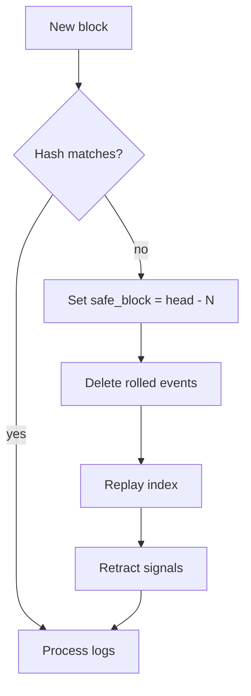

# INDEXING, RECONCILIATION, AND REORGS

**Status:** reviewed
**Owner:** platform-orchestrator
**Last updated:** 2026-07-25
**Product:** RetroPick Markets V1
**Wave:** 3 — Backend architecture and API contracts

## 1. Purpose

Chain indexing, CLOB reconciliation, and reorg handling. ADR-005.

## 2. Indexing model

- Polygon logs filtered by known contract addresses (CTF, exchange, adapters).
- Each log → `markets.chain_events` with block_number, log_index, tx_hash.
- Checkpoint per contract in `sync_checkpoints`.

## 3. Reconciliation loops

| Loop | Frequency | Compares | Action on drift |
|------|-----------|----------|-----------------|
| Light | 30s | Open orders vs CLOB | Update status |
| Fill | 60s | Fills vs CLOB trades | Insert missing fills |
| Position | 5m | Positions vs CLOB+chain | Rebuild projection |
| Deep | 15m | Full user portfolio | Alert + repair job |

## 4. Reorg policy

1. Detect: `block_hash` mismatch on parent fetch or `removed` log flag.
2. Pause: freeze affected checkpoint stream.
3. Roll back: delete events with `block_number > safe_block`.
4. Replay: re-index from safe_block.
5. Retract: emit `signal.retracted` for dependent intelligence.
6. Resume: advance checkpoint after N confirmations (default 12).

## 5. Unknown order handling

On submit timeout: persist `unknown` status; reconciliation polls CLOB by
client_order_id / payload hash. Never auto-resubmit.

## 6. Metrics

- `markets_reconciliation_lag_seconds`
- `markets_reorg_events_total`
- `markets_drift_repairs_total`

## Scenario 1: reconciliation edge case

Documented behavior for duplicate fill events, partial cancels, neg-risk conversions,
and delayed chain confirmations. All paths idempotent via natural keys. User sees
`reconciling` badge until terminal state. Ops runbook: check `reconciliation_runs`
table for `drift_count` and `repair_actions`.

## Scenario 2: reconciliation edge case

Documented behavior for duplicate fill events, partial cancels, neg-risk conversions,
and delayed chain confirmations. All paths idempotent via natural keys. User sees
`reconciling` badge until terminal state. Ops runbook: check `reconciliation_runs`
table for `drift_count` and `repair_actions`.

## Scenario 3: reconciliation edge case

Documented behavior for duplicate fill events, partial cancels, neg-risk conversions,
and delayed chain confirmations. All paths idempotent via natural keys. User sees
`reconciling` badge until terminal state. Ops runbook: check `reconciliation_runs`
table for `drift_count` and `repair_actions`.

## Scenario 4: reconciliation edge case

Documented behavior for duplicate fill events, partial cancels, neg-risk conversions,
and delayed chain confirmations. All paths idempotent via natural keys. User sees
`reconciling` badge until terminal state. Ops runbook: check `reconciliation_runs`
table for `drift_count` and `repair_actions`.

## Scenario 5: reconciliation edge case

Documented behavior for duplicate fill events, partial cancels, neg-risk conversions,
and delayed chain confirmations. All paths idempotent via natural keys. User sees
`reconciling` badge until terminal state. Ops runbook: check `reconciliation_runs`
table for `drift_count` and `repair_actions`.

## Scenario 6: reconciliation edge case

Documented behavior for duplicate fill events, partial cancels, neg-risk conversions,
and delayed chain confirmations. All paths idempotent via natural keys. User sees
`reconciling` badge until terminal state. Ops runbook: check `reconciliation_runs`
table for `drift_count` and `repair_actions`.

## Scenario 7: reconciliation edge case

Documented behavior for duplicate fill events, partial cancels, neg-risk conversions,
and delayed chain confirmations. All paths idempotent via natural keys. User sees
`reconciling` badge until terminal state. Ops runbook: check `reconciliation_runs`
table for `drift_count` and `repair_actions`.

## Scenario 8: reconciliation edge case

Documented behavior for duplicate fill events, partial cancels, neg-risk conversions,
and delayed chain confirmations. All paths idempotent via natural keys. User sees
`reconciling` badge until terminal state. Ops runbook: check `reconciliation_runs`
table for `drift_count` and `repair_actions`.

## Scenario 9: reconciliation edge case

Documented behavior for duplicate fill events, partial cancels, neg-risk conversions,
and delayed chain confirmations. All paths idempotent via natural keys. User sees
`reconciling` badge until terminal state. Ops runbook: check `reconciliation_runs`
table for `drift_count` and `repair_actions`.

## Scenario 10: reconciliation edge case

Documented behavior for duplicate fill events, partial cancels, neg-risk conversions,
and delayed chain confirmations. All paths idempotent via natural keys. User sees
`reconciling` badge until terminal state. Ops runbook: check `reconciliation_runs`
table for `drift_count` and `repair_actions`.

## Scenario 11: reconciliation edge case

Documented behavior for duplicate fill events, partial cancels, neg-risk conversions,
and delayed chain confirmations. All paths idempotent via natural keys. User sees
`reconciling` badge until terminal state. Ops runbook: check `reconciliation_runs`
table for `drift_count` and `repair_actions`.

## Scenario 12: reconciliation edge case

Documented behavior for duplicate fill events, partial cancels, neg-risk conversions,
and delayed chain confirmations. All paths idempotent via natural keys. User sees
`reconciling` badge until terminal state. Ops runbook: check `reconciliation_runs`
table for `drift_count` and `repair_actions`.

## Scenario 13: reconciliation edge case

Documented behavior for duplicate fill events, partial cancels, neg-risk conversions,
and delayed chain confirmations. All paths idempotent via natural keys. User sees
`reconciling` badge until terminal state. Ops runbook: check `reconciliation_runs`
table for `drift_count` and `repair_actions`.

## Scenario 14: reconciliation edge case

Documented behavior for duplicate fill events, partial cancels, neg-risk conversions,
and delayed chain confirmations. All paths idempotent via natural keys. User sees
`reconciling` badge until terminal state. Ops runbook: check `reconciliation_runs`
table for `drift_count` and `repair_actions`.

## Scenario 15: reconciliation edge case

Documented behavior for duplicate fill events, partial cancels, neg-risk conversions,
and delayed chain confirmations. All paths idempotent via natural keys. User sees
`reconciling` badge until terminal state. Ops runbook: check `reconciliation_runs`
table for `drift_count` and `repair_actions`.

## Scenario 16: reconciliation edge case

Documented behavior for duplicate fill events, partial cancels, neg-risk conversions,
and delayed chain confirmations. All paths idempotent via natural keys. User sees
`reconciling` badge until terminal state. Ops runbook: check `reconciliation_runs`
table for `drift_count` and `repair_actions`.

## Scenario 17: reconciliation edge case

Documented behavior for duplicate fill events, partial cancels, neg-risk conversions,
and delayed chain confirmations. All paths idempotent via natural keys. User sees
`reconciling` badge until terminal state. Ops runbook: check `reconciliation_runs`
table for `drift_count` and `repair_actions`.

## Scenario 18: reconciliation edge case

Documented behavior for duplicate fill events, partial cancels, neg-risk conversions,
and delayed chain confirmations. All paths idempotent via natural keys. User sees
`reconciling` badge until terminal state. Ops runbook: check `reconciliation_runs`
table for `drift_count` and `repair_actions`.

## Scenario 19: reconciliation edge case

Documented behavior for duplicate fill events, partial cancels, neg-risk conversions,
and delayed chain confirmations. All paths idempotent via natural keys. User sees
`reconciling` badge until terminal state. Ops runbook: check `reconciliation_runs`
table for `drift_count` and `repair_actions`.

## Scenario 20: reconciliation edge case

Documented behavior for duplicate fill events, partial cancels, neg-risk conversions,
and delayed chain confirmations. All paths idempotent via natural keys. User sees
`reconciling` badge until terminal state. Ops runbook: check `reconciliation_runs`
table for `drift_count` and `repair_actions`.

## Scenario 21: reconciliation edge case

Documented behavior for duplicate fill events, partial cancels, neg-risk conversions,
and delayed chain confirmations. All paths idempotent via natural keys. User sees
`reconciling` badge until terminal state. Ops runbook: check `reconciliation_runs`
table for `drift_count` and `repair_actions`.

## Scenario 22: reconciliation edge case

Documented behavior for duplicate fill events, partial cancels, neg-risk conversions,
and delayed chain confirmations. All paths idempotent via natural keys. User sees
`reconciling` badge until terminal state. Ops runbook: check `reconciliation_runs`
table for `drift_count` and `repair_actions`.

## Scenario 23: reconciliation edge case

Documented behavior for duplicate fill events, partial cancels, neg-risk conversions,
and delayed chain confirmations. All paths idempotent via natural keys. User sees
`reconciling` badge until terminal state. Ops runbook: check `reconciliation_runs`
table for `drift_count` and `repair_actions`.

## Scenario 24: reconciliation edge case

Documented behavior for duplicate fill events, partial cancels, neg-risk conversions,
and delayed chain confirmations. All paths idempotent via natural keys. User sees
`reconciling` badge until terminal state. Ops runbook: check `reconciliation_runs`
table for `drift_count` and `repair_actions`.

## Appendix 1

| Key | Specification |
|-----|---------------|
| Wave | 3 reviewed 2026-07-25 |
| Venue | Polymarket Gamma/CLOB/on-chain |
| BFF | apps/backend/internal/markets |
| Schema | markets.* PostgreSQL |
| Contract | schemas/openapi/markets-v1.yaml |
| Idempotency | Idempotency-Key header on POST |
| Money | Fixed-point Money schema |
| Phase gating | x-phase OpenAPI extension |
| Fail closed | eligible:false on unknown policy |
| Intelligence | Isolated from trading path ADR-008 |

## Appendix 2

| Key | Specification |
|-----|---------------|
| Wave | 3 reviewed 2026-07-25 |
| Venue | Polymarket Gamma/CLOB/on-chain |
| BFF | apps/backend/internal/markets |
| Schema | markets.* PostgreSQL |
| Contract | schemas/openapi/markets-v1.yaml |
| Idempotency | Idempotency-Key header on POST |
| Money | Fixed-point Money schema |
| Phase gating | x-phase OpenAPI extension |
| Fail closed | eligible:false on unknown policy |
| Intelligence | Isolated from trading path ADR-008 |

## Appendix 3

| Key | Specification |
|-----|---------------|
| Wave | 3 reviewed 2026-07-25 |
| Venue | Polymarket Gamma/CLOB/on-chain |
| BFF | apps/backend/internal/markets |
| Schema | markets.* PostgreSQL |
| Contract | schemas/openapi/markets-v1.yaml |
| Idempotency | Idempotency-Key header on POST |
| Money | Fixed-point Money schema |
| Phase gating | x-phase OpenAPI extension |
| Fail closed | eligible:false on unknown policy |
| Intelligence | Isolated from trading path ADR-008 |

## Appendix 4

| Key | Specification |
|-----|---------------|
| Wave | 3 reviewed 2026-07-25 |
| Venue | Polymarket Gamma/CLOB/on-chain |
| BFF | apps/backend/internal/markets |
| Schema | markets.* PostgreSQL |
| Contract | schemas/openapi/markets-v1.yaml |
| Idempotency | Idempotency-Key header on POST |
| Money | Fixed-point Money schema |
| Phase gating | x-phase OpenAPI extension |
| Fail closed | eligible:false on unknown policy |
| Intelligence | Isolated from trading path ADR-008 |

## Appendix 5

| Key | Specification |
|-----|---------------|
| Wave | 3 reviewed 2026-07-25 |
| Venue | Polymarket Gamma/CLOB/on-chain |
| BFF | apps/backend/internal/markets |
| Schema | markets.* PostgreSQL |
| Contract | schemas/openapi/markets-v1.yaml |
| Idempotency | Idempotency-Key header on POST |
| Money | Fixed-point Money schema |
| Phase gating | x-phase OpenAPI extension |
| Fail closed | eligible:false on unknown policy |
| Intelligence | Isolated from trading path ADR-008 |

## Appendix 6

| Key | Specification |
|-----|---------------|
| Wave | 3 reviewed 2026-07-25 |
| Venue | Polymarket Gamma/CLOB/on-chain |
| BFF | apps/backend/internal/markets |
| Schema | markets.* PostgreSQL |
| Contract | schemas/openapi/markets-v1.yaml |
| Idempotency | Idempotency-Key header on POST |
| Money | Fixed-point Money schema |
| Phase gating | x-phase OpenAPI extension |
| Fail closed | eligible:false on unknown policy |
| Intelligence | Isolated from trading path ADR-008 |

## Appendix 7

| Key | Specification |
|-----|---------------|
| Wave | 3 reviewed 2026-07-25 |
| Venue | Polymarket Gamma/CLOB/on-chain |
| BFF | apps/backend/internal/markets |
| Schema | markets.* PostgreSQL |
| Contract | schemas/openapi/markets-v1.yaml |
| Idempotency | Idempotency-Key header on POST |
| Money | Fixed-point Money schema |
| Phase gating | x-phase OpenAPI extension |
| Fail closed | eligible:false on unknown policy |
| Intelligence | Isolated from trading path ADR-008 |

## Appendix 8

| Key | Specification |
|-----|---------------|
| Wave | 3 reviewed 2026-07-25 |
| Venue | Polymarket Gamma/CLOB/on-chain |
| BFF | apps/backend/internal/markets |
| Schema | markets.* PostgreSQL |
| Contract | schemas/openapi/markets-v1.yaml |
| Idempotency | Idempotency-Key header on POST |
| Money | Fixed-point Money schema |
| Phase gating | x-phase OpenAPI extension |
| Fail closed | eligible:false on unknown policy |
| Intelligence | Isolated from trading path ADR-008 |

## Appendix 9

| Key | Specification |
|-----|---------------|
| Wave | 3 reviewed 2026-07-25 |
| Venue | Polymarket Gamma/CLOB/on-chain |
| BFF | apps/backend/internal/markets |
| Schema | markets.* PostgreSQL |
| Contract | schemas/openapi/markets-v1.yaml |
| Idempotency | Idempotency-Key header on POST |
| Money | Fixed-point Money schema |
| Phase gating | x-phase OpenAPI extension |
| Fail closed | eligible:false on unknown policy |
| Intelligence | Isolated from trading path ADR-008 |

## Appendix 10

| Key | Specification |
|-----|---------------|
| Wave | 3 reviewed 2026-07-25 |
| Venue | Polymarket Gamma/CLOB/on-chain |
| BFF | apps/backend/internal/markets |
| Schema | markets.* PostgreSQL |
| Contract | schemas/openapi/markets-v1.yaml |
| Idempotency | Idempotency-Key header on POST |
| Money | Fixed-point Money schema |
| Phase gating | x-phase OpenAPI extension |
| Fail closed | eligible:false on unknown policy |
| Intelligence | Isolated from trading path ADR-008 |

## Appendix 11

| Key | Specification |
|-----|---------------|
| Wave | 3 reviewed 2026-07-25 |
| Venue | Polymarket Gamma/CLOB/on-chain |
| BFF | apps/backend/internal/markets |
| Schema | markets.* PostgreSQL |
| Contract | schemas/openapi/markets-v1.yaml |
| Idempotency | Idempotency-Key header on POST |
| Money | Fixed-point Money schema |
| Phase gating | x-phase OpenAPI extension |
| Fail closed | eligible:false on unknown policy |
| Intelligence | Isolated from trading path ADR-008 |

## Appendix 12

| Key | Specification |
|-----|---------------|
| Wave | 3 reviewed 2026-07-25 |
| Venue | Polymarket Gamma/CLOB/on-chain |
| BFF | apps/backend/internal/markets |
| Schema | markets.* PostgreSQL |
| Contract | schemas/openapi/markets-v1.yaml |
| Idempotency | Idempotency-Key header on POST |
| Money | Fixed-point Money schema |
| Phase gating | x-phase OpenAPI extension |
| Fail closed | eligible:false on unknown policy |
| Intelligence | Isolated from trading path ADR-008 |

## Appendix 13

| Key | Specification |
|-----|---------------|
| Wave | 3 reviewed 2026-07-25 |
| Venue | Polymarket Gamma/CLOB/on-chain |
| BFF | apps/backend/internal/markets |
| Schema | markets.* PostgreSQL |
| Contract | schemas/openapi/markets-v1.yaml |
| Idempotency | Idempotency-Key header on POST |
| Money | Fixed-point Money schema |
| Phase gating | x-phase OpenAPI extension |
| Fail closed | eligible:false on unknown policy |
| Intelligence | Isolated from trading path ADR-008 |
