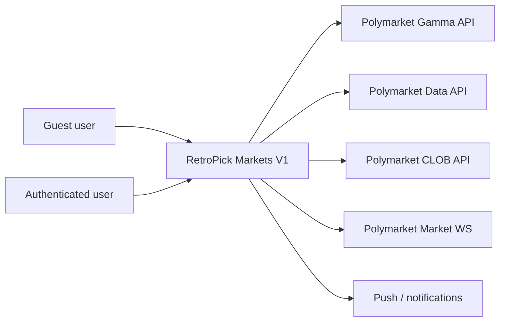
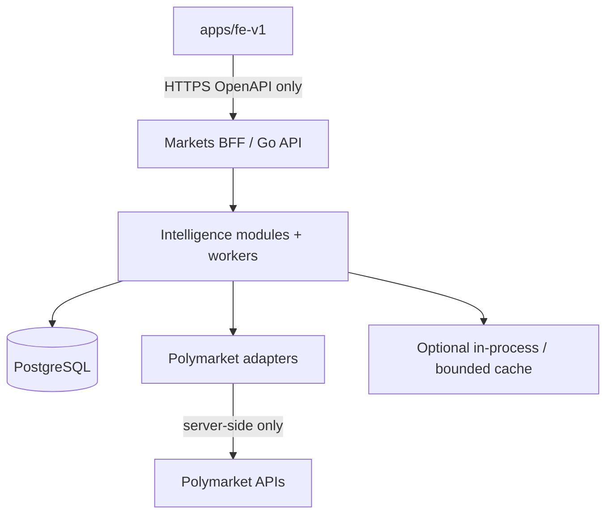
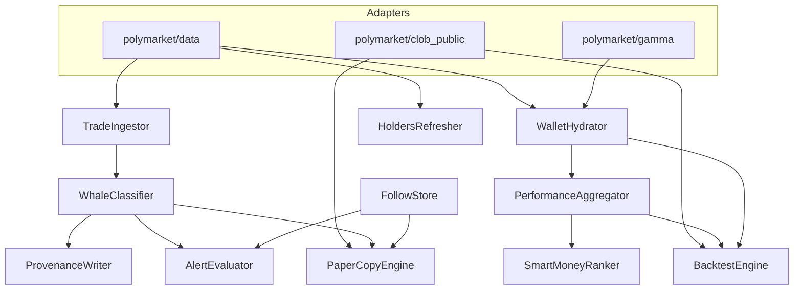
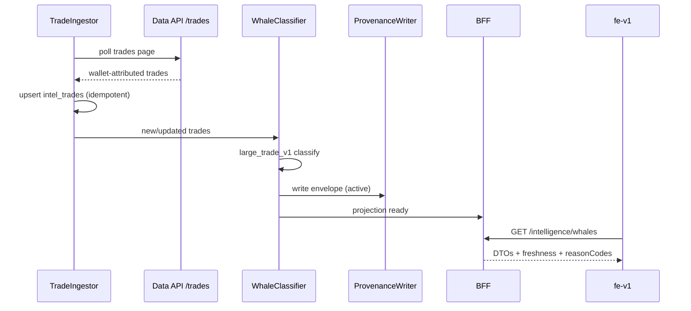
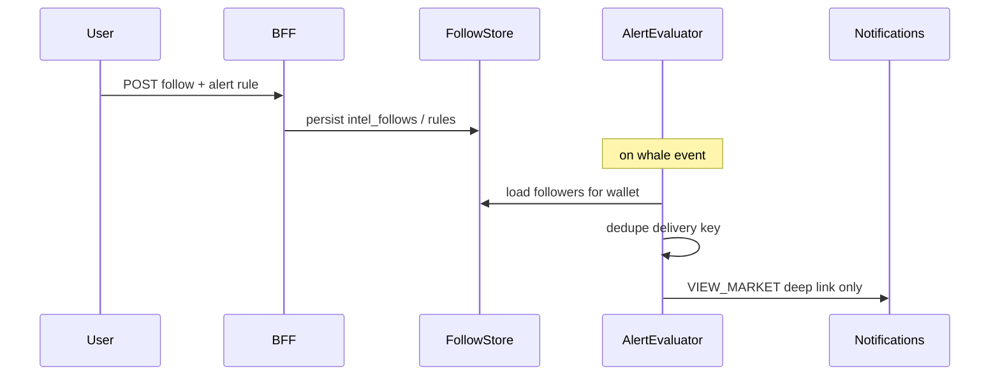
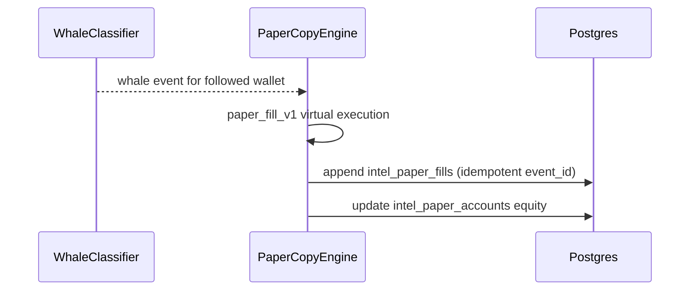
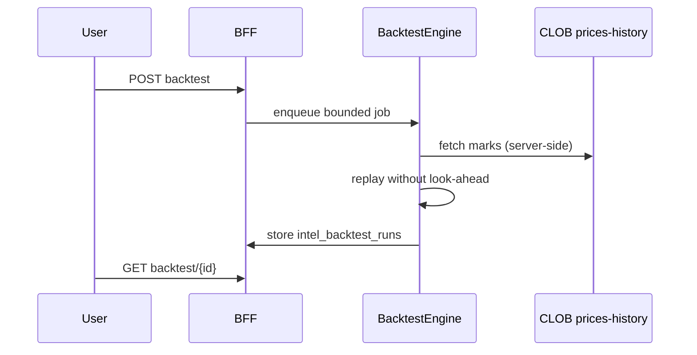

# Intelligence C4 Model — Smart Money Launch V1

**Status:** active
**Owner:** intelligence-lead
**Last updated:** 2026-08-09
**Product:** RetroPick Markets V1
**Wave:** Smart Money Intelligence Launch V1

---

## Description

This document is the **canonical C4 model** for Smart Money Intelligence Launch V1. Feature specs (`01`–`10`) must reference this file for placement rather than inventing per-feature system diagrams.

It defines L1 context, L2 containers, L3 intelligence components (`TradeIngestor`, `WhaleClassifier`, `WalletHydrator`, `PerformanceAggregator`, `SmartMoneyRanker`, `HoldersRefresher`, `FollowStore`, `AlertEvaluator`, `BacktestEngine`, `PaperCopyEngine`, `ProvenanceWriter`), L4 critical flows, and deployment notes. **Frontend never calls Polymarket Data API (or Gamma/CLOB market data) directly in production** — only the Markets BFF.

Compute lives in the existing modular monolith under `apps/backend/internal/markets/intelligence/` per [ADR-008](../architecture/adr/ADR-008-SHARED-SIGNAL-ENGINE.md). No microservice-per-feature for Launch.

---

## 0. Developer intent (5W+1H)

| Lens | Answer |
|------|--------|
| **Who** | Backend architects wiring intelligence modules; fe-markets integrating BFF only; devops sizing workers; security reviewing trust boundaries; agents placing features into components. |
| **What** | One C4 authority: L1 actors/systems, L2 containers, L3 named components, L4 flows (whale attribution, follow→alert, paper fill, backtest job), deployment. Hard rule: fe ↛ Data API. |
| **When** | Before adding workers/endpoints; when a feature doc’s “C4 Placement” section is written; when proposing Redis/Kafka/new services. |
| **Where** | This file. Runtime packages under `apps/backend/internal/markets/intelligence/` (+ polymarket adapters). Client: `apps/fe-v1`. Data: Postgres projections in [INTELLIGENCE_DATA_MODEL.md](INTELLIGENCE_DATA_MODEL.md). |
| **Why** | Ten conflicting diagrams cause duplicate pollers and leaked upstream schemas to the client. One model keeps cost and trust boundaries coherent. |
| **How** | Shared ingest → normalize → project → feature engines → BFF DTOs → fe. Provenance on every published signal. Account stores isolated. No order submit from intelligence components. |

### Worked example

**Happy path — whale card.** Data API `/trades` polled by `TradeIngestor` → row in `intel_trades` → `WhaleClassifier` emits event + `ProvenanceWriter` envelope → BFF `GET .../whales` → fe renders. Wallet identity never invented from Market WS alone.

**Failure / Never.** fe calling `https://data-api.polymarket.com/trades`. `AlertEvaluator` calling CLOB `POST /order`. New Kafka cluster “for whales.” Microservice per SM-I feature.

---

## 1. C4 Level 1 — System context

### 1.1 Actors and external systems

| Actor / System | Role in Launch V1 |
|----------------|-------------------|
| Guest user | Consumes PUBLIC intelligence via web |
| Authenticated RetroPick user | PUBLIC + ACCOUNT (follow, alerts, paper, backtest) |
| RetroPick Markets V1 | BFF + workers + Postgres + fe-v1 |
| Polymarket Gamma API | Discovery, public-search, market/event metadata |
| Polymarket Data API | Wallet-attributed trades, positions, closed positions, holders, activity |
| Polymarket CLOB API | Public books/prices/history for enrichment & backtest marks |
| Polymarket Market WebSocket | Optional market timing/book context — **not** wallet attribution authority |
| Wallet provider | Future I7 signing only; unused for Paper Copy execution |
| Push / notification channel | Delivers alert deep links (`VIEW_MARKET` only) |

### 1.2 Context diagram



### 1.3 Current vs target

| Concern | Current (docs foundation) | Target Launch runtime |
|---------|---------------------------|------------------------|
| Intelligence module | Spec + legacy Wave-6 stubs | Go modules + workers under markets intelligence |
| Client upstream calls | Forbidden by registry | Still forbidden |
| Trading from signals | Forbidden (ADR-009) | Still forbidden; I7 handoff later |

---

## 2. C4 Level 2 — Containers



| Container | Responsibility |
|-----------|----------------|
| `apps/fe-v1` | Render intelligence UX states; never hold upstream credentials or call Data/Gamma/CLOB for intel |
| Markets BFF | Authz, rate limits, DTO shaping, OpenAPI contract |
| Intelligence modules/workers | Ingest, classify, aggregate, rank, alert eval, paper, backtest |
| PostgreSQL | Projections + user intel data (follows, alerts, paper, backtests) |
| Polymarket adapters | ACL translation, pagination, 429 backoff |
| Cache | Optional; Postgres-first; Redis only if multi-replica evidence demands |

**Rule:** Prefer modular monolith. Do not create a new deployable per feature for Launch.

---

## 3. C4 Level 3 — Components

All components are logical modules inside the Markets backend intelligence boundary.



### 3.1 Component catalog

| Component | Owns | Inputs | Outputs | SM-I |
|-----------|------|--------|---------|------|
| **TradeIngestor** | Poll/paginate Data `/trades`; normalize; idempotent upsert | Upstream trade pages | `intel_raw_upstream_events`, `intel_trades` | 001 foundation |
| **WhaleClassifier** | Large-trade rules (`large_trade_v1`) | `intel_trades` + market context | `intel_whale_events` | 001 |
| **WalletHydrator** | Profile search/hydrate; positions/closed/activity pull | Gamma search + Data portfolio | `intel_wallet_profiles` | 002, 003 |
| **PerformanceAggregator** | Realized/unrealized P&L, ROI, win rate (`roi_v1`, `win_rate_v1`) | Trades + closed positions | `intel_wallet_metrics` | 004 |
| **SmartMoneyRanker** | Score + leaderboard snapshots (`smart_money_v1`) | Metrics working set | `intel_leaderboard_snapshots` | 005 |
| **HoldersRefresher** | Per-market top holders refresh | Data holders | `intel_top_holders` | 007 |
| **FollowStore** | User follow graph | Auth user + wallet address | `intel_follows` | 006 |
| **AlertEvaluator** | Match whale events to rules; dedupe deliveries | Follows/rules + whale events | `intel_alert_rules`, `intel_alert_deliveries` | 008 |
| **BacktestEngine** | Bounded historical simulation jobs | Wallet trades + price history | `intel_backtest_runs` | 010 |
| **PaperCopyEngine** | Incremental virtual fills from followed whale events | Follows + whale events + marks | `intel_paper_accounts`, `intel_paper_fills` | 009 |
| **ProvenanceWriter** | Evidence envelopes + lifecycle | Any published signal/metric package | `intel_evidence_envelopes` | all publish paths |

### 3.2 Explicit non-responsibilities

| Component | Must NOT |
|-----------|----------|
| Any intelligence component | Call CLOB order submit / cancel |
| AlertEvaluator | Emit `PLACE_ORDER` notification actions |
| PaperCopyEngine | Touch real balances or signing keys |
| WhaleClassifier | Invent wallet from Market WS trade without Data attribution |
| fe-v1 | Import adapter clients for Data/Gamma |

---

## 4. C4 Level 4 — Critical flows

### 4.1 Wallet-attributed whale event (correctness over fake realtime)



Optional Market WS may supply **timing/book context** only. It must not invent wallets.

### 4.2 Follow → whale alert (ACCOUNT)



### 4.3 Paper fill (simulation)



### 4.4 Quick backtest job



---

## 5. Deployment notes

| Topic | Launch guidance |
|-------|-----------------|
| Topology | Same Markets API deployable + one or more intelligence worker processes/goroutines |
| DB | Shared Postgres; intelligence tables prefixed `intel_` (docs model); migrations later — not in this doc pack |
| Secrets | None required for public Data/Gamma reads; never put CLOB L2 trading secrets in intel workers for Launch |
| Scaling | Vertical + poll cadence first; shard by market/wallet working set only if needed |
| Redis | Not day-one; justify with multi-replica dedupe evidence |
| Kafka | Not required for Launch ten |
| Kill switch | Feature flags + worker disable; trading path remains up (ADR-008) |
| Observability | Ingest lag, 429 counts, whale publish rate, alert delivery lag, backtest queue depth, paper fill errors |

### 5.1 Trust boundary reminder

```text
fe-v1  →  Markets BFF  →  Intelligence  →  Polymarket adapters  →  Upstream
                ✗ fe ──────────────────────────────────────────────✗ Data API
```

---

## 6. Feature → component placement cheat sheet

| Feature | Primary | Secondary |
|---------|---------|-----------|
| SM-I-001 Whale Feed | WhaleClassifier | TradeIngestor, ProvenanceWriter |
| SM-I-002 Search | WalletHydrator | Gamma adapter |
| SM-I-003 Profile | WalletHydrator | TradeIngestor |
| SM-I-004 Performance | PerformanceAggregator | ProvenanceWriter |
| SM-I-005 Leaderboard | SmartMoneyRanker | PerformanceAggregator |
| SM-I-006 Follow | FollowStore | — |
| SM-I-007 Holders | HoldersRefresher | — |
| SM-I-008 Alerts | AlertEvaluator | FollowStore, WhaleClassifier |
| SM-I-009 Paper | PaperCopyEngine | FollowStore, WhaleClassifier |
| SM-I-010 Backtest | BacktestEngine | PerformanceAggregator, CLOB public |

---

## 7. Cross-references

- [INTELLIGENCE_LAUNCH_V1.md](INTELLIGENCE_LAUNCH_V1.md)
- [POLYMARKET_INTELLIGENCE_DATA_SOURCES.md](POLYMARKET_INTELLIGENCE_DATA_SOURCES.md)
- [INTELLIGENCE_DATA_MODEL.md](INTELLIGENCE_DATA_MODEL.md)
- [ADR-008](../architecture/adr/ADR-008-SHARED-SIGNAL-ENGINE.md)
- [ADR-009](../architecture/adr/ADR-009-NO-AUTO-COPY-TRADING-V1.md)
- [SYSTEM_CONTEXT_AND_TRUST_BOUNDARIES.md](../architecture/SYSTEM_CONTEXT_AND_TRUST_BOUNDARIES.md)
- [API_SDK_AND_ENDPOINT_REGISTRY.md](../polymarket/API_SDK_AND_ENDPOINT_REGISTRY.md)
