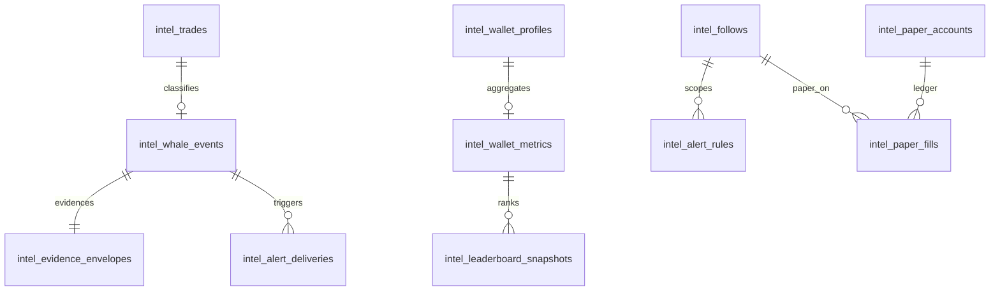

# Intelligence Data Model — Smart Money Launch V1

**Status:** active
**Owner:** intelligence-lead
**Last updated:** 2026-08-09
**Product:** RetroPick Markets V1
**Wave:** Smart Money Intelligence Launch V1

---

## Description

This document is the **projection data-model authority** for Smart Money Intelligence Launch V1. It specifies documentation-level tables (names, purpose, authority, retention, indexes, idempotency). It is **not** a migration. Do not apply DDL from this file until a later harness task owns `apps/backend/migrations/`.

**Money columns use BIGINT** fixed-point (same Markets convention as OpenAPI `Money` — integer minor units; never IEEE floats for balances/P&L/notional).

Intelligence tables are **projections and user intel state**, not ownership of Polymarket balances, orders, or settlement. Upstream remains authoritative for venue truth; RetroPick stores caches/aggregates/simulations.

Evidence envelopes are first-class (`intel_evidence_envelopes`) with slim schema and lifecycle: `draft` / `active` / `stale` / `retracted` / `superseded`.

---

## 0. Developer intent (5W+1H)

| Lens | Answer |
|------|--------|
| **Who** | `be-data` / intelligence workers designing sqlc later; API authors shaping DTOs; QA asserting idempotent upserts; agents tempted to invent tables per feature. |
| **What** | Fourteen `intel_*` tables with purpose, authority, retention, indexes, idempotency; BIGINT money; evidence envelope schema + lifecycle; projection-not-ownership rule. |
| **When** | During I0 foundation; before feature storage sections in `01`–`10`; before any migration PR. |
| **Where** | This doc only until migrations exist. Runtime target schema under Markets Postgres. Related: ProvenanceWriter in C4. |
| **Why** | Without a shared model, ten features create ten incompatible trade IDs and float money. Envelopes keep scores auditable and retractable. |
| **How** | Upsert on natural upstream keys; version formula params; retain raw events briefly; keep derived aggregates compact; never write from fe to these tables except via BFF user APIs for follows/alerts/paper/backtest. |

### Worked example

**Happy path.** `TradeIngestor` inserts `intel_raw_upstream_events` then upserts `intel_trades` on `(source, upstream_trade_id)`. `WhaleClassifier` writes `intel_whale_events` + `intel_evidence_envelopes` (`active`). Re-poll same trade → no duplicate whale card.

**Failure / Never.** Float `numeric` for notional. Treating `intel_paper_accounts.equity` as withdrawable USDC. Publishing whale without envelope. Migrations invented in a feature PR without I0 task.

---

## 1. Design principles

1. **Projections, not ownership** — deleting RetroPick rows must not imply venue position changes.
2. **BIGINT money** — all notional, P&L, equity, fill size-value fields.
3. **Idempotent ingest** — natural keys from upstream or deterministic hashes.
4. **Compact derived data** — do not mirror full Polymarket history by default.
5. **User data isolation** — follows/alerts/paper/backtests scoped by `user_id`.
6. **Envelope on publish** — user-visible intelligence signals/metrics packages reference envelopes.
7. **No order tables here** — trading orders remain outside intel schema.

### Authority classes

| Authority | Meaning |
|-----------|---------|
| `upstream_cache` | Near-raw Polymarket payload or normalized pass-through |
| `normalized_projection` | RetroPick-normalized trade/wallet rows |
| `derived_aggregate` | RetroPick formulas/snapshots |
| `user_data` | Authenticated user preferences / rules |
| `simulation` | Paper/backtest virtual state |

---

## 2. Table inventory

| Table | Authority | Primary SM-I |
|-------|-----------|--------------|
| `intel_raw_upstream_events` | upstream_cache | I0 |
| `intel_trades` | normalized_projection | 001–004, 009–010 |
| `intel_whale_events` | derived_aggregate | 001, 008, 009 |
| `intel_wallet_profiles` | normalized_projection | 002, 003 |
| `intel_wallet_metrics` | derived_aggregate | 004, 005 |
| `intel_leaderboard_snapshots` | derived_aggregate | 005 |
| `intel_top_holders` | normalized_projection | 007 |
| `intel_follows` | user_data | 006 |
| `intel_alert_rules` | user_data | 008 |
| `intel_alert_deliveries` | user_data | 008 |
| `intel_paper_accounts` | simulation | 009 |
| `intel_paper_fills` | simulation | 009 |
| `intel_backtest_runs` | simulation | 010 |
| `intel_evidence_envelopes` | derived_aggregate | all publish |

---

## 3. Per-table specifications

### 3.1 `intel_raw_upstream_events`

| Aspect | Spec |
|--------|------|
| **Purpose** | Durable ingest audit of upstream pages/payloads for replay/debug |
| **Authority** | `upstream_cache` |
| **Retention** | Short: 7–30 days (ops configurable); not user-facing |
| **Indexes** | `(source, fetched_at DESC)`; `(idempotency_key) UNIQUE` |
| **Idempotency** | `idempotency_key = sha256(source \|\| request_fingerprint \|\| body_hash)` |

Key columns (logical): `id`, `source` (`data_trades`\|`data_positions`\|…), `request_fingerprint`, `payload jsonb`, `fetched_at`, `http_status`.

### 3.2 `intel_trades`

| Aspect | Spec |
|--------|------|
| **Purpose** | Normalized wallet-attributed public trades |
| **Authority** | `normalized_projection` |
| **Retention** | Hot window for feed/performance (e.g. 90–180d) + longer cold optional later |
| **Indexes** | `UNIQUE(source, upstream_trade_id)`; `(wallet_address, traded_at DESC)`; `(market_id, traded_at DESC)` |
| **Idempotency** | Upsert on `(source, upstream_trade_id)` |

Money: `notional`, `size`, `price_fp` as BIGINT (document scale in OpenAPI/params).  
Must include `wallet_address`, `market_id`, `outcome`, `side`, `traded_at`, `payload_hash`.

### 3.3 `intel_whale_events`

| Aspect | Spec |
|--------|------|
| **Purpose** | Published large-trade events for feed/alerts/paper triggers |
| **Authority** | `derived_aggregate` |
| **Retention** | Align to feed UX (e.g. 30–90d); envelopes may outlive for audit |
| **Indexes** | `UNIQUE(trade_ref)`; `(created_at DESC)`; `(wallet_address, created_at DESC)` |
| **Idempotency** | One whale event per `trade_ref` + `params_version` (supersede on reclass) |

Links: `envelope_id`, `reason_codes`, `large_trade_score` (optional), freshness fields.

### 3.4 `intel_wallet_profiles`

| Aspect | Spec |
|--------|------|
| **Purpose** | Cached public profile + hydration metadata |
| **Authority** | `normalized_projection` |
| **Retention** | Refresh in place; soft-delete rare |
| **Indexes** | `UNIQUE(wallet_address)`; `(username_normalized)` where present |
| **Idempotency** | Upsert by `wallet_address` |

Store upstream display fields separately from RetroPick-derived summaries (or mark provenance).

### 3.5 `intel_wallet_metrics`

| Aspect | Spec |
|--------|------|
| **Purpose** | Versioned P&L / ROI / win-rate aggregates |
| **Authority** | `derived_aggregate` |
| **Retention** | Current row per `(wallet, window, formula_version)`; history optional |
| **Indexes** | `UNIQUE(wallet_address, window_id, formula_version)`; `(computed_at DESC)` |
| **Idempotency** | Recompute replaces row for same key; bump version on formula change |

Money BIGINT: `realized_pnl`, `unrealized_pnl`, `total_pnl`, `volume`, etc.  
Win rate fields: `wins`, `losses`, `raw_win_rate_bps`, `shrunk_win_rate_bps` (integer bps).

### 3.6 `intel_leaderboard_snapshots`

| Aspect | Spec |
|--------|------|
| **Purpose** | Materialized leaderboard pages for SM-I-005 |
| **Authority** | `derived_aggregate` |
| **Retention** | Keep latest snapshot set + limited history (e.g. 7–30d) |
| **Indexes** | `(snapshot_at DESC, rank)`; `UNIQUE(snapshot_at, wallet_address, board_id)` |
| **Idempotency** | Snapshot batch ID; rebuild replaces board_id+snapshot_at |

No insider labels. Include `smart_money_score`, `sample_n`, `formula_version`.

### 3.7 `intel_top_holders`

| Aspect | Spec |
|--------|------|
| **Purpose** | Per-market top holders projection (≤20 product cap) |
| **Authority** | `normalized_projection` |
| **Retention** | Replace-on-refresh per market |
| **Indexes** | `UNIQUE(market_id, wallet_address, outcome)`; `(market_id, rank)` |
| **Idempotency** | Refresh transaction replaces market set |

### 3.8 `intel_follows`

| Aspect | Spec |
|--------|------|
| **Purpose** | Authenticated user → wallet follow edges |
| **Authority** | `user_data` |
| **Retention** | Until unfollow; soft-delete OK |
| **Indexes** | `UNIQUE(user_id, wallet_address)`; `(wallet_address)` for reverse fanout |
| **Idempotency** | Upsert follow; delete/unfollow is idempotent |

Privacy: lists are private to `user_id`.

### 3.9 `intel_alert_rules`

| Aspect | Spec |
|--------|------|
| **Purpose** | Basic whale alert rules (Launch: simple thresholds / followed wallets) |
| **Authority** | `user_data` |
| **Retention** | Until user deletes |
| **Indexes** | `(user_id)`; `(enabled, wallet_address)` |
| **Idempotency** | Stable `rule_id`; updates overwrite |

Must not store pre-signed orders or auto-copy flags.

### 3.10 `intel_alert_deliveries`

| Aspect | Spec |
|--------|------|
| **Purpose** | Dedupe + delivery audit for alerts |
| **Authority** | `user_data` |
| **Retention** | 30–90d |
| **Indexes** | `UNIQUE(dedupe_key)`; `(user_id, created_at DESC)` |
| **Idempotency** | `dedupe_key = sha256(user_id \|\| rule_id \|\| whale_event_id)` |

Action payload: `VIEW_MARKET` only.

### 3.11 `intel_paper_accounts`

| Aspect | Spec |
|--------|------|
| **Purpose** | Per-user paper simulation account |
| **Authority** | `simulation` |
| **Retention** | User lifetime; reset allowed |
| **Indexes** | `UNIQUE(user_id)` (Launch: one account) |
| **Idempotency** | Create-if-absent |

Money BIGINT: `cash_balance`, `equity`, `realized_pnl`.  
UX must label simulation — not real funds.

### 3.12 `intel_paper_fills`

| Aspect | Spec |
|--------|------|
| **Purpose** | Append-only virtual fills |
| **Authority** | `simulation` |
| **Retention** | Account lifetime / archive later |
| **Indexes** | `UNIQUE(account_id, source_event_id)`; `(account_id, filled_at DESC)` |
| **Idempotency** | One fill per `(account_id, source_event_id)` |

### 3.13 `intel_backtest_runs`

| Aspect | Spec |
|--------|------|
| **Purpose** | Backtest job + results envelope |
| **Authority** | `simulation` |
| **Retention** | 30–180d |
| **Indexes** | `(user_id, created_at DESC)`; `(status)`; optional `UNIQUE(result_cache_key)` |
| **Idempotency** | `result_cache_key = hash(wallet \|\| strategy \|\| window \|\| engine_version)` |

Store params, status (`queued|running|succeeded|failed|rejected`), metrics BIGINT/bps, error codes. No look-ahead inputs persisted as “future.”

### 3.14 `intel_evidence_envelopes`

| Aspect | Spec |
|--------|------|
| **Purpose** | Auditable evidence for published intelligence |
| **Authority** | `derived_aggregate` |
| **Retention** | ≥ associated signal retention; longer for compliance/debug if needed |
| **Indexes** | `(lifecycle, computed_at DESC)`; `(signal_type, computed_at DESC)`; `UNIQUE(hash)` optional |
| **Idempotency** | Content `hash`; recompute with same inputs → same hash; mismatch → retract/supersede |

---

## 4. Evidence envelope — slim schema

Logical JSON (column `envelope jsonb` or decomposed columns + jsonb metrics):

```json
{
  "version": 1,
  "signalType": "whale_trade",
  "computedAt": "2026-08-09T00:00:00Z",
  "inputs": {
    "tradeId": "data:trades:abc",
    "marketId": "market_123",
    "wallet": "0xabc..."
  },
  "metrics": {
    "notional": 42500000000,
    "pctRecentVolumeBps": 630
  },
  "paramsRef": "intelligence_params_v1.yaml#large_trade_v1",
  "reasonCodes": ["LARGE_NOTIONAL", "PCT_RECENT_VOLUME"],
  "hash": "sha256:..."
}
```

| Field | Required | Notes |
|-------|----------|-------|
| `version` | yes | Envelope schema version |
| `signalType` | yes | e.g. `whale_trade`, `smart_money_score`, `backtest_result` |
| `computedAt` | yes | UTC |
| `inputs` | yes | Stable IDs only — no secrets |
| `metrics` | yes | Prefer integer/BIGINT-compatible JSON numbers |
| `paramsRef` | yes | Formula/params pointer |
| `reasonCodes` | yes | Machine-stable codes |
| `hash` | yes | Canonical content hash |

### 4.1 Lifecycle

| State | Meaning | Client UX |
|-------|---------|-----------|
| `draft` | Computed, not published | Hidden |
| `active` | Published | Normal |
| `stale` | Age > threshold or upstream freshness breach | “May be outdated” |
| `retracted` | Invalidated | Remove / strike-through |
| `superseded` | Replaced by newer logical key | Link to successor |

Transitions: `draft → active → {stale|retracted|superseded}`. Do not silently leave lying `active` rows after hash mismatch.

---

## 5. Relationships (logical)



---

## 6. Money and numeric policy

| Rule | Detail |
|------|--------|
| Storage | `BIGINT` for money and fixed-point prices/sizes as adopted by Markets |
| API | String decimal or documented fixed-point — match OpenAPI `Money` |
| Forbidden | `float64` accumulation for P&L ledgers |
| Rates | Integer bps where possible (`win_rate_bps`) |

---

## 7. What this model is not

- Not venue custody or order ledger.
- Not a substitute for catalog/market tables.
- Not permission to auto-copy.
- Not migrations — docs only until I0 implementation task.

---

## 8. Cross-references

- [INTELLIGENCE_C4_MODEL.md](INTELLIGENCE_C4_MODEL.md) — writers/readers
- [POLYMARKET_INTELLIGENCE_DATA_SOURCES.md](POLYMARKET_INTELLIGENCE_DATA_SOURCES.md) — upstream authority
- [INTELLIGENCE_TEST_STRATEGY.md](INTELLIGENCE_TEST_STRATEGY.md) — idempotency/replay tests
- [SIGNAL_PROVENANCE_CALIBRATION_AND_RETRACTIONS.md](SIGNAL_PROVENANCE_CALIBRATION_AND_RETRACTIONS.md) — historical envelope detail (migrate norms here over time)
- [ADR-008](../architecture/adr/ADR-008-SHARED-SIGNAL-ENGINE.md)
