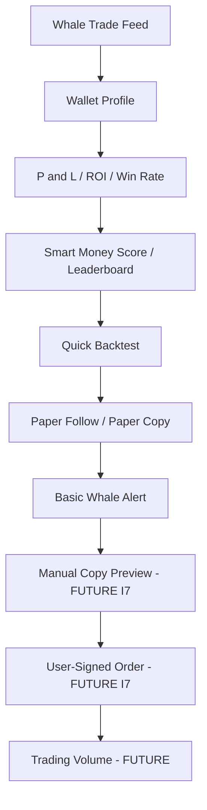

# Smart Money Intelligence Launch V1 — Product Scope

**Status:** active
**Owner:** intelligence-lead
**Last updated:** 2026-08-09
**Product:** RetroPick Markets V1
**Wave:** Smart Money Intelligence Launch V1

---

## Description

This document is the **product scope authority** for RetroPick **Smart Money Intelligence Launch V1**: exactly ten features, one growth loop, PUBLIC vs ACCOUNT gates, Never-V1 rejects, feature flags, intelligence micro-phases I0–I6 (plus future I7), mapping onto canonical Markets PHASE-1/2/3, and requirement IDs **SM-I-001…SM-I-010**.

It **demotes** the older TI-V1 broad capability list in `TRADER_INTELLIGENCE_PRODUCT_SPEC.md` to **historical** status. Implementers and agents must not treat TI-V1-001…019 as Launch default-on scope.

Completing this documentation program (INTEL-DOC) does **not** advance `current_phase` in `implementation-manifest.yaml`. Markets overall remains **PHASE-1** until the harness says otherwise. Intelligence work is planned as micro-phases I0–I6 that **map into** canonical phases without inventing a competing PHASE-N numbering.

Hard product law: **no auto-copy** ([ADR-009](../architecture/adr/ADR-009-NO-AUTO-COPY-TRADING-V1.md)). Paper Copy is simulation only. Future manual copy + user-signed order is I7, not Launch V1.

---

## 0. Developer intent (5W+1H)

| Lens | Answer |
|------|--------|
| **Who** | Product/orchestrator locking Launch scope; BFF/intelligence agents implementing SM-I-*; fe-markets rendering PUBLIC vs ACCOUNT surfaces; QA tracing acceptance IDs; security/legal enforcing Never V1. |
| **What** | Exactly ten launch capabilities, growth-loop UX, gate matrix, flags, I0–I6 (+ future I7), PHASE mapping, SM-I-* IDs. Demotes TI-V1 broad list. Not PHASE clock advancement. Not autonomous trading. |
| **When** | Before coding any intelligence surface; when promoting a flag; when a request cites TI-V1 IDs; before claiming “intelligence launch done.” |
| **Where** | This file for scope. C4, data sources, data model, tests in sibling foundations. Feature math/API in `01`–`10`. Runtime: `apps/backend/internal/markets/intelligence/`. Clients via BFF OpenAPI only. |
| **Why** | Broad TI-V1 invited UV scanners, arb labels, and complex alert DSL before users exist. Launch V1 optimizes retention via one explainable loop at low infra cost. |
| **How** | Ship PUBLIC read path first (I1–I3), then ACCOUNT retention/proof (I4–I6). Version formulas (`large_trade_v1`, `roi_v1`, `smart_money_v1`, …). Gate with flags. Never open an order path from signals. |

### Worked example

**Happy path.** User sees a large trade (SM-I-001) → opens wallet profile (SM-I-003) → reads P&L/ROI/win rate (SM-I-004) → checks leaderboard rank (SM-I-005) → runs quick backtest (SM-I-010) → paper-follows (SM-I-009) → gets whale alert (SM-I-008). Later, outside Launch, they may manually preview and sign an order (I7). No server auto-submit.

**Failure / Never.** Auto-copy from alert. “Insider” wallet badge. AI that places orders. Geoblock bypass via intelligence repo. Guaranteed-arb marketing. Treating INTEL-DOC as PHASE-4 exit.

---

## 1. Product thesis

RetroPick Markets should not be merely a venue clone or a whale-alert bot. Launch V1 answers five progressive questions:

| Question | Feature |
|----------|---------|
| WHAT happened? | Whale Trade Feed |
| WHO did it? | Wallet Search + Wallet Profile |
| ARE THEY ACTUALLY GOOD? | P&L / ROI / Win Rate + Smart Money Leaderboard |
| SHOULD I FOLLOW THEM? | Quick Backtest (+ Follow) |
| WHAT HAPPENS IF I FOLLOW? | Paper Copy + Basic Whale Alerts |

Later (not Launch): CAN I EXECUTE? → manual user-signed copy trade (I7).

Copy and UX language must stay informational / simulation-clear. Do not use gambling framing.

---

## 2. Exact Launch V1 feature set (10)

| # | Feature | Req ID | Gate | Micro-phase | Primary components |
|---|---------|--------|------|-------------|--------------------|
| 1 | Whale Trade Feed | SM-I-001 | PUBLIC | I1 | TradeIngestor, WhaleClassifier, ProvenanceWriter |
| 2 | Wallet Search | SM-I-002 | PUBLIC | I2 | WalletHydrator |
| 3 | Wallet Profile | SM-I-003 | PUBLIC | I2 | WalletHydrator |
| 4 | P&L / ROI / Win Rate | SM-I-004 | PUBLIC | I2 | PerformanceAggregator |
| 5 | Smart Money Leaderboard | SM-I-005 | PUBLIC | I3 | SmartMoneyRanker |
| 6 | Follow Wallet | SM-I-006 | ACCOUNT | I4 | FollowStore |
| 7 | Top Holders | SM-I-007 | PUBLIC | I3 | HoldersRefresher |
| 8 | Basic Whale Alerts | SM-I-008 | ACCOUNT | I4 | AlertEvaluator |
| 9 | Paper Copy | SM-I-009 | ACCOUNT | I6 | PaperCopyEngine |
| 10 | Quick Backtest | SM-I-010 | ACCOUNT* | I5 | BacktestEngine |

\*Quick Backtest is ACCOUNT/GATED at Launch (auth + rate limits). Anonymous public backtest is explicitly **out of Launch** unless a later decision revises this table.

---

## 3. Growth loop



**Launch V1 ends** at Paper Copy + Quick Backtest + Alerts. Manual copy → signed order → volume is architected as a clean handoff only.

---

## 4. PUBLIC vs ACCOUNT gated

| Class | Features |
|-------|----------|
| **PUBLIC** | Whale Trade Feed, Wallet Search, Wallet Profile, P&L/ROI/Win Rate, Smart Money Leaderboard, Top Holders |
| **ACCOUNT** | Follow Wallet, Basic Whale Alerts, Quick Backtest, Paper Copy |
| **FUTURE (I7)** | Manual Copy Preview, User-Signed Order |
| **INTERNAL** | Raw upstream event store, worker heartbeats, provenance recompute jobs |

ACCOUNT features require authenticated RetroPick session. Follow lists and alert rules are private to the owning user. Paper ledgers never touch CLOB submit.

---

## 5. Never V1

| Capability | Status | Authority |
|------------|--------|-----------|
| Automatic / autonomous copy trading | **reject** | ADR-009 |
| Insider / “smart money insider” labels | **reject** | Product + security |
| AI / LLM → order execution | **reject** | ADR-008 / ADR-009 |
| Geoblock bypass via intelligence paths | **reject** | Security policy |
| Guaranteed arbitrage / risk-free profit claims | **reject** | Product honesty |
| Frontend direct Polymarket Data API in production | **reject** | ACL / C4 |
| Invented contract addresses | **reject** | Contract registry policy |
| Complex multi-market alert DSL (legacy Wave 6) | **defer** | Not Launch ten |
| Unusual-activity “insider” heuristics as Launch | **archive** | Not Launch ten |

---

## 6. Feature flags

Controlled rollout flags (names are canonical for Launch docs):

| Flag | Gates |
|------|-------|
| `intelligence.whale_feed` | SM-I-001 |
| `intelligence.wallet_profile` | SM-I-002, SM-I-003, SM-I-004 |
| `intelligence.smart_money` | SM-I-005 |
| `intelligence.holders` | SM-I-007 |
| `intelligence.follows` | SM-I-006 |
| `intelligence.whale_alerts` | SM-I-008 |
| `intelligence.backtest` | SM-I-010 |
| `intelligence.paper_copy` | SM-I-009 |

Rollout preference: Internal → shadow validation → staff → small beta → PUBLIC reads → ACCOUNT features → Paper Copy last. SmartMoneyScore should run shadow/review before prominent marketing.

Do not explode into one flag per widget.

---

## 7. Intelligence micro-phases (I0–I6) + future I7

| Micro-phase | Name | Delivers | Depends on |
|-------------|------|----------|------------|
| **I0** | Data & Contract Foundation | Shared adapters, normalized trade/wallet IDs, rate-limit budget, provenance, OpenAPI stubs, projection tables (docs→migrations later) | Markets read BFF exists |
| **I1** | Whale Discovery | Whale Trade Feed (SM-I-001) | I0 |
| **I2** | Wallet Intelligence | Search, Profile, P&L/ROI/Win Rate (SM-I-002…004) | I0; benefits from I1 |
| **I3** | Smart Money Discovery | Leaderboard + Top Holders (SM-I-005, SM-I-007) | I2 metrics |
| **I4** | Retention | Follow + Basic Whale Alerts (SM-I-006, SM-I-008) | I1 + identity |
| **I5** | Proof | Quick Backtest (SM-I-010) | I2 history + price history |
| **I6** | Habit Formation | Paper Copy (SM-I-009) | I4 follow + I1 events |
| **I7** | Future Monetization Handoff | Manual copy preview + user-signed trade | Markets trading path; **NOT Launch V1** |

### Exit themes (summary)

| Phase | Exit theme |
|-------|------------|
| I0 | One shared poller budget; envelopes; stale/429 behavior defined |
| I1 | Deduped whale feed via BFF; lag honesty; reason codes |
| I2 | Deterministic performance tests green |
| I3 | Versioned `smart_money_v1`; holders ≤20 honesty |
| I4 | Private follows; deduped alerts; VIEW_MARKET actions only |
| I5 | Reproducible backtest; no look-ahead; bounded runtime |
| I6 | Restart-safe paper ledger; explicit simulation UX |
| I7 | Preview → local sign → CLOB submit only (future ADR/phase) |

---

## 8. Map to canonical Markets PHASE-1 / 2 / 3

Intelligence micro-phases do **not** replace Markets phases. Mapping for planning only:

| Intelligence | Canonical Markets phase (planning home) | Notes |
|--------------|------------------------------------------|-------|
| I0 | PHASE-1 (Foundation & Read Markets) | Adapters + projections alongside catalog/read path; **does not** complete PHASE-1 by itself |
| I1–I3 PUBLIC reads | PHASE-1 (read surfaces) → may continue into later read hardening | Still informational; no trading dependency |
| I4 ACCOUNT follow/alerts | PHASE-2 (Account / Wallet) for auth session dependency | Alerts must not submit orders |
| I5–I6 backtest/paper | May proceed on ACCOUNT once auth exists; still **no** CLOB submit | Can overlap PHASE-2/3 calendars without requiring order ticket |
| I7 manual copy | PHASE-3 (Web Trading Core) or later | Requires preview + user sign; ADR-009 still forbids auto |

**Binding:** `current_phase: PHASE-1` today. INTEL-DOC / I0 docs do not flip the manifest.

---

## 9. Requirement ID scheme

| ID | Feature | One-line acceptance theme |
|----|---------|---------------------------|
| SM-I-001 | Whale Trade Feed | Wallet-attributed large trades via Data `/trades`; BFF feed; provenance; stale UX |
| SM-I-002 | Wallet Search | Address + public username search via Gamma; no deanonymization |
| SM-I-003 | Wallet Profile | Public profile + positions/trades projections; field provenance labels |
| SM-I-004 | P&L / ROI / Win Rate | Versioned formulas; BIGINT money; golden vectors |
| SM-I-005 | Smart Money Leaderboard | Versioned score; sample minimums; no insider labels |
| SM-I-006 | Follow Wallet | Authenticated follow/unfollow; private list |
| SM-I-007 | Top Holders | Holders projection; ≤20 honesty; market-detail surface |
| SM-I-008 | Basic Whale Alerts | Opt-in rules; dedupe; VIEW_MARKET only; no PLACE_ORDER |
| SM-I-009 | Paper Copy | Virtual ledger; simulation banner; no CLOB path |
| SM-I-010 | Quick Backtest | Deterministic; no look-ahead; bounded job |

Acceptance detail patterns: `SM-I-00N-AC-###` in [INTELLIGENCE_TEST_STRATEGY.md](INTELLIGENCE_TEST_STRATEGY.md).

---

## 10. Historical demotion — TI-V1 broad list

| Legacy | Launch treatment |
|--------|------------------|
| TI-V1-001…019 registry | **Historical.** Not Launch default-on. |
| TI-V11-* unusual activity / scanners | **Archived / deferred** — not in ten |
| TI-PV-* post-V1 / rejects | Rejects still bind (auto-copy, AI→orders); research rows not Launch |
| Wave-6 “signal inbox for everything” | Narrowed: whale alerts (SM-I-008) only for Launch |

Agents cited on TI-V1 IDs must remap to SM-I-* or refuse out-of-scope work.

---

## 11. API surface (directional — OpenAPI is freeze authority)

Directional BFF paths (do not invent beyond OpenAPI once frozen):

```text
GET  /markets/intelligence/whales
GET  /markets/intelligence/wallets/search
GET  /markets/intelligence/wallets/{address}
GET  /markets/intelligence/wallets/{address}/performance
GET  /markets/intelligence/leaderboard
GET  /markets/intelligence/markets/{marketId}/holders
GET|POST|DELETE  /markets/intelligence/follows...
GET|POST|DELETE  /markets/intelligence/alerts...
POST|GET  /markets/intelligence/backtests...
GET|POST|DELETE  /markets/intelligence/paper...
```

Exact names freeze in `schemas/openapi/markets-v1.yaml`. No `POST /markets/copy/*`. No `capabilities.autoCopy: true`.

---

## 12. Cost and architecture constraints

Prefer: deterministic rules, PostgreSQL projections, Go workers, existing BFF, public Polymarket APIs, bounded caches, materialized aggregates for hot wallets.

Avoid for Launch: Kafka/Spark/feature stores/GPU ML/graph DBs/Redis-by-default/per-feature pollers.

Intelligence failures must not block trading (ADR-008). Trading must not auto-execute intelligence (ADR-009).

---

## 13. Cross-references

- [README.md](README.md) — consume order
- [INTELLIGENCE_C4_MODEL.md](INTELLIGENCE_C4_MODEL.md)
- [POLYMARKET_INTELLIGENCE_DATA_SOURCES.md](POLYMARKET_INTELLIGENCE_DATA_SOURCES.md)
- [INTELLIGENCE_DATA_MODEL.md](INTELLIGENCE_DATA_MODEL.md)
- [INTELLIGENCE_TEST_STRATEGY.md](INTELLIGENCE_TEST_STRATEGY.md)
- [ADR-009](../architecture/adr/ADR-009-NO-AUTO-COPY-TRADING-V1.md)
- [ADR-008](../architecture/adr/ADR-008-SHARED-SIGNAL-ENGINE.md)
- Historical: [TRADER_INTELLIGENCE_PRODUCT_SPEC.md](TRADER_INTELLIGENCE_PRODUCT_SPEC.md) (demoted)
