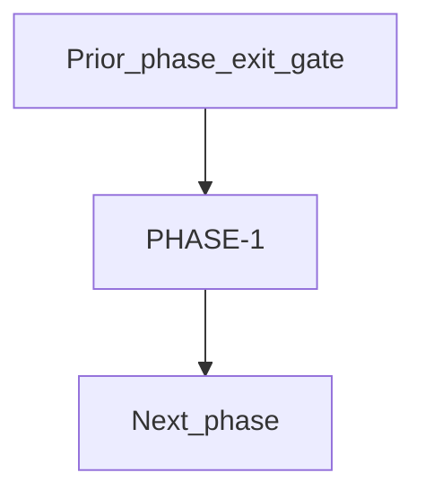

# PHASE-1 — Foundation and Read Markets

**Status:** backend-first read slice complete (ADR-010, 2026-07-30)
**Owner:** platform-orchestrator
**Last updated:** 2026-07-30
**Product:** RetroPick Markets V1

## 1. Purpose

Phase specification for **PHASE-1**: Monorepo boundaries, schemas, public catalog, read UX without trading.

## 2. Scope

### In scope

- Backend-first tasks and deliverables assigned to PHASE-1 in
  [implementation-manifest.yaml](../agent-harness/implementation-manifest.yaml).
- Canonical contracts, public Gamma/CLOB adapters, PostgreSQL projections,
  catalog and market-data ingest foundations, public read handlers, deterministic
  signals, observability, security controls, and verification.

### Out of scope

- Work belonging to other phases unless explicitly pulled forward with ADR.
- Web and Android UI/modules, wallet identity, funding, trading, portfolio,
  notification delivery, PRISM, custom contracts, and production deployment.

## 3. Prerequisites

- [phases/README.md](README.md)
- [agent-harness/task-graph.yaml](../agent-harness/task-graph.yaml)

## 4. Authoritative sources

| Source | URL | Retrieved | Confidence |
|--------|-----|-----------|------------|
| Polymarket docs | https://docs.polymarket.com/ | 2026-07-24 | partially verified |
| CLOB V2 migration | https://docs.polymarket.com/v2-migration | 2026-07-24 | partially verified |
| OpenAPI (repo) | `schemas/openapi/markets-v1.yaml` | 2026-07-24 | verified |
| Monorepo architecture | `docs/ARCHITECTURE.md` | 2026-07-24 | verified |

## 5. Current state

Phase 1 backend-first public-read slice is implemented on branch
`cursor/markets-v1-backend-phase1-5b74`. Handoff:
`.dev/markets-v1/agent-harness/PHASE-1-BACKEND-HANDOFF.md`. Web and Android
client work remain deferred.

## 6. Target design

Monorepo boundaries, schemas, public catalog, read UX without trading.

## 7. Alternatives considered

| Alternative | Rejected because |
|-------------|------------------|
| Custom RetroPick exchange | ADR-001: Polymarket is venue |
| Direct Gamma/CLOB from clients in prod | ADR-002: BFF anti-corruption layer |
| Extend legacy epoch APIs | Frozen at `/api/v1/legacy/markets/*` |

## 8. Decisions

- Phase ID `PHASE-1` is locked per master prompt §15.
- ADR-010 narrows this run to the backend-first public-read slice. ADR-004 still
  governs future shared web and Android integration.
- Public realtime uses snapshot hash, timestamp bounds, and forced resnapshot;
  it does not claim an undocumented monotonic upstream sequence.

## 9. Data and control flows

## 10. Failure and recovery

- Phase cannot exit with unresolved blockers in [BLOCKERS_AND_HUMAN_APPROVALS.md](../agent-harness/BLOCKERS_AND_HUMAN_APPROVALS.md).

## 11. Security

- No raw private-key custody by RetroPick.
- Preview-before-sign for every asset transformation.
- Secrets outside Git; redact in logs and audit.

## 12. Observability

- Metrics, logs, and traces per [platform/OBSERVABILITY_SLOS_AND_ALERTS.md](../platform/OBSERVABILITY_SLOS_AND_ALERTS.md).
- Catalog freshness, upstream error rate, and eligibility check latency are launch-critical.

## 13. Test strategy

- Phase verification uses [VERIFICATION_EVIDENCE_TEMPLATE.md](../agent-harness/VERIFICATION_EVIDENCE_TEMPLATE.md).

## 14. Rollout and rollback

- Feature flags via `/markets/capabilities`; order-submission kill switch in later phases.
- See [platform/RELEASE_ROLLBACK_AND_CHANGE_MANAGEMENT.md](../platform/RELEASE_ROLLBACK_AND_CHANGE_MANAGEMENT.md).

## 15. Open questions

- [research/OPEN_QUESTIONS_AND_EXPIRING_ASSUMPTIONS.md](../research/OPEN_QUESTIONS_AND_EXPIRING_ASSUMPTIONS.md)

## 16. Acceptance criteria

- OpenAPI and Go contracts are versioned and conformant.
- Event/market detail, order-book, history, health, capability, and signal read
  surfaces are implemented and tested.
- Catalog writes and checkpoint advancement are atomic.
- Stale, invalid, unavailable, and resynchronizing books are never labeled live.
- Deterministic fixtures, migrations, generated-code drift, and build gates pass
  or limitations are recorded.
- No signing, custody, fund movement, frontend, Android, PRISM, custom contract,
  or production mutation occurs.

            ## Deliverables

    - OpenAPI expansion
- Gamma and CLOB public-read adapters
- PostgreSQL read projections and checkpointing
- backend read routes
- realtime and deterministic signal foundations

    ## Exit gate

    - backend contract and deterministic verification evidence complete
- no signing or fund movement

    ## Rollback

    - Revert feature flags and migrations introduced in this phase.
    - Preserve read-only catalog if trading changes are rolled back.
