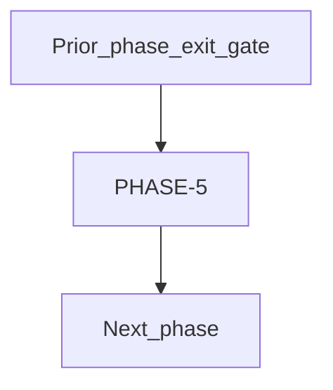

# PHASE-5 — Android Compose Markets

**Status:** draft
**Owner:** platform-orchestrator
**Last updated:** 2026-07-24
**Product:** RetroPick Markets V1

## 1. Purpose

Phase specification for **PHASE-5**: Native Android parity for approved V1 capabilities.

## 2. Scope

### In scope

- Tasks and deliverables assigned to PHASE-5 in [implementation-manifest.yaml](../agent-harness/implementation-manifest.yaml).

### Out of scope

- Work belonging to other phases unless explicitly pulled forward with ADR.

## 3. Prerequisites

- [phases/README.md](README.md)
- [agent-harness/task-graph.yaml](../agent-harness/task-graph.yaml)

## 4. Authoritative sources

| Source | URL | Retrieved | Confidence |
|--------|-----|-----------|------------|
| Polymarket docs | https://docs.polymarket.com/ | 2026-07-24 | partially verified |
| CLOB V2 migration | https://docs.polymarket.com/v2-migration | 2026-07-24 | partially verified |
| OpenAPI (repo) | `schemas/openapi/markets-v1.yaml` | 2026-07-24 | verified |
| Monorepo architecture | `docs/ARCHITECTURE.md` | 2026-07-24 | verified |

## 5. Current state

Phase status tracked in `implementation-manifest.yaml` (`current_phase` is PHASE-0 at documentation baseline).

## 6. Target design

Native Android parity for approved V1 capabilities.

## 7. Alternatives considered

| Alternative | Rejected because |
|-------------|------------------|
| Custom RetroPick exchange | ADR-001: Polymarket is venue |
| Direct Gamma/CLOB from clients in prod | ADR-002: BFF anti-corruption layer |
| Extend legacy epoch APIs | Frozen at `/api/v1/legacy/markets/*` |

## 8. Decisions

- Phase ID `PHASE-5` is locked per master prompt §15.

## 9. Data and control flows

## 10. Failure and recovery

- Phase cannot exit with unresolved blockers in [BLOCKERS_AND_HUMAN_APPROVALS.md](../agent-harness/BLOCKERS_AND_HUMAN_APPROVALS.md).

## 11. Security

- No raw private-key custody by RetroPick.
- Preview-before-sign for every asset transformation.
- Secrets outside Git; redact in logs and audit.

## 12. Observability

- Metrics, logs, and traces per [platform/OBSERVABILITY_SLOS_AND_ALERTS.md](../platform/OBSERVABILITY_SLOS_AND_ALERTS.md).
- Catalog freshness, upstream error rate, and eligibility check latency are launch-critical.

## 13. Test strategy

- Phase verification uses [VERIFICATION_EVIDENCE_TEMPLATE.md](../agent-harness/VERIFICATION_EVIDENCE_TEMPLATE.md).

## 14. Rollout and rollback

- Feature flags via `/markets/capabilities`; order-submission kill switch in later phases.
- See [platform/RELEASE_ROLLBACK_AND_CHANGE_MANAGEMENT.md](../platform/RELEASE_ROLLBACK_AND_CHANGE_MANAGEMENT.md).

## 15. Open questions

- [research/OPEN_QUESTIONS_AND_EXPIRING_ASSUMPTIONS.md](../research/OPEN_QUESTIONS_AND_EXPIRING_ASSUMPTIONS.md)

## 16. Acceptance criteria

- generated API tests pass
- Play closed-track ready

            ## Deliverables

    - Compose modules
- wallet handoff
- push notifications

    ## Exit gate

    - generated API tests pass
- Play closed-track ready

    ## Rollback

    - Revert feature flags and migrations introduced in this phase.
    - Preserve read-only catalog if trading changes are rolled back.
