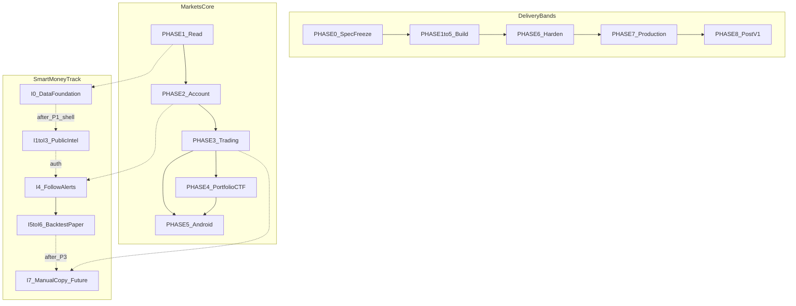

# PHASE REASSESSMENT AND PRODUCTION ROADMAP

**Status:** reviewed  
**Owner:** platform-orchestrator  
**Last updated:** 2026-08-09  
**Product:** RetroPick Markets V1  
**Wave:** Smart Money Intelligence Launch V1 + dual-track phase reposition  

## Description

Senior-engineer reaudit of the Markets V1 documentation corpus after Smart Money Intelligence Launch V1. This file is the **phase ownership and production-band authority** for how PHASE-0…8 relate to the Markets Core track and the Smart Money parallel track. It does **not** replace live `current_phase` in `implementation-manifest.yaml` (still `PHASE-1` until orchestrator advances it) and does **not** invent PHASE-9.

Use this when sequencing work, resolving “is whale PHASE-4?” debates, or explaining Spec → Build → Harden → Production → Post-V1. Prefer active [intelligence/](../intelligence/) docs; do not load [intelligence/archive/](../intelligence/archive/) by default.

## 0. Developer intent (5W+1H)

| Lens | Answer |
|------|--------|
| **Who** | Orchestrators, phase agents, reviewers who must not treat Wave-6 dump-into-PHASE-4 as current law. |
| **What** | Corpus inventory, corrected phase ownership, dual-track map, delivery bands, risks of the old model, hard do-nots. |
| **When** | Before authorizing intelligence or portfolio tasks; at PHASE-0 freeze checks; before PHASE-6/7 production claims. |
| **Where** | This file + [README.md](README.md) + per-phase specs. Spec truth for features: `../intelligence/INTELLIGENCE_LAUNCH_V1.md`. |
| **Why** | Spec is ahead of code; Smart Money relocated whale/profile/alerts/paper; PHASE-3/4/8 still mentioned archived surfaces. Wrong ownership delays PUBLIC intel or puts trading risk on the wrong critical path. |
| **How** | Keep PHASE IDs; map I* into phases; treat catalog/trading/portfolio as Core; canary intel independently at PHASE-7. Never advance the manifest from this doc alone. |

### Worked example

**Correct.** After PHASE-1 catalog shell exists, an agent implements I1 whale feed (Data `/trades`) under Smart Money flags without waiting for PHASE-4 CTF. PHASE-1 exit still requires catalog/read gates—not whale completion.

**Incorrect.** Blocking all intelligence until PHASE-4, or treating MKT-P4-003 whale task as the only whale authority after Launch docs moved ownership to SM-I-001 / `01_WHALE_TRADE_FEED.md`.

---

## 1. Corpus inventory (by category)

| Category | Authority today | Notes |
|----------|-----------------|-------|
| PRD / scope / requirements | `01`…`05`, `02` §6A updated for SM-I-* | SM-I-001…010 are Launch intel reqs |
| ADRs | `architecture/adr/` | ADR-001 venue; ADR-008 shared engine; ADR-009 no auto-copy |
| Polymarket ACL | `polymarket/*` | Data `/trades` attribution for whales |
| Intelligence **Launch** | `intelligence/README`, Launch/C4/Data/Test, `01`…`10`, `testdata/` | Default agent load |
| Intelligence **archive** | `intelligence/archive/*` | UV, relationship, OSS map, old whale/wallet/DSL/health/provenance — not Launch authority |
| Backend / web / android / security / platform / testing | Existing trees | Unchanged by this reposition except phase pointers |
| Harness | manifest `current_phase: PHASE-1`, task-graph | Task IDs may still say P4 whale — follow-up; **docs ownership** is Launch |

---

## 2. Correct vs incorrect phase ownership

| Capability | Incorrect (old) | Correct (now) |
|------------|-----------------|---------------|
| Whale Trade Feed | PHASE-4 primary | Smart Money **I1**; planning home **PHASE-1** (parallel, non-blocking exit) |
| Wallet search / profile / metrics | PHASE-4 | **I2** → PHASE-1 parallel |
| Leaderboard / Top Holders | V1.1 or PHASE-4/8 | **I3** → PHASE-1 parallel (shadow LB) |
| Follow + Basic Whale Alerts | Alert DSL / PHASE-4 mix | **I4** → **PHASE-2** (ACCOUNT) |
| Quick Backtest / Paper Copy | Often bundled late or with health | **I5–I6** after auth; may overlap P2/P3 calendar; **no CLOB submit** |
| Manual copy + sign | Implied with intel | **I7** → after **PHASE-3** trading; ADR-009 |
| Portfolio / CTF / redeem / withdraw | PHASE-4 (keep) | PHASE-4 **Core only** |
| Market health dashboard | PHASE-3 task | **Archived**; slippage concepts in `09_PAPER_COPY` |
| UV / relationship scanner | PHASE-8 near-term | **Archived research**; PHASE-8 gated only |
| Complex alert DSL | PHASE-4 / Wave 6 | **Archived**; Launch uses `08_BASIC_WHALE_ALERTS` |

---

## 3. Dual-track map

| Intelligence | Canonical home | Blocking for phase exit? |
|--------------|----------------|---------------------------|
| I0 | PHASE-1 | No — catalog/read still gates P1 exit |
| I1–I3 PUBLIC | PHASE-1 | No — optional parallel |
| I4 ACCOUNT | PHASE-2 | No — auth/funding still gates P2 |
| I5–I6 | After auth; calendar may overlap P2/P3 | Must not submit orders |
| I7 | PHASE-3+ | Future; ADR-009 |

---

## 4. Delivery bands (developing → production)

| Band | Phases | Meaning |
|------|--------|---------|
| Spec | PHASE-0 | Freeze ADRs/OpenAPI/scope; no product code |
| Build | PHASE-1…5 | Features to staging-capable quality |
| Harden | PHASE-6 | Feature freeze; security/SLO/DR/kill-switch (incl. intel flags) |
| Production | PHASE-7 | Legal/Builder/canary/Play; canary Core and Smart Money **separately** |
| Post-V1 | PHASE-8 | Flagged research after 30d SLO stability |

---

## 5. Risks if old PHASE-4 “intelligence dump” is followed

1. PUBLIC whale/profile delayed until CTF/redemption — kills growth loop before trading volume.
2. Agents implement archived UV/relationship as “PHASE-8 default.”
3. Market-health dashboard rebuilt on trading critical path.
4. Alerts wired to execute (ADR-009 violation).
5. Spec completeness misread as production-live.

---

## 6. Hard do-nots

- Do **not** invent PHASE-9.
- Do **not** advance `current_phase` from this documentation rewrite.
- Do **not** auto-copy or AI→orders (ADR-009).
- Do **not** treat `intelligence/archive/**` as implementation authority.
- Do **not** claim production success without PHASE-7 human gates + smoke evidence.
- Do **not** invent contract addresses or gambling UX copy.

---

## 7. Production path (per band)

| From | Staging criteria | Next |
|------|------------------|------|
| Build (P1–5) | Contract tests green; flags off in prod; projections reconcile | PHASE-6 |
| Harden (P6) | Restore/kill-switch drills; intel 429/stale load; P0/P1 security closed | PHASE-7 |
| Production (P7) | Legal/Builder; Core canary %; intel PUBLIC then ACCOUNT canaries; rollback proven | Stable 30d → PHASE-8 gates |

---

## 8. Follow-ups (out of this doc pass)

- Align `task-graph.yaml` whale/profile task homes with SM-I-* (orchestrator authorization required).
- Runtime I0 OpenAPI/migrations when PHASE-1 shell authorizes product work.
