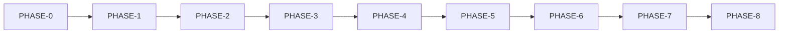

# Phases Index — RetroPick Markets V1

**Status:** reviewed
**Owner:** platform-orchestrator
**Last updated:** 2026-07-25

---

PHASE-0…PHASE-8 per master prompt §15. Each file implements §16 contract.

## Description

This index maps PHASE-0…PHASE-8 for RetroPick Markets V1: exact phase names, dependency edges, §16 contract expectations, `MKT-P0-001`…`MKT-P8-010` task ranges, parallelization rules, and human gates. Open it to navigate, then open the matching phase file — it does **not** replace live `current_phase` in `implementation-manifest.yaml` or task statuses in `task-graph.yaml`.

V1 delivery is PHASE-0–7; PHASE-8 is post-V1 under explicit gates. Parallelization reminders include schemas→clients, migrations→code, read→write, preview→sign, Android after stable web trading, and launch after hardening.

**How to use:** confirm manifest `current_phase` → find the phase in the registry → open its spec → pick one ready task in range → obey owned-path and human-gate rules. Exit-gate proof lives on the phase file + `PHASE_GATE_TEMPLATE`, not checkboxes on this README.

## 0. Developer intent (5W+1H)

This index is the map of PHASE-0…PHASE-8 for RetroPick Markets V1. Use it to navigate exact phase names, dependencies, §16 contract expectations, task ID ranges, parallelization rules, and human gates — then open the matching phase file. It does **not** replace live execution state in `implementation-harness` files.

| Dimension | Intent |
|-----------|--------|
| **Who** | Platform orchestrator sequencing work; any Markets V1 agent choosing the next authorized phase/task; reviewers checking dependency order. |
| **What** | Phase registry table, dependency flowchart, §16 contract checklist, `MKT-P0-001`…`MKT-P8-010` ranges, §17.3 parallelization rules, §18 human gates, links to requirements/tests/rollback, and the V1 boundary note (PHASE-0–7 = V1; PHASE-8 = post-V1). |
| **When** | Before starting work in a phase; when assigning task IDs; when checking whether Android may proceed (after stable web trading); when confirming launch-after-hardening ordering; at exit when ensuring the next phase’s prerequisites exist. |
| **Where** | `.dev/markets-v1/phases/` (this index + per-phase specs). Authoritative progress: `../agent-harness/implementation-manifest.yaml` (`current_phase`) and `../agent-harness/task-graph.yaml`. Do not treat this README’s **Status: reviewed** as “all phases complete.” |
| **Why** | Wrong phase order, colliding owned paths, or silent PHASE-8 features inside V1 create custody, eligibility, and scope failures that ADRs already forbid. |
| **How** | Read registry → open one phase spec → confirm manifest authorization → pick one task in range → obey parallelization and human gates → leave exit-gate proof to the phase file + `PHASE_GATE_TEMPLATE`. |

### In scope for this index

- Navigation and naming only: exact phase IDs/names, depends-on edges, task ID namespaces.
- Reminders of §16 sections every phase file must cover (business/technical outcome through handoff).
- Parallelization constraints (schemas→clients, migrations→code, read→write, preview→sign, Android after stable web trading, launch after hardening).
- Human gates list (production wallet, Builder fees, relayer prod creds, real on-chain tx, custom contract deploy, new jurisdiction, embedded key recovery, destructive migration, secret rotation, Play production, remove rollback, accept critical risk).

### Out of scope for this index

- Declaring which phase is currently executing or inventing exit-gate approvals.
- Rewriting per-phase acceptance criteria, commands, or owned paths (those live in phase files + task-graph).
- Approving §18 gates; clearing blockers; merging/deploying.

### What “done” means when using this doc

An agent is “done” with this index when they can: name the correct next phase after a prior exit gate; cite the right `MKT-P*-*` range; open the phase markdown; and confirm manifest `current_phase` before editing product code. Completing a phase still requires that phase’s Definition of done + gate approval — not a checkbox on this README.

### How (procedure)

1. Open `implementation-manifest.yaml` and note `current_phase` (do not invent it).
2. Find that phase in the registry; open its spec; skim In/Out of scope and exit gate.
3. Select exactly one task from `task-graph.yaml` in `planned`/`ready` within the phase range.
4. Obey §17.3: one owner per writable path; no cross-phase “while you’re here” edits.
5. At phase end, use the phase exit task + `PHASE_GATE_TEMPLATE`; only orchestrator advances `current_phase`.

### Worked example

An agent is asked to “add wallet connect.” This index shows wallet work is PHASE-2 (`MKT-P2-001…010`) depending on PHASE-1. They check the manifest: if `current_phase` is still `PHASE-1`, they refuse wallet implementation, point at PHASE-1 read-markets tasks instead, and do not invent a PHASE-2 authorization. If later authorized for PHASE-2, they open `PHASE-2-ACCOUNT-WALLET-AND-FUNDING.md` and take a single ready `MKT-P2-*` task.

## Phase registry

| Phase ID | Exact name | Spec | Depends | Exit gate |
|---|---|---|---|---|
| PHASE-0 | Discovery and Spec Freeze | [PHASE-0-DISCOVERY-AND-SPEC-FREEZE.md](PHASE-0-DISCOVERY-AND-SPEC-FREEZE.md) | — | See spec |
| PHASE-1 | Foundation and Read Markets | [PHASE-1-FOUNDATION-AND-READ-MARKETS.md](PHASE-1-FOUNDATION-AND-READ-MARKETS.md) | PHASE-0 | See spec |
| PHASE-2 | Account Wallet and Funding | [PHASE-2-ACCOUNT-WALLET-AND-FUNDING.md](PHASE-2-ACCOUNT-WALLET-AND-FUNDING.md) | PHASE-1 | See spec |
| PHASE-3 | Web Trading Core | [PHASE-3-WEB-TRADING-CORE.md](PHASE-3-WEB-TRADING-CORE.md) | PHASE-2 | See spec |
| PHASE-4 | Portfolio, Redemption, and Withdrawal | [PHASE-4-PORTFOLIO-REDEMPTION-AND-WITHDRAWAL.md](PHASE-4-PORTFOLIO-REDEMPTION-AND-WITHDRAWAL.md) | PHASE-3 | See spec |
| PHASE-5 | Android Compose Markets | [PHASE-5-ANDROID-COMPOSE-MARKETS.md](PHASE-5-ANDROID-COMPOSE-MARKETS.md) | PHASE-3,4 | See spec |
| PHASE-6 | Hardening, CI/CD, and SRE | [PHASE-6-HARDENING-CI-CD-AND-SRE.md](PHASE-6-HARDENING-CI-CD-AND-SRE.md) | PHASE-4,5 | See spec |
| PHASE-7 | Production Launch | [PHASE-7-PRODUCTION-LAUNCH.md](PHASE-7-PRODUCTION-LAUNCH.md) | PHASE-6 | See spec |
| PHASE-8 | Post-V1 Advanced Capabilities | [PHASE-8-POST-V1-ADVANCED-CAPABILITIES.md](PHASE-8-POST-V1-ADVANCED-CAPABILITIES.md) | PHASE-7 | See spec |

## §16 contract checklist

- Phase ID and exact name
- Business outcome
- Technical outcome
- Prerequisites
- Dependencies
- In scope
- Out of scope
- Repository areas affected
- New modules/files expected
- Data migrations
- API/schema changes
- External integrations
- On-chain interactions
- Security controls
- Observability
- Test plan
- CI/CD changes
- Deployment sequence
- Rollback sequence
- Risks and mitigations
- Human approvals
- Task breakdown
- Parallelization constraints
- Definition of ready
- Acceptance criteria
- Verification evidence
- Definition of done
- Handoff to next phase

## Task ID ranges

| Phase | Range |
|---|---|
| PHASE-0 | MKT-P0-001…MKT-P0-010 |
| PHASE-1 | MKT-P1-001…MKT-P1-010 |
| PHASE-2 | MKT-P2-001…MKT-P2-010 |
| PHASE-3 | MKT-P3-001…MKT-P3-010 |
| PHASE-4 | MKT-P4-001…MKT-P4-010 |
| PHASE-5 | MKT-P5-001…MKT-P5-010 |
| PHASE-6 | MKT-P6-001…MKT-P6-010 |
| PHASE-7 | MKT-P7-001…MKT-P7-010 |
| PHASE-8 | MKT-P8-001…MKT-P8-010 |

## Parallelization (§17.3)

1. One owner per writable path
1. Schemas before clients
1. Migrations before dependent code
1. Backend before clients
1. Read before transactions
1. Preview before sign
1. Reconcile before prod orders
1. Android after stable web trading
1. Launch after hardening

## Human gates (§18)

- Production wallet
- Builder fees
- Relayer prod creds
- Real on-chain tx
- Custom contract deploy
- New jurisdiction
- Embedded key recovery
- Destructive migration
- Secret rotation
- Play production
- Remove rollback
- Accept critical risk

## Related docs

- [Doc map](../00_DOCUMENT_MAP.md)
- [Tasks](../agent-harness/task-graph.yaml)
- [Requirements](../04_REQUIREMENTS_AND_TRACEABILITY.md)
- [Tests](../testing/MASTER_TEST_PLAN.md)
- [Rollback](../platform/RELEASE_ROLLBACK_AND_CHANGE_MANAGEMENT.md)

## V1 boundary

PHASE-0–7 = V1. PHASE-8 = post-V1; no silent scope creep.

## Appendix 0 — program governance

Track current_phase in implementation-manifest.yaml.

## Appendix 1 — program governance

Track current_phase in implementation-manifest.yaml.

## Appendix 2 — program governance

Track current_phase in implementation-manifest.yaml.

## Appendix 3 — program governance

Track current_phase in implementation-manifest.yaml.

## Appendix 4 — program governance

Track current_phase in implementation-manifest.yaml.

## Appendix 5 — program governance

Track current_phase in implementation-manifest.yaml.

## Appendix 6 — program governance

Track current_phase in implementation-manifest.yaml.

## Appendix 7 — program governance

Track current_phase in implementation-manifest.yaml.

## Appendix 8 — program governance

Track current_phase in implementation-manifest.yaml.

## Appendix 9 — program governance

Track current_phase in implementation-manifest.yaml.

## Appendix 10 — program governance

Track current_phase in implementation-manifest.yaml.

## Appendix 11 — program governance

Track current_phase in implementation-manifest.yaml.

## Appendix 12 — program governance

Track current_phase in implementation-manifest.yaml.

## Appendix 13 — program governance

Track current_phase in implementation-manifest.yaml.

## Appendix 14 — program governance

Track current_phase in implementation-manifest.yaml.

## Appendix 15 — program governance

Track current_phase in implementation-manifest.yaml.

## Appendix 16 — program governance

Track current_phase in implementation-manifest.yaml.

## Appendix 17 — program governance

Track current_phase in implementation-manifest.yaml.

## Appendix 18 — program governance

Track current_phase in implementation-manifest.yaml.

## Appendix 19 — program governance

Track current_phase in implementation-manifest.yaml.

## Appendix 20 — program governance

Track current_phase in implementation-manifest.yaml.

## Appendix 21 — program governance

Track current_phase in implementation-manifest.yaml.

## Appendix 22 — program governance

Track current_phase in implementation-manifest.yaml.

## Appendix 23 — program governance

Track current_phase in implementation-manifest.yaml.

## Appendix 24 — program governance

Track current_phase in implementation-manifest.yaml.

## Appendix 25 — program governance

Track current_phase in implementation-manifest.yaml.

## Appendix 26 — program governance

Track current_phase in implementation-manifest.yaml.

## Appendix 27 — program governance

Track current_phase in implementation-manifest.yaml.

## Appendix 28 — program governance

Track current_phase in implementation-manifest.yaml.

## Appendix 29 — program governance

Track current_phase in implementation-manifest.yaml.

## Appendix 30 — program governance

Track current_phase in implementation-manifest.yaml.

## Appendix 31 — program governance

Track current_phase in implementation-manifest.yaml.

## Appendix 32 — program governance

Track current_phase in implementation-manifest.yaml.

## Appendix 33 — program governance

Track current_phase in implementation-manifest.yaml.

## Appendix 34 — program governance

Track current_phase in implementation-manifest.yaml.

## Appendix 35 — program governance

Track current_phase in implementation-manifest.yaml.

## Appendix 36 — program governance

Track current_phase in implementation-manifest.yaml.

## Appendix 37 — program governance

Track current_phase in implementation-manifest.yaml.

## Appendix 38 — program governance

Track current_phase in implementation-manifest.yaml.

## Appendix 39 — program governance

Track current_phase in implementation-manifest.yaml.

## Appendix 40 — program governance

Track current_phase in implementation-manifest.yaml.

## Appendix 41 — program governance

Track current_phase in implementation-manifest.yaml.

## Appendix 42 — program governance

Track current_phase in implementation-manifest.yaml.

## Appendix 43 — program governance

Track current_phase in implementation-manifest.yaml.

## Appendix 44 — program governance

Track current_phase in implementation-manifest.yaml.

## Appendix 45 — program governance

Track current_phase in implementation-manifest.yaml.

## Appendix 46 — program governance

Track current_phase in implementation-manifest.yaml.

## Appendix 47 — program governance

Track current_phase in implementation-manifest.yaml.

## Appendix 48 — program governance

Track current_phase in implementation-manifest.yaml.

## Appendix 49 — program governance

Track current_phase in implementation-manifest.yaml.

## Appendix 50 — program governance

Track current_phase in implementation-manifest.yaml.

## Appendix 51 — program governance

Track current_phase in implementation-manifest.yaml.

## Appendix 52 — program governance

Track current_phase in implementation-manifest.yaml.

## Appendix 53 — program governance

Track current_phase in implementation-manifest.yaml.

## Appendix 54 — program governance

Track current_phase in implementation-manifest.yaml.

## Appendix 55 — program governance

Track current_phase in implementation-manifest.yaml.

## Appendix 56 — program governance

Track current_phase in implementation-manifest.yaml.

## Appendix 57 — program governance

Track current_phase in implementation-manifest.yaml.

## Appendix 58 — program governance

Track current_phase in implementation-manifest.yaml.

## Appendix 59 — program governance

Track current_phase in implementation-manifest.yaml.

## Appendix 60 — program governance

Track current_phase in implementation-manifest.yaml.

## Appendix 61 — program governance

Track current_phase in implementation-manifest.yaml.

## Appendix 62 — program governance

Track current_phase in implementation-manifest.yaml.
