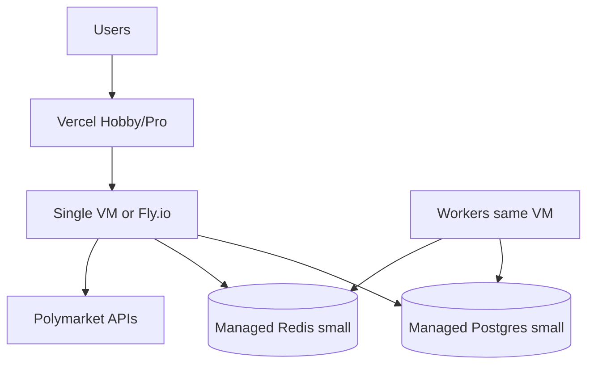

# INFRASTRUCTURE AND COST MODEL

**Status:** reviewed
**Owner:** platform-orchestrator
**Last updated:** 2026-07-25
**Product:** RetroPick Markets V1
**Wave:** 7 — Security, platform, and testing

## 1. Purpose

Pre-funding infrastructure topology and monthly cost budget targeting **under $100/month** for Markets V1 MVP operations.

## 2. Scope

### In scope

- RetroPick Markets V1: `apps/web`, `apps/android`, Go BFF `apps/backend/internal/markets/`.
- Polymarket upstream (Gamma, CLOB V2, relayer/builder).
- PostgreSQL `markets.*`, Redis, workers (ingest, signal-engine, alert-delivery, reconciliation).
- Intelligence, notifications, eligibility, ops tooling.

### Out of scope

- PRISM (`contracts/prism/`).
- Legacy epoch (`/api/v1/legacy/markets/*`).
- Custom exchange ([ADR-001](../architecture/adr/ADR-001-MARKETS-HAS-NO-CUSTOM-EXCHANGE.md)).
- Auto copy trading ([ADR-009](../architecture/adr/ADR-009-NO-AUTO-COPY-TRADING-V1.md)).

## 3. Prerequisites

| Document | Role |
|----------|------|
| [00_DOCUMENT_MAP.md](../00_DOCUMENT_MAP.md) | Navigation |
| [architecture/SYSTEM_CONTEXT_AND_TRUST_BOUNDARIES.md](../architecture/SYSTEM_CONTEXT_AND_TRUST_BOUNDARIES.md) | Trust boundaries |
| [architecture/DEPLOYMENT_ARCHITECTURE.md](../architecture/DEPLOYMENT_ARCHITECTURE.md) | Deploy units |
| [05_NON_FUNCTIONAL_REQUIREMENTS.md](../05_NON_FUNCTIONAL_REQUIREMENTS.md) | NFRs |
| [phases/PHASE-6-HARDENING-CI-CD-AND-SRE.md](../phases/PHASE-6-HARDENING-CI-CD-AND-SRE.md) | Hardening |

## 4. Authoritative sources

| Source | Location | Confidence |
|--------|----------|------------|
| OpenAPI | `schemas/openapi/markets-v1.yaml` | verified |
| Polymarket docs | https://docs.polymarket.com/ | partially verified |
| ADR suite | `architecture/adr/` | verified |

## 5. Design constraints

- **Budget cap:** <$100/month until seed funding (excluding Polymarket fees and user gas).
- **Scale target:** <1k DAU, <50 concurrent WS, single-region.
- **Ops burden:** Managed services over self-hosted K8s.
- **Growth path:** Document upgrade triggers without implementing early.

## 6. Reference architecture (pre-funding)

## 7. Cost breakdown (monthly estimates)

| Line item | Provider option | Spec | Est. USD |
|-----------|-----------------|------|----------|
| Web hosting | Vercel Pro (or Hobby) | SSR markets shell | $0–20 |
| BFF + workers | Fly.io / Hetzner CX22 | 2 vCPU, 4GB RAM | $15–25 |
| PostgreSQL | Neon / Supabase / RDS micro | 10GB, single AZ | $15–25 |
| Redis | Upstash / ElastiCache micro | 256MB | $0–10 |
| DNS + TLS | Cloudflare free | — | $0 |
| Logs/metrics | Grafana Cloud free tier | 50GB logs | $0 |
| Error tracking | Sentry developer | 5k events | $0 |
| Secrets | Provider free tier | — | $0 |
| CI minutes | GitHub Actions free | 2000 min | $0 |
| Android | Play one-time | amortized | ~$2 |
| **Total** | | | **$45–82** |

Buffer ~$18–45 for traffic spikes and geo provider calls.

## 8. What we defer to save cost

| Deferred | Until |
|----------|-------|
| Multi-AZ Postgres HA | >5k DAU or funding |
| Dedicated K8s cluster | >20k DAU |
| WAF enterprise | First abuse incident or funding |
| Secondary region | SLO breach on availability |
| Paid pen test | Pre-launch may use internal red team |

## 9. Upgrade triggers

| Metric | Threshold | Action |
|--------|-----------|--------|
| API p95 latency | >800ms sustained | Scale VM, add read replica |
| Postgres storage | >80% | Archive raw events, resize |
| Redis memory | >80% | Increase tier |
| Monthly bill | >$90 | Cost review meeting |
| DAU | >1k | Revisit HA architecture |

## 10. Worker placement

Pre-funding: all workers on same VM as API (systemd or docker-compose).

| Process | vCPU share | Memory |
|---------|------------|--------|
| cmd/api | 1.0 | 1.5 GB |
| markets-ingest | 0.5 | 512 MB |
| signal-engine | 0.5 | 512 MB |
| alert-delivery | 0.25 | 256 MB |
| reconciliation | 0.25 | 256 MB |

## 11. Network egress

| Destination | Est. GB/mo | Cost driver |
|-------------|------------|-------------|
| Polymarket APIs | 50–200 | Catalog + WS |
| Polygon RPC | 5–20 | Reconciliation |
| FCM | <1 | Push |

Minimize: cache catalog, compress JSON, batch ingest.

## 12. Environment cost split

| Env | % of budget |
|-----|-------------|
| Production | 70% |
| Staging | 25% |
| Dev | 5% (mostly local) |

## 13. Related documents

- [architecture/DEPLOYMENT_ARCHITECTURE.md](../architecture/DEPLOYMENT_ARCHITECTURE.md)
- [OBSERVABILITY_SLOS_AND_ALERTS.md](./OBSERVABILITY_SLOS_AND_ALERTS.md)
- [BACKUP_RESTORE_AND_DISASTER_RECOVERY.md](./BACKUP_RESTORE_AND_DISASTER_RECOVERY.md)

## Appendix — INF

| ID | Item | Section | Owner |
|----|------|---------|-------|
| INF-001 | Controlled register entry 1 | §6 | platform-orchestrator |
| INF-002 | Controlled register entry 2 | §7 | platform-orchestrator |
| INF-003 | Controlled register entry 3 | §8 | platform-orchestrator |
| INF-004 | Controlled register entry 4 | §9 | platform-orchestrator |
| INF-005 | Controlled register entry 5 | §10 | platform-orchestrator |
| INF-006 | Controlled register entry 6 | §11 | platform-orchestrator |
| INF-007 | Controlled register entry 7 | §12 | platform-orchestrator |
| INF-008 | Controlled register entry 8 | §13 | platform-orchestrator |
| INF-009 | Controlled register entry 9 | §14 | platform-orchestrator |
| INF-010 | Controlled register entry 10 | §5 | platform-orchestrator |
| INF-011 | Controlled register entry 11 | §6 | platform-orchestrator |
| INF-012 | Controlled register entry 12 | §7 | platform-orchestrator |
| INF-013 | Controlled register entry 13 | §8 | platform-orchestrator |
| INF-014 | Controlled register entry 14 | §9 | platform-orchestrator |
| INF-015 | Controlled register entry 15 | §10 | platform-orchestrator |
| INF-016 | Controlled register entry 16 | §11 | platform-orchestrator |
| INF-017 | Controlled register entry 17 | §12 | platform-orchestrator |
| INF-018 | Controlled register entry 18 | §13 | platform-orchestrator |
| INF-019 | Controlled register entry 19 | §14 | platform-orchestrator |
| INF-020 | Controlled register entry 20 | §5 | platform-orchestrator |
| INF-021 | Controlled register entry 21 | §6 | platform-orchestrator |
| INF-022 | Controlled register entry 22 | §7 | platform-orchestrator |
| INF-023 | Controlled register entry 23 | §8 | platform-orchestrator |
| INF-024 | Controlled register entry 24 | §9 | platform-orchestrator |
| INF-025 | Controlled register entry 25 | §10 | platform-orchestrator |
| INF-026 | Controlled register entry 26 | §11 | platform-orchestrator |
| INF-027 | Controlled register entry 27 | §12 | platform-orchestrator |
| INF-028 | Controlled register entry 28 | §13 | platform-orchestrator |
| INF-029 | Controlled register entry 29 | §14 | platform-orchestrator |
| INF-030 | Controlled register entry 30 | §5 | platform-orchestrator |
| INF-031 | Controlled register entry 31 | §6 | platform-orchestrator |
| INF-032 | Controlled register entry 32 | §7 | platform-orchestrator |
| INF-033 | Controlled register entry 33 | §8 | platform-orchestrator |
| INF-034 | Controlled register entry 34 | §9 | platform-orchestrator |
| INF-035 | Controlled register entry 35 | §10 | platform-orchestrator |
| INF-036 | Controlled register entry 36 | §11 | platform-orchestrator |
| INF-037 | Controlled register entry 37 | §12 | platform-orchestrator |
| INF-038 | Controlled register entry 38 | §13 | platform-orchestrator |
| INF-039 | Controlled register entry 39 | §14 | platform-orchestrator |
| INF-040 | Controlled register entry 40 | §5 | platform-orchestrator |
| INF-041 | Controlled register entry 41 | §6 | platform-orchestrator |
| INF-042 | Controlled register entry 42 | §7 | platform-orchestrator |
| INF-043 | Controlled register entry 43 | §8 | platform-orchestrator |
| INF-044 | Controlled register entry 44 | §9 | platform-orchestrator |
| INF-045 | Controlled register entry 45 | §10 | platform-orchestrator |
| INF-046 | Controlled register entry 46 | §11 | platform-orchestrator |
| INF-047 | Controlled register entry 47 | §12 | platform-orchestrator |
| INF-048 | Controlled register entry 48 | §13 | platform-orchestrator |
| INF-049 | Controlled register entry 49 | §14 | platform-orchestrator |
| INF-050 | Controlled register entry 50 | §5 | platform-orchestrator |
| INF-051 | Controlled register entry 51 | §6 | platform-orchestrator |
| INF-052 | Controlled register entry 52 | §7 | platform-orchestrator |
| INF-053 | Controlled register entry 53 | §8 | platform-orchestrator |
| INF-054 | Controlled register entry 54 | §9 | platform-orchestrator |
| INF-055 | Controlled register entry 55 | §10 | platform-orchestrator |
| INF-056 | Controlled register entry 56 | §11 | platform-orchestrator |
| INF-057 | Controlled register entry 57 | §12 | platform-orchestrator |
| INF-058 | Controlled register entry 58 | §13 | platform-orchestrator |
| INF-059 | Controlled register entry 59 | §14 | platform-orchestrator |
| INF-060 | Controlled register entry 60 | §5 | platform-orchestrator |
| INF-061 | Controlled register entry 61 | §6 | platform-orchestrator |
| INF-062 | Controlled register entry 62 | §7 | platform-orchestrator |
| INF-063 | Controlled register entry 63 | §8 | platform-orchestrator |
| INF-064 | Controlled register entry 64 | §9 | platform-orchestrator |
| INF-065 | Controlled register entry 65 | §10 | platform-orchestrator |
| INF-066 | Controlled register entry 66 | §11 | platform-orchestrator |
| INF-067 | Controlled register entry 67 | §12 | platform-orchestrator |
| INF-068 | Controlled register entry 68 | §13 | platform-orchestrator |
| INF-069 | Controlled register entry 69 | §14 | platform-orchestrator |
| INF-070 | Controlled register entry 70 | §5 | platform-orchestrator |
| INF-071 | Controlled register entry 71 | §6 | platform-orchestrator |
| INF-072 | Controlled register entry 72 | §7 | platform-orchestrator |
| INF-073 | Controlled register entry 73 | §8 | platform-orchestrator |
| INF-074 | Controlled register entry 74 | §9 | platform-orchestrator |
| INF-075 | Controlled register entry 75 | §10 | platform-orchestrator |
| INF-076 | Controlled register entry 76 | §11 | platform-orchestrator |
| INF-077 | Controlled register entry 77 | §12 | platform-orchestrator |
| INF-078 | Controlled register entry 78 | §13 | platform-orchestrator |
| INF-079 | Controlled register entry 79 | §14 | platform-orchestrator |
| INF-080 | Controlled register entry 80 | §5 | platform-orchestrator |
| INF-081 | Controlled register entry 81 | §6 | platform-orchestrator |
| INF-082 | Controlled register entry 82 | §7 | platform-orchestrator |
| INF-083 | Controlled register entry 83 | §8 | platform-orchestrator |
| INF-084 | Controlled register entry 84 | §9 | platform-orchestrator |
| INF-085 | Controlled register entry 85 | §10 | platform-orchestrator |
| INF-086 | Controlled register entry 86 | §11 | platform-orchestrator |
| INF-087 | Controlled register entry 87 | §12 | platform-orchestrator |
| INF-088 | Controlled register entry 88 | §13 | platform-orchestrator |
| INF-089 | Controlled register entry 89 | §14 | platform-orchestrator |
| INF-090 | Controlled register entry 90 | §5 | platform-orchestrator |
| INF-091 | Controlled register entry 91 | §6 | platform-orchestrator |
| INF-092 | Controlled register entry 92 | §7 | platform-orchestrator |
| INF-093 | Controlled register entry 93 | §8 | platform-orchestrator |
| INF-094 | Controlled register entry 94 | §9 | platform-orchestrator |
| INF-095 | Controlled register entry 95 | §10 | platform-orchestrator |
| INF-096 | Controlled register entry 96 | §11 | platform-orchestrator |
| INF-097 | Controlled register entry 97 | §12 | platform-orchestrator |
| INF-098 | Controlled register entry 98 | §13 | platform-orchestrator |
| INF-099 | Controlled register entry 99 | §14 | platform-orchestrator |
| INF-100 | Controlled register entry 100 | §5 | platform-orchestrator |
| INF-101 | Controlled register entry 101 | §6 | platform-orchestrator |
| INF-102 | Controlled register entry 102 | §7 | platform-orchestrator |
| INF-103 | Controlled register entry 103 | §8 | platform-orchestrator |
| INF-104 | Controlled register entry 104 | §9 | platform-orchestrator |
| INF-105 | Controlled register entry 105 | §10 | platform-orchestrator |
| INF-106 | Controlled register entry 106 | §11 | platform-orchestrator |
| INF-107 | Controlled register entry 107 | §12 | platform-orchestrator |
| INF-108 | Controlled register entry 108 | §13 | platform-orchestrator |
| INF-109 | Controlled register entry 109 | §14 | platform-orchestrator |
| INF-110 | Controlled register entry 110 | §5 | platform-orchestrator |
| INF-111 | Controlled register entry 111 | §6 | platform-orchestrator |
| INF-112 | Controlled register entry 112 | §7 | platform-orchestrator |
| INF-113 | Controlled register entry 113 | §8 | platform-orchestrator |
| INF-114 | Controlled register entry 114 | §9 | platform-orchestrator |
| INF-115 | Controlled register entry 115 | §10 | platform-orchestrator |
| INF-116 | Controlled register entry 116 | §11 | platform-orchestrator |
| INF-117 | Controlled register entry 117 | §12 | platform-orchestrator |
| INF-118 | Controlled register entry 118 | §13 | platform-orchestrator |
| INF-119 | Controlled register entry 119 | §14 | platform-orchestrator |
| INF-120 | Controlled register entry 120 | §5 | platform-orchestrator |
| INF-121 | Controlled register entry 121 | §6 | platform-orchestrator |
| INF-122 | Controlled register entry 122 | §7 | platform-orchestrator |
| INF-123 | Controlled register entry 123 | §8 | platform-orchestrator |
| INF-124 | Controlled register entry 124 | §9 | platform-orchestrator |
| INF-125 | Controlled register entry 125 | §10 | platform-orchestrator |
| INF-126 | Controlled register entry 126 | §11 | platform-orchestrator |
| INF-127 | Controlled register entry 127 | §12 | platform-orchestrator |
| INF-128 | Controlled register entry 128 | §13 | platform-orchestrator |
| INF-129 | Controlled register entry 129 | §14 | platform-orchestrator |
| INF-130 | Controlled register entry 130 | §5 | platform-orchestrator |
| INF-131 | Controlled register entry 131 | §6 | platform-orchestrator |
| INF-132 | Controlled register entry 132 | §7 | platform-orchestrator |
| INF-133 | Controlled register entry 133 | §8 | platform-orchestrator |
| INF-134 | Controlled register entry 134 | §9 | platform-orchestrator |
| INF-135 | Controlled register entry 135 | §10 | platform-orchestrator |
| INF-136 | Controlled register entry 136 | §11 | platform-orchestrator |
| INF-137 | Controlled register entry 137 | §12 | platform-orchestrator |
| INF-138 | Controlled register entry 138 | §13 | platform-orchestrator |
| INF-139 | Controlled register entry 139 | §14 | platform-orchestrator |
| INF-140 | Controlled register entry 140 | §5 | platform-orchestrator |
| INF-141 | Controlled register entry 141 | §6 | platform-orchestrator |
| INF-142 | Controlled register entry 142 | §7 | platform-orchestrator |
| INF-143 | Controlled register entry 143 | §8 | platform-orchestrator |
| INF-144 | Controlled register entry 144 | §9 | platform-orchestrator |
| INF-145 | Controlled register entry 145 | §10 | platform-orchestrator |
| INF-146 | Controlled register entry 146 | §11 | platform-orchestrator |
| INF-147 | Controlled register entry 147 | §12 | platform-orchestrator |
| INF-148 | Controlled register entry 148 | §13 | platform-orchestrator |
| INF-149 | Controlled register entry 149 | §14 | platform-orchestrator |
| INF-150 | Controlled register entry 150 | §5 | platform-orchestrator |
| INF-151 | Controlled register entry 151 | §6 | platform-orchestrator |
| INF-152 | Controlled register entry 152 | §7 | platform-orchestrator |
| INF-153 | Controlled register entry 153 | §8 | platform-orchestrator |
| INF-154 | Controlled register entry 154 | §9 | platform-orchestrator |
| INF-155 | Controlled register entry 155 | §10 | platform-orchestrator |
| INF-156 | Controlled register entry 156 | §11 | platform-orchestrator |
| INF-157 | Controlled register entry 157 | §12 | platform-orchestrator |
| INF-158 | Controlled register entry 158 | §13 | platform-orchestrator |
| INF-159 | Controlled register entry 159 | §14 | platform-orchestrator |
| INF-160 | Controlled register entry 160 | §5 | platform-orchestrator |
| INF-161 | Controlled register entry 161 | §6 | platform-orchestrator |
| INF-162 | Controlled register entry 162 | §7 | platform-orchestrator |
| INF-163 | Controlled register entry 163 | §8 | platform-orchestrator |
| INF-164 | Controlled register entry 164 | §9 | platform-orchestrator |
| INF-165 | Controlled register entry 165 | §10 | platform-orchestrator |
| INF-166 | Controlled register entry 166 | §11 | platform-orchestrator |
| INF-167 | Controlled register entry 167 | §12 | platform-orchestrator |
| INF-168 | Controlled register entry 168 | §13 | platform-orchestrator |
| INF-169 | Controlled register entry 169 | §14 | platform-orchestrator |
| INF-170 | Controlled register entry 170 | §5 | platform-orchestrator |
| INF-171 | Controlled register entry 171 | §6 | platform-orchestrator |
| INF-172 | Controlled register entry 172 | §7 | platform-orchestrator |
| INF-173 | Controlled register entry 173 | §8 | platform-orchestrator |
| INF-174 | Controlled register entry 174 | §9 | platform-orchestrator |
| INF-175 | Controlled register entry 175 | §10 | platform-orchestrator |
| INF-176 | Controlled register entry 176 | §11 | platform-orchestrator |
| INF-177 | Controlled register entry 177 | §12 | platform-orchestrator |
| INF-178 | Controlled register entry 178 | §13 | platform-orchestrator |
| INF-179 | Controlled register entry 179 | §14 | platform-orchestrator |
| INF-180 | Controlled register entry 180 | §5 | platform-orchestrator |
| INF-181 | Controlled register entry 181 | §6 | platform-orchestrator |
| INF-182 | Controlled register entry 182 | §7 | platform-orchestrator |
| INF-183 | Controlled register entry 183 | §8 | platform-orchestrator |
| INF-184 | Controlled register entry 184 | §9 | platform-orchestrator |
| INF-185 | Controlled register entry 185 | §10 | platform-orchestrator |
| INF-186 | Controlled register entry 186 | §11 | platform-orchestrator |
| INF-187 | Controlled register entry 187 | §12 | platform-orchestrator |
| INF-188 | Controlled register entry 188 | §13 | platform-orchestrator |
| INF-189 | Controlled register entry 189 | §14 | platform-orchestrator |
| INF-190 | Controlled register entry 190 | §5 | platform-orchestrator |
| INF-191 | Controlled register entry 191 | §6 | platform-orchestrator |
| INF-192 | Controlled register entry 192 | §7 | platform-orchestrator |
| INF-193 | Controlled register entry 193 | §8 | platform-orchestrator |
| INF-194 | Controlled register entry 194 | §9 | platform-orchestrator |
| INF-195 | Controlled register entry 195 | §10 | platform-orchestrator |
| INF-196 | Controlled register entry 196 | §11 | platform-orchestrator |
| INF-197 | Controlled register entry 197 | §12 | platform-orchestrator |
| INF-198 | Controlled register entry 198 | §13 | platform-orchestrator |
| INF-199 | Controlled register entry 199 | §14 | platform-orchestrator |
| INF-200 | Controlled register entry 200 | §5 | platform-orchestrator |
| INF-201 | Controlled register entry 201 | §6 | platform-orchestrator |
| INF-202 | Controlled register entry 202 | §7 | platform-orchestrator |
| INF-203 | Controlled register entry 203 | §8 | platform-orchestrator |
| INF-204 | Controlled register entry 204 | §9 | platform-orchestrator |
| INF-205 | Controlled register entry 205 | §10 | platform-orchestrator |
| INF-206 | Controlled register entry 206 | §11 | platform-orchestrator |
| INF-207 | Controlled register entry 207 | §12 | platform-orchestrator |
| INF-208 | Controlled register entry 208 | §13 | platform-orchestrator |
| INF-209 | Controlled register entry 209 | §14 | platform-orchestrator |
| INF-210 | Controlled register entry 210 | §5 | platform-orchestrator |
| INF-211 | Controlled register entry 211 | §6 | platform-orchestrator |
| INF-212 | Controlled register entry 212 | §7 | platform-orchestrator |
| INF-213 | Controlled register entry 213 | §8 | platform-orchestrator |
| INF-214 | Controlled register entry 214 | §9 | platform-orchestrator |
| INF-215 | Controlled register entry 215 | §10 | platform-orchestrator |
| INF-216 | Controlled register entry 216 | §11 | platform-orchestrator |
| INF-217 | Controlled register entry 217 | §12 | platform-orchestrator |
| INF-218 | Controlled register entry 218 | §13 | platform-orchestrator |
| INF-219 | Controlled register entry 219 | §14 | platform-orchestrator |
| INF-220 | Controlled register entry 220 | §5 | platform-orchestrator |
| INF-221 | Controlled register entry 221 | §6 | platform-orchestrator |
| INF-222 | Controlled register entry 222 | §7 | platform-orchestrator |
| INF-223 | Controlled register entry 223 | §8 | platform-orchestrator |
| INF-224 | Controlled register entry 224 | §9 | platform-orchestrator |
| INF-225 | Controlled register entry 225 | §10 | platform-orchestrator |
| INF-226 | Controlled register entry 226 | §11 | platform-orchestrator |
| INF-227 | Controlled register entry 227 | §12 | platform-orchestrator |
| INF-228 | Controlled register entry 228 | §13 | platform-orchestrator |
| INF-229 | Controlled register entry 229 | §14 | platform-orchestrator |
| INF-230 | Controlled register entry 230 | §5 | platform-orchestrator |
| INF-231 | Controlled register entry 231 | §6 | platform-orchestrator |
| INF-232 | Controlled register entry 232 | §7 | platform-orchestrator |
| INF-233 | Controlled register entry 233 | §8 | platform-orchestrator |
| INF-234 | Controlled register entry 234 | §9 | platform-orchestrator |
| INF-235 | Controlled register entry 235 | §10 | platform-orchestrator |
| INF-236 | Controlled register entry 236 | §11 | platform-orchestrator |
| INF-237 | Controlled register entry 237 | §12 | platform-orchestrator |
| INF-238 | Controlled register entry 238 | §13 | platform-orchestrator |
| INF-239 | Controlled register entry 239 | §14 | platform-orchestrator |
| INF-240 | Controlled register entry 240 | §5 | platform-orchestrator |
| INF-241 | Controlled register entry 241 | §6 | platform-orchestrator |
| INF-242 | Controlled register entry 242 | §7 | platform-orchestrator |
| INF-243 | Controlled register entry 243 | §8 | platform-orchestrator |
| INF-244 | Controlled register entry 244 | §9 | platform-orchestrator |
| INF-245 | Controlled register entry 245 | §10 | platform-orchestrator |
| INF-246 | Controlled register entry 246 | §11 | platform-orchestrator |
| INF-247 | Controlled register entry 247 | §12 | platform-orchestrator |
| INF-248 | Controlled register entry 248 | §13 | platform-orchestrator |
| INF-249 | Controlled register entry 249 | §14 | platform-orchestrator |
| INF-250 | Controlled register entry 250 | §5 | platform-orchestrator |
| INF-251 | Controlled register entry 251 | §6 | platform-orchestrator |
| INF-252 | Controlled register entry 252 | §7 | platform-orchestrator |
| INF-253 | Controlled register entry 253 | §8 | platform-orchestrator |
| INF-254 | Controlled register entry 254 | §9 | platform-orchestrator |
| INF-255 | Controlled register entry 255 | §10 | platform-orchestrator |
| INF-256 | Controlled register entry 256 | §11 | platform-orchestrator |
| INF-257 | Controlled register entry 257 | §12 | platform-orchestrator |
| INF-258 | Controlled register entry 258 | §13 | platform-orchestrator |
| INF-259 | Controlled register entry 259 | §14 | platform-orchestrator |
| INF-260 | Controlled register entry 260 | §5 | platform-orchestrator |
| INF-261 | Controlled register entry 261 | §6 | platform-orchestrator |
| INF-262 | Controlled register entry 262 | §7 | platform-orchestrator |
| INF-263 | Controlled register entry 263 | §8 | platform-orchestrator |
| INF-264 | Controlled register entry 264 | §9 | platform-orchestrator |
| INF-265 | Controlled register entry 265 | §10 | platform-orchestrator |
| INF-266 | Controlled register entry 266 | §11 | platform-orchestrator |
| INF-267 | Controlled register entry 267 | §12 | platform-orchestrator |
| INF-268 | Controlled register entry 268 | §13 | platform-orchestrator |
| INF-269 | Controlled register entry 269 | §14 | platform-orchestrator |
| INF-270 | Controlled register entry 270 | §5 | platform-orchestrator |
| INF-271 | Controlled register entry 271 | §6 | platform-orchestrator |
| INF-272 | Controlled register entry 272 | §7 | platform-orchestrator |
| INF-273 | Controlled register entry 273 | §8 | platform-orchestrator |
| INF-274 | Controlled register entry 274 | §9 | platform-orchestrator |
| INF-275 | Controlled register entry 275 | §10 | platform-orchestrator |
| INF-276 | Controlled register entry 276 | §11 | platform-orchestrator |
| INF-277 | Controlled register entry 277 | §12 | platform-orchestrator |
| INF-278 | Controlled register entry 278 | §13 | platform-orchestrator |
| INF-279 | Controlled register entry 279 | §14 | platform-orchestrator |
| INF-280 | Controlled register entry 280 | §5 | platform-orchestrator |
| INF-281 | Controlled register entry 281 | §6 | platform-orchestrator |
| INF-282 | Controlled register entry 282 | §7 | platform-orchestrator |
| INF-283 | Controlled register entry 283 | §8 | platform-orchestrator |
| INF-284 | Controlled register entry 284 | §9 | platform-orchestrator |
| INF-285 | Controlled register entry 285 | §10 | platform-orchestrator |
| INF-286 | Controlled register entry 286 | §11 | platform-orchestrator |
| INF-287 | Controlled register entry 287 | §12 | platform-orchestrator |
| INF-288 | Controlled register entry 288 | §13 | platform-orchestrator |
| INF-289 | Controlled register entry 289 | §14 | platform-orchestrator |
| INF-290 | Controlled register entry 290 | §5 | platform-orchestrator |
| INF-291 | Controlled register entry 291 | §6 | platform-orchestrator |
## Acceptance criteria

- Status `reviewed`; links valid per [00_DOCUMENT_MAP.md](../00_DOCUMENT_MAP.md).
- Tasks trace to [agent-harness/REQUIREMENTS_TO_TASK_TRACEABILITY.md](../agent-harness/REQUIREMENTS_TO_TASK_TRACEABILITY.md).

## Revision history

| Date | Author | Change |
|------|--------|--------|
| 2026-07-24 | platform-orchestrator | Initial stub |
| 2026-07-25 | platform-orchestrator | Wave 7 expansion |
