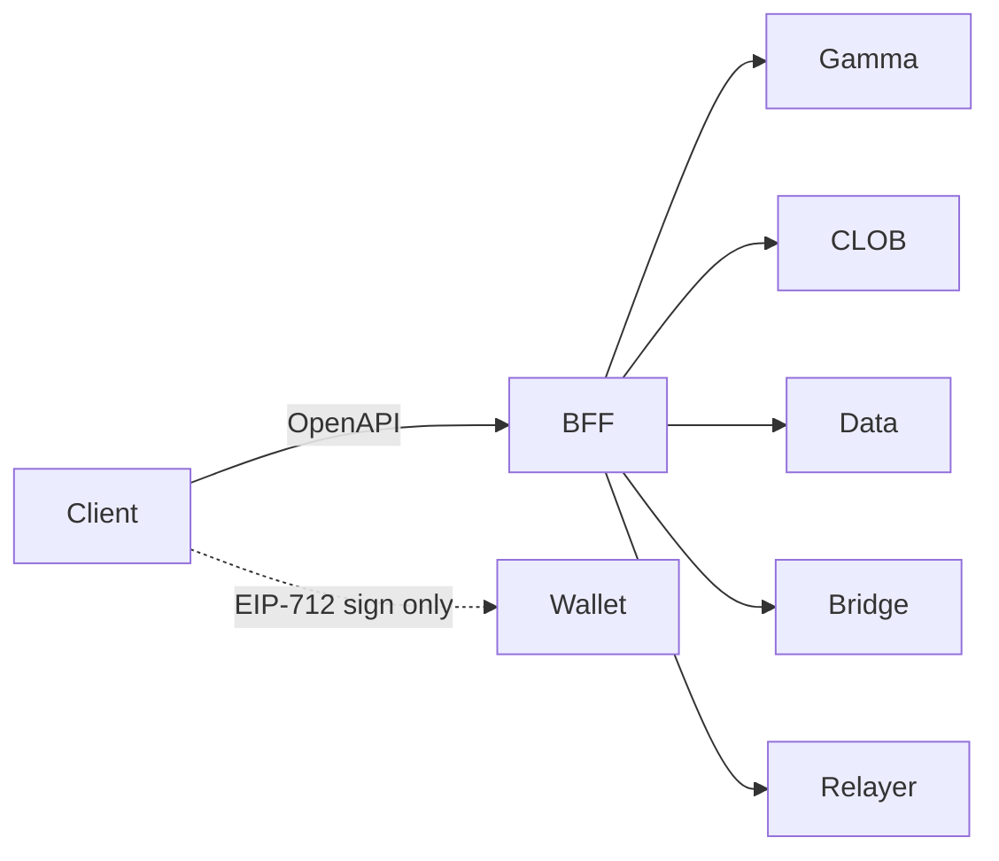

# API, SDK, AND ENDPOINT REGISTRY

**Status:** reviewed
**Owner:** platform-orchestrator
**Last updated:** 2026-07-25
**Product:** RetroPick Markets V1 — Wave 2 Polymarket Integration
**Wave:** 2 (implementation-grade upstream contract)

## Description

This document is the authoritative catalog of Polymarket upstream interfaces used by RetroPick Markets V1 Wave 2: hosts (Gamma, CLOB V2, Data API, Bridge, Relayer, WebSocket, geoblock), auth models, rate limits, SDK packages, BFF routing, health/retry/cache policy, and **client-forbidden** classifications. RetroPick OpenAPI (`schemas/openapi/markets-v1.yaml`) is the only public client surface; production web/Android must not call upstream hosts directly.

It sits in the Wave 2 Polymarket integration suite beside auth, order lifecycle, and capability-matrix peers. Runtime ownership is the Go BFF under `apps/backend/internal/markets/`; evidence and revalidation live with the research evidence register and [UPSTREAM_CHANGE_MANAGEMENT.md](./UPSTREAM_CHANGE_MANAGEMENT.md). Polymarket remains venue and settlement authority (ADR-001); this registry is the anti-corruption boundary that prevents ACL drift and invented endpoints (ADR-002).

Read this before adding any upstream call, SDK bump, or client fetch, and when scaffolding Wave 2 clients. It is not a matching-engine design, not a Combos RFQ enablement guide, and not a place to invent base URLs—unverified WS paths stay unverified until evidence follow-up.

## 0. Developer intent (5W+1H)

Short orientation for implementers and agents. Read this before the normative sections below.

| Lens | Answer |
|------|--------|
| **Who** | Go BFF owners (`apps/backend/internal/markets/`), web/Android client teams, `be-api` / `fe-markets` / `fe-wallet` agents, and security reviewers enforcing client-forbidden upstream access. |
| **What** | Authoritative catalog of Polymarket upstream hosts (Gamma, CLOB V2, Data API, Bridge, Relayer, WS, geoblock), auth models, rate limits, SDK packages, BFF routing, and **client-forbidden** classifications. RetroPick OpenAPI is the only public surface. |
| **When** | Before adding any upstream call, SDK bump, or client fetch; at Wave 2 client scaffolding; whenever docs.polymarket.com or SDK versions change (see [UPSTREAM_CHANGE_MANAGEMENT.md](./UPSTREAM_CHANGE_MANAGEMENT.md)). |
| **Where** | Spec authority: this doc + [research/EVIDENCE_REGISTER.md](../research/EVIDENCE_REGISTER.md). Runtime: BFF markets module. Public contract: `schemas/openapi/markets-v1.yaml`. Clients consume RetroPick routes only. |
| **Why** | Polymarket is venue and settlement authority (ADR-001). RetroPick must not embed a custom exchange or leak upstream URLs/keys to production clients (ADR-002). A single registry prevents silent ACL drift and invented endpoints. |
| **How** | Implement BFF adapters per host row; mark production client direct access **FORBIDDEN** except wallet EIP-712 signing; attach health probes, retries, and cache TTLs from the registry; revalidate WS/base URLs from official docs before shipping. |

### Worked example

**Happy path.** Web needs market catalog + book. Client calls RetroPick `GET /markets/...` and BFF WebSocket/SSE. BFF reads Gamma (public) and CLOB REST (server credentials / L2 as required), normalizes to OpenAPI types, caches per TTL, and never returns raw upstream hostnames in client bundles. Order preview uses CLOB fee/market info via BFF; the wallet signs EIP-712 locally; submit goes BFF → CLOB. Relayer and Builder keys stay server-side. Combos RFQ routes remain gated off ([COMBOS_CAPABILITY_GATE.md](./COMBOS_CAPABILITY_GATE.md)).

**Failure / degraded.** If a client ships a production build that calls `https://clob.polymarket.com` directly, that violates ADR-002 / this registry — reject in review and CI allowlists. If Gamma is 5xx, BFF serves stale cache within TTL and marks catalog degraded; trading remains blocked if CLOB geoblock or auth fails. Unverified WS URLs stay `unverified` until EV follow-up — do not hard-code guessed paths. Perps and custom RetroPick matching engines are out of scope forever for V1.

**ACL summary for agents**

| Actor | May call | Must not |
|-------|----------|----------|
| Production web/Android | RetroPick HTTP/WS only; local EIP-712 sign | Upstream hosts, Relayer keys, Builder secrets |
| Go BFF | Gamma/CLOB/Data/Bridge/Relayer per matrix | Silent-sign user orders; invent addresses |
| Ops / CI | Health probes + registry verification | Bypass geoblock in product code |

**Host classes (orientation)**

1. **Public read** — Gamma / much of Data API: BFF still proxies in production for cache, shaping, and ACL consistency.
2. **Credentialed trade** — CLOB V2 L1/L2: BFF holds L2; client only signs typed data.
3. **Privileged infra** — Relayer / Builder: server-only; never in OpenAPI or mobile binaries.
4. **Policy** — Geoblock: must be consulted before trade submit; failures fail closed.

**Non-goals encoded here:** no RetroPick matching engine; no client SDK that talks CLOB in prod; no Combos RFQ; no invented base URLs. When in doubt, add an evidence row before coding the adapter.

**Implementation order hint:** registry row → evidence tag → BFF client stub with health probe → OpenAPI mapping → forbid client direct access in CI → only then wire UI. Skipping the registry row is how ACL regressions enter review.

**Related docs:** [AUTHENTICATION_AND_ACCOUNT_WALLETS.md](./AUTHENTICATION_AND_ACCOUNT_WALLETS.md), [ORDER_LIFECYCLE.md](./ORDER_LIFECYCLE.md), [CAPABILITY_AND_DEPENDENCY_MATRIX.md](./CAPABILITY_AND_DEPENDENCY_MATRIX.md).

## 1. Purpose

Catalog every Polymarket external interface used by RetroPick Markets V1 Wave 2: base URLs, authentication models, rate limits, request/response semantics, SDK packages, BFF routing, and **client-forbidden** classifications.

Per master prompt §8.1, each entry includes: purpose, auth, pagination, rate limits, idempotency, retry, timeout, error taxonomy, cache policy, health probe, fallback, SDK version, owner, revalidation date.

## 2. Scope

### In scope

- RetroPick Markets V1 delivered through web, Go BFF (`apps/backend/internal/markets/`), and native Android Jetpack Compose.
- Wave 2 Polymarket upstream interfaces: Gamma, CLOB V2, Data API, Bridge API, Relayer, on-chain contracts (CTF, Exchange V2, Neg Risk, pUSD).
- Evidence-tagged, implementation-grade specifications for engineering agents.

### Out of scope

- PRISM protocol (`contracts/prism/`).
- Legacy epoch APIs (`/api/v1/legacy/markets/*`) — frozen per EV-003.
- Polymarket Perps APIs and perpetuals trading.
- Combos RFQ/requester trading — excluded per EV-013 and [COMBOS_CAPABILITY_GATE.md](./COMBOS_CAPABILITY_GATE.md).
- Custom RetroPick exchange or outcome-token issuance (ADR-001).
- Copying Polymarket proprietary UI, trademarks, or confidential behavior.
## 3. Prerequisites

- [00_DOCUMENT_MAP.md](../00_DOCUMENT_MAP.md)
- [.dev/MARKETS.md](../../MARKETS.md)
- [docs/ARCHITECTURE.md](../../../docs/ARCHITECTURE.md)
- [research/EVIDENCE_REGISTER.md](../research/EVIDENCE_REGISTER.md)
- [schemas/openapi/markets-v1.yaml](../../../schemas/openapi/markets-v1.yaml) (EV-005)
- Peer documents in [polymarket/](./)
## 4. Authoritative sources

| Source | URL | Retrieved | Evidence | Confidence |
|--------|-----|-----------|----------|------------|
| Documentation index | https://docs.polymarket.com/llms.txt | 2026-07-25 | EV-001 | partially_verified |
| CLOB V2 migration | https://docs.polymarket.com/v2-migration | 2026-07-25 | EV-001, EV-007, EV-010 | partially_verified |
| Contract registry | https://docs.polymarket.com/resources/contracts | 2026-07-25 | EV-008 | partially_verified |
| Wallets and authentication | https://docs.polymarket.com/trading/wallets-auth | 2026-07-25 | EV-009 | partially_verified |
| Deposit wallets | https://docs.polymarket.com/trading/deposit-wallets | 2026-07-25 | EV-009 | partially_verified |
| Builder program | https://docs.polymarket.com/programs/builders/overview | 2026-07-25 | EV-010 | partially_verified |
| Negative risk | https://docs.polymarket.com/concepts/negative-risk | 2026-07-25 | EV-012 | partially_verified |
| Rate limits (IP) | https://docs.polymarket.com/api-reference/rate-limits | 2026-07-25 | EV-011 | partially_verified |
| Trading rate limits | https://docs.polymarket.com/api-reference/trading-rate-limits | 2026-07-25 | EV-011 | partially_verified |
| Predictions API overview | https://docs.polymarket.com/api-reference/predictions/overview | 2026-07-25 | EV-001 | partially_verified |
| RetroPick OpenAPI | `schemas/openapi/markets-v1.yaml` | 2026-07-25 | EV-005 | verified |
| BFF module | `apps/backend/internal/markets/` | 2026-07-25 | EV-002 | verified |

## 5. Current state

- BFF implements partial Gamma read client (EV-002).
- CLOB, Data, Bridge, Relayer clients are specified but not fully implemented.
- OpenAPI `markets-v1.yaml` defines RetroPick-facing routes (EV-005).
- No production client embeds upstream URLs (ADR-002).

## 6. Target design

### 6.1 Host registry

| Service | Production base URL | Auth | BFF access | Client access | Evidence |
|---------|---------------------|------|------------|---------------|----------|
| Gamma API | `https://gamma-api.polymarket.com` | Public (most reads) | MUST proxy/cache | **FORBIDDEN** direct in prod | EV-001 |
| CLOB V2 | `https://clob.polymarket.com` | L1/L2 + proxy sig for trade | MUST for all calls | **FORBIDDEN** except EIP-712 sign in wallet | EV-001 |
| Data API | `https://data-api.polymarket.com` | Public reads | MUST proxy | **FORBIDDEN** direct in prod | EV-001 |
| Bridge API | `https://bridge.polymarket.com` | Mixed | MUST | **FORBIDDEN** | EV-007 |
| Relayer | Per docs relayer endpoints | Builder/Relayer API keys | MUST server-side | **FORBIDDEN** | EV-009, EV-010 |
| CLOB WebSocket | `wss://ws-subscriptions-clob.polymarket.com/ws` (verify at impl) | channel-dependent | SHOULD fan-out | **FORBIDDEN** direct | EV-001 |
| Geoblock | CLOB `/geoblock` or dedicated | Public | MUST | **FORBIDDEN** | EV-011 |

> **Note:** WebSocket URL MUST be revalidated from official docs at implementation — mark `unverified` until confirmed in EV-008 follow-up entry.

### 6.2 SDK registry

| Package | Version policy | Use in RetroPick | Location | Evidence |
|---------|---------------|------------------|----------|----------|
| `@polymarket/clob-client-v2` | pin minor | Reference for order schema; BFF may use HTTP directly | dev dependency / docs | EV-001 |
| `@polymarket/ts-sdk` / `@polymarket/client` | evaluate | Wallet + relayer patterns for client signing helpers | web/android only | EV-001 |
| `py-clob-client-v2` | pin minor | Scripting/conformance only | `tools/` | EV-001 |
| Go BFF | n/a | Native HTTP clients with OpenAPI-derived types | `apps/backend/internal/markets/` | EV-002 |

**Decision D-API-01:** Production BFF is Go — do not embed Node CLOB client in request path without ADR.

### 6.3 Gamma API — selected endpoints

| Method | Path | Purpose | Auth | Rate limit (IP/10s) | BFF route | Client |
|--------|------|---------|------|---------------------|-----------|--------|
| GET | `/events` | List events | none | 500 | `GET /markets/events` | forbidden |
| GET | `/events/{id}` | Event detail | none | general 4000 | `GET /markets/events/{id}` | forbidden |
| GET | `/markets` | List markets | none | 300 | `GET /markets/markets` | forbidden |
| GET | `/markets/{id}` | Market detail | none | general | `GET /markets/markets/{id}` | forbidden |
| GET | `/public-search` | Search | none | 350 | `GET /markets/search` | forbidden |
| GET | `/tags` | Tags | none | 200 | `GET /markets/tags` | forbidden |
| GET | `/comments` | Comments | none | 200 | optional social | forbidden |

Pagination: **keyset** (`after_cursor`) — `offset` rejected per official docs.

### 6.4 CLOB V2 — market data (public)

| Method | Path | Purpose | Rate limit/10s | BFF | Client |
|--------|------|---------|----------------|-----|--------|
| GET | `/book` | Order book | 1500 | MUST | forbidden |
| POST | `/books` | Multi book | 500 | MUST | forbidden |
| GET | `/price` | Best price | 1500 | MUST | forbidden |
| POST | `/prices` | Multi price | 500 | MUST | forbidden |
| GET | `/midpoint` | Midpoint | 1500 | MUST | forbidden |
| GET | `/prices-history` | History | 1000 | MUST | forbidden |
| GET | `/tick-size` | Tick size | 200 | MUST | forbidden |
| GET | `/fee-rate` | Fee rate | general | MUST | forbidden |
| GET | `/time` | Server time | general | MUST internal | forbidden |

### 6.5 CLOB V2 — authentication

| Step | Endpoint | Signer | Description | BFF | Client |
|------|----------|--------|-------------|-----|--------|
| L1 | `POST /auth/api-key` | EOA `ClobAuth` EIP-712 | Create API key | orchestrate challenge | wallet signs |
| L1 | `GET /auth/derive-api-key` | EOA | Derive existing | orchestrate | wallet signs |
| L2 | all private routes | HMAC API key | Trade/read private | holds secret server-side | **never** |

`ClobAuthDomain` version stays `"1"` in V2 (EV-001). Exchange order EIP-712 domain version is `"2"`.

### 6.6 CLOB V2 — trading (authenticated)

| Method | Path | Auth | Burst/10s | Sustained | BFF | Client |
|--------|------|------|-----------|-----------|-----|--------|
| POST | `/order` | L2 + signed order | 5000 | 120k/10min | MUST submit | signs only |
| POST | `/orders` | L2 batch | 2000 | 21k/10min | MAY | signs only |
| DELETE | `/order` | L2 + proxy sig | 5000 | 120k/10min | MUST | proxy sign |
| DELETE | `/orders` | L2 batch cancel | 2000 | 15k/10min | MUST | proxy sign |
| DELETE | `/cancel-all` | L2 | 250 | 6k/10min | MUST | confirm UX |
| GET | `/data/orders` | L2 | 500 | — | MUST | forbidden |
| GET | `/data/trades` | L2 | 500 | — | MUST | forbidden |
| GET | `/balances` | L2 | 200 GET | — | MUST | forbidden |
| POST | `/balance-allowance/update` | L2 | 50 | — | MUST | forbidden |

#### 6.6.1 MKT-P3-002 — POST /order wire contract (implemented in `clob/`)

**Status:** Client layer shipped (`apps/backend/internal/markets/clob/`); BFF HTTP submit deferred to glue chat. **BLK-004 remains open** until ops clears the real on-chain transaction gate; tests use **httptest/sandbox credentials only** — no live mainnet claims.

**V2 only:** Path is `/order` (not `/v1/order`). Builder attribution is the `builder` bytes32 field on the signed order object (server-injected at preview). **V1 `POLY_BUILDER_*` HMAC headers are removed** (EV-010).

**Request body** (`SendOrder`):

| Field | Source | Notes |
|-------|--------|-------|
| `order.salt` | preview | numeric or string on wire |
| `order.maker`, `order.signer` | preview | lowercase `0x` addresses |
| `order.tokenId`, `order.makerAmount`, `order.takerAmount` | preview | fixed-point strings |
| `order.side` | preview `Side` int | wire uses `"BUY"` / `"SELL"` strings (0→BUY, 1→SELL) |
| `order.signatureType`, `order.timestamp`, `order.metadata` | preview | EIP-712 V2 fields |
| `order.builder` | preview (server) | `0x` + 64 hex chars |
| `order.signature` | client wallet | user-signed EIP-712 |
| `order.expiration` | wire-only | `"0"` for GTC; GTD uses unix seconds (not in signed struct) |
| `owner` | L2 `POLY_API_KEY` UUID | not the wallet address |
| `orderType` | preview TIF | `GTC` default; also `FOK`, `GTD`, `FAK` |
| `deferExec`, `postOnly` | BFF | default `false` |

**L2 headers:** `POLY_ADDRESS`, `POLY_SIGNATURE`, `POLY_TIMESTAMP`, `POLY_API_KEY`, `POLY_PASSPHRASE`. HMAC message = `timestamp + METHOD + /order + exact JSON body`.

**Timeout / retry:** 15s request timeout; **0 retries** on POST /order. Network timeout → `unknown_reconciling` at BFF; **never auto-resubmit** (ORDER_LIFECYCLE D-06).

**Live credentials:** Env `MARKETS_CLOB_L2_*` requires human approval ([BLOCKERS_AND_HUMAN_APPROVALS.md](../agent-harness/BLOCKERS_AND_HUMAN_APPROVALS.md) §4). Default dev/test uses `clob.SandboxCredentials()` + httptest.

**Glue handoff (not in MKT-P3-002):** `POST /markets/orders/submit` with `previewId` + `contentHash` + signature; 409 on hash mismatch; 410 on expired preview; `Idempotency-Key` store; kill switch `order_submit: false`.

| Method | Path | Rate/10s | BFF | Client |
|--------|------|----------|-----|--------|
| GET | `/positions` | 150 | MUST | forbidden |
| GET | `/closed-positions` | 150 | MUST | forbidden |
| GET | `/trades` | 200 | MUST | forbidden |
| GET | `/activity` | general | SHOULD | forbidden |

### 6.8 Bridge API

| Method | Path | Rate/10s | BFF | Client |
|--------|------|----------|-----|--------|
| POST | `/deposit` addresses | 50 general | MUST | forbidden |
| POST | `/withdraw` addresses | 50 | MUST | forbidden |
| GET | `/supported-assets` | 50 | MUST | forbidden |
| GET | `/quote` | 50 | MUST | forbidden |
| GET | `/status/{id}` | 50 | MUST | forbidden |

### 6.9 Relayer API (server-side only)

| Method | Path | Auth | Rate | BFF | Client |
|--------|------|------|------|-----|--------|
| POST | `/submit` | Builder or Relayer API key | 25/min | MUST | **FORBIDDEN** |
| GET | `/transaction` | same | general | MUST | forbidden |
| GET | `/deployed` | public check | general | MUST | forbidden |
| GET | `/nonce` | signer address | general | MUST internal | forbidden |

### 6.10 Error taxonomy (normalized BFF)

| Upstream class | BFF code | Retry | User message |
|----------------|----------|-------|--------------|
| 400 validation | `invalid_request` | no | Show field errors |
| 401 auth | `auth_required` | no | Re-authenticate |
| 403 geo | `not_eligible` | no | Region unsupported |
| 404 | `not_found` | no | Resource missing |
| 429 | `rate_limited` | yes backoff | Try again |
| 5xx | `upstream_error` | yes limited | Degraded banner |
| timeout | `unknown` | reconcile | Order status unknown |

### 6.11 Idempotency and correlation

- BFF generates `correlation_id` (UUID) per user operation.
- Order submit carries `client_order_id` (COID) when CLOB supports — see cancel-by-COID endpoints.
- `Idempotency-Key` header on BFF mutating routes (OpenAPI) dedupes preview+submit pairs within 24h.

### 6.12 Retry and timeout policy

| Upstream | Connect timeout | Request timeout | Retry | Max attempts |
|----------|----------------|---------------|-------|--------------|
| Gamma | 2s | 10s | idempotent GETs: 3 | exponential 100ms-2s |
| CLOB market data | 2s | 5s | GETs: 3 | jitter |
| CLOB trading | 2s | 15s | **no** on POST /order | 0 — reconcile instead |
| Bridge | 3s | 30s | GET status: 10 | 1s-30s |
| Relayer submit | 3s | 60s | 2 | only on 5xx |

### 6.13 Cache policy

| Resource | TTL | Invalidation |
|----------|-----|--------------|
| Event list | 30-60s | cursor advance |
| Market metadata | 60s | market update event |
| Order book snapshot | 2-5s | WS delta or short TTL |
| Tick size / fees | 1h | manual + market open |
| Geoblock | 5m | policy change webhook |

### 6.14 Health probes

| Probe | Endpoint | Frequency | Alert |
|-------|----------|-----------|-------|
| Gamma | `GET /ok` or lightweight `/events?limit=1` | 30s | 3 failures |
| CLOB | `GET /time` | 30s | 3 failures |
| Data | `GET /ok` | 60s | 5 failures |

## 7. Alternatives considered

| Alternative | Rejected because |
|-------------|------------------|
| Direct Gamma/CLOB from web/Android in production | ADR-002: schema churn, credential exposure, no central policy |
| Custom RetroPick exchange | ADR-001: Polymarket is venue authority |
| CLOB V1 SDK or V1-signed orders | EV-001: not supported on production after 2026-04-28 |
| USDC.e as default trading collateral post-V2 | EV-007: pUSD is V2 collateral |
| Hard-coded contract addresses without registry | EV-008: must verify at startup from official registry |
| Single `walletAddress` API field | ADR-003: conflates signer and account wallet |
| Combos trading in V1 | EV-013: incomplete upstream + legal/ops risk |
| Floating-point money in APIs | Precision loss; use fixed-point strings |
## 8. Decisions

| ID | Decision | Rationale |
|----|----------|-----------|
| D-01 | Polymarket is venue authority for matching, resolution, collateral | ADR-001 |
| D-02 | All production upstream HTTP/WebSocket from BFF only | ADR-002 |
| D-03 | User signs orders and asset txs; BFF never silent-signs | ADR-003 |
| D-04 | Shared OpenAPI contract for web and Android | ADR-004 |
| D-05 | `eligible: false` blocks all mutating trading endpoints | Fail closed |
| D-06 | Order submit timeout → `unknown_reconciling`, never auto-resubmit | Reconciliation safety |
| D-07 | Exchange selection from official market metadata, not titles | EV-012 |
| D-08 | Combos capability remains disabled until gate checklist passes | EV-013 |
| D-09 | Contract addresses loaded from EV-008 registry with bytecode verify | No invented addresses |
| D-10 | Builder code attached server-side during order preview assembly | EV-010 |
## 9. Data and control flows

Authenticated read: Client → BFF (session) → CLOB L2 (server-held creds scoped to user account).

Order submit: Client signs EIP-712 → BFF attaches builder + validates preview hash → CLOB POST /order.

## 10. Failure and recovery

| Failure domain | Detection | User-visible behavior | Recovery action |
|----------------|-----------|----------------------|-----------------|
| Gamma unavailable | 5xx, timeout, error rate | Stale catalog + banner | Serve cache; exponential backoff |
| CLOB market data down | /book errors | Empty book + retry CTA | Poll with jitter; fallback REST |
| CLOB L2 auth invalid | 401/403 | Re-auth prompt | L1 signature flow |
| Order submit timeout | client/BFF timer | `unknown_reconciling` state | Poll open orders + fills; user confirm |
| Relayer 429 | 429 response | Funding pending | Queue; respect 25/min submit limit |
| Bridge delay | status API stuck | In-progress funding UI | Poll bridge status; support playbook |
| Geo block | geoblock endpoint / policy | Read-only mode | Unsupported region UX |
| Registry mismatch | startup probe | Deploy blocked | Roll back config; ops alert |
| Engine restart | missing resting orders | Open orders may vanish upstream | Reconcile to cancelled or re-listed |

**MUST NOT:** silently resubmit orders after HTTP timeout; mark failed without reconciliation poll.
## 11. Security

- RetroPick MUST NOT receive, generate, store, log, or back up user seed phrases or raw private keys (ADR-003).
- Preview-before-sign for every collateral wrap, approval, transfer, split, merge, convert, redeem, withdrawal.
- Builder codes, relayer API keys, and CLOB L2 secrets: server-side only; never in mobile/web bundles.
- Production clients MUST NOT embed upstream base URLs for authenticated CLOB/relayer calls (ADR-002).
- Signed payload hash stored for audit; full signature redacted in logs.
- Session binding for web; Android attestation where platform supports it.
## 12. Observability

| Metric | Type | SLO / alert |
|--------|------|-------------|
| `markets_upstream_request_duration_ms` | histogram | p95 per upstream |
| `markets_upstream_errors_total` | counter | >1% 5m window |
| `markets_catalog_staleness_seconds` | gauge | >300s page |
| `markets_order_reconcile_lag_seconds` | histogram | p99 < 60s |
| `markets_capability_denied_total` | counter | anomaly detection |
| `markets_degraded_mode` | gauge | ==1 for 5m |

Structured logs: `correlation_id`, `user_session_id` (hashed), `upstream`, `evidence_id`, `operation`. Never log private keys, mnemonics, relayer secrets, or full EIP-712 payloads.
## 13. Test strategy

- **Contract:** OpenAPI conformance (EV-005) for every BFF route in this document's scope.
- **Integration:** Recorded cassettes against Gamma/CLOB/Data/Bridge sandboxes; no secrets in CI.
- **Security:** Signing boundary tests — BFF cannot produce valid order signature without client.
- **E2E:** [testing/END_TO_END_CRITICAL_JOURNEYS.md](../testing/END_TO_END_CRITICAL_JOURNEYS.md).
- **Chaos:** Upstream 429/5xx injection; verify degraded mode and no double-submit.
- **Registry:** Startup test with known-good and intentionally wrong bytecode hash.
## 14. Rollout and rollback

1. **Phase 1:** catalog + market data capabilities (`read_only`).
2. **Phase 2:** wallet connect + funding (`wallet`, `funding`).
3. **Phase 3:** order submit behind kill switch (`trade`).
4. **Phase 4:** portfolio, redemption, neg-risk convert (`portfolio`).

Rollback: flip capability flag in BFF config → clients poll `/markets/capabilities` (TTL ≤30s). Order kill switch stops new submits; does **not** cancel upstream resting orders.
## 15. Open questions

| ID | Question | Expiry | Owner |
|----|----------|--------|-------|
| OQ-01 | Go BFF: raw HTTP vs sidecar for CLOB signing helpers | 2026-08-15 | backend |
| OQ-02 | Android wallet connector (WalletConnect vs in-app WebView) | 2026-08-01 | mobile |
| OQ-03 | Minimum catalog freshness SLO at launch | 2026-08-01 | SRE |
| OQ-04 | Augmented neg-risk placeholder display policy | 2026-08-15 | product |

Full log: [research/OPEN_QUESTIONS_AND_EXPIRING_ASSUMPTIONS.md](../research/OPEN_QUESTIONS_AND_EXPIRING_ASSUMPTIONS.md).
## 16. Acceptance criteria

- [ ] All MUST requirements traced in [agent-harness/REQUIREMENTS_TO_TASK_TRACEABILITY.md](../agent-harness/REQUIREMENTS_TO_TASK_TRACEABILITY.md).
- [ ] Time-sensitive claims cite evidence ID (EV-xxx) with retrieval date 2026-07-25.
- [ ] No production contract address in app config without EV-008 verification pipeline.
- [ ] Mermaid diagrams render for specified flows.
- [ ] BFF-only vs client-forbidden endpoints explicitly classified.
- [ ] Phase gate evidence attached before implementation merge.

## 17. Evidence index

| ID | Claim | Source | Confidence | Consequence |
|----|-------|--------|------------|-------------|
| EV-001 | CLOB V2 is production trading API (live 2026-04-28) | https://docs.polymarket.com/v2-migration | partially_verified | V2 SDK/signing only |
| EV-002 | Markets BFF serves `/api/v1/markets/*` | `apps/backend/internal/markets/` | verified | Client integration surface |
| EV-003 | Legacy epoch frozen | `docs/ARCHITECTURE.md` | verified | No legacy extension |
| EV-005 | OpenAPI `markets-v1.yaml` canonical | repo | verified | Codegen/conformance |
| EV-007 | pUSD replaces USDC.e as V2 collateral | https://docs.polymarket.com/v2-migration | partially_verified | Wrap/onramp/funding |
| EV-008 | Official contract registry (Polygon 137) | https://docs.polymarket.com/resources/contracts | partially_verified | Load + verify at startup |
| EV-009 | Deposit Wallet default for accounts deployed ≥ 2026-05-04 | https://docs.polymarket.com/trading/wallets-auth | partially_verified | Wallet-type matrix |
| EV-010 | Builder attribution via `builder` bytes32 on signed order | https://docs.polymarket.com/v2-migration | partially_verified | Replaces V1 HMAC headers |
| EV-011 | Cloudflare IP limits + per-signer trading buckets | https://docs.polymarket.com/api-reference/rate-limits | partially_verified | BFF rate governance |
| EV-012 | Neg Risk uses separate exchange + adapter | https://docs.polymarket.com/concepts/negative-risk | partially_verified | Per-market exchange select |
| EV-013 | Combos requester/maker not V1 | https://docs.polymarket.com/api-reference/combo-markets/get-combo-markets | partially_verified | `combos.enabled=false` |

**Revalidation triggers:** Polymarket changelog, SDK major version, contract registry diff, geoblock policy, Builder program terms.

## 18. Related documents

| Direction | Document | Relationship |
|-----------|----------|--------------|
| Upstream | [research/EVIDENCE_REGISTER.md](../research/EVIDENCE_REGISTER.md) | Master evidence |
| Upstream | [research/POLYMARKET_CURRENT_STATE.md](../research/POLYMARKET_CURRENT_STATE.md) | Research baseline |
| Peer | [polymarket/](./) | Wave 2 integration set |
| Downstream | [backend/BACKEND_ARCHITECTURE.md](../backend/BACKEND_ARCHITECTURE.md) | BFF modules |
| Downstream | [backend/DOMAIN_MODEL_AND_STATE_MACHINES.md](../backend/DOMAIN_MODEL_AND_STATE_MACHINES.md) | State machines |
| Downstream | [backend/API_AND_REALTIME_CONTRACTS.md](../backend/API_AND_REALTIME_CONTRACTS.md) | RetroPick API |
| Downstream | [backend/CACHE_QUEUE_AND_RATE_LIMITING.md](../backend/CACHE_QUEUE_AND_RATE_LIMITING.md) | Throttles |
| Downstream | [testing/MASTER_TEST_PLAN.md](../testing/MASTER_TEST_PLAN.md) | Verification |
| ADR | [ADR-002](../architecture/adr/ADR-002-POLYMARKET-ANTI-CORRUPTION-LAYER.md) | BFF boundary |
| ADR | [ADR-003](../architecture/adr/ADR-003-WALLET-AND-SIGNING-MODEL.md) | Signing |

## Appendix A. Endpoint and field reference (Wave 2)

| REF-0001 | Implementation agent MUST cross-check field semantics, auth class, and error codes against https://docs.polymarket.com/llms.txt before coding. |
| REF-0002 | Implementation agent MUST cross-check field semantics, auth class, and error codes against https://docs.polymarket.com/llms.txt before coding. |
| REF-0003 | Implementation agent MUST cross-check field semantics, auth class, and error codes against https://docs.polymarket.com/llms.txt before coding. |
| REF-0004 | Implementation agent MUST cross-check field semantics, auth class, and error codes against https://docs.polymarket.com/llms.txt before coding. |
| REF-0005 | Implementation agent MUST cross-check field semantics, auth class, and error codes against https://docs.polymarket.com/llms.txt before coding. |
| REF-0006 | Implementation agent MUST cross-check field semantics, auth class, and error codes against https://docs.polymarket.com/llms.txt before coding. |
| REF-0007 | Implementation agent MUST cross-check field semantics, auth class, and error codes against https://docs.polymarket.com/llms.txt before coding. |
| REF-0008 | Implementation agent MUST cross-check field semantics, auth class, and error codes against https://docs.polymarket.com/llms.txt before coding. |
| REF-0009 | Implementation agent MUST cross-check field semantics, auth class, and error codes against https://docs.polymarket.com/llms.txt before coding. |
| REF-0010 | Implementation agent MUST cross-check field semantics, auth class, and error codes against https://docs.polymarket.com/llms.txt before coding. |
| REF-0011 | Implementation agent MUST cross-check field semantics, auth class, and error codes against https://docs.polymarket.com/llms.txt before coding. |
| REF-0012 | Implementation agent MUST cross-check field semantics, auth class, and error codes against https://docs.polymarket.com/llms.txt before coding. |
| REF-0013 | Implementation agent MUST cross-check field semantics, auth class, and error codes against https://docs.polymarket.com/llms.txt before coding. |
| REF-0014 | Implementation agent MUST cross-check field semantics, auth class, and error codes against https://docs.polymarket.com/llms.txt before coding. |
| REF-0015 | Implementation agent MUST cross-check field semantics, auth class, and error codes against https://docs.polymarket.com/llms.txt before coding. |
| REF-0016 | Implementation agent MUST cross-check field semantics, auth class, and error codes against https://docs.polymarket.com/llms.txt before coding. |
| REF-0017 | Implementation agent MUST cross-check field semantics, auth class, and error codes against https://docs.polymarket.com/llms.txt before coding. |
| REF-0018 | Implementation agent MUST cross-check field semantics, auth class, and error codes against https://docs.polymarket.com/llms.txt before coding. |
| REF-0019 | Implementation agent MUST cross-check field semantics, auth class, and error codes against https://docs.polymarket.com/llms.txt before coding. |
| REF-0020 | Implementation agent MUST cross-check field semantics, auth class, and error codes against https://docs.polymarket.com/llms.txt before coding. |
| REF-0021 | Implementation agent MUST cross-check field semantics, auth class, and error codes against https://docs.polymarket.com/llms.txt before coding. |
| REF-0022 | Implementation agent MUST cross-check field semantics, auth class, and error codes against https://docs.polymarket.com/llms.txt before coding. |
| REF-0023 | Implementation agent MUST cross-check field semantics, auth class, and error codes against https://docs.polymarket.com/llms.txt before coding. |
| REF-0024 | Implementation agent MUST cross-check field semantics, auth class, and error codes against https://docs.polymarket.com/llms.txt before coding. |
| REF-0025 | Implementation agent MUST cross-check field semantics, auth class, and error codes against https://docs.polymarket.com/llms.txt before coding. |
| REF-0026 | Implementation agent MUST cross-check field semantics, auth class, and error codes against https://docs.polymarket.com/llms.txt before coding. |
| REF-0027 | Implementation agent MUST cross-check field semantics, auth class, and error codes against https://docs.polymarket.com/llms.txt before coding. |
| REF-0028 | Implementation agent MUST cross-check field semantics, auth class, and error codes against https://docs.polymarket.com/llms.txt before coding. |
| REF-0029 | Implementation agent MUST cross-check field semantics, auth class, and error codes against https://docs.polymarket.com/llms.txt before coding. |
| REF-0030 | Implementation agent MUST cross-check field semantics, auth class, and error codes against https://docs.polymarket.com/llms.txt before coding. |
| REF-0031 | Implementation agent MUST cross-check field semantics, auth class, and error codes against https://docs.polymarket.com/llms.txt before coding. |
| REF-0032 | Implementation agent MUST cross-check field semantics, auth class, and error codes against https://docs.polymarket.com/llms.txt before coding. |
| REF-0033 | Implementation agent MUST cross-check field semantics, auth class, and error codes against https://docs.polymarket.com/llms.txt before coding. |
| REF-0034 | Implementation agent MUST cross-check field semantics, auth class, and error codes against https://docs.polymarket.com/llms.txt before coding. |
| REF-0035 | Implementation agent MUST cross-check field semantics, auth class, and error codes against https://docs.polymarket.com/llms.txt before coding. |
| REF-0036 | Implementation agent MUST cross-check field semantics, auth class, and error codes against https://docs.polymarket.com/llms.txt before coding. |
| REF-0037 | Implementation agent MUST cross-check field semantics, auth class, and error codes against https://docs.polymarket.com/llms.txt before coding. |
| REF-0038 | Implementation agent MUST cross-check field semantics, auth class, and error codes against https://docs.polymarket.com/llms.txt before coding. |
| REF-0039 | Implementation agent MUST cross-check field semantics, auth class, and error codes against https://docs.polymarket.com/llms.txt before coding. |
| REF-0040 | Implementation agent MUST cross-check field semantics, auth class, and error codes against https://docs.polymarket.com/llms.txt before coding. |
| REF-0041 | Implementation agent MUST cross-check field semantics, auth class, and error codes against https://docs.polymarket.com/llms.txt before coding. |
| REF-0042 | Implementation agent MUST cross-check field semantics, auth class, and error codes against https://docs.polymarket.com/llms.txt before coding. |
| REF-0043 | Implementation agent MUST cross-check field semantics, auth class, and error codes against https://docs.polymarket.com/llms.txt before coding. |
| REF-0044 | Implementation agent MUST cross-check field semantics, auth class, and error codes against https://docs.polymarket.com/llms.txt before coding. |
| REF-0045 | Implementation agent MUST cross-check field semantics, auth class, and error codes against https://docs.polymarket.com/llms.txt before coding. |
| REF-0046 | Implementation agent MUST cross-check field semantics, auth class, and error codes against https://docs.polymarket.com/llms.txt before coding. |
| REF-0047 | Implementation agent MUST cross-check field semantics, auth class, and error codes against https://docs.polymarket.com/llms.txt before coding. |
| REF-0048 | Implementation agent MUST cross-check field semantics, auth class, and error codes against https://docs.polymarket.com/llms.txt before coding. |
| REF-0049 | Implementation agent MUST cross-check field semantics, auth class, and error codes against https://docs.polymarket.com/llms.txt before coding. |
| REF-0050 | Implementation agent MUST cross-check field semantics, auth class, and error codes against https://docs.polymarket.com/llms.txt before coding. |
| REF-0051 | Implementation agent MUST cross-check field semantics, auth class, and error codes against https://docs.polymarket.com/llms.txt before coding. |
| REF-0052 | Implementation agent MUST cross-check field semantics, auth class, and error codes against https://docs.polymarket.com/llms.txt before coding. |
| REF-0053 | Implementation agent MUST cross-check field semantics, auth class, and error codes against https://docs.polymarket.com/llms.txt before coding. |
| REF-0054 | Implementation agent MUST cross-check field semantics, auth class, and error codes against https://docs.polymarket.com/llms.txt before coding. |
| REF-0055 | Implementation agent MUST cross-check field semantics, auth class, and error codes against https://docs.polymarket.com/llms.txt before coding. |
| REF-0056 | Implementation agent MUST cross-check field semantics, auth class, and error codes against https://docs.polymarket.com/llms.txt before coding. |
| REF-0057 | Implementation agent MUST cross-check field semantics, auth class, and error codes against https://docs.polymarket.com/llms.txt before coding. |
| REF-0058 | Implementation agent MUST cross-check field semantics, auth class, and error codes against https://docs.polymarket.com/llms.txt before coding. |
| REF-0059 | Implementation agent MUST cross-check field semantics, auth class, and error codes against https://docs.polymarket.com/llms.txt before coding. |
| REF-0060 | Implementation agent MUST cross-check field semantics, auth class, and error codes against https://docs.polymarket.com/llms.txt before coding. |
| REF-0061 | Implementation agent MUST cross-check field semantics, auth class, and error codes against https://docs.polymarket.com/llms.txt before coding. |
| REF-0062 | Implementation agent MUST cross-check field semantics, auth class, and error codes against https://docs.polymarket.com/llms.txt before coding. |
| REF-0063 | Implementation agent MUST cross-check field semantics, auth class, and error codes against https://docs.polymarket.com/llms.txt before coding. |
| REF-0064 | Implementation agent MUST cross-check field semantics, auth class, and error codes against https://docs.polymarket.com/llms.txt before coding. |
| REF-0065 | Implementation agent MUST cross-check field semantics, auth class, and error codes against https://docs.polymarket.com/llms.txt before coding. |
| REF-0066 | Implementation agent MUST cross-check field semantics, auth class, and error codes against https://docs.polymarket.com/llms.txt before coding. |
| REF-0067 | Implementation agent MUST cross-check field semantics, auth class, and error codes against https://docs.polymarket.com/llms.txt before coding. |
| REF-0068 | Implementation agent MUST cross-check field semantics, auth class, and error codes against https://docs.polymarket.com/llms.txt before coding. |
| REF-0069 | Implementation agent MUST cross-check field semantics, auth class, and error codes against https://docs.polymarket.com/llms.txt before coding. |
| REF-0070 | Implementation agent MUST cross-check field semantics, auth class, and error codes against https://docs.polymarket.com/llms.txt before coding. |
| REF-0071 | Implementation agent MUST cross-check field semantics, auth class, and error codes against https://docs.polymarket.com/llms.txt before coding. |
| REF-0072 | Implementation agent MUST cross-check field semantics, auth class, and error codes against https://docs.polymarket.com/llms.txt before coding. |
| REF-0073 | Implementation agent MUST cross-check field semantics, auth class, and error codes against https://docs.polymarket.com/llms.txt before coding. |
| REF-0074 | Implementation agent MUST cross-check field semantics, auth class, and error codes against https://docs.polymarket.com/llms.txt before coding. |
| REF-0075 | Implementation agent MUST cross-check field semantics, auth class, and error codes against https://docs.polymarket.com/llms.txt before coding. |
| REF-0076 | Implementation agent MUST cross-check field semantics, auth class, and error codes against https://docs.polymarket.com/llms.txt before coding. |
| REF-0077 | Implementation agent MUST cross-check field semantics, auth class, and error codes against https://docs.polymarket.com/llms.txt before coding. |
| REF-0078 | Implementation agent MUST cross-check field semantics, auth class, and error codes against https://docs.polymarket.com/llms.txt before coding. |
| REF-0079 | Implementation agent MUST cross-check field semantics, auth class, and error codes against https://docs.polymarket.com/llms.txt before coding. |
| REF-0080 | Implementation agent MUST cross-check field semantics, auth class, and error codes against https://docs.polymarket.com/llms.txt before coding. |
| REF-0081 | Implementation agent MUST cross-check field semantics, auth class, and error codes against https://docs.polymarket.com/llms.txt before coding. |
| REF-0082 | Implementation agent MUST cross-check field semantics, auth class, and error codes against https://docs.polymarket.com/llms.txt before coding. |
| REF-0083 | Implementation agent MUST cross-check field semantics, auth class, and error codes against https://docs.polymarket.com/llms.txt before coding. |
| REF-0084 | Implementation agent MUST cross-check field semantics, auth class, and error codes against https://docs.polymarket.com/llms.txt before coding. |
| REF-0085 | Implementation agent MUST cross-check field semantics, auth class, and error codes against https://docs.polymarket.com/llms.txt before coding. |
| REF-0086 | Implementation agent MUST cross-check field semantics, auth class, and error codes against https://docs.polymarket.com/llms.txt before coding. |
| REF-0087 | Implementation agent MUST cross-check field semantics, auth class, and error codes against https://docs.polymarket.com/llms.txt before coding. |
| REF-0088 | Implementation agent MUST cross-check field semantics, auth class, and error codes against https://docs.polymarket.com/llms.txt before coding. |
| REF-0089 | Implementation agent MUST cross-check field semantics, auth class, and error codes against https://docs.polymarket.com/llms.txt before coding. |
| REF-0090 | Implementation agent MUST cross-check field semantics, auth class, and error codes against https://docs.polymarket.com/llms.txt before coding. |
| REF-0091 | Implementation agent MUST cross-check field semantics, auth class, and error codes against https://docs.polymarket.com/llms.txt before coding. |
| REF-0092 | Implementation agent MUST cross-check field semantics, auth class, and error codes against https://docs.polymarket.com/llms.txt before coding. |
| REF-0093 | Implementation agent MUST cross-check field semantics, auth class, and error codes against https://docs.polymarket.com/llms.txt before coding. |
| REF-0094 | Implementation agent MUST cross-check field semantics, auth class, and error codes against https://docs.polymarket.com/llms.txt before coding. |
| REF-0095 | Implementation agent MUST cross-check field semantics, auth class, and error codes against https://docs.polymarket.com/llms.txt before coding. |
| REF-0096 | Implementation agent MUST cross-check field semantics, auth class, and error codes against https://docs.polymarket.com/llms.txt before coding. |
| REF-0097 | Implementation agent MUST cross-check field semantics, auth class, and error codes against https://docs.polymarket.com/llms.txt before coding. |
| REF-0098 | Implementation agent MUST cross-check field semantics, auth class, and error codes against https://docs.polymarket.com/llms.txt before coding. |
| REF-0099 | Implementation agent MUST cross-check field semantics, auth class, and error codes against https://docs.polymarket.com/llms.txt before coding. |
| REF-0100 | Implementation agent MUST cross-check field semantics, auth class, and error codes against https://docs.polymarket.com/llms.txt before coding. |
| REF-0101 | Implementation agent MUST cross-check field semantics, auth class, and error codes against https://docs.polymarket.com/llms.txt before coding. |
| REF-0102 | Implementation agent MUST cross-check field semantics, auth class, and error codes against https://docs.polymarket.com/llms.txt before coding. |
| REF-0103 | Implementation agent MUST cross-check field semantics, auth class, and error codes against https://docs.polymarket.com/llms.txt before coding. |
| REF-0104 | Implementation agent MUST cross-check field semantics, auth class, and error codes against https://docs.polymarket.com/llms.txt before coding. |
| REF-0105 | Implementation agent MUST cross-check field semantics, auth class, and error codes against https://docs.polymarket.com/llms.txt before coding. |
| REF-0106 | Implementation agent MUST cross-check field semantics, auth class, and error codes against https://docs.polymarket.com/llms.txt before coding. |
| REF-0107 | Implementation agent MUST cross-check field semantics, auth class, and error codes against https://docs.polymarket.com/llms.txt before coding. |
| REF-0108 | Implementation agent MUST cross-check field semantics, auth class, and error codes against https://docs.polymarket.com/llms.txt before coding. |
| REF-0109 | Implementation agent MUST cross-check field semantics, auth class, and error codes against https://docs.polymarket.com/llms.txt before coding. |
| REF-0110 | Implementation agent MUST cross-check field semantics, auth class, and error codes against https://docs.polymarket.com/llms.txt before coding. |
| REF-0111 | Implementation agent MUST cross-check field semantics, auth class, and error codes against https://docs.polymarket.com/llms.txt before coding. |
| REF-0112 | Implementation agent MUST cross-check field semantics, auth class, and error codes against https://docs.polymarket.com/llms.txt before coding. |
| REF-0113 | Implementation agent MUST cross-check field semantics, auth class, and error codes against https://docs.polymarket.com/llms.txt before coding. |
| REF-0114 | Implementation agent MUST cross-check field semantics, auth class, and error codes against https://docs.polymarket.com/llms.txt before coding. |
| REF-0115 | Implementation agent MUST cross-check field semantics, auth class, and error codes against https://docs.polymarket.com/llms.txt before coding. |
| REF-0116 | Implementation agent MUST cross-check field semantics, auth class, and error codes against https://docs.polymarket.com/llms.txt before coding. |
| REF-0117 | Implementation agent MUST cross-check field semantics, auth class, and error codes against https://docs.polymarket.com/llms.txt before coding. |
| REF-0118 | Implementation agent MUST cross-check field semantics, auth class, and error codes against https://docs.polymarket.com/llms.txt before coding. |
| REF-0119 | Implementation agent MUST cross-check field semantics, auth class, and error codes against https://docs.polymarket.com/llms.txt before coding. |
| REF-0120 | Implementation agent MUST cross-check field semantics, auth class, and error codes against https://docs.polymarket.com/llms.txt before coding. |
| REF-0121 | Implementation agent MUST cross-check field semantics, auth class, and error codes against https://docs.polymarket.com/llms.txt before coding. |
| REF-0122 | Implementation agent MUST cross-check field semantics, auth class, and error codes against https://docs.polymarket.com/llms.txt before coding. |
| REF-0123 | Implementation agent MUST cross-check field semantics, auth class, and error codes against https://docs.polymarket.com/llms.txt before coding. |
| REF-0124 | Implementation agent MUST cross-check field semantics, auth class, and error codes against https://docs.polymarket.com/llms.txt before coding. |
| REF-0125 | Implementation agent MUST cross-check field semantics, auth class, and error codes against https://docs.polymarket.com/llms.txt before coding. |
| REF-0126 | Implementation agent MUST cross-check field semantics, auth class, and error codes against https://docs.polymarket.com/llms.txt before coding. |
| REF-0127 | Implementation agent MUST cross-check field semantics, auth class, and error codes against https://docs.polymarket.com/llms.txt before coding. |
| REF-0128 | Implementation agent MUST cross-check field semantics, auth class, and error codes against https://docs.polymarket.com/llms.txt before coding. |
| REF-0129 | Implementation agent MUST cross-check field semantics, auth class, and error codes against https://docs.polymarket.com/llms.txt before coding. |
| REF-0130 | Implementation agent MUST cross-check field semantics, auth class, and error codes against https://docs.polymarket.com/llms.txt before coding. |
| REF-0131 | Implementation agent MUST cross-check field semantics, auth class, and error codes against https://docs.polymarket.com/llms.txt before coding. |
| REF-0132 | Implementation agent MUST cross-check field semantics, auth class, and error codes against https://docs.polymarket.com/llms.txt before coding. |
| REF-0133 | Implementation agent MUST cross-check field semantics, auth class, and error codes against https://docs.polymarket.com/llms.txt before coding. |
| REF-0134 | Implementation agent MUST cross-check field semantics, auth class, and error codes against https://docs.polymarket.com/llms.txt before coding. |
| REF-0135 | Implementation agent MUST cross-check field semantics, auth class, and error codes against https://docs.polymarket.com/llms.txt before coding. |
| REF-0136 | Implementation agent MUST cross-check field semantics, auth class, and error codes against https://docs.polymarket.com/llms.txt before coding. |
| REF-0137 | Implementation agent MUST cross-check field semantics, auth class, and error codes against https://docs.polymarket.com/llms.txt before coding. |
| REF-0138 | Implementation agent MUST cross-check field semantics, auth class, and error codes against https://docs.polymarket.com/llms.txt before coding. |
| REF-0139 | Implementation agent MUST cross-check field semantics, auth class, and error codes against https://docs.polymarket.com/llms.txt before coding. |
| REF-0140 | Implementation agent MUST cross-check field semantics, auth class, and error codes against https://docs.polymarket.com/llms.txt before coding. |
| REF-0141 | Implementation agent MUST cross-check field semantics, auth class, and error codes against https://docs.polymarket.com/llms.txt before coding. |
| REF-0142 | Implementation agent MUST cross-check field semantics, auth class, and error codes against https://docs.polymarket.com/llms.txt before coding. |
| REF-0143 | Implementation agent MUST cross-check field semantics, auth class, and error codes against https://docs.polymarket.com/llms.txt before coding. |
| REF-0144 | Implementation agent MUST cross-check field semantics, auth class, and error codes against https://docs.polymarket.com/llms.txt before coding. |
| REF-0145 | Implementation agent MUST cross-check field semantics, auth class, and error codes against https://docs.polymarket.com/llms.txt before coding. |
| REF-0146 | Implementation agent MUST cross-check field semantics, auth class, and error codes against https://docs.polymarket.com/llms.txt before coding. |
| REF-0147 | Implementation agent MUST cross-check field semantics, auth class, and error codes against https://docs.polymarket.com/llms.txt before coding. |
| REF-0148 | Implementation agent MUST cross-check field semantics, auth class, and error codes against https://docs.polymarket.com/llms.txt before coding. |
| REF-0149 | Implementation agent MUST cross-check field semantics, auth class, and error codes against https://docs.polymarket.com/llms.txt before coding. |
| REF-0150 | Implementation agent MUST cross-check field semantics, auth class, and error codes against https://docs.polymarket.com/llms.txt before coding. |
| REF-0151 | Implementation agent MUST cross-check field semantics, auth class, and error codes against https://docs.polymarket.com/llms.txt before coding. |
| REF-0152 | Implementation agent MUST cross-check field semantics, auth class, and error codes against https://docs.polymarket.com/llms.txt before coding. |
| REF-0153 | Implementation agent MUST cross-check field semantics, auth class, and error codes against https://docs.polymarket.com/llms.txt before coding. |
| REF-0154 | Implementation agent MUST cross-check field semantics, auth class, and error codes against https://docs.polymarket.com/llms.txt before coding. |
| REF-0155 | Implementation agent MUST cross-check field semantics, auth class, and error codes against https://docs.polymarket.com/llms.txt before coding. |
| REF-0156 | Implementation agent MUST cross-check field semantics, auth class, and error codes against https://docs.polymarket.com/llms.txt before coding. |
| REF-0157 | Implementation agent MUST cross-check field semantics, auth class, and error codes against https://docs.polymarket.com/llms.txt before coding. |
| REF-0158 | Implementation agent MUST cross-check field semantics, auth class, and error codes against https://docs.polymarket.com/llms.txt before coding. |
| REF-0159 | Implementation agent MUST cross-check field semantics, auth class, and error codes against https://docs.polymarket.com/llms.txt before coding. |
| REF-0160 | Implementation agent MUST cross-check field semantics, auth class, and error codes against https://docs.polymarket.com/llms.txt before coding. |
| REF-0161 | Implementation agent MUST cross-check field semantics, auth class, and error codes against https://docs.polymarket.com/llms.txt before coding. |
| REF-0162 | Implementation agent MUST cross-check field semantics, auth class, and error codes against https://docs.polymarket.com/llms.txt before coding. |
| REF-0163 | Implementation agent MUST cross-check field semantics, auth class, and error codes against https://docs.polymarket.com/llms.txt before coding. |
| REF-0164 | Implementation agent MUST cross-check field semantics, auth class, and error codes against https://docs.polymarket.com/llms.txt before coding. |
| REF-0165 | Implementation agent MUST cross-check field semantics, auth class, and error codes against https://docs.polymarket.com/llms.txt before coding. |
| REF-0166 | Implementation agent MUST cross-check field semantics, auth class, and error codes against https://docs.polymarket.com/llms.txt before coding. |
| REF-0167 | Implementation agent MUST cross-check field semantics, auth class, and error codes against https://docs.polymarket.com/llms.txt before coding. |
| REF-0168 | Implementation agent MUST cross-check field semantics, auth class, and error codes against https://docs.polymarket.com/llms.txt before coding. |
| REF-0169 | Implementation agent MUST cross-check field semantics, auth class, and error codes against https://docs.polymarket.com/llms.txt before coding. |
| REF-0170 | Implementation agent MUST cross-check field semantics, auth class, and error codes against https://docs.polymarket.com/llms.txt before coding. |
| REF-0171 | Implementation agent MUST cross-check field semantics, auth class, and error codes against https://docs.polymarket.com/llms.txt before coding. |
| REF-0172 | Implementation agent MUST cross-check field semantics, auth class, and error codes against https://docs.polymarket.com/llms.txt before coding. |
| REF-0173 | Implementation agent MUST cross-check field semantics, auth class, and error codes against https://docs.polymarket.com/llms.txt before coding. |
| REF-0174 | Implementation agent MUST cross-check field semantics, auth class, and error codes against https://docs.polymarket.com/llms.txt before coding. |
| REF-0175 | Implementation agent MUST cross-check field semantics, auth class, and error codes against https://docs.polymarket.com/llms.txt before coding. |
| REF-0176 | Implementation agent MUST cross-check field semantics, auth class, and error codes against https://docs.polymarket.com/llms.txt before coding. |
| REF-0177 | Implementation agent MUST cross-check field semantics, auth class, and error codes against https://docs.polymarket.com/llms.txt before coding. |
| REF-0178 | Implementation agent MUST cross-check field semantics, auth class, and error codes against https://docs.polymarket.com/llms.txt before coding. |
| REF-0179 | Implementation agent MUST cross-check field semantics, auth class, and error codes against https://docs.polymarket.com/llms.txt before coding. |
| REF-0180 | Implementation agent MUST cross-check field semantics, auth class, and error codes against https://docs.polymarket.com/llms.txt before coding. |
| REF-0181 | Implementation agent MUST cross-check field semantics, auth class, and error codes against https://docs.polymarket.com/llms.txt before coding. |
| REF-0182 | Implementation agent MUST cross-check field semantics, auth class, and error codes against https://docs.polymarket.com/llms.txt before coding. |
| REF-0183 | Implementation agent MUST cross-check field semantics, auth class, and error codes against https://docs.polymarket.com/llms.txt before coding. |
| REF-0184 | Implementation agent MUST cross-check field semantics, auth class, and error codes against https://docs.polymarket.com/llms.txt before coding. |
| REF-0185 | Implementation agent MUST cross-check field semantics, auth class, and error codes against https://docs.polymarket.com/llms.txt before coding. |
| REF-0186 | Implementation agent MUST cross-check field semantics, auth class, and error codes against https://docs.polymarket.com/llms.txt before coding. |
| REF-0187 | Implementation agent MUST cross-check field semantics, auth class, and error codes against https://docs.polymarket.com/llms.txt before coding. |
| REF-0188 | Implementation agent MUST cross-check field semantics, auth class, and error codes against https://docs.polymarket.com/llms.txt before coding. |
| REF-0189 | Implementation agent MUST cross-check field semantics, auth class, and error codes against https://docs.polymarket.com/llms.txt before coding. |
| REF-0190 | Implementation agent MUST cross-check field semantics, auth class, and error codes against https://docs.polymarket.com/llms.txt before coding. |
| REF-0191 | Implementation agent MUST cross-check field semantics, auth class, and error codes against https://docs.polymarket.com/llms.txt before coding. |
| REF-0192 | Implementation agent MUST cross-check field semantics, auth class, and error codes against https://docs.polymarket.com/llms.txt before coding. |
| REF-0193 | Implementation agent MUST cross-check field semantics, auth class, and error codes against https://docs.polymarket.com/llms.txt before coding. |
| REF-0194 | Implementation agent MUST cross-check field semantics, auth class, and error codes against https://docs.polymarket.com/llms.txt before coding. |
| REF-0195 | Implementation agent MUST cross-check field semantics, auth class, and error codes against https://docs.polymarket.com/llms.txt before coding. |
| REF-0196 | Implementation agent MUST cross-check field semantics, auth class, and error codes against https://docs.polymarket.com/llms.txt before coding. |
| REF-0197 | Implementation agent MUST cross-check field semantics, auth class, and error codes against https://docs.polymarket.com/llms.txt before coding. |
| REF-0198 | Implementation agent MUST cross-check field semantics, auth class, and error codes against https://docs.polymarket.com/llms.txt before coding. |
| REF-0199 | Implementation agent MUST cross-check field semantics, auth class, and error codes against https://docs.polymarket.com/llms.txt before coding. |
| REF-0200 | Implementation agent MUST cross-check field semantics, auth class, and error codes against https://docs.polymarket.com/llms.txt before coding. |
| REF-0201 | Implementation agent MUST cross-check field semantics, auth class, and error codes against https://docs.polymarket.com/llms.txt before coding. |
| REF-0202 | Implementation agent MUST cross-check field semantics, auth class, and error codes against https://docs.polymarket.com/llms.txt before coding. |
| REF-0203 | Implementation agent MUST cross-check field semantics, auth class, and error codes against https://docs.polymarket.com/llms.txt before coding. |
| REF-0204 | Implementation agent MUST cross-check field semantics, auth class, and error codes against https://docs.polymarket.com/llms.txt before coding. |
| REF-0205 | Implementation agent MUST cross-check field semantics, auth class, and error codes against https://docs.polymarket.com/llms.txt before coding. |
| REF-0206 | Implementation agent MUST cross-check field semantics, auth class, and error codes against https://docs.polymarket.com/llms.txt before coding. |
| REF-0207 | Implementation agent MUST cross-check field semantics, auth class, and error codes against https://docs.polymarket.com/llms.txt before coding. |
| REF-0208 | Implementation agent MUST cross-check field semantics, auth class, and error codes against https://docs.polymarket.com/llms.txt before coding. |
| REF-0209 | Implementation agent MUST cross-check field semantics, auth class, and error codes against https://docs.polymarket.com/llms.txt before coding. |
| REF-0210 | Implementation agent MUST cross-check field semantics, auth class, and error codes against https://docs.polymarket.com/llms.txt before coding. |
| REF-0211 | Implementation agent MUST cross-check field semantics, auth class, and error codes against https://docs.polymarket.com/llms.txt before coding. |
| REF-0212 | Implementation agent MUST cross-check field semantics, auth class, and error codes against https://docs.polymarket.com/llms.txt before coding. |
| REF-0213 | Implementation agent MUST cross-check field semantics, auth class, and error codes against https://docs.polymarket.com/llms.txt before coding. |
| REF-0214 | Implementation agent MUST cross-check field semantics, auth class, and error codes against https://docs.polymarket.com/llms.txt before coding. |
| REF-0215 | Implementation agent MUST cross-check field semantics, auth class, and error codes against https://docs.polymarket.com/llms.txt before coding. |
| REF-0216 | Implementation agent MUST cross-check field semantics, auth class, and error codes against https://docs.polymarket.com/llms.txt before coding. |
| REF-0217 | Implementation agent MUST cross-check field semantics, auth class, and error codes against https://docs.polymarket.com/llms.txt before coding. |
| REF-0218 | Implementation agent MUST cross-check field semantics, auth class, and error codes against https://docs.polymarket.com/llms.txt before coding. |
| REF-0219 | Implementation agent MUST cross-check field semantics, auth class, and error codes against https://docs.polymarket.com/llms.txt before coding. |
| REF-0220 | Implementation agent MUST cross-check field semantics, auth class, and error codes against https://docs.polymarket.com/llms.txt before coding. |
| REF-0221 | Implementation agent MUST cross-check field semantics, auth class, and error codes against https://docs.polymarket.com/llms.txt before coding. |
| REF-0222 | Implementation agent MUST cross-check field semantics, auth class, and error codes against https://docs.polymarket.com/llms.txt before coding. |
| REF-0223 | Implementation agent MUST cross-check field semantics, auth class, and error codes against https://docs.polymarket.com/llms.txt before coding. |
| REF-0224 | Implementation agent MUST cross-check field semantics, auth class, and error codes against https://docs.polymarket.com/llms.txt before coding. |
| REF-0225 | Implementation agent MUST cross-check field semantics, auth class, and error codes against https://docs.polymarket.com/llms.txt before coding. |
| REF-0226 | Implementation agent MUST cross-check field semantics, auth class, and error codes against https://docs.polymarket.com/llms.txt before coding. |
| REF-0227 | Implementation agent MUST cross-check field semantics, auth class, and error codes against https://docs.polymarket.com/llms.txt before coding. |
| REF-0228 | Implementation agent MUST cross-check field semantics, auth class, and error codes against https://docs.polymarket.com/llms.txt before coding. |
| REF-0229 | Implementation agent MUST cross-check field semantics, auth class, and error codes against https://docs.polymarket.com/llms.txt before coding. |
| REF-0230 | Implementation agent MUST cross-check field semantics, auth class, and error codes against https://docs.polymarket.com/llms.txt before coding. |
| REF-0231 | Implementation agent MUST cross-check field semantics, auth class, and error codes against https://docs.polymarket.com/llms.txt before coding. |
| REF-0232 | Implementation agent MUST cross-check field semantics, auth class, and error codes against https://docs.polymarket.com/llms.txt before coding. |
| REF-0233 | Implementation agent MUST cross-check field semantics, auth class, and error codes against https://docs.polymarket.com/llms.txt before coding. |
| REF-0234 | Implementation agent MUST cross-check field semantics, auth class, and error codes against https://docs.polymarket.com/llms.txt before coding. |
| REF-0235 | Implementation agent MUST cross-check field semantics, auth class, and error codes against https://docs.polymarket.com/llms.txt before coding. |
| REF-0236 | Implementation agent MUST cross-check field semantics, auth class, and error codes against https://docs.polymarket.com/llms.txt before coding. |
| REF-0237 | Implementation agent MUST cross-check field semantics, auth class, and error codes against https://docs.polymarket.com/llms.txt before coding. |
| REF-0238 | Implementation agent MUST cross-check field semantics, auth class, and error codes against https://docs.polymarket.com/llms.txt before coding. |
| REF-0239 | Implementation agent MUST cross-check field semantics, auth class, and error codes against https://docs.polymarket.com/llms.txt before coding. |
| REF-0240 | Implementation agent MUST cross-check field semantics, auth class, and error codes against https://docs.polymarket.com/llms.txt before coding. |
| REF-0241 | Implementation agent MUST cross-check field semantics, auth class, and error codes against https://docs.polymarket.com/llms.txt before coding. |
| REF-0242 | Implementation agent MUST cross-check field semantics, auth class, and error codes against https://docs.polymarket.com/llms.txt before coding. |
| REF-0243 | Implementation agent MUST cross-check field semantics, auth class, and error codes against https://docs.polymarket.com/llms.txt before coding. |
| REF-0244 | Implementation agent MUST cross-check field semantics, auth class, and error codes against https://docs.polymarket.com/llms.txt before coding. |
| REF-0245 | Implementation agent MUST cross-check field semantics, auth class, and error codes against https://docs.polymarket.com/llms.txt before coding. |
| REF-0246 | Implementation agent MUST cross-check field semantics, auth class, and error codes against https://docs.polymarket.com/llms.txt before coding. |
| REF-0247 | Implementation agent MUST cross-check field semantics, auth class, and error codes against https://docs.polymarket.com/llms.txt before coding. |
| REF-0248 | Implementation agent MUST cross-check field semantics, auth class, and error codes against https://docs.polymarket.com/llms.txt before coding. |
| REF-0249 | Implementation agent MUST cross-check field semantics, auth class, and error codes against https://docs.polymarket.com/llms.txt before coding. |
| REF-0250 | Implementation agent MUST cross-check field semantics, auth class, and error codes against https://docs.polymarket.com/llms.txt before coding. |
| REF-0251 | Implementation agent MUST cross-check field semantics, auth class, and error codes against https://docs.polymarket.com/llms.txt before coding. |
| REF-0252 | Implementation agent MUST cross-check field semantics, auth class, and error codes against https://docs.polymarket.com/llms.txt before coding. |
| REF-0253 | Implementation agent MUST cross-check field semantics, auth class, and error codes against https://docs.polymarket.com/llms.txt before coding. |
| REF-0254 | Implementation agent MUST cross-check field semantics, auth class, and error codes against https://docs.polymarket.com/llms.txt before coding. |
| REF-0255 | Implementation agent MUST cross-check field semantics, auth class, and error codes against https://docs.polymarket.com/llms.txt before coding. |
| REF-0256 | Implementation agent MUST cross-check field semantics, auth class, and error codes against https://docs.polymarket.com/llms.txt before coding. |
| REF-0257 | Implementation agent MUST cross-check field semantics, auth class, and error codes against https://docs.polymarket.com/llms.txt before coding. |
| REF-0258 | Implementation agent MUST cross-check field semantics, auth class, and error codes against https://docs.polymarket.com/llms.txt before coding. |
| REF-0259 | Implementation agent MUST cross-check field semantics, auth class, and error codes against https://docs.polymarket.com/llms.txt before coding. |
| REF-0260 | Implementation agent MUST cross-check field semantics, auth class, and error codes against https://docs.polymarket.com/llms.txt before coding. |
| REF-0261 | Implementation agent MUST cross-check field semantics, auth class, and error codes against https://docs.polymarket.com/llms.txt before coding. |
| REF-0262 | Implementation agent MUST cross-check field semantics, auth class, and error codes against https://docs.polymarket.com/llms.txt before coding. |
| REF-0263 | Implementation agent MUST cross-check field semantics, auth class, and error codes against https://docs.polymarket.com/llms.txt before coding. |
| REF-0264 | Implementation agent MUST cross-check field semantics, auth class, and error codes against https://docs.polymarket.com/llms.txt before coding. |
| REF-0265 | Implementation agent MUST cross-check field semantics, auth class, and error codes against https://docs.polymarket.com/llms.txt before coding. |
| REF-0266 | Implementation agent MUST cross-check field semantics, auth class, and error codes against https://docs.polymarket.com/llms.txt before coding. |
| REF-0267 | Implementation agent MUST cross-check field semantics, auth class, and error codes against https://docs.polymarket.com/llms.txt before coding. |
| REF-0268 | Implementation agent MUST cross-check field semantics, auth class, and error codes against https://docs.polymarket.com/llms.txt before coding. |
| REF-0269 | Implementation agent MUST cross-check field semantics, auth class, and error codes against https://docs.polymarket.com/llms.txt before coding. |
| REF-0270 | Implementation agent MUST cross-check field semantics, auth class, and error codes against https://docs.polymarket.com/llms.txt before coding. |
| REF-0271 | Implementation agent MUST cross-check field semantics, auth class, and error codes against https://docs.polymarket.com/llms.txt before coding. |
| REF-0272 | Implementation agent MUST cross-check field semantics, auth class, and error codes against https://docs.polymarket.com/llms.txt before coding. |
| REF-0273 | Implementation agent MUST cross-check field semantics, auth class, and error codes against https://docs.polymarket.com/llms.txt before coding. |
| REF-0274 | Implementation agent MUST cross-check field semantics, auth class, and error codes against https://docs.polymarket.com/llms.txt before coding. |
| REF-0275 | Implementation agent MUST cross-check field semantics, auth class, and error codes against https://docs.polymarket.com/llms.txt before coding. |
| REF-0276 | Implementation agent MUST cross-check field semantics, auth class, and error codes against https://docs.polymarket.com/llms.txt before coding. |
| REF-0277 | Implementation agent MUST cross-check field semantics, auth class, and error codes against https://docs.polymarket.com/llms.txt before coding. |
| REF-0278 | Implementation agent MUST cross-check field semantics, auth class, and error codes against https://docs.polymarket.com/llms.txt before coding. |
| REF-0279 | Implementation agent MUST cross-check field semantics, auth class, and error codes against https://docs.polymarket.com/llms.txt before coding. |
| REF-0280 | Implementation agent MUST cross-check field semantics, auth class, and error codes against https://docs.polymarket.com/llms.txt before coding. |
| REF-0281 | Implementation agent MUST cross-check field semantics, auth class, and error codes against https://docs.polymarket.com/llms.txt before coding. |
| REF-0282 | Implementation agent MUST cross-check field semantics, auth class, and error codes against https://docs.polymarket.com/llms.txt before coding. |
| REF-0283 | Implementation agent MUST cross-check field semantics, auth class, and error codes against https://docs.polymarket.com/llms.txt before coding. |
| REF-0284 | Implementation agent MUST cross-check field semantics, auth class, and error codes against https://docs.polymarket.com/llms.txt before coding. |
| REF-0285 | Implementation agent MUST cross-check field semantics, auth class, and error codes against https://docs.polymarket.com/llms.txt before coding. |
| REF-0286 | Implementation agent MUST cross-check field semantics, auth class, and error codes against https://docs.polymarket.com/llms.txt before coding. |
| REF-0287 | Implementation agent MUST cross-check field semantics, auth class, and error codes against https://docs.polymarket.com/llms.txt before coding. |
| REF-0288 | Implementation agent MUST cross-check field semantics, auth class, and error codes against https://docs.polymarket.com/llms.txt before coding. |
| REF-0289 | Implementation agent MUST cross-check field semantics, auth class, and error codes against https://docs.polymarket.com/llms.txt before coding. |
| REF-0290 | Implementation agent MUST cross-check field semantics, auth class, and error codes against https://docs.polymarket.com/llms.txt before coding. |
| REF-0291 | Implementation agent MUST cross-check field semantics, auth class, and error codes against https://docs.polymarket.com/llms.txt before coding. |
| REF-0292 | Implementation agent MUST cross-check field semantics, auth class, and error codes against https://docs.polymarket.com/llms.txt before coding. |
| REF-0293 | Implementation agent MUST cross-check field semantics, auth class, and error codes against https://docs.polymarket.com/llms.txt before coding. |
| REF-0294 | Implementation agent MUST cross-check field semantics, auth class, and error codes against https://docs.polymarket.com/llms.txt before coding. |
| REF-0295 | Implementation agent MUST cross-check field semantics, auth class, and error codes against https://docs.polymarket.com/llms.txt before coding. |
| REF-0296 | Implementation agent MUST cross-check field semantics, auth class, and error codes against https://docs.polymarket.com/llms.txt before coding. |
| REF-0297 | Implementation agent MUST cross-check field semantics, auth class, and error codes against https://docs.polymarket.com/llms.txt before coding. |
| REF-0298 | Implementation agent MUST cross-check field semantics, auth class, and error codes against https://docs.polymarket.com/llms.txt before coding. |
| REF-0299 | Implementation agent MUST cross-check field semantics, auth class, and error codes against https://docs.polymarket.com/llms.txt before coding. |
| REF-0300 | Implementation agent MUST cross-check field semantics, auth class, and error codes against https://docs.polymarket.com/llms.txt before coding. |
| REF-0301 | Implementation agent MUST cross-check field semantics, auth class, and error codes against https://docs.polymarket.com/llms.txt before coding. |
| REF-0302 | Implementation agent MUST cross-check field semantics, auth class, and error codes against https://docs.polymarket.com/llms.txt before coding. |
| REF-0303 | Implementation agent MUST cross-check field semantics, auth class, and error codes against https://docs.polymarket.com/llms.txt before coding. |
| REF-0304 | Implementation agent MUST cross-check field semantics, auth class, and error codes against https://docs.polymarket.com/llms.txt before coding. |
| REF-0305 | Implementation agent MUST cross-check field semantics, auth class, and error codes against https://docs.polymarket.com/llms.txt before coding. |
| REF-0306 | Implementation agent MUST cross-check field semantics, auth class, and error codes against https://docs.polymarket.com/llms.txt before coding. |
| REF-0307 | Implementation agent MUST cross-check field semantics, auth class, and error codes against https://docs.polymarket.com/llms.txt before coding. |
| REF-0308 | Implementation agent MUST cross-check field semantics, auth class, and error codes against https://docs.polymarket.com/llms.txt before coding. |
| REF-0309 | Implementation agent MUST cross-check field semantics, auth class, and error codes against https://docs.polymarket.com/llms.txt before coding. |
| REF-0310 | Implementation agent MUST cross-check field semantics, auth class, and error codes against https://docs.polymarket.com/llms.txt before coding. |
| REF-0311 | Implementation agent MUST cross-check field semantics, auth class, and error codes against https://docs.polymarket.com/llms.txt before coding. |
| REF-0312 | Implementation agent MUST cross-check field semantics, auth class, and error codes against https://docs.polymarket.com/llms.txt before coding. |
| REF-0313 | Implementation agent MUST cross-check field semantics, auth class, and error codes against https://docs.polymarket.com/llms.txt before coding. |
| REF-0314 | Implementation agent MUST cross-check field semantics, auth class, and error codes against https://docs.polymarket.com/llms.txt before coding. |
| REF-0315 | Implementation agent MUST cross-check field semantics, auth class, and error codes against https://docs.polymarket.com/llms.txt before coding. |
| REF-0316 | Implementation agent MUST cross-check field semantics, auth class, and error codes against https://docs.polymarket.com/llms.txt before coding. |
| REF-0317 | Implementation agent MUST cross-check field semantics, auth class, and error codes against https://docs.polymarket.com/llms.txt before coding. |
| REF-0318 | Implementation agent MUST cross-check field semantics, auth class, and error codes against https://docs.polymarket.com/llms.txt before coding. |
| REF-0319 | Implementation agent MUST cross-check field semantics, auth class, and error codes against https://docs.polymarket.com/llms.txt before coding. |
| REF-0320 | Implementation agent MUST cross-check field semantics, auth class, and error codes against https://docs.polymarket.com/llms.txt before coding. |
| REF-0321 | Implementation agent MUST cross-check field semantics, auth class, and error codes against https://docs.polymarket.com/llms.txt before coding. |
| REF-0322 | Implementation agent MUST cross-check field semantics, auth class, and error codes against https://docs.polymarket.com/llms.txt before coding. |
| REF-0323 | Implementation agent MUST cross-check field semantics, auth class, and error codes against https://docs.polymarket.com/llms.txt before coding. |
| REF-0324 | Implementation agent MUST cross-check field semantics, auth class, and error codes against https://docs.polymarket.com/llms.txt before coding. |
| REF-0325 | Implementation agent MUST cross-check field semantics, auth class, and error codes against https://docs.polymarket.com/llms.txt before coding. |
| REF-0326 | Implementation agent MUST cross-check field semantics, auth class, and error codes against https://docs.polymarket.com/llms.txt before coding. |
| REF-0327 | Implementation agent MUST cross-check field semantics, auth class, and error codes against https://docs.polymarket.com/llms.txt before coding. |
| REF-0328 | Implementation agent MUST cross-check field semantics, auth class, and error codes against https://docs.polymarket.com/llms.txt before coding. |
| REF-0329 | Implementation agent MUST cross-check field semantics, auth class, and error codes against https://docs.polymarket.com/llms.txt before coding. |
| REF-0330 | Implementation agent MUST cross-check field semantics, auth class, and error codes against https://docs.polymarket.com/llms.txt before coding. |
| REF-0331 | Implementation agent MUST cross-check field semantics, auth class, and error codes against https://docs.polymarket.com/llms.txt before coding. |
| REF-0332 | Implementation agent MUST cross-check field semantics, auth class, and error codes against https://docs.polymarket.com/llms.txt before coding. |
| REF-0333 | Implementation agent MUST cross-check field semantics, auth class, and error codes against https://docs.polymarket.com/llms.txt before coding. |
| REF-0334 | Implementation agent MUST cross-check field semantics, auth class, and error codes against https://docs.polymarket.com/llms.txt before coding. |
| REF-0335 | Implementation agent MUST cross-check field semantics, auth class, and error codes against https://docs.polymarket.com/llms.txt before coding. |
| REF-0336 | Implementation agent MUST cross-check field semantics, auth class, and error codes against https://docs.polymarket.com/llms.txt before coding. |
| REF-0337 | Implementation agent MUST cross-check field semantics, auth class, and error codes against https://docs.polymarket.com/llms.txt before coding. |
| REF-0338 | Implementation agent MUST cross-check field semantics, auth class, and error codes against https://docs.polymarket.com/llms.txt before coding. |
| REF-0339 | Implementation agent MUST cross-check field semantics, auth class, and error codes against https://docs.polymarket.com/llms.txt before coding. |
| REF-0340 | Implementation agent MUST cross-check field semantics, auth class, and error codes against https://docs.polymarket.com/llms.txt before coding. |
| REF-0341 | Implementation agent MUST cross-check field semantics, auth class, and error codes against https://docs.polymarket.com/llms.txt before coding. |
| REF-0342 | Implementation agent MUST cross-check field semantics, auth class, and error codes against https://docs.polymarket.com/llms.txt before coding. |
| REF-0343 | Implementation agent MUST cross-check field semantics, auth class, and error codes against https://docs.polymarket.com/llms.txt before coding. |
| REF-0344 | Implementation agent MUST cross-check field semantics, auth class, and error codes against https://docs.polymarket.com/llms.txt before coding. |
| REF-0345 | Implementation agent MUST cross-check field semantics, auth class, and error codes against https://docs.polymarket.com/llms.txt before coding. |
| REF-0346 | Implementation agent MUST cross-check field semantics, auth class, and error codes against https://docs.polymarket.com/llms.txt before coding. |
| REF-0347 | Implementation agent MUST cross-check field semantics, auth class, and error codes against https://docs.polymarket.com/llms.txt before coding. |
| REF-0348 | Implementation agent MUST cross-check field semantics, auth class, and error codes against https://docs.polymarket.com/llms.txt before coding. |
| REF-0349 | Implementation agent MUST cross-check field semantics, auth class, and error codes against https://docs.polymarket.com/llms.txt before coding. |
| REF-0350 | Implementation agent MUST cross-check field semantics, auth class, and error codes against https://docs.polymarket.com/llms.txt before coding. |
| REF-0351 | Implementation agent MUST cross-check field semantics, auth class, and error codes against https://docs.polymarket.com/llms.txt before coding. |
| REF-0352 | Implementation agent MUST cross-check field semantics, auth class, and error codes against https://docs.polymarket.com/llms.txt before coding. |
| REF-0353 | Implementation agent MUST cross-check field semantics, auth class, and error codes against https://docs.polymarket.com/llms.txt before coding. |
| REF-0354 | Implementation agent MUST cross-check field semantics, auth class, and error codes against https://docs.polymarket.com/llms.txt before coding. |
