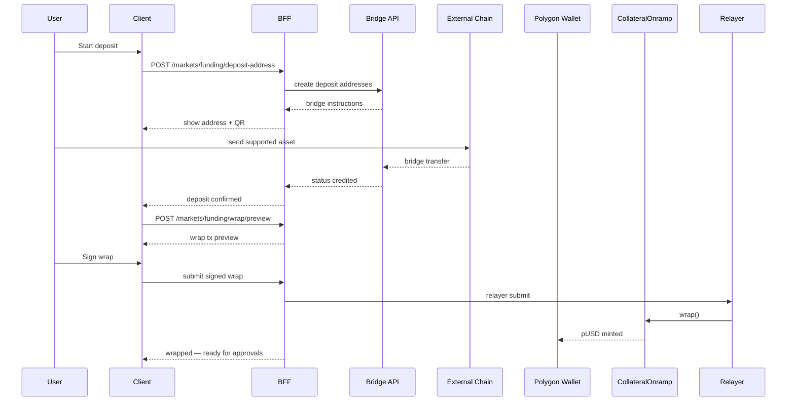

# FUNDS, DEPOSIT, AND WITHDRAWAL

**Status:** reviewed
**Owner:** platform-orchestrator
**Last updated:** 2026-07-25
**Product:** RetroPick Markets V1 — Wave 2 Polymarket Integration
**Wave:** 2 (implementation-grade upstream contract)

## Description

This document is the implementation-grade funding specification for Markets V1 Wave 2: distinct operations to fund a wallet, wrap to **pUSD**, approve venue contracts, trade elsewhere, unwrap/offramp, and withdraw—via Bridge API, direct Polygon transfer, CollateralOnramp, reconciliation, and UI state machines. Polymarket bridge and collateral contracts are authority; RetroPick orchestrates and reconciles only.

It sits in Wave 2 after wallet ACL and before order readiness. V2 trading collateral is pUSD; bridged USDC.e is not “ready to trade.” Token addresses come from the contract registry—never invented. polymarket.com-hosted deposit UX may be an external handoff, not a silent RetroPick API substitute.

Read this before any balance shows ready-to-trade, when building deposit/withdraw UX, or when migrating off legacy USDC.e trading paths. It is not order matching, not CTF redeem semantics, and not custodial balance invention by the BFF.

## 0. Developer intent (5W+1H)

Short orientation for implementers and agents. Read this before the normative sections below.

| Lens | Answer |
|------|--------|
| **Who** | Funding BFF owners, `fe-wallet` / web funding UI, Android fund flows, ops monitoring Bridge/onramp, agents implementing Phase 2 funding without custodial shortcuts. |
| **What** | Distinct ops: fund wallet → wrap to pUSD → approve → trade (elsewhere) → unwrap/offramp → withdraw. Bridge API, direct Polygon transfer, CollateralOnramp wrap, reconciliation, UI state machines. V2 collateral is **pUSD**. |
| **When** | Before any balance shows "ready to trade"; on deposit/withdraw UX; when migrating off legacy USDC.e trading paths; when Bridge or onramp upstream changes (EV-007, EV-009). |
| **Where** | Spec: this doc. Runtime: BFF Bridge/onramp clients; on-chain wrap/approve (user sign or relayer); UI state machine. Polymarket.com deposits remain external alternative. |
| **Why** | Users confuse "bridged USDC" with "tradable pUSD." RetroPick must not custody inventively or skip approvals. Polymarket bridge/collateral contracts are authority; RetroPick orchestrates and reconciles only. |
| **How** | Model six operations separately; proxy Bridge via BFF; wrap via documented onramp; approve Exchange/CTF; reconcile indexed balances; never invent token addresses — use [CONTRACT_ABI_AND_ADDRESS_REGISTRY.md](./CONTRACT_ABI_AND_ADDRESS_REGISTRY.md). |

### Worked example

**Happy path.** User requests Bridge deposit address via BFF → Bridge API. After funds arrive on Polygon, UI prompts wrap USDC.e → pUSD (`wrap()`), then approvals for Exchange V2 / CTF (relayer-assisted when authorized). Balances endpoint shows tradable pUSD; order ticket unlocks. Withdrawal: unwrap/offramp then Bridge out; each step has explicit UI state and reconciliation polls.

**Failure / degraded.** Showing "funded" on pre-wrap USDC.e while CLOB expects pUSD → blocked preview with reason. Bridge API down → degrade to documented direct transfer instructions; do not fabricate deposit addresses. Relayer approval failure → offer signed fallback, not silent skip. Reconciliation mismatch → `unknown` funding state, freeze withdraw/trade until resolved. Combos funding paths stay out of scope.

**Operation vs authority**

| Operation | Authority | RetroPick role |
|-----------|-----------|----------------|
| Bridge quote/address | Polymarket Bridge | BFF proxy + UI |
| pUSD wrap/unwrap | Collateral onramp contracts | Trigger + status |
| Approvals | User/relayer + venue contracts | Orchestrate |
| Trade collateral lock | CLOB/Exchange | Order lifecycle doc |

**UI state machine (orientation)**

1. `needs_deposit` — no/low Polygon assets for the account wallet.
2. `needs_wrap` — USDC.e (or equivalent) present, pUSD insufficient.
3. `needs_approval` — pUSD/CTF allowances missing for Exchange.
4. `ready_to_trade` — collateral + allowances OK (orders still need geoblock/auth).
5. `withdraw_pending` / `reconciling` — never show success until Bridge/on-chain evidence.

Agents must not treat polymarket.com-hosted deposit UX as a RetroPick API substitute without documenting the external handoff. Pair with wallet ACL doc before moving funds.

**Related docs:** [AUTHENTICATION_AND_ACCOUNT_WALLETS.md](./AUTHENTICATION_AND_ACCOUNT_WALLETS.md), [BUILDER_RELAYER_AND_FEES.md](./BUILDER_RELAYER_AND_FEES.md), [ORDER_LIFECYCLE.md](./ORDER_LIFECYCLE.md).

## 1. Purpose

Implementation-grade funding flows: bridge, direct transfer, pUSD wrap/onramp, approvals, withdrawal/offramp, reconciliation, and UI state machines.

## 2. Scope

### In scope

- RetroPick Markets V1 delivered through web, Go BFF (`apps/backend/internal/markets/`), and native Android Jetpack Compose.
- Wave 2 Polymarket upstream interfaces: Gamma, CLOB V2, Data API, Bridge API, Relayer, on-chain contracts (CTF, Exchange V2, Neg Risk, pUSD).
- Evidence-tagged, implementation-grade specifications for engineering agents.

### Out of scope

- PRISM protocol (`contracts/prism/`).
- Legacy epoch APIs (`/api/v1/legacy/markets/*`) — frozen per EV-003.
- Polymarket Perps APIs and perpetuals trading.
- Combos RFQ/requester trading — excluded per EV-013 and [COMBOS_CAPABILITY_GATE.md](./COMBOS_CAPABILITY_GATE.md).
- Custom RetroPick exchange or outcome-token issuance (ADR-001).
- Copying Polymarket proprietary UI, trademarks, or confidential behavior.
## 3. Prerequisites

- [00_DOCUMENT_MAP.md](../00_DOCUMENT_MAP.md)
- [.dev/MARKETS.md](../../MARKETS.md)
- [docs/ARCHITECTURE.md](../../../docs/ARCHITECTURE.md)
- [research/EVIDENCE_REGISTER.md](../research/EVIDENCE_REGISTER.md)
- [schemas/openapi/markets-v1.yaml](../../../schemas/openapi/markets-v1.yaml) (EV-005)
- Peer documents in [polymarket/](./)
## 4. Authoritative sources

| Source | URL | Retrieved | Evidence | Confidence |
|--------|-----|-----------|----------|------------|
| Documentation index | https://docs.polymarket.com/llms.txt | 2026-07-25 | EV-001 | partially_verified |
| CLOB V2 migration | https://docs.polymarket.com/v2-migration | 2026-07-25 | EV-001, EV-007, EV-010 | partially_verified |
| Contract registry | https://docs.polymarket.com/resources/contracts | 2026-07-25 | EV-008 | partially_verified |
| Wallets and authentication | https://docs.polymarket.com/trading/wallets-auth | 2026-07-25 | EV-009 | partially_verified |
| Deposit wallets | https://docs.polymarket.com/trading/deposit-wallets | 2026-07-25 | EV-009 | partially_verified |
| Builder program | https://docs.polymarket.com/programs/builders/overview | 2026-07-25 | EV-010 | partially_verified |
| Negative risk | https://docs.polymarket.com/concepts/negative-risk | 2026-07-25 | EV-012 | partially_verified |
| Rate limits (IP) | https://docs.polymarket.com/api-reference/rate-limits | 2026-07-25 | EV-011 | partially_verified |
| Trading rate limits | https://docs.polymarket.com/api-reference/trading-rate-limits | 2026-07-25 | EV-011 | partially_verified |
| Predictions API overview | https://docs.polymarket.com/api-reference/predictions/overview | 2026-07-25 | EV-001 | partially_verified |
| RetroPick OpenAPI | `schemas/openapi/markets-v1.yaml` | 2026-07-25 | EV-005 | verified |
| BFF module | `apps/backend/internal/markets/` | 2026-07-25 | EV-002 | verified |

## 5. Current state

- V2 collateral is pUSD (EV-007); legacy USDC.e paths deprecated for new trading.
- Bridge and onramp not wired in BFF.
- **MKT-P2-004-web (2026-08-09):** Sandbox funding page at `/markets/funding` (`apps/web/src/products/markets/funding/`). Requires Markets session; shows signer vs linked `accountWallet`; reads `GET /me/balances` with explicit 404/502 UX; deposit-wallet create/link calls `POST /account-wallet/preview` + `/relay` only when `NEXT_PUBLIC_MARKETS_ACCOUNT_WALLET_CREATE=1` and BFF is wired. **Not production-ready** — see [BLOCKERS_AND_HUMAN_APPROVALS.md](../agent-harness/BLOCKERS_AND_HUMAN_APPROVALS.md) Production wallet creation gate.

## 6. Target design

### 6.0 Web sandbox UX (MKT-P2-004-web)

| Property | Value |
|----------|-------|
| Route | `/markets/funding` (J05) |
| Code | `apps/web/src/products/markets/funding/` |
| Session | Required (`MarketsSession` cookie) before setup or balance reads |
| Chain | Polygon `137` only for mutating setup CTAs |

**BFF endpoints consumed (read-only unless noted):**

| Method | Path | When |
|--------|------|------|
| `GET` | `/markets/me/wallets` | Always when session authenticated |
| `GET` | `/markets/me/balances` | When primary `accountWallet` linked |
| `POST` | `/markets/account-wallet/preview` | Feature flag on + user starts setup |
| `POST` | `/markets/account-wallet/relay` | After mandatory preview modal + wallet signature |

**UI states:**

- Unauthenticated → connect + sign-in CTA; no funding API calls.
- No linked wallet → deposit wallet setup panel (unavailable when flag off or BFF 501).
- Balance 404 `account_not_linked` → account setup required (no invented balance).
- Balance 502 → venue degraded banner + retry.
- Linked + balance 200 → formatted pUSD `MoneyAmount` (display only).

**Explicit non-goals (this task):**

- Bridge deposit address, wrap/onramp, token approvals, order submit.
- Relayer API key or mnemonic capture in the client.
- Production wallet deploy without ops + security gate clearance.

**Feature flag:** `NEXT_PUBLIC_MARKETS_ACCOUNT_WALLET_CREATE=1` enables create/link attempts; default off shows graceful unavailable copy.


### 6.1 Distinct operations

1. **Fund wallet** — move assets to account wallet on Polygon.
2. **Wrap collateral** — USDC.e → pUSD via CollateralOnramp `wrap()` (EV-007).
3. **Approve operators** — pUSD + CTF approvals for Exchange V2.
4. **Trade** — separate order lifecycle doc.
5. **Unwrap/offramp** — pUSD → USDC.e or bridge out.
6. **Withdraw** — move to external destination via Bridge/offramp.

### 6.2 Supported paths (research 2026-07-25)

| Path | Initiator | Upstream | Sign | Relayer |
|------|-----------|----------|------|---------|
| Bridge deposit | User via BFF | Bridge API | no | no |
| Direct Polygon transfer | User | on-chain | yes | optional |
| pUSD wrap | User | CollateralOnramp | yes | yes |
| Polymarket.com deposit | External | polymarket UI | — | — |

### 6.3 UI state machine

```text
idle → quote_requested → address_displayed → awaiting_deposit → confirming
  → credited → wrap_preview → wrap_signing → wrapped → ready_to_trade
```

Withdrawal:

```text
idle → preview → sign → submitting → bridge_pending → completed | failed
```

### 6.4 Reconciliation sources

- Bridge `GET /status/{id}`
- CLOB `GET /deposits`, `GET /withdrawals`
- Chain indexer: Transfer events to account wallet
- pUSD `balanceOf(account_wallet)`

### 6.5 Failure scenarios

| Scenario | Detection | UX |
|----------|-----------|-----|
| Wrong chain | bridge status | Block + educate |
| Underfunded | balance check | Min deposit message |
| Stuck bridge | SLA timeout | Support ticket + hash |
| Wrap reverted | relayer tx fail | Retry with gas estimate |

### 6.7 BFF collateral balance read (MKT-P2-006 L2)

Read-only tradable pUSD display for funding UX. Code: `apps/backend/internal/markets/balances/`.

| Property | Value |
|----------|-------|
| BFF route | `GET /api/v1/markets/me/balances` (`listMyBalances`) |
| Upstream | CLOB `GET /balance-allowance?asset_type=COLLATERAL&signature_type={walletType}` |
| Auth | CLOB L2 HMAC (server-held `apiKey` / `secret` / `passphrase` per session signer) |
| Wallet resolution | Primary linked `accountWallet` from `GET /me/wallets` discovery — never client-supplied |
| `signature_type` | Maps OpenAPI `walletType`: EOA=0, POLY_PROXY=1, GNOSIS_SAFE=2, DEPOSIT_WALLET=3 |
| Response field | `collateral` only (`MoneyAmount`, 6 decimals, integer base units) — allowance not exposed |
| Timeout | 10s balance-read SLA; upstream failure → **502** `upstream_unavailable` |

**Fail-closed HTTP mapping:**

| Condition | BFF response |
|-----------|--------------|
| No session | 401 |
| No linked primary wallet | 404 `account_not_linked` |
| L2 store unwired / missing creds | 502 |
| CLOB timeout / 5xx / malformed payload | 502 |
| Never | Invent or cache-fabricate balances |

**Production wiring (G3 main handoff):**

```go
balances.RegisterRoutes(r, balances.NewProductionHandlerConfig(balances.ProductionConfig{
    Discoverer: wallet.NewDiscoverer(store, metrics),
    CLOBURL:    cfg.CLOBAPIURL,
    L2Store:    balances.UnwiredL2CredentialStore{}, // swap when L2 auth lands
}))
```

**Explicit non-goals:** `POST /balance-allowance/update`, bridge deposit create, wrap/onramp, token approvals, order submit.




## 7. Alternatives considered

| Alternative | Rejected because |
|-------------|------------------|
| Direct Gamma/CLOB from web/Android in production | ADR-002: schema churn, credential exposure, no central policy |
| Custom RetroPick exchange | ADR-001: Polymarket is venue authority |
| CLOB V1 SDK or V1-signed orders | EV-001: not supported on production after 2026-04-28 |
| USDC.e as default trading collateral post-V2 | EV-007: pUSD is V2 collateral |
| Hard-coded contract addresses without registry | EV-008: must verify at startup from official registry |
| Single `walletAddress` API field | ADR-003: conflates signer and account wallet |
| Combos trading in V1 | EV-013: incomplete upstream + legal/ops risk |
| Floating-point money in APIs | Precision loss; use fixed-point strings |
## 8. Decisions

| ID | Decision | Rationale |
|----|----------|-----------|
| D-01 | Polymarket is venue authority for matching, resolution, collateral | ADR-001 |
| D-02 | All production upstream HTTP/WebSocket from BFF only | ADR-002 |
| D-03 | User signs orders and asset txs; BFF never silent-signs | ADR-003 |
| D-04 | Shared OpenAPI contract for web and Android | ADR-004 |
| D-05 | `eligible: false` blocks all mutating trading endpoints | Fail closed |
| D-06 | Order submit timeout → `unknown_reconciling`, never auto-resubmit | Reconciliation safety |
| D-07 | Exchange selection from official market metadata, not titles | EV-012 |
| D-08 | Combos capability remains disabled until gate checklist passes | EV-013 |
| D-09 | Contract addresses loaded from EV-008 registry with bytecode verify | No invented addresses |
| D-10 | Builder code attached server-side during order preview assembly | EV-010 |
## 9. Data and control flows

See sequence. Withdrawal reverses via CollateralOfframp + Bridge withdrawal addresses.

## 10. Failure and recovery

| Failure domain | Detection | User-visible behavior | Recovery action |
|----------------|-----------|----------------------|-----------------|
| Gamma unavailable | 5xx, timeout, error rate | Stale catalog + banner | Serve cache; exponential backoff |
| CLOB market data down | /book errors | Empty book + retry CTA | Poll with jitter; fallback REST |
| CLOB L2 auth invalid | 401/403 | Re-auth prompt | L1 signature flow |
| Order submit timeout | client/BFF timer | `unknown_reconciling` state | Poll open orders + fills; user confirm |
| Relayer 429 | 429 response | Funding pending | Queue; respect 25/min submit limit |
| Bridge delay | status API stuck | In-progress funding UI | Poll bridge status; support playbook |
| Geo block | geoblock endpoint / policy | Read-only mode | Unsupported region UX |
| Registry mismatch | startup probe | Deploy blocked | Roll back config; ops alert |
| Engine restart | missing resting orders | Open orders may vanish upstream | Reconcile to cancelled or re-listed |

**MUST NOT:** silently resubmit orders after HTTP timeout; mark failed without reconciliation poll.
## 11. Security

- RetroPick MUST NOT receive, generate, store, log, or back up user seed phrases or raw private keys (ADR-003).
- Preview-before-sign for every collateral wrap, approval, transfer, split, merge, convert, redeem, withdrawal.
- Builder codes, relayer API keys, and CLOB L2 secrets: server-side only; never in mobile/web bundles.
- Production clients MUST NOT embed upstream base URLs for authenticated CLOB/relayer calls (ADR-002).
- Signed payload hash stored for audit; full signature redacted in logs.
- Session binding for web; Android attestation where platform supports it.
## 12. Observability

| Metric | Type | SLO / alert |
|--------|------|-------------|
| `markets_upstream_request_duration_ms` | histogram | p95 per upstream |
| `markets_upstream_errors_total` | counter | >1% 5m window |
| `markets_catalog_staleness_seconds` | gauge | >300s page |
| `markets_order_reconcile_lag_seconds` | histogram | p99 < 60s |
| `markets_capability_denied_total` | counter | anomaly detection |
| `markets_degraded_mode` | gauge | ==1 for 5m |

Structured logs: `correlation_id`, `user_session_id` (hashed), `upstream`, `evidence_id`, `operation`. Never log private keys, mnemonics, relayer secrets, or full EIP-712 payloads.
## 13. Test strategy

- **Contract:** OpenAPI conformance (EV-005) for every BFF route in this document's scope.
- **Integration:** Recorded cassettes against Gamma/CLOB/Data/Bridge sandboxes; no secrets in CI.
- **Security:** Signing boundary tests — BFF cannot produce valid order signature without client.
- **E2E:** [testing/END_TO_END_CRITICAL_JOURNEYS.md](../testing/END_TO_END_CRITICAL_JOURNEYS.md).
- **Chaos:** Upstream 429/5xx injection; verify degraded mode and no double-submit.
- **Registry:** Startup test with known-good and intentionally wrong bytecode hash.
## 14. Rollout and rollback

1. **Phase 1:** catalog + market data capabilities (`read_only`).
2. **Phase 2:** wallet connect + funding (`wallet`, `funding`).
3. **Phase 3:** order submit behind kill switch (`trade`).
4. **Phase 4:** portfolio, redemption, neg-risk convert (`portfolio`).

Rollback: flip capability flag in BFF config → clients poll `/markets/capabilities` (TTL ≤30s). Order kill switch stops new submits; does **not** cancel upstream resting orders.
## 15. Open questions

| ID | Question | Expiry | Owner |
|----|----------|--------|-------|
| OQ-01 | Go BFF: raw HTTP vs sidecar for CLOB signing helpers | 2026-08-15 | backend |
| OQ-02 | Android wallet connector (WalletConnect vs in-app WebView) | 2026-08-01 | mobile |
| OQ-03 | Minimum catalog freshness SLO at launch | 2026-08-01 | SRE |
| OQ-04 | Augmented neg-risk placeholder display policy | 2026-08-15 | product |

Full log: [research/OPEN_QUESTIONS_AND_EXPIRING_ASSUMPTIONS.md](../research/OPEN_QUESTIONS_AND_EXPIRING_ASSUMPTIONS.md).
## 16. Acceptance criteria

- [ ] All MUST requirements traced in [agent-harness/REQUIREMENTS_TO_TASK_TRACEABILITY.md](../agent-harness/REQUIREMENTS_TO_TASK_TRACEABILITY.md).
- [ ] Time-sensitive claims cite evidence ID (EV-xxx) with retrieval date 2026-07-25.
- [ ] No production contract address in app config without EV-008 verification pipeline.
- [ ] Mermaid diagrams render for specified flows.
- [ ] BFF-only vs client-forbidden endpoints explicitly classified.
- [ ] Phase gate evidence attached before implementation merge.

## 17. Evidence index

| ID | Claim | Source | Confidence | Consequence |
|----|-------|--------|------------|-------------|
| EV-001 | CLOB V2 is production trading API (live 2026-04-28) | https://docs.polymarket.com/v2-migration | partially_verified | V2 SDK/signing only |
| EV-002 | Markets BFF serves `/api/v1/markets/*` | `apps/backend/internal/markets/` | verified | Client integration surface |
| EV-003 | Legacy epoch frozen | `docs/ARCHITECTURE.md` | verified | No legacy extension |
| EV-005 | OpenAPI `markets-v1.yaml` canonical | repo | verified | Codegen/conformance |
| EV-007 | pUSD replaces USDC.e as V2 collateral | https://docs.polymarket.com/v2-migration | partially_verified | Wrap/onramp/funding |
| EV-008 | Official contract registry (Polygon 137) | https://docs.polymarket.com/resources/contracts | partially_verified | Load + verify at startup |
| EV-009 | Deposit Wallet default for accounts deployed ≥ 2026-05-04 | https://docs.polymarket.com/trading/wallets-auth | partially_verified | Wallet-type matrix |
| EV-010 | Builder attribution via `builder` bytes32 on signed order | https://docs.polymarket.com/v2-migration | partially_verified | Replaces V1 HMAC headers |
| EV-011 | Cloudflare IP limits + per-signer trading buckets | https://docs.polymarket.com/api-reference/rate-limits | partially_verified | BFF rate governance |
| EV-012 | Neg Risk uses separate exchange + adapter | https://docs.polymarket.com/concepts/negative-risk | partially_verified | Per-market exchange select |
| EV-013 | Combos requester/maker not V1 | https://docs.polymarket.com/api-reference/combo-markets/get-combo-markets | partially_verified | `combos.enabled=false` |

**Revalidation triggers:** Polymarket changelog, SDK major version, contract registry diff, geoblock policy, Builder program terms.

## 18. Related documents

| Direction | Document | Relationship |
|-----------|----------|--------------|
| Upstream | [research/EVIDENCE_REGISTER.md](../research/EVIDENCE_REGISTER.md) | Master evidence |
| Upstream | [research/POLYMARKET_CURRENT_STATE.md](../research/POLYMARKET_CURRENT_STATE.md) | Research baseline |
| Peer | [polymarket/](./) | Wave 2 integration set |
| Downstream | [backend/BACKEND_ARCHITECTURE.md](../backend/BACKEND_ARCHITECTURE.md) | BFF modules |
| Downstream | [backend/DOMAIN_MODEL_AND_STATE_MACHINES.md](../backend/DOMAIN_MODEL_AND_STATE_MACHINES.md) | State machines |
| Downstream | [backend/API_AND_REALTIME_CONTRACTS.md](../backend/API_AND_REALTIME_CONTRACTS.md) | RetroPick API |
| Downstream | [backend/CACHE_QUEUE_AND_RATE_LIMITING.md](../backend/CACHE_QUEUE_AND_RATE_LIMITING.md) | Throttles |
| Downstream | [testing/MASTER_TEST_PLAN.md](../testing/MASTER_TEST_PLAN.md) | Verification |
| ADR | [ADR-002](../architecture/adr/ADR-002-POLYMARKET-ANTI-CORRUPTION-LAYER.md) | BFF boundary |
| ADR | [ADR-003](../architecture/adr/ADR-003-WALLET-AND-SIGNING-MODEL.md) | Signing |

## Appendix A. Endpoint and field reference (Wave 2)

| REF-0001 | Implementation agent MUST cross-check field semantics, auth class, and error codes against https://docs.polymarket.com/llms.txt before coding. |
| REF-0002 | Implementation agent MUST cross-check field semantics, auth class, and error codes against https://docs.polymarket.com/llms.txt before coding. |
| REF-0003 | Implementation agent MUST cross-check field semantics, auth class, and error codes against https://docs.polymarket.com/llms.txt before coding. |
| REF-0004 | Implementation agent MUST cross-check field semantics, auth class, and error codes against https://docs.polymarket.com/llms.txt before coding. |
| REF-0005 | Implementation agent MUST cross-check field semantics, auth class, and error codes against https://docs.polymarket.com/llms.txt before coding. |
| REF-0006 | Implementation agent MUST cross-check field semantics, auth class, and error codes against https://docs.polymarket.com/llms.txt before coding. |
| REF-0007 | Implementation agent MUST cross-check field semantics, auth class, and error codes against https://docs.polymarket.com/llms.txt before coding. |
| REF-0008 | Implementation agent MUST cross-check field semantics, auth class, and error codes against https://docs.polymarket.com/llms.txt before coding. |
| REF-0009 | Implementation agent MUST cross-check field semantics, auth class, and error codes against https://docs.polymarket.com/llms.txt before coding. |
| REF-0010 | Implementation agent MUST cross-check field semantics, auth class, and error codes against https://docs.polymarket.com/llms.txt before coding. |
| REF-0011 | Implementation agent MUST cross-check field semantics, auth class, and error codes against https://docs.polymarket.com/llms.txt before coding. |
| REF-0012 | Implementation agent MUST cross-check field semantics, auth class, and error codes against https://docs.polymarket.com/llms.txt before coding. |
| REF-0013 | Implementation agent MUST cross-check field semantics, auth class, and error codes against https://docs.polymarket.com/llms.txt before coding. |
| REF-0014 | Implementation agent MUST cross-check field semantics, auth class, and error codes against https://docs.polymarket.com/llms.txt before coding. |
| REF-0015 | Implementation agent MUST cross-check field semantics, auth class, and error codes against https://docs.polymarket.com/llms.txt before coding. |
| REF-0016 | Implementation agent MUST cross-check field semantics, auth class, and error codes against https://docs.polymarket.com/llms.txt before coding. |
| REF-0017 | Implementation agent MUST cross-check field semantics, auth class, and error codes against https://docs.polymarket.com/llms.txt before coding. |
| REF-0018 | Implementation agent MUST cross-check field semantics, auth class, and error codes against https://docs.polymarket.com/llms.txt before coding. |
| REF-0019 | Implementation agent MUST cross-check field semantics, auth class, and error codes against https://docs.polymarket.com/llms.txt before coding. |
| REF-0020 | Implementation agent MUST cross-check field semantics, auth class, and error codes against https://docs.polymarket.com/llms.txt before coding. |
| REF-0021 | Implementation agent MUST cross-check field semantics, auth class, and error codes against https://docs.polymarket.com/llms.txt before coding. |
| REF-0022 | Implementation agent MUST cross-check field semantics, auth class, and error codes against https://docs.polymarket.com/llms.txt before coding. |
| REF-0023 | Implementation agent MUST cross-check field semantics, auth class, and error codes against https://docs.polymarket.com/llms.txt before coding. |
| REF-0024 | Implementation agent MUST cross-check field semantics, auth class, and error codes against https://docs.polymarket.com/llms.txt before coding. |
| REF-0025 | Implementation agent MUST cross-check field semantics, auth class, and error codes against https://docs.polymarket.com/llms.txt before coding. |
| REF-0026 | Implementation agent MUST cross-check field semantics, auth class, and error codes against https://docs.polymarket.com/llms.txt before coding. |
| REF-0027 | Implementation agent MUST cross-check field semantics, auth class, and error codes against https://docs.polymarket.com/llms.txt before coding. |
| REF-0028 | Implementation agent MUST cross-check field semantics, auth class, and error codes against https://docs.polymarket.com/llms.txt before coding. |
| REF-0029 | Implementation agent MUST cross-check field semantics, auth class, and error codes against https://docs.polymarket.com/llms.txt before coding. |
| REF-0030 | Implementation agent MUST cross-check field semantics, auth class, and error codes against https://docs.polymarket.com/llms.txt before coding. |
| REF-0031 | Implementation agent MUST cross-check field semantics, auth class, and error codes against https://docs.polymarket.com/llms.txt before coding. |
| REF-0032 | Implementation agent MUST cross-check field semantics, auth class, and error codes against https://docs.polymarket.com/llms.txt before coding. |
| REF-0033 | Implementation agent MUST cross-check field semantics, auth class, and error codes against https://docs.polymarket.com/llms.txt before coding. |
| REF-0034 | Implementation agent MUST cross-check field semantics, auth class, and error codes against https://docs.polymarket.com/llms.txt before coding. |
| REF-0035 | Implementation agent MUST cross-check field semantics, auth class, and error codes against https://docs.polymarket.com/llms.txt before coding. |
| REF-0036 | Implementation agent MUST cross-check field semantics, auth class, and error codes against https://docs.polymarket.com/llms.txt before coding. |
| REF-0037 | Implementation agent MUST cross-check field semantics, auth class, and error codes against https://docs.polymarket.com/llms.txt before coding. |
| REF-0038 | Implementation agent MUST cross-check field semantics, auth class, and error codes against https://docs.polymarket.com/llms.txt before coding. |
| REF-0039 | Implementation agent MUST cross-check field semantics, auth class, and error codes against https://docs.polymarket.com/llms.txt before coding. |
| REF-0040 | Implementation agent MUST cross-check field semantics, auth class, and error codes against https://docs.polymarket.com/llms.txt before coding. |
| REF-0041 | Implementation agent MUST cross-check field semantics, auth class, and error codes against https://docs.polymarket.com/llms.txt before coding. |
| REF-0042 | Implementation agent MUST cross-check field semantics, auth class, and error codes against https://docs.polymarket.com/llms.txt before coding. |
| REF-0043 | Implementation agent MUST cross-check field semantics, auth class, and error codes against https://docs.polymarket.com/llms.txt before coding. |
| REF-0044 | Implementation agent MUST cross-check field semantics, auth class, and error codes against https://docs.polymarket.com/llms.txt before coding. |
| REF-0045 | Implementation agent MUST cross-check field semantics, auth class, and error codes against https://docs.polymarket.com/llms.txt before coding. |
| REF-0046 | Implementation agent MUST cross-check field semantics, auth class, and error codes against https://docs.polymarket.com/llms.txt before coding. |
| REF-0047 | Implementation agent MUST cross-check field semantics, auth class, and error codes against https://docs.polymarket.com/llms.txt before coding. |
| REF-0048 | Implementation agent MUST cross-check field semantics, auth class, and error codes against https://docs.polymarket.com/llms.txt before coding. |
| REF-0049 | Implementation agent MUST cross-check field semantics, auth class, and error codes against https://docs.polymarket.com/llms.txt before coding. |
| REF-0050 | Implementation agent MUST cross-check field semantics, auth class, and error codes against https://docs.polymarket.com/llms.txt before coding. |
| REF-0051 | Implementation agent MUST cross-check field semantics, auth class, and error codes against https://docs.polymarket.com/llms.txt before coding. |
| REF-0052 | Implementation agent MUST cross-check field semantics, auth class, and error codes against https://docs.polymarket.com/llms.txt before coding. |
| REF-0053 | Implementation agent MUST cross-check field semantics, auth class, and error codes against https://docs.polymarket.com/llms.txt before coding. |
| REF-0054 | Implementation agent MUST cross-check field semantics, auth class, and error codes against https://docs.polymarket.com/llms.txt before coding. |
| REF-0055 | Implementation agent MUST cross-check field semantics, auth class, and error codes against https://docs.polymarket.com/llms.txt before coding. |
| REF-0056 | Implementation agent MUST cross-check field semantics, auth class, and error codes against https://docs.polymarket.com/llms.txt before coding. |
| REF-0057 | Implementation agent MUST cross-check field semantics, auth class, and error codes against https://docs.polymarket.com/llms.txt before coding. |
| REF-0058 | Implementation agent MUST cross-check field semantics, auth class, and error codes against https://docs.polymarket.com/llms.txt before coding. |
| REF-0059 | Implementation agent MUST cross-check field semantics, auth class, and error codes against https://docs.polymarket.com/llms.txt before coding. |
| REF-0060 | Implementation agent MUST cross-check field semantics, auth class, and error codes against https://docs.polymarket.com/llms.txt before coding. |
| REF-0061 | Implementation agent MUST cross-check field semantics, auth class, and error codes against https://docs.polymarket.com/llms.txt before coding. |
| REF-0062 | Implementation agent MUST cross-check field semantics, auth class, and error codes against https://docs.polymarket.com/llms.txt before coding. |
| REF-0063 | Implementation agent MUST cross-check field semantics, auth class, and error codes against https://docs.polymarket.com/llms.txt before coding. |
| REF-0064 | Implementation agent MUST cross-check field semantics, auth class, and error codes against https://docs.polymarket.com/llms.txt before coding. |
| REF-0065 | Implementation agent MUST cross-check field semantics, auth class, and error codes against https://docs.polymarket.com/llms.txt before coding. |
| REF-0066 | Implementation agent MUST cross-check field semantics, auth class, and error codes against https://docs.polymarket.com/llms.txt before coding. |
| REF-0067 | Implementation agent MUST cross-check field semantics, auth class, and error codes against https://docs.polymarket.com/llms.txt before coding. |
| REF-0068 | Implementation agent MUST cross-check field semantics, auth class, and error codes against https://docs.polymarket.com/llms.txt before coding. |
| REF-0069 | Implementation agent MUST cross-check field semantics, auth class, and error codes against https://docs.polymarket.com/llms.txt before coding. |
| REF-0070 | Implementation agent MUST cross-check field semantics, auth class, and error codes against https://docs.polymarket.com/llms.txt before coding. |
| REF-0071 | Implementation agent MUST cross-check field semantics, auth class, and error codes against https://docs.polymarket.com/llms.txt before coding. |
| REF-0072 | Implementation agent MUST cross-check field semantics, auth class, and error codes against https://docs.polymarket.com/llms.txt before coding. |
| REF-0073 | Implementation agent MUST cross-check field semantics, auth class, and error codes against https://docs.polymarket.com/llms.txt before coding. |
| REF-0074 | Implementation agent MUST cross-check field semantics, auth class, and error codes against https://docs.polymarket.com/llms.txt before coding. |
| REF-0075 | Implementation agent MUST cross-check field semantics, auth class, and error codes against https://docs.polymarket.com/llms.txt before coding. |
| REF-0076 | Implementation agent MUST cross-check field semantics, auth class, and error codes against https://docs.polymarket.com/llms.txt before coding. |
| REF-0077 | Implementation agent MUST cross-check field semantics, auth class, and error codes against https://docs.polymarket.com/llms.txt before coding. |
| REF-0078 | Implementation agent MUST cross-check field semantics, auth class, and error codes against https://docs.polymarket.com/llms.txt before coding. |
| REF-0079 | Implementation agent MUST cross-check field semantics, auth class, and error codes against https://docs.polymarket.com/llms.txt before coding. |
| REF-0080 | Implementation agent MUST cross-check field semantics, auth class, and error codes against https://docs.polymarket.com/llms.txt before coding. |
| REF-0081 | Implementation agent MUST cross-check field semantics, auth class, and error codes against https://docs.polymarket.com/llms.txt before coding. |
| REF-0082 | Implementation agent MUST cross-check field semantics, auth class, and error codes against https://docs.polymarket.com/llms.txt before coding. |
| REF-0083 | Implementation agent MUST cross-check field semantics, auth class, and error codes against https://docs.polymarket.com/llms.txt before coding. |
| REF-0084 | Implementation agent MUST cross-check field semantics, auth class, and error codes against https://docs.polymarket.com/llms.txt before coding. |
| REF-0085 | Implementation agent MUST cross-check field semantics, auth class, and error codes against https://docs.polymarket.com/llms.txt before coding. |
| REF-0086 | Implementation agent MUST cross-check field semantics, auth class, and error codes against https://docs.polymarket.com/llms.txt before coding. |
| REF-0087 | Implementation agent MUST cross-check field semantics, auth class, and error codes against https://docs.polymarket.com/llms.txt before coding. |
| REF-0088 | Implementation agent MUST cross-check field semantics, auth class, and error codes against https://docs.polymarket.com/llms.txt before coding. |
| REF-0089 | Implementation agent MUST cross-check field semantics, auth class, and error codes against https://docs.polymarket.com/llms.txt before coding. |
| REF-0090 | Implementation agent MUST cross-check field semantics, auth class, and error codes against https://docs.polymarket.com/llms.txt before coding. |
| REF-0091 | Implementation agent MUST cross-check field semantics, auth class, and error codes against https://docs.polymarket.com/llms.txt before coding. |
| REF-0092 | Implementation agent MUST cross-check field semantics, auth class, and error codes against https://docs.polymarket.com/llms.txt before coding. |
| REF-0093 | Implementation agent MUST cross-check field semantics, auth class, and error codes against https://docs.polymarket.com/llms.txt before coding. |
| REF-0094 | Implementation agent MUST cross-check field semantics, auth class, and error codes against https://docs.polymarket.com/llms.txt before coding. |
| REF-0095 | Implementation agent MUST cross-check field semantics, auth class, and error codes against https://docs.polymarket.com/llms.txt before coding. |
| REF-0096 | Implementation agent MUST cross-check field semantics, auth class, and error codes against https://docs.polymarket.com/llms.txt before coding. |
| REF-0097 | Implementation agent MUST cross-check field semantics, auth class, and error codes against https://docs.polymarket.com/llms.txt before coding. |
| REF-0098 | Implementation agent MUST cross-check field semantics, auth class, and error codes against https://docs.polymarket.com/llms.txt before coding. |
| REF-0099 | Implementation agent MUST cross-check field semantics, auth class, and error codes against https://docs.polymarket.com/llms.txt before coding. |
| REF-0100 | Implementation agent MUST cross-check field semantics, auth class, and error codes against https://docs.polymarket.com/llms.txt before coding. |
| REF-0101 | Implementation agent MUST cross-check field semantics, auth class, and error codes against https://docs.polymarket.com/llms.txt before coding. |
| REF-0102 | Implementation agent MUST cross-check field semantics, auth class, and error codes against https://docs.polymarket.com/llms.txt before coding. |
| REF-0103 | Implementation agent MUST cross-check field semantics, auth class, and error codes against https://docs.polymarket.com/llms.txt before coding. |
| REF-0104 | Implementation agent MUST cross-check field semantics, auth class, and error codes against https://docs.polymarket.com/llms.txt before coding. |
| REF-0105 | Implementation agent MUST cross-check field semantics, auth class, and error codes against https://docs.polymarket.com/llms.txt before coding. |
| REF-0106 | Implementation agent MUST cross-check field semantics, auth class, and error codes against https://docs.polymarket.com/llms.txt before coding. |
