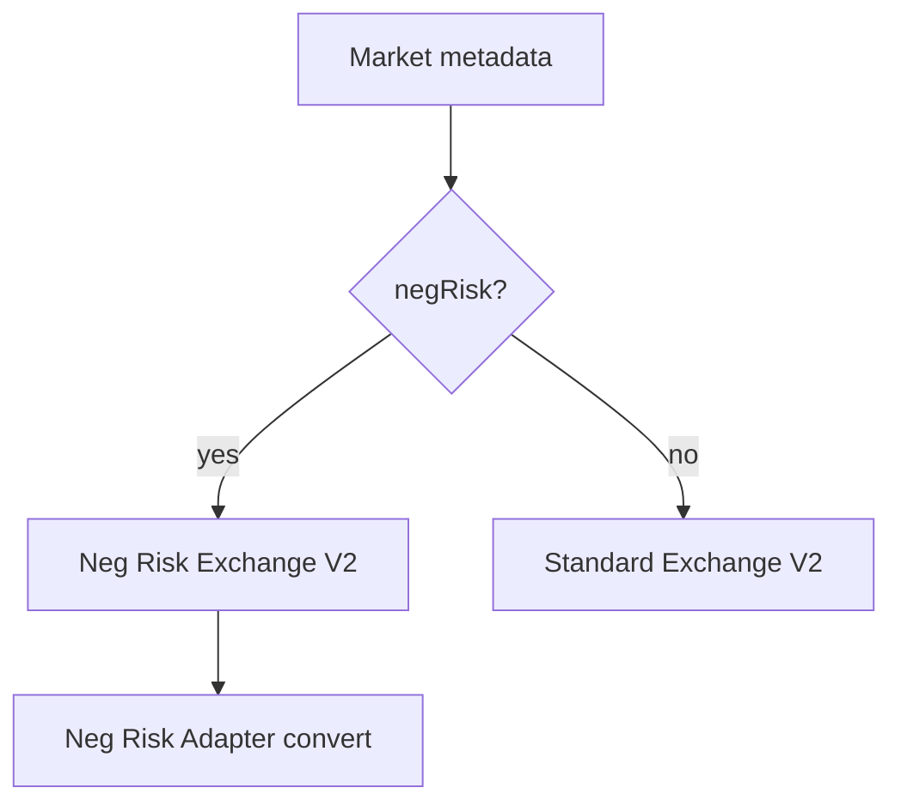

# NEGATIVE RISK AND AUGMENTED MARKETS

**Status:** reviewed
**Owner:** platform-orchestrator
**Last updated:** 2026-07-25
**Product:** RetroPick Markets V1 — Wave 2 Polymarket Integration
**Wave:** 2 (implementation-grade upstream contract)

## Description

This document specifies negative-risk multi-outcome mechanics, augmented placeholders/“Other” rules, detection via official `negRisk` fields, adapter `convert` semantics, and BFF trading rules for Markets V1 Wave 2. Venue rules are Polymarket’s; RetroPick must not infer neg-risk from titles or invent adapter addresses.

It sits in Wave 2 between catalog ingest, order assembly, and CTF/relayer paths. Orders for `negRisk: true` markets bind to the Neg Risk CTF Exchange domain from the verified contract registry; standard markets use Exchange V2. Placeholders stay hidden until named; aggressive “Other” trading against upstream guidance is blocked.

Read this for any market with `negRisk: true`, before signing (domain/exchange selection), and before offering convert UX. Prefer [CONTRACT_ABI_AND_ADDRESS_REGISTRY.md](./CONTRACT_ABI_AND_ADDRESS_REGISTRY.md) for addresses and [POSITIONS_CTF_AND_REDEMPTION.md](./POSITIONS_CTF_AND_REDEMPTION.md) for post-convert portfolio refresh—not for title heuristics or Combos.

## 0. Developer intent (5W+1H)

Short orientation for implementers and agents. Read this before the normative sections below.

| Lens | Answer |
|------|--------|
| **Who** | Catalog ingest + order assembly engineers, market UI, agents selecting Exchange vs Neg Risk Exchange, CTF convert/relayer callers. |
| **What** | Negative-risk multi-outcome mechanics, augmented placeholders/"Other" rules, detection via official `negRisk` fields, adapter `convert` semantics, and BFF trading rules. |
| **When** | Any market with `negRisk: true`; before signing orders (domain/exchange selection); before offering convert UX; when EV-012 guidance updates. |
| **Where** | Spec: this doc. Flags: Gamma/CLOB `getClobMarketInfo()`. Settlement: Neg Risk CTF Exchange + adapter per [CONTRACT_ABI_AND_ADDRESS_REGISTRY.md](./CONTRACT_ABI_AND_ADDRESS_REGISTRY.md) (verify — do not invent). |
| **Why** | Wrong exchange or treating No-on-A as ordinary binary breaks settlement. Inferring neg-risk from titles causes mis-routing. Augmented "Other"/placeholders are easy to mis-trade. Venue rules are Polymarket's. |
| **How** | Detect only via official fields; route orders to Neg Risk exchange when flagged; expose convert via relayer/CTF paths; UI trades named outcomes; hide placeholders until named; avoid direct "Other" trading per upstream guidance. |

### Worked example

**Happy path.** Ingest sets `negRisk` from Gamma. UI shows multi-outcome event. User buys Yes on outcome B; BFF selects Neg Risk CTF Exchange domain for EIP-712. Later user holds No on A and converts → Yes on all other outcomes via documented adapter `convert`, optionally gasless through relayer. Named outcomes only appear as primary tickets; placeholders stay hidden.

**Failure / degraded.** Title contains "election" so agent sets `negRisk=true` without field → reject. Order signed against standard CTF Exchange for a neg-risk market → upstream reject / funds risk — assembly tests must bind exchange to flags. Trading placeholder or "Other" aggressively against guidance → product block. Missing registry verification for Neg Risk exchange → trading blocked. Combos remain unrelated and excluded.

**Routing rules (agents)**

| Signal | Action |
|--------|--------|
| `negRisk: true` | Use Neg Risk exchange + domains |
| `negRisk: false` / absent | Standard Exchange V2 |
| Placeholder outcomes | Hide until named |
| Infer from title | **Forbidden** |

**Convert semantics (orientation):** under negative risk, a No share in market A can convert into Yes shares across the complementary outcomes via the Neg Risk adapter — this is venue inventory math, not a RetroPick inventiveness layer. UI must explain convert as a Polymarket operation. Augmented markets add named outcomes + placeholders + explicit Other; follow Polymarket guidance to prefer named outcomes and keep placeholders non-tradable until clarified.

**Test focus:** golden fixtures should cover (a) standard market → Exchange V2 domain, (b) `negRisk: true` → Neg Risk exchange domain, (c) title-only heuristic rejected, (d) placeholder outcomes hidden. Convert tests belong with relayer/CTF, not with inventing adapter addresses.

**Portfolio coupling:** after convert, position projections must refresh from Data API/on-chain before offering another convert or redeem. Do not locally synthesize Yes bags without venue confirmation.

**Augmented market UX:** show event-level mutual exclusivity; explain that only one outcome wins. Keep "Other" education copy short and non-gambling. Placeholders must not appear as priced tickets until named by venue metadata.

**Registry dependency:** never embed Neg Risk exchange literals in order code — load from the verified contract registry after bytecode checks.

**Related docs:** [CONTRACT_ABI_AND_ADDRESS_REGISTRY.md](./CONTRACT_ABI_AND_ADDRESS_REGISTRY.md), [ORDER_LIFECYCLE.md](./ORDER_LIFECYCLE.md), [POSITIONS_CTF_AND_REDEMPTION.md](./POSITIONS_CTF_AND_REDEMPTION.md).

## 1. Purpose
Neg risk mechanics, augmented placeholders, exchange/adapter selection, trading rules.

## 2. Scope

### In scope

- RetroPick Markets V1 delivered through web, Go BFF (`apps/backend/internal/markets/`), and native Android Jetpack Compose.
- Wave 2 Polymarket upstream interfaces: Gamma, CLOB V2, Data API, Bridge API, Relayer, on-chain contracts (CTF, Exchange V2, Neg Risk, pUSD).
- Evidence-tagged, implementation-grade specifications for engineering agents.

### Out of scope

- PRISM protocol (`contracts/prism/`).
- Legacy epoch APIs (`/api/v1/legacy/markets/*`) — frozen per EV-003.
- Polymarket Perps APIs and perpetuals trading.
- Combos RFQ/requester trading — excluded per EV-013 and [COMBOS_CAPABILITY_GATE.md](./COMBOS_CAPABILITY_GATE.md).
- Custom RetroPick exchange or outcome-token issuance (ADR-001).
- Copying Polymarket proprietary UI, trademarks, or confidential behavior.
## 3. Prerequisites

- [00_DOCUMENT_MAP.md](../00_DOCUMENT_MAP.md)
- [.dev/MARKETS.md](../../MARKETS.md)
- [docs/ARCHITECTURE.md](../../../docs/ARCHITECTURE.md)
- [research/EVIDENCE_REGISTER.md](../research/EVIDENCE_REGISTER.md)
- [schemas/openapi/markets-v1.yaml](../../../schemas/openapi/markets-v1.yaml) (EV-005)
- Peer documents in [polymarket/](./)
## 4. Authoritative sources

| Source | URL | Retrieved | Evidence | Confidence |
|--------|-----|-----------|----------|------------|
| Documentation index | https://docs.polymarket.com/llms.txt | 2026-07-25 | EV-001 | partially_verified |
| CLOB V2 migration | https://docs.polymarket.com/v2-migration | 2026-07-25 | EV-001, EV-007, EV-010 | partially_verified |
| Contract registry | https://docs.polymarket.com/resources/contracts | 2026-07-25 | EV-008 | partially_verified |
| Wallets and authentication | https://docs.polymarket.com/trading/wallets-auth | 2026-07-25 | EV-009 | partially_verified |
| Deposit wallets | https://docs.polymarket.com/trading/deposit-wallets | 2026-07-25 | EV-009 | partially_verified |
| Builder program | https://docs.polymarket.com/programs/builders/overview | 2026-07-25 | EV-010 | partially_verified |
| Negative risk | https://docs.polymarket.com/concepts/negative-risk | 2026-07-25 | EV-012 | partially_verified |
| Rate limits (IP) | https://docs.polymarket.com/api-reference/rate-limits | 2026-07-25 | EV-011 | partially_verified |
| Trading rate limits | https://docs.polymarket.com/api-reference/trading-rate-limits | 2026-07-25 | EV-011 | partially_verified |
| Predictions API overview | https://docs.polymarket.com/api-reference/predictions/overview | 2026-07-25 | EV-001 | partially_verified |
| RetroPick OpenAPI | `schemas/openapi/markets-v1.yaml` | 2026-07-25 | EV-005 | verified |
| BFF module | `apps/backend/internal/markets/` | 2026-07-25 | EV-002 | verified |
## 5. Current state
Flags not yet parsed from Gamma ingest.
## 6. Target design

### 6.1 Negative risk (EV-012)

Multi-outcome events where only one wins. **No** share in market A converts to Yes in all other markets via Neg Risk Adapter.

- Uses **Neg Risk CTF Exchange** (`0xe222...` per EV-008 — verify at impl).
- `convert` operation: 1 No on outcome A → 1 Yes on every other outcome.

### 6.2 Detection

Use official fields from Gamma/CLOB `getClobMarketInfo()`:

- `negRisk: true`
- `negRiskMarketID` / event grouping

**MUST NOT** infer from titles.

### 6.3 Augmented negative risk

- Named outcomes + placeholders + explicit Other.
- **Trade named outcomes only** per Polymarket guidance.
- Placeholders hidden in UI until named.
- Avoid trading "Other" directly — definition narrows as placeholders clarify.

### 6.4 BFF behavior

| Condition | UI/BFF |
|-----------|--------|
| placeholder outcome | exclude from trade picker |
| neg_risk convert available | show convert preview |
| standard market | standard exchange |

## 7. Alternatives considered

| Alternative | Rejected because |
|-------------|------------------|
| Direct Gamma/CLOB from web/Android in production | ADR-002: schema churn, credential exposure, no central policy |
| Custom RetroPick exchange | ADR-001: Polymarket is venue authority |
| CLOB V1 SDK or V1-signed orders | EV-001: not supported on production after 2026-04-28 |
| USDC.e as default trading collateral post-V2 | EV-007: pUSD is V2 collateral |
| Hard-coded contract addresses without registry | EV-008: must verify at startup from official registry |
| Single `walletAddress` API field | ADR-003: conflates signer and account wallet |
| Combos trading in V1 | EV-013: incomplete upstream + legal/ops risk |
| Floating-point money in APIs | Precision loss; use fixed-point strings |
## 8. Decisions

| ID | Decision | Rationale |
|----|----------|-----------|
| D-01 | Polymarket is venue authority for matching, resolution, collateral | ADR-001 |
| D-02 | All production upstream HTTP/WebSocket from BFF only | ADR-002 |
| D-03 | User signs orders and asset txs; BFF never silent-signs | ADR-003 |
| D-04 | Shared OpenAPI contract for web and Android | ADR-004 |
| D-05 | `eligible: false` blocks all mutating trading endpoints | Fail closed |
| D-06 | Order submit timeout → `unknown_reconciling`, never auto-resubmit | Reconciliation safety |
| D-07 | Exchange selection from official market metadata, not titles | EV-012 |
| D-08 | Combos capability remains disabled until gate checklist passes | EV-013 |
| D-09 | Contract addresses loaded from EV-008 registry with bytecode verify | No invented addresses |
| D-10 | Builder code attached server-side during order preview assembly | EV-010 |
## 9. Data and control flows
Ingest stores `neg_risk` on market row → order preview selects verifyingContract + exchange.
## 10. Failure and recovery

| Failure domain | Detection | User-visible behavior | Recovery action |
|----------------|-----------|----------------------|-----------------|
| Gamma unavailable | 5xx, timeout, error rate | Stale catalog + banner | Serve cache; exponential backoff |
| CLOB market data down | /book errors | Empty book + retry CTA | Poll with jitter; fallback REST |
| CLOB L2 auth invalid | 401/403 | Re-auth prompt | L1 signature flow |
| Order submit timeout | client/BFF timer | `unknown_reconciling` state | Poll open orders + fills; user confirm |
| Relayer 429 | 429 response | Funding pending | Queue; respect 25/min submit limit |
| Bridge delay | status API stuck | In-progress funding UI | Poll bridge status; support playbook |
| Geo block | geoblock endpoint / policy | Read-only mode | Unsupported region UX |
| Registry mismatch | startup probe | Deploy blocked | Roll back config; ops alert |
| Engine restart | missing resting orders | Open orders may vanish upstream | Reconcile to cancelled or re-listed |

**MUST NOT:** silently resubmit orders after HTTP timeout; mark failed without reconciliation poll.
## 11. Security

- RetroPick MUST NOT receive, generate, store, log, or back up user seed phrases or raw private keys (ADR-003).
- Preview-before-sign for every collateral wrap, approval, transfer, split, merge, convert, redeem, withdrawal.
- Builder codes, relayer API keys, and CLOB L2 secrets: server-side only; never in mobile/web bundles.
- Production clients MUST NOT embed upstream base URLs for authenticated CLOB/relayer calls (ADR-002).
- Signed payload hash stored for audit; full signature redacted in logs.
- Session binding for web; Android attestation where platform supports it.
## 12. Observability

| Metric | Type | SLO / alert |
|--------|------|-------------|
| `markets_upstream_request_duration_ms` | histogram | p95 per upstream |
| `markets_upstream_errors_total` | counter | >1% 5m window |
| `markets_catalog_staleness_seconds` | gauge | >300s page |
| `markets_order_reconcile_lag_seconds` | histogram | p99 < 60s |
| `markets_capability_denied_total` | counter | anomaly detection |
| `markets_degraded_mode` | gauge | ==1 for 5m |

Structured logs: `correlation_id`, `user_session_id` (hashed), `upstream`, `evidence_id`, `operation`. Never log private keys, mnemonics, relayer secrets, or full EIP-712 payloads.
## 13. Test strategy

- **Contract:** OpenAPI conformance (EV-005) for every BFF route in this document's scope.
- **Integration:** Recorded cassettes against Gamma/CLOB/Data/Bridge sandboxes; no secrets in CI.
- **Security:** Signing boundary tests — BFF cannot produce valid order signature without client.
- **E2E:** [testing/END_TO_END_CRITICAL_JOURNEYS.md](../testing/END_TO_END_CRITICAL_JOURNEYS.md).
- **Chaos:** Upstream 429/5xx injection; verify degraded mode and no double-submit.
- **Registry:** Startup test with known-good and intentionally wrong bytecode hash.
## 14. Rollout and rollback

1. **Phase 1:** catalog + market data capabilities (`read_only`).
2. **Phase 2:** wallet connect + funding (`wallet`, `funding`).
3. **Phase 3:** order submit behind kill switch (`trade`).
4. **Phase 4:** portfolio, redemption, neg-risk convert (`portfolio`).

Rollback: flip capability flag in BFF config → clients poll `/markets/capabilities` (TTL ≤30s). Order kill switch stops new submits; does **not** cancel upstream resting orders.
## 15. Open questions

| ID | Question | Expiry | Owner |
|----|----------|--------|-------|
| OQ-01 | Go BFF: raw HTTP vs sidecar for CLOB signing helpers | 2026-08-15 | backend |
| OQ-02 | Android wallet connector (WalletConnect vs in-app WebView) | 2026-08-01 | mobile |
| OQ-03 | Minimum catalog freshness SLO at launch | 2026-08-01 | SRE |
| OQ-04 | Augmented neg-risk placeholder display policy | 2026-08-15 | product |

Full log: [research/OPEN_QUESTIONS_AND_EXPIRING_ASSUMPTIONS.md](../research/OPEN_QUESTIONS_AND_EXPIRING_ASSUMPTIONS.md).
## 16. Acceptance criteria

- [ ] All MUST requirements traced in [../../../.harness/products/markets-v1/planning/REQUIREMENTS_TO_TASK_TRACEABILITY.md](../../../.harness/products/markets-v1/planning/REQUIREMENTS_TO_TASK_TRACEABILITY.md).
- [ ] Time-sensitive claims cite evidence ID (EV-xxx) with retrieval date 2026-07-25.
- [ ] No production contract address in app config without EV-008 verification pipeline.
- [ ] Mermaid diagrams render for specified flows.
- [ ] BFF-only vs client-forbidden endpoints explicitly classified.
- [ ] Phase gate evidence attached before implementation merge.

## 17. Evidence index

| ID | Claim | Source | Confidence | Consequence |
|----|-------|--------|------------|-------------|
| EV-001 | CLOB V2 is production trading API (live 2026-04-28) | https://docs.polymarket.com/v2-migration | partially_verified | V2 SDK/signing only |
| EV-002 | Markets BFF serves `/api/v1/markets/*` | `apps/backend/internal/markets/` | verified | Client integration surface |
| EV-003 | Legacy epoch frozen | `docs/ARCHITECTURE.md` | verified | No legacy extension |
| EV-005 | OpenAPI `markets-v1.yaml` canonical | repo | verified | Codegen/conformance |
| EV-007 | pUSD replaces USDC.e as V2 collateral | https://docs.polymarket.com/v2-migration | partially_verified | Wrap/onramp/funding |
| EV-008 | Official contract registry (Polygon 137) | https://docs.polymarket.com/resources/contracts | partially_verified | Load + verify at startup |
| EV-009 | Deposit Wallet default for accounts deployed ≥ 2026-05-04 | https://docs.polymarket.com/trading/wallets-auth | partially_verified | Wallet-type matrix |
| EV-010 | Builder attribution via `builder` bytes32 on signed order | https://docs.polymarket.com/v2-migration | partially_verified | Replaces V1 HMAC headers |
| EV-011 | Cloudflare IP limits + per-signer trading buckets | https://docs.polymarket.com/api-reference/rate-limits | partially_verified | BFF rate governance |
| EV-012 | Neg Risk uses separate exchange + adapter | https://docs.polymarket.com/concepts/negative-risk | partially_verified | Per-market exchange select |
| EV-013 | Combos requester/maker not V1 | https://docs.polymarket.com/api-reference/combo-markets/get-combo-markets | partially_verified | `combos.enabled=false` |

**Revalidation triggers:** Polymarket changelog, SDK major version, contract registry diff, geoblock policy, Builder program terms.

## 18. Related documents

| Direction | Document | Relationship |
|-----------|----------|--------------|
| Upstream | [research/EVIDENCE_REGISTER.md](../research/EVIDENCE_REGISTER.md) | Master evidence |
| Upstream | [research/POLYMARKET_CURRENT_STATE.md](../research/POLYMARKET_CURRENT_STATE.md) | Research baseline |
| Peer | [polymarket/](./) | Wave 2 integration set |
| Downstream | [backend/BACKEND_ARCHITECTURE.md](../backend/BACKEND_ARCHITECTURE.md) | BFF modules |
| Downstream | [backend/DOMAIN_MODEL_AND_STATE_MACHINES.md](../backend/DOMAIN_MODEL_AND_STATE_MACHINES.md) | State machines |
| Downstream | [backend/API_AND_REALTIME_CONTRACTS.md](../backend/API_AND_REALTIME_CONTRACTS.md) | RetroPick API |
| Downstream | [backend/CACHE_QUEUE_AND_RATE_LIMITING.md](../backend/CACHE_QUEUE_AND_RATE_LIMITING.md) | Throttles |
| Downstream | [testing/MASTER_TEST_PLAN.md](../testing/MASTER_TEST_PLAN.md) | Verification |
| ADR | [ADR-002](../architecture/adr/ADR-002-POLYMARKET-ANTI-CORRUPTION-LAYER.md) | BFF boundary |
| ADR | [ADR-003](../architecture/adr/ADR-003-WALLET-AND-SIGNING-MODEL.md) | Signing |

## Appendix A. Endpoint and field reference (Wave 2)

| REF-0001 | Implementation agent MUST cross-check field semantics, auth class, and error codes against https://docs.polymarket.com/llms.txt before coding. |
| REF-0002 | Implementation agent MUST cross-check field semantics, auth class, and error codes against https://docs.polymarket.com/llms.txt before coding. |
| REF-0003 | Implementation agent MUST cross-check field semantics, auth class, and error codes against https://docs.polymarket.com/llms.txt before coding. |
| REF-0004 | Implementation agent MUST cross-check field semantics, auth class, and error codes against https://docs.polymarket.com/llms.txt before coding. |
| REF-0005 | Implementation agent MUST cross-check field semantics, auth class, and error codes against https://docs.polymarket.com/llms.txt before coding. |
| REF-0006 | Implementation agent MUST cross-check field semantics, auth class, and error codes against https://docs.polymarket.com/llms.txt before coding. |
| REF-0007 | Implementation agent MUST cross-check field semantics, auth class, and error codes against https://docs.polymarket.com/llms.txt before coding. |
| REF-0008 | Implementation agent MUST cross-check field semantics, auth class, and error codes against https://docs.polymarket.com/llms.txt before coding. |
| REF-0009 | Implementation agent MUST cross-check field semantics, auth class, and error codes against https://docs.polymarket.com/llms.txt before coding. |
| REF-0010 | Implementation agent MUST cross-check field semantics, auth class, and error codes against https://docs.polymarket.com/llms.txt before coding. |
| REF-0011 | Implementation agent MUST cross-check field semantics, auth class, and error codes against https://docs.polymarket.com/llms.txt before coding. |
| REF-0012 | Implementation agent MUST cross-check field semantics, auth class, and error codes against https://docs.polymarket.com/llms.txt before coding. |
| REF-0013 | Implementation agent MUST cross-check field semantics, auth class, and error codes against https://docs.polymarket.com/llms.txt before coding. |
| REF-0014 | Implementation agent MUST cross-check field semantics, auth class, and error codes against https://docs.polymarket.com/llms.txt before coding. |
| REF-0015 | Implementation agent MUST cross-check field semantics, auth class, and error codes against https://docs.polymarket.com/llms.txt before coding. |
| REF-0016 | Implementation agent MUST cross-check field semantics, auth class, and error codes against https://docs.polymarket.com/llms.txt before coding. |
| REF-0017 | Implementation agent MUST cross-check field semantics, auth class, and error codes against https://docs.polymarket.com/llms.txt before coding. |
| REF-0018 | Implementation agent MUST cross-check field semantics, auth class, and error codes against https://docs.polymarket.com/llms.txt before coding. |
| REF-0019 | Implementation agent MUST cross-check field semantics, auth class, and error codes against https://docs.polymarket.com/llms.txt before coding. |
| REF-0020 | Implementation agent MUST cross-check field semantics, auth class, and error codes against https://docs.polymarket.com/llms.txt before coding. |
| REF-0021 | Implementation agent MUST cross-check field semantics, auth class, and error codes against https://docs.polymarket.com/llms.txt before coding. |
| REF-0022 | Implementation agent MUST cross-check field semantics, auth class, and error codes against https://docs.polymarket.com/llms.txt before coding. |
| REF-0023 | Implementation agent MUST cross-check field semantics, auth class, and error codes against https://docs.polymarket.com/llms.txt before coding. |
| REF-0024 | Implementation agent MUST cross-check field semantics, auth class, and error codes against https://docs.polymarket.com/llms.txt before coding. |
| REF-0025 | Implementation agent MUST cross-check field semantics, auth class, and error codes against https://docs.polymarket.com/llms.txt before coding. |
| REF-0026 | Implementation agent MUST cross-check field semantics, auth class, and error codes against https://docs.polymarket.com/llms.txt before coding. |
| REF-0027 | Implementation agent MUST cross-check field semantics, auth class, and error codes against https://docs.polymarket.com/llms.txt before coding. |
| REF-0028 | Implementation agent MUST cross-check field semantics, auth class, and error codes against https://docs.polymarket.com/llms.txt before coding. |
| REF-0029 | Implementation agent MUST cross-check field semantics, auth class, and error codes against https://docs.polymarket.com/llms.txt before coding. |
| REF-0030 | Implementation agent MUST cross-check field semantics, auth class, and error codes against https://docs.polymarket.com/llms.txt before coding. |
| REF-0031 | Implementation agent MUST cross-check field semantics, auth class, and error codes against https://docs.polymarket.com/llms.txt before coding. |
| REF-0032 | Implementation agent MUST cross-check field semantics, auth class, and error codes against https://docs.polymarket.com/llms.txt before coding. |
| REF-0033 | Implementation agent MUST cross-check field semantics, auth class, and error codes against https://docs.polymarket.com/llms.txt before coding. |
| REF-0034 | Implementation agent MUST cross-check field semantics, auth class, and error codes against https://docs.polymarket.com/llms.txt before coding. |
| REF-0035 | Implementation agent MUST cross-check field semantics, auth class, and error codes against https://docs.polymarket.com/llms.txt before coding. |
| REF-0036 | Implementation agent MUST cross-check field semantics, auth class, and error codes against https://docs.polymarket.com/llms.txt before coding. |
| REF-0037 | Implementation agent MUST cross-check field semantics, auth class, and error codes against https://docs.polymarket.com/llms.txt before coding. |
| REF-0038 | Implementation agent MUST cross-check field semantics, auth class, and error codes against https://docs.polymarket.com/llms.txt before coding. |
| REF-0039 | Implementation agent MUST cross-check field semantics, auth class, and error codes against https://docs.polymarket.com/llms.txt before coding. |
| REF-0040 | Implementation agent MUST cross-check field semantics, auth class, and error codes against https://docs.polymarket.com/llms.txt before coding. |
| REF-0041 | Implementation agent MUST cross-check field semantics, auth class, and error codes against https://docs.polymarket.com/llms.txt before coding. |
| REF-0042 | Implementation agent MUST cross-check field semantics, auth class, and error codes against https://docs.polymarket.com/llms.txt before coding. |
| REF-0043 | Implementation agent MUST cross-check field semantics, auth class, and error codes against https://docs.polymarket.com/llms.txt before coding. |
| REF-0044 | Implementation agent MUST cross-check field semantics, auth class, and error codes against https://docs.polymarket.com/llms.txt before coding. |
| REF-0045 | Implementation agent MUST cross-check field semantics, auth class, and error codes against https://docs.polymarket.com/llms.txt before coding. |
| REF-0046 | Implementation agent MUST cross-check field semantics, auth class, and error codes against https://docs.polymarket.com/llms.txt before coding. |
| REF-0047 | Implementation agent MUST cross-check field semantics, auth class, and error codes against https://docs.polymarket.com/llms.txt before coding. |
| REF-0048 | Implementation agent MUST cross-check field semantics, auth class, and error codes against https://docs.polymarket.com/llms.txt before coding. |
| REF-0049 | Implementation agent MUST cross-check field semantics, auth class, and error codes against https://docs.polymarket.com/llms.txt before coding. |
| REF-0050 | Implementation agent MUST cross-check field semantics, auth class, and error codes against https://docs.polymarket.com/llms.txt before coding. |
| REF-0051 | Implementation agent MUST cross-check field semantics, auth class, and error codes against https://docs.polymarket.com/llms.txt before coding. |
| REF-0052 | Implementation agent MUST cross-check field semantics, auth class, and error codes against https://docs.polymarket.com/llms.txt before coding. |
| REF-0053 | Implementation agent MUST cross-check field semantics, auth class, and error codes against https://docs.polymarket.com/llms.txt before coding. |
| REF-0054 | Implementation agent MUST cross-check field semantics, auth class, and error codes against https://docs.polymarket.com/llms.txt before coding. |
| REF-0055 | Implementation agent MUST cross-check field semantics, auth class, and error codes against https://docs.polymarket.com/llms.txt before coding. |
| REF-0056 | Implementation agent MUST cross-check field semantics, auth class, and error codes against https://docs.polymarket.com/llms.txt before coding. |
| REF-0057 | Implementation agent MUST cross-check field semantics, auth class, and error codes against https://docs.polymarket.com/llms.txt before coding. |
| REF-0058 | Implementation agent MUST cross-check field semantics, auth class, and error codes against https://docs.polymarket.com/llms.txt before coding. |
| REF-0059 | Implementation agent MUST cross-check field semantics, auth class, and error codes against https://docs.polymarket.com/llms.txt before coding. |
| REF-0060 | Implementation agent MUST cross-check field semantics, auth class, and error codes against https://docs.polymarket.com/llms.txt before coding. |
| REF-0061 | Implementation agent MUST cross-check field semantics, auth class, and error codes against https://docs.polymarket.com/llms.txt before coding. |
| REF-0062 | Implementation agent MUST cross-check field semantics, auth class, and error codes against https://docs.polymarket.com/llms.txt before coding. |
| REF-0063 | Implementation agent MUST cross-check field semantics, auth class, and error codes against https://docs.polymarket.com/llms.txt before coding. |
| REF-0064 | Implementation agent MUST cross-check field semantics, auth class, and error codes against https://docs.polymarket.com/llms.txt before coding. |
| REF-0065 | Implementation agent MUST cross-check field semantics, auth class, and error codes against https://docs.polymarket.com/llms.txt before coding. |
| REF-0066 | Implementation agent MUST cross-check field semantics, auth class, and error codes against https://docs.polymarket.com/llms.txt before coding. |
| REF-0067 | Implementation agent MUST cross-check field semantics, auth class, and error codes against https://docs.polymarket.com/llms.txt before coding. |
| REF-0068 | Implementation agent MUST cross-check field semantics, auth class, and error codes against https://docs.polymarket.com/llms.txt before coding. |
| REF-0069 | Implementation agent MUST cross-check field semantics, auth class, and error codes against https://docs.polymarket.com/llms.txt before coding. |
| REF-0070 | Implementation agent MUST cross-check field semantics, auth class, and error codes against https://docs.polymarket.com/llms.txt before coding. |
| REF-0071 | Implementation agent MUST cross-check field semantics, auth class, and error codes against https://docs.polymarket.com/llms.txt before coding. |
| REF-0072 | Implementation agent MUST cross-check field semantics, auth class, and error codes against https://docs.polymarket.com/llms.txt before coding. |
| REF-0073 | Implementation agent MUST cross-check field semantics, auth class, and error codes against https://docs.polymarket.com/llms.txt before coding. |
| REF-0074 | Implementation agent MUST cross-check field semantics, auth class, and error codes against https://docs.polymarket.com/llms.txt before coding. |
| REF-0075 | Implementation agent MUST cross-check field semantics, auth class, and error codes against https://docs.polymarket.com/llms.txt before coding. |
| REF-0076 | Implementation agent MUST cross-check field semantics, auth class, and error codes against https://docs.polymarket.com/llms.txt before coding. |
| REF-0077 | Implementation agent MUST cross-check field semantics, auth class, and error codes against https://docs.polymarket.com/llms.txt before coding. |
| REF-0078 | Implementation agent MUST cross-check field semantics, auth class, and error codes against https://docs.polymarket.com/llms.txt before coding. |
| REF-0079 | Implementation agent MUST cross-check field semantics, auth class, and error codes against https://docs.polymarket.com/llms.txt before coding. |
| REF-0080 | Implementation agent MUST cross-check field semantics, auth class, and error codes against https://docs.polymarket.com/llms.txt before coding. |
| REF-0081 | Implementation agent MUST cross-check field semantics, auth class, and error codes against https://docs.polymarket.com/llms.txt before coding. |
| REF-0082 | Implementation agent MUST cross-check field semantics, auth class, and error codes against https://docs.polymarket.com/llms.txt before coding. |
| REF-0083 | Implementation agent MUST cross-check field semantics, auth class, and error codes against https://docs.polymarket.com/llms.txt before coding. |
| REF-0084 | Implementation agent MUST cross-check field semantics, auth class, and error codes against https://docs.polymarket.com/llms.txt before coding. |
| REF-0085 | Implementation agent MUST cross-check field semantics, auth class, and error codes against https://docs.polymarket.com/llms.txt before coding. |
| REF-0086 | Implementation agent MUST cross-check field semantics, auth class, and error codes against https://docs.polymarket.com/llms.txt before coding. |
| REF-0087 | Implementation agent MUST cross-check field semantics, auth class, and error codes against https://docs.polymarket.com/llms.txt before coding. |
| REF-0088 | Implementation agent MUST cross-check field semantics, auth class, and error codes against https://docs.polymarket.com/llms.txt before coding. |
| REF-0089 | Implementation agent MUST cross-check field semantics, auth class, and error codes against https://docs.polymarket.com/llms.txt before coding. |
| REF-0090 | Implementation agent MUST cross-check field semantics, auth class, and error codes against https://docs.polymarket.com/llms.txt before coding. |
| REF-0091 | Implementation agent MUST cross-check field semantics, auth class, and error codes against https://docs.polymarket.com/llms.txt before coding. |
| REF-0092 | Implementation agent MUST cross-check field semantics, auth class, and error codes against https://docs.polymarket.com/llms.txt before coding. |
| REF-0093 | Implementation agent MUST cross-check field semantics, auth class, and error codes against https://docs.polymarket.com/llms.txt before coding. |
| REF-0094 | Implementation agent MUST cross-check field semantics, auth class, and error codes against https://docs.polymarket.com/llms.txt before coding. |
| REF-0095 | Implementation agent MUST cross-check field semantics, auth class, and error codes against https://docs.polymarket.com/llms.txt before coding. |
| REF-0096 | Implementation agent MUST cross-check field semantics, auth class, and error codes against https://docs.polymarket.com/llms.txt before coding. |
| REF-0097 | Implementation agent MUST cross-check field semantics, auth class, and error codes against https://docs.polymarket.com/llms.txt before coding. |
| REF-0098 | Implementation agent MUST cross-check field semantics, auth class, and error codes against https://docs.polymarket.com/llms.txt before coding. |
| REF-0099 | Implementation agent MUST cross-check field semantics, auth class, and error codes against https://docs.polymarket.com/llms.txt before coding. |
| REF-0100 | Implementation agent MUST cross-check field semantics, auth class, and error codes against https://docs.polymarket.com/llms.txt before coding. |
| REF-0101 | Implementation agent MUST cross-check field semantics, auth class, and error codes against https://docs.polymarket.com/llms.txt before coding. |
| REF-0102 | Implementation agent MUST cross-check field semantics, auth class, and error codes against https://docs.polymarket.com/llms.txt before coding. |
| REF-0103 | Implementation agent MUST cross-check field semantics, auth class, and error codes against https://docs.polymarket.com/llms.txt before coding. |
| REF-0104 | Implementation agent MUST cross-check field semantics, auth class, and error codes against https://docs.polymarket.com/llms.txt before coding. |
| REF-0105 | Implementation agent MUST cross-check field semantics, auth class, and error codes against https://docs.polymarket.com/llms.txt before coding. |
| REF-0106 | Implementation agent MUST cross-check field semantics, auth class, and error codes against https://docs.polymarket.com/llms.txt before coding. |
| REF-0107 | Implementation agent MUST cross-check field semantics, auth class, and error codes against https://docs.polymarket.com/llms.txt before coding. |
| REF-0108 | Implementation agent MUST cross-check field semantics, auth class, and error codes against https://docs.polymarket.com/llms.txt before coding. |
| REF-0109 | Implementation agent MUST cross-check field semantics, auth class, and error codes against https://docs.polymarket.com/llms.txt before coding. |
| REF-0110 | Implementation agent MUST cross-check field semantics, auth class, and error codes against https://docs.polymarket.com/llms.txt before coding. |
| REF-0111 | Implementation agent MUST cross-check field semantics, auth class, and error codes against https://docs.polymarket.com/llms.txt before coding. |
| REF-0112 | Implementation agent MUST cross-check field semantics, auth class, and error codes against https://docs.polymarket.com/llms.txt before coding. |
| REF-0113 | Implementation agent MUST cross-check field semantics, auth class, and error codes against https://docs.polymarket.com/llms.txt before coding. |
| REF-0114 | Implementation agent MUST cross-check field semantics, auth class, and error codes against https://docs.polymarket.com/llms.txt before coding. |
| REF-0115 | Implementation agent MUST cross-check field semantics, auth class, and error codes against https://docs.polymarket.com/llms.txt before coding. |
| REF-0116 | Implementation agent MUST cross-check field semantics, auth class, and error codes against https://docs.polymarket.com/llms.txt before coding. |
| REF-0117 | Implementation agent MUST cross-check field semantics, auth class, and error codes against https://docs.polymarket.com/llms.txt before coding. |
| REF-0118 | Implementation agent MUST cross-check field semantics, auth class, and error codes against https://docs.polymarket.com/llms.txt before coding. |
| REF-0119 | Implementation agent MUST cross-check field semantics, auth class, and error codes against https://docs.polymarket.com/llms.txt before coding. |
| REF-0120 | Implementation agent MUST cross-check field semantics, auth class, and error codes against https://docs.polymarket.com/llms.txt before coding. |
| REF-0121 | Implementation agent MUST cross-check field semantics, auth class, and error codes against https://docs.polymarket.com/llms.txt before coding. |
| REF-0122 | Implementation agent MUST cross-check field semantics, auth class, and error codes against https://docs.polymarket.com/llms.txt before coding. |
| REF-0123 | Implementation agent MUST cross-check field semantics, auth class, and error codes against https://docs.polymarket.com/llms.txt before coding. |
| REF-0124 | Implementation agent MUST cross-check field semantics, auth class, and error codes against https://docs.polymarket.com/llms.txt before coding. |
| REF-0125 | Implementation agent MUST cross-check field semantics, auth class, and error codes against https://docs.polymarket.com/llms.txt before coding. |
| REF-0126 | Implementation agent MUST cross-check field semantics, auth class, and error codes against https://docs.polymarket.com/llms.txt before coding. |
| REF-0127 | Implementation agent MUST cross-check field semantics, auth class, and error codes against https://docs.polymarket.com/llms.txt before coding. |
| REF-0128 | Implementation agent MUST cross-check field semantics, auth class, and error codes against https://docs.polymarket.com/llms.txt before coding. |
| REF-0129 | Implementation agent MUST cross-check field semantics, auth class, and error codes against https://docs.polymarket.com/llms.txt before coding. |
| REF-0130 | Implementation agent MUST cross-check field semantics, auth class, and error codes against https://docs.polymarket.com/llms.txt before coding. |
| REF-0131 | Implementation agent MUST cross-check field semantics, auth class, and error codes against https://docs.polymarket.com/llms.txt before coding. |
| REF-0132 | Implementation agent MUST cross-check field semantics, auth class, and error codes against https://docs.polymarket.com/llms.txt before coding. |
| REF-0133 | Implementation agent MUST cross-check field semantics, auth class, and error codes against https://docs.polymarket.com/llms.txt before coding. |
| REF-0134 | Implementation agent MUST cross-check field semantics, auth class, and error codes against https://docs.polymarket.com/llms.txt before coding. |
