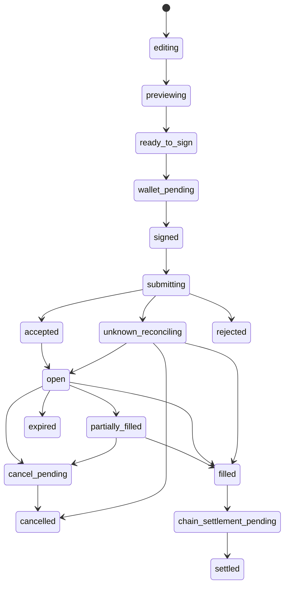
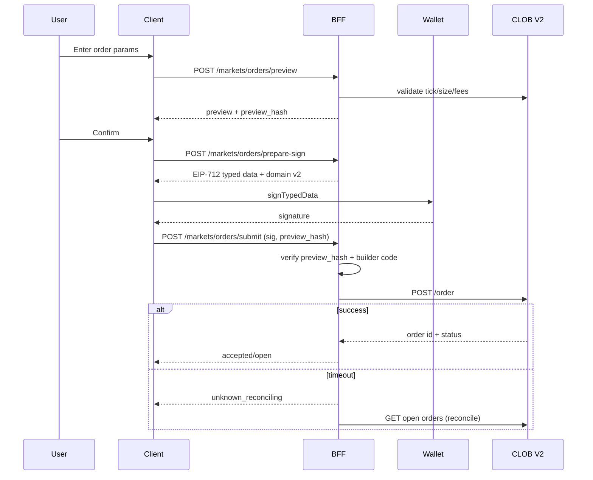

# ORDER LIFECYCLE

**Status:** reviewed
**Owner:** platform-orchestrator
**Last updated:** 2026-07-25
**Product:** RetroPick Markets V1 — Wave 2 Polymarket Integration
**Wave:** 2 (implementation-grade upstream contract)

## Description

This document defines the canonical CLOB V2 order state machine for Markets V1 Wave 2: edit → preview → sign → submit → open/partial/fill/cancel/expire/reject → reconcile → chain settlement, including idempotency, geoblock, builder field, and fee disclosure. Accept/fill/cancel authority is Polymarket CLOB + Exchange; RetroPick has **no** matching engine (ADR-001).

It sits in Wave 2 after wallet auth and funding readiness, with Builder/fees and neg-risk peers for assembly details. Runtime is the BFF order module plus client signatory; projections must reconcile to upstream truth. Silent server signing is forbidden (ADR-003); Combos RFQ remains 403-gated.

Read this for any trading implementation and on CLOB V2 field migrations. Prefer sibling docs for L1/L2 credential storage, pUSD wrap, or CTF redeem—not for inventing mid-states outside this machine or treating BFF accept as final settlement.

## 0. Developer intent (5W+1H)

Short orientation for implementers and agents. Read this before the normative sections below.

| Lens | Answer |
|------|--------|
| **Who** | BFF order service, web/Android ticket UX, `be-api` / `fe-markets` / `fe-wallet` agents, QA writing reconcile tests. |
| **What** | Canonical CLOB V2 order state machine: edit → preview → sign → submit → open/partial/fill/cancel/expire/reject → reconcile → chain settlement. Idempotency, geoblock, builder field, fee disclosure — no RetroPick matching engine. |
| **When** | Any trading implementation; after wallet auth and funding readiness; on CLOB V2 field migrations (EV-001); never for Combos RFQ. |
| **Where** | Spec: this doc. Runtime: BFF order module + client signatory. Authority for accept/fill/cancel: Polymarket CLOB + Exchange. Persistence: RetroPick projections must reconcile to upstream truth. |
| **Why** | Clients inventing states or treating BFF accept as final settlement causes ghost fills. V1 order fields are obsolete. Silent server signing is forbidden (ADR-003). Venue is Polymarket. |
| **How** | Implement listed states only; preview via BFF (fees, geoblock, market info); user signs EIP-712; BFF submits with L2; poll/WS reconcile; unknown → `unknown_reconciling`; never skip geoblock. |

### Worked example

**Happy path.** User edits size/price → `previewing` (BFF returns fee estimate, neg-risk exchange choice, geoblock allow) → `ready_to_sign` → wallet signs → `submitting` → CLOB `accepted`/`open` → partial fills update size → `filled` → optional `chain_settlement_pending` → `settled`. Cancel path: `cancel_pending` → upstream confirmed `cancelled`. Builder code attached at assemble; fees not embedded in signed V2 order.

**Failure / degraded.** Geoblock deny → stop before sign. Submit timeout → `unknown_reconciling` until CLOB truth known; do not show filled. Partial fill then disconnect → reconcile from Data/CLOB, not local optimism. Reject on tick/size → `rejected` with upstream reason. Combos RFQ attempt → 403 gate. Backend signing without user → hard security fail. Invented mid-states not in the machine → reject in review.

**State machine touchpoints**

| Phase | Polymarket authority | RetroPick duty |
|-------|----------------------|----------------|
| Preview/fees/geoblock | CLOB info + geoblock | Assemble + disclose |
| Signature | User wallet | Never silent-sign |
| Book matching | CLOB/Exchange | Submit + observe |
| Settlement tokens | CTF/Exchange | Project + show |

**Prerequisites before `ready_to_sign`**

1. Session with distinct signer / account wallet / funder fields.
2. Tradable pUSD + allowances ([FUNDS_DEPOSIT_AND_WITHDRAWAL.md](./FUNDS_DEPOSIT_AND_WITHDRAWAL.md)).
3. Correct exchange domain (standard vs neg-risk).
4. Geoblock allow for the trading principal.
5. Fee disclosure available or explicit unknown handling.

Idempotency keys and client order ids must survive retries without double-posting. RetroPick never "matches" two users against each other — it only speaks CLOB.

**Related docs:** [AUTHENTICATION_AND_ACCOUNT_WALLETS.md](./AUTHENTICATION_AND_ACCOUNT_WALLETS.md), [BUILDER_RELAYER_AND_FEES.md](./BUILDER_RELAYER_AND_FEES.md), [POSITIONS_CTF_AND_REDEMPTION.md](./POSITIONS_CTF_AND_REDEMPTION.md).

## 1. Purpose

Define the canonical order state machine from preview through sign, submit, partial fill, cancel, and reconciliation for CLOB V2 (EV-001).

## 2. Scope

### In scope

- RetroPick Markets V1 delivered through web, Go BFF (`apps/backend/internal/markets/`), and native Android Jetpack Compose.
- Wave 2 Polymarket upstream interfaces: Gamma, CLOB V2, Data API, Bridge API, Relayer, on-chain contracts (CTF, Exchange V2, Neg Risk, pUSD).
- Evidence-tagged, implementation-grade specifications for engineering agents.

### Out of scope

- PRISM protocol (`contracts/prism/`).
- Legacy epoch APIs (`/api/v1/legacy/markets/*`) — frozen per EV-003.
- Polymarket Perps APIs and perpetuals trading.
- Combos RFQ/requester trading — excluded per EV-013 and [COMBOS_CAPABILITY_GATE.md](./COMBOS_CAPABILITY_GATE.md).
- Custom RetroPick exchange or outcome-token issuance (ADR-001).
- Copying Polymarket proprietary UI, trademarks, or confidential behavior.
## 3. Prerequisites

- [00_DOCUMENT_MAP.md](../00_DOCUMENT_MAP.md)
- [.dev/MARKETS.md](../../MARKETS.md)
- [docs/ARCHITECTURE.md](../../../docs/ARCHITECTURE.md)
- [research/EVIDENCE_REGISTER.md](../research/EVIDENCE_REGISTER.md)
- [schemas/openapi/markets-v1.yaml](../../../schemas/openapi/markets-v1.yaml) (EV-005)
- Peer documents in [polymarket/](./)
## 4. Authoritative sources

| Source | URL | Retrieved | Evidence | Confidence |
|--------|-----|-----------|----------|------------|
| Documentation index | https://docs.polymarket.com/llms.txt | 2026-07-25 | EV-001 | partially_verified |
| CLOB V2 migration | https://docs.polymarket.com/v2-migration | 2026-07-25 | EV-001, EV-007, EV-010 | partially_verified |
| Contract registry | https://docs.polymarket.com/resources/contracts | 2026-07-25 | EV-008 | partially_verified |
| Wallets and authentication | https://docs.polymarket.com/trading/wallets-auth | 2026-07-25 | EV-009 | partially_verified |
| Deposit wallets | https://docs.polymarket.com/trading/deposit-wallets | 2026-07-25 | EV-009 | partially_verified |
| Builder program | https://docs.polymarket.com/programs/builders/overview | 2026-07-25 | EV-010 | partially_verified |
| Negative risk | https://docs.polymarket.com/concepts/negative-risk | 2026-07-25 | EV-012 | partially_verified |
| Rate limits (IP) | https://docs.polymarket.com/api-reference/rate-limits | 2026-07-25 | EV-011 | partially_verified |
| Trading rate limits | https://docs.polymarket.com/api-reference/trading-rate-limits | 2026-07-25 | EV-011 | partially_verified |
| Predictions API overview | https://docs.polymarket.com/api-reference/predictions/overview | 2026-07-25 | EV-001 | partially_verified |
| RetroPick OpenAPI | `schemas/openapi/markets-v1.yaml` | 2026-07-25 | EV-005 | verified |
| BFF module | `apps/backend/internal/markets/` | 2026-07-25 | EV-002 | verified |

## 5. Current state

- State machine designed; BFF order service stub.
- V1 CLOB order fields obsolete (EV-001).

## 6. Target design


### 6.1 Canonical state machine

States:

```text
editing → previewing → ready_to_sign → wallet_pending → signed → submitting
  → accepted → open → partially_filled → filled
  → cancel_pending → cancelled
  → expired | rejected
  → unknown_reconciling → (open | filled | cancelled | rejected)
  → chain_settlement_pending → settled
```

### 6.2 State definitions

| State | Meaning | Terminal |
|-------|---------|----------|
| editing | User adjusting price/size | no |
| previewing | BFF computing preview | no |
| ready_to_sign | Preview acknowledged | no |
| wallet_pending | Awaiting wallet UI | no |
| signed | EIP-712 signature captured | no |
| submitting | POST /order in flight | no |
| accepted | CLOB ack without fill | no |
| open | Resting on book | no |
| partially_filled | `size_matched < original_size` | no |
| filled | Fully matched | yes |
| cancel_pending | DELETE sent | no |
| cancelled | Confirmed cancel | yes |
| expired | GTD past expiry | yes |
| rejected | CLOB reject | yes |
| unknown_reconciling | Timeout/ambiguous | no |
| chain_settlement_pending | On-chain fill pending | no |
| settled | On-chain final | yes |

### 6.3 Identifiers

| ID | Owner | Purpose |
|----|-------|---------|
| correlation_id | BFF | End-to-end tracing |
| idempotency_key | BFF | Dedup preview/submit |
| preview_hash | BFF | Bind sign to preview |
| signed_payload_hash | BFF | Audit |
| client_order_id | Client/BFF | COID cancel support |
| clob_order_id | CLOB | Upstream reference |
| trade_id | CLOB | Fill reference |
| tx_hash | Chain | Settlement |

### 6.4 Retry decision table

| Condition | Action | MUST NOT |
|-----------|--------|----------|
| POST /order timeout | → unknown_reconciling; poll open orders | auto resubmit |
| 400 reject | → rejected; show reason | retry same payload |
| 429 | backoff retry submit once | spam |
| Duplicate signature | idempotency hit → return prior | double submit |
| Engine restart | reconcile open orders | assume filled |

### 6.5 V2 order fields (EV-001)

Signed EIP-712 Order includes: `salt`, `maker`, `signer`, `tokenId`, `makerAmount`, `takerAmount`, `side`, `signatureType`, `timestamp` (ms), `metadata`, `builder`.

Removed from signature: `nonce`, `feeRateBps`, `taker`, `expiration` (expiration still on wire body for GTD).

### 6.6 Partial fill handling

- Poll `GET /data/orders` or WS user channel.
- Update `size_matched`, `remaining_size` as fixed-point strings.
- UI shows partial badge; allow cancel remainder.






## 7. Alternatives considered

| Alternative | Rejected because |
|-------------|------------------|
| Direct Gamma/CLOB from web/Android in production | ADR-002: schema churn, credential exposure, no central policy |
| Custom RetroPick exchange | ADR-001: Polymarket is venue authority |
| CLOB V1 SDK or V1-signed orders | EV-001: not supported on production after 2026-04-28 |
| USDC.e as default trading collateral post-V2 | EV-007: pUSD is V2 collateral |
| Hard-coded contract addresses without registry | EV-008: must verify at startup from official registry |
| Single `walletAddress` API field | ADR-003: conflates signer and account wallet |
| Combos trading in V1 | EV-013: incomplete upstream + legal/ops risk |
| Floating-point money in APIs | Precision loss; use fixed-point strings |
## 8. Decisions

| ID | Decision | Rationale |
|----|----------|-----------|
| D-01 | Polymarket is venue authority for matching, resolution, collateral | ADR-001 |
| D-02 | All production upstream HTTP/WebSocket from BFF only | ADR-002 |
| D-03 | User signs orders and asset txs; BFF never silent-signs | ADR-003 |
| D-04 | Shared OpenAPI contract for web and Android | ADR-004 |
| D-05 | `eligible: false` blocks all mutating trading endpoints | Fail closed |
| D-06 | Order submit timeout → `unknown_reconciling`, never auto-resubmit | Reconciliation safety |
| D-07 | Exchange selection from official market metadata, not titles | EV-012 |
| D-08 | Combos capability remains disabled until gate checklist passes | EV-013 |
| D-09 | Contract addresses loaded from EV-008 registry with bytecode verify | No invented addresses |
| D-10 | Builder code attached server-side during order preview assembly | EV-010 |
## 9. Data and control flows

Primary flow in sequence diagram. Reconciliation worker polls CLOB every 5s for `unknown_reconciling` rows.

## 10. Failure and recovery

| Failure domain | Detection | User-visible behavior | Recovery action |
|----------------|-----------|----------------------|-----------------|
| Gamma unavailable | 5xx, timeout, error rate | Stale catalog + banner | Serve cache; exponential backoff |
| CLOB market data down | /book errors | Empty book + retry CTA | Poll with jitter; fallback REST |
| CLOB L2 auth invalid | 401/403 | Re-auth prompt | L1 signature flow |
| Order submit timeout | client/BFF timer | `unknown_reconciling` state | Poll open orders + fills; user confirm |
| Relayer 429 | 429 response | Funding pending | Queue; respect 25/min submit limit |
| Bridge delay | status API stuck | In-progress funding UI | Poll bridge status; support playbook |
| Geo block | geoblock endpoint / policy | Read-only mode | Unsupported region UX |
| Registry mismatch | startup probe | Deploy blocked | Roll back config; ops alert |
| Engine restart | missing resting orders | Open orders may vanish upstream | Reconcile to cancelled or re-listed |

**MUST NOT:** silently resubmit orders after HTTP timeout; mark failed without reconciliation poll.
## 11. Security

- RetroPick MUST NOT receive, generate, store, log, or back up user seed phrases or raw private keys (ADR-003).
- Preview-before-sign for every collateral wrap, approval, transfer, split, merge, convert, redeem, withdrawal.
- Builder codes, relayer API keys, and CLOB L2 secrets: server-side only; never in mobile/web bundles.
- Production clients MUST NOT embed upstream base URLs for authenticated CLOB/relayer calls (ADR-002).
- Signed payload hash stored for audit; full signature redacted in logs.
- Session binding for web; Android attestation where platform supports it.
## 12. Observability

| Metric | Type | SLO / alert |
|--------|------|-------------|
| `markets_upstream_request_duration_ms` | histogram | p95 per upstream |
| `markets_upstream_errors_total` | counter | >1% 5m window |
| `markets_catalog_staleness_seconds` | gauge | >300s page |
| `markets_order_reconcile_lag_seconds` | histogram | p99 < 60s |
| `markets_capability_denied_total` | counter | anomaly detection |
| `markets_degraded_mode` | gauge | ==1 for 5m |

Structured logs: `correlation_id`, `user_session_id` (hashed), `upstream`, `evidence_id`, `operation`. Never log private keys, mnemonics, relayer secrets, or full EIP-712 payloads.
## 13. Test strategy

- **Contract:** OpenAPI conformance (EV-005) for every BFF route in this document's scope.
- **Integration:** Recorded cassettes against Gamma/CLOB/Data/Bridge sandboxes; no secrets in CI.
- **Security:** Signing boundary tests — BFF cannot produce valid order signature without client.
- **E2E:** [testing/END_TO_END_CRITICAL_JOURNEYS.md](../testing/END_TO_END_CRITICAL_JOURNEYS.md).
- **Chaos:** Upstream 429/5xx injection; verify degraded mode and no double-submit.
- **Registry:** Startup test with known-good and intentionally wrong bytecode hash.
## 14. Rollout and rollback

1. **Phase 1:** catalog + market data capabilities (`read_only`).
2. **Phase 2:** wallet connect + funding (`wallet`, `funding`).
3. **Phase 3:** order submit behind kill switch (`trade`).
4. **Phase 4:** portfolio, redemption, neg-risk convert (`portfolio`).

Rollback: flip capability flag in BFF config → clients poll `/markets/capabilities` (TTL ≤30s). Order kill switch stops new submits; does **not** cancel upstream resting orders.
## 15. Open questions

| ID | Question | Expiry | Owner |
|----|----------|--------|-------|
| OQ-01 | Go BFF: raw HTTP vs sidecar for CLOB signing helpers | 2026-08-15 | backend |
| OQ-02 | Android wallet connector (WalletConnect vs in-app WebView) | 2026-08-01 | mobile |
| OQ-03 | Minimum catalog freshness SLO at launch | 2026-08-01 | SRE |
| OQ-04 | Augmented neg-risk placeholder display policy | 2026-08-15 | product |

Full log: [research/OPEN_QUESTIONS_AND_EXPIRING_ASSUMPTIONS.md](../research/OPEN_QUESTIONS_AND_EXPIRING_ASSUMPTIONS.md).
## 16. Acceptance criteria

- [ ] All MUST requirements traced in [../../../.harness/products/markets-v1/planning/REQUIREMENTS_TO_TASK_TRACEABILITY.md](../../../.harness/products/markets-v1/planning/REQUIREMENTS_TO_TASK_TRACEABILITY.md).
- [ ] Time-sensitive claims cite evidence ID (EV-xxx) with retrieval date 2026-07-25.
- [ ] No production contract address in app config without EV-008 verification pipeline.
- [ ] Mermaid diagrams render for specified flows.
- [ ] BFF-only vs client-forbidden endpoints explicitly classified.
- [ ] Phase gate evidence attached before implementation merge.

## 17. Evidence index

| ID | Claim | Source | Confidence | Consequence |
|----|-------|--------|------------|-------------|
| EV-001 | CLOB V2 is production trading API (live 2026-04-28) | https://docs.polymarket.com/v2-migration | partially_verified | V2 SDK/signing only |
| EV-002 | Markets BFF serves `/api/v1/markets/*` | `apps/backend/internal/markets/` | verified | Client integration surface |
| EV-003 | Legacy epoch frozen | `docs/ARCHITECTURE.md` | verified | No legacy extension |
| EV-005 | OpenAPI `markets-v1.yaml` canonical | repo | verified | Codegen/conformance |
| EV-007 | pUSD replaces USDC.e as V2 collateral | https://docs.polymarket.com/v2-migration | partially_verified | Wrap/onramp/funding |
| EV-008 | Official contract registry (Polygon 137) | https://docs.polymarket.com/resources/contracts | partially_verified | Load + verify at startup |
| EV-009 | Deposit Wallet default for accounts deployed ≥ 2026-05-04 | https://docs.polymarket.com/trading/wallets-auth | partially_verified | Wallet-type matrix |
| EV-010 | Builder attribution via `builder` bytes32 on signed order | https://docs.polymarket.com/v2-migration | partially_verified | Replaces V1 HMAC headers |
| EV-011 | Cloudflare IP limits + per-signer trading buckets | https://docs.polymarket.com/api-reference/rate-limits | partially_verified | BFF rate governance |
| EV-012 | Neg Risk uses separate exchange + adapter | https://docs.polymarket.com/concepts/negative-risk | partially_verified | Per-market exchange select |
| EV-013 | Combos requester/maker not V1 | https://docs.polymarket.com/api-reference/combo-markets/get-combo-markets | partially_verified | `combos.enabled=false` |

**Revalidation triggers:** Polymarket changelog, SDK major version, contract registry diff, geoblock policy, Builder program terms.

## 18. Related documents

| Direction | Document | Relationship |
|-----------|----------|--------------|
| Upstream | [research/EVIDENCE_REGISTER.md](../research/EVIDENCE_REGISTER.md) | Master evidence |
| Upstream | [research/POLYMARKET_CURRENT_STATE.md](../research/POLYMARKET_CURRENT_STATE.md) | Research baseline |
| Peer | [polymarket/](./) | Wave 2 integration set |
| Downstream | [backend/BACKEND_ARCHITECTURE.md](../backend/BACKEND_ARCHITECTURE.md) | BFF modules |
| Downstream | [backend/DOMAIN_MODEL_AND_STATE_MACHINES.md](../backend/DOMAIN_MODEL_AND_STATE_MACHINES.md) | State machines |
| Downstream | [backend/API_AND_REALTIME_CONTRACTS.md](../backend/API_AND_REALTIME_CONTRACTS.md) | RetroPick API |
| Downstream | [backend/CACHE_QUEUE_AND_RATE_LIMITING.md](../backend/CACHE_QUEUE_AND_RATE_LIMITING.md) | Throttles |
| Downstream | [testing/MASTER_TEST_PLAN.md](../testing/MASTER_TEST_PLAN.md) | Verification |
| ADR | [ADR-002](../architecture/adr/ADR-002-POLYMARKET-ANTI-CORRUPTION-LAYER.md) | BFF boundary |
| ADR | [ADR-003](../architecture/adr/ADR-003-WALLET-AND-SIGNING-MODEL.md) | Signing |

## Appendix A. Endpoint and field reference (Wave 2)

| REF-0001 | Implementation agent MUST cross-check field semantics, auth class, and error codes against https://docs.polymarket.com/llms.txt before coding. |
| REF-0002 | Implementation agent MUST cross-check field semantics, auth class, and error codes against https://docs.polymarket.com/llms.txt before coding. |
| REF-0003 | Implementation agent MUST cross-check field semantics, auth class, and error codes against https://docs.polymarket.com/llms.txt before coding. |
| REF-0004 | Implementation agent MUST cross-check field semantics, auth class, and error codes against https://docs.polymarket.com/llms.txt before coding. |
| REF-0005 | Implementation agent MUST cross-check field semantics, auth class, and error codes against https://docs.polymarket.com/llms.txt before coding. |
| REF-0006 | Implementation agent MUST cross-check field semantics, auth class, and error codes against https://docs.polymarket.com/llms.txt before coding. |
| REF-0007 | Implementation agent MUST cross-check field semantics, auth class, and error codes against https://docs.polymarket.com/llms.txt before coding. |
| REF-0008 | Implementation agent MUST cross-check field semantics, auth class, and error codes against https://docs.polymarket.com/llms.txt before coding. |
| REF-0009 | Implementation agent MUST cross-check field semantics, auth class, and error codes against https://docs.polymarket.com/llms.txt before coding. |
| REF-0010 | Implementation agent MUST cross-check field semantics, auth class, and error codes against https://docs.polymarket.com/llms.txt before coding. |
| REF-0011 | Implementation agent MUST cross-check field semantics, auth class, and error codes against https://docs.polymarket.com/llms.txt before coding. |
| REF-0012 | Implementation agent MUST cross-check field semantics, auth class, and error codes against https://docs.polymarket.com/llms.txt before coding. |
| REF-0013 | Implementation agent MUST cross-check field semantics, auth class, and error codes against https://docs.polymarket.com/llms.txt before coding. |
| REF-0014 | Implementation agent MUST cross-check field semantics, auth class, and error codes against https://docs.polymarket.com/llms.txt before coding. |
| REF-0015 | Implementation agent MUST cross-check field semantics, auth class, and error codes against https://docs.polymarket.com/llms.txt before coding. |
| REF-0016 | Implementation agent MUST cross-check field semantics, auth class, and error codes against https://docs.polymarket.com/llms.txt before coding. |
| REF-0017 | Implementation agent MUST cross-check field semantics, auth class, and error codes against https://docs.polymarket.com/llms.txt before coding. |
| REF-0018 | Implementation agent MUST cross-check field semantics, auth class, and error codes against https://docs.polymarket.com/llms.txt before coding. |
| REF-0019 | Implementation agent MUST cross-check field semantics, auth class, and error codes against https://docs.polymarket.com/llms.txt before coding. |
| REF-0020 | Implementation agent MUST cross-check field semantics, auth class, and error codes against https://docs.polymarket.com/llms.txt before coding. |
| REF-0021 | Implementation agent MUST cross-check field semantics, auth class, and error codes against https://docs.polymarket.com/llms.txt before coding. |
| REF-0022 | Implementation agent MUST cross-check field semantics, auth class, and error codes against https://docs.polymarket.com/llms.txt before coding. |
| REF-0023 | Implementation agent MUST cross-check field semantics, auth class, and error codes against https://docs.polymarket.com/llms.txt before coding. |
| REF-0024 | Implementation agent MUST cross-check field semantics, auth class, and error codes against https://docs.polymarket.com/llms.txt before coding. |
| REF-0025 | Implementation agent MUST cross-check field semantics, auth class, and error codes against https://docs.polymarket.com/llms.txt before coding. |
| REF-0026 | Implementation agent MUST cross-check field semantics, auth class, and error codes against https://docs.polymarket.com/llms.txt before coding. |
| REF-0027 | Implementation agent MUST cross-check field semantics, auth class, and error codes against https://docs.polymarket.com/llms.txt before coding. |
| REF-0028 | Implementation agent MUST cross-check field semantics, auth class, and error codes against https://docs.polymarket.com/llms.txt before coding. |
| REF-0029 | Implementation agent MUST cross-check field semantics, auth class, and error codes against https://docs.polymarket.com/llms.txt before coding. |
| REF-0030 | Implementation agent MUST cross-check field semantics, auth class, and error codes against https://docs.polymarket.com/llms.txt before coding. |
| REF-0031 | Implementation agent MUST cross-check field semantics, auth class, and error codes against https://docs.polymarket.com/llms.txt before coding. |
| REF-0032 | Implementation agent MUST cross-check field semantics, auth class, and error codes against https://docs.polymarket.com/llms.txt before coding. |
| REF-0033 | Implementation agent MUST cross-check field semantics, auth class, and error codes against https://docs.polymarket.com/llms.txt before coding. |
| REF-0034 | Implementation agent MUST cross-check field semantics, auth class, and error codes against https://docs.polymarket.com/llms.txt before coding. |
| REF-0035 | Implementation agent MUST cross-check field semantics, auth class, and error codes against https://docs.polymarket.com/llms.txt before coding. |
| REF-0036 | Implementation agent MUST cross-check field semantics, auth class, and error codes against https://docs.polymarket.com/llms.txt before coding. |
| REF-0037 | Implementation agent MUST cross-check field semantics, auth class, and error codes against https://docs.polymarket.com/llms.txt before coding. |
| REF-0038 | Implementation agent MUST cross-check field semantics, auth class, and error codes against https://docs.polymarket.com/llms.txt before coding. |
| REF-0039 | Implementation agent MUST cross-check field semantics, auth class, and error codes against https://docs.polymarket.com/llms.txt before coding. |
| REF-0040 | Implementation agent MUST cross-check field semantics, auth class, and error codes against https://docs.polymarket.com/llms.txt before coding. |
| REF-0041 | Implementation agent MUST cross-check field semantics, auth class, and error codes against https://docs.polymarket.com/llms.txt before coding. |
| REF-0042 | Implementation agent MUST cross-check field semantics, auth class, and error codes against https://docs.polymarket.com/llms.txt before coding. |
| REF-0043 | Implementation agent MUST cross-check field semantics, auth class, and error codes against https://docs.polymarket.com/llms.txt before coding. |
| REF-0044 | Implementation agent MUST cross-check field semantics, auth class, and error codes against https://docs.polymarket.com/llms.txt before coding. |
| REF-0045 | Implementation agent MUST cross-check field semantics, auth class, and error codes against https://docs.polymarket.com/llms.txt before coding. |
| REF-0046 | Implementation agent MUST cross-check field semantics, auth class, and error codes against https://docs.polymarket.com/llms.txt before coding. |
| REF-0047 | Implementation agent MUST cross-check field semantics, auth class, and error codes against https://docs.polymarket.com/llms.txt before coding. |
| REF-0048 | Implementation agent MUST cross-check field semantics, auth class, and error codes against https://docs.polymarket.com/llms.txt before coding. |
| REF-0049 | Implementation agent MUST cross-check field semantics, auth class, and error codes against https://docs.polymarket.com/llms.txt before coding. |
| REF-0050 | Implementation agent MUST cross-check field semantics, auth class, and error codes against https://docs.polymarket.com/llms.txt before coding. |
| REF-0051 | Implementation agent MUST cross-check field semantics, auth class, and error codes against https://docs.polymarket.com/llms.txt before coding. |
| REF-0052 | Implementation agent MUST cross-check field semantics, auth class, and error codes against https://docs.polymarket.com/llms.txt before coding. |
| REF-0053 | Implementation agent MUST cross-check field semantics, auth class, and error codes against https://docs.polymarket.com/llms.txt before coding. |
| REF-0054 | Implementation agent MUST cross-check field semantics, auth class, and error codes against https://docs.polymarket.com/llms.txt before coding. |
| REF-0055 | Implementation agent MUST cross-check field semantics, auth class, and error codes against https://docs.polymarket.com/llms.txt before coding. |
| REF-0056 | Implementation agent MUST cross-check field semantics, auth class, and error codes against https://docs.polymarket.com/llms.txt before coding. |
| REF-0057 | Implementation agent MUST cross-check field semantics, auth class, and error codes against https://docs.polymarket.com/llms.txt before coding. |
| REF-0058 | Implementation agent MUST cross-check field semantics, auth class, and error codes against https://docs.polymarket.com/llms.txt before coding. |
| REF-0059 | Implementation agent MUST cross-check field semantics, auth class, and error codes against https://docs.polymarket.com/llms.txt before coding. |
| REF-0060 | Implementation agent MUST cross-check field semantics, auth class, and error codes against https://docs.polymarket.com/llms.txt before coding. |
| REF-0061 | Implementation agent MUST cross-check field semantics, auth class, and error codes against https://docs.polymarket.com/llms.txt before coding. |
| REF-0062 | Implementation agent MUST cross-check field semantics, auth class, and error codes against https://docs.polymarket.com/llms.txt before coding. |
| REF-0063 | Implementation agent MUST cross-check field semantics, auth class, and error codes against https://docs.polymarket.com/llms.txt before coding. |
| REF-0064 | Implementation agent MUST cross-check field semantics, auth class, and error codes against https://docs.polymarket.com/llms.txt before coding. |
| REF-0065 | Implementation agent MUST cross-check field semantics, auth class, and error codes against https://docs.polymarket.com/llms.txt before coding. |
| REF-0066 | Implementation agent MUST cross-check field semantics, auth class, and error codes against https://docs.polymarket.com/llms.txt before coding. |
| REF-0067 | Implementation agent MUST cross-check field semantics, auth class, and error codes against https://docs.polymarket.com/llms.txt before coding. |
| REF-0068 | Implementation agent MUST cross-check field semantics, auth class, and error codes against https://docs.polymarket.com/llms.txt before coding. |
| REF-0069 | Implementation agent MUST cross-check field semantics, auth class, and error codes against https://docs.polymarket.com/llms.txt before coding. |
| REF-0070 | Implementation agent MUST cross-check field semantics, auth class, and error codes against https://docs.polymarket.com/llms.txt before coding. |
| REF-0071 | Implementation agent MUST cross-check field semantics, auth class, and error codes against https://docs.polymarket.com/llms.txt before coding. |
| REF-0072 | Implementation agent MUST cross-check field semantics, auth class, and error codes against https://docs.polymarket.com/llms.txt before coding. |
| REF-0073 | Implementation agent MUST cross-check field semantics, auth class, and error codes against https://docs.polymarket.com/llms.txt before coding. |
| REF-0074 | Implementation agent MUST cross-check field semantics, auth class, and error codes against https://docs.polymarket.com/llms.txt before coding. |
| REF-0075 | Implementation agent MUST cross-check field semantics, auth class, and error codes against https://docs.polymarket.com/llms.txt before coding. |
| REF-0076 | Implementation agent MUST cross-check field semantics, auth class, and error codes against https://docs.polymarket.com/llms.txt before coding. |
| REF-0077 | Implementation agent MUST cross-check field semantics, auth class, and error codes against https://docs.polymarket.com/llms.txt before coding. |
| REF-0078 | Implementation agent MUST cross-check field semantics, auth class, and error codes against https://docs.polymarket.com/llms.txt before coding. |
| REF-0079 | Implementation agent MUST cross-check field semantics, auth class, and error codes against https://docs.polymarket.com/llms.txt before coding. |
| REF-0080 | Implementation agent MUST cross-check field semantics, auth class, and error codes against https://docs.polymarket.com/llms.txt before coding. |
| REF-0081 | Implementation agent MUST cross-check field semantics, auth class, and error codes against https://docs.polymarket.com/llms.txt before coding. |
| REF-0082 | Implementation agent MUST cross-check field semantics, auth class, and error codes against https://docs.polymarket.com/llms.txt before coding. |
| REF-0083 | Implementation agent MUST cross-check field semantics, auth class, and error codes against https://docs.polymarket.com/llms.txt before coding. |
| REF-0084 | Implementation agent MUST cross-check field semantics, auth class, and error codes against https://docs.polymarket.com/llms.txt before coding. |
| REF-0085 | Implementation agent MUST cross-check field semantics, auth class, and error codes against https://docs.polymarket.com/llms.txt before coding. |
| REF-0086 | Implementation agent MUST cross-check field semantics, auth class, and error codes against https://docs.polymarket.com/llms.txt before coding. |
| REF-0087 | Implementation agent MUST cross-check field semantics, auth class, and error codes against https://docs.polymarket.com/llms.txt before coding. |
| REF-0088 | Implementation agent MUST cross-check field semantics, auth class, and error codes against https://docs.polymarket.com/llms.txt before coding. |
| REF-0089 | Implementation agent MUST cross-check field semantics, auth class, and error codes against https://docs.polymarket.com/llms.txt before coding. |
| REF-0090 | Implementation agent MUST cross-check field semantics, auth class, and error codes against https://docs.polymarket.com/llms.txt before coding. |
| REF-0091 | Implementation agent MUST cross-check field semantics, auth class, and error codes against https://docs.polymarket.com/llms.txt before coding. |
| REF-0092 | Implementation agent MUST cross-check field semantics, auth class, and error codes against https://docs.polymarket.com/llms.txt before coding. |
| REF-0093 | Implementation agent MUST cross-check field semantics, auth class, and error codes against https://docs.polymarket.com/llms.txt before coding. |
| REF-0094 | Implementation agent MUST cross-check field semantics, auth class, and error codes against https://docs.polymarket.com/llms.txt before coding. |
| REF-0095 | Implementation agent MUST cross-check field semantics, auth class, and error codes against https://docs.polymarket.com/llms.txt before coding. |
| REF-0096 | Implementation agent MUST cross-check field semantics, auth class, and error codes against https://docs.polymarket.com/llms.txt before coding. |
| REF-0097 | Implementation agent MUST cross-check field semantics, auth class, and error codes against https://docs.polymarket.com/llms.txt before coding. |
| REF-0098 | Implementation agent MUST cross-check field semantics, auth class, and error codes against https://docs.polymarket.com/llms.txt before coding. |
| REF-0099 | Implementation agent MUST cross-check field semantics, auth class, and error codes against https://docs.polymarket.com/llms.txt before coding. |
| REF-0100 | Implementation agent MUST cross-check field semantics, auth class, and error codes against https://docs.polymarket.com/llms.txt before coding. |
| REF-0101 | Implementation agent MUST cross-check field semantics, auth class, and error codes against https://docs.polymarket.com/llms.txt before coding. |
| REF-0102 | Implementation agent MUST cross-check field semantics, auth class, and error codes against https://docs.polymarket.com/llms.txt before coding. |
| REF-0103 | Implementation agent MUST cross-check field semantics, auth class, and error codes against https://docs.polymarket.com/llms.txt before coding. |
| REF-0104 | Implementation agent MUST cross-check field semantics, auth class, and error codes against https://docs.polymarket.com/llms.txt before coding. |
| REF-0105 | Implementation agent MUST cross-check field semantics, auth class, and error codes against https://docs.polymarket.com/llms.txt before coding. |
| REF-0106 | Implementation agent MUST cross-check field semantics, auth class, and error codes against https://docs.polymarket.com/llms.txt before coding. |
| REF-0107 | Implementation agent MUST cross-check field semantics, auth class, and error codes against https://docs.polymarket.com/llms.txt before coding. |
| REF-0108 | Implementation agent MUST cross-check field semantics, auth class, and error codes against https://docs.polymarket.com/llms.txt before coding. |
| REF-0109 | Implementation agent MUST cross-check field semantics, auth class, and error codes against https://docs.polymarket.com/llms.txt before coding. |
| REF-0110 | Implementation agent MUST cross-check field semantics, auth class, and error codes against https://docs.polymarket.com/llms.txt before coding. |
| REF-0111 | Implementation agent MUST cross-check field semantics, auth class, and error codes against https://docs.polymarket.com/llms.txt before coding. |
| REF-0112 | Implementation agent MUST cross-check field semantics, auth class, and error codes against https://docs.polymarket.com/llms.txt before coding. |
| REF-0113 | Implementation agent MUST cross-check field semantics, auth class, and error codes against https://docs.polymarket.com/llms.txt before coding. |
| REF-0114 | Implementation agent MUST cross-check field semantics, auth class, and error codes against https://docs.polymarket.com/llms.txt before coding. |
| REF-0115 | Implementation agent MUST cross-check field semantics, auth class, and error codes against https://docs.polymarket.com/llms.txt before coding. |
| REF-0116 | Implementation agent MUST cross-check field semantics, auth class, and error codes against https://docs.polymarket.com/llms.txt before coding. |
| REF-0117 | Implementation agent MUST cross-check field semantics, auth class, and error codes against https://docs.polymarket.com/llms.txt before coding. |
| REF-0118 | Implementation agent MUST cross-check field semantics, auth class, and error codes against https://docs.polymarket.com/llms.txt before coding. |
| REF-0119 | Implementation agent MUST cross-check field semantics, auth class, and error codes against https://docs.polymarket.com/llms.txt before coding. |
| REF-0120 | Implementation agent MUST cross-check field semantics, auth class, and error codes against https://docs.polymarket.com/llms.txt before coding. |
| REF-0121 | Implementation agent MUST cross-check field semantics, auth class, and error codes against https://docs.polymarket.com/llms.txt before coding. |
| REF-0122 | Implementation agent MUST cross-check field semantics, auth class, and error codes against https://docs.polymarket.com/llms.txt before coding. |
| REF-0123 | Implementation agent MUST cross-check field semantics, auth class, and error codes against https://docs.polymarket.com/llms.txt before coding. |
| REF-0124 | Implementation agent MUST cross-check field semantics, auth class, and error codes against https://docs.polymarket.com/llms.txt before coding. |
| REF-0125 | Implementation agent MUST cross-check field semantics, auth class, and error codes against https://docs.polymarket.com/llms.txt before coding. |
| REF-0126 | Implementation agent MUST cross-check field semantics, auth class, and error codes against https://docs.polymarket.com/llms.txt before coding. |
| REF-0127 | Implementation agent MUST cross-check field semantics, auth class, and error codes against https://docs.polymarket.com/llms.txt before coding. |
| REF-0128 | Implementation agent MUST cross-check field semantics, auth class, and error codes against https://docs.polymarket.com/llms.txt before coding. |
| REF-0129 | Implementation agent MUST cross-check field semantics, auth class, and error codes against https://docs.polymarket.com/llms.txt before coding. |
| REF-0130 | Implementation agent MUST cross-check field semantics, auth class, and error codes against https://docs.polymarket.com/llms.txt before coding. |
| REF-0131 | Implementation agent MUST cross-check field semantics, auth class, and error codes against https://docs.polymarket.com/llms.txt before coding. |
| REF-0132 | Implementation agent MUST cross-check field semantics, auth class, and error codes against https://docs.polymarket.com/llms.txt before coding. |
| REF-0133 | Implementation agent MUST cross-check field semantics, auth class, and error codes against https://docs.polymarket.com/llms.txt before coding. |
| REF-0134 | Implementation agent MUST cross-check field semantics, auth class, and error codes against https://docs.polymarket.com/llms.txt before coding. |
| REF-0135 | Implementation agent MUST cross-check field semantics, auth class, and error codes against https://docs.polymarket.com/llms.txt before coding. |
| REF-0136 | Implementation agent MUST cross-check field semantics, auth class, and error codes against https://docs.polymarket.com/llms.txt before coding. |
| REF-0137 | Implementation agent MUST cross-check field semantics, auth class, and error codes against https://docs.polymarket.com/llms.txt before coding. |
| REF-0138 | Implementation agent MUST cross-check field semantics, auth class, and error codes against https://docs.polymarket.com/llms.txt before coding. |
| REF-0139 | Implementation agent MUST cross-check field semantics, auth class, and error codes against https://docs.polymarket.com/llms.txt before coding. |
| REF-0140 | Implementation agent MUST cross-check field semantics, auth class, and error codes against https://docs.polymarket.com/llms.txt before coding. |
| REF-0141 | Implementation agent MUST cross-check field semantics, auth class, and error codes against https://docs.polymarket.com/llms.txt before coding. |
| REF-0142 | Implementation agent MUST cross-check field semantics, auth class, and error codes against https://docs.polymarket.com/llms.txt before coding. |
| REF-0143 | Implementation agent MUST cross-check field semantics, auth class, and error codes against https://docs.polymarket.com/llms.txt before coding. |
| REF-0144 | Implementation agent MUST cross-check field semantics, auth class, and error codes against https://docs.polymarket.com/llms.txt before coding. |
| REF-0145 | Implementation agent MUST cross-check field semantics, auth class, and error codes against https://docs.polymarket.com/llms.txt before coding. |
| REF-0146 | Implementation agent MUST cross-check field semantics, auth class, and error codes against https://docs.polymarket.com/llms.txt before coding. |
| REF-0147 | Implementation agent MUST cross-check field semantics, auth class, and error codes against https://docs.polymarket.com/llms.txt before coding. |
| REF-0148 | Implementation agent MUST cross-check field semantics, auth class, and error codes against https://docs.polymarket.com/llms.txt before coding. |
| REF-0149 | Implementation agent MUST cross-check field semantics, auth class, and error codes against https://docs.polymarket.com/llms.txt before coding. |
| REF-0150 | Implementation agent MUST cross-check field semantics, auth class, and error codes against https://docs.polymarket.com/llms.txt before coding. |
| REF-0151 | Implementation agent MUST cross-check field semantics, auth class, and error codes against https://docs.polymarket.com/llms.txt before coding. |
| REF-0152 | Implementation agent MUST cross-check field semantics, auth class, and error codes against https://docs.polymarket.com/llms.txt before coding. |
| REF-0153 | Implementation agent MUST cross-check field semantics, auth class, and error codes against https://docs.polymarket.com/llms.txt before coding. |
| REF-0154 | Implementation agent MUST cross-check field semantics, auth class, and error codes against https://docs.polymarket.com/llms.txt before coding. |
| REF-0155 | Implementation agent MUST cross-check field semantics, auth class, and error codes against https://docs.polymarket.com/llms.txt before coding. |
| REF-0156 | Implementation agent MUST cross-check field semantics, auth class, and error codes against https://docs.polymarket.com/llms.txt before coding. |
| REF-0157 | Implementation agent MUST cross-check field semantics, auth class, and error codes against https://docs.polymarket.com/llms.txt before coding. |
| REF-0158 | Implementation agent MUST cross-check field semantics, auth class, and error codes against https://docs.polymarket.com/llms.txt before coding. |
| REF-0159 | Implementation agent MUST cross-check field semantics, auth class, and error codes against https://docs.polymarket.com/llms.txt before coding. |
| REF-0160 | Implementation agent MUST cross-check field semantics, auth class, and error codes against https://docs.polymarket.com/llms.txt before coding. |
| REF-0161 | Implementation agent MUST cross-check field semantics, auth class, and error codes against https://docs.polymarket.com/llms.txt before coding. |
| REF-0162 | Implementation agent MUST cross-check field semantics, auth class, and error codes against https://docs.polymarket.com/llms.txt before coding. |
| REF-0163 | Implementation agent MUST cross-check field semantics, auth class, and error codes against https://docs.polymarket.com/llms.txt before coding. |
| REF-0164 | Implementation agent MUST cross-check field semantics, auth class, and error codes against https://docs.polymarket.com/llms.txt before coding. |
| REF-0165 | Implementation agent MUST cross-check field semantics, auth class, and error codes against https://docs.polymarket.com/llms.txt before coding. |
| REF-0166 | Implementation agent MUST cross-check field semantics, auth class, and error codes against https://docs.polymarket.com/llms.txt before coding. |
| REF-0167 | Implementation agent MUST cross-check field semantics, auth class, and error codes against https://docs.polymarket.com/llms.txt before coding. |
| REF-0168 | Implementation agent MUST cross-check field semantics, auth class, and error codes against https://docs.polymarket.com/llms.txt before coding. |
| REF-0169 | Implementation agent MUST cross-check field semantics, auth class, and error codes against https://docs.polymarket.com/llms.txt before coding. |
| REF-0170 | Implementation agent MUST cross-check field semantics, auth class, and error codes against https://docs.polymarket.com/llms.txt before coding. |
| REF-0171 | Implementation agent MUST cross-check field semantics, auth class, and error codes against https://docs.polymarket.com/llms.txt before coding. |
| REF-0172 | Implementation agent MUST cross-check field semantics, auth class, and error codes against https://docs.polymarket.com/llms.txt before coding. |
| REF-0173 | Implementation agent MUST cross-check field semantics, auth class, and error codes against https://docs.polymarket.com/llms.txt before coding. |
| REF-0174 | Implementation agent MUST cross-check field semantics, auth class, and error codes against https://docs.polymarket.com/llms.txt before coding. |
| REF-0175 | Implementation agent MUST cross-check field semantics, auth class, and error codes against https://docs.polymarket.com/llms.txt before coding. |
| REF-0176 | Implementation agent MUST cross-check field semantics, auth class, and error codes against https://docs.polymarket.com/llms.txt before coding. |
| REF-0177 | Implementation agent MUST cross-check field semantics, auth class, and error codes against https://docs.polymarket.com/llms.txt before coding. |
| REF-0178 | Implementation agent MUST cross-check field semantics, auth class, and error codes against https://docs.polymarket.com/llms.txt before coding. |
| REF-0179 | Implementation agent MUST cross-check field semantics, auth class, and error codes against https://docs.polymarket.com/llms.txt before coding. |
| REF-0180 | Implementation agent MUST cross-check field semantics, auth class, and error codes against https://docs.polymarket.com/llms.txt before coding. |
| REF-0181 | Implementation agent MUST cross-check field semantics, auth class, and error codes against https://docs.polymarket.com/llms.txt before coding. |
| REF-0182 | Implementation agent MUST cross-check field semantics, auth class, and error codes against https://docs.polymarket.com/llms.txt before coding. |
| REF-0183 | Implementation agent MUST cross-check field semantics, auth class, and error codes against https://docs.polymarket.com/llms.txt before coding. |
| REF-0184 | Implementation agent MUST cross-check field semantics, auth class, and error codes against https://docs.polymarket.com/llms.txt before coding. |
| REF-0185 | Implementation agent MUST cross-check field semantics, auth class, and error codes against https://docs.polymarket.com/llms.txt before coding. |
| REF-0186 | Implementation agent MUST cross-check field semantics, auth class, and error codes against https://docs.polymarket.com/llms.txt before coding. |
| REF-0187 | Implementation agent MUST cross-check field semantics, auth class, and error codes against https://docs.polymarket.com/llms.txt before coding. |
| REF-0188 | Implementation agent MUST cross-check field semantics, auth class, and error codes against https://docs.polymarket.com/llms.txt before coding. |
| REF-0189 | Implementation agent MUST cross-check field semantics, auth class, and error codes against https://docs.polymarket.com/llms.txt before coding. |
| REF-0190 | Implementation agent MUST cross-check field semantics, auth class, and error codes against https://docs.polymarket.com/llms.txt before coding. |
| REF-0191 | Implementation agent MUST cross-check field semantics, auth class, and error codes against https://docs.polymarket.com/llms.txt before coding. |
| REF-0192 | Implementation agent MUST cross-check field semantics, auth class, and error codes against https://docs.polymarket.com/llms.txt before coding. |
| REF-0193 | Implementation agent MUST cross-check field semantics, auth class, and error codes against https://docs.polymarket.com/llms.txt before coding. |
| REF-0194 | Implementation agent MUST cross-check field semantics, auth class, and error codes against https://docs.polymarket.com/llms.txt before coding. |
| REF-0195 | Implementation agent MUST cross-check field semantics, auth class, and error codes against https://docs.polymarket.com/llms.txt before coding. |
| REF-0196 | Implementation agent MUST cross-check field semantics, auth class, and error codes against https://docs.polymarket.com/llms.txt before coding. |
| REF-0197 | Implementation agent MUST cross-check field semantics, auth class, and error codes against https://docs.polymarket.com/llms.txt before coding. |
| REF-0198 | Implementation agent MUST cross-check field semantics, auth class, and error codes against https://docs.polymarket.com/llms.txt before coding. |
| REF-0199 | Implementation agent MUST cross-check field semantics, auth class, and error codes against https://docs.polymarket.com/llms.txt before coding. |
| REF-0200 | Implementation agent MUST cross-check field semantics, auth class, and error codes against https://docs.polymarket.com/llms.txt before coding. |
| REF-0201 | Implementation agent MUST cross-check field semantics, auth class, and error codes against https://docs.polymarket.com/llms.txt before coding. |
| REF-0202 | Implementation agent MUST cross-check field semantics, auth class, and error codes against https://docs.polymarket.com/llms.txt before coding. |
| REF-0203 | Implementation agent MUST cross-check field semantics, auth class, and error codes against https://docs.polymarket.com/llms.txt before coding. |
| REF-0204 | Implementation agent MUST cross-check field semantics, auth class, and error codes against https://docs.polymarket.com/llms.txt before coding. |
| REF-0205 | Implementation agent MUST cross-check field semantics, auth class, and error codes against https://docs.polymarket.com/llms.txt before coding. |
| REF-0206 | Implementation agent MUST cross-check field semantics, auth class, and error codes against https://docs.polymarket.com/llms.txt before coding. |
| REF-0207 | Implementation agent MUST cross-check field semantics, auth class, and error codes against https://docs.polymarket.com/llms.txt before coding. |
| REF-0208 | Implementation agent MUST cross-check field semantics, auth class, and error codes against https://docs.polymarket.com/llms.txt before coding. |
| REF-0209 | Implementation agent MUST cross-check field semantics, auth class, and error codes against https://docs.polymarket.com/llms.txt before coding. |
| REF-0210 | Implementation agent MUST cross-check field semantics, auth class, and error codes against https://docs.polymarket.com/llms.txt before coding. |
| REF-0211 | Implementation agent MUST cross-check field semantics, auth class, and error codes against https://docs.polymarket.com/llms.txt before coding. |
| REF-0212 | Implementation agent MUST cross-check field semantics, auth class, and error codes against https://docs.polymarket.com/llms.txt before coding. |
| REF-0213 | Implementation agent MUST cross-check field semantics, auth class, and error codes against https://docs.polymarket.com/llms.txt before coding. |
| REF-0214 | Implementation agent MUST cross-check field semantics, auth class, and error codes against https://docs.polymarket.com/llms.txt before coding. |
| REF-0215 | Implementation agent MUST cross-check field semantics, auth class, and error codes against https://docs.polymarket.com/llms.txt before coding. |
| REF-0216 | Implementation agent MUST cross-check field semantics, auth class, and error codes against https://docs.polymarket.com/llms.txt before coding. |
| REF-0217 | Implementation agent MUST cross-check field semantics, auth class, and error codes against https://docs.polymarket.com/llms.txt before coding. |
| REF-0218 | Implementation agent MUST cross-check field semantics, auth class, and error codes against https://docs.polymarket.com/llms.txt before coding. |
| REF-0219 | Implementation agent MUST cross-check field semantics, auth class, and error codes against https://docs.polymarket.com/llms.txt before coding. |
| REF-0220 | Implementation agent MUST cross-check field semantics, auth class, and error codes against https://docs.polymarket.com/llms.txt before coding. |
| REF-0221 | Implementation agent MUST cross-check field semantics, auth class, and error codes against https://docs.polymarket.com/llms.txt before coding. |
| REF-0222 | Implementation agent MUST cross-check field semantics, auth class, and error codes against https://docs.polymarket.com/llms.txt before coding. |
| REF-0223 | Implementation agent MUST cross-check field semantics, auth class, and error codes against https://docs.polymarket.com/llms.txt before coding. |
| REF-0224 | Implementation agent MUST cross-check field semantics, auth class, and error codes against https://docs.polymarket.com/llms.txt before coding. |
| REF-0225 | Implementation agent MUST cross-check field semantics, auth class, and error codes against https://docs.polymarket.com/llms.txt before coding. |
| REF-0226 | Implementation agent MUST cross-check field semantics, auth class, and error codes against https://docs.polymarket.com/llms.txt before coding. |
| REF-0227 | Implementation agent MUST cross-check field semantics, auth class, and error codes against https://docs.polymarket.com/llms.txt before coding. |
| REF-0228 | Implementation agent MUST cross-check field semantics, auth class, and error codes against https://docs.polymarket.com/llms.txt before coding. |
| REF-0229 | Implementation agent MUST cross-check field semantics, auth class, and error codes against https://docs.polymarket.com/llms.txt before coding. |
| REF-0230 | Implementation agent MUST cross-check field semantics, auth class, and error codes against https://docs.polymarket.com/llms.txt before coding. |
| REF-0231 | Implementation agent MUST cross-check field semantics, auth class, and error codes against https://docs.polymarket.com/llms.txt before coding. |
| REF-0232 | Implementation agent MUST cross-check field semantics, auth class, and error codes against https://docs.polymarket.com/llms.txt before coding. |
| REF-0233 | Implementation agent MUST cross-check field semantics, auth class, and error codes against https://docs.polymarket.com/llms.txt before coding. |
| REF-0234 | Implementation agent MUST cross-check field semantics, auth class, and error codes against https://docs.polymarket.com/llms.txt before coding. |
| REF-0235 | Implementation agent MUST cross-check field semantics, auth class, and error codes against https://docs.polymarket.com/llms.txt before coding. |
| REF-0236 | Implementation agent MUST cross-check field semantics, auth class, and error codes against https://docs.polymarket.com/llms.txt before coding. |
| REF-0237 | Implementation agent MUST cross-check field semantics, auth class, and error codes against https://docs.polymarket.com/llms.txt before coding. |
| REF-0238 | Implementation agent MUST cross-check field semantics, auth class, and error codes against https://docs.polymarket.com/llms.txt before coding. |
| REF-0239 | Implementation agent MUST cross-check field semantics, auth class, and error codes against https://docs.polymarket.com/llms.txt before coding. |
| REF-0240 | Implementation agent MUST cross-check field semantics, auth class, and error codes against https://docs.polymarket.com/llms.txt before coding. |
| REF-0241 | Implementation agent MUST cross-check field semantics, auth class, and error codes against https://docs.polymarket.com/llms.txt before coding. |
| REF-0242 | Implementation agent MUST cross-check field semantics, auth class, and error codes against https://docs.polymarket.com/llms.txt before coding. |
| REF-0243 | Implementation agent MUST cross-check field semantics, auth class, and error codes against https://docs.polymarket.com/llms.txt before coding. |
| REF-0244 | Implementation agent MUST cross-check field semantics, auth class, and error codes against https://docs.polymarket.com/llms.txt before coding. |
| REF-0245 | Implementation agent MUST cross-check field semantics, auth class, and error codes against https://docs.polymarket.com/llms.txt before coding. |
| REF-0246 | Implementation agent MUST cross-check field semantics, auth class, and error codes against https://docs.polymarket.com/llms.txt before coding. |
| REF-0247 | Implementation agent MUST cross-check field semantics, auth class, and error codes against https://docs.polymarket.com/llms.txt before coding. |
| REF-0248 | Implementation agent MUST cross-check field semantics, auth class, and error codes against https://docs.polymarket.com/llms.txt before coding. |
| REF-0249 | Implementation agent MUST cross-check field semantics, auth class, and error codes against https://docs.polymarket.com/llms.txt before coding. |
| REF-0250 | Implementation agent MUST cross-check field semantics, auth class, and error codes against https://docs.polymarket.com/llms.txt before coding. |
| REF-0251 | Implementation agent MUST cross-check field semantics, auth class, and error codes against https://docs.polymarket.com/llms.txt before coding. |
| REF-0252 | Implementation agent MUST cross-check field semantics, auth class, and error codes against https://docs.polymarket.com/llms.txt before coding. |
| REF-0253 | Implementation agent MUST cross-check field semantics, auth class, and error codes against https://docs.polymarket.com/llms.txt before coding. |
| REF-0254 | Implementation agent MUST cross-check field semantics, auth class, and error codes against https://docs.polymarket.com/llms.txt before coding. |
| REF-0255 | Implementation agent MUST cross-check field semantics, auth class, and error codes against https://docs.polymarket.com/llms.txt before coding. |
| REF-0256 | Implementation agent MUST cross-check field semantics, auth class, and error codes against https://docs.polymarket.com/llms.txt before coding. |
| REF-0257 | Implementation agent MUST cross-check field semantics, auth class, and error codes against https://docs.polymarket.com/llms.txt before coding. |
| REF-0258 | Implementation agent MUST cross-check field semantics, auth class, and error codes against https://docs.polymarket.com/llms.txt before coding. |
| REF-0259 | Implementation agent MUST cross-check field semantics, auth class, and error codes against https://docs.polymarket.com/llms.txt before coding. |
| REF-0260 | Implementation agent MUST cross-check field semantics, auth class, and error codes against https://docs.polymarket.com/llms.txt before coding. |
| REF-0261 | Implementation agent MUST cross-check field semantics, auth class, and error codes against https://docs.polymarket.com/llms.txt before coding. |
| REF-0262 | Implementation agent MUST cross-check field semantics, auth class, and error codes against https://docs.polymarket.com/llms.txt before coding. |
| REF-0263 | Implementation agent MUST cross-check field semantics, auth class, and error codes against https://docs.polymarket.com/llms.txt before coding. |
| REF-0264 | Implementation agent MUST cross-check field semantics, auth class, and error codes against https://docs.polymarket.com/llms.txt before coding. |
| REF-0265 | Implementation agent MUST cross-check field semantics, auth class, and error codes against https://docs.polymarket.com/llms.txt before coding. |
| REF-0266 | Implementation agent MUST cross-check field semantics, auth class, and error codes against https://docs.polymarket.com/llms.txt before coding. |
| REF-0267 | Implementation agent MUST cross-check field semantics, auth class, and error codes against https://docs.polymarket.com/llms.txt before coding. |
| REF-0268 | Implementation agent MUST cross-check field semantics, auth class, and error codes against https://docs.polymarket.com/llms.txt before coding. |
| REF-0269 | Implementation agent MUST cross-check field semantics, auth class, and error codes against https://docs.polymarket.com/llms.txt before coding. |
| REF-0270 | Implementation agent MUST cross-check field semantics, auth class, and error codes against https://docs.polymarket.com/llms.txt before coding. |
| REF-0271 | Implementation agent MUST cross-check field semantics, auth class, and error codes against https://docs.polymarket.com/llms.txt before coding. |
| REF-0272 | Implementation agent MUST cross-check field semantics, auth class, and error codes against https://docs.polymarket.com/llms.txt before coding. |
| REF-0273 | Implementation agent MUST cross-check field semantics, auth class, and error codes against https://docs.polymarket.com/llms.txt before coding. |
| REF-0274 | Implementation agent MUST cross-check field semantics, auth class, and error codes against https://docs.polymarket.com/llms.txt before coding. |
| REF-0275 | Implementation agent MUST cross-check field semantics, auth class, and error codes against https://docs.polymarket.com/llms.txt before coding. |
| REF-0276 | Implementation agent MUST cross-check field semantics, auth class, and error codes against https://docs.polymarket.com/llms.txt before coding. |
| REF-0277 | Implementation agent MUST cross-check field semantics, auth class, and error codes against https://docs.polymarket.com/llms.txt before coding. |
| REF-0278 | Implementation agent MUST cross-check field semantics, auth class, and error codes against https://docs.polymarket.com/llms.txt before coding. |
| REF-0279 | Implementation agent MUST cross-check field semantics, auth class, and error codes against https://docs.polymarket.com/llms.txt before coding. |
| REF-0280 | Implementation agent MUST cross-check field semantics, auth class, and error codes against https://docs.polymarket.com/llms.txt before coding. |
| REF-0281 | Implementation agent MUST cross-check field semantics, auth class, and error codes against https://docs.polymarket.com/llms.txt before coding. |
| REF-0282 | Implementation agent MUST cross-check field semantics, auth class, and error codes against https://docs.polymarket.com/llms.txt before coding. |
| REF-0283 | Implementation agent MUST cross-check field semantics, auth class, and error codes against https://docs.polymarket.com/llms.txt before coding. |
| REF-0284 | Implementation agent MUST cross-check field semantics, auth class, and error codes against https://docs.polymarket.com/llms.txt before coding. |
| REF-0285 | Implementation agent MUST cross-check field semantics, auth class, and error codes against https://docs.polymarket.com/llms.txt before coding. |
| REF-0286 | Implementation agent MUST cross-check field semantics, auth class, and error codes against https://docs.polymarket.com/llms.txt before coding. |
| REF-0287 | Implementation agent MUST cross-check field semantics, auth class, and error codes against https://docs.polymarket.com/llms.txt before coding. |
| REF-0288 | Implementation agent MUST cross-check field semantics, auth class, and error codes against https://docs.polymarket.com/llms.txt before coding. |
| REF-0289 | Implementation agent MUST cross-check field semantics, auth class, and error codes against https://docs.polymarket.com/llms.txt before coding. |
| REF-0290 | Implementation agent MUST cross-check field semantics, auth class, and error codes against https://docs.polymarket.com/llms.txt before coding. |
| REF-0291 | Implementation agent MUST cross-check field semantics, auth class, and error codes against https://docs.polymarket.com/llms.txt before coding. |
| REF-0292 | Implementation agent MUST cross-check field semantics, auth class, and error codes against https://docs.polymarket.com/llms.txt before coding. |
| REF-0293 | Implementation agent MUST cross-check field semantics, auth class, and error codes against https://docs.polymarket.com/llms.txt before coding. |
| REF-0294 | Implementation agent MUST cross-check field semantics, auth class, and error codes against https://docs.polymarket.com/llms.txt before coding. |
| REF-0295 | Implementation agent MUST cross-check field semantics, auth class, and error codes against https://docs.polymarket.com/llms.txt before coding. |
| REF-0296 | Implementation agent MUST cross-check field semantics, auth class, and error codes against https://docs.polymarket.com/llms.txt before coding. |
| REF-0297 | Implementation agent MUST cross-check field semantics, auth class, and error codes against https://docs.polymarket.com/llms.txt before coding. |
| REF-0298 | Implementation agent MUST cross-check field semantics, auth class, and error codes against https://docs.polymarket.com/llms.txt before coding. |
| REF-0299 | Implementation agent MUST cross-check field semantics, auth class, and error codes against https://docs.polymarket.com/llms.txt before coding. |
| REF-0300 | Implementation agent MUST cross-check field semantics, auth class, and error codes against https://docs.polymarket.com/llms.txt before coding. |
| REF-0301 | Implementation agent MUST cross-check field semantics, auth class, and error codes against https://docs.polymarket.com/llms.txt before coding. |
| REF-0302 | Implementation agent MUST cross-check field semantics, auth class, and error codes against https://docs.polymarket.com/llms.txt before coding. |
| REF-0303 | Implementation agent MUST cross-check field semantics, auth class, and error codes against https://docs.polymarket.com/llms.txt before coding. |
| REF-0304 | Implementation agent MUST cross-check field semantics, auth class, and error codes against https://docs.polymarket.com/llms.txt before coding. |
| REF-0305 | Implementation agent MUST cross-check field semantics, auth class, and error codes against https://docs.polymarket.com/llms.txt before coding. |
| REF-0306 | Implementation agent MUST cross-check field semantics, auth class, and error codes against https://docs.polymarket.com/llms.txt before coding. |
| REF-0307 | Implementation agent MUST cross-check field semantics, auth class, and error codes against https://docs.polymarket.com/llms.txt before coding. |
| REF-0308 | Implementation agent MUST cross-check field semantics, auth class, and error codes against https://docs.polymarket.com/llms.txt before coding. |
| REF-0309 | Implementation agent MUST cross-check field semantics, auth class, and error codes against https://docs.polymarket.com/llms.txt before coding. |
| REF-0310 | Implementation agent MUST cross-check field semantics, auth class, and error codes against https://docs.polymarket.com/llms.txt before coding. |
| REF-0311 | Implementation agent MUST cross-check field semantics, auth class, and error codes against https://docs.polymarket.com/llms.txt before coding. |
| REF-0312 | Implementation agent MUST cross-check field semantics, auth class, and error codes against https://docs.polymarket.com/llms.txt before coding. |
| REF-0313 | Implementation agent MUST cross-check field semantics, auth class, and error codes against https://docs.polymarket.com/llms.txt before coding. |
| REF-0314 | Implementation agent MUST cross-check field semantics, auth class, and error codes against https://docs.polymarket.com/llms.txt before coding. |
| REF-0315 | Implementation agent MUST cross-check field semantics, auth class, and error codes against https://docs.polymarket.com/llms.txt before coding. |
| REF-0316 | Implementation agent MUST cross-check field semantics, auth class, and error codes against https://docs.polymarket.com/llms.txt before coding. |
| REF-0317 | Implementation agent MUST cross-check field semantics, auth class, and error codes against https://docs.polymarket.com/llms.txt before coding. |
| REF-0318 | Implementation agent MUST cross-check field semantics, auth class, and error codes against https://docs.polymarket.com/llms.txt before coding. |
| REF-0319 | Implementation agent MUST cross-check field semantics, auth class, and error codes against https://docs.polymarket.com/llms.txt before coding. |
| REF-0320 | Implementation agent MUST cross-check field semantics, auth class, and error codes against https://docs.polymarket.com/llms.txt before coding. |
| REF-0321 | Implementation agent MUST cross-check field semantics, auth class, and error codes against https://docs.polymarket.com/llms.txt before coding. |
| REF-0322 | Implementation agent MUST cross-check field semantics, auth class, and error codes against https://docs.polymarket.com/llms.txt before coding. |
| REF-0323 | Implementation agent MUST cross-check field semantics, auth class, and error codes against https://docs.polymarket.com/llms.txt before coding. |
| REF-0324 | Implementation agent MUST cross-check field semantics, auth class, and error codes against https://docs.polymarket.com/llms.txt before coding. |
| REF-0325 | Implementation agent MUST cross-check field semantics, auth class, and error codes against https://docs.polymarket.com/llms.txt before coding. |
| REF-0326 | Implementation agent MUST cross-check field semantics, auth class, and error codes against https://docs.polymarket.com/llms.txt before coding. |
| REF-0327 | Implementation agent MUST cross-check field semantics, auth class, and error codes against https://docs.polymarket.com/llms.txt before coding. |
| REF-0328 | Implementation agent MUST cross-check field semantics, auth class, and error codes against https://docs.polymarket.com/llms.txt before coding. |
| REF-0329 | Implementation agent MUST cross-check field semantics, auth class, and error codes against https://docs.polymarket.com/llms.txt before coding. |
| REF-0330 | Implementation agent MUST cross-check field semantics, auth class, and error codes against https://docs.polymarket.com/llms.txt before coding. |
| REF-0331 | Implementation agent MUST cross-check field semantics, auth class, and error codes against https://docs.polymarket.com/llms.txt before coding. |
| REF-0332 | Implementation agent MUST cross-check field semantics, auth class, and error codes against https://docs.polymarket.com/llms.txt before coding. |
| REF-0333 | Implementation agent MUST cross-check field semantics, auth class, and error codes against https://docs.polymarket.com/llms.txt before coding. |
| REF-0334 | Implementation agent MUST cross-check field semantics, auth class, and error codes against https://docs.polymarket.com/llms.txt before coding. |
| REF-0335 | Implementation agent MUST cross-check field semantics, auth class, and error codes against https://docs.polymarket.com/llms.txt before coding. |
| REF-0336 | Implementation agent MUST cross-check field semantics, auth class, and error codes against https://docs.polymarket.com/llms.txt before coding. |
| REF-0337 | Implementation agent MUST cross-check field semantics, auth class, and error codes against https://docs.polymarket.com/llms.txt before coding. |
| REF-0338 | Implementation agent MUST cross-check field semantics, auth class, and error codes against https://docs.polymarket.com/llms.txt before coding. |
| REF-0339 | Implementation agent MUST cross-check field semantics, auth class, and error codes against https://docs.polymarket.com/llms.txt before coding. |
| REF-0340 | Implementation agent MUST cross-check field semantics, auth class, and error codes against https://docs.polymarket.com/llms.txt before coding. |
| REF-0341 | Implementation agent MUST cross-check field semantics, auth class, and error codes against https://docs.polymarket.com/llms.txt before coding. |
| REF-0342 | Implementation agent MUST cross-check field semantics, auth class, and error codes against https://docs.polymarket.com/llms.txt before coding. |
| REF-0343 | Implementation agent MUST cross-check field semantics, auth class, and error codes against https://docs.polymarket.com/llms.txt before coding. |
| REF-0344 | Implementation agent MUST cross-check field semantics, auth class, and error codes against https://docs.polymarket.com/llms.txt before coding. |
| REF-0345 | Implementation agent MUST cross-check field semantics, auth class, and error codes against https://docs.polymarket.com/llms.txt before coding. |
| REF-0346 | Implementation agent MUST cross-check field semantics, auth class, and error codes against https://docs.polymarket.com/llms.txt before coding. |
| REF-0347 | Implementation agent MUST cross-check field semantics, auth class, and error codes against https://docs.polymarket.com/llms.txt before coding. |
| REF-0348 | Implementation agent MUST cross-check field semantics, auth class, and error codes against https://docs.polymarket.com/llms.txt before coding. |
| REF-0349 | Implementation agent MUST cross-check field semantics, auth class, and error codes against https://docs.polymarket.com/llms.txt before coding. |
| REF-0350 | Implementation agent MUST cross-check field semantics, auth class, and error codes against https://docs.polymarket.com/llms.txt before coding. |
| REF-0351 | Implementation agent MUST cross-check field semantics, auth class, and error codes against https://docs.polymarket.com/llms.txt before coding. |
| REF-0352 | Implementation agent MUST cross-check field semantics, auth class, and error codes against https://docs.polymarket.com/llms.txt before coding. |
| REF-0353 | Implementation agent MUST cross-check field semantics, auth class, and error codes against https://docs.polymarket.com/llms.txt before coding. |
| REF-0354 | Implementation agent MUST cross-check field semantics, auth class, and error codes against https://docs.polymarket.com/llms.txt before coding. |
| REF-0355 | Implementation agent MUST cross-check field semantics, auth class, and error codes against https://docs.polymarket.com/llms.txt before coding. |
| REF-0356 | Implementation agent MUST cross-check field semantics, auth class, and error codes against https://docs.polymarket.com/llms.txt before coding. |
| REF-0357 | Implementation agent MUST cross-check field semantics, auth class, and error codes against https://docs.polymarket.com/llms.txt before coding. |
| REF-0358 | Implementation agent MUST cross-check field semantics, auth class, and error codes against https://docs.polymarket.com/llms.txt before coding. |
