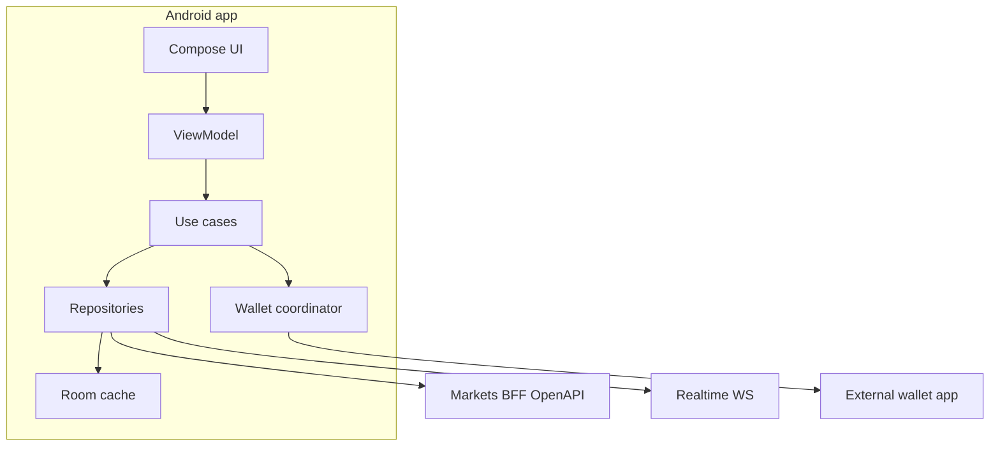

# Android and Google Play Current State

**Status:** reviewed
**Owner:** android-lead
**Last updated:** 2026-07-25
**Product:** RetroPick Markets V1

## Description

This research snapshot captures official Android architecture/Compose/modularization guidance and Google Play financial/crypto/blockchain policy constraints that shape Markets native client design (ADR-006) and release gating. `apps/android/` is README-only until PHASE-5 builds it (EV-027).

It maps platform guidance to RetroPick modular `feature/*`, `data/*`, `core/*` intent and keeps signing with external/approved wallet flows — Keystore for app secrets only; BiometricPrompt ≠ order signing. Shared API remains `schemas/openapi/markets-v1.yaml` (ADR-004).

Use before scaffolding Gradle modules, choosing wallet SDKs, or filing Play declarations. Clean-room only for no-LICENSE reference apps; no iOS/PRISM mobile under this note. Track BLK-021 for production Play uploads.

## 0. Developer intent (5W+1H)

Short orientation for implementers and agents. Read this before Android/Play constraint sections below.

The 5W+1H table below is a **navigation aid** only. It does not replace ADR-006, Play policy URLs, or `android/*` design docs; if anything conflicts, those authorities win. `apps/android/` is README-only until PHASE-5 builds it.

| Lens | Answer |
|------|--------|
| **Who** | Android-lead and PHASE-5 agents; security reviewing Keystore/network config; release managers planning Play financial/crypto declarations; orchestrators refusing early Android trading parity. |
| **What** | Research snapshot of official Android architecture/Compose/modularization guidance plus Google Play financial features, blockchain, crypto wallet/exchange, and payments policy constraints that gate Markets native release. Maps guidance to RetroPick modular `feature/*`, `data/*`, `core/*` intent. |
| **When** | Before scaffolding Gradle modules, choosing wallet SDK integration, or filing Play declarations. Re-read when Play policy URLs change or when BLK-002/BLK-021 move. |
| **Where** | This file + [ADR-006](../architecture/adr/ADR-006-ANDROID-JETPACK-COMPOSE.md) + [android/PLAY_STORE_COMPLIANCE_AND_RELEASE.md](../android/PLAY_STORE_COMPLIANCE_AND_RELEASE.md) + [.dev/ANDROID_MARKETS.md](../../ANDROID_MARKETS.md). Evidence: EV-027 (README-only). Shared API: `schemas/openapi/markets-v1.yaml` (ADR-004). |
| **Why** | Agents may copy no-LICENSE reference apps, store seeds in Keystore “for convenience,” or ship WebView wrappers. This research separates platform guidance from RetroPick decisions and keeps signing with external/approved wallet flows. |
| **How** | Plan single-activity Compose + Navigation; UI/Domain/Data layers; api/impl modules; Keystore for app secrets only; BiometricPrompt ≠ order signing; TLS via Network Security Config; defer Play Integrity as risk signal. No iOS/PRISM mobile in this scope. |

### Worked example

**Happy path — PHASE-5 scaffold**

1. Confirm task-graph PHASE-5 authorization and web trading stability expectations.
2. Create Gradle graph per `android/GRADLE_MODULE_GRAPH.md`; consume OpenAPI models in data layer.
3. Wallet connect via approved SDK; RetroPick never stores seed phrases.

**Happy path — Play gate**

1. Read financial-features + blockchain policy URLs in §4.
2. Track BLK-021; do not upload production builds without declarations/compliance checklist in Play release doc.

**Failure / Never**

- Pixel/layout copy from Streamatico PolymarketViewer (no LICENSE — clean-room only).
- Using BiometricPrompt as the sole authorizer for EIP-712 orders.
- Claiming Android trading complete without a real Gradle project.
- iOS work under this research note.

**Agent checklist**

- [ ] EV-027 / README-only acknowledged?
- [ ] ADR-006 + ANDROID_MARKETS read?
- [ ] Module dependency rules held?
- [ ] Play policy links reviewed for release phase?
- [ ] Shared OpenAPI only (no private Android API)?

**Reading tip:** Repository §5.1 first — platform guidance is useless if you pretend the app already exists on disk.

## 1. Purpose

Capture official Android platform guidance and Google Play policy constraints that shape RetroPick Markets native client design (ADR-006) and release gating.

## 2. Scope

### In scope

- Jetpack Compose architecture, modularization, security primitives, Play financial/crypto policies, distribution gates.

### Out of scope

- iOS.
- PRISM mobile client.
- Play Console account setup (operational).

## 3. Prerequisites

- [.dev/ANDROID_MARKETS.md](../../ANDROID_MARKETS.md)
- [ADR-006-ANDROID-JETPACK-COMPOSE.md](../architecture/adr/ADR-006-ANDROID-JETPACK-COMPOSE.md)
- [android/PLAY_STORE_COMPLIANCE_AND_RELEASE.md](../android/PLAY_STORE_COMPLIANCE_AND_RELEASE.md)

## 4. Authoritative sources

| Source | URL | Retrieved |
|--------|-----|-----------|
| App architecture | https://developer.android.com/topic/architecture | 2026-07-25 |
| Compose architecture | https://developer.android.com/develop/ui/compose/architecture | 2026-07-25 |
| Modularization | https://developer.android.com/topic/modularization | 2026-07-25 |
| Keystore | https://developer.android.com/privacy-and-security/keystore | 2026-07-25 |
| Network security config | https://developer.android.com/privacy-and-security/security-config | 2026-07-25 |
| Financial features declaration | https://support.google.com/googleplay/android-developer/answer/13849271 | 2026-07-25 |
| Blockchain content policy | https://support.google.com/googleplay/android-developer/answer/13607354 | 2026-07-25 |
| Crypto exchange/wallet requirements | https://support.google.com/googleplay/android-developer/answer/16329703 | 2026-07-25 |
| Payments policy | https://support.google.com/googleplay/android-developer/answer/10281818 | 2026-07-25 |

## 5. Current state

### 5.1 Repository

`apps/android/` is **README-only** — no Gradle project on disk (EV-027). BUILD_SESSION_PROMPT.md defines next implementation session. Target stack: Kotlin, Jetpack Compose, Material 3, Hilt, Retrofit, Coroutines/Flow.

### 5.2 Jetpack Compose (platform baseline)

Google recommends:

- **Single-activity** Compose app with Navigation Compose.
- **UI layer:** composables + ViewModel exposing `StateFlow`/`UiState`.
- **Domain layer:** use cases (e.g., `PreviewOrder`, `ObservePortfolio`).
- **Data layer:** repositories hiding Retrofit, WebSocket, Room.

RetroPick maps this to modular `feature/*`, `data/*`, `core/*` per ANDROID_MARKETS.md §4.

### 5.3 Modularization

Official guidance favors feature modules with **api/impl** separation and convention plugins (`build-logic/`). Dependency rules:

- Features → domain interfaces + design system.
- Data → generated OpenAPI models + mappers.
- No feature → direct wallet SDK calls.

### 5.4 Security primitives

| Primitive | Use in Markets |
|-----------|----------------|
| Android Keystore | App session tokens, encrypted prefs for non-wallet secrets |
| Network Security Config | TLS only; pin optional after review |
| BiometricPrompt | App unlock / sensitive settings — **not** order signing substitute |
| FLAG_SECURE | Optional on portfolio screens |
| Play Integrity | Risk signal for rooted/debug builds |

Wallet transaction signing remains with external wallet or approved wallet SDK — RetroPick never stores seed phrases.

### 5.5 Google Play — financial and crypto policies

Publishing a Polymarket trading client triggers:

1. **Financial features declaration** — declare crypto wallet / exchange / trading functionality accurately.
2. **Blockchain-based content policy** — may require licenses, jurisdiction proofs, and documentation for crypto services in target countries.
3. **Cryptocurrency exchange & software wallet policy** — compliance artifacts for regions where Google requires regulated entities.

**Implications:**

- Store listing must not promise guaranteed returns.
- Privacy policy, terms, fees, risk disclosures, and support contact required.
- Country distribution list must align with **server-side** geoblock (stricter of Play vs RetroPick policy).
- Play Billing applies to **digital subscriptions** (e.g., future analytics tier), not on-chain trades.

### 5.6 Background work and notifications

- FCM (or approved push provider) for fill/resolution alerts after backend reconciliation.
- WorkManager for cache refresh — not for autonomous trading.
- Push payloads carry opaque IDs; sensitive PnL fetched after auth.

### 5.7 Repository vs Play policy alignment

| RetroPick rule | Play alignment |
|----------------|----------------|
| No geoblock bypass | Required by blockchain policy |
| No raw key custody | Wallet policy |
| Markets-only (no PRISM) | Simpler financial declaration |
| Shared OpenAPI BFF | Demonstrates controlled trading path |

## 6. Target design

Native Android client `apps/android-markets/` (or `apps/android/` per monorepo naming) consuming **only** `schemas/openapi/markets-v1.yaml` — never production Polymarket CLOB directly.

Build variants:

| Variant | Backend | Distribution |
|---------|---------|--------------|
| devDebug | local/dev | internal |
| stagingRelease | staging | internal testing |
| prodRelease | production | Play staged rollout |

## 7. Alternatives considered

| Alternative | Rejected because |
|-------------|------------------|
| React Native / Flutter | ADR-006 locks Compose |
| KMP shared UI with web | Team stack + Play review complexity |
| Embedded WebView trading | Wallet security + policy risk |
| Direct CLOB from app | ADR-002 duplication |

## 8. Decisions

- Kotlin + Jetpack Compose + Material 3 (ADR-006).
- Gradle independent of pnpm monorepo orchestration.
- Play release gated on legal opinion per country (PHASE-7).
- Feature parity with web trading deferred to PHASE-5 after web PHASE-3 stable.

## 9. Data and control flows

## 10. Failure and recovery

| Scenario | Behavior |
|----------|----------|
| Offline | Show cached catalog/portfolio with freshness label; block new sign |
| WS gap | Snapshot resync per ADR-005 |
| Wallet reject | Clear error; preserve preview for edit |
| Play policy rejection | Halt rollout; legal remediation track |

## 11. Security

- No cleartext traffic.
- Certificate transparency / pinning evaluated PHASE-6.
- ProGuard/R8 rules for release; no secrets in APK.
- SBOM per release.

## 12. Observability

- Crashlytics/Sentry with signature redaction.
- Metrics: cold start, ANR, order sign-to-accept latency.
- Play Console vitals as launch gate.

## 13. Test strategy

- Compose UI tests + screenshot tests.
- Repository fakes with WS gap scenarios.
- Contract tests from OpenAPI golden fixtures.
- Manual matrix: wallets × API levels × regions (blocked).

## 14. Rollout and rollback

- Internal → closed → open testing → staged production (5% → 100%).
- Remote kill switch via `/markets/capabilities` + minimum version endpoint.
- Rollback via Play halt + prior APK track.

## 15. Open questions

- Minimum SDK / target SDK (ASSUMP-007, default API 26+ / target latest stable).
- Play Integrity required for prod? (ASSUMP-008).
- FCM vs alternative push vendor (ASSUMP-009).

## 16. Acceptance criteria

- [x] Documents Compose, modularization, Keystore, NSC
- [x] Documents Play financial/crypto/trading policies
- [x] Aligns with README-only android repo state
- [x] Links BFF-only API rule
