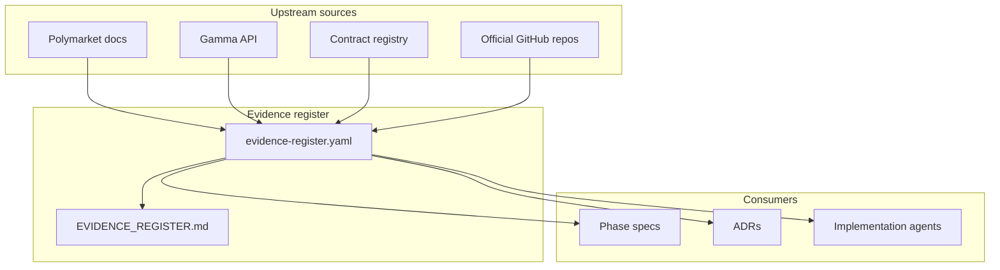

# Evidence Register

**Status:** reviewed
**Owner:** platform-orchestrator
**Last updated:** 2026-07-25
**Product:** RetroPick Markets V1

## Description

This is the human-readable index of time-sensitive upstream and repository claims (EV-001–EV-027) that gate Markets V1 implementation. Each record maps a claim to confidence, consequence, and revalidation trigger. Machine-readable source of truth: [evidence-register.yaml](evidence-register.yaml).

Cover Polymarket API/SDK/contracts/wallets/policies/collateral plus repository baselines (BFF stub, legacy freeze, Android README-only). Do not invent `0x` addresses in docs when confidence is `unverified`. Update YAML and this index together; never paste secrets or Builder credentials into evidence.

Look up EV-ID → read confidence → if unverified/partial, spike or escalate via blockers before trading/funding/contract integration. Treat YAML as canonical IDs/confidence; use this MD for human navigation and consumer flow.

## 0. Developer intent (5W+1H)

Short orientation for implementers and agents. Read this before evidence tables and flows below.

The 5W+1H table below is a **navigation aid** only. Machine-readable source of truth is [evidence-register.yaml](evidence-register.yaml). Do not invent `0x` addresses in docs when confidence is `unverified`.

| Lens | Answer |
|------|--------|
| **Who** | All Markets agents whose work depends on upstream or repo baseline claims; phase-gate reviewers; humans updating confidence after registry pulls. |
| **What** | Human-readable index of time-sensitive claims (EV-001–EV-027): Polymarket API/SDK/contracts/wallets/policies/collateral plus repository baselines (BFF stub, legacy freeze, Android README-only). Each record has confidence, consequence, and revalidation trigger. |
| **When** | Before phase gates and before any trading/funding/contract integration. Revalidate when `revalidation_trigger` fires or confidence would drop below `partially_verified` for launch-critical claims. |
| **Where** | This markdown index + `research/evidence-register.yaml`. Upstream: docs.polymarket.com and contract registry URLs cited in records. Repo citations must be file paths for `verified` repository claims. |
| **Why** | Ad-hoc Slack/blog addresses violate ADR-002 and master prompt §2.5. Unverified collateral/contracts (e.g. EV-008, EV-017–EV-020) must block production assumptions until pulled. |
| **How** | Look up EV-ID → read confidence → if unverified/partial, spike or escalate via [BLOCKERS_AND_HUMAN_APPROVALS.md](../../../.harness/products/markets-v1/governance/BLOCKERS_AND_HUMAN_APPROVALS.md). Update YAML and this index together. Never paste secrets, Builder credentials, or keys into evidence. |

### Worked example

**Happy path — PHASE-1 catalog**

1. Gamma/catalog EV records at partially_verified or better → proceed with ACL normalization tests.
2. Cite EV-IDs in task handoff.

**Happy path — PHASE-2 funding gate**

1. EV-008 collateral/pUSD still unverified → do not hardcode token address; pull registry; update YAML confidence.
2. Until verified, keep funding tasks blocked or spike-only per phase spec.

**Failure / Never**

- Hard-coding addresses from tweets into `markets-v1` docs.
- Skipping YAML mirror updates.
- Using evidence register for PRISM protocol claims.
- Clearing blockers without changing confidence + dated retrieval.

**Agent checklist**

- [ ] EV-ID listed for the claim?
- [ ] Confidence sufficient for this phase?
- [ ] YAML and MD consistent?
- [ ] Revalidation trigger understood?
- [ ] No secrets in the register?

**Reading tip:** Treat YAML as canonical IDs/confidence; use this MD for human navigation and mermaid consumer flow.

## 1. Purpose

Human-readable index of time-sensitive upstream and repository claims that gate Markets V1 implementation. Each record maps a claim to confidence, consequence, and revalidation trigger. Machine-readable source of truth: [evidence-register.yaml](evidence-register.yaml).

## 2. Scope

### In scope

- Polymarket API, SDK, contract, wallet, policy, and collateral claims.
- Repository baseline claims (BFF stub, legacy freeze, Android stack).

### Out of scope

- PRISM protocol claims.
- Production secrets, Builder credentials, or wallet keys.

## 3. Prerequisites

- [00_DOCUMENT_MAP.md](../00_DOCUMENT_MAP.md)
- [.dev/MARKETS.md](../../MARKETS.md)
- Master prompt §2.5 evidence register contract

## 4. Authoritative sources

| Source | URL / path | Retrieved | Role |
|--------|------------|-----------|------|
| Polymarket docs | https://docs.polymarket.com/ | 2026-07-25 | Primary upstream |
| Contract registry | https://docs.polymarket.com/resources/contracts | 2026-07-25 | Addresses (verify at impl) |
| Gamma API | https://gamma-api.polymarket.com | 2026-07-25 | Catalog |
| Repo BFF | `apps/backend/internal/markets/` | 2026-07-25 | Current implementation |
| YAML register | `research/evidence-register.yaml` | 2026-07-25 | Canonical IDs |

## 5. Current state

27 evidence records (EV-001–EV-027). Six contract-address claims (EV-017–EV-020) remain **unverified** until implementation-time registry pull. Collateral/pUSD (EV-008) is **unverified** pending PHASE-2 funding spike.

## 6. Target design

Before each phase gate, agents revalidate all records tagged in that phase's `revalidation_trigger`. Blocked work uses [BLOCKERS_AND_HUMAN_APPROVALS.md](../../../.harness/products/markets-v1/governance/BLOCKERS_AND_HUMAN_APPROVALS.md) when confidence drops below `partially_verified` for launch-critical claims.

## 7. Alternatives considered

| Alternative | Rejected because |
|-------------|------------------|
| Ad-hoc Slack notes | Not auditable; violates master prompt §2.5 |
| Hard-code addresses from blog posts | Violates ADR-002 and §8.2 registry rules |
| Skip YAML mirror | Agents need machine-readable confidence for automation |

## 8. Decisions

- IDs use `EV-###` prefix (not `EVIDENCE-###`) for brevity in traceability matrices.
- `unverified` contract addresses are documented with registry URL only — no invented `0x` values in docs.
- Repository claims at `verified` confidence require file-path citation.

## 9. Data and control flows

## 10. Failure and recovery

| Failure | Recovery |
|---------|----------|
| Upstream docs contradict register | Update YAML+MD same PR; bump `last_updated`; downgrade confidence |
| Contract registry changes overnight | Halt trading capability flag; run registry diff job; human review |
| False verified confidence | Incident in DECISION_AND_ASSUMPTION_LOG; re-audit affected phases |

## 11. Security

- Never store API keys, L2 secrets, or signed orders in evidence records.
- `source_url` only — no authenticated doc URLs with embedded tokens.

## 12. Observability

- CI job (PHASE-6) diffs `evidence-register.yaml` `retrieved` dates against 30-day SLA.
- Dashboard tile: count by `confidence` tier.

## 13. Test strategy

- YAML schema validation in CI (required fields present).
- Spot-check: 3 random EV-IDs manually re-fetched before PHASE-3 gate.

## 14. Rollout and rollback

- Wave 0 freeze: status `reviewed` on 2026-07-25.
- Rollback = revert YAML/MD commit; do not delete IDs (mark superseded).

## 15. Open questions

- EV-008 pUSD vs bridged USDC semantics — see [OPEN_QUESTIONS_AND_EXPIRING_ASSUMPTIONS.md](OPEN_QUESTIONS_AND_EXPIRING_ASSUMPTIONS.md) ASSUMP-003.
- ts-sdk vs clob-client-v2 primary reference for conformance tests — ASSUMP-005.

## 16. Acceptance criteria

- [x] ≥20 entries with unique EV-IDs
- [x] Covers CLOB V2, Gamma, Builder, relayer, pUSD, Polygon, geoblock, account wallets, NegRisk, Combos, contracts
- [x] YAML and MD tables consistent
- [x] Contract addresses tagged unverified where not confirmed in repo

---

## Summary by confidence

| Confidence | Count | IDs |
|------------|-------|-----|
| verified | 4 | EV-002, EV-025, EV-026, EV-027 |
| partially_verified | 18 | EV-001, EV-003–EV-007, EV-009–EV-016, EV-021–EV-024 |
| unverified | 5 | EV-008, EV-017, EV-018, EV-019, EV-020 |

## Trading and venue

| ID | Topic | Claim (summary) | Confidence | Consequence |
|----|-------|-----------------|------------|-------------|
| EV-001 | CLOB V2 | V2 is current trading API | partially_verified | All order paths use V2 |
| EV-003 | CLOB host | clob.polymarket.com production | partially_verified | Allowlisted hosts only |
| EV-014 | Testnet | No reliable public testnet | partially_verified | Fixtures + capped smoke |
| EV-015 | EIP-712 | Typed order signatures required | partially_verified | Preview hash = signed payload |
| EV-024 | Realtime | WS book/trades with sequences | partially_verified | Gap detect + resync |

## Catalog and APIs

| ID | Topic | Claim (summary) | Confidence | Consequence |
|----|-------|-----------------|------------|-------------|
| EV-002 | Gamma | gamma-api.polymarket.com catalog | verified | BFF proxies /events |
| EV-022 | ts-sdk | Unified TS SDK | partially_verified | Tooling reference |
| EV-023 | clob-client-v2 | V2 client reference | partially_verified | Clean-room Go adapter |

## Builder, relayer, fees

| ID | Topic | Claim (summary) | Confidence | Consequence |
|----|-------|-----------------|------------|-------------|
| EV-004 | Builder program | Attribution + fee program | partially_verified | Enrollment required |
| EV-005 | Builder fees | Notional-based configurable fees | partially_verified | Runtime fee resolver |
| EV-006 | Relayer | Gasless allowlisted txs | partially_verified | Relayer module + budgets |

## Chain, collateral, contracts

| ID | Topic | Claim (summary) | Confidence | Consequence |
|----|-------|-----------------|------------|-------------|
| EV-007 | Polygon | chain_id 137 | partially_verified | Wallet + EIP-712 bind |
| EV-008 | pUSD | Current collateral abstraction | unverified | Registry pull before funding |
| EV-017 | CTF Exchange V2 | Address from official registry | unverified | Startup bytecode check |
| EV-018 | NegRisk exchange | Separate registry entry | unverified | Per-market exchange select |
| EV-019 | CTF core | Conditional tokens contract | unverified | Indexer address binding |
| EV-020 | Collateral token | pUSD/successor address | unverified | Balance/allowance checks |
| EV-021 | ctf-exchange-v2 repo | Official source/ABI | partially_verified | Tagged ABI vendoring |

## Policy, wallets, products

| ID | Topic | Claim (summary) | Confidence | Consequence |
|----|-------|-----------------|------------|-------------|
| EV-009 | Geoblock | Official restriction API | partially_verified | Fail-closed eligibility |
| EV-010 | Account wallets | Signer ≠ account wallet | partially_verified | Separate domain fields |
| EV-011 | Deposit wallets | Gasless deposit wallet flow | partially_verified | PHASE-2 funding UX |
| EV-012 | Negative Risk | Distinct NegRisk metadata/contracts | partially_verified | No title-based inference |
| EV-013 | Combos | Limited API; feature-gate | partially_verified | capabilities.combos false |
| EV-016 | CTF ops | Split/merge/redeem | partially_verified | PHASE-4 endpoints |

## Repository baseline

| ID | Topic | Claim (summary) | Confidence | Consequence |
|----|-------|-----------------|------------|-------------|
| EV-025 | BFF stub | 3 OpenAPI endpoints live | verified | Web/Android bind OpenAPI |
| EV-026 | Legacy freeze | No new legacy markets features | verified | internal/markets only |
| EV-027 | Android stack | Kotlin + Compose | verified | ADR-006 |
