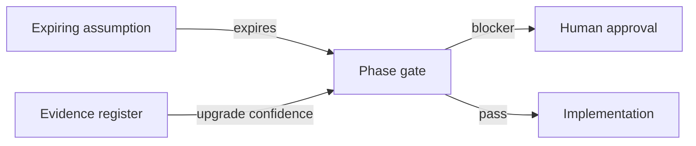
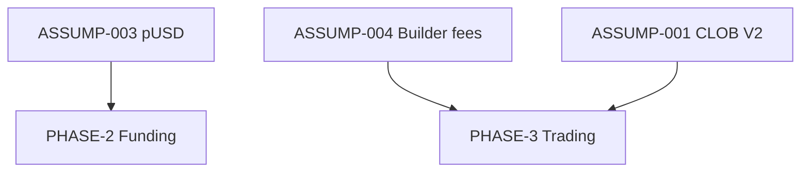

# Open Questions and Expiring Assumptions

**Status:** reviewed
**Owner:** platform-orchestrator
**Last updated:** 2026-07-25
**Product:** RetroPick Markets V1

## Description

This tracker holds unresolved Polymarket/Builder/legal/Android/OSS questions and **time-boxed assumptions** that must be revalidated or escalated before they block phase gates. Silent expired assumptions become production incidents (wrong collateral, premature Combos, Play rejection).

Link EV-IDs and escalation paths; close only with dated evidence. Weekly sweep assumptions expiring within 14 days; every PHASE gate checklist must include an assumption ID sweep. Companion decision/assumption log: [DECISION_AND_ASSUMPTION_LOG.md](../../../.harness/products/markets-v1/governance/DECISION_AND_ASSUMPTION_LOG.md).

## 0. Developer intent (5W+1H)

Short orientation for implementers and agents. Read this before open-question and assumption tables below.

The 5W+1H table below is a **navigation aid** only. It does not replace dated assumption rows, expiry dates, or blocker/decision logs; if anything conflicts, those tables and [DECISION_AND_ASSUMPTION_LOG.md](../../../.harness/products/markets-v1/governance/DECISION_AND_ASSUMPTION_LOG.md) win.

| Lens | Answer |
|------|--------|
| **Who** | Orchestrators running phase gates; implementers about to rely on an unverified upstream behavior; humans who must answer legal/Builder/Play questions agents cannot close. |
| **When** | Weekly (assumptions expiring within 14 days) and at every PHASE gate checklist sweep. Re-read when an assumption’s expiry date passes or evidence confidence changes. |
| **Where** | This file + [evidence-register.yaml](evidence-register.yaml) + [BLOCKERS_AND_HUMAN_APPROVALS.md](../../../.harness/products/markets-v1/governance/BLOCKERS_AND_HUMAN_APPROVALS.md) + decision/assumption log. Do not bury new assumptions only in chat. |
| **Why** | Silent expired assumptions become production incidents (wrong collateral, premature Combos, Play rejection). Time-boxing forces revalidation or escalation before gates turn green. |
| **How** | Before coding on a risky dependency, find the assumption/question ID → check expiry → revalidate or escalate. Close only with dated evidence. PHASE gate must include assumption ID sweep (see §13). |

### Worked example

**Happy path — assumption still green**

1. Task depends on CLOB V2 host assumption with future expiry.
2. Confirm date + EV confidence; proceed; cite IDs in handoff.

**Happy path — expired assumption**

1. Gate checklist finds assumption past expiry.
2. Re-fetch Polymarket docs / registry; update evidence + this tracker; or open BLK human approval — do not “hope.”

**Failure / Never**

- Implementing Combos because an old assumption said “probably fine.”
- Closing legal/Play questions inside agent-only PRs without human approval.
- Letting weekly expiry report rot without owner action.

**Agent checklist**

- [ ] Related open question IDs checked?
- [ ] Assumption expiry in the future?
- [ ] EV-ID linked where applicable?
- [ ] Escalation path known?
- [ ] Decision log updated if resolved?

**Reading tip:** Purpose + acceptance criteria define the operating loop; the tables below are the live queue — keep them dated.

## 1. Purpose

Track unresolved upstream/product decisions and **time-boxed assumptions** that must be revalidated or escalated before they block phase gates.

## 2. Scope

### In scope

- Polymarket platform, Builder enrollment, legal/jurisdiction, Android release, OSS adoption.

### Out of scope

- PRISM protocol design.

## 3. Prerequisites

- [evidence-register.yaml](evidence-register.yaml)
- [../../../.harness/products/markets-v1/governance/BLOCKERS_AND_HUMAN_APPROVALS.md](../../../.harness/products/markets-v1/governance/BLOCKERS_AND_HUMAN_APPROVALS.md)
- [../../../.harness/products/markets-v1/governance/DECISION_AND_ASSUMPTION_LOG.md](../../../.harness/products/markets-v1/governance/DECISION_AND_ASSUMPTION_LOG.md)

## 4. Authoritative sources

| Source | Role |
|--------|------|
| EV-### records | Upstream claim confidence |
| implementation-manifest.yaml | `verify_current_pUSD_configuration` gate |
| Master prompt §15 | Pre-implementation decisions |

## 5. Current state

12 open questions and 10 expiring assumptions documented below. None resolved at Wave 0 freeze.

## 6. Target design

Each assumption has: `id`, `statement`, `expires`, `owner`, `revalidate_action`, `blocker_if_false`.

Assumption expiry triggers automatic review task in phase gate unless superseded by evidence record upgrade to `verified`.

## 7. Alternatives considered

| Alternative | Rejected because |
|-------------|------------------|
| Implicit assumptions in code | Violates agent contract §4 |
| No expiry dates | Stale collateral/wallet docs caused production incidents in other projects |

## 8. Decisions

- Fail closed when assumption expires without revalidation.
- Human approval required for jurisdiction expansion and Builder production keys.

## 9. Data and control flows

## 10. Failure and recovery

Expired assumption without resolution → phase gate **fail**; log in BLOCKERS_AND_HUMAN_APPROVALS.md.

## 11. Security

Assumptions about signing/custody require security reviewer sign-off when revalidated.

## 12. Observability

Weekly report: assumptions expiring within 14 days.

## 13. Test strategy

PHASE gate checklist includes assumption ID sweep.

## 14. Rollout and rollback

N/A — documentation only.

## 15. Open questions

See tables below (this section self-references).

## 16. Acceptance criteria

- [x] Dated assumptions with expiry dates
- [x] Linked to EV-IDs where applicable
- [x] Owners assigned

---

## Open questions (unresolved)

| ID | Question | Owner | Blocks | EV ref |
|----|----------|-------|--------|--------|
| OQ-001 | Which wallet connect vendors are V1-supported (WalletConnect v2, Coinbase, etc.)? | product | PHASE-2 | EV-010 |
| OQ-002 | RetroPick session auth model separate from wallet proof (OAuth, SIWE, or both)? | backend | PHASE-2 | — |
| OQ-003 | Exact Builder enrollment status and production builder code | product-legal | PHASE-3 | EV-004 |
| OQ-004 | Supported country list for launch vs geoblock-only | legal | PHASE-7 | EV-009 |
| OQ-005 | CTF ops: user-submitted vs relayer-only for split/merge/redeem | backend | PHASE-4 | EV-006 |
| OQ-006 | Fiat on-ramp provider in scope for V1 or V1.1? | product | PHASE-2 | EV-008 |
| OQ-007 | Realtime transport: SSE vs WebSocket vs both for BFF | backend | PHASE-1 | EV-024 |
| OQ-008 | Room encryption required for local portfolio cache? | android | PHASE-5 | — |
| OQ-009 | Premium analytics subscription and Play Billing architecture | product | Post-V1 | — |
| OQ-010 | Combos official requester API availability for builders | product | PHASE-8 | EV-013 |
| OQ-011 | Upstream rate limits for Gamma/CLOB at expected MAU | platform | PHASE-6 | EV-002 |
| OQ-012 | PostgreSQL hosting and multi-region strategy | platform | PHASE-1 | — |

---

## Expiring assumptions

| ID | Assumption | Expires | Owner | Revalidate action | If false |
|----|------------|---------|-------|-------------------|----------|
| ASSUMP-001 | CLOB V2 remains production API; no forced V3 migration before 2026-10-01 | 2026-10-01 | markets-backend | Check Polymarket changelog monthly | Freeze trading; adapter spike |
| ASSUMP-002 | Gamma `/events` offset pagination remains stable for BFF catalog | 2026-08-15 | markets-backend | Integration test against prod Gamma weekly | Switch to cursor API if documented |
| ASSUMP-003 | pUSD is canonical collateral per current docs; registry lists single primary collateral token on Polygon | 2026-08-15 | markets-backend | Pull contract registry; on-chain `decimals()` | Rebuild funding flows |
| ASSUMP-004 | Builder fee max bps unchanged within ±0 from docs snapshot until enrollment | 2026-08-01 | product-legal | Fetch builders/fees page | Update fee resolver + disclosures |
| ASSUMP-005 | clob-client-v2 order schema matches ts-sdk for golden vectors | 2026-09-01 | markets-backend | Cross-run both clients on fixture set | Pick single conformance authority |
| ASSUMP-006 | Polymarket/ts-sdk latest minor is safe for dev harness | 2026-08-01 | markets-backend | Pin SHA; npm audit | Use clob-client-v2 only |
| ASSUMP-007 | minSdk 26 / targetSdk latest-1 acceptable for Markets audience | 2026-08-15 | android-lead | Analytics on install base | Adjust in GRADLE_MODULE_GRAPH |
| ASSUMP-008 | Play Integrity API optional for V1 prod (warn-only) | 2026-09-15 | android-lead | Policy review | Enforce or restrict features |
| ASSUMP-009 | FCM acceptable for push given data residency requirements | 2026-08-30 | platform | Legal/privacy review | Alternate push vendor |
| ASSUMP-010 | No public Polymarket testnet will exist before 2026-12-31 | 2026-12-31 | markets-platform | Monitor docs | Adopt official sandbox if launched |

---

## Assumption dependency graph

## Review schedule

| Week of | Action |
|---------|--------|
| 2026-08-01 | Revalidate ASSUMP-004, ASSUMP-006 |
| 2026-08-15 | Revalidate ASSUMP-002, ASSUMP-003, ASSUMP-007 |
| 2026-08-30 | Revalidate ASSUMP-009 |
| 2026-09-01 | Revalidate ASSUMP-005 |
| 2026-09-15 | Revalidate ASSUMP-008 |
