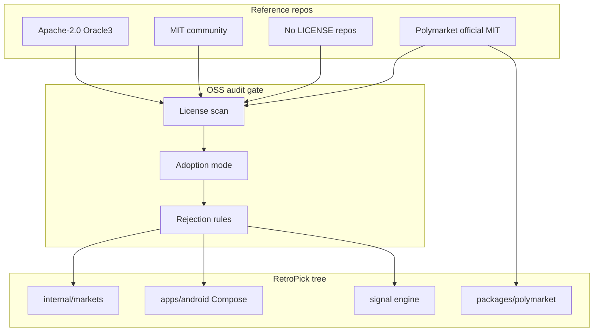

# Open Source Reference Audit

**Status:** reviewed
**Owner:** platform-orchestrator
**Last updated:** 2026-07-25
**Product:** RetroPick Markets V1

## 1. Purpose

Gate third-party repository reuse for Markets V1 per ADR-007 and master prompt §2.3. Defines adoption mode, license posture, and explicit rejections before any code enters the monorepo.

Machine-readable registry: [open-source-provenance.yaml](open-source-provenance.yaml).

## 2. Scope

### In scope

- Polymarket official repos, community reference repos, and intelligence/analytics inspirations listed in master prompt §2.3.

### Out of scope

- npm/cargo crates resolved via normal package managers (separate SBOM process).
- PRISM contract repos.

## 3. Prerequisites

- [ADR-007-OSS-ADOPTION-AND-CLEAN-ROOM.md](../architecture/adr/ADR-007-OSS-ADOPTION-AND-CLEAN-ROOM.md)
- [security/SUPPLY_CHAIN_AND_SBOM.md](../security/SUPPLY_CHAIN_AND_SBOM.md)

## 4. Authoritative sources

| Repository | License (audit date) | Adoption mode |
|------------|---------------------|---------------|
| Polymarket/ts-sdk | MIT | official_dependency (tooling) |
| Polymarket/clob-client-v2 | MIT | behavioral_reference_only → Go clean-room |
| Streamatico/PolymarketViewer | **No LICENSE** | clean_room_reimplementation |
| Syavaman/PolymarketAlerts | **No LICENSE** | clean_room_reimplementation |
| al1enjesus/polymarket-whales | MIT | selective_port (after review) |
| YichengYang-Ethan/oracle3 | Apache-2.0 | behavioral_reference_only (Phase 8) |

Full list in YAML.

## 5. Current state

Wave 0 audit complete. **No third-party product source code** is vendored into `apps/` or `packages/` beyond placeholder `@retropick/polymarket` types. License verification used GitHub LICENSE file presence on 2026-07-25; commit SHAs will be pinned at first import.

## 6. Target design

### 6.1 Adoption modes (allowed)

1. `official_dependency` — Polymarket official SDK/ABI with verified license.
2. `selective_port` — MIT algorithm port with review (polymarket-whales).
3. `clean_room_reimplementation` — No LICENSE repos; study behavior, rewrite.
4. `behavioral_reference_only` — UX/heuristic inspiration; no code copy.
5. `reject` — Prohibited patterns (key custody, geoblock bypass).

### 6.2 Primary audited repositories

#### PolymarketViewer (Streamatico) — **No LICENSE**

| Field | Value |
|-------|-------|
| URL | https://github.com/Streamatico/PolymarketViewer |
| Value | Native Compose discovery, charts, watchlist, comments, profiles, Glance widgets |
| Decision | **Clean-room reimplementation** only |
| Rationale | Absence of LICENSE file prohibits copying code, layouts, strings, or assets |
| RetroPick action | Recreate patterns inside `apps/android/` modular graph per ANDROID_MARKETS.md |

#### PolymarketAlerts (Syavaman) — **No LICENSE**

| Field | Value |
|-------|-------|
| URL | https://github.com/Syavaman/PolymarketAlerts |
| Value | Large-trade alerts, wallet profiles, watchlists, Telegram/push, rule settings |
| Decision | **Clean-room reimplementation** in shared signal engine (ADR-008) |
| Rationale | No LICENSE; alert delivery must use RetroPick notification architecture |
| RetroPick action | Implement rule DSL in Go; no fork of Python/Node reference code |

#### polymarket-whales (al1enjesus) — **MIT**

| Field | Value |
|-------|-------|
| URL | https://github.com/al1enjesus/polymarket-whales |
| Value | Threshold detection, deduplication, Telegram/Discord, export |
| Decision | **Selective port** after security + license scan |
| Rationale | MIT permits algorithm reuse with attribution; reject any geoblock-bypass docs |
| RetroPick action | Reimplement WhaleScore pipeline in Go; preserve MIT NOTICE if snippets used |

#### Oracle3 (YichengYang-Ethan) — **Apache-2.0**

| Field | Value |
|-------|-------|
| URL | https://github.com/YichengYang-Ethan/oracle3 |
| Value | Cross-market constraints, discrepancy scanning, equivalence classes |
| Decision | **Behavioral reference for Post-V1** (Phase 8) |
| Rationale | Research-grade; not V1 dependency; Apache-2.0 if code ported later |
| RetroPick action | Document constraint taxonomy in intelligence/; no V1 import |

#### Official ts-sdk — **MIT**

| Field | Value |
|-------|-------|
| URL | https://github.com/Polymarket/ts-sdk |
| Value | Unified CLOB, Gamma, wallet helpers |
| Decision | **official_dependency** for conformance harnesses and `packages/polymarket` dev tooling |
| Rationale | Official; supersedes piecemeal clients for TS-side validation |
| RetroPick action | Pin version in devDependencies; generate golden fixtures |

#### clob-client-v2 — **MIT**

| Field | Value |
|-------|-------|
| URL | https://github.com/Polymarket/clob-client-v2 |
| Value | V2 order construction, L1/L2 auth reference |
| Decision | **behavioral_reference_only** for Go BFF adapter |
| Rationale | Production server is Go; clean-room port of behavior, not TS copy |
| RetroPick action | Golden vectors derived from upstream examples (redacted secrets) |

### 6.3 Explicit rejections

| Pattern | Found in | Action |
|---------|----------|--------|
| Server-side raw private keys | polymarket-cabinet | reject |
| Geoblock/VPN bypass | some whale repos | reject; security review |
| Autonomous copy trading | various | reject per ADR-009 |
| "Insider" wallet labels | whale-tracker repos | reject; use `unusual_activity` |
| V1 multi-venue (pmxt) | pmxt-dev/pmxt | defer Post-V1 |

## 7. Alternatives considered

| Alternative | Rejected because |
|-------------|------------------|
| Copy PolymarketViewer Compose code | No LICENSE |
| Ignore OSS audit until Phase 5 | Legal/supply-chain risk |
| Import all MIT repos wholesale | Unreviewed dependencies and behaviors |

## 8. Decisions

- Missing LICENSE → clean-room (ADR-007).
- Go owns server intelligence; no Python sidecar for alerts.
- Official Polymarket repos may be dependencies; community repos are references unless MIT+reviewed.

## 9. Data and control flows

## 10. Failure and recovery

| Failure | Recovery |
|---------|----------|
| License added/changed upstream | Re-run audit; update YAML SHA |
| CVE in ported dependency | SBOM alert; patch or remove port |
| Accidental code copy from no-LICENSE repo | Remove in same PR; legal escalation |

## 11. Security

- Dependency pinning and `npm audit` / `govulncheck` in CI.
- No clipboard import of wallet handling code from cabinet-style repos.
- Provenance recorded in SBOM per package.

## 12. Observability

- CI fails if `open-source-provenance.yaml` adoption_mode missing for new imports.
- Quarterly re-audit scheduled in platform runbook.

## 13. Test strategy

- License file hash check script in CI.
- For selective_port: unit tests prove behavior match without copying verbatim blocks >20 lines.

## 14. Rollout and rollback

- Wave 0: audit docs only.
- First `selective_port`: requires security sign-off in BLOCKERS log.
- Rollback: remove vendored code; revert to clean-room.

## 15. Open questions

- Pin commit SHA for ts-sdk at PHASE-1 harness setup (ASSUMP-006).
- Whether PolymarketViewer adds LICENSE (would reopen selective_port for UI utilities only).

## 16. Acceptance criteria

- [x] PolymarketViewer documented as no LICENSE → clean-room
- [x] PolymarketAlerts documented as no LICENSE → clean-room
- [x] polymarket-whales MIT selective port path
- [x] Oracle3 Apache-2.0 Phase 8 reference
- [x] Official ts-sdk and clob-client-v2 documented
- [x] YAML provenance file complete
