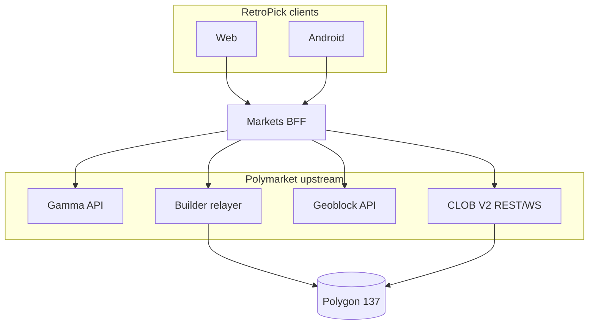
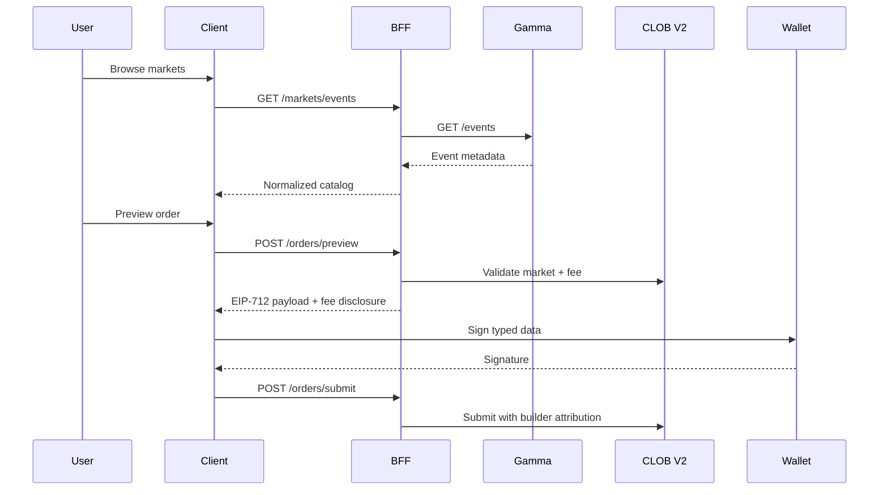

# Polymarket Current State

**Status:** reviewed
**Owner:** platform-orchestrator
**Last updated:** 2026-07-25
**Product:** RetroPick Markets V1

## 1. Purpose

Document the **current** Polymarket platform surface area relevant to RetroPick Markets V1 as of Wave 0 discovery. This is the upstream baseline against which the BFF anti-corruption layer (ADR-002) is designed.

## 2. Scope

### In scope

- CLOB V2, Gamma, Builder, relayer, wallets, collateral, NegRisk, Combos, geoblock, contracts, realtime, and testing posture.

### Out of scope

- PRISM settlement.
- RetroPick custom exchange contracts.
- Third-party venue adapters (post-V1).

## 3. Prerequisites

- [evidence-register.yaml](evidence-register.yaml) (EV-001–EV-024)
- [polymarket/](../polymarket/) deep-dive docs (implementation phases)
- [.dev/MARKETS.md](../../MARKETS.md)

## 4. Authoritative sources

| Source | URL | Retrieved | Confidence |
|--------|-----|-----------|------------|
| Developer docs | https://docs.polymarket.com/ | 2026-07-25 | partially_verified |
| V2 migration | https://docs.polymarket.com/v2-migration | 2026-07-25 | partially_verified |
| Wallets & auth | https://docs.polymarket.com/trading/wallets-auth | 2026-07-25 | partially_verified |
| Deposit wallets | https://docs.polymarket.com/trading/deposit-wallets | 2026-07-25 | partially_verified |
| Builder program | https://docs.polymarket.com/programs/builders/overview | 2026-07-25 | partially_verified |
| Builder fees | https://docs.polymarket.com/programs/builders/fees | 2026-07-25 | partially_verified |
| Negative risk | https://docs.polymarket.com/concepts/negative-risk | 2026-07-25 | partially_verified |
| Combos help | https://help.polymarket.com/en/articles/15458600-what-are-combos | 2026-07-25 | partially_verified |
| Geoblock API | https://docs.polymarket.com/api-reference/geoblock | 2026-07-25 | partially_verified |
| Contract registry | https://docs.polymarket.com/resources/contracts | 2026-07-25 | unverified (addresses) |
| ts-sdk | https://github.com/Polymarket/ts-sdk | 2026-07-25 | partially_verified |
| clob-client-v2 | https://github.com/Polymarket/clob-client-v2 | 2026-07-25 | partially_verified |

## 5. Current state

### 5.1 CLOB V2 migration

Polymarket has migrated order matching to **CLOB V2**. V1 assumptions (hosts, order schema, auth headers, EIP-712 domains) are obsolete. Production traffic targets `clob.polymarket.com` REST and WebSocket endpoints documented under the V2 migration guide.

**RetroPick impact:** Go venue adapter in `apps/backend/internal/markets/` (future `clob/` package) must pin SDK/docs version and run golden-vector tests against V2 order payloads. No V1 code paths.

### 5.2 Authentication layers

CLOB integration uses a two-layer model:

1. **L1** — wallet signature proving control of signer EOA (EIP-712 or personal_sign per current docs).
2. **L2** — API key derived from L1 auth, used for order submission and private channels.

Credentials are per-signer and must be stored encrypted server-side only if RetroPick operates a session model; mobile/web should not embed L2 secrets in APK or localStorage without platform keystore protection.

### 5.3 Account wallets and Deposit Wallets

Polymarket distinguishes:

| Concept | Role |
|---------|------|
| Signer EOA | Signs L1 auth and EIP-712 orders |
| Account wallet | Holds collateral and outcome tokens; may be proxy/Safe |
| Deposit Wallet | User-facing funding address with gasless deploy/relay options |

**Critical:** `maker`, `funder`, and displayed balance addresses may differ. RetroPick canonical models must store all three where applicable (EV-010, EV-011).

### 5.4 Collateral (pUSD)

Official CLOB V2 materials reference **pUSD** as the trading collateral abstraction, potentially superseding older USDC.e mental models. Exact token contract, decimals, wrap/bridge paths, and on-ramp partners are **unverified in this repo** (EV-008, EV-020). Implementation must pull addresses from the contract registry at PHASE-2 gate.

Fixed-point rule: store amounts as integer micro-units (e.g., 6 decimals → `1_000_000` = 1.00 unit).

### 5.5 Polygon chain

Settlement occurs on **Polygon PoS, chain_id 137** (EV-007). RPC providers, block confirmations, and reorg depth feed reconciliation policy (ADR-005).

### 5.6 Gamma API (catalog)

Public metadata — events, markets, outcomes, tags, images, resolution text — is served by **Gamma** (`gamma-api.polymarket.com`). RetroPick's `gamma.Client` already fetches `/events?active=true&closed=false` with limit/offset pagination.

Gamma is read-only for RetroPick; it does not replace CLOB for executable prices.

### 5.7 Builder program and fees

Enrolled builders attach a **builder code** to orders. Fees are configurable within published maximums on notional. Fee schedule changes require notice per program terms.

**UX requirement:** Show effective builder fee rate, fee version, and estimated fee currency amount on every order preview before wallet signature (EV-004, EV-005).

### 5.8 Builder relayer

The relayer submits **gasless** on-chain transactions for allowlisted operations (approvals, CTF ops, some wallet deploys) when Builder credentials and user signatures are valid. Not a blanket "free gas" — function allowlists and budgets apply (EV-006).

### 5.9 Negative Risk

NegRisk events group mutually exclusive outcomes. A NO position in one outcome may be convertible across remaining outcomes via NegRisk exchange contracts. Adapter must read `neg_risk` (or equivalent) from official metadata — **never infer from titles** (EV-012).

Augmented NegRisk variants may exist; treat as capability-gated until metadata contract is documented.

### 5.10 Combos

Combos bundle multiple legs with venue-supported economics. Help documentation describes **limited availability** and liquidity-dependent fills. Public requester API for third-party builders appears incomplete or gated (EV-013).

**RetroPick posture:** `capabilities.combos = false` until official API availability is verified and legal review completes. Do not simulate combos via rapid sequential single-leg orders without independent-leg risk disclosure.

### 5.11 Geographic restrictions

Official **geoblock** endpoint returns whether the caller's jurisdiction may trade. This is necessary but not sufficient for RetroPick compliance — server-side policy layer adds sanctions, age, and product rules (EV-009).

### 5.12 Contract addresses

All production addresses MUST be loaded from https://docs.polymarket.com/resources/contracts at implementation time. Wave 0 docs intentionally omit `0x` literals (EV-017–EV-020). Startup verification: chain ID, non-empty bytecode, proxy implementation match where applicable.

### 5.13 Realtime market data

WebSocket feeds provide order book deltas and trades. Clients must track sequence numbers, detect gaps, fetch snapshot, and label staleness. Matching engine restarts may reset books — reconciliation required (EV-024).

### 5.14 No public testnet

Polymarket does not offer a production-faithful public CLOB testnet (EV-014). Test strategy:

- Recorded HTTP/WS fixtures in `schemas/fixtures/`
- Mock CLOB in CI
- Optional capped production smoke wallets with human approval

## 6. Target design

RetroPick implements a **single BFF** (`internal/markets`) that:

1. Normalizes Gamma + CLOB + geoblock into OpenAPI models.
2. Exposes capability flags reflecting verified upstream features.
3. Never signs orders server-side; returns signable payloads to client wallets.
4. Routes submitted orders with Builder attribution when enrolled.

See [polymarket/CAPABILITY_AND_DEPENDENCY_MATRIX.md](../polymarket/CAPABILITY_AND_DEPENDENCY_MATRIX.md).

## 7. Alternatives considered

| Alternative | Rejected because |
|-------------|------------------|
| Client-direct CLOB in prod | Duplicates fees, eligibility, rate limits (ADR-002) |
| Custom exchange contracts | ADR-001 |
| Assume USDC.e collateral | Contradicts current docs direction (pUSD) |
| Combos via sequential legs | Hidden leg risk; violates product boundary |

## 8. Decisions

- CLOB V2 only (EV-001).
- Contract addresses from registry at runtime, not docs memory.
- Combos capability-gated (EV-013).
- Fail-closed geoblock (EV-009).
- Builder fees disclosed pre-sign (EV-005).

## 9. Data and control flows

## 10. Failure and recovery

| Domain | Failure | Behavior |
|--------|---------|----------|
| Gamma | 5xx / timeout | Return 502; serve cached catalog with stale label if available |
| CLOB | Rate limit | Exponential backoff; circuit breaker |
| CLOB | Book gap | Snapshot resync; disable marketable orders until fresh |
| Geoblock | Unavailable | `eligible: false` (fail closed) |
| Relayer | Revert | Surface simulation error; do not retry blindly |
| Registry | Address mismatch at startup | `trading: false` in capabilities |

## 11. Security

- L2 API keys encrypted at rest; never logged.
- Builder signing keys in HSM/vault; rotation runbook required.
- Relayer allowlist only official contract functions.
- No geoblock bypass (ADR-009, OSS audit).

## 12. Observability

- Metrics: `upstream_clob_latency_ms`, `gamma_sync_lag_seconds`, `geoblock_check_total{result}`, `book_sequence_gaps_total`.
- Trace span per order: preview → sign hash → submit → venue order id.

## 13. Test strategy

- Golden EIP-712 vectors from clob-client-v2 examples (redacted keys).
- Contract registry integration test on staging startup.
- Geoblock fixture matrix (allowed, blocked, unknown).
- WS gap injection test for book resync.

## 14. Rollout and rollback

- Feature flags: `catalog`, `trading`, `neg_risk_convert`, `combos`, `relayer` in `/markets/capabilities`.
- Kill switch disables `order_submit` without disabling read paths.
- Canary new adapter version by cohort before full rollout.

## 15. Open questions

- ASSUMP-003: Exact pUSD contract and bridge partners (expires 2026-08-15).
- ASSUMP-004: Builder enrollment timeline and fee tier (expires 2026-08-01).
- Whether ts-sdk becomes conformance harness authority (ASSUMP-005).

## 16. Acceptance criteria

- [x] Documents CLOB V2, account wallets, deposit wallet, NegRisk, Combos gate, no testnet, builder fees
- [x] Cross-links EV-IDs in evidence register
- [x] No invented contract addresses
- [x] Mermaid flows for catalog and order paths
