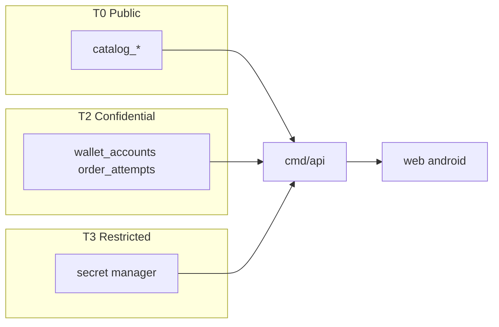

# ASSET AND DATA CLASSIFICATION

**Status:** reviewed
**Owner:** platform-orchestrator
**Last updated:** 2026-07-25
**Product:** RetroPick Markets V1
**Wave:** 7 — Security, platform, and testing

## 1. Purpose

Inventory and classification of data assets, retention, encryption, and handling rules for Markets V1. Drives access control, logging redaction, and backup scope.

## 2. Scope

### In scope

- RetroPick Markets V1: `apps/web`, `apps/android`, Go BFF `apps/backend/internal/markets/`.
- Polymarket upstream (Gamma, CLOB V2, relayer/builder).
- PostgreSQL `markets.*`, Redis, workers (ingest, signal-engine, alert-delivery, reconciliation).
- Intelligence, notifications, eligibility, ops tooling.

### Out of scope

- PRISM (`contracts/prism/`).
- Legacy epoch (`/api/v1/legacy/markets/*`).
- Custom exchange ([ADR-001](../architecture/adr/ADR-001-MARKETS-HAS-NO-CUSTOM-EXCHANGE.md)).
- Auto copy trading ([ADR-009](../architecture/adr/ADR-009-NO-AUTO-COPY-TRADING-V1.md)).

## 3. Prerequisites

| Document | Role |
|----------|------|
| [00_DOCUMENT_MAP.md](../00_DOCUMENT_MAP.md) | Navigation |
| [architecture/SYSTEM_CONTEXT_AND_TRUST_BOUNDARIES.md](../architecture/SYSTEM_CONTEXT_AND_TRUST_BOUNDARIES.md) | Trust boundaries |
| [architecture/DEPLOYMENT_ARCHITECTURE.md](../architecture/DEPLOYMENT_ARCHITECTURE.md) | Deploy units |
| [05_NON_FUNCTIONAL_REQUIREMENTS.md](../05_NON_FUNCTIONAL_REQUIREMENTS.md) | NFRs |
| [phases/PHASE-6-HARDENING-CI-CD-AND-SRE.md](../phases/PHASE-6-HARDENING-CI-CD-AND-SRE.md) | Hardening |

## 4. Authoritative sources

| Source | Location | Confidence |
|--------|----------|------------|
| OpenAPI | `schemas/openapi/markets-v1.yaml` | verified |
| Polymarket docs | https://docs.polymarket.com/ | partially verified |
| ADR suite | `architecture/adr/` | verified |

## 5. Classification scheme

| Tier | Label | Examples | Storage | Logging | Backup |
|------|-------|----------|---------|---------|--------|
| T0 | Public | Market catalog, public signals | CDN cache OK | Full | Optional |
| T1 | Internal | Aggregated metrics, feature flags | Postgres/Redis | Full | Yes |
| T2 | Confidential | Email, OAuth subject, wallet addresses | Postgres encrypted | Pseudonymized | Yes, encrypted |
| T3 | Restricted | Builder API keys, DB credentials | Secret manager | Never | N/A (secrets) |
| T4 | Prohibited | User private keys, seed phrases | **Must not exist** | **Must not exist** | **Forbidden** |

**Invariant (ADR-003):** No T4 data in RetroPick systems.

## 6. Asset inventory

### 6.1 Client assets

| Asset | Tier | Location | Owner |
|-------|------|----------|-------|
| Session JWT / refresh | T2 | Android Keystore; web httpOnly cookie | User session |
| WalletConnect session | T2 | Client memory | User |
| Cached catalog JSON | T0/T1 | IndexedDB / Room | Product |
| Trade journal notes | T2 | Postgres via API | User |

### 6.2 Server assets

| Asset | Tier | Table / store | Retention |
|-------|------|---------------|-----------|
| User profile | T2 | `users`, `auth_identities` | Account lifetime + 30d |
| Wallet linkage | T2 | `wallet_accounts` | Account lifetime |
| Order attempts | T2 | `order_attempts` | 7 years (compliance review) |
| Fills projection | T1 | `fills` | 7 years |
| Eligibility decisions | T2 | `eligibility_decisions` | 2 years |
| Raw upstream events | T1 | `raw_upstream_events` | 90 days rolling |
| Signals + evidence | T1 | `market_signals`, `signal_evidence` | 1 year |
| Alert rules | T2 | `alert_rules` | User deletion |
| Builder fee versions | T1 | `builder_fee_versions` | Indefinite |
| Audit logs | T2 | `audit_events` | 2 years |

### 6.3 Infrastructure assets

| Asset | Tier | Location |
|-------|------|----------|
| TLS certificates | T3 | ACME / cloud provider |
| Postgres connection string | T3 | Secret manager |
| Polymarket builder credentials | T3 | Secret manager |
| FCM server key | T3 | Secret manager |
| OAuth client secret | T3 | Secret manager |

## 7. Data flows by tier

## 8. PII and pseudonymization

| Field | PII? | Pseudonymize in logs? | Export allowed? |
|-------|------|----------------------|-----------------|
| Email | Yes | Yes (hash) | User request only |
| Wallet address | Pseudonymous | Truncate in debug | Yes (user data) |
| IP address | Yes | Store /24 only in eligibility | No marketing export |
| Device ID (FCM) | Yes | No in app logs | Delete on logout |

## 9. Encryption requirements

| State | Requirement |
|-------|-------------|
| Transit | TLS 1.2+ everywhere; WSS for realtime |
| Rest — Postgres | Provider-managed encryption (RDS/Cloud SQL) |
| Rest — Redis | Encryption at rest if provider supports |
| Rest — Android | EncryptedSharedPreferences / Keystore for tokens |
| Backups | Encrypted snapshots; separate KMS key |

## 10. Retention and deletion

| Trigger | Action | SLA |
|---------|--------|-----|
| User account deletion | Soft delete → purge T2 after 30d | 30 days |
| Legal hold | Suspend purge | Until release |
| `raw_upstream_events` | Partition drop >90d | Automated weekly |
| Session tokens | Expire | TTL max 24h access / 30d refresh |

## 11. Third-party data sharing

| Recipient | Data shared | Tier | DPA |
|-----------|-------------|------|-----|
| Polymarket | Signed orders, addresses | T2 | Vendor ToS |
| FCM/APNs | Device token, alert title | T2 | Google/Apple |
| Geo provider | IP | T2 | Subprocessor list |
| Error tracking | Stack traces (scrubbed) | T1 | Redaction rules |

## 12. Labeling in code and schemas

- OpenAPI fields: `x-classification: T0|T1|T2` in `markets-v1.yaml`.
- Log fields: struct tags `log:"redact"` for T2+.
- Metrics: no wallet addresses in label cardinality.

## 13. Compliance notes (non-legal)

This classification supports GDPR/CCPA data subject requests and SOC2-style evidence. **Legal review required** before production launch in regulated jurisdictions.

## 14. Related documents

- [SECRETS_KEYS_AND_ACCESS_CONTROL.md](./SECRETS_KEYS_AND_ACCESS_CONTROL.md)
- [backend/DATABASE_AND_MIGRATIONS.md](../backend/DATABASE_AND_MIGRATIONS.md)
- [platform/BACKUP_RESTORE_AND_DISASTER_RECOVERY.md](../platform/BACKUP_RESTORE_AND_DISASTER_RECOVERY.md)

## Appendix — ASS

| ID | Item | Section | Owner |
|----|------|---------|-------|
| ASS-001 | Controlled register entry 1 | §6 | platform-orchestrator |
| ASS-002 | Controlled register entry 2 | §7 | platform-orchestrator |
| ASS-003 | Controlled register entry 3 | §8 | platform-orchestrator |
| ASS-004 | Controlled register entry 4 | §9 | platform-orchestrator |
| ASS-005 | Controlled register entry 5 | §10 | platform-orchestrator |
| ASS-006 | Controlled register entry 6 | §11 | platform-orchestrator |
| ASS-007 | Controlled register entry 7 | §12 | platform-orchestrator |
| ASS-008 | Controlled register entry 8 | §13 | platform-orchestrator |
| ASS-009 | Controlled register entry 9 | §14 | platform-orchestrator |
| ASS-010 | Controlled register entry 10 | §5 | platform-orchestrator |
| ASS-011 | Controlled register entry 11 | §6 | platform-orchestrator |
| ASS-012 | Controlled register entry 12 | §7 | platform-orchestrator |
| ASS-013 | Controlled register entry 13 | §8 | platform-orchestrator |
| ASS-014 | Controlled register entry 14 | §9 | platform-orchestrator |
| ASS-015 | Controlled register entry 15 | §10 | platform-orchestrator |
| ASS-016 | Controlled register entry 16 | §11 | platform-orchestrator |
| ASS-017 | Controlled register entry 17 | §12 | platform-orchestrator |
| ASS-018 | Controlled register entry 18 | §13 | platform-orchestrator |
| ASS-019 | Controlled register entry 19 | §14 | platform-orchestrator |
| ASS-020 | Controlled register entry 20 | §5 | platform-orchestrator |
| ASS-021 | Controlled register entry 21 | §6 | platform-orchestrator |
| ASS-022 | Controlled register entry 22 | §7 | platform-orchestrator |
| ASS-023 | Controlled register entry 23 | §8 | platform-orchestrator |
| ASS-024 | Controlled register entry 24 | §9 | platform-orchestrator |
| ASS-025 | Controlled register entry 25 | §10 | platform-orchestrator |
| ASS-026 | Controlled register entry 26 | §11 | platform-orchestrator |
| ASS-027 | Controlled register entry 27 | §12 | platform-orchestrator |
| ASS-028 | Controlled register entry 28 | §13 | platform-orchestrator |
| ASS-029 | Controlled register entry 29 | §14 | platform-orchestrator |
| ASS-030 | Controlled register entry 30 | §5 | platform-orchestrator |
| ASS-031 | Controlled register entry 31 | §6 | platform-orchestrator |
| ASS-032 | Controlled register entry 32 | §7 | platform-orchestrator |
| ASS-033 | Controlled register entry 33 | §8 | platform-orchestrator |
| ASS-034 | Controlled register entry 34 | §9 | platform-orchestrator |
| ASS-035 | Controlled register entry 35 | §10 | platform-orchestrator |
| ASS-036 | Controlled register entry 36 | §11 | platform-orchestrator |
| ASS-037 | Controlled register entry 37 | §12 | platform-orchestrator |
| ASS-038 | Controlled register entry 38 | §13 | platform-orchestrator |
| ASS-039 | Controlled register entry 39 | §14 | platform-orchestrator |
| ASS-040 | Controlled register entry 40 | §5 | platform-orchestrator |
| ASS-041 | Controlled register entry 41 | §6 | platform-orchestrator |
| ASS-042 | Controlled register entry 42 | §7 | platform-orchestrator |
| ASS-043 | Controlled register entry 43 | §8 | platform-orchestrator |
| ASS-044 | Controlled register entry 44 | §9 | platform-orchestrator |
| ASS-045 | Controlled register entry 45 | §10 | platform-orchestrator |
| ASS-046 | Controlled register entry 46 | §11 | platform-orchestrator |
| ASS-047 | Controlled register entry 47 | §12 | platform-orchestrator |
| ASS-048 | Controlled register entry 48 | §13 | platform-orchestrator |
| ASS-049 | Controlled register entry 49 | §14 | platform-orchestrator |
| ASS-050 | Controlled register entry 50 | §5 | platform-orchestrator |
| ASS-051 | Controlled register entry 51 | §6 | platform-orchestrator |
| ASS-052 | Controlled register entry 52 | §7 | platform-orchestrator |
| ASS-053 | Controlled register entry 53 | §8 | platform-orchestrator |
| ASS-054 | Controlled register entry 54 | §9 | platform-orchestrator |
| ASS-055 | Controlled register entry 55 | §10 | platform-orchestrator |
| ASS-056 | Controlled register entry 56 | §11 | platform-orchestrator |
| ASS-057 | Controlled register entry 57 | §12 | platform-orchestrator |
| ASS-058 | Controlled register entry 58 | §13 | platform-orchestrator |
| ASS-059 | Controlled register entry 59 | §14 | platform-orchestrator |
| ASS-060 | Controlled register entry 60 | §5 | platform-orchestrator |
| ASS-061 | Controlled register entry 61 | §6 | platform-orchestrator |
| ASS-062 | Controlled register entry 62 | §7 | platform-orchestrator |
| ASS-063 | Controlled register entry 63 | §8 | platform-orchestrator |
| ASS-064 | Controlled register entry 64 | §9 | platform-orchestrator |
| ASS-065 | Controlled register entry 65 | §10 | platform-orchestrator |
| ASS-066 | Controlled register entry 66 | §11 | platform-orchestrator |
| ASS-067 | Controlled register entry 67 | §12 | platform-orchestrator |
| ASS-068 | Controlled register entry 68 | §13 | platform-orchestrator |
| ASS-069 | Controlled register entry 69 | §14 | platform-orchestrator |
| ASS-070 | Controlled register entry 70 | §5 | platform-orchestrator |
| ASS-071 | Controlled register entry 71 | §6 | platform-orchestrator |
| ASS-072 | Controlled register entry 72 | §7 | platform-orchestrator |
| ASS-073 | Controlled register entry 73 | §8 | platform-orchestrator |
| ASS-074 | Controlled register entry 74 | §9 | platform-orchestrator |
| ASS-075 | Controlled register entry 75 | §10 | platform-orchestrator |
| ASS-076 | Controlled register entry 76 | §11 | platform-orchestrator |
| ASS-077 | Controlled register entry 77 | §12 | platform-orchestrator |
| ASS-078 | Controlled register entry 78 | §13 | platform-orchestrator |
| ASS-079 | Controlled register entry 79 | §14 | platform-orchestrator |
| ASS-080 | Controlled register entry 80 | §5 | platform-orchestrator |
| ASS-081 | Controlled register entry 81 | §6 | platform-orchestrator |
| ASS-082 | Controlled register entry 82 | §7 | platform-orchestrator |
| ASS-083 | Controlled register entry 83 | §8 | platform-orchestrator |
| ASS-084 | Controlled register entry 84 | §9 | platform-orchestrator |
| ASS-085 | Controlled register entry 85 | §10 | platform-orchestrator |
| ASS-086 | Controlled register entry 86 | §11 | platform-orchestrator |
| ASS-087 | Controlled register entry 87 | §12 | platform-orchestrator |
| ASS-088 | Controlled register entry 88 | §13 | platform-orchestrator |
| ASS-089 | Controlled register entry 89 | §14 | platform-orchestrator |
| ASS-090 | Controlled register entry 90 | §5 | platform-orchestrator |
| ASS-091 | Controlled register entry 91 | §6 | platform-orchestrator |
| ASS-092 | Controlled register entry 92 | §7 | platform-orchestrator |
| ASS-093 | Controlled register entry 93 | §8 | platform-orchestrator |
| ASS-094 | Controlled register entry 94 | §9 | platform-orchestrator |
| ASS-095 | Controlled register entry 95 | §10 | platform-orchestrator |
| ASS-096 | Controlled register entry 96 | §11 | platform-orchestrator |
| ASS-097 | Controlled register entry 97 | §12 | platform-orchestrator |
| ASS-098 | Controlled register entry 98 | §13 | platform-orchestrator |
| ASS-099 | Controlled register entry 99 | §14 | platform-orchestrator |
| ASS-100 | Controlled register entry 100 | §5 | platform-orchestrator |
| ASS-101 | Controlled register entry 101 | §6 | platform-orchestrator |
| ASS-102 | Controlled register entry 102 | §7 | platform-orchestrator |
| ASS-103 | Controlled register entry 103 | §8 | platform-orchestrator |
| ASS-104 | Controlled register entry 104 | §9 | platform-orchestrator |
| ASS-105 | Controlled register entry 105 | §10 | platform-orchestrator |
| ASS-106 | Controlled register entry 106 | §11 | platform-orchestrator |
| ASS-107 | Controlled register entry 107 | §12 | platform-orchestrator |
| ASS-108 | Controlled register entry 108 | §13 | platform-orchestrator |
| ASS-109 | Controlled register entry 109 | §14 | platform-orchestrator |
| ASS-110 | Controlled register entry 110 | §5 | platform-orchestrator |
| ASS-111 | Controlled register entry 111 | §6 | platform-orchestrator |
| ASS-112 | Controlled register entry 112 | §7 | platform-orchestrator |
| ASS-113 | Controlled register entry 113 | §8 | platform-orchestrator |
| ASS-114 | Controlled register entry 114 | §9 | platform-orchestrator |
| ASS-115 | Controlled register entry 115 | §10 | platform-orchestrator |
| ASS-116 | Controlled register entry 116 | §11 | platform-orchestrator |
| ASS-117 | Controlled register entry 117 | §12 | platform-orchestrator |
| ASS-118 | Controlled register entry 118 | §13 | platform-orchestrator |
| ASS-119 | Controlled register entry 119 | §14 | platform-orchestrator |
| ASS-120 | Controlled register entry 120 | §5 | platform-orchestrator |
| ASS-121 | Controlled register entry 121 | §6 | platform-orchestrator |
| ASS-122 | Controlled register entry 122 | §7 | platform-orchestrator |
| ASS-123 | Controlled register entry 123 | §8 | platform-orchestrator |
| ASS-124 | Controlled register entry 124 | §9 | platform-orchestrator |
| ASS-125 | Controlled register entry 125 | §10 | platform-orchestrator |
| ASS-126 | Controlled register entry 126 | §11 | platform-orchestrator |
| ASS-127 | Controlled register entry 127 | §12 | platform-orchestrator |
| ASS-128 | Controlled register entry 128 | §13 | platform-orchestrator |
| ASS-129 | Controlled register entry 129 | §14 | platform-orchestrator |
| ASS-130 | Controlled register entry 130 | §5 | platform-orchestrator |
| ASS-131 | Controlled register entry 131 | §6 | platform-orchestrator |
| ASS-132 | Controlled register entry 132 | §7 | platform-orchestrator |
| ASS-133 | Controlled register entry 133 | §8 | platform-orchestrator |
| ASS-134 | Controlled register entry 134 | §9 | platform-orchestrator |
| ASS-135 | Controlled register entry 135 | §10 | platform-orchestrator |
| ASS-136 | Controlled register entry 136 | §11 | platform-orchestrator |
| ASS-137 | Controlled register entry 137 | §12 | platform-orchestrator |
| ASS-138 | Controlled register entry 138 | §13 | platform-orchestrator |
| ASS-139 | Controlled register entry 139 | §14 | platform-orchestrator |
| ASS-140 | Controlled register entry 140 | §5 | platform-orchestrator |
| ASS-141 | Controlled register entry 141 | §6 | platform-orchestrator |
| ASS-142 | Controlled register entry 142 | §7 | platform-orchestrator |
| ASS-143 | Controlled register entry 143 | §8 | platform-orchestrator |
| ASS-144 | Controlled register entry 144 | §9 | platform-orchestrator |
| ASS-145 | Controlled register entry 145 | §10 | platform-orchestrator |
| ASS-146 | Controlled register entry 146 | §11 | platform-orchestrator |
| ASS-147 | Controlled register entry 147 | §12 | platform-orchestrator |
| ASS-148 | Controlled register entry 148 | §13 | platform-orchestrator |
| ASS-149 | Controlled register entry 149 | §14 | platform-orchestrator |
| ASS-150 | Controlled register entry 150 | §5 | platform-orchestrator |
| ASS-151 | Controlled register entry 151 | §6 | platform-orchestrator |
| ASS-152 | Controlled register entry 152 | §7 | platform-orchestrator |
| ASS-153 | Controlled register entry 153 | §8 | platform-orchestrator |
| ASS-154 | Controlled register entry 154 | §9 | platform-orchestrator |
| ASS-155 | Controlled register entry 155 | §10 | platform-orchestrator |
| ASS-156 | Controlled register entry 156 | §11 | platform-orchestrator |
| ASS-157 | Controlled register entry 157 | §12 | platform-orchestrator |
| ASS-158 | Controlled register entry 158 | §13 | platform-orchestrator |
| ASS-159 | Controlled register entry 159 | §14 | platform-orchestrator |
| ASS-160 | Controlled register entry 160 | §5 | platform-orchestrator |
| ASS-161 | Controlled register entry 161 | §6 | platform-orchestrator |
| ASS-162 | Controlled register entry 162 | §7 | platform-orchestrator |
| ASS-163 | Controlled register entry 163 | §8 | platform-orchestrator |
| ASS-164 | Controlled register entry 164 | §9 | platform-orchestrator |
| ASS-165 | Controlled register entry 165 | §10 | platform-orchestrator |
| ASS-166 | Controlled register entry 166 | §11 | platform-orchestrator |
| ASS-167 | Controlled register entry 167 | §12 | platform-orchestrator |
| ASS-168 | Controlled register entry 168 | §13 | platform-orchestrator |
| ASS-169 | Controlled register entry 169 | §14 | platform-orchestrator |
| ASS-170 | Controlled register entry 170 | §5 | platform-orchestrator |
| ASS-171 | Controlled register entry 171 | §6 | platform-orchestrator |
| ASS-172 | Controlled register entry 172 | §7 | platform-orchestrator |
| ASS-173 | Controlled register entry 173 | §8 | platform-orchestrator |
| ASS-174 | Controlled register entry 174 | §9 | platform-orchestrator |
| ASS-175 | Controlled register entry 175 | §10 | platform-orchestrator |
| ASS-176 | Controlled register entry 176 | §11 | platform-orchestrator |
| ASS-177 | Controlled register entry 177 | §12 | platform-orchestrator |
| ASS-178 | Controlled register entry 178 | §13 | platform-orchestrator |
| ASS-179 | Controlled register entry 179 | §14 | platform-orchestrator |
| ASS-180 | Controlled register entry 180 | §5 | platform-orchestrator |
| ASS-181 | Controlled register entry 181 | §6 | platform-orchestrator |
| ASS-182 | Controlled register entry 182 | §7 | platform-orchestrator |
| ASS-183 | Controlled register entry 183 | §8 | platform-orchestrator |
| ASS-184 | Controlled register entry 184 | §9 | platform-orchestrator |
| ASS-185 | Controlled register entry 185 | §10 | platform-orchestrator |
| ASS-186 | Controlled register entry 186 | §11 | platform-orchestrator |
| ASS-187 | Controlled register entry 187 | §12 | platform-orchestrator |
| ASS-188 | Controlled register entry 188 | §13 | platform-orchestrator |
| ASS-189 | Controlled register entry 189 | §14 | platform-orchestrator |
| ASS-190 | Controlled register entry 190 | §5 | platform-orchestrator |
| ASS-191 | Controlled register entry 191 | §6 | platform-orchestrator |
| ASS-192 | Controlled register entry 192 | §7 | platform-orchestrator |
| ASS-193 | Controlled register entry 193 | §8 | platform-orchestrator |
| ASS-194 | Controlled register entry 194 | §9 | platform-orchestrator |
| ASS-195 | Controlled register entry 195 | §10 | platform-orchestrator |
| ASS-196 | Controlled register entry 196 | §11 | platform-orchestrator |
| ASS-197 | Controlled register entry 197 | §12 | platform-orchestrator |
| ASS-198 | Controlled register entry 198 | §13 | platform-orchestrator |
| ASS-199 | Controlled register entry 199 | §14 | platform-orchestrator |
| ASS-200 | Controlled register entry 200 | §5 | platform-orchestrator |
| ASS-201 | Controlled register entry 201 | §6 | platform-orchestrator |
| ASS-202 | Controlled register entry 202 | §7 | platform-orchestrator |
| ASS-203 | Controlled register entry 203 | §8 | platform-orchestrator |
| ASS-204 | Controlled register entry 204 | §9 | platform-orchestrator |
| ASS-205 | Controlled register entry 205 | §10 | platform-orchestrator |
| ASS-206 | Controlled register entry 206 | §11 | platform-orchestrator |
| ASS-207 | Controlled register entry 207 | §12 | platform-orchestrator |
| ASS-208 | Controlled register entry 208 | §13 | platform-orchestrator |
| ASS-209 | Controlled register entry 209 | §14 | platform-orchestrator |
| ASS-210 | Controlled register entry 210 | §5 | platform-orchestrator |
| ASS-211 | Controlled register entry 211 | §6 | platform-orchestrator |
| ASS-212 | Controlled register entry 212 | §7 | platform-orchestrator |
| ASS-213 | Controlled register entry 213 | §8 | platform-orchestrator |
| ASS-214 | Controlled register entry 214 | §9 | platform-orchestrator |
| ASS-215 | Controlled register entry 215 | §10 | platform-orchestrator |
| ASS-216 | Controlled register entry 216 | §11 | platform-orchestrator |
| ASS-217 | Controlled register entry 217 | §12 | platform-orchestrator |
| ASS-218 | Controlled register entry 218 | §13 | platform-orchestrator |
| ASS-219 | Controlled register entry 219 | §14 | platform-orchestrator |
| ASS-220 | Controlled register entry 220 | §5 | platform-orchestrator |
| ASS-221 | Controlled register entry 221 | §6 | platform-orchestrator |
| ASS-222 | Controlled register entry 222 | §7 | platform-orchestrator |
| ASS-223 | Controlled register entry 223 | §8 | platform-orchestrator |
| ASS-224 | Controlled register entry 224 | §9 | platform-orchestrator |
| ASS-225 | Controlled register entry 225 | §10 | platform-orchestrator |
| ASS-226 | Controlled register entry 226 | §11 | platform-orchestrator |
| ASS-227 | Controlled register entry 227 | §12 | platform-orchestrator |
| ASS-228 | Controlled register entry 228 | §13 | platform-orchestrator |
| ASS-229 | Controlled register entry 229 | §14 | platform-orchestrator |
| ASS-230 | Controlled register entry 230 | §5 | platform-orchestrator |
| ASS-231 | Controlled register entry 231 | §6 | platform-orchestrator |
| ASS-232 | Controlled register entry 232 | §7 | platform-orchestrator |
| ASS-233 | Controlled register entry 233 | §8 | platform-orchestrator |
| ASS-234 | Controlled register entry 234 | §9 | platform-orchestrator |
| ASS-235 | Controlled register entry 235 | §10 | platform-orchestrator |
| ASS-236 | Controlled register entry 236 | §11 | platform-orchestrator |
| ASS-237 | Controlled register entry 237 | §12 | platform-orchestrator |
| ASS-238 | Controlled register entry 238 | §13 | platform-orchestrator |
| ASS-239 | Controlled register entry 239 | §14 | platform-orchestrator |
| ASS-240 | Controlled register entry 240 | §5 | platform-orchestrator |
| ASS-241 | Controlled register entry 241 | §6 | platform-orchestrator |
| ASS-242 | Controlled register entry 242 | §7 | platform-orchestrator |
| ASS-243 | Controlled register entry 243 | §8 | platform-orchestrator |
| ASS-244 | Controlled register entry 244 | §9 | platform-orchestrator |
| ASS-245 | Controlled register entry 245 | §10 | platform-orchestrator |
| ASS-246 | Controlled register entry 246 | §11 | platform-orchestrator |
| ASS-247 | Controlled register entry 247 | §12 | platform-orchestrator |
| ASS-248 | Controlled register entry 248 | §13 | platform-orchestrator |
| ASS-249 | Controlled register entry 249 | §14 | platform-orchestrator |
| ASS-250 | Controlled register entry 250 | §5 | platform-orchestrator |
| ASS-251 | Controlled register entry 251 | §6 | platform-orchestrator |
| ASS-252 | Controlled register entry 252 | §7 | platform-orchestrator |
| ASS-253 | Controlled register entry 253 | §8 | platform-orchestrator |
| ASS-254 | Controlled register entry 254 | §9 | platform-orchestrator |
| ASS-255 | Controlled register entry 255 | §10 | platform-orchestrator |
| ASS-256 | Controlled register entry 256 | §11 | platform-orchestrator |
| ASS-257 | Controlled register entry 257 | §12 | platform-orchestrator |
| ASS-258 | Controlled register entry 258 | §13 | platform-orchestrator |
| ASS-259 | Controlled register entry 259 | §14 | platform-orchestrator |
| ASS-260 | Controlled register entry 260 | §5 | platform-orchestrator |
| ASS-261 | Controlled register entry 261 | §6 | platform-orchestrator |
| ASS-262 | Controlled register entry 262 | §7 | platform-orchestrator |
| ASS-263 | Controlled register entry 263 | §8 | platform-orchestrator |
| ASS-264 | Controlled register entry 264 | §9 | platform-orchestrator |
| ASS-265 | Controlled register entry 265 | §10 | platform-orchestrator |
| ASS-266 | Controlled register entry 266 | §11 | platform-orchestrator |
| ASS-267 | Controlled register entry 267 | §12 | platform-orchestrator |
| ASS-268 | Controlled register entry 268 | §13 | platform-orchestrator |
| ASS-269 | Controlled register entry 269 | §14 | platform-orchestrator |
| ASS-270 | Controlled register entry 270 | §5 | platform-orchestrator |
| ASS-271 | Controlled register entry 271 | §6 | platform-orchestrator |
| ASS-272 | Controlled register entry 272 | §7 | platform-orchestrator |
| ASS-273 | Controlled register entry 273 | §8 | platform-orchestrator |
| ASS-274 | Controlled register entry 274 | §9 | platform-orchestrator |
| ASS-275 | Controlled register entry 275 | §10 | platform-orchestrator |
| ASS-276 | Controlled register entry 276 | §11 | platform-orchestrator |
| ASS-277 | Controlled register entry 277 | §12 | platform-orchestrator |
| ASS-278 | Controlled register entry 278 | §13 | platform-orchestrator |
| ASS-279 | Controlled register entry 279 | §14 | platform-orchestrator |
| ASS-280 | Controlled register entry 280 | §5 | platform-orchestrator |
| ASS-281 | Controlled register entry 281 | §6 | platform-orchestrator |
| ASS-282 | Controlled register entry 282 | §7 | platform-orchestrator |
| ASS-283 | Controlled register entry 283 | §8 | platform-orchestrator |
| ASS-284 | Controlled register entry 284 | §9 | platform-orchestrator |
| ASS-285 | Controlled register entry 285 | §10 | platform-orchestrator |
| ASS-286 | Controlled register entry 286 | §11 | platform-orchestrator |
| ASS-287 | Controlled register entry 287 | §12 | platform-orchestrator |
| ASS-288 | Controlled register entry 288 | §13 | platform-orchestrator |
| ASS-289 | Controlled register entry 289 | §14 | platform-orchestrator |
| ASS-290 | Controlled register entry 290 | §5 | platform-orchestrator |
| ASS-291 | Controlled register entry 291 | §6 | platform-orchestrator |
| ASS-292 | Controlled register entry 292 | §7 | platform-orchestrator |
| ASS-293 | Controlled register entry 293 | §8 | platform-orchestrator |
| ASS-294 | Controlled register entry 294 | §9 | platform-orchestrator |
| ASS-295 | Controlled register entry 295 | §10 | platform-orchestrator |
## Acceptance criteria

- Status `reviewed`; links valid per [00_DOCUMENT_MAP.md](../00_DOCUMENT_MAP.md).
- Tasks trace to [agent-harness/REQUIREMENTS_TO_TASK_TRACEABILITY.md](../agent-harness/REQUIREMENTS_TO_TASK_TRACEABILITY.md).

## Revision history

| Date | Author | Change |
|------|--------|--------|
| 2026-07-24 | platform-orchestrator | Initial stub |
| 2026-07-25 | platform-orchestrator | Wave 7 expansion |
