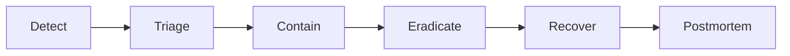

# INCIDENT RESPONSE

**Status:** reviewed
**Owner:** platform-orchestrator
**Last updated:** 2026-07-25
**Product:** RetroPick Markets V1
**Wave:** 7 — Security, platform, and testing

## Description

This document is the incident response playbook for RetroPick Markets V1: incident types, severity matrix that remains custody-aware (SEV-1 still applies to signing/preview integrity and mass auth breach), roles, response phases, containment tools, evidence preservation, communication templates, postmortem, and drills.

It sits in Wave 7 with execution via on-call, secret rotation, deploy rollback, dashboards, and status templates. Cross-links ABUSE_FRAUD_AND_RATE_LIMITS, SECRETS_KEYS_AND_ACCESS_CONTROL, OBSERVABILITY_SLOS_AND_ALERTS, and PRODUCTION_OPERATIONS_RUNBOOK. Agents may draft runbook steps but must not auto-approve, merge, push, or rotate secrets outside human process.

Read this from alert or human report through contain, eradicate, recover, and postmortem; during IR drills; and whenever markets.orders.disabled flips. Prefer RELEASE_ROLLBACK_AND_CHANGE_MANAGEMENT for mechanical rollback digests.

It excludes under-ranking integrity bugs because RetroPick is non-custodial, pasting T3 secrets into tickets or chat, and skipping drills.

## 0. Developer intent (5W+1H)

Short orientation for implementers and agents. Read this before the normative sections below.

| Lens | Answer |
|------|--------|
| **Who** | On-call engineers, incident commander, tech lead (mitigation/rollback), security for SEC types, comms/status-page owners, postmortem facilitators. Agents assist with runbooks but do not auto-approve, merge, push, or rotate secrets without human process. |
| **What** | Incident types (SEC/AVL/DAT/…), severity matrix (note: RetroPick does **not** custody funds—SEV-1 fund risk means widespread preview tampering or signing vulnerability), roles, response phases, containment (revoke builder key, kill switches, rollback), evidence preservation, postmortem, drills. |
| **When** | From alert/page or human report through contain→eradicate→recover→postmortem; during scheduled IR drills; whenever kill switch `markets.orders.disabled` flips. |
| **Where** | Spec: this file. Execution: Slack/status templates, secret manager rotation, deploy rollback per platform RELEASE_ROLLBACK, logs/metrics dashboards, chain tx hashes for disputes. Cross-ref ABUSE, SECRETS, OBSERVABILITY, PRODUCTION_OPERATIONS_RUNBOOK. |
| **Why** | Speed and correctness under stress: wrong “we don’t hold funds so SEV-1 never applies” thinking under-ranks signing/preview integrity bugs. Structured IR keeps geo/eligibility kill decisions fail-closed and evidence usable without leaking T3 secrets into tickets. |
| **How** | Classify type+severity; page IC; contain (disable trading, rotate keys, revoke sessions); communicate internal/external templates; preserve redacted logs + `order_attempts` ids + tx hashes; restore; blameless postmortem with action items; run drills on cadence. |

### Severity anchor (custody-aware)

| SEV | Markets meaning |
|-----|-----------------|
| SEV-1 | Signing/preview integrity break, mass auth breach, or orders kill-switch crisis |
| SEV-2 | Major availability / upstream trading outage, elevated 5xx |
| SEV-3 | Degraded catalog freshness, single-feature failure |
| Note | No custodian wallet on RetroPick—fund SEV framed as integrity/abuse blast radius |

### Containment toolbox

| Action | Typical trigger |
|--------|-----------------|
| `markets.orders.disabled` | Integrity bug, abuse flood |
| Revoke builder key | Key leak / anomalous volume |
| Session mass revoke | Auth compromise |
| App/image rollback | Bad release |
| Status page update | User-visible impact |

### Worked example

**Happy path.** `UpstreamCLOBDown` → SEV-2: IC named, trading UI degraded, status page updated, no secret rotation needed, recover when CLOB healthy, short postmortem on dependency SLI.

**Failure / degraded.** Suspected builder key leak → SEC SEV-1/2: revoke key in manager, enable order kill switch if needed, rotate, audit volume, preserve evidence **without** pasting secrets into Slack. Preview tampering bug in prod → treat as fund-risk-class SEV-1 despite no custody; rollback + integrity hotfix; **fail closed** on submits until hash path verified.

**Drill expectation.** Tabletop or staging drill proves pages, templates, and rollback digests are findable under time pressure.

## 1. Purpose

Incident classification, escalation, communication, and recovery procedures for Markets V1 security and availability events.

## 2. Scope

### In scope

- RetroPick Markets V1: `apps/web`, `apps/android`, Go BFF `apps/backend/internal/markets/`.
- Polymarket upstream (Gamma, CLOB V2, relayer/builder).
- PostgreSQL `markets.*`, Redis, workers (ingest, signal-engine, alert-delivery, reconciliation).
- Intelligence, notifications, eligibility, ops tooling.

### Out of scope

- PRISM (`contracts/prism/`).
- Legacy epoch (`/api/v1/legacy/markets/*`).
- Custom exchange ([ADR-001](../architecture/adr/ADR-001-MARKETS-HAS-NO-CUSTOM-EXCHANGE.md)).
- Auto copy trading ([ADR-009](../architecture/adr/ADR-009-NO-AUTO-COPY-TRADING-V1.md)).

## 3. Prerequisites

| Document | Role |
|----------|------|
| [00_DOCUMENT_MAP.md](../00_DOCUMENT_MAP.md) | Navigation |
| [architecture/SYSTEM_CONTEXT_AND_TRUST_BOUNDARIES.md](../architecture/SYSTEM_CONTEXT_AND_TRUST_BOUNDARIES.md) | Trust boundaries |
| [architecture/DEPLOYMENT_ARCHITECTURE.md](../architecture/DEPLOYMENT_ARCHITECTURE.md) | Deploy units |
| [05_NON_FUNCTIONAL_REQUIREMENTS.md](../05_NON_FUNCTIONAL_REQUIREMENTS.md) | NFRs |
| [phases/PHASE-6-HARDENING-CI-CD-AND-SRE.md](../phases/PHASE-6-HARDENING-CI-CD-AND-SRE.md) | Hardening |

## 4. Authoritative sources

| Source | Location | Confidence |
|--------|----------|------------|
| OpenAPI | `schemas/openapi/markets-v1.yaml` | verified |
| Polymarket docs | https://docs.polymarket.com/ | partially verified |
| ADR suite | `architecture/adr/` | verified |

## 5. Incident types

| Type | Examples | Primary owner |
|------|----------|---------------|
| SEC | Key leak, IDOR exploit | Security |
| AVAIL | API down, DB failover | SRE |
| DATA | Wrong portfolio projection | Engineering |
| UPSTREAM | Polymarket outage | SRE + Comms |
| ABUSE | Scraping, fraud wave | Security |

## 6. Severity matrix

| Sev | Criteria | Response SLA | Update cadence |
|-----|----------|--------------|----------------|
| SEV-1 | Active fund risk, total outage | 15 min | 30 min |
| SEV-2 | Partial outage, data leak suspected | 30 min | 1 h |
| SEV-3 | Degraded, no data loss | 2 h | 4 h |
| SEV-4 | Minor, workaround exists | Next business day | Daily |

**Note:** RetroPick does not custody funds; SEV-1 for fund risk = widespread preview tampering or signing vulnerability.

## 7. Roles

| Role | Duty |
|------|------|
| Incident commander | Coordinates, decides |
| Tech lead | Mitigation, rollback |
| Comms | Status page, user notice |
| Scribe | Timeline in ticket |
| Legal | Regulatory notice if required |

## 8. Response phases



## 9. Containment actions

| Action | When | Command / location |
|--------|------|-------------------|
| Order kill switch | Signing integrity doubt | Ops flag `markets.orders.disabled` |
| Read-only mode | DB corruption suspected | `markets.readonly=true` |
| Block IP range | Active attack | WAF / edge rule |
| Revoke builder key | Key leak | Secret manager rotation |
| Pause ingest | Poisoned upstream | Worker scale to 0 |

## 10. Communication templates

### Internal (Slack)
```
[SEV-X] Markets incident — <title>
Impact: <user-facing impact>
IC: <name>
Thread for updates; external comms pending approval
```

### External (status page)
```
We are investigating reports of <issue>. Trading may be unavailable.
Next update by <time> UTC.
```

## 11. Evidence preservation

- Snapshot logs (redacted) for incident window.
- DB PITR coordinates before destructive fix.
- Chain tx hashes for financial disputes.

## 12. Postmortem

| Section | Required |
|---------|----------|
| Timeline | Yes |
| Root cause | Yes |
| Contributing factors | Yes |
| Action items | Yes, owners + dates |
| Blameless | Yes |

## 13. Regulatory and user notification

- Legal determines breach notification requirements.
- User notification if T2 data exposed.

## 14. Drills

| Drill | Frequency |
|-------|-----------|
| Kill switch | Quarterly |
| Restore from backup | Semi-annual |
| Tabletop SEC scenario | Annual |

## 15. Related documents

- [platform/PRODUCTION_OPERATIONS_RUNBOOK.md](../platform/PRODUCTION_OPERATIONS_RUNBOOK.md)
- [platform/BACKUP_RESTORE_AND_DISASTER_RECOVERY.md](../platform/BACKUP_RESTORE_AND_DISASTER_RECOVERY.md)
- [THREAT_MODEL.md](./THREAT_MODEL.md)

## Appendix — INC

| ID | Item | Section | Owner |
|----|------|---------|-------|
| INC-001 | Controlled register entry 1 | §6 | platform-orchestrator |
| INC-002 | Controlled register entry 2 | §7 | platform-orchestrator |
| INC-003 | Controlled register entry 3 | §8 | platform-orchestrator |
| INC-004 | Controlled register entry 4 | §9 | platform-orchestrator |
| INC-005 | Controlled register entry 5 | §10 | platform-orchestrator |
| INC-006 | Controlled register entry 6 | §11 | platform-orchestrator |
| INC-007 | Controlled register entry 7 | §12 | platform-orchestrator |
| INC-008 | Controlled register entry 8 | §13 | platform-orchestrator |
| INC-009 | Controlled register entry 9 | §14 | platform-orchestrator |
| INC-010 | Controlled register entry 10 | §5 | platform-orchestrator |
| INC-011 | Controlled register entry 11 | §6 | platform-orchestrator |
| INC-012 | Controlled register entry 12 | §7 | platform-orchestrator |
| INC-013 | Controlled register entry 13 | §8 | platform-orchestrator |
| INC-014 | Controlled register entry 14 | §9 | platform-orchestrator |
| INC-015 | Controlled register entry 15 | §10 | platform-orchestrator |
| INC-016 | Controlled register entry 16 | §11 | platform-orchestrator |
| INC-017 | Controlled register entry 17 | §12 | platform-orchestrator |
| INC-018 | Controlled register entry 18 | §13 | platform-orchestrator |
| INC-019 | Controlled register entry 19 | §14 | platform-orchestrator |
| INC-020 | Controlled register entry 20 | §5 | platform-orchestrator |
| INC-021 | Controlled register entry 21 | §6 | platform-orchestrator |
| INC-022 | Controlled register entry 22 | §7 | platform-orchestrator |
| INC-023 | Controlled register entry 23 | §8 | platform-orchestrator |
| INC-024 | Controlled register entry 24 | §9 | platform-orchestrator |
| INC-025 | Controlled register entry 25 | §10 | platform-orchestrator |
| INC-026 | Controlled register entry 26 | §11 | platform-orchestrator |
| INC-027 | Controlled register entry 27 | §12 | platform-orchestrator |
| INC-028 | Controlled register entry 28 | §13 | platform-orchestrator |
| INC-029 | Controlled register entry 29 | §14 | platform-orchestrator |
| INC-030 | Controlled register entry 30 | §5 | platform-orchestrator |
| INC-031 | Controlled register entry 31 | §6 | platform-orchestrator |
| INC-032 | Controlled register entry 32 | §7 | platform-orchestrator |
| INC-033 | Controlled register entry 33 | §8 | platform-orchestrator |
| INC-034 | Controlled register entry 34 | §9 | platform-orchestrator |
| INC-035 | Controlled register entry 35 | §10 | platform-orchestrator |
| INC-036 | Controlled register entry 36 | §11 | platform-orchestrator |
| INC-037 | Controlled register entry 37 | §12 | platform-orchestrator |
| INC-038 | Controlled register entry 38 | §13 | platform-orchestrator |
| INC-039 | Controlled register entry 39 | §14 | platform-orchestrator |
| INC-040 | Controlled register entry 40 | §5 | platform-orchestrator |
| INC-041 | Controlled register entry 41 | §6 | platform-orchestrator |
| INC-042 | Controlled register entry 42 | §7 | platform-orchestrator |
| INC-043 | Controlled register entry 43 | §8 | platform-orchestrator |
| INC-044 | Controlled register entry 44 | §9 | platform-orchestrator |
| INC-045 | Controlled register entry 45 | §10 | platform-orchestrator |
| INC-046 | Controlled register entry 46 | §11 | platform-orchestrator |
| INC-047 | Controlled register entry 47 | §12 | platform-orchestrator |
| INC-048 | Controlled register entry 48 | §13 | platform-orchestrator |
| INC-049 | Controlled register entry 49 | §14 | platform-orchestrator |
| INC-050 | Controlled register entry 50 | §5 | platform-orchestrator |
| INC-051 | Controlled register entry 51 | §6 | platform-orchestrator |
| INC-052 | Controlled register entry 52 | §7 | platform-orchestrator |
| INC-053 | Controlled register entry 53 | §8 | platform-orchestrator |
| INC-054 | Controlled register entry 54 | §9 | platform-orchestrator |
| INC-055 | Controlled register entry 55 | §10 | platform-orchestrator |
| INC-056 | Controlled register entry 56 | §11 | platform-orchestrator |
| INC-057 | Controlled register entry 57 | §12 | platform-orchestrator |
| INC-058 | Controlled register entry 58 | §13 | platform-orchestrator |
| INC-059 | Controlled register entry 59 | §14 | platform-orchestrator |
| INC-060 | Controlled register entry 60 | §5 | platform-orchestrator |
| INC-061 | Controlled register entry 61 | §6 | platform-orchestrator |
| INC-062 | Controlled register entry 62 | §7 | platform-orchestrator |
| INC-063 | Controlled register entry 63 | §8 | platform-orchestrator |
| INC-064 | Controlled register entry 64 | §9 | platform-orchestrator |
| INC-065 | Controlled register entry 65 | §10 | platform-orchestrator |
| INC-066 | Controlled register entry 66 | §11 | platform-orchestrator |
| INC-067 | Controlled register entry 67 | §12 | platform-orchestrator |
| INC-068 | Controlled register entry 68 | §13 | platform-orchestrator |
| INC-069 | Controlled register entry 69 | §14 | platform-orchestrator |
| INC-070 | Controlled register entry 70 | §5 | platform-orchestrator |
| INC-071 | Controlled register entry 71 | §6 | platform-orchestrator |
| INC-072 | Controlled register entry 72 | §7 | platform-orchestrator |
| INC-073 | Controlled register entry 73 | §8 | platform-orchestrator |
| INC-074 | Controlled register entry 74 | §9 | platform-orchestrator |
| INC-075 | Controlled register entry 75 | §10 | platform-orchestrator |
| INC-076 | Controlled register entry 76 | §11 | platform-orchestrator |
| INC-077 | Controlled register entry 77 | §12 | platform-orchestrator |
| INC-078 | Controlled register entry 78 | §13 | platform-orchestrator |
| INC-079 | Controlled register entry 79 | §14 | platform-orchestrator |
| INC-080 | Controlled register entry 80 | §5 | platform-orchestrator |
| INC-081 | Controlled register entry 81 | §6 | platform-orchestrator |
| INC-082 | Controlled register entry 82 | §7 | platform-orchestrator |
| INC-083 | Controlled register entry 83 | §8 | platform-orchestrator |
| INC-084 | Controlled register entry 84 | §9 | platform-orchestrator |
| INC-085 | Controlled register entry 85 | §10 | platform-orchestrator |
| INC-086 | Controlled register entry 86 | §11 | platform-orchestrator |
| INC-087 | Controlled register entry 87 | §12 | platform-orchestrator |
| INC-088 | Controlled register entry 88 | §13 | platform-orchestrator |
| INC-089 | Controlled register entry 89 | §14 | platform-orchestrator |
| INC-090 | Controlled register entry 90 | §5 | platform-orchestrator |
| INC-091 | Controlled register entry 91 | §6 | platform-orchestrator |
| INC-092 | Controlled register entry 92 | §7 | platform-orchestrator |
| INC-093 | Controlled register entry 93 | §8 | platform-orchestrator |
| INC-094 | Controlled register entry 94 | §9 | platform-orchestrator |
| INC-095 | Controlled register entry 95 | §10 | platform-orchestrator |
| INC-096 | Controlled register entry 96 | §11 | platform-orchestrator |
| INC-097 | Controlled register entry 97 | §12 | platform-orchestrator |
| INC-098 | Controlled register entry 98 | §13 | platform-orchestrator |
| INC-099 | Controlled register entry 99 | §14 | platform-orchestrator |
| INC-100 | Controlled register entry 100 | §5 | platform-orchestrator |
| INC-101 | Controlled register entry 101 | §6 | platform-orchestrator |
| INC-102 | Controlled register entry 102 | §7 | platform-orchestrator |
| INC-103 | Controlled register entry 103 | §8 | platform-orchestrator |
| INC-104 | Controlled register entry 104 | §9 | platform-orchestrator |
| INC-105 | Controlled register entry 105 | §10 | platform-orchestrator |
| INC-106 | Controlled register entry 106 | §11 | platform-orchestrator |
| INC-107 | Controlled register entry 107 | §12 | platform-orchestrator |
| INC-108 | Controlled register entry 108 | §13 | platform-orchestrator |
| INC-109 | Controlled register entry 109 | §14 | platform-orchestrator |
| INC-110 | Controlled register entry 110 | §5 | platform-orchestrator |
| INC-111 | Controlled register entry 111 | §6 | platform-orchestrator |
| INC-112 | Controlled register entry 112 | §7 | platform-orchestrator |
| INC-113 | Controlled register entry 113 | §8 | platform-orchestrator |
| INC-114 | Controlled register entry 114 | §9 | platform-orchestrator |
| INC-115 | Controlled register entry 115 | §10 | platform-orchestrator |
| INC-116 | Controlled register entry 116 | §11 | platform-orchestrator |
| INC-117 | Controlled register entry 117 | §12 | platform-orchestrator |
| INC-118 | Controlled register entry 118 | §13 | platform-orchestrator |
| INC-119 | Controlled register entry 119 | §14 | platform-orchestrator |
| INC-120 | Controlled register entry 120 | §5 | platform-orchestrator |
| INC-121 | Controlled register entry 121 | §6 | platform-orchestrator |
| INC-122 | Controlled register entry 122 | §7 | platform-orchestrator |
| INC-123 | Controlled register entry 123 | §8 | platform-orchestrator |
| INC-124 | Controlled register entry 124 | §9 | platform-orchestrator |
| INC-125 | Controlled register entry 125 | §10 | platform-orchestrator |
| INC-126 | Controlled register entry 126 | §11 | platform-orchestrator |
| INC-127 | Controlled register entry 127 | §12 | platform-orchestrator |
| INC-128 | Controlled register entry 128 | §13 | platform-orchestrator |
| INC-129 | Controlled register entry 129 | §14 | platform-orchestrator |
| INC-130 | Controlled register entry 130 | §5 | platform-orchestrator |
| INC-131 | Controlled register entry 131 | §6 | platform-orchestrator |
| INC-132 | Controlled register entry 132 | §7 | platform-orchestrator |
| INC-133 | Controlled register entry 133 | §8 | platform-orchestrator |
| INC-134 | Controlled register entry 134 | §9 | platform-orchestrator |
| INC-135 | Controlled register entry 135 | §10 | platform-orchestrator |
| INC-136 | Controlled register entry 136 | §11 | platform-orchestrator |
| INC-137 | Controlled register entry 137 | §12 | platform-orchestrator |
| INC-138 | Controlled register entry 138 | §13 | platform-orchestrator |
| INC-139 | Controlled register entry 139 | §14 | platform-orchestrator |
| INC-140 | Controlled register entry 140 | §5 | platform-orchestrator |
| INC-141 | Controlled register entry 141 | §6 | platform-orchestrator |
| INC-142 | Controlled register entry 142 | §7 | platform-orchestrator |
| INC-143 | Controlled register entry 143 | §8 | platform-orchestrator |
| INC-144 | Controlled register entry 144 | §9 | platform-orchestrator |
| INC-145 | Controlled register entry 145 | §10 | platform-orchestrator |
| INC-146 | Controlled register entry 146 | §11 | platform-orchestrator |
| INC-147 | Controlled register entry 147 | §12 | platform-orchestrator |
| INC-148 | Controlled register entry 148 | §13 | platform-orchestrator |
| INC-149 | Controlled register entry 149 | §14 | platform-orchestrator |
| INC-150 | Controlled register entry 150 | §5 | platform-orchestrator |
| INC-151 | Controlled register entry 151 | §6 | platform-orchestrator |
| INC-152 | Controlled register entry 152 | §7 | platform-orchestrator |
| INC-153 | Controlled register entry 153 | §8 | platform-orchestrator |
| INC-154 | Controlled register entry 154 | §9 | platform-orchestrator |
| INC-155 | Controlled register entry 155 | §10 | platform-orchestrator |
| INC-156 | Controlled register entry 156 | §11 | platform-orchestrator |
| INC-157 | Controlled register entry 157 | §12 | platform-orchestrator |
| INC-158 | Controlled register entry 158 | §13 | platform-orchestrator |
| INC-159 | Controlled register entry 159 | §14 | platform-orchestrator |
| INC-160 | Controlled register entry 160 | §5 | platform-orchestrator |
| INC-161 | Controlled register entry 161 | §6 | platform-orchestrator |
| INC-162 | Controlled register entry 162 | §7 | platform-orchestrator |
| INC-163 | Controlled register entry 163 | §8 | platform-orchestrator |
| INC-164 | Controlled register entry 164 | §9 | platform-orchestrator |
| INC-165 | Controlled register entry 165 | §10 | platform-orchestrator |
| INC-166 | Controlled register entry 166 | §11 | platform-orchestrator |
| INC-167 | Controlled register entry 167 | §12 | platform-orchestrator |
| INC-168 | Controlled register entry 168 | §13 | platform-orchestrator |
| INC-169 | Controlled register entry 169 | §14 | platform-orchestrator |
| INC-170 | Controlled register entry 170 | §5 | platform-orchestrator |
| INC-171 | Controlled register entry 171 | §6 | platform-orchestrator |
| INC-172 | Controlled register entry 172 | §7 | platform-orchestrator |
| INC-173 | Controlled register entry 173 | §8 | platform-orchestrator |
| INC-174 | Controlled register entry 174 | §9 | platform-orchestrator |
| INC-175 | Controlled register entry 175 | §10 | platform-orchestrator |
| INC-176 | Controlled register entry 176 | §11 | platform-orchestrator |
| INC-177 | Controlled register entry 177 | §12 | platform-orchestrator |
| INC-178 | Controlled register entry 178 | §13 | platform-orchestrator |
| INC-179 | Controlled register entry 179 | §14 | platform-orchestrator |
| INC-180 | Controlled register entry 180 | §5 | platform-orchestrator |
| INC-181 | Controlled register entry 181 | §6 | platform-orchestrator |
| INC-182 | Controlled register entry 182 | §7 | platform-orchestrator |
| INC-183 | Controlled register entry 183 | §8 | platform-orchestrator |
| INC-184 | Controlled register entry 184 | §9 | platform-orchestrator |
| INC-185 | Controlled register entry 185 | §10 | platform-orchestrator |
| INC-186 | Controlled register entry 186 | §11 | platform-orchestrator |
| INC-187 | Controlled register entry 187 | §12 | platform-orchestrator |
| INC-188 | Controlled register entry 188 | §13 | platform-orchestrator |
| INC-189 | Controlled register entry 189 | §14 | platform-orchestrator |
| INC-190 | Controlled register entry 190 | §5 | platform-orchestrator |
| INC-191 | Controlled register entry 191 | §6 | platform-orchestrator |
| INC-192 | Controlled register entry 192 | §7 | platform-orchestrator |
| INC-193 | Controlled register entry 193 | §8 | platform-orchestrator |
| INC-194 | Controlled register entry 194 | §9 | platform-orchestrator |
| INC-195 | Controlled register entry 195 | §10 | platform-orchestrator |
| INC-196 | Controlled register entry 196 | §11 | platform-orchestrator |
| INC-197 | Controlled register entry 197 | §12 | platform-orchestrator |
| INC-198 | Controlled register entry 198 | §13 | platform-orchestrator |
| INC-199 | Controlled register entry 199 | §14 | platform-orchestrator |
| INC-200 | Controlled register entry 200 | §5 | platform-orchestrator |
| INC-201 | Controlled register entry 201 | §6 | platform-orchestrator |
| INC-202 | Controlled register entry 202 | §7 | platform-orchestrator |
| INC-203 | Controlled register entry 203 | §8 | platform-orchestrator |
| INC-204 | Controlled register entry 204 | §9 | platform-orchestrator |
| INC-205 | Controlled register entry 205 | §10 | platform-orchestrator |
| INC-206 | Controlled register entry 206 | §11 | platform-orchestrator |
| INC-207 | Controlled register entry 207 | §12 | platform-orchestrator |
| INC-208 | Controlled register entry 208 | §13 | platform-orchestrator |
| INC-209 | Controlled register entry 209 | §14 | platform-orchestrator |
| INC-210 | Controlled register entry 210 | §5 | platform-orchestrator |
| INC-211 | Controlled register entry 211 | §6 | platform-orchestrator |
| INC-212 | Controlled register entry 212 | §7 | platform-orchestrator |
| INC-213 | Controlled register entry 213 | §8 | platform-orchestrator |
| INC-214 | Controlled register entry 214 | §9 | platform-orchestrator |
| INC-215 | Controlled register entry 215 | §10 | platform-orchestrator |
| INC-216 | Controlled register entry 216 | §11 | platform-orchestrator |
| INC-217 | Controlled register entry 217 | §12 | platform-orchestrator |
| INC-218 | Controlled register entry 218 | §13 | platform-orchestrator |
| INC-219 | Controlled register entry 219 | §14 | platform-orchestrator |
| INC-220 | Controlled register entry 220 | §5 | platform-orchestrator |
| INC-221 | Controlled register entry 221 | §6 | platform-orchestrator |
| INC-222 | Controlled register entry 222 | §7 | platform-orchestrator |
| INC-223 | Controlled register entry 223 | §8 | platform-orchestrator |
| INC-224 | Controlled register entry 224 | §9 | platform-orchestrator |
| INC-225 | Controlled register entry 225 | §10 | platform-orchestrator |
| INC-226 | Controlled register entry 226 | §11 | platform-orchestrator |
| INC-227 | Controlled register entry 227 | §12 | platform-orchestrator |
| INC-228 | Controlled register entry 228 | §13 | platform-orchestrator |
| INC-229 | Controlled register entry 229 | §14 | platform-orchestrator |
| INC-230 | Controlled register entry 230 | §5 | platform-orchestrator |
| INC-231 | Controlled register entry 231 | §6 | platform-orchestrator |
| INC-232 | Controlled register entry 232 | §7 | platform-orchestrator |
| INC-233 | Controlled register entry 233 | §8 | platform-orchestrator |
| INC-234 | Controlled register entry 234 | §9 | platform-orchestrator |
| INC-235 | Controlled register entry 235 | §10 | platform-orchestrator |
| INC-236 | Controlled register entry 236 | §11 | platform-orchestrator |
| INC-237 | Controlled register entry 237 | §12 | platform-orchestrator |
| INC-238 | Controlled register entry 238 | §13 | platform-orchestrator |
| INC-239 | Controlled register entry 239 | §14 | platform-orchestrator |
| INC-240 | Controlled register entry 240 | §5 | platform-orchestrator |
| INC-241 | Controlled register entry 241 | §6 | platform-orchestrator |
| INC-242 | Controlled register entry 242 | §7 | platform-orchestrator |
| INC-243 | Controlled register entry 243 | §8 | platform-orchestrator |
| INC-244 | Controlled register entry 244 | §9 | platform-orchestrator |
| INC-245 | Controlled register entry 245 | §10 | platform-orchestrator |
| INC-246 | Controlled register entry 246 | §11 | platform-orchestrator |
| INC-247 | Controlled register entry 247 | §12 | platform-orchestrator |
| INC-248 | Controlled register entry 248 | §13 | platform-orchestrator |
| INC-249 | Controlled register entry 249 | §14 | platform-orchestrator |
| INC-250 | Controlled register entry 250 | §5 | platform-orchestrator |
| INC-251 | Controlled register entry 251 | §6 | platform-orchestrator |
| INC-252 | Controlled register entry 252 | §7 | platform-orchestrator |
| INC-253 | Controlled register entry 253 | §8 | platform-orchestrator |
| INC-254 | Controlled register entry 254 | §9 | platform-orchestrator |
| INC-255 | Controlled register entry 255 | §10 | platform-orchestrator |
| INC-256 | Controlled register entry 256 | §11 | platform-orchestrator |
| INC-257 | Controlled register entry 257 | §12 | platform-orchestrator |
| INC-258 | Controlled register entry 258 | §13 | platform-orchestrator |
| INC-259 | Controlled register entry 259 | §14 | platform-orchestrator |
| INC-260 | Controlled register entry 260 | §5 | platform-orchestrator |
| INC-261 | Controlled register entry 261 | §6 | platform-orchestrator |
| INC-262 | Controlled register entry 262 | §7 | platform-orchestrator |
## Acceptance criteria

- Status `reviewed`; links valid per [00_DOCUMENT_MAP.md](../00_DOCUMENT_MAP.md).
- Tasks trace to [agent-harness/REQUIREMENTS_TO_TASK_TRACEABILITY.md](../agent-harness/REQUIREMENTS_TO_TASK_TRACEABILITY.md).

## Revision history

| Date | Author | Change |
|------|--------|--------|
| 2026-07-24 | platform-orchestrator | Initial stub |
| 2026-07-25 | platform-orchestrator | Wave 7 expansion |
