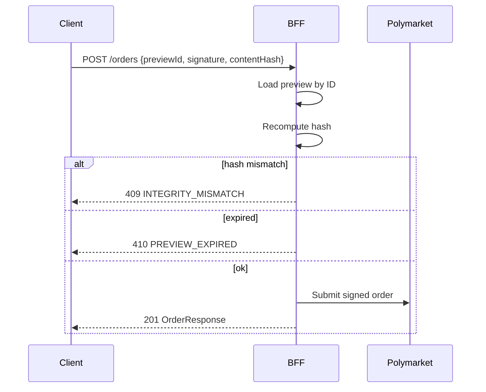

# SIGNING AND TRANSACTION INTEGRITY

**Status:** reviewed
**Owner:** platform-orchestrator
**Last updated:** 2026-07-25
**Product:** RetroPick Markets V1
**Wave:** 7 — Security, platform, and testing

## Description

This document is the preview-before-sign and transaction-integrity authority for RetroPick Markets V1 (ADR-003). It binds previewId, contentHash, humanSummary, and short-lived expiresAt; submit re-hash; chain and contract allowlists; the order_attempts state machine; and idempotency—while the BFF never holds user signing keys.

It sits in Wave 7 over order, wallet, and position preview/submit endpoints, order_attempts persistence, and web/Android trading UIs that must show human-readable preview before the wallet prompt. Upstream is CLOB V2, relayer, and CTF. Fail closed on hash mismatch (409), expiry (410), allowlist miss, or eligibility deny.

Read this for every CLOB limit or cancel, proxy deploy, USDC approval, and redemption flow, and whenever unsigned payload or allowlist changes. Prefer wallet UX docs for client chrome and SECURITY_TEST_AND_REVIEW_PLAN for SEC-T cases.

It excludes server-side signing of user orders, skipping preview in staging shortcuts that can reach CLOB, and silently accepting idempotency-key replay with a different body.

## 0. Developer intent (5W+1H)

Short orientation for implementers and agents. Read this before the normative sections below.

| Lens | Answer |
|------|--------|
| **Who** | BFF order/wallet/position preview+submit owners; web/Android trading UX showing human-readable preview before the wallet prompt; security reviewers enforcing ADR-003; QA writing integrity/idempotency cases; agents—who must not invent server-side signing of user orders. |
| **What** | Preview-before-sign integrity: `previewId` + `contentHash` + `humanSummary` + short-lived `expiresAt` (≤5m); submit re-hashes and binds the signature; chain/contract allowlists (Polygon 137, registry USDC/CTF/relayer); `order_attempts` state machine; idempotency. **BFF never holds user signing keys**—user signs EIP-712/EOA; builder/relayer keys only for approved meta-txs. Fail closed on hash/expiry/allowlist miss. |
| **When** | On every CLOB limit/cancel, proxy deploy, USDC approval, and redemption flow; whenever unsigned payload or allowlist changes; on the client before the wallet prompt (display + recommended/required hash recompute); on the server before any upstream submit. |
| **Where** | Spec: this file + ADR-003. Endpoints: `POST /orders/preview`, cancel/deploy/approvals/redeem previews, matching submits. Persistence: `order_attempts`. Allowlists: contract registry + env. Clients: web markets trading UI; Android trading (phase-gated). Upstream: CLOB V2 / relayer / CTF. |
| **Why** | Without binding preview→sign→submit, XSS/MITM/client bugs can change size/side/market after the user thought they confirmed. Fail-closed hash/expiry checks stop silent wrong orders. The no-custody model keeps private keys off RetroPick while still proving intent and enabling dispute evidence via stored hashes. |
| **How** | Issue preview with canonical SHA-256 of `unsignedPayload`+metadata; store single-use `previewId`; client shows `humanSummary` (action, market, size, price, fees, chainId); user signs; submit sends `previewId`, `signature`, `contentHash`; server reloads preview, recomputes hash → mismatch 409 / expired 410 / else upstream. `Idempotency-Key`: same key+body → same 2xx; different body → 422. |

### Integrity checklist (fail closed)

| Check | Response / action |
|-------|-------------------|
| Hash mismatch | 409 `INTEGRITY_MISMATCH` — no CLOB/relayer call |
| Preview expired | 410 `PREVIEW_EXPIRED` — re-preview required |
| Chain/contract not allowlisted | Reject at preview or submit |
| Maker not wallet-bound | Reject submit |
| Eligibility false/unknown | Trading middleware deny |
| Idempotency-Key + new body | 422 |

### Flow types covered

| Flow | Preview | Signature |
|------|---------|-----------|
| CLOB limit order | `POST /orders/preview` | EIP-712 order |
| CLOB cancel | cancel preview | EIP-712 cancel |
| Proxy deploy / USDC approval | wallet previews | EOA tx via relayer |
| Redemption | positions redeem preview | EOA / meta |

### Worked example

**Happy path.** User buys 10 USDC @ 0.50 → `POST /orders/preview` returns `previewId`, `contentHash`, human summary, unsigned EIP-712 payload. Client shows summary matching fields; wallet signs; `POST /orders` with same hash → server recomputes OK → CLOB accept → `order_attempts` `accepted`.

**Failure / degraded.** Extension tampers size after preview → client or server hash mismatch → 409, no submit. Preview older than 5m → 410; user must re-preview. Request for BFF to “sign for the user with a hot wallet” → **reject** (no key custody). Allowlist drift (wrong USDC) → preview rejected until registry pin updates via staged change.

**Agent pitfall.** Do not “helpfully” skip preview in tests or staging shortcuts that ship to prod paths—integrity must hold in every environment that can touch CLOB.

## 1. Purpose

Specifies preview-before-sign, content hashing, chain/contract allowlists, and order submission integrity for Markets V1 per ADR-003.

## 2. Scope

### In scope

- RetroPick Markets V1: `apps/web`, `apps/android`, Go BFF `apps/backend/internal/markets/`.
- Polymarket upstream (Gamma, CLOB V2, relayer/builder).
- PostgreSQL `markets.*`, Redis, workers (ingest, signal-engine, alert-delivery, reconciliation).
- Intelligence, notifications, eligibility, ops tooling.

### Out of scope

- PRISM (`contracts/prism/`).
- Legacy epoch (`/api/v1/legacy/markets/*`).
- Custom exchange ([ADR-001](../architecture/adr/ADR-001-MARKETS-HAS-NO-CUSTOM-EXCHANGE.md)).
- Auto copy trading ([ADR-009](../architecture/adr/ADR-009-NO-AUTO-COPY-TRADING-V1.md)).

## 3. Prerequisites

| Document | Role |
|----------|------|
| [00_DOCUMENT_MAP.md](../00_DOCUMENT_MAP.md) | Navigation |
| [architecture/SYSTEM_CONTEXT_AND_TRUST_BOUNDARIES.md](../architecture/SYSTEM_CONTEXT_AND_TRUST_BOUNDARIES.md) | Trust boundaries |
| [architecture/DEPLOYMENT_ARCHITECTURE.md](../architecture/DEPLOYMENT_ARCHITECTURE.md) | Deploy units |
| [05_NON_FUNCTIONAL_REQUIREMENTS.md](../05_NON_FUNCTIONAL_REQUIREMENTS.md) | NFRs |
| [phases/PHASE-6-HARDENING-CI-CD-AND-SRE.md](../phases/PHASE-6-HARDENING-CI-CD-AND-SRE.md) | Hardening |

## 4. Authoritative sources

| Source | Location | Confidence |
|--------|----------|------------|
| OpenAPI | `schemas/openapi/markets-v1.yaml` | verified |
| Polymarket docs | https://docs.polymarket.com/ | partially verified |
| ADR suite | `architecture/adr/` | verified |

## 5. Principles

1. **User signs, RetroPick prepares** — BFF never holds signing keys.
2. **Preview is binding** — `contentHash` in preview must match submit payload.
3. **Human-readable preview** — Clients show amount, market, side, price, fees before wallet prompt.
4. **Fail closed** — Hash mismatch → 409; no upstream submit.
5. **Infrastructure keys ≠ user keys** — Builder/relayer keys only for approved meta-txs.

## 6. Flow types

| Flow | Preview endpoint | Signature type | Upstream |
|------|------------------|----------------|----------|
| CLOB limit order | `POST /orders/preview` | EIP-712 order struct | CLOB V2 |
| CLOB cancel | `POST /orders/{id}/cancel/preview` | EIP-712 cancel | CLOB V2 |
| Proxy deploy | `POST /wallet/deploy/preview` | EOA tx | Relayer |
| USDC approval | `POST /wallet/approvals/preview` | EOA tx | Relayer |
| Redemption | `POST /positions/redeem/preview` | EOA / meta | CTF contracts |

## 7. Preview response contract

```json
{
  "previewId": "uuid",
  "contentHash": "0x...",
  "expiresAt": "2026-07-25T12:00:00Z",
  "humanSummary": {
    "action": "BUY",
    "outcome": "Yes",
    "market": "Will X happen?",
    "size": "100 USDC",
    "price": "0.42",
    "estimatedFee": "0.10 USDC",
    "chainId": 137
  },
  "unsignedPayload": { }
}
```

| Field | Validation |
|-------|------------|
| `contentHash` | SHA-256 canonical JSON of `unsignedPayload` + metadata |
| `expiresAt` | Max 5 minutes from issue |
| `previewId` | Single-use; stored in `order_attempts` |

## 8. Submit validation (server)



## 9. Client-side verification

| Check | Web | Android |
|-------|-----|---------|
| Display matches `humanSummary` | Required | Required |
| Recompute hash before sign | Recommended | Required |
| Chain ID display | Required | Required |
| Contract address in preview | Link to registry | Copy + verify |

## 10. Allowlists

| Allowlist | Source | Update process |
|-----------|--------|----------------|
| Chain IDs | `[137]` Polygon mainnet | ADR + config version bump |
| USDC address | Registry doc | Ingest version pin |
| CTF exchange | Registry doc | Ingest version pin |
| Relayer endpoints | Env config | Staged rollout |

## 11. Order attempt state machine

| State | Meaning |
|-------|---------|
| `preview_issued` | Hash stored, awaiting submit |
| `submitted` | Sent to CLOB |
| `accepted` | CLOB ack |
| `rejected` | CLOB reject; reason stored |
| `integrity_failed` | Hash or expiry failure |

## 12. Replay and idempotency

- `Idempotency-Key` header on submit; same key + same body → same response.
- Different body + same key → 422.
- CLOB nonces managed by wallet; BFF does not reuse signatures.

## 13. Error codes

| Code | HTTP | User message |
|------|------|--------------|
| `INTEGRITY_MISMATCH` | 409 | Preview changed; refresh and try again |
| `PREVIEW_EXPIRED` | 410 | Preview expired; request new preview |
| `PREVIEW_NOT_FOUND` | 404 | Invalid preview session |
| `CHAIN_NOT_ALLOWED` | 400 | Unsupported network |

## 14. Testing requirements

- Golden tests: canonical JSON → expected hash.
- Fuzz: random field mutation → mismatch detected.
- E2E: wallet sign wrong struct → CLOB reject, no DB corruption.

See [testing/CONTRACT_AND_CONFORMANCE_TESTS.md](../testing/CONTRACT_AND_CONFORMANCE_TESTS.md).

## 15. Related documents

- [architecture/adr/ADR-003-WALLET-AND-SIGNING-MODEL.md](../architecture/adr/ADR-003-WALLET-AND-SIGNING-MODEL.md)
- [polymarket/ORDER_LIFECYCLE.md](../polymarket/ORDER_LIFECYCLE.md)
- [THREAT_MODEL.md](./THREAT_MODEL.md) (T-T-010)

## Appendix — SIG

| ID | Item | Section | Owner |
|----|------|---------|-------|
| SIG-001 | Controlled register entry 1 | §6 | platform-orchestrator |
| SIG-002 | Controlled register entry 2 | §7 | platform-orchestrator |
| SIG-003 | Controlled register entry 3 | §8 | platform-orchestrator |
| SIG-004 | Controlled register entry 4 | §9 | platform-orchestrator |
| SIG-005 | Controlled register entry 5 | §10 | platform-orchestrator |
| SIG-006 | Controlled register entry 6 | §11 | platform-orchestrator |
| SIG-007 | Controlled register entry 7 | §12 | platform-orchestrator |
| SIG-008 | Controlled register entry 8 | §13 | platform-orchestrator |
| SIG-009 | Controlled register entry 9 | §14 | platform-orchestrator |
| SIG-010 | Controlled register entry 10 | §5 | platform-orchestrator |
| SIG-011 | Controlled register entry 11 | §6 | platform-orchestrator |
| SIG-012 | Controlled register entry 12 | §7 | platform-orchestrator |
| SIG-013 | Controlled register entry 13 | §8 | platform-orchestrator |
| SIG-014 | Controlled register entry 14 | §9 | platform-orchestrator |
| SIG-015 | Controlled register entry 15 | §10 | platform-orchestrator |
| SIG-016 | Controlled register entry 16 | §11 | platform-orchestrator |
| SIG-017 | Controlled register entry 17 | §12 | platform-orchestrator |
| SIG-018 | Controlled register entry 18 | §13 | platform-orchestrator |
| SIG-019 | Controlled register entry 19 | §14 | platform-orchestrator |
| SIG-020 | Controlled register entry 20 | §5 | platform-orchestrator |
| SIG-021 | Controlled register entry 21 | §6 | platform-orchestrator |
| SIG-022 | Controlled register entry 22 | §7 | platform-orchestrator |
| SIG-023 | Controlled register entry 23 | §8 | platform-orchestrator |
| SIG-024 | Controlled register entry 24 | §9 | platform-orchestrator |
| SIG-025 | Controlled register entry 25 | §10 | platform-orchestrator |
| SIG-026 | Controlled register entry 26 | §11 | platform-orchestrator |
| SIG-027 | Controlled register entry 27 | §12 | platform-orchestrator |
| SIG-028 | Controlled register entry 28 | §13 | platform-orchestrator |
| SIG-029 | Controlled register entry 29 | §14 | platform-orchestrator |
| SIG-030 | Controlled register entry 30 | §5 | platform-orchestrator |
| SIG-031 | Controlled register entry 31 | §6 | platform-orchestrator |
| SIG-032 | Controlled register entry 32 | §7 | platform-orchestrator |
| SIG-033 | Controlled register entry 33 | §8 | platform-orchestrator |
| SIG-034 | Controlled register entry 34 | §9 | platform-orchestrator |
| SIG-035 | Controlled register entry 35 | §10 | platform-orchestrator |
| SIG-036 | Controlled register entry 36 | §11 | platform-orchestrator |
| SIG-037 | Controlled register entry 37 | §12 | platform-orchestrator |
| SIG-038 | Controlled register entry 38 | §13 | platform-orchestrator |
| SIG-039 | Controlled register entry 39 | §14 | platform-orchestrator |
| SIG-040 | Controlled register entry 40 | §5 | platform-orchestrator |
| SIG-041 | Controlled register entry 41 | §6 | platform-orchestrator |
| SIG-042 | Controlled register entry 42 | §7 | platform-orchestrator |
| SIG-043 | Controlled register entry 43 | §8 | platform-orchestrator |
| SIG-044 | Controlled register entry 44 | §9 | platform-orchestrator |
| SIG-045 | Controlled register entry 45 | §10 | platform-orchestrator |
| SIG-046 | Controlled register entry 46 | §11 | platform-orchestrator |
| SIG-047 | Controlled register entry 47 | §12 | platform-orchestrator |
| SIG-048 | Controlled register entry 48 | §13 | platform-orchestrator |
| SIG-049 | Controlled register entry 49 | §14 | platform-orchestrator |
| SIG-050 | Controlled register entry 50 | §5 | platform-orchestrator |
| SIG-051 | Controlled register entry 51 | §6 | platform-orchestrator |
| SIG-052 | Controlled register entry 52 | §7 | platform-orchestrator |
| SIG-053 | Controlled register entry 53 | §8 | platform-orchestrator |
| SIG-054 | Controlled register entry 54 | §9 | platform-orchestrator |
| SIG-055 | Controlled register entry 55 | §10 | platform-orchestrator |
| SIG-056 | Controlled register entry 56 | §11 | platform-orchestrator |
| SIG-057 | Controlled register entry 57 | §12 | platform-orchestrator |
| SIG-058 | Controlled register entry 58 | §13 | platform-orchestrator |
| SIG-059 | Controlled register entry 59 | §14 | platform-orchestrator |
| SIG-060 | Controlled register entry 60 | §5 | platform-orchestrator |
| SIG-061 | Controlled register entry 61 | §6 | platform-orchestrator |
| SIG-062 | Controlled register entry 62 | §7 | platform-orchestrator |
| SIG-063 | Controlled register entry 63 | §8 | platform-orchestrator |
| SIG-064 | Controlled register entry 64 | §9 | platform-orchestrator |
| SIG-065 | Controlled register entry 65 | §10 | platform-orchestrator |
| SIG-066 | Controlled register entry 66 | §11 | platform-orchestrator |
| SIG-067 | Controlled register entry 67 | §12 | platform-orchestrator |
| SIG-068 | Controlled register entry 68 | §13 | platform-orchestrator |
| SIG-069 | Controlled register entry 69 | §14 | platform-orchestrator |
| SIG-070 | Controlled register entry 70 | §5 | platform-orchestrator |
| SIG-071 | Controlled register entry 71 | §6 | platform-orchestrator |
| SIG-072 | Controlled register entry 72 | §7 | platform-orchestrator |
| SIG-073 | Controlled register entry 73 | §8 | platform-orchestrator |
| SIG-074 | Controlled register entry 74 | §9 | platform-orchestrator |
| SIG-075 | Controlled register entry 75 | §10 | platform-orchestrator |
| SIG-076 | Controlled register entry 76 | §11 | platform-orchestrator |
| SIG-077 | Controlled register entry 77 | §12 | platform-orchestrator |
| SIG-078 | Controlled register entry 78 | §13 | platform-orchestrator |
| SIG-079 | Controlled register entry 79 | §14 | platform-orchestrator |
| SIG-080 | Controlled register entry 80 | §5 | platform-orchestrator |
| SIG-081 | Controlled register entry 81 | §6 | platform-orchestrator |
| SIG-082 | Controlled register entry 82 | §7 | platform-orchestrator |
| SIG-083 | Controlled register entry 83 | §8 | platform-orchestrator |
| SIG-084 | Controlled register entry 84 | §9 | platform-orchestrator |
| SIG-085 | Controlled register entry 85 | §10 | platform-orchestrator |
| SIG-086 | Controlled register entry 86 | §11 | platform-orchestrator |
| SIG-087 | Controlled register entry 87 | §12 | platform-orchestrator |
| SIG-088 | Controlled register entry 88 | §13 | platform-orchestrator |
| SIG-089 | Controlled register entry 89 | §14 | platform-orchestrator |
| SIG-090 | Controlled register entry 90 | §5 | platform-orchestrator |
| SIG-091 | Controlled register entry 91 | §6 | platform-orchestrator |
| SIG-092 | Controlled register entry 92 | §7 | platform-orchestrator |
| SIG-093 | Controlled register entry 93 | §8 | platform-orchestrator |
| SIG-094 | Controlled register entry 94 | §9 | platform-orchestrator |
| SIG-095 | Controlled register entry 95 | §10 | platform-orchestrator |
| SIG-096 | Controlled register entry 96 | §11 | platform-orchestrator |
| SIG-097 | Controlled register entry 97 | §12 | platform-orchestrator |
| SIG-098 | Controlled register entry 98 | §13 | platform-orchestrator |
| SIG-099 | Controlled register entry 99 | §14 | platform-orchestrator |
| SIG-100 | Controlled register entry 100 | §5 | platform-orchestrator |
| SIG-101 | Controlled register entry 101 | §6 | platform-orchestrator |
| SIG-102 | Controlled register entry 102 | §7 | platform-orchestrator |
| SIG-103 | Controlled register entry 103 | §8 | platform-orchestrator |
| SIG-104 | Controlled register entry 104 | §9 | platform-orchestrator |
| SIG-105 | Controlled register entry 105 | §10 | platform-orchestrator |
| SIG-106 | Controlled register entry 106 | §11 | platform-orchestrator |
| SIG-107 | Controlled register entry 107 | §12 | platform-orchestrator |
| SIG-108 | Controlled register entry 108 | §13 | platform-orchestrator |
| SIG-109 | Controlled register entry 109 | §14 | platform-orchestrator |
| SIG-110 | Controlled register entry 110 | §5 | platform-orchestrator |
| SIG-111 | Controlled register entry 111 | §6 | platform-orchestrator |
| SIG-112 | Controlled register entry 112 | §7 | platform-orchestrator |
| SIG-113 | Controlled register entry 113 | §8 | platform-orchestrator |
| SIG-114 | Controlled register entry 114 | §9 | platform-orchestrator |
| SIG-115 | Controlled register entry 115 | §10 | platform-orchestrator |
| SIG-116 | Controlled register entry 116 | §11 | platform-orchestrator |
| SIG-117 | Controlled register entry 117 | §12 | platform-orchestrator |
| SIG-118 | Controlled register entry 118 | §13 | platform-orchestrator |
| SIG-119 | Controlled register entry 119 | §14 | platform-orchestrator |
| SIG-120 | Controlled register entry 120 | §5 | platform-orchestrator |
| SIG-121 | Controlled register entry 121 | §6 | platform-orchestrator |
| SIG-122 | Controlled register entry 122 | §7 | platform-orchestrator |
| SIG-123 | Controlled register entry 123 | §8 | platform-orchestrator |
| SIG-124 | Controlled register entry 124 | §9 | platform-orchestrator |
| SIG-125 | Controlled register entry 125 | §10 | platform-orchestrator |
| SIG-126 | Controlled register entry 126 | §11 | platform-orchestrator |
| SIG-127 | Controlled register entry 127 | §12 | platform-orchestrator |
| SIG-128 | Controlled register entry 128 | §13 | platform-orchestrator |
| SIG-129 | Controlled register entry 129 | §14 | platform-orchestrator |
| SIG-130 | Controlled register entry 130 | §5 | platform-orchestrator |
| SIG-131 | Controlled register entry 131 | §6 | platform-orchestrator |
| SIG-132 | Controlled register entry 132 | §7 | platform-orchestrator |
| SIG-133 | Controlled register entry 133 | §8 | platform-orchestrator |
| SIG-134 | Controlled register entry 134 | §9 | platform-orchestrator |
| SIG-135 | Controlled register entry 135 | §10 | platform-orchestrator |
| SIG-136 | Controlled register entry 136 | §11 | platform-orchestrator |
| SIG-137 | Controlled register entry 137 | §12 | platform-orchestrator |
| SIG-138 | Controlled register entry 138 | §13 | platform-orchestrator |
| SIG-139 | Controlled register entry 139 | §14 | platform-orchestrator |
| SIG-140 | Controlled register entry 140 | §5 | platform-orchestrator |
| SIG-141 | Controlled register entry 141 | §6 | platform-orchestrator |
| SIG-142 | Controlled register entry 142 | §7 | platform-orchestrator |
| SIG-143 | Controlled register entry 143 | §8 | platform-orchestrator |
| SIG-144 | Controlled register entry 144 | §9 | platform-orchestrator |
| SIG-145 | Controlled register entry 145 | §10 | platform-orchestrator |
| SIG-146 | Controlled register entry 146 | §11 | platform-orchestrator |
| SIG-147 | Controlled register entry 147 | §12 | platform-orchestrator |
| SIG-148 | Controlled register entry 148 | §13 | platform-orchestrator |
| SIG-149 | Controlled register entry 149 | §14 | platform-orchestrator |
| SIG-150 | Controlled register entry 150 | §5 | platform-orchestrator |
| SIG-151 | Controlled register entry 151 | §6 | platform-orchestrator |
| SIG-152 | Controlled register entry 152 | §7 | platform-orchestrator |
| SIG-153 | Controlled register entry 153 | §8 | platform-orchestrator |
| SIG-154 | Controlled register entry 154 | §9 | platform-orchestrator |
| SIG-155 | Controlled register entry 155 | §10 | platform-orchestrator |
| SIG-156 | Controlled register entry 156 | §11 | platform-orchestrator |
| SIG-157 | Controlled register entry 157 | §12 | platform-orchestrator |
| SIG-158 | Controlled register entry 158 | §13 | platform-orchestrator |
| SIG-159 | Controlled register entry 159 | §14 | platform-orchestrator |
| SIG-160 | Controlled register entry 160 | §5 | platform-orchestrator |
| SIG-161 | Controlled register entry 161 | §6 | platform-orchestrator |
| SIG-162 | Controlled register entry 162 | §7 | platform-orchestrator |
| SIG-163 | Controlled register entry 163 | §8 | platform-orchestrator |
| SIG-164 | Controlled register entry 164 | §9 | platform-orchestrator |
| SIG-165 | Controlled register entry 165 | §10 | platform-orchestrator |
| SIG-166 | Controlled register entry 166 | §11 | platform-orchestrator |
| SIG-167 | Controlled register entry 167 | §12 | platform-orchestrator |
| SIG-168 | Controlled register entry 168 | §13 | platform-orchestrator |
| SIG-169 | Controlled register entry 169 | §14 | platform-orchestrator |
| SIG-170 | Controlled register entry 170 | §5 | platform-orchestrator |
| SIG-171 | Controlled register entry 171 | §6 | platform-orchestrator |
| SIG-172 | Controlled register entry 172 | §7 | platform-orchestrator |
| SIG-173 | Controlled register entry 173 | §8 | platform-orchestrator |
| SIG-174 | Controlled register entry 174 | §9 | platform-orchestrator |
| SIG-175 | Controlled register entry 175 | §10 | platform-orchestrator |
| SIG-176 | Controlled register entry 176 | §11 | platform-orchestrator |
| SIG-177 | Controlled register entry 177 | §12 | platform-orchestrator |
| SIG-178 | Controlled register entry 178 | §13 | platform-orchestrator |
| SIG-179 | Controlled register entry 179 | §14 | platform-orchestrator |
| SIG-180 | Controlled register entry 180 | §5 | platform-orchestrator |
| SIG-181 | Controlled register entry 181 | §6 | platform-orchestrator |
| SIG-182 | Controlled register entry 182 | §7 | platform-orchestrator |
| SIG-183 | Controlled register entry 183 | §8 | platform-orchestrator |
| SIG-184 | Controlled register entry 184 | §9 | platform-orchestrator |
| SIG-185 | Controlled register entry 185 | §10 | platform-orchestrator |
| SIG-186 | Controlled register entry 186 | §11 | platform-orchestrator |
| SIG-187 | Controlled register entry 187 | §12 | platform-orchestrator |
| SIG-188 | Controlled register entry 188 | §13 | platform-orchestrator |
| SIG-189 | Controlled register entry 189 | §14 | platform-orchestrator |
| SIG-190 | Controlled register entry 190 | §5 | platform-orchestrator |
| SIG-191 | Controlled register entry 191 | §6 | platform-orchestrator |
| SIG-192 | Controlled register entry 192 | §7 | platform-orchestrator |
| SIG-193 | Controlled register entry 193 | §8 | platform-orchestrator |
| SIG-194 | Controlled register entry 194 | §9 | platform-orchestrator |
| SIG-195 | Controlled register entry 195 | §10 | platform-orchestrator |
| SIG-196 | Controlled register entry 196 | §11 | platform-orchestrator |
| SIG-197 | Controlled register entry 197 | §12 | platform-orchestrator |
| SIG-198 | Controlled register entry 198 | §13 | platform-orchestrator |
| SIG-199 | Controlled register entry 199 | §14 | platform-orchestrator |
| SIG-200 | Controlled register entry 200 | §5 | platform-orchestrator |
| SIG-201 | Controlled register entry 201 | §6 | platform-orchestrator |
| SIG-202 | Controlled register entry 202 | §7 | platform-orchestrator |
| SIG-203 | Controlled register entry 203 | §8 | platform-orchestrator |
| SIG-204 | Controlled register entry 204 | §9 | platform-orchestrator |
| SIG-205 | Controlled register entry 205 | §10 | platform-orchestrator |
| SIG-206 | Controlled register entry 206 | §11 | platform-orchestrator |
| SIG-207 | Controlled register entry 207 | §12 | platform-orchestrator |
| SIG-208 | Controlled register entry 208 | §13 | platform-orchestrator |
| SIG-209 | Controlled register entry 209 | §14 | platform-orchestrator |
| SIG-210 | Controlled register entry 210 | §5 | platform-orchestrator |
| SIG-211 | Controlled register entry 211 | §6 | platform-orchestrator |
| SIG-212 | Controlled register entry 212 | §7 | platform-orchestrator |
| SIG-213 | Controlled register entry 213 | §8 | platform-orchestrator |
| SIG-214 | Controlled register entry 214 | §9 | platform-orchestrator |
| SIG-215 | Controlled register entry 215 | §10 | platform-orchestrator |
| SIG-216 | Controlled register entry 216 | §11 | platform-orchestrator |
| SIG-217 | Controlled register entry 217 | §12 | platform-orchestrator |
| SIG-218 | Controlled register entry 218 | §13 | platform-orchestrator |
| SIG-219 | Controlled register entry 219 | §14 | platform-orchestrator |
| SIG-220 | Controlled register entry 220 | §5 | platform-orchestrator |
| SIG-221 | Controlled register entry 221 | §6 | platform-orchestrator |
| SIG-222 | Controlled register entry 222 | §7 | platform-orchestrator |
| SIG-223 | Controlled register entry 223 | §8 | platform-orchestrator |
| SIG-224 | Controlled register entry 224 | §9 | platform-orchestrator |
| SIG-225 | Controlled register entry 225 | §10 | platform-orchestrator |
| SIG-226 | Controlled register entry 226 | §11 | platform-orchestrator |
| SIG-227 | Controlled register entry 227 | §12 | platform-orchestrator |
| SIG-228 | Controlled register entry 228 | §13 | platform-orchestrator |
| SIG-229 | Controlled register entry 229 | §14 | platform-orchestrator |
| SIG-230 | Controlled register entry 230 | §5 | platform-orchestrator |
| SIG-231 | Controlled register entry 231 | §6 | platform-orchestrator |
| SIG-232 | Controlled register entry 232 | §7 | platform-orchestrator |
| SIG-233 | Controlled register entry 233 | §8 | platform-orchestrator |
| SIG-234 | Controlled register entry 234 | §9 | platform-orchestrator |
| SIG-235 | Controlled register entry 235 | §10 | platform-orchestrator |
| SIG-236 | Controlled register entry 236 | §11 | platform-orchestrator |
| SIG-237 | Controlled register entry 237 | §12 | platform-orchestrator |
| SIG-238 | Controlled register entry 238 | §13 | platform-orchestrator |
| SIG-239 | Controlled register entry 239 | §14 | platform-orchestrator |
| SIG-240 | Controlled register entry 240 | §5 | platform-orchestrator |
| SIG-241 | Controlled register entry 241 | §6 | platform-orchestrator |
| SIG-242 | Controlled register entry 242 | §7 | platform-orchestrator |
| SIG-243 | Controlled register entry 243 | §8 | platform-orchestrator |
| SIG-244 | Controlled register entry 244 | §9 | platform-orchestrator |
| SIG-245 | Controlled register entry 245 | §10 | platform-orchestrator |
| SIG-246 | Controlled register entry 246 | §11 | platform-orchestrator |
| SIG-247 | Controlled register entry 247 | §12 | platform-orchestrator |
| SIG-248 | Controlled register entry 248 | §13 | platform-orchestrator |
| SIG-249 | Controlled register entry 249 | §14 | platform-orchestrator |
| SIG-250 | Controlled register entry 250 | §5 | platform-orchestrator |
| SIG-251 | Controlled register entry 251 | §6 | platform-orchestrator |
| SIG-252 | Controlled register entry 252 | §7 | platform-orchestrator |
| SIG-253 | Controlled register entry 253 | §8 | platform-orchestrator |
| SIG-254 | Controlled register entry 254 | §9 | platform-orchestrator |
| SIG-255 | Controlled register entry 255 | §10 | platform-orchestrator |
| SIG-256 | Controlled register entry 256 | §11 | platform-orchestrator |
| SIG-257 | Controlled register entry 257 | §12 | platform-orchestrator |
| SIG-258 | Controlled register entry 258 | §13 | platform-orchestrator |
| SIG-259 | Controlled register entry 259 | §14 | platform-orchestrator |
| SIG-260 | Controlled register entry 260 | §5 | platform-orchestrator |
| SIG-261 | Controlled register entry 261 | §6 | platform-orchestrator |
| SIG-262 | Controlled register entry 262 | §7 | platform-orchestrator |
| SIG-263 | Controlled register entry 263 | §8 | platform-orchestrator |
| SIG-264 | Controlled register entry 264 | §9 | platform-orchestrator |
| SIG-265 | Controlled register entry 265 | §10 | platform-orchestrator |
| SIG-266 | Controlled register entry 266 | §11 | platform-orchestrator |
| SIG-267 | Controlled register entry 267 | §12 | platform-orchestrator |
| SIG-268 | Controlled register entry 268 | §13 | platform-orchestrator |
| SIG-269 | Controlled register entry 269 | §14 | platform-orchestrator |
| SIG-270 | Controlled register entry 270 | §5 | platform-orchestrator |
| SIG-271 | Controlled register entry 271 | §6 | platform-orchestrator |
| SIG-272 | Controlled register entry 272 | §7 | platform-orchestrator |
| SIG-273 | Controlled register entry 273 | §8 | platform-orchestrator |
| SIG-274 | Controlled register entry 274 | §9 | platform-orchestrator |
## Acceptance criteria

- Status `reviewed`; links valid per [00_DOCUMENT_MAP.md](../00_DOCUMENT_MAP.md).
- Tasks trace to [../../../.harness/products/markets-v1/planning/REQUIREMENTS_TO_TASK_TRACEABILITY.md](../../../.harness/products/markets-v1/planning/REQUIREMENTS_TO_TASK_TRACEABILITY.md).

## Revision history

| Date | Author | Change |
|------|--------|--------|
| 2026-07-24 | platform-orchestrator | Initial stub |
| 2026-07-25 | platform-orchestrator | Wave 7 expansion |
