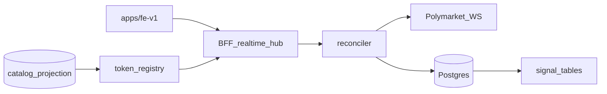

# THREAT MODEL

**Status:** draft — Phase 1.3 realtime surfaces added 2026-07-31
**Owner:** platform-orchestrator
**Last updated:** 2026-07-31
**Product:** RetroPick Markets V1

## 1. Purpose

STRIDE threat model for Markets V1 custody, signing, and data flows including Phase 1.3 realtime ingestion.

## 2. Scope

### In scope

- RetroPick Markets V1 (`apps/fe-v1`, Go BFF, native Android Jetpack Compose).
- Phase 1.3: upstream WebSocket supervisor, public BFF hub, observation persistence, live signal pipeline.

### Out of scope

- PRISM protocol implementation and `contracts/prism/`.
- Legacy epoch MarketEngine extension (`/api/v1/legacy/markets/*`).
- Custom RetroPick exchange or outcome-token issuance (ADR-001).

## 3. Prerequisites

- [00_DOCUMENT_MAP.md](../00_DOCUMENT_MAP.md)
- [docs/architecture/markets-phase-1-3-realtime-intelligence.md](../../docs/architecture/markets-phase-1-3-realtime-intelligence.md)
- [SEC-P13-001-ROTATE-EXPOSED-CREDENTIAL.md](SEC-P13-001-ROTATE-EXPOSED-CREDENTIAL.md)

## 4. Authoritative sources

| Source | URL | Retrieved | Confidence |
|--------|-----|-----------|------------|
| Polymarket docs | https://docs.polymarket.com/ | 2026-07-31 | partially verified |
| Phase 1.3 architecture | `docs/architecture/markets-phase-1-3-realtime-intelligence.md` | 2026-07-31 | verified |
| OpenAPI (repo) | `schemas/openapi/markets-v1.yaml` | 2026-07-31 | verified |

## 5. Current state

Phase 1 backend read slice closed (PR #7). Phase 1.3 implementation slice landed (PR #8); runtime closure in progress. Known gaps: catalog token registry (BLK-003), transactional signal pipeline (BLK-004), credential rotation (BLK-005), single-replica model (BLK-006).

## 6. Target design

Implementation-grade STRIDE aligned with R0–R3 monorepo and Phase 1.3 architecture.

## 7. Alternatives considered

| Alternative | Rejected because |
|-------------|------------------|
| Direct Polymarket WS from `apps/fe-v1` | ADR-002: BFF anti-corruption; secrets and validation at BFF |
| In-memory token registry in production | BLK-003: fail-closed catalog validation required |
| Hash-chain delta validation | ADR-012: upstream hash is evidence only |

## 8. Decisions

- Polymarket is venue authority (ADR-001).
- BFF anti-corruption layer at `apps/backend/internal/markets/` (ADR-002).
- Public market channel only for Phase 1.3; no user-channel auth.
- No Polymarket credentials in `apps/fe-v1`.

## 9. Data and control flows

## 10. Failure and recovery

- Fail closed on unknown token/market pair (P13C-001).
- Upstream disconnect → resnapshot; never apply deltas without baseline.
- Slow hub clients disconnected without blocking ingestion.
- Single-replica model: duplicate replicas risk duplicate upstream load (BLK-006).

## 11. Security — STRIDE (Phase 1.3 additions)

| Category | Threat | Mitigation | Task | Status |
|----------|--------|------------|------|--------|
| Spoofing | Fake upstream WS endpoint | Allowlisted WSS URL in config | MKT-P13-001 | done |
| Tampering | Malformed WS frames crash supervisor | Frame isolation per ADR-011 | MKT-P13-001 | done |
| Repudiation | Signal emitted without durable evidence | Transactional observation + signal write | P13C-002 | **pending** |
| Info disclosure | Exposed Polymarket credential | SEC-P13-001 rotation gate | P13C-007 | **ROTATION_PENDING_OWNER** |
| Info disclosure | Credentials in frontend bundle | No secrets in apps/fe-v1 | MKT-P13-005 | done |
| DoS | Hub slow-consumer blocks ingestion | Bounded queues; disconnect slow clients | MKT-P13-005 | done |
| DoS | Arbitrary token subscribe floods reconciler | Catalog-backed token validation | P13C-001 | **pending** |
| Elevation | Client claims live book when degraded | Honest capability flags | P13C-004 | pending |

Legacy threats (Phase 2+): key exfiltration, preview tampering, eligibility bypass.

## 12. Observability

- Bounded-cardinality metrics; no market/token IDs in Prometheus labels.
- Upstream reconnect, coverage ratio, book state, hub connection counts.

## 13. Test strategy

- Fake upstream server for deterministic WS tests (P13C-003).
- Transactional signal replay tests (P13C-002).
- See [testing/MASTER_TEST_PLAN.md](../testing/MASTER_TEST_PLAN.md).

## 14. Rollout and rollback

- `RealtimeEnabled=false` disables hub and upstream supervisor.
- SEC-P13-001 blocks production deployment until `ROTATION_CONFIRMED`.
- See [platform/RELEASE_ROLLBACK_AND_CHANGE_MANAGEMENT.md](../platform/RELEASE_ROLLBACK_AND_CHANGE_MANAGEMENT.md).

## 15. Open questions

- Leader election for multi-replica realtime (deferred post Phase 1.3).
- [research/OPEN_QUESTIONS_AND_EXPIRING_ASSUMPTIONS.md](../research/OPEN_QUESTIONS_AND_EXPIRING_ASSUMPTIONS.md)

## 16. Acceptance criteria

- P13C-007 gate documented with `ROTATION_PENDING_OWNER` until owner action.
- P13C-001 and P13C-002 close BLK-003 and BLK-004 before production realtime.
- Linked in [agent-harness/REQUIREMENTS_TO_TASK_TRACEABILITY.md](../agent-harness/REQUIREMENTS_TO_TASK_TRACEABILITY.md).
