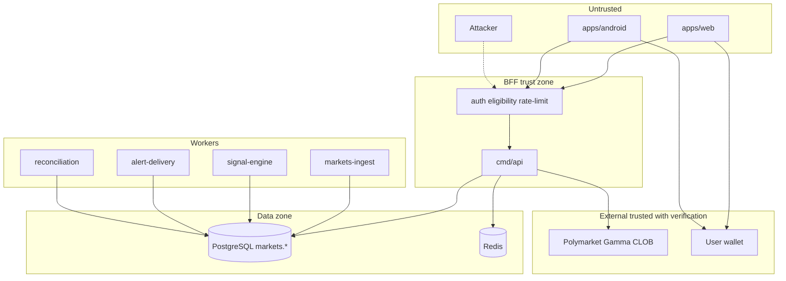

# THREAT MODEL

**Status:** reviewed
**Owner:** platform-orchestrator
**Last updated:** 2026-07-25
**Product:** RetroPick Markets V1
**Wave:** 7 — Security, platform, and testing

## Description

This document is the STRIDE threat model for RetroPick Markets V1 across trust boundaries: client→BFF, BFF→Polymarket, BFF→Postgres/Redis, user→wallet, and operator→ops. It scores likelihood×impact, records residual-risk acceptance (score >12 needs written accept), and ties mitigations to fail-closed eligibility/geo, preview-before-sign integrity, session hardening, and no user key custody.

It sits in Wave 7 as security-spec authority, with boundary definitions in architecture trust-boundary docs and mitigations in sibling security and backend docs. Decomposition includes web, Android, cmd/api middleware, workers, markets.*, Redis, Polymarket Gamma/CLOB, and user wallets—not a custom-exchange or PRISM/legacy model.

Read this before designing or changing auth, trading, eligibility, builder-key usage, or ops surfaces; on Wave 7 reviews; and before pen-test scope freeze and launch sign-off. Prefer SECURITY_TEST_AND_REVIEW_PLAN to trace high residuals to SEC-T cases.

It excludes server custody of EOA or seeds, client-only geoblock, and fail-open eligibility when GeoIP is unknown.

## 0. Developer intent (5W+1H)

Short orientation for implementers and agents. Read this before the normative sections below.

| Lens | Answer |
|------|--------|
| **Who** | Security owners and architects applying STRIDE across Markets trust boundaries; BFF middleware owners (auth, eligibility, rate-limit); web/Android engineers who keep signing in the user wallet; ops/incident responders scoring residual risk; pen-testers and agents mapping threats before PHASE-7. Not custodians—RetroPick never holds user EOA/seed material. |
| **What** | Markets V1 threat model: STRIDE per trust-boundary crossing (client→BFF, BFF→Polymarket, BFF→Postgres/Redis, user→wallet, operator→ops), likelihood×impact scoring, residual-risk acceptance (score >12 needs explicit accept), and mitigations aligned to **fail-closed** eligibility/geo, preview-before-sign integrity, session hardening, and **no user key custody**. Covers spoofing, preview tampering, session theft, geo bypass, builder-key abuse, DoS—not a custom-exchange or PRISM/legacy model. |
| **When** | Before designing or changing auth, trading, eligibility, builder-key usage, or ops surfaces; on every wave-7 security review; when residual risk changes after a mitigation lands; before pen-test scope freeze and launch sign-off. Re-score when a new worker, third party, or client surface appears. |
| **Where** | Spec authority: this file. Boundary definitions: [SYSTEM_CONTEXT_AND_TRUST_BOUNDARIES.md](../architecture/SYSTEM_CONTEXT_AND_TRUST_BOUNDARIES.md). Mitigations: sibling security docs (secrets, signing, abuse, incidents) plus backend auth/rate-limit docs. Decomposition includes `apps/web`, `apps/android`, `cmd/api` middleware, workers, `markets.*`, Redis, Polymarket Gamma/CLOB, user wallets. |
| **Why** | Polymarket-native Markets still faces real STRIDE threats even without custodian fund vaults. Explicit modeling stops “we don’t hold keys so we’re safe.” Fail-closed geo and integrity controls protect users and the operator when policy, GeoIP, or upstream state is unknown. Residual scoring makes launch risk a decision, not a vibe. |
| **How** | Decompose the system; enumerate STRIDE per boundary; score L×I; attach mitigations (TLS, HttpOnly sessions, server GeoIP + Polymarket geoblock, `contentHash` preview bind, Redis rate limits fail-closed on writes, least-privilege DB roles, audited break-glass). Never store EOA/seed server-side. Residual >12 → written acceptance or block launch. Trace each high residual to a case in SECURITY_TEST_AND_REVIEW_PLAN. |

### Trust posture (non-negotiable)

| Rule | Meaning for implementers |
|------|--------------------------|
| No key custody | User signing keys stay in wallet; BFF prepares unsigned payloads only |
| Fail closed | Unknown eligibility, geo, or integrity → deny trading writes |
| Server-authoritative geo | Client GPS/locale/headers never grant eligibility |
| Infrastructure ≠ user keys | Builder/relayer keys are T3 secrets, not user signing EOAs |
| Residual risk gate | Score >12 needs written acceptance before PHASE-7 |

### Boundary → primary controls

| Boundary | Primary controls |
|----------|------------------|
| Client → BFF | TLS 1.2+, session cookie/JWT, CSRF on cookie auth, rate limits |
| BFF → Polymarket | Schema validation, credential metering, timeout/degrade |
| BFF → Postgres/Redis | Network policy, least-privilege roles, no raw PII in logs |
| User → Wallet | Preview-before-sign; no key export to RetroPick |
| Operator → Ops | SSO, read-only default, break-glass audited |

### Worked example

**Happy path.** Architect maps Client→BFF spoofing (stolen cookie) → HttpOnly/Secure/SameSite + short TTL + refresh rotation; residual Low. Preview UI tampering → CSP + server re-hash on submit → 409 on mismatch. Geo eligibility evaluated server-side (GeoIP + Polymarket geoblock); allowed region → `eligible: true`; user signs only in wallet. All residuals ≤12 or accepted; linked SEC-T cases green.

**Failure / degraded.** Attacker spoofs `X-Forwarded-For` or client claims “allowed country” → ignored; server geo used; unknown GeoIP → **fail closed** (`eligible: false`). Preview JSON altered between preview and submit → hash mismatch → no CLOB call. Builder key leak → SEC incident (rotate + meter), not framed as custodian loss—but still SEV-capable via abuse/ToS blast radius. Residual >12 without acceptance → launch blocked.

**Never invent.** Server-side custody of user keys, client-only geoblock, or “fail open when GeoIP times out” are out of model and must be rejected in design review.

## 1. Purpose

STRIDE threat model for Markets V1 custody, signing, eligibility, upstream integration, and intelligence surfaces. Defines threats, mitigations, and residual risk for launch gating.

## 2. Scope

### In scope

- RetroPick Markets V1: `apps/web`, `apps/android`, Go BFF `apps/backend/internal/markets/`.
- Polymarket upstream (Gamma, CLOB V2, relayer/builder).
- PostgreSQL `markets.*`, Redis, workers (ingest, signal-engine, alert-delivery, reconciliation).
- Intelligence, notifications, eligibility, ops tooling.

### Out of scope

- PRISM (`contracts/prism/`).
- Legacy epoch (`/api/v1/legacy/markets/*`).
- Custom exchange ([ADR-001](../architecture/adr/ADR-001-MARKETS-HAS-NO-CUSTOM-EXCHANGE.md)).
- Auto copy trading ([ADR-009](../architecture/adr/ADR-009-NO-AUTO-COPY-TRADING-V1.md)).

## 3. Prerequisites

| Document | Role |
|----------|------|
| [00_DOCUMENT_MAP.md](../00_DOCUMENT_MAP.md) | Navigation |
| [architecture/SYSTEM_CONTEXT_AND_TRUST_BOUNDARIES.md](../architecture/SYSTEM_CONTEXT_AND_TRUST_BOUNDARIES.md) | Trust boundaries |
| [architecture/DEPLOYMENT_ARCHITECTURE.md](../architecture/DEPLOYMENT_ARCHITECTURE.md) | Deploy units |
| [05_NON_FUNCTIONAL_REQUIREMENTS.md](../05_NON_FUNCTIONAL_REQUIREMENTS.md) | NFRs |
| [phases/PHASE-6-HARDENING-CI-CD-AND-SRE.md](../phases/PHASE-6-HARDENING-CI-CD-AND-SRE.md) | Hardening |

## 4. Authoritative sources

| Source | Location | Confidence |
|--------|----------|------------|
| OpenAPI | `schemas/openapi/markets-v1.yaml` | verified |
| Polymarket docs | https://docs.polymarket.com/ | partially verified |
| ADR suite | `architecture/adr/` | verified |

## 5. Methodology

We apply **STRIDE** per trust-boundary crossing defined in [SYSTEM_CONTEXT_AND_TRUST_BOUNDARIES.md](../architecture/SYSTEM_CONTEXT_AND_TRUST_BOUNDARIES.md):

| STRIDE | Question |
|--------|----------|
| Spoofing | Can an actor impersonate user, BFF, or Polymarket? |
| Tampering | Can data be altered in transit, at rest, or in preview? |
| Repudiation | Can actions be denied without audit evidence? |
| Information disclosure | Can secrets, PII, or positions leak? |
| Denial of service | Can abuse degrade trading or catalog? |
| Elevation of privilege | Can session token grant signing or admin power? |

Risk scoring: **Likelihood** (1–5) × **Impact** (1–5). Residual risk >12 requires explicit acceptance before PHASE-7.

## 6. System decomposition



## 7. Trust boundaries

| Boundary | Crossers | Controls |
|----------|----------|----------|
| Client → BFF | Web, Android | TLS 1.2+, OAuth/SIWE session, CSRF on cookie auth |
| BFF → Polymarket | API, workers | mTLS optional, pinned roots, response schema validation |
| BFF → Postgres | All server processes | IAM/network policy, least-privilege DB roles |
| User → Wallet | Clients | No key export to RetroPick; preview-before-sign |
| Operator → Ops | Staff SSO | Read-only default; break-glass audited |

## 8. STRIDE — Client layer (web + Android)

### 8.1 Spoofing

| ID | Threat | Mitigation | Residual |
|----|--------|------------|----------|
| T-S-001 | Phishing site mimics RetroPick | CSP, HSTS preload, domain allowlist in app | Medium |
| T-S-002 | Stolen session cookie reused | HttpOnly, Secure, SameSite, short TTL, rotation | Low |
| T-S-003 | Fake WalletConnect relay | Official WC project ID, domain verification | Medium |

### 8.2 Tampering

| ID | Threat | Mitigation | Residual |
|----|--------|------------|----------|
| T-T-001 | XSS modifies preview UI | Strict CSP, sanitize HTML, React escaping | Low |
| T-T-002 | MITM alters API JSON | TLS, certificate pinning on Android optional | Low |
| T-T-003 | Malicious browser extension injects scripts | Document risk; encourage clean profile | Medium |

### 8.3 Repudiation

| ID | Threat | Mitigation | Residual |
|----|--------|------------|----------|
| T-R-001 | User denies placing order | On-chain + CLOB order ID, signed payload hash in `order_attempts` | Low |

### 8.4 Information disclosure

| ID | Threat | Mitigation | Residual |
|----|--------|------------|----------|
| T-I-001 | Local storage leaks session | Encrypt Android tokens in Keystore; web memory-only where possible | Low |
| T-I-002 | Screenshot of seed phrase | Never display seeds; wallet vendor UX | Low |

### 8.5 Denial of service

| ID | Threat | Mitigation | Residual |
|----|--------|------------|----------|
| T-D-001 | Client retry storm on 503 | Exponential backoff, jitter, circuit breaker UI | Low |

### 8.6 Elevation of privilege

| ID | Threat | Mitigation | Residual |
|----|--------|------------|----------|
| T-E-001 | Session used to sign on-chain | Session cannot sign; separate wallet flow | Low |

## 9. STRIDE — BFF API layer

### 9.1 Spoofing

| ID | Threat | Mitigation | Residual |
|----|--------|------------|----------|
| T-S-010 | Forged internal service header | mTLS between workers and API in prod | Low |
| T-S-011 | Spoofed Polymarket webhook (if added) | HMAC signature verification | Low |

### 9.2 Tampering

| ID | Threat | Mitigation | Residual |
|----|--------|------------|----------|
| T-T-010 | Preview response altered before sign | `contentHash` binding; server recomputes on submit | Low |
| T-T-011 | Idempotency key replay with different body | Hash request body with idempotency key | Low |
| T-T-012 | SQL injection | Parameterized queries, sqlc/ORM discipline | Low |

### 9.3 Repudiation

| ID | Threat | Mitigation | Residual |
|----|--------|------------|----------|
| T-R-010 | Missing audit on eligibility override | `eligibility_decisions` immutable log | Low |

### 9.4 Information disclosure

| ID | Threat | Mitigation | Residual |
|----|--------|------------|----------|
| T-I-010 | Verbose error leaks stack | Redact prod errors; request ID only | Low |
| T-I-011 | Cross-user IDOR on `/me/*` | AuthZ: subject must match wallet owner | Low |

### 9.5 Denial of service

| ID | Threat | Mitigation | Residual |
|----|--------|------------|----------|
| T-D-010 | Unauthenticated catalog scrape | Rate limits per IP + API key tier | Medium |
| T-D-011 | Expensive graph query | Pagination caps, query timeouts | Low |

### 9.6 Elevation of privilege

| ID | Threat | Mitigation | Residual |
|----|--------|------------|----------|
| T-E-010 | Operator API used for trading | Separate ops principal; no order routes | Low |
| T-E-011 | Builder key used for user orders | Key scope separation per [SECRETS_KEYS_AND_ACCESS_CONTROL.md](./SECRETS_KEYS_AND_ACCESS_CONTROL.md) | Low |

## 10. STRIDE — Workers and data plane

| Component | Primary threats | Key controls |
|-----------|-----------------|--------------|
| markets-ingest | Poisoned upstream JSON | Schema validation, ACL normalization, quarantine table |
| signal-engine | False signal manipulation | Deterministic pipelines, evidence hashes, retraction workflow |
| alert-delivery | Notification spam | Per-user rate limits, rule caps |
| reconciliation | Silent drift acceptance | Alert on mismatch threshold; no auto-trade repair |
| PostgreSQL | Credential theft | Private network, rotation, encryption at rest |
| Redis | Cache poisoning | AUTH, TLS, no sensitive payloads in cache |

## 11. STRIDE — Polymarket and chain

| ID | Threat | Mitigation | Residual |
|----|--------|------------|----------|
| T-PM-001 | Malicious market in catalog | Gamma allowlist + human review for featured |
| T-PM-002 | Wrong chain ID in calldata | Chain ID 137 allowlist in preview builder |
| T-PM-003 | Contract address substitution | Address registry versioned in [polymarket/CONTRACT_ABI_AND_ADDRESS_REGISTRY.md](../polymarket/CONTRACT_ABI_AND_ADDRESS_REGISTRY.md) |
| T-PM-004 | CLOB API impersonation | TLS + response fingerprinting | Low |

## 12. Attack trees (selected)

### 12.1 Steal user funds without wallet key

```
Goal: Move USDC without user signature
├─ Compromise RetroPick DB keys → BLOCKED (no custody, ADR-003)
├─ Tamper preview → submit different order → MITIGATED (contentHash)
├─ Replay signed order → MITIGATED (CLOB nonce/expiry)
└─ Social engineer support → PROCESS (no recovery of keys)
```

### 12.2 Bypass geoblock / eligibility

```
Goal: Trade from prohibited jurisdiction
├─ Spoof IP via VPN → MITIGATED (multi-signal eligibility, fail-closed)
├─ Tamper client geo header → IGNORED (server-side IP)
└─ Use API without session → BLOCKED (auth on write routes)
```

## 13. Security requirements mapping

| Req ID | Threat IDs | Mitigation doc |
|--------|------------|----------------|
| SEC-001 | T-T-010 | [SIGNING_AND_TRANSACTION_INTEGRITY.md](./SIGNING_AND_TRANSACTION_INTEGRITY.md) |
| SEC-002 | T-I-011 | [backend/AUTH_SESSION_AND_ELIGIBILITY.md](../backend/AUTH_SESSION_AND_ELIGIBILITY.md) |
| SEC-003 | T-D-010 | [ABUSE_FRAUD_AND_RATE_LIMITS.md](./ABUSE_FRAUD_AND_RATE_LIMITS.md) |
| SEC-004 | T-PM-* | [polymarket/CAPABILITY_AND_DEPENDENCY_MATRIX.md](../polymarket/CAPABILITY_AND_DEPENDENCY_MATRIX.md) |

## 14. Assumptions and dependencies

- Polymarket APIs remain authoritative for settlement state.
- Users run non-compromised devices for signing.
- Polygon RPC providers are honest majority for confirmation UX (reconciliation verifies).

## 15. Review cadence

| Event | Action |
|-------|--------|
| New trading feature | Delta STRIDE review |
| Upstream API version change | Re-evaluate T-PM-* |
| Incident | Update threat model within 5 business days |
| Quarterly | Full model review with security owner |

## 16. Related documents

- [ASSET_AND_DATA_CLASSIFICATION.md](./ASSET_AND_DATA_CLASSIFICATION.md)
- [SIGNING_AND_TRANSACTION_INTEGRITY.md](./SIGNING_AND_TRANSACTION_INTEGRITY.md)
- [SECURITY_TEST_AND_REVIEW_PLAN.md](./SECURITY_TEST_AND_REVIEW_PLAN.md)
- [INCIDENT_RESPONSE.md](./INCIDENT_RESPONSE.md)

## Appendix — THR

| ID | Item | Section | Owner |
|----|------|---------|-------|
| THR-001 | Controlled register entry 1 | §6 | platform-orchestrator |
| THR-002 | Controlled register entry 2 | §7 | platform-orchestrator |
| THR-003 | Controlled register entry 3 | §8 | platform-orchestrator |
| THR-004 | Controlled register entry 4 | §9 | platform-orchestrator |
| THR-005 | Controlled register entry 5 | §10 | platform-orchestrator |
| THR-006 | Controlled register entry 6 | §11 | platform-orchestrator |
| THR-007 | Controlled register entry 7 | §12 | platform-orchestrator |
| THR-008 | Controlled register entry 8 | §13 | platform-orchestrator |
| THR-009 | Controlled register entry 9 | §14 | platform-orchestrator |
| THR-010 | Controlled register entry 10 | §5 | platform-orchestrator |
| THR-011 | Controlled register entry 11 | §6 | platform-orchestrator |
| THR-012 | Controlled register entry 12 | §7 | platform-orchestrator |
| THR-013 | Controlled register entry 13 | §8 | platform-orchestrator |
| THR-014 | Controlled register entry 14 | §9 | platform-orchestrator |
| THR-015 | Controlled register entry 15 | §10 | platform-orchestrator |
| THR-016 | Controlled register entry 16 | §11 | platform-orchestrator |
| THR-017 | Controlled register entry 17 | §12 | platform-orchestrator |
| THR-018 | Controlled register entry 18 | §13 | platform-orchestrator |
| THR-019 | Controlled register entry 19 | §14 | platform-orchestrator |
| THR-020 | Controlled register entry 20 | §5 | platform-orchestrator |
| THR-021 | Controlled register entry 21 | §6 | platform-orchestrator |
| THR-022 | Controlled register entry 22 | §7 | platform-orchestrator |
| THR-023 | Controlled register entry 23 | §8 | platform-orchestrator |
| THR-024 | Controlled register entry 24 | §9 | platform-orchestrator |
| THR-025 | Controlled register entry 25 | §10 | platform-orchestrator |
| THR-026 | Controlled register entry 26 | §11 | platform-orchestrator |
| THR-027 | Controlled register entry 27 | §12 | platform-orchestrator |
| THR-028 | Controlled register entry 28 | §13 | platform-orchestrator |
| THR-029 | Controlled register entry 29 | §14 | platform-orchestrator |
| THR-030 | Controlled register entry 30 | §5 | platform-orchestrator |
| THR-031 | Controlled register entry 31 | §6 | platform-orchestrator |
| THR-032 | Controlled register entry 32 | §7 | platform-orchestrator |
| THR-033 | Controlled register entry 33 | §8 | platform-orchestrator |
| THR-034 | Controlled register entry 34 | §9 | platform-orchestrator |
| THR-035 | Controlled register entry 35 | §10 | platform-orchestrator |
| THR-036 | Controlled register entry 36 | §11 | platform-orchestrator |
| THR-037 | Controlled register entry 37 | §12 | platform-orchestrator |
| THR-038 | Controlled register entry 38 | §13 | platform-orchestrator |
| THR-039 | Controlled register entry 39 | §14 | platform-orchestrator |
| THR-040 | Controlled register entry 40 | §5 | platform-orchestrator |
| THR-041 | Controlled register entry 41 | §6 | platform-orchestrator |
| THR-042 | Controlled register entry 42 | §7 | platform-orchestrator |
| THR-043 | Controlled register entry 43 | §8 | platform-orchestrator |
| THR-044 | Controlled register entry 44 | §9 | platform-orchestrator |
| THR-045 | Controlled register entry 45 | §10 | platform-orchestrator |
| THR-046 | Controlled register entry 46 | §11 | platform-orchestrator |
| THR-047 | Controlled register entry 47 | §12 | platform-orchestrator |
| THR-048 | Controlled register entry 48 | §13 | platform-orchestrator |
| THR-049 | Controlled register entry 49 | §14 | platform-orchestrator |
| THR-050 | Controlled register entry 50 | §5 | platform-orchestrator |
| THR-051 | Controlled register entry 51 | §6 | platform-orchestrator |
| THR-052 | Controlled register entry 52 | §7 | platform-orchestrator |
| THR-053 | Controlled register entry 53 | §8 | platform-orchestrator |
| THR-054 | Controlled register entry 54 | §9 | platform-orchestrator |
| THR-055 | Controlled register entry 55 | §10 | platform-orchestrator |
| THR-056 | Controlled register entry 56 | §11 | platform-orchestrator |
| THR-057 | Controlled register entry 57 | §12 | platform-orchestrator |
| THR-058 | Controlled register entry 58 | §13 | platform-orchestrator |
| THR-059 | Controlled register entry 59 | §14 | platform-orchestrator |
| THR-060 | Controlled register entry 60 | §5 | platform-orchestrator |
| THR-061 | Controlled register entry 61 | §6 | platform-orchestrator |
| THR-062 | Controlled register entry 62 | §7 | platform-orchestrator |
| THR-063 | Controlled register entry 63 | §8 | platform-orchestrator |
| THR-064 | Controlled register entry 64 | §9 | platform-orchestrator |
| THR-065 | Controlled register entry 65 | §10 | platform-orchestrator |
| THR-066 | Controlled register entry 66 | §11 | platform-orchestrator |
| THR-067 | Controlled register entry 67 | §12 | platform-orchestrator |
| THR-068 | Controlled register entry 68 | §13 | platform-orchestrator |
| THR-069 | Controlled register entry 69 | §14 | platform-orchestrator |
| THR-070 | Controlled register entry 70 | §5 | platform-orchestrator |
| THR-071 | Controlled register entry 71 | §6 | platform-orchestrator |
| THR-072 | Controlled register entry 72 | §7 | platform-orchestrator |
| THR-073 | Controlled register entry 73 | §8 | platform-orchestrator |
| THR-074 | Controlled register entry 74 | §9 | platform-orchestrator |
| THR-075 | Controlled register entry 75 | §10 | platform-orchestrator |
| THR-076 | Controlled register entry 76 | §11 | platform-orchestrator |
| THR-077 | Controlled register entry 77 | §12 | platform-orchestrator |
| THR-078 | Controlled register entry 78 | §13 | platform-orchestrator |
| THR-079 | Controlled register entry 79 | §14 | platform-orchestrator |
| THR-080 | Controlled register entry 80 | §5 | platform-orchestrator |
| THR-081 | Controlled register entry 81 | §6 | platform-orchestrator |
| THR-082 | Controlled register entry 82 | §7 | platform-orchestrator |
| THR-083 | Controlled register entry 83 | §8 | platform-orchestrator |
| THR-084 | Controlled register entry 84 | §9 | platform-orchestrator |
| THR-085 | Controlled register entry 85 | §10 | platform-orchestrator |
| THR-086 | Controlled register entry 86 | §11 | platform-orchestrator |
| THR-087 | Controlled register entry 87 | §12 | platform-orchestrator |
| THR-088 | Controlled register entry 88 | §13 | platform-orchestrator |
| THR-089 | Controlled register entry 89 | §14 | platform-orchestrator |
| THR-090 | Controlled register entry 90 | §5 | platform-orchestrator |
| THR-091 | Controlled register entry 91 | §6 | platform-orchestrator |
| THR-092 | Controlled register entry 92 | §7 | platform-orchestrator |
| THR-093 | Controlled register entry 93 | §8 | platform-orchestrator |
| THR-094 | Controlled register entry 94 | §9 | platform-orchestrator |
| THR-095 | Controlled register entry 95 | §10 | platform-orchestrator |
| THR-096 | Controlled register entry 96 | §11 | platform-orchestrator |
| THR-097 | Controlled register entry 97 | §12 | platform-orchestrator |
| THR-098 | Controlled register entry 98 | §13 | platform-orchestrator |
| THR-099 | Controlled register entry 99 | §14 | platform-orchestrator |
| THR-100 | Controlled register entry 100 | §5 | platform-orchestrator |
| THR-101 | Controlled register entry 101 | §6 | platform-orchestrator |
| THR-102 | Controlled register entry 102 | §7 | platform-orchestrator |
| THR-103 | Controlled register entry 103 | §8 | platform-orchestrator |
| THR-104 | Controlled register entry 104 | §9 | platform-orchestrator |
| THR-105 | Controlled register entry 105 | §10 | platform-orchestrator |
| THR-106 | Controlled register entry 106 | §11 | platform-orchestrator |
| THR-107 | Controlled register entry 107 | §12 | platform-orchestrator |
| THR-108 | Controlled register entry 108 | §13 | platform-orchestrator |
| THR-109 | Controlled register entry 109 | §14 | platform-orchestrator |
| THR-110 | Controlled register entry 110 | §5 | platform-orchestrator |
| THR-111 | Controlled register entry 111 | §6 | platform-orchestrator |
| THR-112 | Controlled register entry 112 | §7 | platform-orchestrator |
| THR-113 | Controlled register entry 113 | §8 | platform-orchestrator |
| THR-114 | Controlled register entry 114 | §9 | platform-orchestrator |
| THR-115 | Controlled register entry 115 | §10 | platform-orchestrator |
| THR-116 | Controlled register entry 116 | §11 | platform-orchestrator |
| THR-117 | Controlled register entry 117 | §12 | platform-orchestrator |
| THR-118 | Controlled register entry 118 | §13 | platform-orchestrator |
| THR-119 | Controlled register entry 119 | §14 | platform-orchestrator |
| THR-120 | Controlled register entry 120 | §5 | platform-orchestrator |
| THR-121 | Controlled register entry 121 | §6 | platform-orchestrator |
| THR-122 | Controlled register entry 122 | §7 | platform-orchestrator |
| THR-123 | Controlled register entry 123 | §8 | platform-orchestrator |
| THR-124 | Controlled register entry 124 | §9 | platform-orchestrator |
| THR-125 | Controlled register entry 125 | §10 | platform-orchestrator |
| THR-126 | Controlled register entry 126 | §11 | platform-orchestrator |
| THR-127 | Controlled register entry 127 | §12 | platform-orchestrator |
| THR-128 | Controlled register entry 128 | §13 | platform-orchestrator |
| THR-129 | Controlled register entry 129 | §14 | platform-orchestrator |
| THR-130 | Controlled register entry 130 | §5 | platform-orchestrator |
| THR-131 | Controlled register entry 131 | §6 | platform-orchestrator |
| THR-132 | Controlled register entry 132 | §7 | platform-orchestrator |
| THR-133 | Controlled register entry 133 | §8 | platform-orchestrator |
| THR-134 | Controlled register entry 134 | §9 | platform-orchestrator |
| THR-135 | Controlled register entry 135 | §10 | platform-orchestrator |
| THR-136 | Controlled register entry 136 | §11 | platform-orchestrator |
| THR-137 | Controlled register entry 137 | §12 | platform-orchestrator |
| THR-138 | Controlled register entry 138 | §13 | platform-orchestrator |
| THR-139 | Controlled register entry 139 | §14 | platform-orchestrator |
| THR-140 | Controlled register entry 140 | §5 | platform-orchestrator |
| THR-141 | Controlled register entry 141 | §6 | platform-orchestrator |
| THR-142 | Controlled register entry 142 | §7 | platform-orchestrator |
| THR-143 | Controlled register entry 143 | §8 | platform-orchestrator |
| THR-144 | Controlled register entry 144 | §9 | platform-orchestrator |
| THR-145 | Controlled register entry 145 | §10 | platform-orchestrator |
| THR-146 | Controlled register entry 146 | §11 | platform-orchestrator |
| THR-147 | Controlled register entry 147 | §12 | platform-orchestrator |
| THR-148 | Controlled register entry 148 | §13 | platform-orchestrator |
| THR-149 | Controlled register entry 149 | §14 | platform-orchestrator |
| THR-150 | Controlled register entry 150 | §5 | platform-orchestrator |
| THR-151 | Controlled register entry 151 | §6 | platform-orchestrator |
| THR-152 | Controlled register entry 152 | §7 | platform-orchestrator |
| THR-153 | Controlled register entry 153 | §8 | platform-orchestrator |
| THR-154 | Controlled register entry 154 | §9 | platform-orchestrator |
| THR-155 | Controlled register entry 155 | §10 | platform-orchestrator |
| THR-156 | Controlled register entry 156 | §11 | platform-orchestrator |
| THR-157 | Controlled register entry 157 | §12 | platform-orchestrator |
| THR-158 | Controlled register entry 158 | §13 | platform-orchestrator |
| THR-159 | Controlled register entry 159 | §14 | platform-orchestrator |
| THR-160 | Controlled register entry 160 | §5 | platform-orchestrator |
| THR-161 | Controlled register entry 161 | §6 | platform-orchestrator |
| THR-162 | Controlled register entry 162 | §7 | platform-orchestrator |
| THR-163 | Controlled register entry 163 | §8 | platform-orchestrator |
| THR-164 | Controlled register entry 164 | §9 | platform-orchestrator |
| THR-165 | Controlled register entry 165 | §10 | platform-orchestrator |
| THR-166 | Controlled register entry 166 | §11 | platform-orchestrator |
| THR-167 | Controlled register entry 167 | §12 | platform-orchestrator |
| THR-168 | Controlled register entry 168 | §13 | platform-orchestrator |
| THR-169 | Controlled register entry 169 | §14 | platform-orchestrator |
| THR-170 | Controlled register entry 170 | §5 | platform-orchestrator |
| THR-171 | Controlled register entry 171 | §6 | platform-orchestrator |
| THR-172 | Controlled register entry 172 | §7 | platform-orchestrator |
| THR-173 | Controlled register entry 173 | §8 | platform-orchestrator |
| THR-174 | Controlled register entry 174 | §9 | platform-orchestrator |
| THR-175 | Controlled register entry 175 | §10 | platform-orchestrator |
| THR-176 | Controlled register entry 176 | §11 | platform-orchestrator |
| THR-177 | Controlled register entry 177 | §12 | platform-orchestrator |
| THR-178 | Controlled register entry 178 | §13 | platform-orchestrator |
| THR-179 | Controlled register entry 179 | §14 | platform-orchestrator |
| THR-180 | Controlled register entry 180 | §5 | platform-orchestrator |
| THR-181 | Controlled register entry 181 | §6 | platform-orchestrator |
| THR-182 | Controlled register entry 182 | §7 | platform-orchestrator |
| THR-183 | Controlled register entry 183 | §8 | platform-orchestrator |
| THR-184 | Controlled register entry 184 | §9 | platform-orchestrator |
| THR-185 | Controlled register entry 185 | §10 | platform-orchestrator |
| THR-186 | Controlled register entry 186 | §11 | platform-orchestrator |
| THR-187 | Controlled register entry 187 | §12 | platform-orchestrator |
| THR-188 | Controlled register entry 188 | §13 | platform-orchestrator |
| THR-189 | Controlled register entry 189 | §14 | platform-orchestrator |
| THR-190 | Controlled register entry 190 | §5 | platform-orchestrator |
| THR-191 | Controlled register entry 191 | §6 | platform-orchestrator |
| THR-192 | Controlled register entry 192 | §7 | platform-orchestrator |
| THR-193 | Controlled register entry 193 | §8 | platform-orchestrator |
| THR-194 | Controlled register entry 194 | §9 | platform-orchestrator |
| THR-195 | Controlled register entry 195 | §10 | platform-orchestrator |
| THR-196 | Controlled register entry 196 | §11 | platform-orchestrator |
| THR-197 | Controlled register entry 197 | §12 | platform-orchestrator |
| THR-198 | Controlled register entry 198 | §13 | platform-orchestrator |
| THR-199 | Controlled register entry 199 | §14 | platform-orchestrator |
| THR-200 | Controlled register entry 200 | §5 | platform-orchestrator |
| THR-201 | Controlled register entry 201 | §6 | platform-orchestrator |
| THR-202 | Controlled register entry 202 | §7 | platform-orchestrator |
| THR-203 | Controlled register entry 203 | §8 | platform-orchestrator |
| THR-204 | Controlled register entry 204 | §9 | platform-orchestrator |
| THR-205 | Controlled register entry 205 | §10 | platform-orchestrator |
| THR-206 | Controlled register entry 206 | §11 | platform-orchestrator |
| THR-207 | Controlled register entry 207 | §12 | platform-orchestrator |
| THR-208 | Controlled register entry 208 | §13 | platform-orchestrator |
| THR-209 | Controlled register entry 209 | §14 | platform-orchestrator |
| THR-210 | Controlled register entry 210 | §5 | platform-orchestrator |
| THR-211 | Controlled register entry 211 | §6 | platform-orchestrator |
| THR-212 | Controlled register entry 212 | §7 | platform-orchestrator |
| THR-213 | Controlled register entry 213 | §8 | platform-orchestrator |
| THR-214 | Controlled register entry 214 | §9 | platform-orchestrator |
| THR-215 | Controlled register entry 215 | §10 | platform-orchestrator |
| THR-216 | Controlled register entry 216 | §11 | platform-orchestrator |
| THR-217 | Controlled register entry 217 | §12 | platform-orchestrator |
| THR-218 | Controlled register entry 218 | §13 | platform-orchestrator |
| THR-219 | Controlled register entry 219 | §14 | platform-orchestrator |
| THR-220 | Controlled register entry 220 | §5 | platform-orchestrator |
| THR-221 | Controlled register entry 221 | §6 | platform-orchestrator |
| THR-222 | Controlled register entry 222 | §7 | platform-orchestrator |
| THR-223 | Controlled register entry 223 | §8 | platform-orchestrator |
| THR-224 | Controlled register entry 224 | §9 | platform-orchestrator |
| THR-225 | Controlled register entry 225 | §10 | platform-orchestrator |
| THR-226 | Controlled register entry 226 | §11 | platform-orchestrator |
| THR-227 | Controlled register entry 227 | §12 | platform-orchestrator |
| THR-228 | Controlled register entry 228 | §13 | platform-orchestrator |
| THR-229 | Controlled register entry 229 | §14 | platform-orchestrator |
## Acceptance criteria

- Status `reviewed`; links valid per [00_DOCUMENT_MAP.md](../00_DOCUMENT_MAP.md).
- Tasks trace to [../../../.harness/products/markets-v1/planning/REQUIREMENTS_TO_TASK_TRACEABILITY.md](../../../.harness/products/markets-v1/planning/REQUIREMENTS_TO_TASK_TRACEABILITY.md).

## Revision history

| Date | Author | Change |
|------|--------|--------|
| 2026-07-24 | platform-orchestrator | Initial stub |
| 2026-07-25 | platform-orchestrator | Wave 7 expansion |
