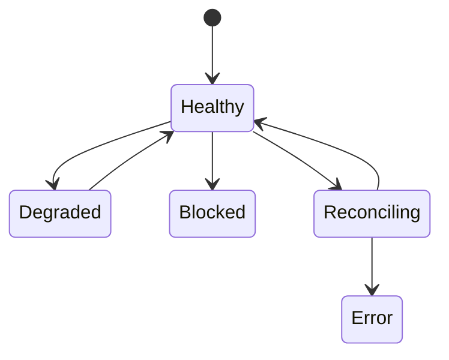
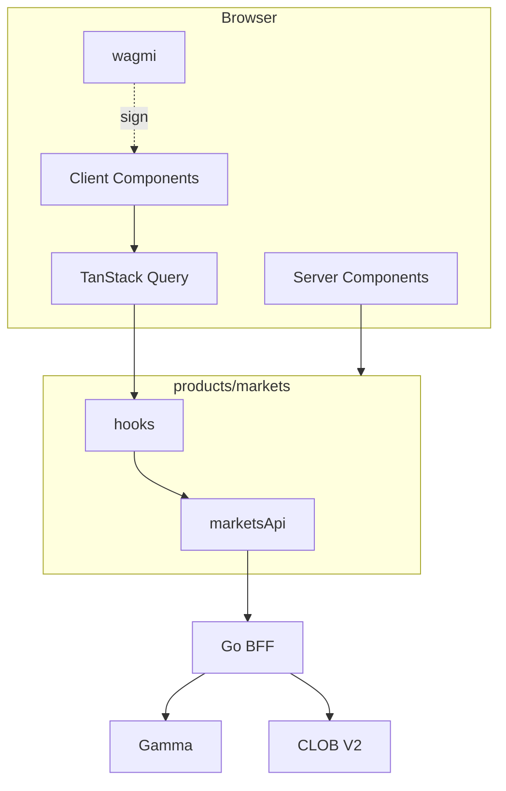

# ERROR DEGRADED AND RECOVERY UX

**Status:** reviewed
**Owner:** platform-orchestrator
**Last updated:** 2026-07-25
**Product:** RetroPick Markets V1
**Wave:** 4 — Web architecture and UX

## Description

This document is the canonical web error, degraded, and recovery UX spec for RetroPick Markets V1. It maps master-prompt journeys—eligibility, discovery, wallet, funding, orders, portfolio, resolution, redeem, withdraw, wrong chain, stale book, outages, geoblock, relayer, and unknown state—to loading / ready / degraded / blocked / unknown screen states.

It sits in Wave 4 as the failure-surface companion to architecture and market/wallet/portfolio UX. Shared components include degraded banners, API errors, eligibility gates, reconnecting overlays, and unknown-order panels. Backend failure-domain semantics remain in architecture docs; this file owns what the user sees and which single recovery action is primary.

Read this whenever a Markets screen handles BFF, WebSocket, or wallet failure, before claiming a journey done, and when backend error codes change. Prefer MARKET, WALLET, and PORTFOLIO UX docs for happy-path composition.

It excludes Android-specific chrome (parity of truth only), inventing fills on timeout, auto-resubmit, and sportsbook-style urgency copy.

## 0. Developer intent (5W+1H)

Short orientation for implementers and agents. Read this before the normative sections below.

| Lens | Answer |
|------|--------|
| **Who** | Web UX implementers mapping journeys J01–J18; QA writing Playwright cases; agents adding error surfaces that must fail closed on ambiguous orders. |
| **What** | Canonical web error, degraded, and recovery UX for all master-prompt §10 journeys: eligibility, discovery, wallet, funding, approvals, orders, portfolio, resolution, redeem, withdraw, wrong chain, stale book, outages, geoblock, relayer, unknown state. |
| **When** | Whenever a Markets screen handles BFF/WS/wallet failure. Before claiming a journey “done.” Cross-check when backend error codes change. |
| **Where** | Spec: this file (screen-state tables per journey). Shared components: degraded banner, API error, eligibility gate, reconnecting overlay, unknown-order panel. Architecture failure domains: [FAILURE_DOMAINS_AND_DEGRADED_MODES.md](../architecture/FAILURE_DOMAINS_AND_DEGRADED_MODES.md). |
| **Why** | Prediction-market clients that invent fills or hide geoblocks harm users. One recovery action per error reduces panic-click double submits. Web and Android should tell the same truth even if chrome differs. |
| **How** | Map each journey to loading / ready / degraded / blocked / unknown. Preserve ticket input on transient errors. Show `requestId` on API failures. WS disconnect → reconnecting, then REST heal. Ambiguous order → Unknown panel + poll—never “filled” guess. |

### Worked example

**Happy path — recoverable API blip on discovery.** Events query fails once → error component with retry; success replaces error; no fabricated markets. User continues to market detail.

**Happy path — order submit then reconcile.** Submit returns accepted; WS drop mid-flight → ReconnectingOverlay; on resume, REST `me/orders` shows open/partial; UI aligns to venue truth.

**Failure / degraded.** J16 unsupported region → EligibilityGate, trading disabled. J14 stale book → banner + submit block. J15 upstream outage → global degraded, read-only where allowed. J18 unknown tx → UnknownOrderPanel until terminal state. Duplicate submit → idempotent replay, same order id. Never toast “success” on timeout.

### Global principles (do not dilute in features)

1. Never fabricate prices or fills.
2. One primary recovery action per error.
3. Preserve ticket input on transient errors.
4. Fail closed on ambiguous order state.
5. Accessible alerts (role/live region).
6. Professional Markets copy—no sportsbook jargon.

### Agent workflow

When implementing a feature, find its J-number table here and implement **every** state column, not only happy path. Add Playwright coverage for blocked and unknown rows. If Android lacks a matching state, file parity gap rather than inventing web-only success.

### Component → journey wiring

| Component | Primary journeys |
|-----------|------------------|
| `EligibilityGate` | J01, J16 |
| `MarketsDegradedBanner` | J14, J15 |
| `ReconnectingOverlay` | J07–J09 realtime |
| `UnknownOrderPanel` | J18 |
| `MarketsApiError` | All BFF failures |

### Recovery priority order

1. Correct dangerous misconception (unknown ≠ filled).
2. Offer one primary action (retry, switch chain, reconnect).
3. Secondary: support/docs with `requestId`.
4. Preserve user inputs whenever safe.

### Agent anti-patterns

- Multiple competing toasts for one failure.
- Auto-resubmit orders.
- Happy-path-only implementation of a J-table.
- High-pressure urgency copy that frames markets as entertainment gaming.

### Success signal

QA can walk J01–J18 using only this doc’s state tables and find matching UI for every non-happy cell.

## 1. Purpose

All 18 master-prompt §10 journeys with screen-state tables.

## 2. Scope

### In scope

- RetroPick Markets web (`apps/web/src/products/markets/`).
- Next.js App Router target; interim Vite + `marketsRoutes.tsx`.
- TanStack Query, wagmi wallet connector, OpenAPI codegen.

### Out of scope

Current Markets V1 authority: `.harness/products/markets-v1/governance/AGENT_OPERATING_CONTRACT.md`.
- Android ([android/](../android/)).

## 3. Prerequisites

- [00_DOCUMENT_MAP.md](../00_DOCUMENT_MAP.md)
- [WEB_APPLICATION_ARCHITECTURE.md](./WEB_APPLICATION_ARCHITECTURE.md)
- [backend/API_AND_REALTIME_CONTRACTS.md](../backend/API_AND_REALTIME_CONTRACTS.md)
- [schemas/openapi/markets-v1.yaml](../../../schemas/openapi/markets-v1.yaml)
- Reference code: `MarketsHomePage.tsx`, `marketsRoutes.tsx`, `api/marketsApi.ts`, `hooks/useMarketsPlatform.ts`

## 4. Authoritative sources

| Source | Location | Confidence |
|--------|----------|------------|
| OpenAPI | `schemas/openapi/markets-v1.yaml` | verified |
| Polymarket docs | https://docs.polymarket.com/ | partially verified |
| Wallet ADR | [ADR-003](../architecture/adr/ADR-003-WALLET-AND-SIGNING-MODEL.md) | verified |
| BFF ADR | [ADR-002](../architecture/adr/ADR-002-POLYMARKET-ANTI-CORRUPTION-LAYER.md) | verified |
| Realtime ADR | [ADR-005](../architecture/adr/ADR-005-REALTIME-AND-RECONCILIATION.md) | verified |
| Failure domains | [FAILURE_DOMAINS_AND_DEGRADED_MODES.md](../architecture/FAILURE_DOMAINS_AND_DEGRADED_MODES.md) | reviewed |
| Order lifecycle | [polymarket/ORDER_LIFECYCLE.md](../polymarket/ORDER_LIFECYCLE.md) | reviewed |
| Market data | [polymarket/MARKET_DATA_AND_REALTIME.md](../polymarket/MARKET_DATA_AND_REALTIME.md) | reviewed |
| Positions | [polymarket/POSITIONS_CTF_AND_REDEMPTION.md](../polymarket/POSITIONS_CTF_AND_REDEMPTION.md) | reviewed |
| Funding | [polymarket/FUNDS_DEPOSIT_AND_WITHDRAWAL.md](../polymarket/FUNDS_DEPOSIT_AND_WITHDRAWAL.md) | reviewed |

## 5. Current state

`MarketsHomePage` generic BFF error only.

## 6. Target design

### 6.1 Global UX principles

1. Never fabricate prices.
2. One primary recovery action per error.
3. Preserve ticket input on transient errors.
4. Fail closed on ambiguous order state.
5. Accessible alerts.

### 6.2 Global components

| Component | Role |
|-----------|------|
| MarketsDegradedBanner | stale/outage |
| MarketsApiError | BFF errors + request id |
| EligibilityGate | region block |
| ReconnectingOverlay | WS disconnect |
| UnknownOrderPanel | J18 |

### 6.3 Journey specifications (master prompt §10)

### J01: First visit and eligibility

**Trigger:** Organic /markets landing
**Routes:** `/markets`
**Data:** eligibility, capabilities

| State | User-visible | Auto action | Data |
|-------|--------------|-------------|------|
| loading | Skeleton; CTAs disabled | Timeout 10s → error | `eligibility, capabilities` |
| empty | Illustration + CTA | None | `eligibility, capabilities` |
| success | Interactive content | Enable next step | `eligibility, capabilities` |
| error | Alert + retry | Log error_code | `eligibility, capabilities` |
| degraded | Stale banner | Poll fallback | `eligibility, capabilities` |
| blocked | Restriction message | Disable trade CTAs | `eligibility, capabilities` |

**Analytics:** `markets_journey_step` / `J01`. **Test:** `e2e-j01`.

### J02: Discovery and search

**Trigger:** Browse or search
**Routes:** `/markets, /markets/search`
**Data:** events

| State | User-visible | Auto action | Data |
|-------|--------------|-------------|------|
| loading | Skeleton; CTAs disabled | Timeout 10s → error | `events` |
| empty | Illustration + CTA | None | `events` |
| success | Interactive content | Enable next step | `events` |
| error | Alert + retry | Log error_code | `events` |
| degraded | Stale banner | Poll fallback | `events` |
| blocked | Restriction message | Disable trade CTAs | `events` |

**Analytics:** `markets_journey_step` / `J02`. **Test:** `e2e-j02`.

### J03: Market and rules review

**Trigger:** Read rules
**Routes:** `/markets/events/[id], /markets/m/[id]`
**Data:** event, market

| State | User-visible | Auto action | Data |
|-------|--------------|-------------|------|
| loading | Skeleton; CTAs disabled | Timeout 10s → error | `event, market` |
| empty | Illustration + CTA | None | `event, market` |
| success | Interactive content | Enable next step | `event, market` |
| error | Alert + retry | Log error_code | `event, market` |
| degraded | Stale banner | Poll fallback | `event, market` |
| blocked | Restriction message | Disable trade CTAs | `event, market` |

**Analytics:** `markets_journey_step` / `J03`. **Test:** `e2e-j03`.

### J04: Wallet connect and account-wallet

**Trigger:** Connect EOA
**Routes:** `/markets/wallet`
**Data:** wagmi, /me/wallets

| State | User-visible | Auto action | Data |
|-------|--------------|-------------|------|
| loading | Skeleton; CTAs disabled | Timeout 10s → error | `wagmi, /me/wallets` |
| empty | Illustration + CTA | None | `wagmi, /me/wallets` |
| success | Interactive content | Enable next step | `wagmi, /me/wallets` |
| error | Alert + retry | Log error_code | `wagmi, /me/wallets` |
| degraded | Stale banner | Poll fallback | `wagmi, /me/wallets` |
| blocked | Restriction message | Disable trade CTAs | `wagmi, /me/wallets` |

**Analytics:** `markets_journey_step` / `J04`. **Test:** `e2e-j04`.

### J05: Funding and deposit

**Trigger:** Deposit USDC
**Routes:** `/markets/funding`
**Data:** funding quote

| State | User-visible | Auto action | Data |
|-------|--------------|-------------|------|
| loading | Skeleton; CTAs disabled | Timeout 10s → error | `funding quote` |
| empty | Illustration + CTA | None | `funding quote` |
| success | Interactive content | Enable next step | `funding quote` |
| error | Alert + retry | Log error_code | `funding quote` |
| degraded | Stale banner | Poll fallback | `funding quote` |
| blocked | Restriction message | Disable trade CTAs | `funding quote` |

**Analytics:** `markets_journey_step` / `J05`. **Test:** `e2e-j05`.

### J06: Approvals

**Trigger:** Token allowance
**Routes:** `/markets/wallet`
**Data:** approval preview

| State | User-visible | Auto action | Data |
|-------|--------------|-------------|------|
| loading | Skeleton; CTAs disabled | Timeout 10s → error | `approval preview` |
| empty | Illustration + CTA | None | `approval preview` |
| success | Interactive content | Enable next step | `approval preview` |
| error | Alert + retry | Log error_code | `approval preview` |
| degraded | Stale banner | Poll fallback | `approval preview` |
| blocked | Restriction message | Disable trade CTAs | `approval preview` |

**Analytics:** `markets_journey_step` / `J06`. **Test:** `e2e-j06`.

### J07: Order preview, sign, submit

**Trigger:** Limit order
**Routes:** `/markets/m/[id]`
**Data:** preview, submit

| State | User-visible | Auto action | Data |
|-------|--------------|-------------|------|
| loading | Skeleton; CTAs disabled | Timeout 10s → error | `preview, submit` |
| empty | Illustration + CTA | None | `preview, submit` |
| success | Interactive content | Enable next step | `preview, submit` |
| error | Alert + retry | Log error_code | `preview, submit` |
| degraded | Stale banner | Poll fallback | `preview, submit` |
| blocked | Restriction message | Disable trade CTAs | `preview, submit` |

**Analytics:** `markets_journey_step` / `J07`. **Test:** `e2e-j07`.

### J08: Partial fills and cancel

**Trigger:** Open orders
**Routes:** `/markets/orders`
**Data:** orders, cancel

| State | User-visible | Auto action | Data |
|-------|--------------|-------------|------|
| loading | Skeleton; CTAs disabled | Timeout 10s → error | `orders, cancel` |
| empty | Illustration + CTA | None | `orders, cancel` |
| success | Interactive content | Enable next step | `orders, cancel` |
| error | Alert + retry | Log error_code | `orders, cancel` |
| degraded | Stale banner | Poll fallback | `orders, cancel` |
| blocked | Restriction message | Disable trade CTAs | `orders, cancel` |

**Analytics:** `markets_journey_step` / `J08`. **Test:** `e2e-j08`.

### J09: Portfolio and activity

**Trigger:** Positions
**Routes:** `/markets/portfolio`
**Data:** positions, activity

| State | User-visible | Auto action | Data |
|-------|--------------|-------------|------|
| loading | Skeleton; CTAs disabled | Timeout 10s → error | `positions, activity` |
| empty | Illustration + CTA | None | `positions, activity` |
| success | Interactive content | Enable next step | `positions, activity` |
| error | Alert + retry | Log error_code | `positions, activity` |
| degraded | Stale banner | Poll fallback | `positions, activity` |
| blocked | Restriction message | Disable trade CTAs | `positions, activity` |

**Analytics:** `markets_journey_step` / `J09`. **Test:** `e2e-j09`.

### J10: Market resolution

**Trigger:** Resolved UI
**Routes:** `/markets/m/[id]`
**Data:** resolution

| State | User-visible | Auto action | Data |
|-------|--------------|-------------|------|
| loading | Skeleton; CTAs disabled | Timeout 10s → error | `resolution` |
| empty | Illustration + CTA | None | `resolution` |
| success | Interactive content | Enable next step | `resolution` |
| error | Alert + retry | Log error_code | `resolution` |
| degraded | Stale banner | Poll fallback | `resolution` |
| blocked | Restriction message | Disable trade CTAs | `resolution` |

**Analytics:** `markets_journey_step` / `J10`. **Test:** `e2e-j10`.

### J11: Redeem

**Trigger:** Claim winnings
**Routes:** `/markets/redeem`
**Data:** redeem preview

| State | User-visible | Auto action | Data |
|-------|--------------|-------------|------|
| loading | Skeleton; CTAs disabled | Timeout 10s → error | `redeem preview` |
| empty | Illustration + CTA | None | `redeem preview` |
| success | Interactive content | Enable next step | `redeem preview` |
| error | Alert + retry | Log error_code | `redeem preview` |
| degraded | Stale banner | Poll fallback | `redeem preview` |
| blocked | Restriction message | Disable trade CTAs | `redeem preview` |

**Analytics:** `markets_journey_step` / `J11`. **Test:** `e2e-j11`.

### J12: Withdraw

**Trigger:** Withdraw USDC
**Routes:** `/markets/funding/withdraw`
**Data:** withdraw

| State | User-visible | Auto action | Data |
|-------|--------------|-------------|------|
| loading | Skeleton; CTAs disabled | Timeout 10s → error | `withdraw` |
| empty | Illustration + CTA | None | `withdraw` |
| success | Interactive content | Enable next step | `withdraw` |
| error | Alert + retry | Log error_code | `withdraw` |
| degraded | Stale banner | Poll fallback | `withdraw` |
| blocked | Restriction message | Disable trade CTAs | `withdraw` |

**Analytics:** `markets_journey_step` / `J12`. **Test:** `e2e-j12`.

### J13: Wrong chain or token

**Trigger:** Wrong network
**Routes:** `global`
**Data:** chainId

| State | User-visible | Auto action | Data |
|-------|--------------|-------------|------|
| loading | Skeleton; CTAs disabled | Timeout 10s → error | `chainId` |
| empty | Illustration + CTA | None | `chainId` |
| success | Interactive content | Enable next step | `chainId` |
| error | Alert + retry | Log error_code | `chainId` |
| degraded | Stale banner | Poll fallback | `chainId` |
| blocked | Restriction message | Disable trade CTAs | `chainId` |

**Analytics:** `markets_journey_step` / `J13`. **Test:** `e2e-j13`.

### J14: Stale order book

**Trigger:** Book age high
**Routes:** `/markets/m/[id]`
**Data:** book WS

| State | User-visible | Auto action | Data |
|-------|--------------|-------------|------|
| loading | Skeleton; CTAs disabled | Timeout 10s → error | `book WS` |
| empty | Illustration + CTA | None | `book WS` |
| success | Interactive content | Enable next step | `book WS` |
| error | Alert + retry | Log error_code | `book WS` |
| degraded | Stale banner | Poll fallback | `book WS` |
| blocked | Restriction message | Disable trade CTAs | `book WS` |

**Analytics:** `markets_journey_step` / `J14`. **Test:** `e2e-j14`.

### J15: Upstream outage

**Trigger:** BFF/upstream 5xx
**Routes:** `global`
**Data:** capabilities

| State | User-visible | Auto action | Data |
|-------|--------------|-------------|------|
| loading | Skeleton; CTAs disabled | Timeout 10s → error | `capabilities` |
| empty | Illustration + CTA | None | `capabilities` |
| success | Interactive content | Enable next step | `capabilities` |
| error | Alert + retry | Log error_code | `capabilities` |
| degraded | Stale banner | Poll fallback | `capabilities` |
| blocked | Restriction message | Disable trade CTAs | `capabilities` |

**Analytics:** `markets_journey_step` / `J15`. **Test:** `e2e-j15`.

### J16: Unsupported region

**Trigger:** eligible: false
**Routes:** `/markets/ineligible`
**Data:** eligibility

| State | User-visible | Auto action | Data |
|-------|--------------|-------------|------|
| loading | Skeleton; CTAs disabled | Timeout 10s → error | `eligibility` |
| empty | Illustration + CTA | None | `eligibility` |
| success | Interactive content | Enable next step | `eligibility` |
| error | Alert + retry | Log error_code | `eligibility` |
| degraded | Stale banner | Poll fallback | `eligibility` |
| blocked | Restriction message | Disable trade CTAs | `eligibility` |

**Analytics:** `markets_journey_step` / `J16`. **Test:** `e2e-j16`.

### J17: Relayer unavailable

**Trigger:** Relayer 503
**Routes:** `modals`
**Data:** relayer

| State | User-visible | Auto action | Data |
|-------|--------------|-------------|------|
| loading | Skeleton; CTAs disabled | Timeout 10s → error | `relayer` |
| empty | Illustration + CTA | None | `relayer` |
| success | Interactive content | Enable next step | `relayer` |
| error | Alert + retry | Log error_code | `relayer` |
| degraded | Stale banner | Poll fallback | `relayer` |
| blocked | Restriction message | Disable trade CTAs | `relayer` |

**Analytics:** `markets_journey_step` / `J17`. **Test:** `e2e-j17`.

### J18: Unknown tx/order state

**Trigger:** Submit timeout
**Routes:** `/markets/orders`
**Data:** reconcile

| State | User-visible | Auto action | Data |
|-------|--------------|-------------|------|
| loading | Skeleton; CTAs disabled | Timeout 10s → error | `reconcile` |
| empty | Illustration + CTA | None | `reconcile` |
| success | Interactive content | Enable next step | `reconcile` |
| error | Alert + retry | Log error_code | `reconcile` |
| degraded | Stale banner | Poll fallback | `reconcile` |
| blocked | Restriction message | Disable trade CTAs | `reconcile` |

**Analytics:** `markets_journey_step` / `J18`. **Test:** `e2e-j18`.

### 6.4 Failure matrix

| Failure | Detection | User state | Auto action | Retry safe |
|---------|-----------|------------|-------------|------------|
| Upstream 5xx | 502 | Degraded banner | Poll capabilities | Read yes |
| 429 | rate limit | Toast | Backoff | Yes |
| Stale book | age>5s | Warning | Snapshot | Yes |
| WS gap | seq | Reconnecting | REST book | Yes |
| Wallet reject | wagmi | Modal | None | User |
| Wrong chain | chainId | Switch CTA | None | After switch |
| Preview expired | 409 | Regenerate | Clear sig | Yes |
| Submit timeout | 30s | Unknown panel | Poll order | No resubmit |
| Relayer down | 503 | EOA path | None | User |

### 6.5 Recovery state machine

## 7. Alternatives considered

| Alternative | Rejected because |
|-------------|------------------|
| Browser → Gamma/CLOB direct | ADR-002: ACL, secrets, degraded cache |
| Polymarket pixel clone | ADR-007: trademark, clean-room |
| Server-side order signing | ADR-003: non-custodial |
| `number` for USDC | 6-decimal precision loss |

## 8. Decisions

- BFF-only production API ([ADR-002](../architecture/adr/ADR-002-POLYMARKET-ANTI-CORRUPTION-LAYER.md)).
- Preview `contentHash` before sign ([ADR-003](../architecture/adr/ADR-003-WALLET-AND-SIGNING-MODEL.md)).
- OpenAPI parity with Android ([ADR-004](../architecture/adr/ADR-004-SHARED-WEB-ANDROID-API.md)).
- WS + REST book fallback ([ADR-005](../architecture/adr/ADR-005-REALTIME-AND-RECONCILIATION.md)).

## 9. Data and control flows

## 10. Failure and recovery

- Fail closed on unknown eligibility.
- `stale: true` degraded banners with timestamp.
- `capabilities.trading: false` disables ticket.
- No silent order resubmission — reconcile first (J18).
- See [ERROR_DEGRADED_AND_RECOVERY_UX.md](./ERROR_DEGRADED_AND_RECOVERY_UX.md).

## 11. Security

- No private-key custody ([security/SIGNING_AND_TRANSACTION_INTEGRITY.md](../security/SIGNING_AND_TRANSACTION_INTEGRITY.md)).
- CSP on deploy; DOMPurify for rules HTML.
- Analytics redact wallet addresses.

## 12. Observability

- RUM: LCP, INP, CLS on market and ticket pages.
- Events: `markets_journey_step`, `markets_error`, `markets_degraded`.
- `x-request-id` on error surfaces.

## 13. Test strategy

- [WEB_TEST_STRATEGY.md](./WEB_TEST_STRATEGY.md)
- [testing/MASTER_TEST_PLAN.md](../testing/MASTER_TEST_PLAN.md)

## 14. Rollout and rollback

- `NEXT_PUBLIC_PRODUCT=markets` ([deploy/web-markets/.env.example](../../../deploy/web-markets/.env.example)).
- [platform/RELEASE_ROLLBACK_AND_CHANGE_MANAGEMENT.md](../platform/RELEASE_ROLLBACK_AND_CHANGE_MANAGEMENT.md)

## 15. Open questions

- [research/OPEN_QUESTIONS_AND_EXPIRING_ASSUMPTIONS.md](../research/OPEN_QUESTIONS_AND_EXPIRING_ASSUMPTIONS.md)

## 16. Acceptance criteria

- [../../../.harness/products/markets-v1/planning/REQUIREMENTS_TO_TASK_TRACEABILITY.md](../../../.harness/products/markets-v1/planning/REQUIREMENTS_TO_TASK_TRACEABILITY.md)
- 18 master-prompt §10 journeys in ERROR doc with screen-state tables.

## 17. Screen reader registry

| ERR_BFF | Cannot reach API |
| ERR_INELIGIBLE | Region block |
| ERR_STALE_BOOK | Book outdated |
| ERR_UNKNOWN_ORDER | Checking exchange |

## 18. Cross-links

[FAILURE_DOMAINS_AND_DEGRADED_MODES.md](../architecture/FAILURE_DOMAINS_AND_DEGRADED_MODES.md)

## Appendix A — OpenAPI to hook mapping

| operationId | Method | Path | Hook | Phase |
|-------------|--------|------|------|-------|
| getMarketsEligibility | GET | /markets/eligibility | useMarketsEligibility | 1 |
| getMarketsCapabilities | GET | /markets/capabilities | useMarketsCapabilities | 1 |
| listMarketsEvents | GET | /markets/events | useMarketsEvents | 1 |
| getMarketsEvent | GET | /markets/events/{eventId} | useMarketsEvent | 1 |
| getMarketsMarket | GET | /markets/markets/{marketId} | useMarketsMarket | 1 |
| getMarketsOrderBook | GET | /markets/markets/{marketId}/book | useMarketsOrderBook | 1 |
| getMarketsPriceHistory | GET | /markets/markets/{marketId}/history | useMarketsHistory | 1 |
| postMarketsOrderPreview | POST | /markets/orders/preview | useOrderPreview | 3 |
| postMarketsOrderSubmit | POST | /markets/orders | useOrderSubmit | 3 |
| deleteMarketsOrder | DELETE | /markets/orders/{orderId} | useOrderCancel | 3 |
| listMarketsOrders | GET | /markets/me/orders | useOpenOrders | 3 |
| listMarketsPositions | GET | /markets/me/positions | usePositions | 4 |
| listMarketsActivity | GET | /markets/me/activity | useActivity | 4 |
| getMarketsWallets | GET | /markets/me/wallets | useTradingWallets | 2 |
| postMarketsFundingQuote | POST | /markets/funding/quote | useFundingQuote | 2 |
| postMarketsWithdraw | POST | /markets/funding/withdraw | useWithdraw | 4 |
| postMarketsRedeemPreview | POST | /markets/redeem/preview | useRedeemPreview | 4 |

## Appendix B — Component inventory

| Component | Feature | Responsibility |
|-----------|---------|----------------|
| MarketsShell | layout | Nav, eligibility banner |
| DiscoverGrid | catalog | Event cards |
| MarketBook | trading | Bid/ask ladder |
| OrderTicket | trading | Limit order form |
| PreviewModal | wallet | Sign preview + hash |
| PortfolioTable | portfolio | Positions |
| FundingWizard | funding | Deposit flow |
| DegradedBanner | shared | Stale/outage |
| ChainGuard | wallet | Polygon 137 |
| UnknownOrderPanel | trading | J18 reconcile |

## Appendix C — Web phase gates

| Phase | Deliverable |
|-------|-------------|
| PHASE-1 | MarketsHomePage, events, eligibility |
| PHASE-2 | Wallet connect, SIWE, funding |
| PHASE-3 | Book WS, ticket, orders |
| PHASE-4 | Portfolio, redeem, withdraw |
| PHASE-6 | Next.js migration, E2E suite |
