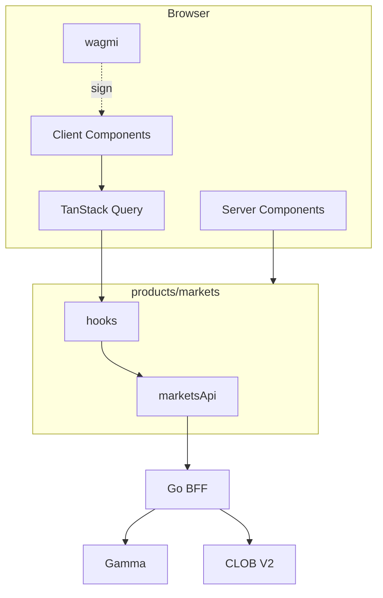

# PORTFOLIO FUNDING AND REDEMPTION UX

**Status:** reviewed
**Owner:** platform-orchestrator
**Last updated:** 2026-07-25
**Product:** RetroPick Markets V1
**Wave:** 4 — Web architecture and UX

## Description

This document is the portfolio, funding, redeem, and withdraw UX authority for RetroPick Markets V1 web. It covers positions and PnL summary, deposit quote and track (J05), claimable redeem (J11), withdraw preview (J12), indexer-lag honesty, empty states, and receipt patterns driven by BFF operation ids.

It sits in Wave 4 after a wallet session exists, with routes under portfolio, funding, and redeem, and OpenAPI funding/positions operations. Domain detail for Polymarket funding and positions lives in sibling product docs; this file owns screen composition, money display helpers, and async tracking UX. Android portfolio and funding must consume the same status enums and operation ids.

Read this for PHASE-2 funding UI and PHASE-4 portfolio/redeem work, or when BFF funding or position projections change. Prefer WALLET_AND_TRANSACTION_UX for signing and ERROR_DEGRADED_AND_RECOVERY_UX for unknown or blocked states.

It excludes optimistic balance credits before track confirmation, browser-side PnL that disagrees with the BFF, hiding fees until after sign, and celebratory payout hype on redeem.

## 0. Developer intent (5W+1H)

Short orientation for implementers and agents. Read this before the normative sections below.

| Lens | Answer |
|------|--------|
| **Who** | `fe-markets` building portfolio, activity, deposit, withdraw, and redeem journeys; agents wiring funding track IDs; parity reviewers vs Android portfolio tab. |
| **What** | Positions table + PnL summary, deposit quote/track (J05), redeem claimable flow (J11), withdraw preview (J12), indexer-lag honesty, empty states, receipt patterns. |
| **When** | PHASE-2 funding UI and PHASE-4 portfolio/redeem emphasis (see route phase map). After wallet session exists. When BFF funding or position projections change. |
| **Where** | Spec: this file. Routes: `/markets/portfolio`, `/markets/funding`, redeem route. APIs: positions, funding quote/track, withdrawals, redemption previews per OpenAPI. Domain detail: polymarket funding/positions docs. |
| **Why** | Users need trustworthy balances and claimable state. Optimistic PnL or hidden fees destroy trust. Funding is async—UI must track operations, not assume instant credit. |
| **How** | Render `Money` / `DecimalString` via helpers. Portfolio from BFF projections + optional `user.positions` WS. Deposit: method → quote → show addresses/instructions → poll/track `fundingOperationId`. Redeem/withdraw: preview → sign if needed → track. Label indexer lag; never show claimable without BFF say-so. |

### Worked example

**Happy path — funded trader checks portfolio.** User opens Portfolio: summary value + PnL, positions rows (market, side, size, avg, mark, PnL). Tap row → market detail. Resolved position with claimable → Redeem CTA → preview → sign → success receipt. Activity feed shows fills and funding credits.

**Happy path — deposit.** Funding page: choose method, receive quote, confirm instructions, track operation until credited. UI stays in “processing” with request/operation id; on credit, portfolio balance updates from projection.

**Failure / degraded.** Indexer lag → “updating” / delayed badge, not zeroed positions. Funding stuck → actionable support copy + id; do not double-create quotes carelessly—respect idempotency. Withdraw to invalid address → client+BFF validation errors before sign. Redeem when not claimable → disabled CTA with reason. Empty portfolio → Discover CTA, not fake demo positions.

### Money & copy rules

- PnL sign and color with text equivalent (accessible).
- Disclose fees from BFF preview, not hardcoded UI constants.
- Prefer “deposit / withdraw / redeem / positions / claimable” language.
- For resolved markets, use resolution and redeem—not entertainment-gaming metaphors.

### Parity

Android portfolio and funding screens must consume the same operation ids and status enums. If web introduces a receipt field, extend OpenAPI first.

### Operation tracking UI

| Operation | User-visible id | Terminal cues |
|-----------|-----------------|---------------|
| Deposit / funding | `fundingOperationId` | Credited / failed / expired |
| Withdraw | withdraw id | Confirmed / failed |
| Redeem | redemption / tx track | Claimed / failed / unknown |

### PnL display rules

- Use BFF-provided mark and cost basis fields.
- Show currency + decimals consistently with `Money`.
- Unknown mark → “—” + lag explanation, not `0`.

### Agent anti-patterns

- Optimistic balance credit before track confirms.
- Hiding fees until after sign.
- Celebratory payout hype on redeem.
- Portfolio math in the browser that disagrees with BFF.

### Success signal

User can deposit, see processing with an id, then observe portfolio update from projections without refreshing into invented numbers.

## 1. Purpose

Positions, PnL, deposit, redeem, withdraw journeys.

## 2. Scope

### In scope

- RetroPick Markets web (`apps/web/src/products/markets/`).
- Next.js App Router target; interim Vite + `marketsRoutes.tsx`.
- TanStack Query, wagmi wallet connector, OpenAPI codegen.

### Out of scope

- PRISM (`products/prism/`), legacy epoch (`products/legacy/`), custom exchange ([ADR-001](../architecture/adr/ADR-001-MARKETS-HAS-NO-CUSTOM-EXCHANGE.md)).
- Android ([android/](../android/)).

## 3. Prerequisites

- [00_DOCUMENT_MAP.md](../00_DOCUMENT_MAP.md)
- [WEB_APPLICATION_ARCHITECTURE.md](./WEB_APPLICATION_ARCHITECTURE.md)
- [backend/API_AND_REALTIME_CONTRACTS.md](../backend/API_AND_REALTIME_CONTRACTS.md)
- [schemas/openapi/markets-v1.yaml](../../../schemas/openapi/markets-v1.yaml)
- Reference code: `MarketsHomePage.tsx`, `marketsRoutes.tsx`, `api/marketsApi.ts`, `hooks/useMarketsPlatform.ts`

## 4. Authoritative sources

| Source | Location | Confidence |
|--------|----------|------------|
| OpenAPI | `schemas/openapi/markets-v1.yaml` | verified |
| Polymarket docs | https://docs.polymarket.com/ | partially verified |
| Wallet ADR | [ADR-003](../architecture/adr/ADR-003-WALLET-AND-SIGNING-MODEL.md) | verified |
| BFF ADR | [ADR-002](../architecture/adr/ADR-002-POLYMARKET-ANTI-CORRUPTION-LAYER.md) | verified |
| Realtime ADR | [ADR-005](../architecture/adr/ADR-005-REALTIME-AND-RECONCILIATION.md) | verified |
| Failure domains | [FAILURE_DOMAINS_AND_DEGRADED_MODES.md](../architecture/FAILURE_DOMAINS_AND_DEGRADED_MODES.md) | reviewed |
| Order lifecycle | [polymarket/ORDER_LIFECYCLE.md](../polymarket/ORDER_LIFECYCLE.md) | reviewed |
| Market data | [polymarket/MARKET_DATA_AND_REALTIME.md](../polymarket/MARKET_DATA_AND_REALTIME.md) | reviewed |
| Positions | [polymarket/POSITIONS_CTF_AND_REDEMPTION.md](../polymarket/POSITIONS_CTF_AND_REDEMPTION.md) | reviewed |
| Funding | [polymarket/FUNDS_DEPOSIT_AND_WITHDRAWAL.md](../polymarket/FUNDS_DEPOSIT_AND_WITHDRAWAL.md) | reviewed |

## 5. Current state

No portfolio or funding UI.

## 6. Target design

### 6.1 Portfolio

Summary (value, PnL) + positions table + activity feed. `DecimalString` PnL math.

### 6.2 Position row

Market, side, size, avg, mark, PnL → click opens market. Resolved → redeem CTA.

### 6.3 Deposit (J05)

Method select → quote → preview addresses → track `fundingOperationId`.

### 6.4 Redeem (J11)

Claimable filter → preview → sign (batch if multiple).

### 6.5 Withdraw (J12)

Address validation → preview fee → track confirmation.

### 6.6 Indexer lag

"Portfolio syncing" banner with `lastUpdated`.

### 6.7 Empty portfolio

CTA to Discover.

### 6.8 PnL display

Color + icon + text label; `—` if mark missing.

## 7. Alternatives considered

| Alternative | Rejected because |
|-------------|------------------|
| Browser → Gamma/CLOB direct | ADR-002: ACL, secrets, degraded cache |
| Polymarket pixel clone | ADR-007: trademark, clean-room |
| Server-side order signing | ADR-003: non-custodial |
| `number` for USDC | 6-decimal precision loss |

## 8. Decisions

- BFF-only production API ([ADR-002](../architecture/adr/ADR-002-POLYMARKET-ANTI-CORRUPTION-LAYER.md)).
- Preview `contentHash` before sign ([ADR-003](../architecture/adr/ADR-003-WALLET-AND-SIGNING-MODEL.md)).
- OpenAPI parity with Android ([ADR-004](../architecture/adr/ADR-004-SHARED-WEB-ANDROID-API.md)).
- WS + REST book fallback ([ADR-005](../architecture/adr/ADR-005-REALTIME-AND-RECONCILIATION.md)).

## 9. Data and control flows

## 10. Failure and recovery

- Fail closed on unknown eligibility.
- `stale: true` degraded banners with timestamp.
- `capabilities.trading: false` disables ticket.
- No silent order resubmission — reconcile first (J18).
- See [ERROR_DEGRADED_AND_RECOVERY_UX.md](./ERROR_DEGRADED_AND_RECOVERY_UX.md).

## 11. Security

- No private-key custody ([security/SIGNING_AND_TRANSACTION_INTEGRITY.md](../security/SIGNING_AND_TRANSACTION_INTEGRITY.md)).
- CSP on deploy; DOMPurify for rules HTML.
- Analytics redact wallet addresses.

## 12. Observability

- RUM: LCP, INP, CLS on market and ticket pages.
- Events: `markets_journey_step`, `markets_error`, `markets_degraded`.
- `x-request-id` on error surfaces.

## 13. Test strategy

- [WEB_TEST_STRATEGY.md](./WEB_TEST_STRATEGY.md)
- [testing/MASTER_TEST_PLAN.md](../testing/MASTER_TEST_PLAN.md)

## 14. Rollout and rollback

- `NEXT_PUBLIC_PRODUCT=markets` ([deploy/web-markets/.env.example](../../../deploy/web-markets/.env.example)).
- [platform/RELEASE_ROLLBACK_AND_CHANGE_MANAGEMENT.md](../platform/RELEASE_ROLLBACK_AND_CHANGE_MANAGEMENT.md)

## 15. Open questions

- [research/OPEN_QUESTIONS_AND_EXPIRING_ASSUMPTIONS.md](../research/OPEN_QUESTIONS_AND_EXPIRING_ASSUMPTIONS.md)

## 16. Acceptance criteria

- [agent-harness/REQUIREMENTS_TO_TASK_TRACEABILITY.md](../agent-harness/REQUIREMENTS_TO_TASK_TRACEABILITY.md)
- 18 master-prompt §10 journeys in ERROR doc with screen-state tables.

## 17. Funding disclosure

Third-party on-ramp disclosure per legal.

## 18. Receipts

Link activity rows to Polygonscan tx.

## Appendix A — OpenAPI to hook mapping

| operationId | Method | Path | Hook | Phase |
|-------------|--------|------|------|-------|
| getMarketsEligibility | GET | /markets/eligibility | useMarketsEligibility | 1 |
| getMarketsCapabilities | GET | /markets/capabilities | useMarketsCapabilities | 1 |
| listMarketsEvents | GET | /markets/events | useMarketsEvents | 1 |
| getMarketsEvent | GET | /markets/events/{eventId} | useMarketsEvent | 1 |
| getMarketsMarket | GET | /markets/markets/{marketId} | useMarketsMarket | 1 |
| getMarketsOrderBook | GET | /markets/markets/{marketId}/book | useMarketsOrderBook | 1 |
| getMarketsPriceHistory | GET | /markets/markets/{marketId}/history | useMarketsHistory | 1 |
| postMarketsOrderPreview | POST | /markets/orders/preview | useOrderPreview | 3 |
| postMarketsOrderSubmit | POST | /markets/orders | useOrderSubmit | 3 |
| deleteMarketsOrder | DELETE | /markets/orders/{orderId} | useOrderCancel | 3 |
| listMarketsOrders | GET | /markets/me/orders | useOpenOrders | 3 |
| listMarketsPositions | GET | /markets/me/positions | usePositions | 4 |
| listMarketsActivity | GET | /markets/me/activity | useActivity | 4 |
| getMarketsWallets | GET | /markets/me/wallets | useTradingWallets | 2 |
| postMarketsFundingQuote | POST | /markets/funding/quote | useFundingQuote | 2 |
| postMarketsWithdraw | POST | /markets/funding/withdraw | useWithdraw | 4 |
| postMarketsRedeemPreview | POST | /markets/redeem/preview | useRedeemPreview | 4 |

## Appendix B — Component inventory

| Component | Feature | Responsibility |
|-----------|---------|----------------|
| MarketsShell | layout | Nav, eligibility banner |
| DiscoverGrid | catalog | Event cards |
| MarketBook | trading | Bid/ask ladder |
| OrderTicket | trading | Limit order form |
| PreviewModal | wallet | Sign preview + hash |
| PortfolioTable | portfolio | Positions |
| FundingWizard | funding | Deposit flow |
| DegradedBanner | shared | Stale/outage |
| ChainGuard | wallet | Polygon 137 |
| UnknownOrderPanel | trading | J18 reconcile |

## Appendix C — Web phase gates

| Phase | Deliverable |
|-------|-------------|
| PHASE-1 | MarketsHomePage, events, eligibility |
| PHASE-2 | Wallet connect, SIWE, funding |
| PHASE-3 | Book WS, ticket, orders |
| PHASE-4 | Portfolio, redeem, withdraw |
| PHASE-6 | Next.js migration, E2E suite |
## Appendix D — Requirements traceability samples

| REQ-ID | Scope | Verification |
|--------|-------|-------------|
| REQ-WEB-P1-00 | PHASE-1 capability | Unit + E2E where applicable |
| REQ-WEB-P1-01 | PHASE-1 capability | Unit + E2E where applicable |
| REQ-WEB-P1-02 | PHASE-1 capability | Unit + E2E where applicable |
| REQ-WEB-P1-03 | PHASE-1 capability | Unit + E2E where applicable |
| REQ-WEB-P1-04 | PHASE-1 capability | Unit + E2E where applicable |
| REQ-WEB-P1-05 | PHASE-1 capability | Unit + E2E where applicable |
| REQ-WEB-P1-06 | PHASE-1 capability | Unit + E2E where applicable |
| REQ-WEB-P1-07 | PHASE-1 capability | Unit + E2E where applicable |
| REQ-WEB-P1-08 | PHASE-1 capability | Unit + E2E where applicable |
| REQ-WEB-P1-09 | PHASE-1 capability | Unit + E2E where applicable |
| REQ-WEB-P1-10 | PHASE-1 capability | Unit + E2E where applicable |
| REQ-WEB-P1-11 | PHASE-1 capability | Unit + E2E where applicable |
| REQ-WEB-P2-00 | PHASE-2 capability | Unit + E2E where applicable |
| REQ-WEB-P2-01 | PHASE-2 capability | Unit + E2E where applicable |
| REQ-WEB-P2-02 | PHASE-2 capability | Unit + E2E where applicable |
| REQ-WEB-P2-03 | PHASE-2 capability | Unit + E2E where applicable |
| REQ-WEB-P2-04 | PHASE-2 capability | Unit + E2E where applicable |
| REQ-WEB-P2-05 | PHASE-2 capability | Unit + E2E where applicable |
| REQ-WEB-P2-06 | PHASE-2 capability | Unit + E2E where applicable |
| REQ-WEB-P2-07 | PHASE-2 capability | Unit + E2E where applicable |
| REQ-WEB-P2-08 | PHASE-2 capability | Unit + E2E where applicable |
| REQ-WEB-P2-09 | PHASE-2 capability | Unit + E2E where applicable |
| REQ-WEB-P2-10 | PHASE-2 capability | Unit + E2E where applicable |
| REQ-WEB-P2-11 | PHASE-2 capability | Unit + E2E where applicable |
| REQ-WEB-P3-00 | PHASE-3 capability | Unit + E2E where applicable |
| REQ-WEB-P3-01 | PHASE-3 capability | Unit + E2E where applicable |
| REQ-WEB-P3-02 | PHASE-3 capability | Unit + E2E where applicable |
| REQ-WEB-P3-03 | PHASE-3 capability | Unit + E2E where applicable |
| REQ-WEB-P3-04 | PHASE-3 capability | Unit + E2E where applicable |
| REQ-WEB-P3-05 | PHASE-3 capability | Unit + E2E where applicable |
| REQ-WEB-P3-06 | PHASE-3 capability | Unit + E2E where applicable |
| REQ-WEB-P3-07 | PHASE-3 capability | Unit + E2E where applicable |
| REQ-WEB-P3-08 | PHASE-3 capability | Unit + E2E where applicable |
| REQ-WEB-P3-09 | PHASE-3 capability | Unit + E2E where applicable |
| REQ-WEB-P3-10 | PHASE-3 capability | Unit + E2E where applicable |
| REQ-WEB-P3-11 | PHASE-3 capability | Unit + E2E where applicable |
| REQ-WEB-P4-00 | PHASE-4 capability | Unit + E2E where applicable |
| REQ-WEB-P4-01 | PHASE-4 capability | Unit + E2E where applicable |
| REQ-WEB-P4-02 | PHASE-4 capability | Unit + E2E where applicable |
| REQ-WEB-P4-03 | PHASE-4 capability | Unit + E2E where applicable |
| REQ-WEB-P4-04 | PHASE-4 capability | Unit + E2E where applicable |
| REQ-WEB-P4-05 | PHASE-4 capability | Unit + E2E where applicable |
| REQ-WEB-P4-06 | PHASE-4 capability | Unit + E2E where applicable |
| REQ-WEB-P4-07 | PHASE-4 capability | Unit + E2E where applicable |
| REQ-WEB-P4-08 | PHASE-4 capability | Unit + E2E where applicable |
| REQ-WEB-P4-09 | PHASE-4 capability | Unit + E2E where applicable |
| REQ-WEB-P4-10 | PHASE-4 capability | Unit + E2E where applicable |
| REQ-WEB-P4-11 | PHASE-4 capability | Unit + E2E where applicable |
| REQ-WEB-P5-00 | PHASE-5 capability | Unit + E2E where applicable |
| REQ-WEB-P5-01 | PHASE-5 capability | Unit + E2E where applicable |
| REQ-WEB-P5-02 | PHASE-5 capability | Unit + E2E where applicable |
| REQ-WEB-P5-03 | PHASE-5 capability | Unit + E2E where applicable |
| REQ-WEB-P5-04 | PHASE-5 capability | Unit + E2E where applicable |
| REQ-WEB-P5-05 | PHASE-5 capability | Unit + E2E where applicable |
| REQ-WEB-P5-06 | PHASE-5 capability | Unit + E2E where applicable |
| REQ-WEB-P5-07 | PHASE-5 capability | Unit + E2E where applicable |
| REQ-WEB-P5-08 | PHASE-5 capability | Unit + E2E where applicable |
| REQ-WEB-P5-09 | PHASE-5 capability | Unit + E2E where applicable |
| REQ-WEB-P5-10 | PHASE-5 capability | Unit + E2E where applicable |
| REQ-WEB-P5-11 | PHASE-5 capability | Unit + E2E where applicable |
| REQ-WEB-P6-00 | PHASE-6 capability | Unit + E2E where applicable |
| REQ-WEB-P6-01 | PHASE-6 capability | Unit + E2E where applicable |
| REQ-WEB-P6-02 | PHASE-6 capability | Unit + E2E where applicable |
| REQ-WEB-P6-03 | PHASE-6 capability | Unit + E2E where applicable |
| REQ-WEB-P6-04 | PHASE-6 capability | Unit + E2E where applicable |
| REQ-WEB-P6-05 | PHASE-6 capability | Unit + E2E where applicable |
| REQ-WEB-P6-06 | PHASE-6 capability | Unit + E2E where applicable |
| REQ-WEB-P6-07 | PHASE-6 capability | Unit + E2E where applicable |
| REQ-WEB-P6-08 | PHASE-6 capability | Unit + E2E where applicable |
| REQ-WEB-P6-09 | PHASE-6 capability | Unit + E2E where applicable |
| REQ-WEB-P6-10 | PHASE-6 capability | Unit + E2E where applicable |
| REQ-WEB-P6-11 | PHASE-6 capability | Unit + E2E where applicable |
| REQ-WEB-P7-00 | PHASE-7 capability | Unit + E2E where applicable |
| REQ-WEB-P7-01 | PHASE-7 capability | Unit + E2E where applicable |
| REQ-WEB-P7-02 | PHASE-7 capability | Unit + E2E where applicable |
| REQ-WEB-P7-03 | PHASE-7 capability | Unit + E2E where applicable |
| REQ-WEB-P7-04 | PHASE-7 capability | Unit + E2E where applicable |
| REQ-WEB-P7-05 | PHASE-7 capability | Unit + E2E where applicable |
| REQ-WEB-P7-06 | PHASE-7 capability | Unit + E2E where applicable |
| REQ-WEB-P7-07 | PHASE-7 capability | Unit + E2E where applicable |
| REQ-WEB-P7-08 | PHASE-7 capability | Unit + E2E where applicable |
| REQ-WEB-P7-09 | PHASE-7 capability | Unit + E2E where applicable |
| REQ-WEB-P7-10 | PHASE-7 capability | Unit + E2E where applicable |
| REQ-WEB-P7-11 | PHASE-7 capability | Unit + E2E where applicable |
| REQ-WEB-P8-00 | PHASE-8 capability | Unit + E2E where applicable |
| REQ-WEB-P8-01 | PHASE-8 capability | Unit + E2E where applicable |
| REQ-WEB-P8-02 | PHASE-8 capability | Unit + E2E where applicable |
| REQ-WEB-P8-03 | PHASE-8 capability | Unit + E2E where applicable |
| REQ-WEB-P8-04 | PHASE-8 capability | Unit + E2E where applicable |
| REQ-WEB-P8-05 | PHASE-8 capability | Unit + E2E where applicable |
| REQ-WEB-P8-06 | PHASE-8 capability | Unit + E2E where applicable |
| REQ-WEB-P8-07 | PHASE-8 capability | Unit + E2E where applicable |
| REQ-WEB-P8-08 | PHASE-8 capability | Unit + E2E where applicable |
| REQ-WEB-P8-09 | PHASE-8 capability | Unit + E2E where applicable |
| REQ-WEB-P8-10 | PHASE-8 capability | Unit + E2E where applicable |
| REQ-WEB-P8-11 | PHASE-8 capability | Unit + E2E where applicable |

| REQ-WEB-EXTRA | Cross-cutting | Manual QA |

| REQ-WEB-EXTRA | Cross-cutting | Manual QA |

| REQ-WEB-EXTRA | Cross-cutting | Manual QA |

| REQ-WEB-EXTRA | Cross-cutting | Manual QA |

| REQ-WEB-EXTRA | Cross-cutting | Manual QA |

| REQ-WEB-EXTRA | Cross-cutting | Manual QA |

| REQ-WEB-EXTRA | Cross-cutting | Manual QA |

| REQ-WEB-EXTRA | Cross-cutting | Manual QA |

| REQ-WEB-EXTRA | Cross-cutting | Manual QA |

| REQ-WEB-EXTRA | Cross-cutting | Manual QA |

| REQ-WEB-EXTRA | Cross-cutting | Manual QA |

| REQ-WEB-EXTRA | Cross-cutting | Manual QA |

| REQ-WEB-EXTRA | Cross-cutting | Manual QA |

| REQ-WEB-EXTRA | Cross-cutting | Manual QA |

| REQ-WEB-EXTRA | Cross-cutting | Manual QA |

| REQ-WEB-EXTRA | Cross-cutting | Manual QA |

| REQ-WEB-EXTRA | Cross-cutting | Manual QA |

| REQ-WEB-EXTRA | Cross-cutting | Manual QA |

| REQ-WEB-EXTRA | Cross-cutting | Manual QA |

| REQ-WEB-EXTRA | Cross-cutting | Manual QA |

| REQ-WEB-EXTRA | Cross-cutting | Manual QA |

| REQ-WEB-EXTRA | Cross-cutting | Manual QA |

| REQ-WEB-EXTRA | Cross-cutting | Manual QA |

| REQ-WEB-EXTRA | Cross-cutting | Manual QA |

| REQ-WEB-EXTRA | Cross-cutting | Manual QA |

| REQ-WEB-EXTRA | Cross-cutting | Manual QA |

| REQ-WEB-EXTRA | Cross-cutting | Manual QA |

| REQ-WEB-EXTRA | Cross-cutting | Manual QA |

| REQ-WEB-EXTRA | Cross-cutting | Manual QA |

| REQ-WEB-EXTRA | Cross-cutting | Manual QA |

| REQ-WEB-EXTRA | Cross-cutting | Manual QA |

| REQ-WEB-EXTRA | Cross-cutting | Manual QA |

| REQ-WEB-EXTRA | Cross-cutting | Manual QA |

| REQ-WEB-EXTRA | Cross-cutting | Manual QA |

| REQ-WEB-EXTRA | Cross-cutting | Manual QA |

| REQ-WEB-EXTRA | Cross-cutting | Manual QA |

| REQ-WEB-EXTRA | Cross-cutting | Manual QA |

| REQ-WEB-EXTRA | Cross-cutting | Manual QA |

| REQ-WEB-EXTRA | Cross-cutting | Manual QA |

| REQ-WEB-EXTRA | Cross-cutting | Manual QA |

| REQ-WEB-EXTRA | Cross-cutting | Manual QA |
