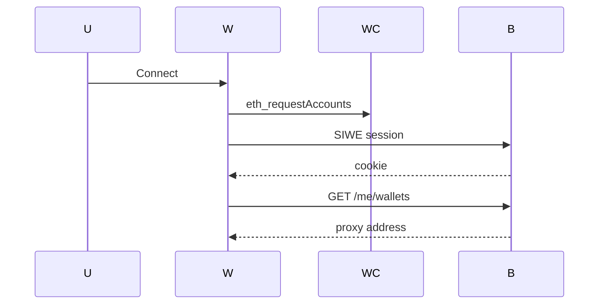
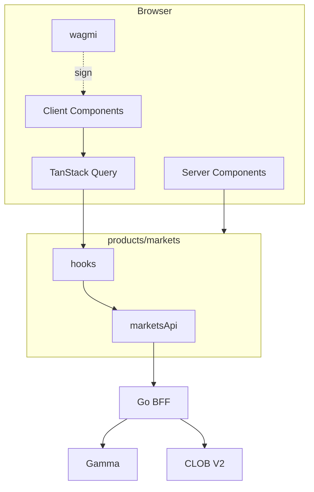

# WALLET AND TRANSACTION UX

**Status:** reviewed
**Owner:** platform-orchestrator
**Last updated:** 2026-07-25
**Product:** RetroPick Markets V1
**Wave:** 4 — Web architecture and UX

## Description

This document is the web wallet and transaction UX authority for RetroPick Markets V1. It covers connect (wallet → SIWE → `/me/wallets`), connector set, chain switching, signer vs trading/proxy address disclosure, mandatory preview-before-sign, approvals, relayer degraded paths, and security copy—without silent server-side signing (ADR-003).

It sits in Wave 4 with `fe-wallet` / `fe-markets` code under Markets wallet features and wagmi config. Session cookies trust the Markets BFF; on-chain authority remains the user wallet. Android parity is WALLET_SIGNING_AND_SECURITY. Both clients call the same preview, submit, and relay operations—no web-only signing endpoints.

Read this for PHASE-2 account/wallet and PHASE-3 order signing, and on wagmi upgrades, new chains, or relayer capability flags. Prefer MARKET_AND_ORDERBOOK_UX for ticket fields and ERROR_DEGRADED_AND_RECOVERY_UX for unknown-order panels.

It excludes seed or mnemonic import UI, treating relayer pending as a confirmed fill, skipping preview for power users, and mixing PRISM chain configs into Markets wagmi.

## 0. Developer intent (5W+1H)

Short orientation for implementers and agents. Read this before the normative sections below.

| Lens | Answer |
|------|--------|
| **Who** | `fe-wallet` / `fe-markets` implementing connect, chain guard, preview modals, and signing handoff; security reviewers of web wallet UX; agents aligning with Android `WalletCoordinator` (ADR-003). |
| **What** | Connect sequence (wallet → SIWE → `/me/wallets`), connector set, chain switching, signer vs trading/proxy address disclosure, mandatory preview before sign, approvals and relayer UX, security copy. |
| **When** | PHASE-2 account/wallet and PHASE-3 order signing. Re-read on wagmi upgrades, new chains, or relayer capability flags. Never implement silent server-side signing. |
| **Where** | Spec: this file. Code: Markets wallet feature + wagmi config in product `lib/`. Session cookies against Markets BFF. On-chain: user wallet only. Android: [WALLET_SIGNING_AND_SECURITY.md](../android/WALLET_SIGNING_AND_SECURITY.md). |
| **Why** | Users must understand what they sign and which address holds funds. Confusing signer vs proxy causes support failures and lost funds. Preview-before-sign is the primary safety rail (ADR-003). |
| **How** | Connect → request accounts → SIWE → load wallet projection. Wrong chain → blocking switch CTA. Every mutating path: BFF preview → human-readable modal → wallet prompt → submit/relay. Show truncated addresses; never ask for seed phrases. Relayer unavailable → explicit degraded path (J17). |

### Worked example

**Happy path — connect and first approval.** User clicks Connect, picks connector, approves accounts, signs SIWE. UI shows connected signer and account-wallet/proxy from `GET /me/wallets`. For trading allowances, preview approval tx → user signs → track status. Capabilities/eligibility gate trading CTAs until ready.

**Happy path — order sign.** After order preview, modal lists side, price, size, fees, max loss, and domain/exchange. User confirms → EIP-712 prompt in wallet → submit to BFF with signature + idempotency key. UI enters reconciling until CLOB truth known.

**Failure / degraded.** User rejects signature → return to editable ticket, inputs preserved. Wrong chain → no silent wrong-network submit. Relayer down → show pending/manual guidance; do not claim success. Ambiguous tx → Unknown order panel (J18), poll REST, never mark filled. Phishing-style “enter private key” UI → forbidden.

### Security UX checklist

- [ ] Preview modal mandatory before any wallet prompt for orders/approvals/funding ops that require sign.
- [ ] Distinguish **signer** vs **trading address** in UI.
- [ ] No raw key import, mnemonic paste, or embedded unrestricted dApp browser.
- [ ] Error codes mapped to actionable recovery (switch chain, reconnect, retry preview).
- [ ] Copy matches Android seriousness; vendor-specific wallet quirks handled without inventing order states.

### Shared API reminder

Web and Android both call the same preview/submit/relay operations. Do not add web-only signing endpoints. Session cookies/tokens stay on BFF trust model documented in backend auth docs.

### Address disclosure pattern

Always show:

1. Connected signer (what signs).
2. Trading / proxy / funder address from `/me/wallets` when distinct.
3. Active chain name + id.

### Signing FSM (UI-facing)

`idle → previewing → awaiting_wallet → submitting → reconciling → terminal`

Map wallet rejection and timeout into non-terminal recovery, not success.

### Agent anti-patterns

- Skipping preview modal “for power users.”
- Storing seed phrases or private keys.
- Treating relayer pending as confirmed fill.
- Mixing PRISM chain configs into Markets wagmi.

### Success signal

A first-time user can explain which address is signing and what max loss is before confirming in their wallet.

## 1. Purpose

Connect, chain switch, preview modals, signing handoff per ADR-003.

## 2. Scope

### In scope

- RetroPick Markets web (`apps/web/src/products/markets/`).
- Next.js App Router target; interim Vite + `marketsRoutes.tsx`.
- TanStack Query, wagmi wallet connector, OpenAPI codegen.

### Out of scope

Current Markets V1 authority: `.harness/products/markets-v1/governance/AGENT_OPERATING_CONTRACT.md`.
- Android ([android/](../android/)).

## 3. Prerequisites

- [00_DOCUMENT_MAP.md](../00_DOCUMENT_MAP.md)
- [WEB_APPLICATION_ARCHITECTURE.md](./WEB_APPLICATION_ARCHITECTURE.md)
- [backend/API_AND_REALTIME_CONTRACTS.md](../backend/API_AND_REALTIME_CONTRACTS.md)
- [schemas/openapi/markets-v1.yaml](../../../schemas/openapi/markets-v1.yaml)
- Reference code: `MarketsHomePage.tsx`, `marketsRoutes.tsx`, `api/marketsApi.ts`, `hooks/useMarketsPlatform.ts`

## 4. Authoritative sources

| Source | Location | Confidence |
|--------|----------|------------|
| OpenAPI | `schemas/openapi/markets-v1.yaml` | verified |
| Polymarket docs | https://docs.polymarket.com/ | partially verified |
| Wallet ADR | [ADR-003](../architecture/adr/ADR-003-WALLET-AND-SIGNING-MODEL.md) | verified |
| BFF ADR | [ADR-002](../architecture/adr/ADR-002-POLYMARKET-ANTI-CORRUPTION-LAYER.md) | verified |
| Realtime ADR | [ADR-005](../architecture/adr/ADR-005-REALTIME-AND-RECONCILIATION.md) | verified |
| Failure domains | [FAILURE_DOMAINS_AND_DEGRADED_MODES.md](../architecture/FAILURE_DOMAINS_AND_DEGRADED_MODES.md) | reviewed |
| Order lifecycle | [polymarket/ORDER_LIFECYCLE.md](../polymarket/ORDER_LIFECYCLE.md) | reviewed |
| Market data | [polymarket/MARKET_DATA_AND_REALTIME.md](../polymarket/MARKET_DATA_AND_REALTIME.md) | reviewed |
| Positions | [polymarket/POSITIONS_CTF_AND_REDEMPTION.md](../polymarket/POSITIONS_CTF_AND_REDEMPTION.md) | reviewed |
| Funding | [polymarket/FUNDS_DEPOSIT_AND_WITHDRAWAL.md](../polymarket/FUNDS_DEPOSIT_AND_WITHDRAWAL.md) | reviewed |

## 5. Current state

Markets wallet connect module shipped under `apps/web/src/products/markets/wallet/` (MKT-P2-001):

| Artifact | Path | Status |
|----------|------|--------|
| Wagmi + AppKit (Polygon 137) | `wallet/config/` | **Done** |
| Connect / disconnect UI | `wallet/components/ConnectWalletButton.tsx` | **Done** |
| Signer vs trading disclosure | `wallet/components/WalletAddressDisclosure.tsx` | **Done** — account wallet pending P2-003 |
| Chain guard | `wallet/components/ChainGuardBanner.tsx` | **Done** |
| SIWE session hook | `wallet/hooks/useMarketsWalletSession.ts` | **Done** — server nonce, cookie session, restore, logout (MKT-P2-005 web) |
| Staging harness | `/markets/wallet` route | **Done** |
| Shell wiring | `AppProviders` + shared `Header` | **Done** |
| fe-v1 legacy quarantine | `apps/web/src/components/Header.tsx` | **Done** — `isMarketsShellRoute` hides WalletButton on `/app/markets/*` |

**Environment:** `NEXT_PUBLIC_REOWN_PROJECT_ID` (WalletConnect), `NEXT_PUBLIC_API_BASE_URL` (BFF).

**Staging URL:** `http://localhost:3001/markets/wallet`

### 5.1 Session client (SIWE)

Markets web session uses the BFF auth endpoints shipped in MKT-P2-005 (Chat N). The client never stores JWTs or private keys in `localStorage` / `sessionStorage`.

| Step | Client | BFF |
|------|--------|-----|
| Restore | On wallet connect → `GET /api/v1/markets/auth/session` (`credentials: include`) | Validates HttpOnly `mkt_session` cookie |
| Sign in | `GET /api/v1/markets/auth/nonce` → wallet signs EIP-4361 message → `POST /api/v1/markets/auth/siwe` | Issues `mkt_session` + readable `mkt_csrf` cookies |
| Sign out | `POST /api/v1/markets/auth/logout` with `X-CSRF-Token` from `mkt_csrf` | Clears session cookies |

**Implementation:** `wallet/lib/marketsAuthClient.ts`, shared state in `wallet/providers/MarketsWalletSessionProvider.tsx`, hook `useMarketsWalletSession`.

**Cookies:** `mkt_session` (HttpOnly JWT), `mkt_csrf` (CSRF double-submit for logout).

**Env (web):** `NEXT_PUBLIC_API_BASE_URL` — BFF origin for auth fetches.

**Env (BFF):** `MARKETS_CORS_ALLOWED_ORIGINS=http://localhost:3001` (dev), `MARKETS_AUTH_SESSION_SECRET`, optional `MARKETS_AUTH_ALLOWED_DOMAINS`.

**Mismatch handling:** If restored session wallet ≠ connected signer, UI stays unsigned and prompts re-sign (fail closed).

Order preview/submit and deposit wallet deploy remain out of scope (PHASE-3 / P2-004).

## 6. Target design

### 6.1 Connect sequence

### 6.2 Connectors

MetaMask (injected), Coinbase, WalletConnect v2.

### 6.3 Chain guard

Require Polygon 137; banner + `switchChain` if wrong.

### 6.4 Signer vs trading address

Show both EOA and Polymarket proxy/Safe from BFF.

### 6.5 Preview modal (mandatory)

Summary, max loss, fees, contracts, `contentHash`. Scroll-to-bottom ack first time per session.

### 6.6 Signing FSM

idle → previewing → awaiting_signature → submitting → success | rejected | unknown(J18).

### 6.7 Approvals

Separate preview; prefer exact allowance over unlimited.

### 6.8 Relayer

Gasless badge when up; EOA-paid fallback when J17.

### 6.9 Security UX

Checksum on withdraw address; preview/wallet address match check; 120s preview TTL.

## 7. Alternatives considered

| Alternative | Rejected because |
|-------------|------------------|
| Browser → Gamma/CLOB direct | ADR-002: ACL, secrets, degraded cache |
| Polymarket pixel clone | ADR-007: trademark, clean-room |
| Server-side order signing | ADR-003: non-custodial |
| `number` for USDC | 6-decimal precision loss |

## 8. Decisions

- BFF-only production API ([ADR-002](../architecture/adr/ADR-002-POLYMARKET-ANTI-CORRUPTION-LAYER.md)).
- Preview `contentHash` before sign ([ADR-003](../architecture/adr/ADR-003-WALLET-AND-SIGNING-MODEL.md)).
- OpenAPI parity with Android ([ADR-004](../architecture/adr/ADR-004-SHARED-WEB-ANDROID-API.md)).
- WS + REST book fallback ([ADR-005](../architecture/adr/ADR-005-REALTIME-AND-RECONCILIATION.md)).

## 9. Data and control flows

## 10. Failure and recovery

- Fail closed on unknown eligibility.
- `stale: true` degraded banners with timestamp.
- `capabilities.trading: false` disables ticket.
- No silent order resubmission — reconcile first (J18).
- See [ERROR_DEGRADED_AND_RECOVERY_UX.md](./ERROR_DEGRADED_AND_RECOVERY_UX.md).

## 11. Security

- No private-key custody ([security/SIGNING_AND_TRANSACTION_INTEGRITY.md](../security/SIGNING_AND_TRANSACTION_INTEGRITY.md)).
- CSP on deploy; DOMPurify for rules HTML.
- Analytics redact wallet addresses.

## 12. Observability

- RUM: LCP, INP, CLS on market and ticket pages.
- Events: `markets_journey_step`, `markets_error`, `markets_degraded`.
- `x-request-id` on error surfaces.

## 13. Test strategy

- [WEB_TEST_STRATEGY.md](./WEB_TEST_STRATEGY.md)
- [testing/MASTER_TEST_PLAN.md](../testing/MASTER_TEST_PLAN.md)

## 14. Rollout and rollback

- `NEXT_PUBLIC_PRODUCT=markets` ([deploy/web-markets/.env.example](../../../deploy/web-markets/.env.example)).
- [platform/RELEASE_ROLLBACK_AND_CHANGE_MANAGEMENT.md](../platform/RELEASE_ROLLBACK_AND_CHANGE_MANAGEMENT.md)

## 15. Open questions

- [research/OPEN_QUESTIONS_AND_EXPIRING_ASSUMPTIONS.md](../research/OPEN_QUESTIONS_AND_EXPIRING_ASSUMPTIONS.md)

## 16. Acceptance criteria

- [../../../.harness/products/markets-v1/planning/REQUIREMENTS_TO_TASK_TRACEABILITY.md](../../../.harness/products/markets-v1/planning/REQUIREMENTS_TO_TASK_TRACEABILITY.md)
- 18 master-prompt §10 journeys in ERROR doc with screen-state tables.

## 17. Components

ConnectWalletButton, ChainGuard, TransactionPreviewModal, SigningProgress.

## 18. Error codes

WALLET_REJECTED, CHAIN_MISMATCH, PREVIEW_EXPIRED.

## Appendix A — OpenAPI to hook mapping

| operationId | Method | Path | Hook | Phase |
|-------------|--------|------|------|-------|
| getMarketsEligibility | GET | /markets/eligibility | useMarketsEligibility | 1 |
| getMarketsCapabilities | GET | /markets/capabilities | useMarketsCapabilities | 1 |
| listMarketsEvents | GET | /markets/events | useMarketsEvents | 1 |
| getMarketsEvent | GET | /markets/events/{eventId} | useMarketsEvent | 1 |
| getMarketsMarket | GET | /markets/markets/{marketId} | useMarketsMarket | 1 |
| getMarketsOrderBook | GET | /markets/markets/{marketId}/book | useMarketsOrderBook | 1 |
| getMarketsPriceHistory | GET | /markets/markets/{marketId}/history | useMarketsHistory | 1 |
| postMarketsOrderPreview | POST | /markets/orders/preview | useOrderPreview | 3 |
| postMarketsOrderSubmit | POST | /markets/orders | useOrderSubmit | 3 |
| deleteMarketsOrder | DELETE | /markets/orders/{orderId} | useOrderCancel | 3 |
| listMarketsOrders | GET | /markets/me/orders | useOpenOrders | 3 |
| listMarketsPositions | GET | /markets/me/positions | usePositions | 4 |
| listMarketsActivity | GET | /markets/me/activity | useActivity | 4 |
| getMarketsWallets | GET | /markets/me/wallets | useTradingWallets | 2 |
| postMarketsFundingQuote | POST | /markets/funding/quote | useFundingQuote | 2 |
| postMarketsWithdraw | POST | /markets/funding/withdraw | useWithdraw | 4 |
| postMarketsRedeemPreview | POST | /markets/redeem/preview | useRedeemPreview | 4 |

## Appendix B — Component inventory

| Component | Feature | Responsibility |
|-----------|---------|----------------|
| MarketsShell | layout | Nav, eligibility banner |
| DiscoverGrid | catalog | Event cards |
| MarketBook | trading | Bid/ask ladder |
| OrderTicket | trading | Limit order form |
| PreviewModal | wallet | Sign preview + hash |
| PortfolioTable | portfolio | Positions |
| FundingWizard | funding | Deposit flow |
| DegradedBanner | shared | Stale/outage |
| ChainGuard | wallet | Polygon 137 |
| ConnectWalletButton | wallet | AppKit connect CTA |
| WalletAddressDisclosure | wallet | Signer vs trading address |
| WalletConnectHarness | wallet | Staging QA panel |
| UnknownOrderPanel | trading | J18 reconcile |

## Appendix C — Web phase gates

| Phase | Deliverable |
|-------|-------------|
| PHASE-1 | MarketsHomePage, events, eligibility |
| PHASE-2 | Wallet connect, SIWE, funding |
| PHASE-3 | Book WS, ticket, orders |
| PHASE-4 | Portfolio, redeem, withdraw |
| PHASE-6 | Next.js migration, E2E suite |
## Appendix D — Requirements traceability samples

| REQ-ID | Scope | Verification |
|--------|-------|-------------|
| REQ-WEB-P1-00 | PHASE-1 capability | Unit + E2E where applicable |
| REQ-WEB-P1-01 | PHASE-1 capability | Unit + E2E where applicable |
| REQ-WEB-P1-02 | PHASE-1 capability | Unit + E2E where applicable |
| REQ-WEB-P1-03 | PHASE-1 capability | Unit + E2E where applicable |
| REQ-WEB-P1-04 | PHASE-1 capability | Unit + E2E where applicable |
| REQ-WEB-P1-05 | PHASE-1 capability | Unit + E2E where applicable |
| REQ-WEB-P1-06 | PHASE-1 capability | Unit + E2E where applicable |
| REQ-WEB-P1-07 | PHASE-1 capability | Unit + E2E where applicable |
| REQ-WEB-P1-08 | PHASE-1 capability | Unit + E2E where applicable |
| REQ-WEB-P1-09 | PHASE-1 capability | Unit + E2E where applicable |
| REQ-WEB-P1-10 | PHASE-1 capability | Unit + E2E where applicable |
| REQ-WEB-P1-11 | PHASE-1 capability | Unit + E2E where applicable |
| REQ-WEB-P2-00 | PHASE-2 capability | Unit + E2E where applicable |
| REQ-WEB-P2-01 | PHASE-2 capability | Unit + E2E where applicable |
| REQ-WEB-P2-02 | PHASE-2 capability | Unit + E2E where applicable |
| REQ-WEB-P2-03 | PHASE-2 capability | Unit + E2E where applicable |
| REQ-WEB-P2-04 | PHASE-2 capability | Unit + E2E where applicable |
| REQ-WEB-P2-05 | PHASE-2 capability | Unit + E2E where applicable |
| REQ-WEB-P2-06 | PHASE-2 capability | Unit + E2E where applicable |
| REQ-WEB-P2-07 | PHASE-2 capability | Unit + E2E where applicable |
| REQ-WEB-P2-08 | PHASE-2 capability | Unit + E2E where applicable |
| REQ-WEB-P2-09 | PHASE-2 capability | Unit + E2E where applicable |
| REQ-WEB-P2-10 | PHASE-2 capability | Unit + E2E where applicable |
| REQ-WEB-P2-11 | PHASE-2 capability | Unit + E2E where applicable |
| REQ-WEB-P3-00 | PHASE-3 capability | Unit + E2E where applicable |
| REQ-WEB-P3-01 | PHASE-3 capability | Unit + E2E where applicable |
| REQ-WEB-P3-02 | PHASE-3 capability | Unit + E2E where applicable |
| REQ-WEB-P3-03 | PHASE-3 capability | Unit + E2E where applicable |
| REQ-WEB-P3-04 | PHASE-3 capability | Unit + E2E where applicable |
| REQ-WEB-P3-05 | PHASE-3 capability | Unit + E2E where applicable |
| REQ-WEB-P3-06 | PHASE-3 capability | Unit + E2E where applicable |
| REQ-WEB-P3-07 | PHASE-3 capability | Unit + E2E where applicable |
| REQ-WEB-P3-08 | PHASE-3 capability | Unit + E2E where applicable |
| REQ-WEB-P3-09 | PHASE-3 capability | Unit + E2E where applicable |
| REQ-WEB-P3-10 | PHASE-3 capability | Unit + E2E where applicable |
| REQ-WEB-P3-11 | PHASE-3 capability | Unit + E2E where applicable |
| REQ-WEB-P4-00 | PHASE-4 capability | Unit + E2E where applicable |
| REQ-WEB-P4-01 | PHASE-4 capability | Unit + E2E where applicable |
| REQ-WEB-P4-02 | PHASE-4 capability | Unit + E2E where applicable |
| REQ-WEB-P4-03 | PHASE-4 capability | Unit + E2E where applicable |
| REQ-WEB-P4-04 | PHASE-4 capability | Unit + E2E where applicable |
| REQ-WEB-P4-05 | PHASE-4 capability | Unit + E2E where applicable |
| REQ-WEB-P4-06 | PHASE-4 capability | Unit + E2E where applicable |
| REQ-WEB-P4-07 | PHASE-4 capability | Unit + E2E where applicable |
| REQ-WEB-P4-08 | PHASE-4 capability | Unit + E2E where applicable |
| REQ-WEB-P4-09 | PHASE-4 capability | Unit + E2E where applicable |
| REQ-WEB-P4-10 | PHASE-4 capability | Unit + E2E where applicable |
| REQ-WEB-P4-11 | PHASE-4 capability | Unit + E2E where applicable |
| REQ-WEB-P5-00 | PHASE-5 capability | Unit + E2E where applicable |
| REQ-WEB-P5-01 | PHASE-5 capability | Unit + E2E where applicable |
| REQ-WEB-P5-02 | PHASE-5 capability | Unit + E2E where applicable |
| REQ-WEB-P5-03 | PHASE-5 capability | Unit + E2E where applicable |
| REQ-WEB-P5-04 | PHASE-5 capability | Unit + E2E where applicable |
| REQ-WEB-P5-05 | PHASE-5 capability | Unit + E2E where applicable |
| REQ-WEB-P5-06 | PHASE-5 capability | Unit + E2E where applicable |
| REQ-WEB-P5-07 | PHASE-5 capability | Unit + E2E where applicable |
| REQ-WEB-P5-08 | PHASE-5 capability | Unit + E2E where applicable |
| REQ-WEB-P5-09 | PHASE-5 capability | Unit + E2E where applicable |
| REQ-WEB-P5-10 | PHASE-5 capability | Unit + E2E where applicable |
| REQ-WEB-P5-11 | PHASE-5 capability | Unit + E2E where applicable |
| REQ-WEB-P6-00 | PHASE-6 capability | Unit + E2E where applicable |
| REQ-WEB-P6-01 | PHASE-6 capability | Unit + E2E where applicable |
| REQ-WEB-P6-02 | PHASE-6 capability | Unit + E2E where applicable |
| REQ-WEB-P6-03 | PHASE-6 capability | Unit + E2E where applicable |
| REQ-WEB-P6-04 | PHASE-6 capability | Unit + E2E where applicable |
| REQ-WEB-P6-05 | PHASE-6 capability | Unit + E2E where applicable |
| REQ-WEB-P6-06 | PHASE-6 capability | Unit + E2E where applicable |
| REQ-WEB-P6-07 | PHASE-6 capability | Unit + E2E where applicable |
| REQ-WEB-P6-08 | PHASE-6 capability | Unit + E2E where applicable |
| REQ-WEB-P6-09 | PHASE-6 capability | Unit + E2E where applicable |
| REQ-WEB-P6-10 | PHASE-6 capability | Unit + E2E where applicable |
| REQ-WEB-P6-11 | PHASE-6 capability | Unit + E2E where applicable |
| REQ-WEB-P7-00 | PHASE-7 capability | Unit + E2E where applicable |
| REQ-WEB-P7-01 | PHASE-7 capability | Unit + E2E where applicable |
| REQ-WEB-P7-02 | PHASE-7 capability | Unit + E2E where applicable |
| REQ-WEB-P7-03 | PHASE-7 capability | Unit + E2E where applicable |
| REQ-WEB-P7-04 | PHASE-7 capability | Unit + E2E where applicable |
| REQ-WEB-P7-05 | PHASE-7 capability | Unit + E2E where applicable |
| REQ-WEB-P7-06 | PHASE-7 capability | Unit + E2E where applicable |
| REQ-WEB-P7-07 | PHASE-7 capability | Unit + E2E where applicable |
| REQ-WEB-P7-08 | PHASE-7 capability | Unit + E2E where applicable |
| REQ-WEB-P7-09 | PHASE-7 capability | Unit + E2E where applicable |
| REQ-WEB-P7-10 | PHASE-7 capability | Unit + E2E where applicable |
| REQ-WEB-P7-11 | PHASE-7 capability | Unit + E2E where applicable |
| REQ-WEB-P8-00 | PHASE-8 capability | Unit + E2E where applicable |
| REQ-WEB-P8-01 | PHASE-8 capability | Unit + E2E where applicable |
| REQ-WEB-P8-02 | PHASE-8 capability | Unit + E2E where applicable |
| REQ-WEB-P8-03 | PHASE-8 capability | Unit + E2E where applicable |
| REQ-WEB-P8-04 | PHASE-8 capability | Unit + E2E where applicable |
| REQ-WEB-P8-05 | PHASE-8 capability | Unit + E2E where applicable |
| REQ-WEB-P8-06 | PHASE-8 capability | Unit + E2E where applicable |
| REQ-WEB-P8-07 | PHASE-8 capability | Unit + E2E where applicable |
| REQ-WEB-P8-08 | PHASE-8 capability | Unit + E2E where applicable |
| REQ-WEB-P8-09 | PHASE-8 capability | Unit + E2E where applicable |
| REQ-WEB-P8-10 | PHASE-8 capability | Unit + E2E where applicable |
| REQ-WEB-P8-11 | PHASE-8 capability | Unit + E2E where applicable |

| REQ-WEB-EXTRA | Cross-cutting | Manual QA |

| REQ-WEB-EXTRA | Cross-cutting | Manual QA |

| REQ-WEB-EXTRA | Cross-cutting | Manual QA |

| REQ-WEB-EXTRA | Cross-cutting | Manual QA |

| REQ-WEB-EXTRA | Cross-cutting | Manual QA |

| REQ-WEB-EXTRA | Cross-cutting | Manual QA |

| REQ-WEB-EXTRA | Cross-cutting | Manual QA |

| REQ-WEB-EXTRA | Cross-cutting | Manual QA |

| REQ-WEB-EXTRA | Cross-cutting | Manual QA |

| REQ-WEB-EXTRA | Cross-cutting | Manual QA |

| REQ-WEB-EXTRA | Cross-cutting | Manual QA |

| REQ-WEB-EXTRA | Cross-cutting | Manual QA |

| REQ-WEB-EXTRA | Cross-cutting | Manual QA |

| REQ-WEB-EXTRA | Cross-cutting | Manual QA |

| REQ-WEB-EXTRA | Cross-cutting | Manual QA |

| REQ-WEB-EXTRA | Cross-cutting | Manual QA |

| REQ-WEB-EXTRA | Cross-cutting | Manual QA |

| REQ-WEB-EXTRA | Cross-cutting | Manual QA |

| REQ-WEB-EXTRA | Cross-cutting | Manual QA |

| REQ-WEB-EXTRA | Cross-cutting | Manual QA |

| REQ-WEB-EXTRA | Cross-cutting | Manual QA |

| REQ-WEB-EXTRA | Cross-cutting | Manual QA |

| REQ-WEB-EXTRA | Cross-cutting | Manual QA |

| REQ-WEB-EXTRA | Cross-cutting | Manual QA |

| REQ-WEB-EXTRA | Cross-cutting | Manual QA |

| REQ-WEB-EXTRA | Cross-cutting | Manual QA |

| REQ-WEB-EXTRA | Cross-cutting | Manual QA |

| REQ-WEB-EXTRA | Cross-cutting | Manual QA |

| REQ-WEB-EXTRA | Cross-cutting | Manual QA |

| REQ-WEB-EXTRA | Cross-cutting | Manual QA |

| REQ-WEB-EXTRA | Cross-cutting | Manual QA |

| REQ-WEB-EXTRA | Cross-cutting | Manual QA |

| REQ-WEB-EXTRA | Cross-cutting | Manual QA |

| REQ-WEB-EXTRA | Cross-cutting | Manual QA |

| REQ-WEB-EXTRA | Cross-cutting | Manual QA |
