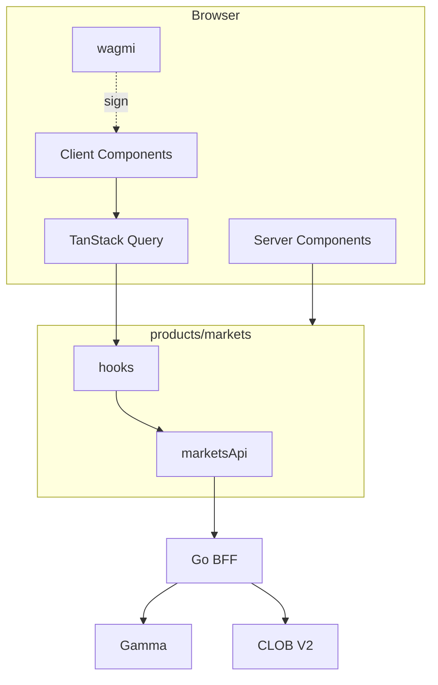
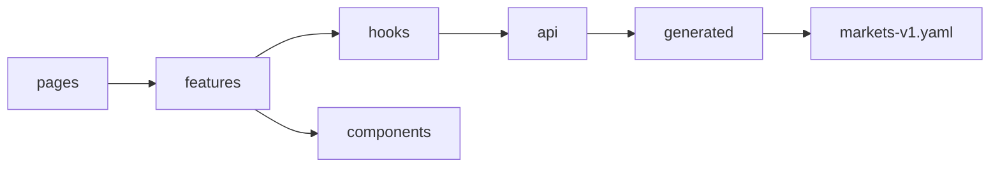

# WEB APPLICATION ARCHITECTURE

**Status:** reviewed
**Owner:** platform-orchestrator
**Last updated:** 2026-07-25
**Product:** RetroPick Markets V1
**Wave:** 4 — Web architecture and UX

## Description

This document is the structural spine for RetroPick Markets V1 web: product isolation (`NEXT_PUBLIC_PRODUCT=markets`), RSC vs client boundaries, provider stack, TanStack Query defaults, wallet connector placement, OpenAPI-generated client, realtime book hooks, CSP, and deploy unit. All other Wave 4 UX docs assume this layout.

It sits over `apps/web/src/products/markets/` and target `app/(markets)/` routes, with shared contract `schemas/openapi/markets-v1.yaml` and deploy under `deploy/web-markets/`. Android consumes the same BFF—never a web-only API path. If a later UX doc conflicts with RSC/client or Query rules here, this document wins for structure.

Read this before adding routes, providers, or trading UI, and when migrating Vite routes to App Router, regenerating OpenAPI types, or changing cache TTLs. Prefer WEB_PRODUCT_INFORMATION_ARCHITECTURE for route maps and DESIGN_SYSTEM_AND_ACCESSIBILITY for tokens.

It excludes PRISM or legacy product folders, direct Gamma/CLOB browser calls (ADR-002), float math on money fields, and auto-retry of preview or submit on timeout.

## 0. Developer intent (5W+1H)

Short orientation for implementers and agents. Read this before the normative sections below.

| Lens | Answer |
|------|--------|
| **Who** | `fe-markets` / `fe-wallet` agents and web engineers owning `apps/web/src/products/markets/`; Next.js App Router migrators; OpenAPI codegen owners; agents wiring TanStack Query + wagmi without inventing a second API. |
| **What** | Normative web application architecture for Markets V1: product isolation (`NEXT_PUBLIC_PRODUCT=markets`), RSC vs client boundaries, provider stack, Query defaults, wallet connector placement, OpenAPI-generated client, realtime book hooks, CSP/deploy unit. This is the structural spine for all Wave 4 UX docs. |
| **When** | Before adding routes, providers, or trading UI. Re-read when migrating Vite `marketsRoutes.tsx` → `app/(markets)/`, regenerating OpenAPI types, changing cache TTLs, or introducing wallet/realtime. Do not start PHASE-3 ticket UI until this layout and client stack exist. |
| **Where** | Spec: this file. Code: `apps/web/src/products/markets/` (hooks, features, lib) and target `apps/web/src/app/(markets)/`. Shared contract: [schemas/openapi/markets-v1.yaml](../../../schemas/openapi/markets-v1.yaml). Deploy: `deploy/web-markets/`. Android consumes the same BFF—never a web-only path. |
| **Why** | Without clear RSC/client and Query/wallet boundaries, financial UI drifts into float math, silent retries, or Polymarket-direct calls. One Markets product folder keeps PRISM/legacy out of the bundle. Shared OpenAPI (ADR-004) prevents web/Android divergence. |
| **How** | Keep catalog first-paint in RSC where SEO/LCP matter; put wallet, ticket, and WS in client components. Generate types from OpenAPI; parse `Money` / `DecimalString` via dedicated helpers—never `Number()`. Route all Markets HTTP through the BFF origin. Feature-flag phase-gated surfaces via `GET /markets/capabilities`. Fail closed on ambiguous order state. |

### Worked example

**Happy path — platform shell → discovery.** Build with `NEXT_PUBLIC_PRODUCT=markets`. Layout mounts eligibility + capabilities queries. RSC (or PHASE-1 `MarketsHomePage`) loads events from BFF; client hydrates Query cache. User navigates to a market route; detail page composes chart (client), book (WS+REST), and ticket shell (gated until PHASE-3). OpenAPI types ensure response shapes match Android.

**Happy path — codegen + wallet prep.** Run OpenAPI generate into `api/generated/`; hooks import generated types. Wagmi config lives in Markets `lib/` only—no PRISM chains. Provider stack order: Query → wagmi → Markets session. Capabilities false for trading → ticket CTA disabled with clear copy, not a broken form.

**Failure / degraded.** BFF unreachable → bounded error with request guidance; do not invent catalog rows. Stale Query data past freshness → banner, not silent “live” prices. Wallet connect fails → recoverable empty wallet state; never store private keys. CSP violation or wrong API origin → hard fail in staging. Direct Gamma/CLOB from browser → reject in review (ADR-002).

### Implementer checklist

- [ ] Change lives under `products/markets/` (or `app/(markets)/`), not PRISM/legacy.
- [ ] New endpoint exists in OpenAPI before client code.
- [ ] Financial fields use string/fixed-point helpers.
- [ ] Mutating calls send `Idempotency-Key` when the op requires it.
- [ ] Realtime is reconciliation aid; REST remains source for user orders/positions.
- [ ] Android parity considered for any new operation shape.

### Related Wave 4 docs

IA routes, design tokens, market/ticket UX, wallet UX, portfolio/funding UX, error journeys, and web test strategy all assume this architecture. If a later UX doc conflicts with RSC/client or Query rules here, **this document wins** for structure; file an open question rather than forking stacks.

### Layering map (web)

| Layer | Owns | Must not own |
|-------|------|--------------|
| `app/(markets)/` routes | URL, SEO metadata, RSC fetch | Wallet private state |
| `features/*` | Journey UI + hooks | Direct Gamma/CLOB HTTP |
| `api/` + generated types | Transport + DTO parse | Business copy |
| `lib/queryClient` | Cache defaults, staleTimes | Order matching |
| `lib/wagmiConfig` | Chains/connectors | SIWE secret storage beyond session |

### Agent anti-patterns

- Creating `products/markets-v2` beside Markets instead of extending this tree.
- Using `any` for OpenAPI money fields “temporarily.”
- Auto-retrying `orders/preview` or `orders/submit` on timeout.
- Importing legacy epoch clients into Markets providers.
- Shipping ticket UI before eligibility + capabilities hooks exist.

### Success signal

A new engineer can add a catalog-only page by copying an existing RSC route, wiring one generated GET, and remaining phase-safe without touching wallet code.

## 1. Purpose

Define RetroPick Markets web architecture: Next.js App Router under `apps/web/src/products/markets/`, RSC vs client boundaries, TanStack Query, wagmi wallet connector, and OpenAPI client generation.


## 2. Scope

### In scope

- RetroPick Markets web (`apps/web/src/products/markets/`).
- Next.js App Router target; interim Vite + `marketsRoutes.tsx`.
- TanStack Query, wagmi wallet connector, OpenAPI codegen.

### Out of scope

- PRISM (`products/prism/`), legacy epoch (`products/legacy/`), custom exchange ([ADR-001](../architecture/adr/ADR-001-MARKETS-HAS-NO-CUSTOM-EXCHANGE.md)).
- Android ([android/](../android/)).


## 3. Prerequisites

- [00_DOCUMENT_MAP.md](../00_DOCUMENT_MAP.md)
- [WEB_APPLICATION_ARCHITECTURE.md](./WEB_APPLICATION_ARCHITECTURE.md)
- [backend/API_AND_REALTIME_CONTRACTS.md](../backend/API_AND_REALTIME_CONTRACTS.md)
- [schemas/openapi/markets-v1.yaml](../../../schemas/openapi/markets-v1.yaml)
- Reference code: `MarketsHomePage.tsx`, `marketsRoutes.tsx`, `api/marketsApi.ts`, `hooks/useMarketsPlatform.ts`


## 4. Authoritative sources

| Source | Location | Confidence |
|--------|----------|------------|
| OpenAPI | `schemas/openapi/markets-v1.yaml` | verified |
| Polymarket docs | https://docs.polymarket.com/ | partially verified |
| Wallet ADR | [ADR-003](../architecture/adr/ADR-003-WALLET-AND-SIGNING-MODEL.md) | verified |
| BFF ADR | [ADR-002](../architecture/adr/ADR-002-POLYMARKET-ANTI-CORRUPTION-LAYER.md) | verified |
| Realtime ADR | [ADR-005](../architecture/adr/ADR-005-REALTIME-AND-RECONCILIATION.md) | verified |
| Failure domains | [FAILURE_DOMAINS_AND_DEGRADED_MODES.md](../architecture/FAILURE_DOMAINS_AND_DEGRADED_MODES.md) | reviewed |
| Order lifecycle | [polymarket/ORDER_LIFECYCLE.md](../polymarket/ORDER_LIFECYCLE.md) | reviewed |
| Market data | [polymarket/MARKET_DATA_AND_REALTIME.md](../polymarket/MARKET_DATA_AND_REALTIME.md) | reviewed |
| Positions | [polymarket/POSITIONS_CTF_AND_REDEMPTION.md](../polymarket/POSITIONS_CTF_AND_REDEMPTION.md) | reviewed |
| Funding | [polymarket/FUNDS_DEPOSIT_AND_WITHDRAWAL.md](../polymarket/FUNDS_DEPOSIT_AND_WITHDRAWAL.md) | reviewed |


## 5. Current state

R4 monorepo (2026-07-25):

| Artifact | Path | Status |
|----------|------|--------|
| Platform home | `MarketsHomePage.tsx` | **Done** — eligibility, capabilities, events |
| Routes | `marketsRoutes.tsx` | `/markets`, `/markets/*` → home |
| API client | `api/marketsApi.ts` | `getJson` + 3 endpoints |
| Query hooks | `hooks/useMarketsPlatform.ts` | `useMarketsEligibility`, `Capabilities`, `Events` |
| Product routing | `App.tsx` | `NEXT_PUBLIC_PRODUCT=markets` |
| Providers | `app/AppProviders.tsx` | `<Outlet />` only |
| App Router | `app/(markets)/` | **Not started** |
| Wallet / wagmi | — | PHASE-2 |
| OpenAPI codegen | — | PHASE-2 |
| Trading UI | — | PHASE-3 |

`MarketsHomePage` error pattern (reference):

```tsx
{error ? (
  <p className="rounded-md border border-destructive/40 bg-destructive/10 px-3 py-2 text-sm text-destructive">
    Could not reach Markets API. Start the Go backend or set NEXT_PUBLIC_API_URL.
  </p>
) : null}
```


## 6. Target design

### 6.1 Directory structure

```text
apps/web/src/
├── app/(markets)/                    # Next.js App Router (target)
│   ├── layout.tsx                    # Providers, nav shell, eligibility
│   ├── markets/page.tsx              # Discovery
│   ├── markets/search/page.tsx
│   ├── markets/events/[eventId]/page.tsx
│   ├── markets/m/[marketId]/page.tsx
│   ├── markets/portfolio/page.tsx
│   ├── markets/orders/page.tsx
│   ├── markets/funding/page.tsx
│   ├── markets/wallet/page.tsx
│   └── markets/ineligible/page.tsx
└── products/markets/
    ├── MarketsHomePage.tsx           # PHASE-1 (retire post-migration)
    ├── marketsRoutes.tsx             # Vite bridge (delete after migration)
    ├── api/
    │   ├── marketsApi.ts             # Hand-written PHASE-1
    │   ├── server.ts                 # RSC fetch helpers
    │   └── generated/schema.d.ts     # openapi-typescript
    ├── hooks/
    │   ├── useMarketsPlatform.ts
    │   ├── useMarketsOrderBook.ts
    │   └── useMarketsTrading.ts
    ├── components/{client,server}/
    ├── features/{catalog,trading,portfolio,funding,wallet}/
    └── lib/{wagmiConfig,queryClient,decimal}.ts
```

### 6.2 RSC vs client boundaries

| UI surface | Render | Cache | Notes |
|------------|--------|-------|-------|
| Event list (first paint) | RSC | `revalidate: 30` | SEO, LCP |
| Event rules markdown | RSC | `revalidate: 60` | DOMPurify server-side |
| Market metadata header | RSC | per-request | |
| Price chart | Client | TanStack | Interactive range |
| Order book ladder | Client | WS + query | Must not SSR WS |
| Order ticket | Client | — | Input + validation |
| Wallet connect | Client | — | `window.ethereum` |
| Portfolio table | Hybrid | RSC shell + client poll | |
| Intelligence sidebar | Client | stale badge | Independent failure domain |

**Enforcement:** ESLint rule — `wagmi`/`viem` imports only in `**/client/**` or files with `"use client"`.

### 6.3 Provider stack

```mermaid
flowchart TB
  L[app/(markets)/layout.tsx]
  Q[QueryClientProvider]
  W[WagmiProvider + RainbowKit]
  Cap[MarketsCapabilitiesProvider]
  Elig[EligibilityProvider]
  L --> Q --> W --> Cap --> Elig --> children
```

`MarketsCapabilitiesProvider` polls `useMarketsCapabilities()` every 120s and on `visibilitychange`.

### 6.4 TanStack Query configuration

From existing `useMarketsPlatform.ts`:

```typescript
export function useMarketsEligibility() {
  return useQuery({
    queryKey: ["markets", "eligibility"],
    queryFn: fetchMarketsEligibility,
    staleTime: 60_000,
  });
}
```

| Query key | staleTime | gcTime | refetch | Notes |
|-----------|-----------|--------|---------|-------|
| `["markets","eligibility"]` | 60s | 5m | focus | fail-closed UI |
| `["markets","capabilities"]` | 60s | 5m | focus + 120s | gates trading |
| `["markets","events"]` | 30s | 10m | focus | cursor in key |
| `["markets","event",id]` | 30s | 10m | — | |
| `["markets","market",id]` | 15s | 5m | — | |
| `["markets","book",id]` | 0 | 30s | WS invalidate | |
| `["markets","positions"]` | 15s | 5m | post-trade | fixed-point |
| `["markets","orders","open"]` | 5s | 2m | tab visible | |

**Mutations:** `useOrderPreview` → `useOrderSubmit` chain; `onError` preserves ticket draft in `sessionStorage`.

**QueryClient defaults:**

```typescript
new QueryClient({
  defaultOptions: {
    queries: { retry: (fc, err) => err.status >= 500 && fc < 2 },
  },
});
```

### 6.5 Wallet connector (wagmi v2 + viem)

```typescript
import { createConfig, http } from "wagmi";
import { polygon } from "wagmi/chains";
import { injected, walletConnect } from "wagmi/connectors";

export const wagmiConfig = createConfig({
  chains: [polygon],
  transports: { [polygon.id]: http(process.env.NEXT_PUBLIC_POLYGON_RPC) },
  connectors: [
    injected({ shimDisconnect: true }),
    walletConnect({ projectId: process.env.NEXT_PUBLIC_WC_PROJECT_ID! }),
  ],
});
```

| Step | UX |
|------|-----|
| Disconnected | Header "Connect wallet" |
| Connecting | Spinner on button |
| Connected wrong chain | `ChainGuard` banner + switch |
| Connected + proxy unknown | Prompt `/markets/wallet` setup |
| Ready | Show truncated trading address |

### 6.6 OpenAPI client generation

```bash
# apps/web/package.json scripts
" codegen:markets": "openapi-typescript ../../../schemas/openapi/markets-v1.yaml -o src/products/markets/api/generated/schema.d.ts"
```

Migration path:

1. PHASE-1: hand `marketsApi.ts` (current)
2. PHASE-2: generated types; hand wrappers add auth headers
3. PHASE-3: `openapi-fetch` client with middleware for `Idempotency-Key`

```typescript
// Wrapper pattern (target)
import type { paths } from "./generated/schema";
import createClient from "openapi-fetch";

const client = createClient<paths>({ baseUrl: getApiBaseUrl() });
export const marketsClient = client;
```

CI: `npm run codegen:markets && git diff --exit-code` on OpenAPI PRs.

### 6.7 Realtime order book

- Subscribe: `wss://{host}/api/v1/markets/ws` with `marketId` + JWT if required
- Message types: `book.snapshot`, `book.delta`, `trade`
- Gap: if `seq !== lastSeq + 1` → `GET /markets/markets/{id}/book`
- Cleanup: unsubscribe on `marketId` change and unmount
- UI: batch DOM updates max 10/s

### 6.8 Error boundaries

- `app/(markets)/markets/m/[marketId]/error.tsx` — market-specific recovery
- `MarketsApiErrorBoundary` — shows `x-request-id`
- Never render signed preview after `capabilities.trading` flips false

### 6.9 Financial types

- API: `DecimalString` (e.g. `"10500000"` = 10.5 USDC)
- Compute: `bigint` only via `@retropick/polymarket/money`
- Display: `formatUsdc(baseUnits)` — never raw float

### 6.10 Feature flags

Read `useMarketsCapabilities()` everywhere:

```typescript
const { data: cap } = useMarketsCapabilities();
const canTrade = cap?.trading === true;
```

### 6.11 CSP and security headers

| Header | Markets value |
|--------|---------------|
| Content-Security-Policy | `default-src 'self'; script-src 'self' 'nonce-{n}'; connect-src 'self' {API} wss: https://*.walletconnect.com https://polygon-rpc.com` |
| X-Frame-Options | DENY |
| Permissions-Policy | `camera=(), microphone=()` |

### 6.12 Build / deploy

- `NEXT_PUBLIC_PRODUCT=markets` excludes PRISM/legacy routes in `App.tsx`
- Output: `deploy/web-markets/` static or Node standalone
- Source maps: hidden in production; uploaded to error tracker


## 7. Alternatives considered

| Alternative | Rejected because |
|-------------|------------------|
| Browser → Gamma/CLOB direct | ADR-002: ACL, secrets, degraded cache |
| Polymarket pixel clone | ADR-007: trademark, clean-room |
| Server-side order signing | ADR-003: non-custodial |
| `number` for USDC | 6-decimal precision loss |


## 8. Decisions

- BFF-only production API ([ADR-002](../architecture/adr/ADR-002-POLYMARKET-ANTI-CORRUPTION-LAYER.md)).
- Preview `contentHash` before sign ([ADR-003](../architecture/adr/ADR-003-WALLET-AND-SIGNING-MODEL.md)).
- OpenAPI parity with Android ([ADR-004](../architecture/adr/ADR-004-SHARED-WEB-ANDROID-API.md)).
- WS + REST book fallback ([ADR-005](../architecture/adr/ADR-005-REALTIME-AND-RECONCILIATION.md)).


## 9. Data and control flows




## 10. Failure and recovery

- Fail closed on unknown eligibility.
- `stale: true` degraded banners with timestamp.
- `capabilities.trading: false` disables ticket.
- No silent order resubmission — reconcile first (J18).
- See [ERROR_DEGRADED_AND_RECOVERY_UX.md](./ERROR_DEGRADED_AND_RECOVERY_UX.md).


## 11. Security

- No private-key custody ([security/SIGNING_AND_TRANSACTION_INTEGRITY.md](../security/SIGNING_AND_TRANSACTION_INTEGRITY.md)).
- CSP on deploy; DOMPurify for rules HTML.
- Analytics redact wallet addresses.


## 12. Observability

- RUM: LCP, INP, CLS on market and ticket pages.
- Events: `markets_journey_step`, `markets_error`, `markets_degraded`.
- `x-request-id` on error surfaces.


## 13. Test strategy

- [WEB_TEST_STRATEGY.md](./WEB_TEST_STRATEGY.md)
- [testing/MASTER_TEST_PLAN.md](../testing/MASTER_TEST_PLAN.md)


## 14. Rollout and rollback

- `NEXT_PUBLIC_PRODUCT=markets` ([deploy/web-markets/.env.example](../../../deploy/web-markets/.env.example)).
- [platform/RELEASE_ROLLBACK_AND_CHANGE_MANAGEMENT.md](../platform/RELEASE_ROLLBACK_AND_CHANGE_MANAGEMENT.md)


## 15. Open questions

- [research/OPEN_QUESTIONS_AND_EXPIRING_ASSUMPTIONS.md](../research/OPEN_QUESTIONS_AND_EXPIRING_ASSUMPTIONS.md)


## 16. Acceptance criteria

- [../../../.harness/products/markets-v1/planning/REQUIREMENTS_TO_TASK_TRACEABILITY.md](../../../.harness/products/markets-v1/planning/REQUIREMENTS_TO_TASK_TRACEABILITY.md)
- 18 master-prompt §10 journeys in ERROR doc with screen-state tables.


## 17. Module dependency rules



- `api/` MUST NOT import React
- `features/trading` MUST NOT import `features/intelligence`
- `@retropick/polymarket` types only in `api/` and `lib/`


## 18. Vite → Next.js migration

| # | Task | Owner | Done when |
|---|------|-------|-----------|
| 1 | Add `next.config.ts`, `app/layout.tsx` | web | `next build` passes |
| 2 | Port `marketsRoutes` → `app/(markets)/markets/*` | web | E2E routes match IA doc |
| 3 | `providers.tsx`: Query + Wagmi | web | hooks work in RSC layout |
| 4 | SSR eligibility in root layout | web | view-source shows gate |
| 5 | RSC `server.ts` fetch for catalog | web | LCP improved |
| 6 | Remove Vite markets entry | web | single bundler |
| 7 | Delete `marketsRoutes.tsx` | web | no duplicate paths |

## Appendix A — OpenAPI to hook mapping

| operationId | Method | Path | Hook | Phase |
|-------------|--------|------|------|-------|
| getMarketsEligibility | GET | /markets/eligibility | useMarketsEligibility | 1 |
| getMarketsCapabilities | GET | /markets/capabilities | useMarketsCapabilities | 1 |
| listMarketsEvents | GET | /markets/events | useMarketsEvents | 1 |
| getMarketsEvent | GET | /markets/events/{eventId} | useMarketsEvent | 1 |
| getMarketsMarket | GET | /markets/markets/{marketId} | useMarketsMarket | 1 |
| getMarketsOrderBook | GET | /markets/markets/{marketId}/book | useMarketsOrderBook | 1 |
| getMarketsPriceHistory | GET | /markets/markets/{marketId}/history | useMarketsHistory | 1 |
| postMarketsOrderPreview | POST | /markets/orders/preview | useOrderPreview | 3 |
| postMarketsOrderSubmit | POST | /markets/orders | useOrderSubmit | 3 |
| deleteMarketsOrder | DELETE | /markets/orders/{orderId} | useOrderCancel | 3 |
| listMarketsOrders | GET | /markets/me/orders | useOpenOrders | 3 |
| listMarketsPositions | GET | /markets/me/positions | usePositions | 4 |
| listMarketsActivity | GET | /markets/me/activity | useActivity | 4 |
| getMarketsWallets | GET | /markets/me/wallets | useTradingWallets | 2 |
| postMarketsFundingQuote | POST | /markets/funding/quote | useFundingQuote | 2 |
| postMarketsWithdraw | POST | /markets/funding/withdraw | useWithdraw | 4 |
| postMarketsRedeemPreview | POST | /markets/redeem/preview | useRedeemPreview | 4 |

## Appendix B — Component inventory

| Component | Feature | Responsibility |
|-----------|---------|----------------|
| MarketsShell | layout | Nav, eligibility banner |
| DiscoverGrid | catalog | Event cards |
| MarketBook | trading | Bid/ask ladder |
| OrderTicket | trading | Limit order form |
| PreviewModal | wallet | Sign preview + hash |
| PortfolioTable | portfolio | Positions |
| FundingWizard | funding | Deposit flow |
| DegradedBanner | shared | Stale/outage |
| ChainGuard | wallet | Polygon 137 |
| UnknownOrderPanel | trading | J18 reconcile |

## Appendix C — Web phase gates

| Phase | Deliverable |
|-------|-------------|
| PHASE-1 | MarketsHomePage, events, eligibility |
| PHASE-2 | Wallet connect, SIWE, funding |
| PHASE-3 | Book WS, ticket, orders |
| PHASE-4 | Portfolio, redeem, withdraw |
| PHASE-6 | Next.js migration, E2E suite |
