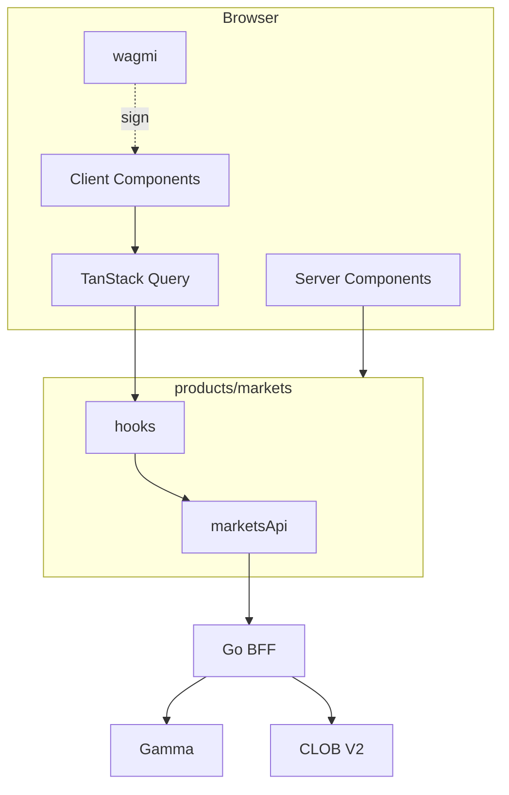

# WEB PRODUCT INFORMATION ARCHITECTURE

**Status:** reviewed
**Owner:** platform-orchestrator
**Last updated:** 2026-07-25
**Product:** RetroPick Markets V1
**Wave:** 4 — Web architecture and UX

## Description

This document is the product information architecture for RetroPick Markets V1 web: route map, public vs auth surfaces, desktop sidebar and mobile tabs, SEO metadata, deep links, breadcrumbs, empty states, and hard cross-product isolation (no PRISM in the Markets build).

It sits in Wave 4 with interim `marketsRoutes.tsx` and target `app/(markets)/markets/**`. Auth and eligibility gates come from the BFF session model. Android App Links should mirror shared path patterns per NAVIGATION_AND_DEEP_LINKS. Phase columns on the route map gate what ships.

Read this before creating pages or nav items, and whenever alert deep links, funding or redeem routes, or Android share URLs change. Prefer WEB_APPLICATION_ARCHITECTURE for provider and RSC rules, and journey UX docs for screen internals.

It excludes auth-gating public discovery, advertising out-of-scope products in Markets chrome, web-only path aliases that break notification landings, and empty states without a Discover CTA.

## 0. Developer intent (5W+1H)

Short orientation for implementers and agents. Read this before the normative sections below.

| Lens | Answer |
|------|--------|
| **Who** | `fe-markets` implementing Markets routes/nav; SEO owners; deep-link and alert-landing authors; agents aligning web paths with Android Navigation routes for shared URLs. |
| **What** | Product information architecture: route map, public vs auth surfaces, desktop sidebar / mobile tabs, SEO metadata, deep links, breadcrumbs, empty states, and hard cross-product isolation (no PRISM in Markets build). |
| **When** | Before creating pages or nav items. Revisit when adding alert deep links, funding/redeem routes, or Android App Links that must mirror web paths. Phase columns on the route map gate what ships. |
| **Where** | Spec: this file. Interim routes: `marketsRoutes.tsx`. Target: `app/(markets)/markets/**`. Parity: [android/NAVIGATION_AND_DEEP_LINKS.md](../android/NAVIGATION_AND_DEEP_LINKS.md). Auth gates: backend eligibility + session. |
| **Why** | Users (and agents) need one mental model of Markets space. Wrong auth on public catalog blocks SEO; missing auth on portfolio leaks PII. Shared path patterns with Android make notification and share URLs trustworthy. |
| **How** | Register every route in the map with auth + phase. Public: discovery, event, market read, ineligible. Auth+eligible: portfolio, orders, funding, wallet, redeem, alerts. Generate metadata only on public routes; `robots` disallow private. Deep links land on market/event with optional query (`alert=`). Empty states push toward Discover, not dead ends. |

### Worked example

**Happy path — discover → event → market.** User opens `/markets`, filters via `/markets/search`, opens `/markets/events/{eventId}`, then `/markets/m/{marketId}`. Breadcrumb Discover > Event > Market. Unauthenticated users read rules and book; Connect CTA appears for ticket actions. Share URL uses the same market path Android App Links will claim.

**Happy path — post-auth portfolio.** After SIWE + eligibility, `/markets/portfolio` and `/markets/orders` resolve. Funding at `/markets/funding`; withdraw under funding subtree. Alerts list at `/markets/alerts` can deep-link into a market with context preserved.

**Failure / degraded.** Ineligible region → `/markets/ineligible` (or gate overlay), not a half-working ticket. Auth cookie missing on portfolio → redirect to wallet/connect with return URL. Unknown market id → not-found empty state with Discover CTA. PRISM or legacy links in Markets nav → remove; Markets build must not advertise out-of-scope products.

### IA rules agents must not break

1. Catalog remains publicly readable when BFF allows.
2. Trading, funding, and portfolio routes require session + eligibility.
3. Route ids (`eventId`, `marketId`) match BFF/OpenAPI identifiers—no client-side aliases.
4. Mobile web uses bottom tabs aligned to Android bottom nav jobs (Discover, Portfolio, Funding/Alerts as specified).
5. Copy stays prediction-market professional: order ticket, positions, funding—not sportsbook language.

### Cross-client parity note

When web adds a shareable path, update Android deep-link matrix in the same change set or open a tracked follow-up. Divergent URLs break notification → open flows.

### Nav ownership

| Region | Desktop | Mobile web |
|--------|---------|------------|
| Primary | Left sidebar | Bottom tabs |
| Utility | Header wallet chip | Header sheet |
| Blocking | Full-page ineligible | Same |

### Deep-link query conventions

- `alert=` — optional alert context; strip after consume.
- Return URLs after connect must stay within `/markets/**`.
- Do not use hash routes for primary IA; App Router path segments win.

### Agent anti-patterns

- Adding `/prism` or legacy links in Markets chrome.
- Auth-gating `/markets` discovery.
- Unique web-only path for a resource Android already deep-links.
- Empty states that strand users without Discover CTA.

### Success signal

Share URLs and FCM web targets resolve to the same market/event ids the BFF uses, with auth gates applied after navigation—not before the public shell paints.

## 1. Purpose

Route map, navigation hierarchy, public vs authenticated IA, SEO, deep links.

## 2. Scope

### In scope

- RetroPick Markets web (`apps/web/src/products/markets/`).
- Next.js App Router target; interim Vite + `marketsRoutes.tsx`.
- TanStack Query, wagmi wallet connector, OpenAPI codegen.

### Out of scope

- Android ([android/](../android/)).

## 3. Prerequisites

- [00_DOCUMENT_MAP.md](../00_DOCUMENT_MAP.md)
- [WEB_APPLICATION_ARCHITECTURE.md](./WEB_APPLICATION_ARCHITECTURE.md)
- [backend/API_AND_REALTIME_CONTRACTS.md](../backend/API_AND_REALTIME_CONTRACTS.md)
- [schemas/openapi/markets-v1.yaml](../../../schemas/openapi/markets-v1.yaml)
- Reference code: `MarketsHomePage.tsx`, `marketsRoutes.tsx`, `api/marketsApi.ts`, `hooks/useMarketsPlatform.ts`

## 4. Authoritative sources

| Source | Location | Confidence |
|--------|----------|------------|
| OpenAPI | `schemas/openapi/markets-v1.yaml` | verified |
| Polymarket docs | https://docs.polymarket.com/ | partially verified |
| Wallet ADR | [ADR-003](../architecture/adr/ADR-003-WALLET-AND-SIGNING-MODEL.md) | verified |
| BFF ADR | [ADR-002](../architecture/adr/ADR-002-POLYMARKET-ANTI-CORRUPTION-LAYER.md) | verified |
| Realtime ADR | [ADR-005](../architecture/adr/ADR-005-REALTIME-AND-RECONCILIATION.md) | verified |
| Failure domains | [FAILURE_DOMAINS_AND_DEGRADED_MODES.md](../architecture/FAILURE_DOMAINS_AND_DEGRADED_MODES.md) | reviewed |
| Order lifecycle | [polymarket/ORDER_LIFECYCLE.md](../polymarket/ORDER_LIFECYCLE.md) | reviewed |
| Market data | [polymarket/MARKET_DATA_AND_REALTIME.md](../polymarket/MARKET_DATA_AND_REALTIME.md) | reviewed |
| Positions | [polymarket/POSITIONS_CTF_AND_REDEMPTION.md](../polymarket/POSITIONS_CTF_AND_REDEMPTION.md) | reviewed |
| Funding | [polymarket/FUNDS_DEPOSIT_AND_WITHDRAWAL.md](../polymarket/FUNDS_DEPOSIT_AND_WITHDRAWAL.md) | reviewed |

## 5. Current state

**Phase-1 read module:** [`apps/web/src/products/markets/`](../../../apps/web/src/products/markets/) — greenfield product package (`@retropick/markets-web-product`) with discover, event detail, and market detail pages, TanStack Query hooks against `@retropick/polymarket`, and `routes/marketsRoutes.tsx` for React Router integration.

**Deploy surface (interim):** Production web still ships from [`apps/web/`](../../../apps/web/) (`@retropick/markets-v1`). The product module is **not** wired into fe-v1 in PHASE-1; shell integration is deferred to **PHASE-6** (Next.js / App Router migration).

**PHASE-1 scope in product module:** Read-only catalog and order book (REST polling when realtime capability is off). No wallet connect, no order preview/submit, no gambling UX copy.

**PHASE-6 integration:** Mount `marketsRoutes` from `apps/web/src/products/markets/routes/marketsRoutes.tsx` in the Next.js App Router shell (or equivalent), wrapping pages with `QueryClientProvider` and the shared Markets layout. Route params must remain canonical (`polymarket:event:*`, `polymarket:market:*`) with `encodeURIComponent` in links. Do not import from `apps/web` in owned product code.

## 6. Target design

### 6.1 Route map

| Route | Purpose | Auth | Phase | Product module |
|-------|---------|------|-------|----------------|
| `/markets` | Discovery | Public | 1 | `EventsDiscoverPage` ✅ |
| `/markets/search` | Search | Public | 1 | Redirect → `/markets` ✅ |
| `/markets/events/[eventId]` | Event | Public | 1 | `EventDetailPage` ✅ |
| `/markets/m/[marketId]` | Market + ticket | Public read | 1/3 | `MarketDetailPage` (read + book) ✅ |
| `/markets/portfolio` | Positions | Auth | 4 |
| `/markets/orders` | Open orders | Auth | 3 |
| `/markets/funding` | Deposit | Auth | 2 |
| `/markets/funding/withdraw` | Withdraw | Auth | 4 |
| `/markets/wallet` | Connect | Auth | 2 |
| `/markets/redeem` | Redeem | Auth | 4 |
| `/markets/alerts` | Alerts | Auth | 3 |
| `/markets/ineligible` | Region block | Public | 1 |

### 6.2 Navigation

Desktop: left sidebar (Discover, Portfolio, Funding, Alerts). Mobile: bottom tabs.

### 6.3 Public vs authenticated

Catalog public; trade/portfolio/wallet require auth + eligibility.

### 6.4 SEO

`generateMetadata` on public routes; robots disallow private paths.

### 6.5 Deep links

Alerts → `/markets/m/{id}?alert=`. Shares → event page.

### 6.6 Breadcrumbs

Discover > Event > Market.

### 6.7 Empty states

Search → trending CTA. Portfolio → discover CTA.

### 6.8 Cross-product

No PRISM links in Markets build.

## 7. Alternatives considered

| Alternative | Rejected because |
|-------------|------------------|
| Browser → Gamma/CLOB direct | ADR-002: ACL, secrets, degraded cache |
| Polymarket pixel clone | ADR-007: trademark, clean-room |
| Server-side order signing | ADR-003: non-custodial |
| `number` for USDC | 6-decimal precision loss |

## 8. Decisions

- BFF-only production API ([ADR-002](../architecture/adr/ADR-002-POLYMARKET-ANTI-CORRUPTION-LAYER.md)).
- Preview `contentHash` before sign ([ADR-003](../architecture/adr/ADR-003-WALLET-AND-SIGNING-MODEL.md)).
- OpenAPI parity with Android ([ADR-004](../architecture/adr/ADR-004-SHARED-WEB-ANDROID-API.md)).
- WS + REST book fallback ([ADR-005](../architecture/adr/ADR-005-REALTIME-AND-RECONCILIATION.md)).

## 9. Data and control flows

## 10. Failure and recovery

- Fail closed on unknown eligibility.
- `stale: true` degraded banners with timestamp.
- `capabilities.trading: false` disables ticket.
- No silent order resubmission — reconcile first (J18).
- See [ERROR_DEGRADED_AND_RECOVERY_UX.md](./ERROR_DEGRADED_AND_RECOVERY_UX.md).

## 11. Security

- No private-key custody ([security/SIGNING_AND_TRANSACTION_INTEGRITY.md](../security/SIGNING_AND_TRANSACTION_INTEGRITY.md)).
- CSP on deploy; DOMPurify for rules HTML.
- Analytics redact wallet addresses.

## 12. Observability

- RUM: LCP, INP, CLS on market and ticket pages.
- Events: `markets_journey_step`, `markets_error`, `markets_degraded`.
- `x-request-id` on error surfaces.

## 13. Test strategy

- [WEB_TEST_STRATEGY.md](./WEB_TEST_STRATEGY.md)
- [testing/MASTER_TEST_PLAN.md](../testing/MASTER_TEST_PLAN.md)

## 14. Rollout and rollback

- `NEXT_PUBLIC_PRODUCT=markets` ([deploy/web-markets/.env.example](../../../deploy/web-markets/.env.example)).
- [platform/RELEASE_ROLLBACK_AND_CHANGE_MANAGEMENT.md](../platform/RELEASE_ROLLBACK_AND_CHANGE_MANAGEMENT.md)

## 15. Open questions

- [research/OPEN_QUESTIONS_AND_EXPIRING_ASSUMPTIONS.md](../research/OPEN_QUESTIONS_AND_EXPIRING_ASSUMPTIONS.md)

## 16. Acceptance criteria

- [../../../.harness/products/markets-v1/planning/REQUIREMENTS_TO_TASK_TRACEABILITY.md](../../../.harness/products/markets-v1/planning/REQUIREMENTS_TO_TASK_TRACEABILITY.md)
- 18 master-prompt §10 journeys in ERROR doc with screen-state tables.

## 17. Nav registry

`MARKETS_NAV` config filtered by `capabilities`.

## 18. Android parity

Web routes map to Android feature modules per ADR-004.

## Appendix A — OpenAPI to hook mapping

| operationId | Method | Path | Hook | Phase |
|-------------|--------|------|------|-------|
| getMarketsEligibility | GET | /markets/eligibility | useMarketsEligibility | 1 |
| getMarketsCapabilities | GET | /markets/capabilities | useMarketsCapabilities | 1 |
| listMarketsEvents | GET | /markets/events | useMarketsEventsInfinite | 1 |
| getMarketsEvent | GET | /markets/events/{eventId} | useMarketsEvent | 1 |
| getMarketsMarket | GET | /markets/markets/{marketId} | useMarketsMarket | 1 |
| getMarketsOrderBook | GET | /markets/markets/{marketId}/book | useMarketsOrderBook | 1 |
| getMarketsPriceHistory | GET | /markets/markets/{marketId}/history | useMarketsHistory | 1 |
| postMarketsOrderPreview | POST | /markets/orders/preview | useOrderPreview | 3 |
| postMarketsOrderSubmit | POST | /markets/orders | useOrderSubmit | 3 |
| deleteMarketsOrder | DELETE | /markets/orders/{orderId} | useOrderCancel | 3 |
| listMarketsOrders | GET | /markets/me/orders | useOpenOrders | 3 |
| listMarketsPositions | GET | /markets/me/positions | usePositions | 4 |
| listMarketsActivity | GET | /markets/me/activity | useActivity | 4 |
| getMarketsWallets | GET | /markets/me/wallets | useTradingWallets | 2 |
| postMarketsFundingQuote | POST | /markets/funding/quote | useFundingQuote | 2 |
| postMarketsWithdraw | POST | /markets/funding/withdraw | useWithdraw | 4 |
| postMarketsRedeemPreview | POST | /markets/redeem/preview | useRedeemPreview | 4 |

## Appendix B — Component inventory

| Component | Feature | Responsibility |
|-----------|---------|----------------|
| MarketsShell | layout | Nav, eligibility banner |
| DiscoverGrid | catalog | Event cards |
| MarketBook | trading | Bid/ask ladder |
| OrderTicket | trading | Limit order form |
| PreviewModal | wallet | Sign preview + hash |
| PortfolioTable | portfolio | Positions |
| FundingWizard | funding | Deposit flow |
| DegradedBanner | shared | Stale/outage |
| ChainGuard | wallet | Polygon 137 |
| UnknownOrderPanel | trading | J18 reconcile |

## Appendix C — Web phase gates

| Phase | Deliverable |
|-------|-------------|
| PHASE-1 | Discover, event, market read routes in `apps/web/src/products/markets/` |
| PHASE-2 | Wallet connect, SIWE, funding |
| PHASE-3 | Book WS, ticket, orders |
| PHASE-4 | Portfolio, redeem, withdraw |
| PHASE-6 | Next.js migration, E2E suite |
## Appendix D — Requirements traceability samples

| REQ-ID | Scope | Verification |
|--------|-------|-------------|
| REQ-WEB-P1-00 | PHASE-1 capability | Unit + E2E where applicable |
| REQ-WEB-P1-01 | PHASE-1 capability | Unit + E2E where applicable |
| REQ-WEB-P1-02 | PHASE-1 capability | Unit + E2E where applicable |
| REQ-WEB-P1-03 | PHASE-1 capability | Unit + E2E where applicable |
| REQ-WEB-P1-04 | PHASE-1 capability | Unit + E2E where applicable |
| REQ-WEB-P1-05 | PHASE-1 capability | Unit + E2E where applicable |
| REQ-WEB-P1-06 | PHASE-1 capability | Unit + E2E where applicable |
| REQ-WEB-P1-07 | PHASE-1 capability | Unit + E2E where applicable |
| REQ-WEB-P1-08 | PHASE-1 capability | Unit + E2E where applicable |
| REQ-WEB-P1-09 | PHASE-1 capability | Unit + E2E where applicable |
| REQ-WEB-P1-10 | PHASE-1 capability | Unit + E2E where applicable |
| REQ-WEB-P1-11 | PHASE-1 capability | Unit + E2E where applicable |
| REQ-WEB-P2-00 | PHASE-2 capability | Unit + E2E where applicable |
| REQ-WEB-P2-01 | PHASE-2 capability | Unit + E2E where applicable |
| REQ-WEB-P2-02 | PHASE-2 capability | Unit + E2E where applicable |
| REQ-WEB-P2-03 | PHASE-2 capability | Unit + E2E where applicable |
| REQ-WEB-P2-04 | PHASE-2 capability | Unit + E2E where applicable |
| REQ-WEB-P2-05 | PHASE-2 capability | Unit + E2E where applicable |
| REQ-WEB-P2-06 | PHASE-2 capability | Unit + E2E where applicable |
| REQ-WEB-P2-07 | PHASE-2 capability | Unit + E2E where applicable |
| REQ-WEB-P2-08 | PHASE-2 capability | Unit + E2E where applicable |
| REQ-WEB-P2-09 | PHASE-2 capability | Unit + E2E where applicable |
| REQ-WEB-P2-10 | PHASE-2 capability | Unit + E2E where applicable |
| REQ-WEB-P2-11 | PHASE-2 capability | Unit + E2E where applicable |
| REQ-WEB-P3-00 | PHASE-3 capability | Unit + E2E where applicable |
| REQ-WEB-P3-01 | PHASE-3 capability | Unit + E2E where applicable |
| REQ-WEB-P3-02 | PHASE-3 capability | Unit + E2E where applicable |
| REQ-WEB-P3-03 | PHASE-3 capability | Unit + E2E where applicable |
| REQ-WEB-P3-04 | PHASE-3 capability | Unit + E2E where applicable |
| REQ-WEB-P3-05 | PHASE-3 capability | Unit + E2E where applicable |
| REQ-WEB-P3-06 | PHASE-3 capability | Unit + E2E where applicable |
| REQ-WEB-P3-07 | PHASE-3 capability | Unit + E2E where applicable |
| REQ-WEB-P3-08 | PHASE-3 capability | Unit + E2E where applicable |
| REQ-WEB-P3-09 | PHASE-3 capability | Unit + E2E where applicable |
| REQ-WEB-P3-10 | PHASE-3 capability | Unit + E2E where applicable |
| REQ-WEB-P3-11 | PHASE-3 capability | Unit + E2E where applicable |
| REQ-WEB-P4-00 | PHASE-4 capability | Unit + E2E where applicable |
| REQ-WEB-P4-01 | PHASE-4 capability | Unit + E2E where applicable |
| REQ-WEB-P4-02 | PHASE-4 capability | Unit + E2E where applicable |
| REQ-WEB-P4-03 | PHASE-4 capability | Unit + E2E where applicable |
| REQ-WEB-P4-04 | PHASE-4 capability | Unit + E2E where applicable |
| REQ-WEB-P4-05 | PHASE-4 capability | Unit + E2E where applicable |
| REQ-WEB-P4-06 | PHASE-4 capability | Unit + E2E where applicable |
| REQ-WEB-P4-07 | PHASE-4 capability | Unit + E2E where applicable |
| REQ-WEB-P4-08 | PHASE-4 capability | Unit + E2E where applicable |
| REQ-WEB-P4-09 | PHASE-4 capability | Unit + E2E where applicable |
| REQ-WEB-P4-10 | PHASE-4 capability | Unit + E2E where applicable |
| REQ-WEB-P4-11 | PHASE-4 capability | Unit + E2E where applicable |
| REQ-WEB-P5-00 | PHASE-5 capability | Unit + E2E where applicable |
| REQ-WEB-P5-01 | PHASE-5 capability | Unit + E2E where applicable |
| REQ-WEB-P5-02 | PHASE-5 capability | Unit + E2E where applicable |
| REQ-WEB-P5-03 | PHASE-5 capability | Unit + E2E where applicable |
| REQ-WEB-P5-04 | PHASE-5 capability | Unit + E2E where applicable |
| REQ-WEB-P5-05 | PHASE-5 capability | Unit + E2E where applicable |
| REQ-WEB-P5-06 | PHASE-5 capability | Unit + E2E where applicable |
| REQ-WEB-P5-07 | PHASE-5 capability | Unit + E2E where applicable |
| REQ-WEB-P5-08 | PHASE-5 capability | Unit + E2E where applicable |
| REQ-WEB-P5-09 | PHASE-5 capability | Unit + E2E where applicable |
| REQ-WEB-P5-10 | PHASE-5 capability | Unit + E2E where applicable |
| REQ-WEB-P5-11 | PHASE-5 capability | Unit + E2E where applicable |
| REQ-WEB-P6-00 | PHASE-6 capability | Unit + E2E where applicable |
| REQ-WEB-P6-01 | PHASE-6 capability | Unit + E2E where applicable |
| REQ-WEB-P6-02 | PHASE-6 capability | Unit + E2E where applicable |
| REQ-WEB-P6-03 | PHASE-6 capability | Unit + E2E where applicable |
| REQ-WEB-P6-04 | PHASE-6 capability | Unit + E2E where applicable |
| REQ-WEB-P6-05 | PHASE-6 capability | Unit + E2E where applicable |
| REQ-WEB-P6-06 | PHASE-6 capability | Unit + E2E where applicable |
| REQ-WEB-P6-07 | PHASE-6 capability | Unit + E2E where applicable |
| REQ-WEB-P6-08 | PHASE-6 capability | Unit + E2E where applicable |
| REQ-WEB-P6-09 | PHASE-6 capability | Unit + E2E where applicable |
| REQ-WEB-P6-10 | PHASE-6 capability | Unit + E2E where applicable |
| REQ-WEB-P6-11 | PHASE-6 capability | Unit + E2E where applicable |
| REQ-WEB-P7-00 | PHASE-7 capability | Unit + E2E where applicable |
| REQ-WEB-P7-01 | PHASE-7 capability | Unit + E2E where applicable |
| REQ-WEB-P7-02 | PHASE-7 capability | Unit + E2E where applicable |
| REQ-WEB-P7-03 | PHASE-7 capability | Unit + E2E where applicable |
| REQ-WEB-P7-04 | PHASE-7 capability | Unit + E2E where applicable |
| REQ-WEB-P7-05 | PHASE-7 capability | Unit + E2E where applicable |
| REQ-WEB-P7-06 | PHASE-7 capability | Unit + E2E where applicable |
| REQ-WEB-P7-07 | PHASE-7 capability | Unit + E2E where applicable |
| REQ-WEB-P7-08 | PHASE-7 capability | Unit + E2E where applicable |
| REQ-WEB-P7-09 | PHASE-7 capability | Unit + E2E where applicable |
| REQ-WEB-P7-10 | PHASE-7 capability | Unit + E2E where applicable |
| REQ-WEB-P7-11 | PHASE-7 capability | Unit + E2E where applicable |
| REQ-WEB-P8-00 | PHASE-8 capability | Unit + E2E where applicable |
| REQ-WEB-P8-01 | PHASE-8 capability | Unit + E2E where applicable |
| REQ-WEB-P8-02 | PHASE-8 capability | Unit + E2E where applicable |
| REQ-WEB-P8-03 | PHASE-8 capability | Unit + E2E where applicable |
| REQ-WEB-P8-04 | PHASE-8 capability | Unit + E2E where applicable |
| REQ-WEB-P8-05 | PHASE-8 capability | Unit + E2E where applicable |
| REQ-WEB-P8-06 | PHASE-8 capability | Unit + E2E where applicable |
| REQ-WEB-P8-07 | PHASE-8 capability | Unit + E2E where applicable |
| REQ-WEB-P8-08 | PHASE-8 capability | Unit + E2E where applicable |
| REQ-WEB-P8-09 | PHASE-8 capability | Unit + E2E where applicable |
| REQ-WEB-P8-10 | PHASE-8 capability | Unit + E2E where applicable |
| REQ-WEB-P8-11 | PHASE-8 capability | Unit + E2E where applicable |

| REQ-WEB-EXTRA | Cross-cutting | Manual QA |

| REQ-WEB-EXTRA | Cross-cutting | Manual QA |

| REQ-WEB-EXTRA | Cross-cutting | Manual QA |

| REQ-WEB-EXTRA | Cross-cutting | Manual QA |

| REQ-WEB-EXTRA | Cross-cutting | Manual QA |

| REQ-WEB-EXTRA | Cross-cutting | Manual QA |

| REQ-WEB-EXTRA | Cross-cutting | Manual QA |

| REQ-WEB-EXTRA | Cross-cutting | Manual QA |

| REQ-WEB-EXTRA | Cross-cutting | Manual QA |

| REQ-WEB-EXTRA | Cross-cutting | Manual QA |

| REQ-WEB-EXTRA | Cross-cutting | Manual QA |

| REQ-WEB-EXTRA | Cross-cutting | Manual QA |

| REQ-WEB-EXTRA | Cross-cutting | Manual QA |

| REQ-WEB-EXTRA | Cross-cutting | Manual QA |

| REQ-WEB-EXTRA | Cross-cutting | Manual QA |

| REQ-WEB-EXTRA | Cross-cutting | Manual QA |

| REQ-WEB-EXTRA | Cross-cutting | Manual QA |

| REQ-WEB-EXTRA | Cross-cutting | Manual QA |

| REQ-WEB-EXTRA | Cross-cutting | Manual QA |

| REQ-WEB-EXTRA | Cross-cutting | Manual QA |

| REQ-WEB-EXTRA | Cross-cutting | Manual QA |

| REQ-WEB-EXTRA | Cross-cutting | Manual QA |

| REQ-WEB-EXTRA | Cross-cutting | Manual QA |

| REQ-WEB-EXTRA | Cross-cutting | Manual QA |

| REQ-WEB-EXTRA | Cross-cutting | Manual QA |

| REQ-WEB-EXTRA | Cross-cutting | Manual QA |

| REQ-WEB-EXTRA | Cross-cutting | Manual QA |

| REQ-WEB-EXTRA | Cross-cutting | Manual QA |

| REQ-WEB-EXTRA | Cross-cutting | Manual QA |

| REQ-WEB-EXTRA | Cross-cutting | Manual QA |

| REQ-WEB-EXTRA | Cross-cutting | Manual QA |

| REQ-WEB-EXTRA | Cross-cutting | Manual QA |

| REQ-WEB-EXTRA | Cross-cutting | Manual QA |

| REQ-WEB-EXTRA | Cross-cutting | Manual QA |
