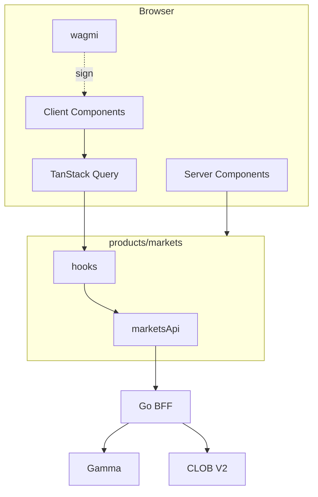

# WEB TEST STRATEGY

**Status:** reviewed
**Owner:** platform-orchestrator
**Last updated:** 2026-07-25
**Product:** RetroPick Markets V1
**Wave:** 4 — Web architecture and UX

## Description

This document is the web test strategy for RetroPick Markets V1: Vitest, Testing Library, and Playwright pyramid; E2E priority including wallet flows; CI gates; coverage targets; chaos and staleness tests; visual regression; a11y checks; and OpenAPI-tied fixtures.

It sits in Wave 4 as the web-specific twin of the cross-stack testing docs. Tests live colocated or under Markets web test trees; E2E may hit staging BFF or mocked contract fixtures from `schemas/openapi/markets-v1.yaml`. Android has a separate pyramid—green Android does not waive web proof.

Read this before marking Wave 4 UX tasks complete, on every PR touching Markets web, and before release candidates. Prefer ERROR_DEGRADED_AND_RECOVERY_UX for which journey rows to automate and MASTER_TEST_PLAN for launch exit criteria.

It excludes weakening freshness or unknown-order asserts to go green, committing private keys for E2E, claiming coverage from skipped tests, and treating staging wallet smoke as optional when release requires it.

## 0. Developer intent (5W+1H)

Short orientation for implementers and agents. Read this before the normative sections below.

| Lens | Answer |
|------|--------|
| **Who** | `qa-integration` / `fe-markets` adding Vitest, Testing Library, Playwright, and a11y checks; CI owners of web Markets jobs; agents proving journeys without weakening assertions. |
| **What** | Web test pyramid, E2E priority (including wallet flows), CI gates, coverage targets, chaos/staleness tests, visual regression, fixture strategy tied to OpenAPI examples. |
| **When** | Before marking Wave 4 UX tasks complete; on every PR touching Markets web; before release candidates. Contract fixtures update when OpenAPI changes. |
| **Where** | Spec: this file. Tests colocated or under web Markets test trees; E2E against staging BFF or mocked contract fixtures. Shared schemas: `schemas/openapi/markets-v1.yaml`. Android has a separate pyramid—do not skip web because Android passed. |
| **Why** | Wallet and money paths regress easily. Tests encode fail-closed rules (stale book, unknown order, eligibility). Green CI is evidence—not a substitute for staging smoke with real connect where required. |
| **How** | Unit: decimals, mappers, FSM helpers. Component: ticket, book, gates. E2E priority: eligibility, discover, connect (harness), preview/sign mock, portfolio. Mock wallet where CI cannot open extensions; keep a manual wallet matrix. Fail CI on a11y critical violations for touched flows. |

### Worked example

**Happy path — PR with ticket change.** Unit tests for price tick validation; component test that stale freshness disables submit; Playwright journey from market page to preview modal with fixture orderbook + preview response. OpenAPI example JSON drives mocks so Android contract tests stay aligned.

**Happy path — OpenAPI bump.** Regenerate types; update fixtures; contract consumer tests fail until handlers/UI updated—fix UI or follow backend, do not loosen fixture.

**Failure / degraded.** Flaky WS E2E → prefer deterministic REST+fake WS clock over sleep. Weakening expect(filled) to pass on timeout → forbidden; assert unknown/reconciling instead. Visual snapshots failing from intentional token change → update snapshots consciously in same PR.

### Coverage expectations (guidance)

| Layer | Focus |
|-------|--------|
| Unit | `Money`/`DecimalString`, freshness, idempotency header helpers |
| Component | Gates, ticket, errors J14/J18 |
| E2E | J01, J03, J07 happy + unknown, funding track happy |
| A11y | Preview modal, eligibility, degraded banner |
| Visual | Tokens on ticket/book |

### Release gate mindset

Do not mark harness tasks complete because “wiring exists.” Tests must exercise degraded rows from ERROR_DEGRADED_AND_RECOVERY_UX. Staging wallet smoke remains a human gate when CI uses mocks.

### Fixture sources of truth

1. OpenAPI `examples` in `schemas/openapi/markets-v1.yaml`
2. Realtime JSON schema fixtures for WS frames
3. Recorded staging redacted traces (optional, no secrets)

### CI job expectations

| Job | Blocks merge |
|-----|--------------|
| Unit + component | Yes |
| Lint/typecheck | Yes |
| Playwright smoke (mocked wallet) | Yes when markets paths touched |
| Visual | As configured; update deliberately |
| Manual wallet matrix | Release gate |

### Agent anti-patterns

- Deleting failing assertions on freshness.
- Committing `.env` with private keys for E2E.
- “Snapshot everything” without reviewing diffs.
- Claiming coverage from skipped tests.

### Success signal

A ticket regression that allows submit on stale books fails CI before merge.

## 1. Purpose

Unit, integration, contract, E2E, a11y, visual regression for Markets web.

## 2. Scope

### In scope

- RetroPick Markets web (`apps/web/src/products/markets/`).
- Next.js App Router target; interim Vite + `marketsRoutes.tsx`.
- TanStack Query, wagmi wallet connector, OpenAPI codegen.

### Out of scope

Current Markets V1 authority: `.harness/products/markets-v1/governance/AGENT_OPERATING_CONTRACT.md`.
- Android ([android/](../android/)).

## 3. Prerequisites

- [00_DOCUMENT_MAP.md](../00_DOCUMENT_MAP.md)
- [WEB_APPLICATION_ARCHITECTURE.md](./WEB_APPLICATION_ARCHITECTURE.md)
- [backend/API_AND_REALTIME_CONTRACTS.md](../backend/API_AND_REALTIME_CONTRACTS.md)
- [schemas/openapi/markets-v1.yaml](../../../schemas/openapi/markets-v1.yaml)
- Reference code: `MarketsHomePage.tsx`, `marketsRoutes.tsx`, `api/marketsApi.ts`, `hooks/useMarketsPlatform.ts`

## 4. Authoritative sources

| Source | Location | Confidence |
|--------|----------|------------|
| OpenAPI | `schemas/openapi/markets-v1.yaml` | verified |
| Polymarket docs | https://docs.polymarket.com/ | partially verified |
| Wallet ADR | [ADR-003](../architecture/adr/ADR-003-WALLET-AND-SIGNING-MODEL.md) | verified |
| BFF ADR | [ADR-002](../architecture/adr/ADR-002-POLYMARKET-ANTI-CORRUPTION-LAYER.md) | verified |
| Realtime ADR | [ADR-005](../architecture/adr/ADR-005-REALTIME-AND-RECONCILIATION.md) | verified |
| Failure domains | [FAILURE_DOMAINS_AND_DEGRADED_MODES.md](../architecture/FAILURE_DOMAINS_AND_DEGRADED_MODES.md) | reviewed |
| Order lifecycle | [polymarket/ORDER_LIFECYCLE.md](../polymarket/ORDER_LIFECYCLE.md) | reviewed |
| Market data | [polymarket/MARKET_DATA_AND_REALTIME.md](../polymarket/MARKET_DATA_AND_REALTIME.md) | reviewed |
| Positions | [polymarket/POSITIONS_CTF_AND_REDEMPTION.md](../polymarket/POSITIONS_CTF_AND_REDEMPTION.md) | reviewed |
| Funding | [polymarket/FUNDS_DEPOSIT_AND_WITHDRAWAL.md](../polymarket/FUNDS_DEPOSIT_AND_WITHDRAWAL.md) | reviewed |

## 5. Current state

`apps/web/src/test/` exists; no Markets-specific tests.

## 6. Target design

### 6.1 Pyramid

| Layer | Tool |
|-------|------|
| Unit | Vitest — decimal, ticket math |
| Component | RTL — ticket, banners |
| Integration | MSW — hooks + api |
| Contract | OpenAPI mock server |
| E2E | Playwright — 18 journeys |
| a11y | axe-playwright |

### 6.2 E2E priority

P0: J01, J02, J04, J05, J07, J13, J15, J16, J18.

### 6.3 Wallet E2E

Anvil fork + test wallet; no mainnet.

### 6.4 CI

`npm run test` + `test:e2e:markets` on `products/markets/` changes.

### 6.5 Coverage targets

`lib/decimal` 100%; `features/trading` 85%.

### 6.6 Chaos

MSW 502 → degraded banner, submit disabled.

### 6.7 Visual

Chromatic on RetroPick tokens only.

### 6.8 Fixtures

Golden preview hashes in `schemas/fixtures/orders/`.

## 7. Alternatives considered

| Alternative | Rejected because |
|-------------|------------------|
| Browser → Gamma/CLOB direct | ADR-002: ACL, secrets, degraded cache |
| Polymarket pixel clone | ADR-007: trademark, clean-room |
| Server-side order signing | ADR-003: non-custodial |
| `number` for USDC | 6-decimal precision loss |

## 8. Decisions

- BFF-only production API ([ADR-002](../architecture/adr/ADR-002-POLYMARKET-ANTI-CORRUPTION-LAYER.md)).
- Preview `contentHash` before sign ([ADR-003](../architecture/adr/ADR-003-WALLET-AND-SIGNING-MODEL.md)).
- OpenAPI parity with Android ([ADR-004](../architecture/adr/ADR-004-SHARED-WEB-ANDROID-API.md)).
- WS + REST book fallback ([ADR-005](../architecture/adr/ADR-005-REALTIME-AND-RECONCILIATION.md)).

## 9. Data and control flows

## 10. Failure and recovery

- Fail closed on unknown eligibility.
- `stale: true` degraded banners with timestamp.
- `capabilities.trading: false` disables ticket.
- No silent order resubmission — reconcile first (J18).
- See [ERROR_DEGRADED_AND_RECOVERY_UX.md](./ERROR_DEGRADED_AND_RECOVERY_UX.md).

## 11. Security

- No private-key custody ([security/SIGNING_AND_TRANSACTION_INTEGRITY.md](../security/SIGNING_AND_TRANSACTION_INTEGRITY.md)).
- CSP on deploy; DOMPurify for rules HTML.
- Analytics redact wallet addresses.

## 12. Observability

- RUM: LCP, INP, CLS on market and ticket pages.
- Events: `markets_journey_step`, `markets_error`, `markets_degraded`.
- `x-request-id` on error surfaces.

## 13. Test strategy

- [WEB_TEST_STRATEGY.md](./WEB_TEST_STRATEGY.md)
- [testing/MASTER_TEST_PLAN.md](../testing/MASTER_TEST_PLAN.md)

## 14. Rollout and rollback

- `NEXT_PUBLIC_PRODUCT=markets` ([deploy/web-markets/.env.example](../../../deploy/web-markets/.env.example)).
- [platform/RELEASE_ROLLBACK_AND_CHANGE_MANAGEMENT.md](../platform/RELEASE_ROLLBACK_AND_CHANGE_MANAGEMENT.md)

## 15. Open questions

- [research/OPEN_QUESTIONS_AND_EXPIRING_ASSUMPTIONS.md](../research/OPEN_QUESTIONS_AND_EXPIRING_ASSUMPTIONS.md)

## 16. Acceptance criteria

- [../../../.harness/products/markets-v1/planning/REQUIREMENTS_TO_TASK_TRACEABILITY.md](../../../.harness/products/markets-v1/planning/REQUIREMENTS_TO_TASK_TRACEABILITY.md)
- 18 master-prompt §10 journeys in ERROR doc with screen-state tables.

## 17. Test registry

See Appendix E in peer docs; `e2e-j01`…`e2e-j18`.

## 18. Release gate

[testing/RELEASE_VERIFICATION_MATRIX.md](../testing/RELEASE_VERIFICATION_MATRIX.md).

## Appendix A — OpenAPI to hook mapping

| operationId | Method | Path | Hook | Phase |
|-------------|--------|------|------|-------|
| getMarketsEligibility | GET | /markets/eligibility | useMarketsEligibility | 1 |
| getMarketsCapabilities | GET | /markets/capabilities | useMarketsCapabilities | 1 |
| listMarketsEvents | GET | /markets/events | useMarketsEvents | 1 |
| getMarketsEvent | GET | /markets/events/{eventId} | useMarketsEvent | 1 |
| getMarketsMarket | GET | /markets/markets/{marketId} | useMarketsMarket | 1 |
| getMarketsOrderBook | GET | /markets/markets/{marketId}/book | useMarketsOrderBook | 1 |
| getMarketsPriceHistory | GET | /markets/markets/{marketId}/history | useMarketsHistory | 1 |
| postMarketsOrderPreview | POST | /markets/orders/preview | useOrderPreview | 3 |
| postMarketsOrderSubmit | POST | /markets/orders | useOrderSubmit | 3 |
| deleteMarketsOrder | DELETE | /markets/orders/{orderId} | useOrderCancel | 3 |
| listMarketsOrders | GET | /markets/me/orders | useOpenOrders | 3 |
| listMarketsPositions | GET | /markets/me/positions | usePositions | 4 |
| listMarketsActivity | GET | /markets/me/activity | useActivity | 4 |
| getMarketsWallets | GET | /markets/me/wallets | useTradingWallets | 2 |
| postMarketsFundingQuote | POST | /markets/funding/quote | useFundingQuote | 2 |
| postMarketsWithdraw | POST | /markets/funding/withdraw | useWithdraw | 4 |
| postMarketsRedeemPreview | POST | /markets/redeem/preview | useRedeemPreview | 4 |

## Appendix B — Component inventory

| Component | Feature | Responsibility |
|-----------|---------|----------------|
| MarketsShell | layout | Nav, eligibility banner |
| DiscoverGrid | catalog | Event cards |
| MarketBook | trading | Bid/ask ladder |
| OrderTicket | trading | Limit order form |
| PreviewModal | wallet | Sign preview + hash |
| PortfolioTable | portfolio | Positions |
| FundingWizard | funding | Deposit flow |
| DegradedBanner | shared | Stale/outage |
| ChainGuard | wallet | Polygon 137 |
| UnknownOrderPanel | trading | J18 reconcile |

## Appendix C — Web phase gates

| Phase | Deliverable |
|-------|-------------|
| PHASE-1 | MarketsHomePage, events, eligibility |
| PHASE-2 | Wallet connect, SIWE, funding |
| PHASE-3 | Book WS, ticket, orders |
| PHASE-4 | Portfolio, redeem, withdraw |
| PHASE-6 | Next.js migration, E2E suite |
## Appendix D — Requirements traceability samples

| REQ-ID | Scope | Verification |
|--------|-------|-------------|
| REQ-WEB-P1-00 | PHASE-1 capability | Unit + E2E where applicable |
| REQ-WEB-P1-01 | PHASE-1 capability | Unit + E2E where applicable |
| REQ-WEB-P1-02 | PHASE-1 capability | Unit + E2E where applicable |
| REQ-WEB-P1-03 | PHASE-1 capability | Unit + E2E where applicable |
| REQ-WEB-P1-04 | PHASE-1 capability | Unit + E2E where applicable |
| REQ-WEB-P1-05 | PHASE-1 capability | Unit + E2E where applicable |
| REQ-WEB-P1-06 | PHASE-1 capability | Unit + E2E where applicable |
| REQ-WEB-P1-07 | PHASE-1 capability | Unit + E2E where applicable |
| REQ-WEB-P1-08 | PHASE-1 capability | Unit + E2E where applicable |
| REQ-WEB-P1-09 | PHASE-1 capability | Unit + E2E where applicable |
| REQ-WEB-P1-10 | PHASE-1 capability | Unit + E2E where applicable |
| REQ-WEB-P1-11 | PHASE-1 capability | Unit + E2E where applicable |
| REQ-WEB-P2-00 | PHASE-2 capability | Unit + E2E where applicable |
| REQ-WEB-P2-01 | PHASE-2 capability | Unit + E2E where applicable |
| REQ-WEB-P2-02 | PHASE-2 capability | Unit + E2E where applicable |
| REQ-WEB-P2-03 | PHASE-2 capability | Unit + E2E where applicable |
| REQ-WEB-P2-04 | PHASE-2 capability | Unit + E2E where applicable |
| REQ-WEB-P2-05 | PHASE-2 capability | Unit + E2E where applicable |
| REQ-WEB-P2-06 | PHASE-2 capability | Unit + E2E where applicable |
| REQ-WEB-P2-07 | PHASE-2 capability | Unit + E2E where applicable |
| REQ-WEB-P2-08 | PHASE-2 capability | Unit + E2E where applicable |
| REQ-WEB-P2-09 | PHASE-2 capability | Unit + E2E where applicable |
| REQ-WEB-P2-10 | PHASE-2 capability | Unit + E2E where applicable |
| REQ-WEB-P2-11 | PHASE-2 capability | Unit + E2E where applicable |
| REQ-WEB-P3-00 | PHASE-3 capability | Unit + E2E where applicable |
| REQ-WEB-P3-01 | PHASE-3 capability | Unit + E2E where applicable |
| REQ-WEB-P3-02 | PHASE-3 capability | Unit + E2E where applicable |
| REQ-WEB-P3-03 | PHASE-3 capability | Unit + E2E where applicable |
| REQ-WEB-P3-04 | PHASE-3 capability | Unit + E2E where applicable |
| REQ-WEB-P3-05 | PHASE-3 capability | Unit + E2E where applicable |
| REQ-WEB-P3-06 | PHASE-3 capability | Unit + E2E where applicable |
| REQ-WEB-P3-07 | PHASE-3 capability | Unit + E2E where applicable |
| REQ-WEB-P3-08 | PHASE-3 capability | Unit + E2E where applicable |
| REQ-WEB-P3-09 | PHASE-3 capability | Unit + E2E where applicable |
| REQ-WEB-P3-10 | PHASE-3 capability | Unit + E2E where applicable |
| REQ-WEB-P3-11 | PHASE-3 capability | Unit + E2E where applicable |
| REQ-WEB-P4-00 | PHASE-4 capability | Unit + E2E where applicable |
| REQ-WEB-P4-01 | PHASE-4 capability | Unit + E2E where applicable |
| REQ-WEB-P4-02 | PHASE-4 capability | Unit + E2E where applicable |
| REQ-WEB-P4-03 | PHASE-4 capability | Unit + E2E where applicable |
| REQ-WEB-P4-04 | PHASE-4 capability | Unit + E2E where applicable |
| REQ-WEB-P4-05 | PHASE-4 capability | Unit + E2E where applicable |
| REQ-WEB-P4-06 | PHASE-4 capability | Unit + E2E where applicable |
| REQ-WEB-P4-07 | PHASE-4 capability | Unit + E2E where applicable |
| REQ-WEB-P4-08 | PHASE-4 capability | Unit + E2E where applicable |
| REQ-WEB-P4-09 | PHASE-4 capability | Unit + E2E where applicable |
| REQ-WEB-P4-10 | PHASE-4 capability | Unit + E2E where applicable |
| REQ-WEB-P4-11 | PHASE-4 capability | Unit + E2E where applicable |
| REQ-WEB-P5-00 | PHASE-5 capability | Unit + E2E where applicable |
| REQ-WEB-P5-01 | PHASE-5 capability | Unit + E2E where applicable |
| REQ-WEB-P5-02 | PHASE-5 capability | Unit + E2E where applicable |
| REQ-WEB-P5-03 | PHASE-5 capability | Unit + E2E where applicable |
| REQ-WEB-P5-04 | PHASE-5 capability | Unit + E2E where applicable |
| REQ-WEB-P5-05 | PHASE-5 capability | Unit + E2E where applicable |
| REQ-WEB-P5-06 | PHASE-5 capability | Unit + E2E where applicable |
| REQ-WEB-P5-07 | PHASE-5 capability | Unit + E2E where applicable |
| REQ-WEB-P5-08 | PHASE-5 capability | Unit + E2E where applicable |
| REQ-WEB-P5-09 | PHASE-5 capability | Unit + E2E where applicable |
| REQ-WEB-P5-10 | PHASE-5 capability | Unit + E2E where applicable |
| REQ-WEB-P5-11 | PHASE-5 capability | Unit + E2E where applicable |
| REQ-WEB-P6-00 | PHASE-6 capability | Unit + E2E where applicable |
| REQ-WEB-P6-01 | PHASE-6 capability | Unit + E2E where applicable |
| REQ-WEB-P6-02 | PHASE-6 capability | Unit + E2E where applicable |
| REQ-WEB-P6-03 | PHASE-6 capability | Unit + E2E where applicable |
| REQ-WEB-P6-04 | PHASE-6 capability | Unit + E2E where applicable |
| REQ-WEB-P6-05 | PHASE-6 capability | Unit + E2E where applicable |
| REQ-WEB-P6-06 | PHASE-6 capability | Unit + E2E where applicable |
| REQ-WEB-P6-07 | PHASE-6 capability | Unit + E2E where applicable |
| REQ-WEB-P6-08 | PHASE-6 capability | Unit + E2E where applicable |
| REQ-WEB-P6-09 | PHASE-6 capability | Unit + E2E where applicable |
| REQ-WEB-P6-10 | PHASE-6 capability | Unit + E2E where applicable |
| REQ-WEB-P6-11 | PHASE-6 capability | Unit + E2E where applicable |
| REQ-WEB-P7-00 | PHASE-7 capability | Unit + E2E where applicable |
| REQ-WEB-P7-01 | PHASE-7 capability | Unit + E2E where applicable |
| REQ-WEB-P7-02 | PHASE-7 capability | Unit + E2E where applicable |
| REQ-WEB-P7-03 | PHASE-7 capability | Unit + E2E where applicable |
| REQ-WEB-P7-04 | PHASE-7 capability | Unit + E2E where applicable |
| REQ-WEB-P7-05 | PHASE-7 capability | Unit + E2E where applicable |
| REQ-WEB-P7-06 | PHASE-7 capability | Unit + E2E where applicable |
| REQ-WEB-P7-07 | PHASE-7 capability | Unit + E2E where applicable |
| REQ-WEB-P7-08 | PHASE-7 capability | Unit + E2E where applicable |
| REQ-WEB-P7-09 | PHASE-7 capability | Unit + E2E where applicable |
| REQ-WEB-P7-10 | PHASE-7 capability | Unit + E2E where applicable |
| REQ-WEB-P7-11 | PHASE-7 capability | Unit + E2E where applicable |
| REQ-WEB-P8-00 | PHASE-8 capability | Unit + E2E where applicable |
| REQ-WEB-P8-01 | PHASE-8 capability | Unit + E2E where applicable |
| REQ-WEB-P8-02 | PHASE-8 capability | Unit + E2E where applicable |
| REQ-WEB-P8-03 | PHASE-8 capability | Unit + E2E where applicable |
| REQ-WEB-P8-04 | PHASE-8 capability | Unit + E2E where applicable |
| REQ-WEB-P8-05 | PHASE-8 capability | Unit + E2E where applicable |
| REQ-WEB-P8-06 | PHASE-8 capability | Unit + E2E where applicable |
| REQ-WEB-P8-07 | PHASE-8 capability | Unit + E2E where applicable |
| REQ-WEB-P8-08 | PHASE-8 capability | Unit + E2E where applicable |
| REQ-WEB-P8-09 | PHASE-8 capability | Unit + E2E where applicable |
| REQ-WEB-P8-10 | PHASE-8 capability | Unit + E2E where applicable |
| REQ-WEB-P8-11 | PHASE-8 capability | Unit + E2E where applicable |

| REQ-WEB-EXTRA | Cross-cutting | Manual QA |

| REQ-WEB-EXTRA | Cross-cutting | Manual QA |

| REQ-WEB-EXTRA | Cross-cutting | Manual QA |

| REQ-WEB-EXTRA | Cross-cutting | Manual QA |

| REQ-WEB-EXTRA | Cross-cutting | Manual QA |

| REQ-WEB-EXTRA | Cross-cutting | Manual QA |

| REQ-WEB-EXTRA | Cross-cutting | Manual QA |

| REQ-WEB-EXTRA | Cross-cutting | Manual QA |

| REQ-WEB-EXTRA | Cross-cutting | Manual QA |

| REQ-WEB-EXTRA | Cross-cutting | Manual QA |

| REQ-WEB-EXTRA | Cross-cutting | Manual QA |

| REQ-WEB-EXTRA | Cross-cutting | Manual QA |

| REQ-WEB-EXTRA | Cross-cutting | Manual QA |

| REQ-WEB-EXTRA | Cross-cutting | Manual QA |

| REQ-WEB-EXTRA | Cross-cutting | Manual QA |

| REQ-WEB-EXTRA | Cross-cutting | Manual QA |

| REQ-WEB-EXTRA | Cross-cutting | Manual QA |

| REQ-WEB-EXTRA | Cross-cutting | Manual QA |

| REQ-WEB-EXTRA | Cross-cutting | Manual QA |

| REQ-WEB-EXTRA | Cross-cutting | Manual QA |

| REQ-WEB-EXTRA | Cross-cutting | Manual QA |

| REQ-WEB-EXTRA | Cross-cutting | Manual QA |

| REQ-WEB-EXTRA | Cross-cutting | Manual QA |

| REQ-WEB-EXTRA | Cross-cutting | Manual QA |

| REQ-WEB-EXTRA | Cross-cutting | Manual QA |

| REQ-WEB-EXTRA | Cross-cutting | Manual QA |

| REQ-WEB-EXTRA | Cross-cutting | Manual QA |

| REQ-WEB-EXTRA | Cross-cutting | Manual QA |

| REQ-WEB-EXTRA | Cross-cutting | Manual QA |

| REQ-WEB-EXTRA | Cross-cutting | Manual QA |

| REQ-WEB-EXTRA | Cross-cutting | Manual QA |

| REQ-WEB-EXTRA | Cross-cutting | Manual QA |

| REQ-WEB-EXTRA | Cross-cutting | Manual QA |

| REQ-WEB-EXTRA | Cross-cutting | Manual QA |

| REQ-WEB-EXTRA | Cross-cutting | Manual QA |

| REQ-WEB-EXTRA | Cross-cutting | Manual QA |

| REQ-WEB-EXTRA | Cross-cutting | Manual QA |
