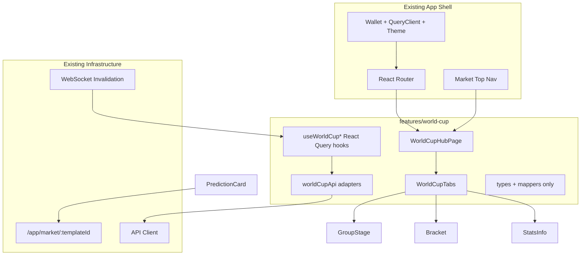

# World Cup Frontend Integration Plan

## Constraints (from your choices)

- **Data**: Full API integration required in this pass (not static-only mock UI).
- **Location**: Refactor into [`apps/fe-v1/src/features/world-cup/`](apps/fe-v1/src/features/world-cup/) as the canonical feature module.
- **Non-goals**: No duplicate `QueryClient`, wallet providers, or app roots; do not replace the existing app shell.

## Phase 0 — Architecture discovery (run first when repo is readable)

Before moving code, map these existing touchpoints in [`apps/fe-v1/`](apps/fe-v1/):

| Area | What to find | Why it matters |
|------|----------------|----------------|
| App shell | `main.tsx`, root layout, `App.tsx` or router outlet | Mount `WorldCupHubPage` inside existing providers |
| Router | React Router config (likely under `src/routes/` or `src/app/`) | Add `/app/world-cup/*` nested routes |
| Top nav | Market discovery header (Trending, World Cup, logo section) | Ensure World Cup entry links to hub; add sub-nav below it |
| API client | `src/api/`, `src/lib/api/`, or shared package client | Add World Cup endpoints using same auth/error typing |
| React Query | `src/queries/`, `useQuery` hooks, query key factory | Add `["worldCup", ...]` keys |
| WebSocket | invalidation subscriber (often near market queries) | Invalidate World Cup queries on market updates |
| Market detail | `/app/market/:templateId` page + card mapping helpers | Reuse for prediction card navigation |
| Styling | Tailwind config, shared UI primitives (`Button`, `Card`, `Tabs`) | Match RetroPick dark/blue premium look |
| Packages | root `pnpm-workspace`, `@retropick/*` shared types | Extend types if backend exposes World Cup DTOs |

**Backend API discovery** (required for your data choice): search the monorepo for World Cup routes/DTOs, e.g. `world-cup`, `worldCup`, `popular-global-events`, `LADDER`, `templateId`. Document endpoint paths, response shapes, and whether group stats / matches / markets are separate resources or nested.



## Proposed feature module layout

Create [`apps/fe-v1/src/features/world-cup/`](apps/fe-v1/src/features/world-cup/) with:

```
features/world-cup/
  pages/
    WorldCupHubPage.tsx          # layout + outlet for tab routes
  components/
    WorldCupTabs.tsx             # lower sub-navbar (scrollable on mobile)
    WorldCupGroupStage.tsx
    WorldCupRoundOf32.tsx
    WorldCupQuarterFinal.tsx
    WorldCupWinner.tsx
    WorldCupBracket.tsx
    WorldCupStatsInfo.tsx
    WorldCupGroupCard.tsx
    WorldCupMatchCard.tsx
    WorldCupPredictionCard.tsx
    WorldCupMarketCard.tsx
    WorldCupAwardsSpecials.tsx   # existing section preserved
    MatchesAndFutures.tsx        # extract/reuse from standalone UI if present
  api/
    worldCupApi.ts               # getWorldCupMarkets, getWorldCupGroups, ...
    mapWorldCupMarketToMarketCard.ts
  hooks/
    useWorldCupMarkets.ts
    useWorldCupGroups.ts
    useWorldCupMatches.ts
    useWorldCupGroupStats.ts
    useWorldCupMarketByTeam.ts
  types/
    worldCup.types.ts            # LADDER outcomes, market status, DTOs
  config/
    worldCupOutcomes.ts          # canonical 7 ladder outcomes (not random UI literals)
  index.ts                       # public exports for routes
```

**Source migration**: Lift UI from [`apps/fe-v1/src/.popular-global-events/world_cup/`](apps/fe-v1/src/.popular-global-events/world_cup/) into the structure above. Keep the dot-folder only as a thin re-export shim temporarily (or remove after migration) to avoid broken imports.

## Routing integration

Add a **nested route group** under the existing `/app` layout (same parent as markets/portfolio):

| Path | Component | Notes |
|------|-----------|-------|
| `/app/world-cup` | redirect → `group-stage` | default tab |
| `/app/world-cup/group-stage` | `WorldCupGroupStage` | |
| `/app/world-cup/round-of-32` | `WorldCupRoundOf32` | |
| `/app/world-cup/quarter-final` | `WorldCupQuarterFinal` | |
| `/app/world-cup/winner` | `WorldCupWinner` | World Cup Winner tab |
| `/app/world-cup/bracket` | `WorldCupBracket` | new bracket prediction UI |
| `/app/world-cup/stats` | `WorldCupStatsInfo` | stats hub tab |

**Hub layout** (`WorldCupHubPage`):

1. Existing top market nav (Trending / World Cup / logo) — unchanged shell.
2. **World Cup sub-navbar** (`WorldCupTabs`) directly under World Cup section.
3. `<Outlet />` for active tab content.

Use `NavLink` + active styles consistent with existing tab patterns. On mobile: `overflow-x-auto`, `flex-nowrap`, `scrollbar-hide` (or equivalent existing utility).

## Navigation / UX

### Lower sub-navbar tabs (exact labels)

1. Group Stage
2. Round of 32
3. Quarter Final
4. World Cup Winner
5. Bracket
6. Stats & Info

Copy tone: **Predict**, **Progression**, **Market**, **Forecast**, **Path**, **Group Winner** — avoid bet-slip/casino language.

### Stats & Info tab composition

Vertical section order on the hub-style page:

1. **Matches & Futures** (existing standalone section — preserve)
2. **Stats & Info** (`WorldCupStatsInfo`) — **new**, positioned here
3. **Awards & Specials** (`WorldCupAwardsSpecials`)

`WorldCupStatsInfo` content per group:

- Group table: P / W / D / L / GF / GA / Pts
- Team list with prediction percentages
- Upcoming matches (`WorldCupMatchCard`)
- “Predict Group Winner” CTA
- `WorldCupPredictionCard` / `WorldCupMarketCard` → `navigate(/app/market/${templateId})`

### Bracket tab

- Render tournament bracket lanes (group → knockout path).
- Each team node links to its **Tournament Progression Ladder** market (7 outcomes).
- Read-only bracket state from API where available; interactions route to market detail for predictions.

## Data model and API layer

### Domain types (`worldCup.types.ts`)

```ts
marketType: "LADDER"
status: "open" | "locked" | "resolved" // align with backend enum
outcomes: [
  "eliminated_group",
  "round_of_32",
  "round_of_16",
  "quarter_final",
  "semi_final",
  "final",
  "champion",
]
```

Each market DTO should include: `templateId`, `slug`, `teamCode`, `teamName`, `group`, `lockTime`, `outcomes`, `status`, `route`.

**Product rule in UI**: never show edit/delete outcome controls; display lock/resolution state only.

### Adapter functions (`worldCupApi.ts`)

Implement using the **existing API client** (same base URL, headers, error handling):

- `getWorldCupMarkets()`
- `getWorldCupGroups()`
- `getWorldCupMatches()`
- `getWorldCupGroupStats()`
- `getWorldCupMarketByTeam(teamCode)`
- `mapWorldCupMarketToMarketCard(market)` → shape expected by shared `MarketCard` if one exists

If backend returns paginated or nested payloads, normalize in adapters (not in components).

### React Query hooks

| Hook | Query key | staleTime |
|------|-----------|-----------|
| `useWorldCupMarkets` | `["worldCup", "markets"]` | match existing market list hooks |
| `useWorldCupGroups` | `["worldCup", "groups"]` | |
| `useWorldCupMatches` | `["worldCup", "matches"]` | |
| `useWorldCupGroupStats` | `["worldCup", "stats", groupId?]` | |
| `useWorldCupMarketByTeam` | `["worldCup", "market", teamCode]` | |

Use existing `queryClient` instance from app providers. Follow any existing `queryKeys` factory pattern for consistency.

### WebSocket invalidation

Extend the existing market invalidation handler (do **not** create a second socket):

- On market/template update events, call `queryClient.invalidateQueries({ queryKey: ["worldCup"] })` or narrower keys when event carries `templateId` / `teamCode`.
- Mirror how standard market list/detail queries are invalidated today.

## Component refactor rules (from standalone UI)

When porting from [`.popular-global-events/world_cup/`](apps/fe-v1/src/.popular-global-events/world_cup/):

1. **Remove** standalone `BrowserRouter` / duplicate providers if present.
2. **Replace** inline hardcoded teams/matches/markets with hook-driven data.
3. **Swap** custom layout chrome for app shell + `WorldCupHubPage`.
4. **Reuse** existing primitives: buttons, cards, badges, skeletons, empty/error states.
5. **Keep** visual hierarchy (compact tappable cards, dark/blue palette) but align tokens/classes with app-wide Tailwind theme.
6. **Extract** repeated card markup into `WorldCupGroupCard`, `WorldCupMatchCard`, `WorldCupPredictionCard`, `WorldCupMarketCard`.

## Package / build configuration

Inspect before changing:

- [`apps/fe-v1/package.json`](apps/fe-v1/package.json) — add deps only if standalone UI introduced something missing (prefer existing icon/date libs).
- [`apps/fe-v1/tsconfig.json`](apps/fe-v1/tsconfig.json) / `vite.config.ts` — add `@/features/world-cup` alias only if project already uses path aliases; otherwise use relative imports consistent with codebase.
- Shared types: if backend DTOs live in a workspace package (e.g. `@retropick/types`), import from there instead of duplicating.

**Verification commands** (post-implementation):

```bash
pnpm install
pnpm --filter fe-v1 build
pnpm --filter fe-v1 lint
pnpm --filter fe-v1 typecheck   # if script exists
```

## Implementation sequence

1. **Discover** router, nav, API client, WS invalidation, and World Cup backend endpoints (document paths + DTOs).
2. **Scaffold** `src/features/world-cup/` types + API adapters + hooks (API-first).
3. **Add routes** under `/app/world-cup/*` inside existing `/app` layout.
4. **Wire top nav** World Cup entry → `/app/world-cup/group-stage`.
5. **Build** `WorldCupHubPage` + `WorldCupTabs` (responsive scroll).
6. **Port tab pages** from standalone UI (Group Stage → Winner).
7. **Implement** `WorldCupBracket` tab.
8. **Implement** `WorldCupStatsInfo` between Matches & Futures and Awards & Specials.
9. **Connect** prediction/market cards → `/app/market/:templateId`.
10. **Hook WebSocket** invalidation for `worldCup` query keys.
11. **Delete or shim** old `.popular-global-events/world_cup/` imports.
12. **Run** build/lint/typecheck; fix import/type errors.

## Acceptance checklist

- [ ] `/app/world-cup/*` reachable from existing top nav
- [ ] All original `/app` routes still work
- [ ] Single provider tree (no duplicate `QueryClient` / wallet)
- [ ] Lower sub-navbar with 6 tabs; mobile horizontal scroll
- [ ] Bracket tab renders bracket prediction interface
- [ ] Stats & Info sits below Matches & Futures, above Awards & Specials
- [ ] Cards route to `/app/market/:templateId`
- [ ] LADDER markets show 7 fixed outcomes; lock/resolve states respected
- [ ] Data from backend via adapters (not hardcoded in components)
- [ ] `pnpm build` and `pnpm lint` pass

## Risks and open verification items

These must be confirmed in Phase 0 once file access works:

- Exact backend endpoint paths and whether `getWorldCupGroupStats` is one endpoint or composed.
- Whether `mapWorldCupMarketToMarketCard` can reuse an existing `MarketCard` mapper or needs a thin adapter.
- Current World Cup top-nav behavior (link target, active state) to avoid duplicate navigation.
- Whether bracket data is API-driven or partially client-derived from match results.

## Expected file touch list (approximate)

- **New**: `src/features/world-cup/**` (pages, components, api, hooks, types)
- **Edit**: router config, app layout nav, API client module, WS invalidation handler, possibly shared types package
- **Migrate/deprecate**: `src/.popular-global-events/world_cup/**`
