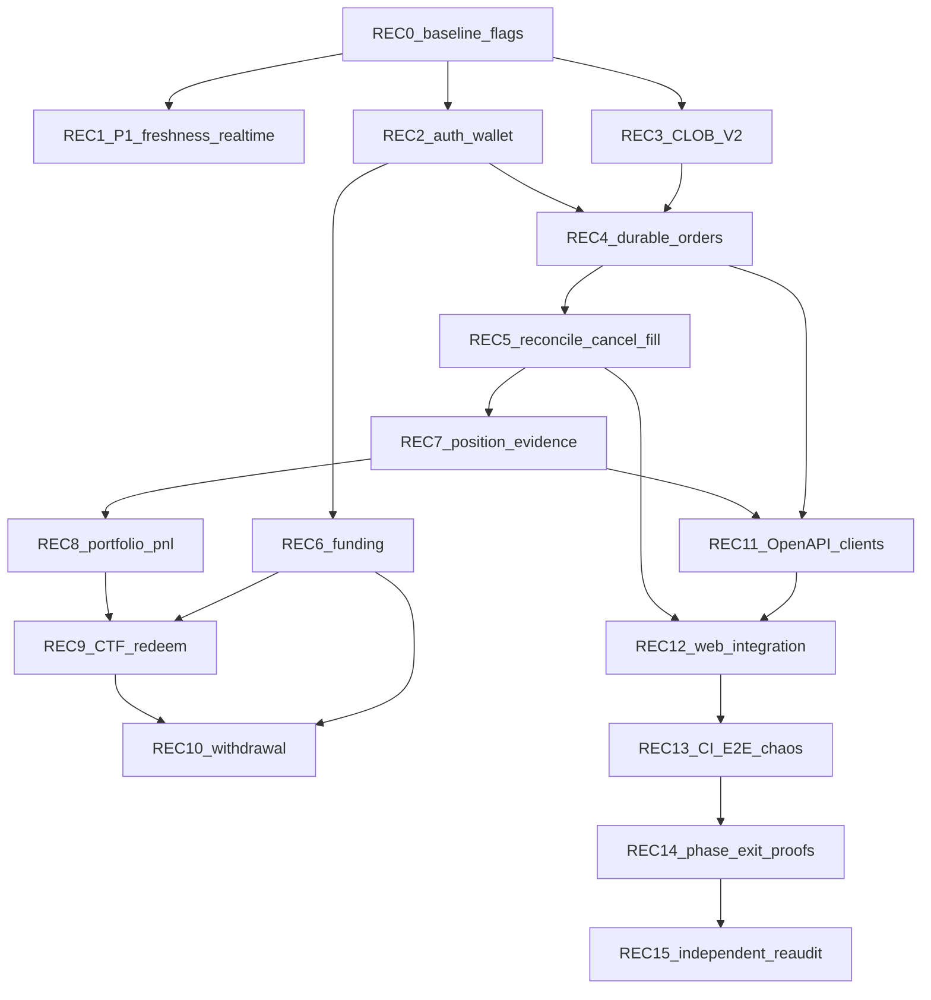

# Markets V1 Phase 1–4 Recovery, Completion & System-Proof

## Authority and baseline

- **Audit authority:** [`../../../../../../../.harness/products/markets-v1/evidence/verification/phase/RETROPICK-P1-P4-SYSTEM-AUDIT.md`](../../../../../../../.harness/products/markets-v1/evidence/verification/phase/RETROPICK-P1-P4-SYSTEM-AUDIT.md) (verdict **NO-GO**; findings COR/SEC/REL/TST + QA-001…020).
- **Program brief:** [`.dev/prompt/RETROPICK MARKETS V1 — PHASE 1–4 RECOVERY, COMPLETION & SYSTEM-PROOF PROGRAM.md`](.dev/prompt/RETROPICK%20MARKETS%20V1%20—%20PHASE%201–4%20RECOVERY,%20COMPLETION%20&%20SYSTEM-PROOF%20PROGRAM.md).
- **Recommended remediation base:** committed `main` @ `3ec4425a3cb57ff473999a234dfef94b3c6d2c38` in worktree `/home/asyam/dev/set-up/projects/retropick` (matches audit clean baseline; currently tracks `origin/main`).
- **Branch strategy:** create `recovery/p1-p4-system-proof` from that SHA; never force-reset `main`; do not discard unrelated dirty `.dev` verification files already present.
- **Do not advance** [`implementation-manifest.yaml`](../../../../../../../.harness/products/markets-v1/planning/implementation-manifest.yaml) `current_phase` (stays **PHASE-2**) unless explicitly requested after exit proofs.
- **Web truth:** canonical Markets UI is [`apps/web/src/products/markets/`](apps/web/src/products/markets/) (`apps/fe-v1` absent). OpenAPI is [`schemas/openapi/markets-v1.yaml`](schemas/openapi/markets-v1.yaml) **v1.4.0**.
- **ECC / skills:** treat local `ECC/` as read-only methodology; map work to `.agents/skills/*` + harness personas (`be-api`, `be-data`, `fe-markets`, `security`, `qa-integration`) without copying ECC into the repo.

## Hard safety freezes (preserve for entire program)

Until independent verification of the relevant phase:

| Flag / path | Default |
|---|---|
| `MARKETS_ORDER_SUBMIT_ENABLED` | `false` (already default in [`orders/factory.go`](apps/backend/internal/markets/orders/factory.go)) |
| Relayer mutations | OFF |
| CTF / redemption / withdrawal mutations | OFF |
| Live Polymarket CLOB credentials / mainnet submit | human approval only; local = sandbox/httptest |

Read-only Markets (catalog/detail/book) must remain usable while writes stay degraded/off.

## Current truth (revalidated 2026-08-11)

| Area | Status | Evidence |
|---|---|---|
| Order submit | **S0 fail** | Venue HTTP in [`orders/submit.go`](apps/backend/internal/markets/orders/submit.go) **before** persist; in-memory check-then-act [`idempotency.go`](apps/backend/internal/markets/orders/idempotency.go); runtime [`ProjectionStore`](apps/backend/internal/markets/orders/projection_store.go); migration `000021` unwired |
| CLOB V2 | **S1 fail** | Fragile BUY amounts ([`amounts.go`](apps/backend/internal/markets/orders/amounts.go)), timestamp units, builder wire ([`clob/wire.go`](apps/backend/internal/markets/clob/wire.go), [`clob/submit.go`](apps/backend/internal/markets/clob/submit.go)) |
| SIWE | **S1 fail** | Empty `AllowedDomains` → allow any domain ([`auth/config.go`](apps/backend/internal/markets/auth/config.go) `domainAllowed`) |
| Wallet link | **S1 fail** | Client-asserted `AccountWallet` ([`wallet/link.go`](apps/backend/internal/markets/wallet/link.go)) |
| Positions | **Incomplete** | Package exists; **not wired** in `markets-api`; lag overwrite risk remains |
| Funding / portfolio / CTF | **Absent** | No `internal/markets/{funding,portfolio,ctf}` |
| Realtime | **S1 fail** | Web disables polling when `features.realtime` true without WS subscriber ([`MarketDetailPage`](apps/web/src/products/markets/pages/MarketDetailPage.tsx)) |

## Dependency graphs (required)

**Broken edges today:** Preview↛wire equality (V2), Intent↛durable-before-effect, Idempotency↛single venue call, Fill↛safe position precedence, Realtime↛web subscriber, Auth↛fail-closed domain, Wallet↛proven binding, Funding/CTF/Withdraw↛modules.

## Architecture rules (do not violate)

From audit §AJ / program §88:

- Keep Go Markets BFF + Postgres projections; no Kafka/new DB/microservice rewrite.
- One **mutation journal** pattern for orders, funding, CTF, redemption, withdrawal.
- One **evidence-precedence** reconciler (never erase stronger fill evidence with lagging Data API zeros).
- Server owns tick/fee/slippage/preview hash/cost basis/PnL; fixed-point only.
- Official Polymarket V2 fixtures are the merge gate ([`references/polymarket/`](references/polymarket/) + pinned SDK/CLI SHAs).
- Out of scope: Android product program, Smart Money ownership (P4-003/007 stay moved), PRISM/legacy MarketEngine.

## Finding → wave map (no orphans)

| Finding / QA | Severity | Wave |
|---|---|---|
| QA-R0 / harness drift QA-016 | S2 | REC-0 |
| COR-01 / QA-001 / TST-01 | S0 | REC-4 |
| COR-02 / QA-002 / REL-01 | S0 | REC-4 |
| COR-03 / QA-003 / TST-02 | S1 | REC-3 |
| QA-004 preview binding | S1 | REC-3→4 |
| SEC-01 / QA-005 | S1 | REC-2 |
| SEC-02 / QA-006 | S1 | REC-2 |
| COR-04 / QA-007 | S1 | REC-7 |
| COR-05 | S1 | REC-1 |
| COR-06 / QA-008 | S1 | REC-1 |
| COR-08 / QA-009 | S2 | REC-11 |
| TST-04 / QA-010 | S1 | REC-13 |
| QA-011 cancel/fill | S1 | REC-5 |
| QA-012 funding | S1 | REC-6 |
| QA-013 PnL | S1 | REC-8 |
| QA-014 CTF/redeem | S1 | REC-9 |
| QA-015 withdrawal | S1 | REC-10 |
| QA-017/018 E2E/J7–J8 | S2 | REC-12/13 |
| QA-019 observability | S2 | REC-13 (after correctness) |
| QA-020 workspace drift | S2 | REC-0 scoped cleanup only with approval |

Remaining S2–S4 from audit §§AB–AE attach to the same waves (relayer sandbox → REC-6/10; CI zero-test guard → REC-13; fe-v1/submodule → REC-0).

## Task-level completion matrix (40 rows)

| Task | Audit | Action |
|---|---|---|
| MKT-P1-001…010 | Partial/verified mix | REC-1 + REC-11 + exit REC-14; P1-003 keep; P1-005 keep (no signal→order); P1-007 defer Android product |
| MKT-P2-001…005 | Incomplete/partial | REC-2 (+ approvals/balances hardening) |
| MKT-P2-006…009 | Missing/incomplete | REC-6 (+ relayer sandbox) |
| MKT-P2-010 | Blocked | REC-14 |
| MKT-P3-001…005,008 | Regressed/incomplete | REC-3/4/5 |
| MKT-P3-006 | **Archived** | No build |
| MKT-P3-007,009 | Unproven | REC-12 (classify mocked E2E honestly; add system E2E) |
| MKT-P3-010 | Blocked | REC-14 |
| MKT-P4-001,002,009 | Incomplete | REC-7 |
| MKT-P4-003,007 | **Moved** to Smart Money | Do not implement under P4 |
| MKT-P4-004…006,008 | Absent | REC-8/9/10 |
| MKT-P4-010 | Blocked | REC-14 |

## Recovery waves (execution contract)

Each wave: **tests first → implement → review → verify → evidence under** `../../../../../../../.harness/products/markets-v1/evidence/verification/` **→ next**. Microphases preferred (e.g. REC-3A fixtures, 3B amounts, 3C typed-data, 3D preview hash). One writer per `owned_paths`.

### REC-0 — Baseline / lineage / safety / truth
- Freeze mutation flags; document pin of Polymarket refs (URL/SHA/date/license).
- Reconcile harness claims vs code (do not rewrite history; mark drift).
- Persist this recovery plan as a durable artifact under `../../../../../../../.harness/products/markets-v1/evidence/verification/phase/` (after approval).
- **Exit:** flags verified off; baseline SHA recorded; Graphify orientation note filed.

### REC-1 — Phase 1 truth (COR-05/06)
- Fix Gamma/catalog freshness so stale cache cannot be labelled fresh ([`catalog/syncer.go`](apps/backend/internal/markets/catalog/syncer.go), gamma client).
- Keep polling until realtime subscriber healthy; wire Markets web WS consumer or do not advertise realtime capability.
- Replay fixtures: snapshot/delta/gap/reconnect/tick-change.
- **Exit:** stale-as-live tests fail closed; J1 read journey green with honest degraded states.

### REC-2 — Auth + wallet identity (QA-005/006)
- SIWE: refuse startup/auth when allowlist empty/misconfigured.
- Require derivation or signed ownership challenge before account/deposit link.
- Adversarial suite: domain/URI/chain confusion, funder injection, session replay.
- **Exit:** fail-closed auth; no arbitrary address binding.

### REC-3 — CLOB V2 protocol (QA-003/004)
- Pin official SDK/CLI golden payloads; differential tests as merge gate.
- Correct BUY/SELL amount math, timestamp units, builder/metadata, fee/Neg Risk assumptions in [`clob/**`](apps/backend/internal/markets/clob/) + [`orders/amounts.go`](apps/backend/internal/markets/orders/amounts.go)/[`preview.go`](apps/backend/internal/markets/orders/preview.go).
- Versioned preview hash covering every signed/wire field.
- **Exit:** official vectors match byte/semantic contract; tamper rejects.

### REC-4 — Durable orders + atomic idempotency (QA-001/002) — highest financial risk
- Wire Postgres from migration [`000021`](apps/backend/migrations/000021_markets_v1_orders_fills_previews.up.sql): unique idempotency claim / row lock / single-flight.
- **Transaction commits intent+attempt before any venue POST**; unknown on ambiguous response; never blind resubmit ([`reconcile/`](apps/backend/internal/markets/reconcile/)).
- Concurrent 2/10/100 same-key venue counter = exactly one call.
- Crash-kill matrix at each transition.
- **Exit:** S0 COR-01/02 impossible by DB+code; kill switch still default off.

### REC-5 — Cancel/fill/unknown recovery (QA-011)
- Durable cancel/fill race both orderings + restart; preserve fills; converge final state.
- Fake CLOB fault injector (accept/timeout/lost response/partial/late fill/429/reset).

### REC-6 — Funding FSM (QA-012) + notifications + relayer sandbox
- New `internal/markets/funding/` (+ migration): created→pending→confirmed→projected→reconciled; no double credit; reorg/restart tests.
- Withdrawal **preview** completeness (expiry/eligibility/fee) here; completion in REC-10.
- Relayer allowlist/budget/rate-limit/kill switch; mutations remain OFF until proof.

### REC-7 — Position evidence (QA-007)
- Wire [`positions/`](apps/backend/internal/markets/positions/) into `markets-api` **after** precedence fix: fill-derived > lagging Data API absence; emit `upstream_lag`/`conflict`.
- Activity projection without erasing stronger evidence.

### REC-8 — Portfolio ledger / cost basis / PnL (QA-013)
- New `internal/markets/portfolio/`; versioned fixed-point policy; golden ledger vectors; backend authority only.

### REC-9 — CTF + redemption (QA-014)
- New `internal/markets/ctf/` operation journal: preview/sign, allowlist, receipt/reorg/restart; no double execute; mutations OFF until proof.

### REC-10 — Withdrawal completion (QA-015)
- Durable withdraw ops; duplicate/timeout/reorg/restart; no double debit; depends on funding journal + relayer controls.

### REC-11 — OpenAPI + generated clients (QA-009)
- Deterministic generate; CI zero-diff; semantic naming pass; no invented routes.

### REC-12 — Web integration
- Order ticket binds to corrected preview/submit states; portfolio/funding UIs; classify existing Playwright as **frontend mocked journeys**; add system E2E (web→BFF→Postgres→fake Polymarket) for J1–J7.

### REC-13 — CI + chaos + observability (QA-010/017–019)
- Explicit `test:markets`; fail on 0 discovered tests; Go race on fund-sensitive packages; CLOB differential; J7/J8; metrics without high-cardinality wallet labels.

### REC-14 — Phase exit proofs
- Reproduce P1–P4 exit gates with archived commands/SHA/fixtures; still no `current_phase` advance without explicit human ask.

### REC-15 — Independent re-audit
- Fresh clean-commit QA-R7 pass; only then consider enabling submit/relayer/CTF/withdraw behind staged ops proof (BLK-001 class).

## First implementation microphase (after plan approval)

**REC-0A + REC-3A only** (not P4, not live submit):

1. Record baseline SHA + confirm kill switches off in startup/config tests.
2. Add official CLOB V2 golden fixture corpus under Markets testdata (pinned from `references/polymarket/polymarket-ts-sdk` / CLI) and a **failing** differential test against current [`clob/wire.go`](apps/backend/internal/markets/clob/wire.go)/[`orders/amounts.go`](apps/backend/internal/markets/orders/amounts.go).
3. Write durable recovery plan + REC-0 evidence note (no product mutation beyond fixtures/tests/config assertions).
4. Verify: `go -C apps/backend test ./internal/markets/clob/... ./internal/markets/orders/...` shows intentional differential failure until REC-3B+.

**Immediate next after that:** REC-2A SIWE fail-closed (independent) in parallel with REC-3B amount/sign fixes; then REC-4 durability (blocked on REC-3 semantics + Postgres wiring design).

## Human gates

- Approve this plan before any code change.
- Approve each REC wave (or microphase bundle) before implementation.
- Live CLOB credentials / mainnet / CTF / withdraw / relayer ON: explicit separate approval.
- Manifest phase advance: explicit separate approval.
- Do not edit this attached plan file during execution; record evidence elsewhere.

## Integrated definition of done

System is GO only when J1–J9 (read, wallet readiness, trade, partial/cancel, portfolio, resolution, withdraw, restart, outage) pass on a **clean committed** baseline with simulated upstreams; S0/S1 findings are regression-gated; mutation flags remain policy-controlled; independent re-audit concurs.
