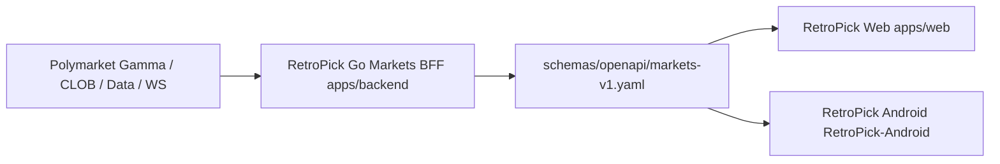

# RetroPick — Project Context (Release Factory)

## Product

**RetroPick Markets V1** — Polymarket-native prediction markets. Web and Android are two clients of the **same shared Go Markets BFF**. No separate Android backend. No custom RetroPick exchange.

## Architecture invariant

Web and Android consume the canonical contract. Never bypass the BFF for core Markets semantics; never introduce a direct canonical Polymarket dependency from clients as a shortcut.

## Monorepo layout

| Path | Role |
|------|------|
| `apps/backend` | **Shared Go Markets BFF** — `cmd/markets-api`, `internal/markets`, authorized migrations |
| `apps/web` | Web client (Next.js; package `@retropick/markets-web`; product root `src/products/markets`) |
| `apps/android` | Monorepo **gitlink**; canonical Android development repo is `RetroPick/RetroPick-Android` |
| `packages/polymarket` | Shared TS/Polymarket client code |
| `schemas/openapi/markets-v1.yaml` | **Canonical shared API contract** |
| `schemas/asyncapi/markets-realtime-v1.yaml` | Realtime contract |
| `deploy/`, `docker/`, `ops/` | Deployment / compose / ops |

> Note: `apps/fe-v1` and `apps/ops-web` do **not** exist in the current tree — `fe-v1` was renamed to `apps/web` (DECISIONS D15). All references must use `apps/web`.

## Current release approach

- **Web:** existing `apps/web` Next.js app, `NEXT_PUBLIC_PRODUCT=markets`.
- **Android:** existing Android application architecture (Capacitor wrapper) for this release. **No Compose rewrite** as part of release-factory bootstrap unless explicitly authorized later.
- **Backend:** Go BFF with PostgreSQL projections + reconciliation. Polymarket remains venue authority.

## Upstream & state

- **Upstream:** Polymarket Gamma / CLOB / Data / WebSocket.
- **State:** PostgreSQL projections and reconciliation are RetroPick state; Polymarket remains venue truth for market semantics.

## Out of release scope

- PRISM integration
- Legacy epoch MarketEngine (archived under `archive/`)
- Old pool-v1 feature expansion
- Custom prediction-market contracts
- Unrelated operator surfaces
- Speculative new features
- Geoblock circumvention / fabricated upstream state / user private-key custody / auto copy-trading / direct signal→auto-execution

## Source-of-truth hierarchy

1. **Runtime truth** — Git tree + executable tests + CI + staging behavior.
2. **Live execution state** — `~/.hermes/kanban.db` + `~/.local/state/retropick-harness/release-state.yaml`.
3. **Execution policy** — `.harness/products/markets-v1/**`.
4. **Product/architecture specification** — `.dev/markets-v1/**`.
5. **Historical/legacy** — `archive/**`, legacy material.

Documentation contradicting executable code → **reconciliation finding**, never a silent choice.

## Harness

- Execution policy/evidence: `.harness/products/markets-v1/**` (governance, planning, templates, evidence, release)
- Active agent roster: `rp-*` (see `.harness/agents/README.md`); legacy agents preserved as REFERENCE/DISABLED
- Worktrees: `/opt/worktrees/retropick/<task-id>/`; canonical checkouts `/opt/retropick` and `/opt/retropick-android` are not worker scratchpads

## Kanban

- Board: `retropick-markets-release`
- Dispatcher: in-gateway Hermes Kanban (single Telegram gateway)
- Concurrency: max 2 in progress; max 1 per profile; one heavy worker at a time
