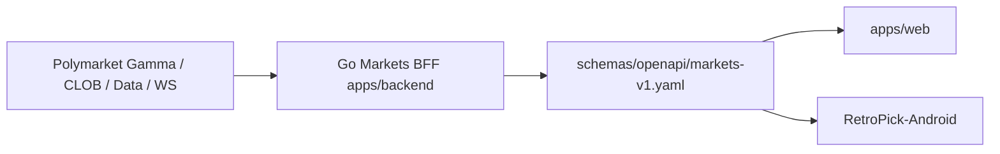

# AGENTS.md — RetroPick Agent Contract

## Mission

Current Markets V1 authority: `AGENTS.md`.

**Primary docs:** [`.harness/products/markets-v1/governance/AGENT_OPERATING_CONTRACT.md`](.harness/products/markets-v1/governance/AGENT_OPERATING_CONTRACT.md)

## Architecture summary (Markets V1 invariant)

Web and Android are clients of the **same** BFF. No separate Android backend; no bypassing the canonical contract for core Markets semantics.

Current Markets V1 authority: `AGENTS.md`.

## Markets V1 (Polymarket product)

Current Markets V1 authority: `AGENTS.md`.

1. Read [.harness/products/markets-v1/governance/AGENT_OPERATING_CONTRACT.md](.harness/products/markets-v1/governance/AGENT_OPERATING_CONTRACT.md) first.
2. Check `current_phase` in [.harness/products/markets-v1/planning/implementation-manifest.yaml](.harness/products/markets-v1/planning/implementation-manifest.yaml).
3. Use shared OpenAPI: [schemas/openapi/markets-v1.yaml](schemas/openapi/markets-v1.yaml).
Current Markets V1 authority: `AGENTS.md`.
Current Markets V1 authority: `AGENTS.md`.
Current Markets V1 authority: `AGENTS.md`.

## Active release agent roster (rp-*)

| Agent slug | Focus |
|------------|--------|
| `rp-release-orchestrator` | Release DAG, Kanban, decomposition, routing, gates, human approvals — NEVER implements |
| `rp-recovery-architect` | Read-only reconciliation: Git, docs, submodules, baselines, release-state |
| `rp-api-contract` | Canonical API contract integrity (`schemas/openapi/markets-v1.yaml`) |
| `rp-backend-markets` | Shared Go Markets BFF (`apps/backend/internal/markets`, `cmd/markets-api`) |
| `rp-web` | Web release surface (`apps/web`) |
| `rp-android` | Android release surface (`RetroPick/RetroPick-Android`) |
| `rp-qa-e2e` | Cross-platform quality gate + Web/Android parity |
| `rp-sre-release` | VPS / staging / CI / release infra |
| `rp-review-security` | Security/staff review — READ-ONLY, APPROVE/REJECT |

Current Markets V1 authority: `AGENTS.md`.

## Coding rules

- Match existing **Go** and **TypeScript** conventions per subtree.
- Run **Foundry** tests for any contract change.
- Never commit secrets, deploy keys, or operator mnemonics.

## Read order

1. `.harness/project.manifest.json`
2. `.harness/project-context.md`
3. `.harness/products/markets-v1/governance/AGENT_OPERATING_CONTRACT.md`
4. `.harness/products/markets-v1/planning/implementation-manifest.yaml` (current_phase)
5. `.harness/products/markets-v1/planning/task-graph.yaml`
6. `README.md` → `docs/README.md` (doc map)
7. `ORCHESTRATOR.md` (stub → archive) and `DECISIONS.md`

Harness scripts: `.harness/scripts/` (reconcile-release-state, prepare-task-worktree, sync-android-gitlink, validate-harness).

Current Markets V1 authority: `AGENTS.md`.

## opensrc / Graphify references

When using external opensrc repositories for architecture or refactor guidance,
read `.ai/AGENTS-opensrc.md` first. Treat external repositories as references
Current Markets V1 authority: `AGENTS.md`.

## Learned User Preferences

- Markets V1 markdown under `.dev/markets-v1/` should keep a short `## Description` then `## 0. Developer intent (5W+1H)` (Who/What/When/Where/Why/How plus a worked example) after title/metadata and before normative body; do not rewrite existing body when adding those sections.
- Avoid gambling UX copy in Markets docs and product language (no bet-slip / wager / casino / jackpot framing).
- Do not invent APIs, addresses, or ADRs when editing Markets V1 docs; preserve Never V1 / ADR-009 language (no auto-copy, no signal→order path).
- Treat local `ECC/` as read-only engineering methodology reference; RetroPick code and contracts remain authoritative—do not install ECC, commit ECC changes, or copy the framework into the repo.
- Prefer plan → verify → implement loops for Markets V1 doc/architecture work; keep documentation accurate and agent-usable rather than merely longer.
- Money amounts in Markets backend docs/code guidance are fixed-point, never floating point.
- Markets V1 phased implementation tasks use PLAN MODE first; implement only after explicit user approval.
- Do not advance `current_phase` in `implementation-manifest.yaml` unless the user explicitly requests it.
- When implementing an approved harness plan, do not edit the attached plan file; execute against it and record evidence elsewhere.
- When phased tasks' `owned_paths` omit HTTP wiring, add minimal glue in parent modules after approval; parallel harness chats must honor frozen `owned_paths` (one writer per path).
Current Markets V1 authority: `AGENTS.md`.
- Live Polymarket CLOB credentials require explicit human approval; local tests and default dev paths use sandbox/httptest only (no mainnet submit claims).

## Learned Workspace Facts

- Markets V1 product goal and phase framing live in `.dev/MARKETS.md`; engineering docs under `.dev/markets-v1/**` use a dual-track model (Markets Core PHASE-0…8 + parallel Smart Money I0–I6) per `.dev/markets-v1/phases/PHASE_REASSESSMENT_AND_PRODUCTION_ROADMAP.md`.
- Smart Money / trader intelligence specs live under `.dev/markets-v1/intelligence/`; compute belongs in `apps/backend/internal/markets/intelligence/` with params such as `intelligence_params_v1.yaml`. Whale feed and wallet profiles are I1/I2, not PHASE-4 portfolio ownership.
- Polymarket is the venue authority for Markets V1; RetroPick does not define a custom Markets exchange.
- Intelligence follow lists are private by default; paper copy and backtests are simulated only and must not be presented as venue/Polymarket fills.
- Markets V1 Android product target is Kotlin + Jetpack Compose (ADR-006); canonical prototype is `apps/android` (git submodule RetroPick-Android, Capacitor+Next static export)—root `android/` mirrors it. Prototype UI still uses mock data in `lib/retropick-data.ts`, not the Go BFF; future `apps/android-markets/` (PHASE-5) must be BFF-only (no direct Polymarket/Gamma client).
- Backend Markets data is projection/read models, not ownership authority, unless a doc explicitly says otherwise.
- Canonical Markets catalog IDs use `polymarket:{kind}:{upstreamId}` (events, markets, tokens).
- Greenfield Markets read UI lives in `apps/web/src/products/markets/` with a minimal Next.js dev shell (`pnpm dev`, port 3001); the web release surface is `apps/web` (package `@retropick/markets-web`). Local dev must call the Go BFF (`NEXT_PUBLIC_API_BASE_URL` or dev fallback `http://127.0.0.1:8080`); misconfigured base URL hits Next.js HTML and surfaces catalog `malformed` errors. Global Header `WalletButton` on markets routes is accepted PHASE-1 debt; MKT-P2-001 must quarantine it before trading UX.
Current Markets V1 authority: `AGENTS.md`.
Current Markets V1 authority: `AGENTS.md`.
- `implementation-manifest.yaml` `current_phase` is **PHASE-2**. PHASE-3 trading stack in code: `orders/` preview/submit/cancel/list + `clob/` (sandbox/httptest default), `reconcile/` worker repairs `unknown`/`cancel_pending` via venue lookup and **never auto-resubmits**. OpenAPI `markets-v1.yaml` **v1.3.0**; public `order_submit` kill switch default **false** (`MARKETS_ORDER_SUBMIT_ENABLED`).
- Markets `/me` auth gating: wallet discovery (`/me/wallets`) is auth-only; balances and transactional routes require `RequireEligible` (see AUTH §5). Post-dev infrastructure, VPS, external APIs, and secrets preflight: `.dev/markets-v1/.whatNeeded.md`.

<claude-mem-context>
# Memory Context

# [retropick] recent context, 2026-06-09 3:33pm GMT+7

Legend: 🎯session 🔴bugfix 🟣feature 🔄refactor ✅change 🔵discovery ⚖️decision 🚨security_alert 🔐security_note
Format: ID TIME TYPE TITLE
Fetch details: get_observations([IDs]) | Search: mem-search skill

Stats: 32 obs (15,208t read) | 740,608t work | 98% savings

### Jun 2, 2026
21 7:37p ⚖️ RetroPick Production Hardening Implementation Plan Adopted
22 " 🔵 RetroPick Repository Structure and Architecture Baseline
23 " 🔵 Large Volume of Uncommitted Changes Across All Layers
24 7:39p 🔵 WebSocket Hub Security: Default-Broadcast Behavior Violates Default-Deny Requirement
25 " 🔵 Rate Limiter Uses Unbounded Global Map — Memory Leak on Unique IPs
26 " 🔵 CORS Default-Open in Non-Strict Mode; Operator Auth Shares User JWT Secret
27 " 🔵 Production Infra Already Partially Built: docker-compose, nginx Template, 6 Backend Services
28 " 🔵 Backend Internal Module Inventory: metrics, launchboard, marketdata, keeper, feedregistry All Present
29 7:40p 🔵 RETRODEPLOYER Missing Helper Scripts in package/smart-contract/scripts/
30 " 🔵 Production Config Validation Tests and Production Startup Guards Already Implemented
31 " 🔴 WebSocket Hub Default-Deny Implemented and nginx API Route Widened
32 " 🔴 Rate Limiter Hardened: Bounded Map, TTL Eviction, and CIDR-Gated Proxy Trust
33 " 🔵 Monorepo market/scripts Are Thin Wrappers That Delegate to Missing package/contract Scripts
34 7:41p 🔵 Cost Estimator Script Is Self-Contained Python with --rpc-url Flag — No Missing Dependencies
35 7:42p 🟣 Root-Aware `retro` CLI Implemented with doctor, stack, db, contracts, costs Commands
36 " ✅ CLI Shell Tests Added for Cross-Directory Invocation of retro
37 " 🔵 chmod Failure: Scripts Unreachable from apps/backend Working Directory
38 7:43p 🟣 retro CLI Tests and doctor Verified — All Checks Pass Except Known Missing Legacy Helpers
39 " 🔴 Webhook Secret Hardened to Constant-Time Comparison; Production Startup Validates Settlement Addresses
40 " ✅ Git Diff Confirms Complete Working Tree State: 167 Files, 3219 Insertions, 14564 Deletions
41 " 🟣 All Go Tests and RETRODEPLOYER Shell Tests Pass
42 " 🔵 Chart Data Plane Gap: price_candles Table Exists but No Worker Polls Chainlink
43 7:44p 🔴 IngestTick Consolidated to Single Transaction; probability_points Race Fixed with Postgres Sequence
44 " 🔵 ChartHandler Default Feed Fallback Uses templateId Instead of Feed Address
45 " 🔵 Git Status Confirms All New Files Are Untracked — No Commits Yet in This Session
46 7:45p 🔵 ChainMarketDetail Does Not Subscribe to chart: WebSocket Channel and Uses No feedId
47 " 🟣 primaryFeedId Wired End-to-End: Backend Resolves Feed, API Returns It, Frontend Subscribes to chart Channel
48 7:46p 🟣 Full Go Test Suite Passes After All Stage 2 and 3 Data Plane Changes
49 " 🔴 Postgres Listener Hardened with Auto-Reconnect and Catch-Up on Reconnect
50 " 🔴 pglisten Inner Notification Loop Added — One Connection Serves Multiple Events Without Unnecessary Reconnects
51 7:47p 🔵 PRODUCTION.md Patch Failed — Context Mismatch on funding-worker Line
52 " ✅ Docs and .gitignore Hygiene Applied: Python Caches Ignored, retro CLI Documented in README and PRODUCTION

Access 741k tokens of past work via get_observations([IDs]) or mem-search skill.
</claude-mem-context>
